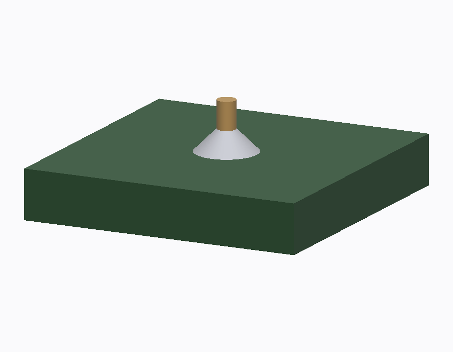
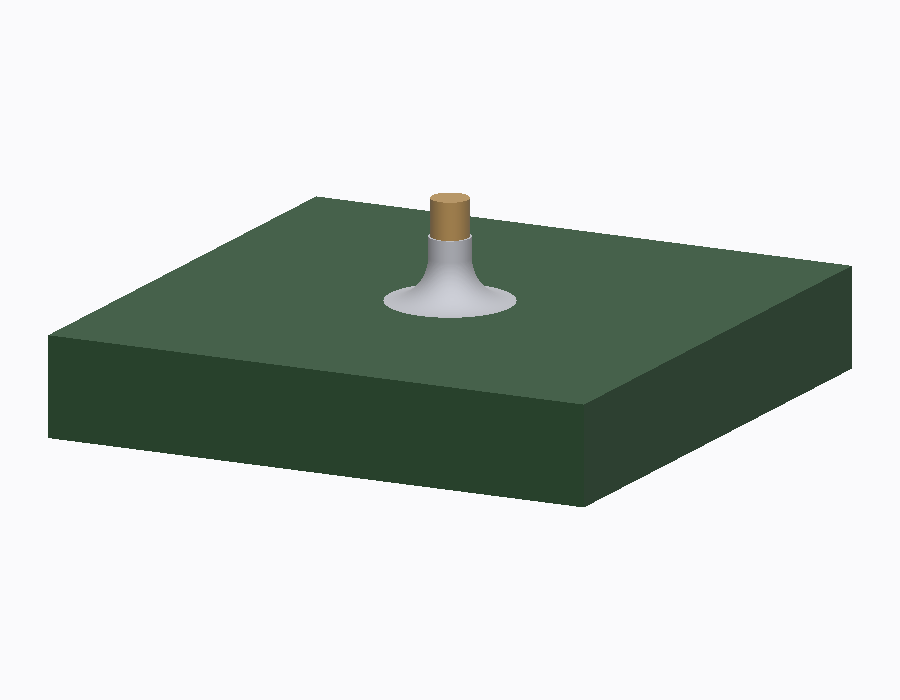

# DECISIONS.md — Decision Log

Append-only. One entry per decision, newest last. Every removal of code,
files, or public surface gets an entry (policy in `AGENTS.md`). Format:
date, decision, rationale, consequences.

**A note on numbering (2026-08-01).** `main` and `MJC` numbered independently
from ADR-060 while the branches were apart, so the merge arrived with two
ADR-060s, two ADR-061s and so on through ADR-067, plus two ADR-074s. `main`
is the trunk, so its numbers stayed and the twenty-seven `MJC`-only entries
moved to **ADR-075…ADR-101**, in the order they were written. Commit messages
made before 2026-08-01 use the old numbers; the map is

| was, on `MJC` | is now |
|---|---|
| ADR-060…067 | ADR-075…082 |
| ADR-069…072 | ADR-083…086 |
| ADR-074…088 | ADR-087…101 |

ADR-069…072 are consequently **vacant**: `MJC` had reserved them and `main`
never used them. ADR-054 has been vacant since the teardown.

**And once more (2026-08-05).** Two branches numbered independently again on
the same day: the organic-modelling run wrote ADR-123…130 while the `cdx-rl`
work wrote its own ADR-123 and ADR-124. The organic run kept its numbers,
because ADR-123…130 are cited by name in `shell/` and in four docs; the two
`cdx-rl` entries moved to the end, in the order they were written:

| was, on `cdx-rl` | is now |
|---|---|
| ADR-123 — a policy's command range | **ADR-131** |
| ADR-124 — `--init-from` | **ADR-132** |

Their commits, `57be248a` and `6c4dca31`, still say 123 and 124. The only
code citing either was `--init-from`'s two references to the command range,
repointed at ADR-131 in the merge.

---

## ADR-001 — Single-engine xscript (inherited, 2026-07)

**Decision.** Cadex has exactly one scripted modeling engine: xscript.
build123d, OpenSCAD, and the native per-workbench tool packs were deleted;
the 18 VibeScript domains were culled to 4 (partdesign, sketcher, part,
assembly).

**Rationale.** One methodology, one sandbox, one publication contract.
Multi-engine surfaces multiplied validation, docs, and provider-tool
complexity without product value.

**Consequences.** Inherited from the VibeCAD `cadex-teardown` branch (6
phases; see that repo's history). Guardrail tests
(`src/Mod/cadex/cadex_tests/test_tool_surface_guardrails.py`) assert the
culled modules stay gone. Recorded here retroactively at repo import.

## ADR-002 — Blender shell endpoint, staged path (2026-07-24, owner)

**Decision.** The product shell is the Blender fork (`/Users/theo/mesh`);
cadex becomes a headless xscript geometry service (**cadexd**) streaming
tessellated BREP + face/edge ID maps into Blender. Path is staged (option D
with endpoint B in `docs/INTEGRATION.md`): near-term work stays engine-side
in this repo and carries over.

**Rationale.** `mesh_agent` already prototypes the exact target UX; Coin3D
is a dead end for Blender-level feel; BMesh solves mesh editing natively;
the engine already runs headless. License direction is clean (LGPL engine →
GPL shell across a process boundary).

**Consequences.** Qt/Coin3D investment is capped (Phase 3 is layout-only);
Phases 5–7 in `docs/ROADMAP.md`; a measured decision gate before Phase 5
re-validates the endpoint.

## ADR-003 — One project script (2026-07-24, owner)

**Decision.** The user-visible artifact is a single top-level project script
(`model.py`-style) that composes the domain APIs; parameters are declared at
its top; the document/scene is a rebuildable cache. The per-domain
multi-program runtime may persist only as an internal staging detail.

**Rationale.** Product principle: nothing happens outside the script; exact
full state is rebuildable from the script at any time. Proven shape in
`mesh_agent` (`docs/BLENDER.md`). One readable artifact beats a set of
per-domain programs no user can hold in their head.

**Consequences.** Phase 2 in `docs/ROADMAP.md` (project-level params,
publisher lint, orphan GC, digest-checked headless rebuild). `docs/XSCRIPT.md`
Part II specifies the target.

## ADR-004 — Removal policy replaces additive-only (2026-07-24, owner)

**Decision.** The repo-wide additive-only rule is retired. In
`src/Mod/cadex/**` and `docs/**`, subtractive change is encouraged; for
inherited FreeCAD core (`src/App`, `src/Gui`, `src/Base`), stay
conservative. Every removal is logged here and verified by build + tests.

**Rationale.** The project philosophy is "remove more than we add"
(`docs/VISION.md`). The inherited `AGENTS.md` mandated the opposite and was
written for a different phase (guarding a large inherited surface during
active multi-engine development).

**Consequences.** Policy text lives in `CLAUDE.md`. Phase 1's tree removals
become normal, logged work instead of exceptional approvals.

## ADR-005 — AGENTS.md retired in favor of CLAUDE.md (2026-07-24)

**Decision.** `AGENTS.md` deleted. `CLAUDE.md` is the single agent entry
point: repo map, commands, doc index, change policy, methodology.

**Rationale.** `AGENTS.md`'s core mandate (additive-only, removals need
case-by-case approval) contradicted ADR-004 and the product philosophy; it
also referenced a nonexistent `AI_POLICY.md`. Two competing agent
instruction files is one too many.

**Consequences.** Agents read `CLAUDE.md` first. PR hygiene expectations
(small coherent diffs, honest test reporting) carried over into `CLAUDE.md`.

## ADR-006 — Phase-0 hygiene removals (2026-07-24)

**Decision.** Deleted the 14 stale `_DOMAIN_WORKER_BUNDLES` entries in
`src/Mod/cadex/CadexScriptedRuntime.py` (draft, surface, spreadsheet,
material, bim, mesh, meshpart, points, reverse_engineering, inspection,
robot, fem, cam, techdraw) and the two dead lazy imports of deleted
`xscript_*` workers in `src/Mod/cadex/CadexScriptedDomains.py`. Moved
`docs/vibescript-system-design-feasibility.md` and
`src/Mod/cadex/RUNTIME_VERIFICATION.md` to `docs/history/` with superseded
banners.

**Rationale.** The entries referenced `xscript_*` files that no longer
exist; the docs described the pre-teardown state as current.

**Consequences.** Substantial dead culled-domain code remains — ~24 more
lazy `xscript_*` imports inside unreachable helpers in
`CadexScriptedRuntime.py`, plus unreachable branches in
`CadexScriptedDomains.py` and `CadexScriptedDomainPublication.py` — all
catalogued in `docs/FREECAD.md` §4 and scheduled for Phase 1. Deliberately
not swept in Phase 0: removing them means deleting whole functions across a
16k-line file, which needs its own audited, test-verified pass.

## ADR-007 — Phase 1 batch A: 13 unused trees deleted (2026-07-24)

**Decision.** Deleted `src/Mod/{AddonManager, BIM, CAM, Fem, Inspection,
OpenSCAD, Plot, ReverseEngineering, Robot, Surface, Tux, Web}` and the
never-built `src/Mod/TemplatePyMod`, following the two-commit protocol
(disable commit `8f98463`, then delete). Their `BUILD_*` options,
`REQUIRES_MODS` lines, `src/Mod/CMakeLists.txt` blocks, and satellite
references (NETGEN find logic, `SetupLark.cmake`, PySide6 QtSvgWidgets
BIM consumer, final-report lines, FEM/CAM/BIM visual-test scenes, the
Start view's Draft/BIM tiles) went with them. The AddonManager submodule
entry was removed from `.gitmodules`.

**Rationale.** No runtime domain, tool, or UI path reaches these trees
(`docs/FREECAD.md` §3); the product ships four domains. Remove more than
we add.

**Consequences.** Batch B (Draft, Points, TechDraw, Spreadsheet) follows
after the cadex grid is reimplemented without Draft and the assembly BOM
feature is dropped (see ADR-008/ADR-009). `pixi run configure` on an
existing build dir needs the removed `BUILD_*` cache entries purged
(`cmake -U`) or a fresh build directory.

## ADR-008 — Assembly bill of materials dropped (2026-07-24)

**Decision.** The assembly BOM feature is removed end to end:
`api.bill_of_materials` and the `bom` output type from the cadex assembly
domain (API, worker, runtime validation, publication, prompt text, tests,
`CadexAssemblyBOM.py`), and the native substrate from the Assembly module
(`Assembly::BomObject`/`BomGroup` + Python bindings, `ViewProviderBom*`,
`CommandCreateBom.py`, task panel, icons, `Assembly_CreateBom`
registration). Assembly no longer links or imports Spreadsheet;
`REQUIRES_MODS(BUILD_ASSEMBLY …)` drops `BUILD_SPREADSHEET`.

**Rationale.** `Assembly::BomObject` inherits `Spreadsheet::Sheet` — the
BOM was the only thing keeping the Spreadsheet tree alive. Owner chose
dropping the feature over keeping Spreadsheet as substrate (v0.0.1
planning, 2026-07-24). v0.0.1 assemblies are geometry + joints; a parts
table can return later on a cadex-owned substrate if wanted.

**Consequences.** Spreadsheet becomes removable (batch B). The assembly
source-hierarchy snapshot keeps its `bom_properties` field name — it feeds
the reference-contract hash; renaming it is a schema bump left for later.

## ADR-009 — Phase 1 batch B: Draft, Points, TechDraw, Spreadsheet deleted (2026-07-24)

**Decision.** Deleted `src/Mod/{Draft, Points, TechDraw, Spreadsheet}`
and `tests/src/Mod/{Points, Spreadsheet, TechDraw}` following the
two-commit protocol (disable commit `237d5d8`, then delete). Options,
`REQUIRES_MODS` lines, `src/Mod/CMakeLists.txt` and test gates,
final-report lines, and the Draft/TechDraw/Spreadsheet visual-test
scenes went with them. Kept-tree residue removed in the disable commit:
Part's `TestPartMirror.py` and PartDesign's `Scripts/Gear.py` (both
imported Draft); Part's two `BUILD_SPREADSHEET`-gated tests
(`testIssue2671`, `testIssue2876`) deleted with the tree.

**Rationale.** Unreachable from the four-domain product surface. The two
former dependents were unwound first: the viewport grid is cadex-owned
as of Phase 1.3 (no Draft), and the assembly BOM was dropped in ADR-008
(no Spreadsheet).

**Consequences.** Every tree under `src/Mod/` is now kept:
Part, PartDesign, Sketcher, Assembly (domains); Import, Material,
Measure, Mesh, MeshPart, Show, Start, Test, Help (support); cadex (the
engine). Residual culled-domain code inside cadex referencing
draftutils/Points dies in the Phase 1 dead-code sweep.

## ADR-010 — Phase 1 dead-code sweep of src/Mod/cadex (2026-07-24)

**Decision.** Deleted the remaining unreachable culled-domain code paths
from the engine, completing the residue sweep promised in ADR-009.
`CadexScriptedRuntime.py` was swept from ~21.4k to ~7.8k lines in the
first pass. This pass swept the other two files:

- `CadexScriptedDomainPublication.py` (11,202 → 6,732 lines): the whole
  draft, BIM, spreadsheet, material-card, TechDraw, and CAM publication
  chains — `_create_draft_object`/`_configure_draft`/
  `_draft_object_compatible`/`_draft_configure_order` (~365 lines), the
  `_create_bim_object`/`_configure_bim`/`_bim_*` family incl. rollback
  (~760 lines), `_configure_sheet` + spreadsheet rollback (~145 lines),
  `_material_card_state` + the full material carrier/appearance chain
  incl. `_publish_material_candidate` and `_delete_material_program`
  (~1,050 lines), the `_techdraw_*` family incl.
  `_publish_techdraw_candidate` and `_delete_techdraw_program`
  (~1,030 lines), the `_cam_*` family incl. `_publish_cam_candidate`
  and `_delete_cam_program` (~1,010 lines), plus the culled branches in
  `_native_type`/`_create_object`/`_configure_object`/
  `publish_candidate`/`delete_live_program`, the culled entries in
  `_NATIVE_TYPE_BY_OUTPUT`, orphaned `PROP_MATERIAL_*`/
  `PROP_APPEARANCE_*`/`PROP_CAM_VALIDATION`/`PROP_TECHDRAW_VALIDATION`/
  `MATERIAL_OWNERSHIP_SCHEMA` constants, `_BIM_ASSIGNED_PROPERTIES`/
  `_BIM_LINK_PROPERTY_TYPES`, and the orphaned
  `_set_native_property`/`_require_native_property` helpers.
- `CadexScriptedDomains.py` (4,904 → 4,626 lines):
  `_draft_document_snapshot` (138 lines), `_bim_document_snapshot`
  (120 lines), their `domain_context_snapshot` entries, and the
  now-unreferenced `MAX_DRAFT_CONTEXT_*`/`MAX_BIM_CONTEXT_*` constants.

**Method.** Grep for imports of deleted trees (`draftutils`, `ArchSite`,
`xscript_spreadsheet_worker`, `xscript_material_worker`,
`xscript_techdraw_worker`, `xscript_cam_worker`, `CadexXScriptCAM`);
delete each containing function whole; chase callers recursively with an
AST reference graph until only the four-domain dispatchers remained;
delete newly unreferenced module constants. Verified with the full
engine pytest suite green (387 passed, 1 skipped) after each file, and a
final zero-hit grep gate over `src/Mod/cadex` (guardrail tests that
assert the culled modules stay gone excepted).

**Consequences.** No engine file references a deleted tree. Culled-domain
helper code that touches only kept trees (mesh/points/fem/inspection/
robot snapshot+rollback helpers, TechDraw page summaries in
`CadexCore.py`) is never dispatched but still present — follow-up sweep
material, tracked in `docs/FREECAD.md` §4.

## ADR-011 — One project script: store + lifecycle, no v2 migration (2026-07-24)

**Decision.** The project domain becomes the fifth internal domain: ONE
script per project executed by one multi-domain worker
(`cadex_project_worker.py`), with `sketcher`/`part`/`partdesign`/
`assembly` APIs plus `params`/`num` staged as script globals. The store
(`cadex-project-script-v1`) lives at `<project>/script.py` (the sole
source of truth) + `<project>/script.json` (param spec cache, values,
working/accepted revision, accepted contract, accepted digest, latest
candidate) + `script_artifacts/<revision>/`. Revision =
`project_script_revision` over `{schema, domain:"project", source,
param_specs, param_values}`. Tools: `xscript.project.{write_script,
edit_script, set_params}`; `edit_script` reuses the unique-match
replacement machinery; `set_params` patches values only. Expected
outputs are recorded from the executed result (accepted contract), not
pre-declared. Assembly components take part/partdesign values created
in the same script, resolved worker-side to in-run serialized BREPs;
cross-document component references retire (rigid same-script solids in
v0.0.1; flexible subassemblies out of scope).

**Rationale.** docs/VISION.md: one project script as the sole source of
truth. The per-domain v2 program surface forced the model to shard one
design across programs and pre-declare outputs.

**Consequences.** Existing v2 per-domain program stores are NOT
migrated (pre-release; owner decision 2026-07-24): conversations are
preserved by their own store, scripts start empty. The per-domain
lifecycle tools dissolve in the Phase 2 tool-surface swap.

## ADR-012 — Project-script publication: one transaction, ownership lint, orphan GC (2026-07-24)

**Decision.** `publish_project_candidate`
(`CadexScriptedDomainPublication.py`) applies ONE validated multi-domain
project result to the live document under ONE transaction ("Publish Cadex
project script"), reusing the per-domain publishers with new keyword-only
`manage_transaction`/`check_surface` flags (defaults preserve the
per-domain behavior). Same-script assembly component sources are
tightened: every source must be a DECLARED part/partdesign output (the
worker's build-on-demand path for undeclared part payloads is removed);
the worker reports `component_sources: {token: output_name}` and
publication rewrites each token to the live object published in the same
pass. After the sub-publishes, still inside the transaction: orphan GC
removes owned objects whose (domain, base output name) left the accepted
contract (`CadexScriptedOwnership.orphaned_outputs`), and an ownership
lint aborts the transaction with `PUBLICATION_UNTAGGED_OBJECT` if any
document object falls outside the program's owned closure
(`owned_closure`/`untagged_objects`). `accept_project_candidate`
(`CadexScriptedRuntime.py`) persists accepted revision/contract/digest to
the script store. `CadexDigest.document_digest` adds a diagnostic
document-side digest (`cadex-document-digest-v1`) that is deterministic
across publishes of one revision (it intentionally does not equal the
worker digest).

**Rationale.** docs/VISION.md: the script is the sole source of truth, so
publication must be atomic, own every document object, and collect what
the script no longer produces.

**Consequences.** Undeclared component sources now fail worker-side with
a correction message; project publication carries no per-domain surface
check (there is no workbench surface for the project domain).

## ADR-013 — Phase 2.4 tool-surface swap: one project script is the only mutation surface (2026-07-24)

**Decision.** The per-domain multi-program tool surface dissolves. The ONLY
mutation surface is `xscript.project.{write_script, edit_script, set_params}`
plus the read-only `xscript.project.describe_api`; every other model-facing
read lives in `core.inspect` (new scope `script` for source, params,
revisions, accepted contract/digest, and the latest candidate; scopes
`domain` and `program` are removed; scope `api` now returns the project
describe payload). The surface is GLOBAL: `resolve_modeling_surface` returns
the project surface for any workbench (surface generation
`project-v1-single-script`); the workbench no longer selects a domain and
`UNSUPPORTED_WORKBENCHES` is dropped. Removed in the same swap:

- The dissolved per-domain lifecycle tools
  (`xscript.<domain>.{create_program, edit_source, set_inputs,
  set_parameter_controls, reconfigure_program, delete_program,
  inspect_program, describe_api}`) and their spec builder
  (`domain_tool_specs`); `register_project_tools` registers the four
  project tools instead.
- The editable Model Code Editor `CadexScriptedEditor.py` (3223 lines) with
  all of its `CadexGui.py` registration/menu/command wiring (Python-only; no
  C++ referenced it).
- The per-domain host lifecycle in `CadexScriptedRuntime.py` (8254 → ~950
  lines): capture/prepare/finalize/validate/accept/retain per-domain
  candidates, reference capture, per-domain host validators
  (part/sketcher/assembly execution validation), inspection/delete/controls
  plumbing, and the domain adapter registry + the four adapter classes. The
  project path keeps `_stage_worker_bundle` (project bundle only),
  `execute_candidate`, `_worker_environment`, `_staged_artifact_path`,
  `_apply_replacements`, `_merge_patch`, and the project lifecycle;
  `describe_project_api` composes the project describe payload from the
  live capability APIs.
- The per-domain provider context/document snapshots and program-contract
  validation in `CadexScriptedDomains.py` (4695 → ~660 lines): domain
  context snapshots for every workbench, `complete_domain_context`,
  manifest migration (`migrate_program_manifest`), `program_revision*`,
  input/schema/output validation, and the adapter registry. The capability
  packs remain as worker execution/publication contracts with an empty tool
  surface.
- The session domain dispatch and editor-candidate bridges in
  `CadexSession.py`, replaced by `_run_project_xscript_tool`
  (capture → prepare → execute → validate → publish → accept with the
  existing thread-dispatch/cancellation/progress plumbing; failures persist
  via `record_project_candidate_failure` and return `model_state` with
  `next_write_expected_revision` = the store's working revision).
- Test suites superseded by `project_xscript_api_integration.py`: the four
  per-domain integration suites, `domain_xscript_worker_integration.py`,
  `test_partdesign_xscript_v2.py`, `test_xscript_parameter_controls.py`,
  `test_scripted_editor_architecture.py`, and the partdesign schema golden
  fixture. `qt_domain_worker_heartbeat_integration.py` was adapted to the
  project lifecycle. `test_tool_surface_guardrails.py` pins the new exact
  surface and asserts the dissolved operations stay gone.

Net: ~24.8k lines deleted, ~1.3k added.

**Rationale.** docs/VISION.md and ADR-011: one project script is the sole
source of truth; a per-domain multi-program surface contradicts it and
carries an order of magnitude more host machinery than the project path
uses.

**Consequences.** `CadexParametersPanel.py` is intentionally untouched: it
still imports `CadexSession.run_domain_xscript_operation` (now a structured
`DOMAIN_TOOLS_RETIRED` failure stub) and
`domain_program_index_snapshot`/`complete_domain_program_index` (now an
always-empty index), both unreachable in practice because the project
surface lists no per-domain programs. Phase 2.5 rewires the panel to the
project script's `param_specs` and deletes these compatibility symbols.
Resurrecting any per-domain lifecycle machinery is a direction change and
needs a new ADR.

## ADR-014 — Phase 2.5 Parameters panel bound to the project script (2026-07-24)

**Decision.** `CadexParametersPanel.py` reads its rows from the project
script's declared parameters and commits changes through
`xscript.project.set_params`. The heuristic control-guessing layer dies.

- Row source: `script.json` `param_specs` (declaration order) +
  `param_values`, read via `CadexProjectScriptStore` (`_project_parameters`).
  The pure `spec_control(spec, value)` helper resolves each declared spec to
  slider metadata — declared `label`/`unit`/`min`/`max`/`step`/`description`
  win per-field; missing bounds fall back to a value-bracketing band widened
  so the stored value is always reachable, rounded outward onto the step
  grid.
- Commit: `CadexSession.run_project_xscript_operation` (the
  `run_domain_xscript_operation` retirement stub replaced by this public
  wrapper over `_run_project_xscript_tool`) with
  `{"values": {name: value}, "expected_revision": working_revision}`.
  `STALE_PROGRAM_REVISION` re-guards from `observed.current_revision` and
  retries once; failures track `model_state.next_write_expected_revision`
  (a failed rebuild advances the working revision on disk) and revert the
  row — accepted live geometry is never touched by a failed commit.
- Deleted: `heuristic_control`, `resolve_control`, the name-token
  unit/angle/count heuristics, the program-selector combo box and its
  `_active_xscript_surface`/`_list_xscript_programs` plumbing, and the
  ADR-013 compatibility symbols
  (`domain_program_index_snapshot`/`complete_domain_program_index` in
  `CadexScriptedDomains.py`). One project script — there is nothing to
  select.

**Rationale.** D6 (plan): parameter controls are declared in the script
(`params(width=num(...))`), so guessing ranges from parameter names is dead
vocabulary; the panel must ride the same guarded rebuild path as the
provider tools so a slider drag and an assistant edit are
indistinguishable to the store.

**Consequences.** Undeclared parameters no longer get invented sliders —
the panel shows exactly what the script declares. Resurrecting the
heuristics needs a new ADR.

## ADR-015 — Phase 3 shell: 50/50 layout + native-route lockdown (2026-07-24)

**Decision.** The interim Qt shell converges on the product layout within
the capped-investment rule (no Coin3D work, no new workbench-style UI):

- **Read-only script view** (`CadexScriptView.py`): a QPlainTextEdit dock
  rendering `script.py` from the store. Not an editor — mutations go
  through `xscript.project.*` or the sliders. The editable Model Code
  Editor died in ADR-013.
- **50/50 split**: a main-window event filter re-issues `resizeDocks` on
  every Show/Resize, sizing the visible right-column docks to half the
  window width. The signal-severing constraint is load-bearing:
  `QMainWindow.addDockWidget`/`splitDockWidget` on FreeCAD-managed docks
  at runtime severs other panels' Python signal connections, so docks are
  never repositioned after registration. Consequence: the stable
  top-to-bottom order is tree / parameters / script / chat (creation
  order — the C++ tree dock exists first, the assistant pin appends
  last), not the nominal chat-first order; reordering would require the
  forbidden runtime repositioning.
- **Native-route lockdown** (re-applied on every chrome pass, since
  workbench activation rebuilds menus and shortcuts): the menu bar is
  rebuilt to one Cadex menu (About / Preferences / Quit — Preferences
  stays reachable because the API keys live there); every non-allowlisted
  QAction shortcut is stripped; a tree event filter swallows ContextMenu
  and MouseButtonDblClick; a Gui document observer resets any native edit
  session that no tool sanctioned (`sanction_native_edit`, called by
  `partdesign.edit_sketch`; the sanction is consumed when the session
  closes).

**Rationale.** docs/VISION.md: a user session touches only chat, sliders,
tree, script view, viewport. Blocking routes beats hiding chrome the next
workbench activation would re-show.

**Consequences.** Manual FreeCAD modeling is unreachable in the shell;
resurrecting any native route is a direction change and needs an ADR. The
whole layer is disposable with the Qt shell (docs/INTEGRATION.md).

Verified by adversarial GUI probe: minimal menu and empty shortcut table
before and after workbench-switch attempts; hidden toolbars; blocked tree
context menu; unsanctioned sketch edit reset while the sanctioned one
survives; 50/50 held at three window sizes.

## ADR-016 — Phase 4 minimal mesh domain (2026-07-24)

**Decision.** Mesh joins the project script as the fifth capability domain
(`cadex_mesh_api.py` / `cadex_mesh_worker.py` on `Mod/Mesh` + `Mod/MeshPart`),
scoped to the roadmap's minimal surface:

- **API** (`MeshDomainAPI`, staged as the `mesh` global): `from_shape`
  (tessellate a same-script part value via `MeshPart.meshFromShape`),
  `import_file` (one flat STL/OBJ/PLY from `<project>/assets/`), `union` /
  `difference` / `intersection` (native mesh set operations), `decimate`.
  One output type: `mesh`. Export needs no new tool — `file.export_model`
  already meshes and writes `Mesh::Feature` objects.
- **Pipeline**: evaluation order becomes sketcher → part → partdesign →
  mesh → assembly; mesh outputs export one binary PLY artifact and a
  vertex-set geometry fingerprint that joins the content digest
  (`mesh_sha256`; brep entries unchanged, so existing digests stay
  stable); validation imports the detached native mesh off-thread;
  publication reuses the pre-existing `mesh`-domain apply routine
  (`_configure_mesh` → `Mesh::Feature`) inside the ONE project
  transaction. The tool surface is unchanged: capability packs carry no
  tools (ADR-013).
- **Asset staging**: `prepare_project_candidate` copies the project's flat
  `assets/` mesh files (64 files / 128 MB cap, known suffixes, no symlinks)
  into the worker staging dir; `mesh.import_file` resolves only against
  that staged copy, so the sandbox never reads the durable tree.
- **Mesh determinism, measured and handled in two layers.** The native set
  operations are non-deterministic at the representation level — measured
  run to run (even within one process): (a) identical point sets returned
  in permuted vertex/facet order, and (b) occasionally a *different
  triangulation* of the same coplanar cut region (same surface and vertex
  set, facet count 371 vs 372). Layer 1: the worker rebuilds every mesh in
  canonical order (vertices sorted, facet cycles rotated to the smallest
  index, facets sorted) — immediately after each boolean, so downstream
  consumers like decimate see one deterministic input, and again before
  export. Layer 2: the content digest identifies a mesh output by a
  SHA-256 over its sorted exact vertex set (`geometry_sha256` →
  `mesh_sha256`), not artifact bytes — triangulation-invariant, exact (no
  rounding, so no quantization boundary flips). Layer 3: `decimate` is an
  *approximating* kernel (GTS-derived edge collapse with
  address-dependent tie order — measured ≥3 distinct results across runs
  of identical input), so decimate outputs and every value built on one
  carry no geometry fingerprint and are digest-identified by their
  canonical definition instead (`payload_sha256`;
  `payload_tree_is_deterministic`). Verified: an 8-output mixed
  part/assembly/mesh script (tessellation, boolean union, decimation, STL
  import) rebuilds digest-stable across repeated headless runs on both
  the release and pixi FreeCAD builds (20+ seed+rebuild+rebuild cycles);
  union vertex sets were exact across ~100 measured worker runs.
- **Removal**: the stale generic-builder entry
  `_DOMAIN_OPERATION_OUTPUT_TYPES["mesh"] = {"from_object": "mesh"}`
  (culled-domain residue) is deleted; the mesh domain now has an explicit
  production API class like the other four.

**Rationale.** docs/ROADMAP.md Phase 4: the fourth-plus capability area
through the same pipeline, with rebuild determinism intact. No interactive
mesh editing — that waits for BMesh in the Blender shell (Phase 6).

**Consequences.** Mesh booleans inherit the native kernel's geometric
behavior (set operations, not exact CSG); partdesign/sketcher values are
not tessellatable in v1 (only part values — partdesign Bodies build through
their own document machinery). Both are candidates for the cadexd protocol
era if needed.

## ADR-017 — Phase 5.1–5.3: cadexd, the headless engine service (2026-07-25)

**Decision.** The xscript engine runs behind **cadexd**, a persistent
headless FreeCADCmd process speaking schema `cadex-cadexd-v1` — newline-
delimited JSON over stdio, one cadexd child per open project, spawned and
owned by the shell. Owner decisions locked 2026-07-25:

- **Document of record stays in the shell** (the .FCStd saved by the Qt
  app). cadexd hosts an *ephemeral* headless `App::Document` per project
  (the `cadex_rebuild` pattern) so publication semantics — ownership lint,
  contract-driven GC, output identity, document/object inspect — run
  engine-side. Both documents are rebuildable and digest-verified.
- **Latency: parity only.** The worker is still spawned per run; a
  warm-standby worker is documented future work, not built.
- **Transport: stdio NDJSON**, 8 MB frame cap; binary artifacts are
  referenced by filesystem path, never inlined.

Mechanics (`CadexdProtocol.py` — pure, FreeCAD-free; `cadexd.py` — entry,
`pixi run cadexd`):

- Ops: `open_project, describe_api, write_script, edit_script, set_params,
  rebuild, resolve_pin, inspect, cancel, shutdown`. The INTEGRATION.md
  sketch's `run` dissolved into the real lifecycle ops so the
  `STALE_PROGRAM_REVISION` guard and failure envelopes carry over verbatim.
  Lifecycle responses are **exactly** the accept payload / `tool_failure`
  envelope the in-process session tool produced (shared engine entry
  `CadexScriptedRuntime.run_project_lifecycle`, also used by
  `cadex_rebuild` — net-zero), plus a per-output `display` block
  `{artifact_kind, artifact_path (absolute), placement, tessellation|null}`.
- **Restore pass**: every `open_project` with an accepted digest re-runs
  THE script into the fresh ephemeral document and asserts digest equality
  — each open re-proves restart determinism (`CADEXD_RESTORE_FAILED`
  otherwise).
- **Budgets** resolve once at `open_project` (request args, preferences
  fallback) and reach the pipeline via `service.scripted_budgets()`.
- **stdout-pollution defense**: fd 1 is dup()ed to a private protocol fd
  before FreeCAD can print, then redirected to stderr. stdin EOF is the
  lifetime signal (shell death ⇒ self-exit).
- **Serial dispatch**: one modeling request in flight; a concurrent
  modeling request is refused `CADEXD_BUSY` by the reader thread;
  read-only requests queue; `cancel` reaches the running worker through
  the existing `run_process` kill path (`RUN_CANCELLED`). cadexd itself
  runs *without* `--safe-mode` (trusted engine code); user scripts stay in
  the per-run `--safe-mode` worker sandbox.
- `inspect` serves `script/api/image` (store) and `document/object`
  (ephemeral document); `selection` is rejected as shell-only.

Supporting engine capabilities landed with it:

- **5.1 Display tessellation + ID maps** (`cadex_tessellation.py`, staged
  into the project worker bundle): per BREP output one
  `cadex-tessellation-v1` artifact — binary buffer (f32 vertices, u32
  triangles, f32 edge polylines) + JSON sidecar whose
  `face_ranges`/`edge_polylines` map spans back to the exact 1-based
  Face/Edge enumeration of `face_details`. Adaptive deflection
  `clamp(rel × bbox_diagonal, 0.05, 5.0)` with coarse/standard/fine
  presets (explicit override wins); mesh outputs emit a trivial one-range
  map. Opt-in per request (`display`), computed after the digest —
  **digest-neutral by construction and by test**.
- **5.2 Headless pin resolution** (`CadexPinResolution.py`): resolves
  `{output, selection}` against the accepted revision's staged BREP.
  `script.json` gained `accepted_attempt` (attempt id + staging path;
  the accepted attempt directory is pinned — no GC exists). Selections are
  the exact `_query_subelements` fingerprint vocabulary (reused by import
  from `cadex_partdesign_worker`) or a direct `{element_type, index}`
  (client picking path: triangle → `face_ranges` → index happens
  client-side). `CadexReferenceContracts.resolve_interface` stays the
  document-bound twin.

**Verification.** Stub suites for codec/dispatch/cancel/pin/tessellation;
FreeCADCmd integrations `tessellation_id_map_integration.py`,
`pin_resolution_integration.py`; ctest `CadexdLifecycle` drives a real
cadexd child end-to-end including kill -9 → respawn → restore digest
equality and a mid-run cancel. `CadexProjectRebuildDigest` unchanged and
green over the shared-lifecycle refactor.

**Consequences.** The branding contract admits exactly one non-prefixed
module name (`cadexd.py` — the service's product name). The worker staging
bundle grew by `cadex_tessellation.py`. Progressive tessellation and the
warm-standby worker remain future work under the Phase 6 gate.

## ADR-018 — Phase 5.4–5.5: shell switchover; the in-process path is removed (2026-07-25)

**Decision.** The Qt shell drives **all** modeling through cadexd; the
in-process capture→execute→publish path inside `CadexSession` is gone.

- **Seam**: `run_project_xscript_operation` kept its signature — the
  Parameters panel and provider dispatch are byte-for-byte unchanged
  callers. `_run_project_xscript_tool` now resolves the project's client
  (`CadexdClient.client_for_project`, budgets read from preferences on the
  document thread), sends the lifecycle op, forwards progress events to
  the chat UI, and polls cancellation every 50 ms (a `cancel` frame
  reaches the running worker). `describe_api` stays local — it is pure
  authoring metadata, identical on both sides of the protocol.
- **Hydration** (`CadexShellHydration.py`): on the Qt document thread, ONE
  transaction (one undo step) mirrors the accepted contract into the
  .FCStd of record — find-or-create `Part::Feature`/`Mesh::Feature`
  display objects keyed by the existing xscript ownership tags, solved
  assembly placements applied, revision tag updated, **contract-driven
  GC** (tagged objects whose output left the accepted contract are deleted
  with their closure — robust across cadexd restarts, and it sweeps
  publication-era native objects on first hydration after the
  switchover). Hydration failure returns `SHELL_HYDRATION_FAILED` while
  the engine state is already accepted — a documented asymmetry; the next
  success self-heals. The per-output `display` block is consumed
  shell-side and stripped from the provider-visible payload, which
  therefore stays exactly the pre-split contract.
- **Crash policy**: child death or timeout mid-request →
  `CADEXD_CRASHED` envelope, client marked dead, next request respawns
  and replays `open_project` (the panel already self-heals via
  `STALE_PROGRAM_REVISION` / `next_write_expected_revision`). Clients are
  killed on document close (`slotDeletedDocument`) and at exit.
- **Inspect routing**: `core.inspect` scopes `document/object/script/api/
  image` route to cadexd (engine truth: the ephemeral document and the
  store); `selection` stays shell-local. Without an open project the
  local read-only path answers as before.
- **Removals**: the in-process lifecycle body in `CadexSession` (replaced
  by the client call); `CadexGui`'s publication-internal hooks —
  `slotChangedObject` → `mark_programs_stale_from_source` (shell objects
  are display mirrors; human edits no longer feed engine dependency
  state) and the document-open input-snapshot compaction / assembly
  dependency-anchor migration (publication metadata no longer lives in
  the shell document). Verified by build + tests in this change.
- **What stays shell-side and why**: viewport + selection (the only
  viewport), the .FCStd document of record (persistence + undo), the
  provider loop and chat UI, the Parameters panel (reads `script.json`
  specs; commits through the same guarded seam), reference-image store
  access. The pipeline modules stay in-tree — the split is
  **process-level**, cadexd and `cadex_rebuild` run them — and the new
  guardrail `test_engine_shell_split_guardrails.py` pins that
  `CadexSession`/`CadexGui`/`CadexParametersPanel`/`CadexShellHydration`/
  `CadexdClient` never import `CadexScriptedDomainPublication`,
  `CadexScriptedProcess`, or the pipeline entry points.

**Measured.** `cadexd_shell_switchover_integration.py` (client → cadexd →
worker → hydrate on the 24-hole/fillet/mesh-skin baseline part): median
set_params drag **0.479 s** over 10 drags (bar ≤ 0.65 s; in-process
baseline 0.57 s) — protocol framing + hydration cost less than the
in-process publication it replaced, with the per-drag worker spawn still
dominating (warm-standby worker remains future work). GUI smoke (probe
script in the real `freecad-release` shell, tools on a worker thread with
document-thread dispatch): write_script hydrates one `Part::Feature` +
one `Mesh::Feature`, a set_params drag updates the geometry, each
accepted revision is exactly ONE undo step, and undo restores the prior
accepted geometry.

**Consequences.** Undo in the shell now spans exactly one hydration
transaction per accepted revision (display mirrors), not per-domain native
feature edits; engine-truth inspection reflects cadexd's ephemeral
document. Resurrecting an in-process modeling path is a direction change
requiring an ADR and owner sign-off.

## ADR-019 — Phase 6: the Blender shell speaks cadexd (2026-07-25)

**Context.** Phase 5 left cadexd as the sole modeling path with the Qt
shell as its first protocol client. The confirmed endpoint (ADR-006,
`docs/INTEGRATION.md`) is the Blender shell: the `mesh_agent` prototype in
`/Users/theo/mesh`. Two decision-gate criteria still needed shell-side
evidence: ID-map/picking fidelity in a real viewport, and slider-drag
latency through the full shell path.

**Decision.** `mesh_agent` gains a cadex backend as a third assistant mode
("Cadex CAD", `modes.py backend: "cadexd"`) **alongside** the local-exec
path — same chat, same tool names (`get_script`/`write_script`/
`set_params`), routed per mode. All integration code is new files in the
mesh repo (additive-only policy holds; ledger updated):

- `cadexd_client.py` — GPL, dependency-free NDJSON stdio client; spawns
  `FreeCADCmd -c "import cadexd…"` per project root (found via add-on
  preference / `MESH_FREECADCMD` / PATH; module dir `<prefix>/Mod/cadex`).
  No cadex imports: the process boundary is the integration contract and
  the LGPL↔GPL seam. Crash → `CADEXD_CRASHED` envelope, respawn + reopen
  on next request.
- `cadex_backend.py` — per-scene session (project root beside the .blend,
  `<stem>.cadex/`), revision-guarded lifecycle ops with one
  `STALE_PROGRAM_REVISION` self-heal retry, engine `param_specs` bridged
  into the same `scene.mesh_params` PropertyGroup the local path uses
  (slider drag → debounced `set_params` via `model.rebuild()` backend
  dispatch — the only edit to the local loop).
- `cadex_hydrate.py` — `cadex-tessellation-v1` buffers → mesh objects in
  the Model collection: per-triangle **`cadex_face` INT face attribute**
  (1-based BREP face ids from `face_ranges`), `cadex_edge` wire child,
  placement matrices, contract-driven GC keyed by a `cadex_output`
  custom property (mirrors ADR-018's Qt hydration).
- `cadex_pick.py` — viewport pick: ray-cast → polygon → `cadex_face` →
  `resolve_pin {element_type, index}`; resolved pins are queued and
  attached to the next chat message like image attachments.
- One `undo_push` per chat turn is unchanged (verified through the real
  bridge in cadex mode).

**Progressive display (engine-side addition).** Streaming standard-quality
tessellation on every drag cost ~0.86 s extra on the baseline part. New
`"draft"` quality preset (relative deflection 0.05) in
`cadex_tessellation.py`; the Blender shell requests
`{quality: "draft", edges: false}` while a drag is in flight and issues a
background `rebuild` at `standard` once the drag settles (cancelled by the
next drag; revisions are content-derived so the refine keeps the accepted
revision). Verified by `cadex_tests` (424 passed).

**Measured** (`tests/python/bl_mesh_agent_cadex.py`, headless Blender
5.3.0-alpha against the release cadexd; gate report
`CADEX-BLENDER-GATE`):

- **Picking fidelity 100%** (372/372 ray-cast picks; bar ≥ 99%) on the
  tessellation corpus (box, cone, torus, drilled+filleted plate), with
  every one of the 40 BREP faces' tessellation aggregates (area,
  centroid, planar residual) matching the engine's `resolve_pin` truth;
  ID-map attributes byte-identical to the sidecar ranges; mesh-domain
  outputs refuse pins.
- **Slider-drag median 0.548 s** (bar ≤ 0.65 s) on the 24-hole/fillet/
  mesh-skin baseline — through Blender → cadexd → worker → tessellation
  → numpy hydration, i.e. *including* the display streaming the Qt
  measurement (0.479 s) did not carry. Post-drag refine: 1.38 s.
- Engine restart: reopen rehydrates geometry, params, and script text
  from the store.

**Consequences.** The decision gate's shell-side criteria are met in the
real shell; Phase 7 (convergence) is unblocked. The per-drag worker spawn
still dominates drag latency; the warm-standby worker remains the named
lever for sub-100 ms drags. Blender remains display-only: engine truth
lives in the cadexd project store, and the mirrored `model.py` text block
is read-only context, not a rebuild input.

## ADR-020 — Phase 7 shape: the Blender shell is the product (2026-07-25, owner)

**Decision.** Phase 7 converges the two shells into one product. Six
sub-decisions, all owner-approved:

1. **The Qt shell is retired outright** — not kept as a headless harness.
   This closes the open question at `docs/VISION.md` (Qt shell's fate). The
   deletion covers the UI *and* the provider stack it exists to serve:
   `CadexGui`, `CadexSession`, `CadexProvider`, `CadexCore`, `tool_impl/`,
   the conversation store, prompt starters. **No API-key provider path
   survives**: the product's model loop is the Claude Code CLI running
   inside Blender (`mesh_agent`'s `backend.py`), and a second model loop in
   a second shell is exactly the duplication this phase removes.
2. **Scope** is three tracks in order: close the seven blocking Blender
   gaps (M) → delete the Qt shell (C) → packaging, onboarding, docs (P/O).
3. **One bundle.** The Blender application carries the cadex engine as a
   payload; the add-on defaults to it. A user installs one thing. This is
   affordable because `BUILD_GUI=OFF` takes ~250 MB (Qt6, PySide6, Coin,
   `lib*Gui*`) off the engine payload — see ADR-022/ADR-023.
4. **Conversation history lives in the `.blend`**, alongside the Claude Code
   `session_id`. This ratifies Phase 6's `history.py` and **explicitly
   reverses** `docs/INTEGRATION.md`'s open-question lean toward the cadexd
   project store / `$CADEX_HOME`. Rationale: the conversation is shell
   state, not engine state; the engine has no notion of a turn. One file
   the user can move, copy, and mail is worth more than a second store.
5. **Local (mesh-native) modes stay**; `CADEX` becomes the default mode.
   General and Part Design modes remain for mesh-native work. This is a
   knowing exception to ADR-003 and `docs/VISION.md`'s "one project script
   is THE user-visible artifact": in Cadex mode the project script is the
   artifact, and the local modes are a *different product surface* (direct
   BMesh authoring) that happens to share a chat panel. Recorded rather
   than silently kept; revisit if the two script formats start leaking into
   each other.
6. **The mesh repo's additive-only upstream policy ends here.** Phase 7
   modifies upstream Blender files for the first time — the default app
   template and the engine install rules. `docs/mesh/UPSTREAM_DIFFS.md`
   gains its first "Modified upstream files" rows. (See ADR-024.)

**Rationale.** Phase 6's gate closed in the real shell (ADR-019: 372/372
picks, 0.548 s drag median). Carrying two shells for one engine past that
point costs a second model loop, a second hydration path, a second
packaging story, and a doc set that has to describe both. The exit
criterion — *a new user only ever sees the Blender shell* — is not
reachable while the cadex repo still ships a user-facing application.

**Ordering.** Blender gaps first, Qt deletion second. Deleting Qt first
would turn five working reference implementations into archaeology while
the mesh work is in flight: cancellation polling through the protocol,
budget resolution, contract-driven GC with document-close lifetime, and
the revision-guard commit path. The latency-evidence objection is handled
by landing C0 (a client-agnostic engine benchmark) before the Qt client is
deleted.

### The engine discovery contract `cadex-engine-v1` `[Cadex-new]`

Fixed here so both repos can code against it before either implements it.
A packaged engine payload is a directory containing a manifest file named
**`cadex-engine.json`** at its root:

```json
{
  "schema": "cadex-engine-v1",
  "version": "0.0.2",
  "protocol": "cadex-cadexd-v1",
  "freecadcmd": "bin/freecadcmd",
  "module_dir": "Mod/cadex"
}
```

- `schema` — literal `"cadex-engine-v1"`. A shell that does not recognise
  the value must refuse the payload, not guess.
- `version` — the cadex engine version the payload was built from.
- `protocol` — the cadexd wire protocol the payload speaks
  (`docs/INTEGRATION.md`). A shell checks this, not `version`.
- `freecadcmd` — path to the command-line FreeCAD binary, **relative to the
  manifest's directory**, using forward slashes on every platform.
- `module_dir` — path to the directory that must be on `sys.path` for
  `import cadexd` to work, same relative-path rule.

**The manifest is the point.** Shell-side discovery becomes "find
`cadex-engine.json`, read two paths out of it" instead of guessing at
`<prefix>/Mod/cadex` vs `<prefix>/../Mod/cadex` vs a macOS `.app` interior.
That retires the layout-guessing bug class permanently, on all three
platforms, and it lets a developer point at a dev build by dropping one
file. Discovery order (shell side): explicit preference → `MESH_FREECADCMD`
→ bundled manifest → `PATH`.

**Consequences.** Phase 7 in `docs/ROADMAP.md`; a new Phase 8 for the
`src/Gui` tree removal that ADR-022 defers. ADR-021 (Qt deletion), ADR-022
(GUI build off), ADR-023 (one bundle), ADR-024 (onboarding) implement this
one. `docs/VISION.md`'s Qt open question is answered and its Qt non-goal
becomes historical. `docs/INTEGRATION.md` becomes the two-repo contract
document.

## ADR-021 — The Qt shell and the provider stack are deleted (2026-07-25)

**Decision.** Phase 7 track C removes the Qt shell and everything that
existed to serve it. This repository stops being an application.

**Inventory.** UI layer (C3): `CadexGui`, `CadexExperimentalMode`,
`CadexParametersPanel`, `CadexScriptView`, `CadexGrid`,
`CadexExperimentalChat`, `CadexPromptStarters`, `InitGui`, nine SVGs, the
`Cadex_Resources` install set, and the three Qt preference pages.
Provider/session stack (C4): `CadexSession`, `CadexProvider`, `CadexCore`,
`CadexAuth`, `CadexCodex`, `CadexDebug`, `CadexTransactions`,
`CadexPointArtifacts`, `CadexGeometry`, `CadexAssemblyHierarchy`,
`CadexEditState`, `CadexPreferences`, the whole `tool_impl` package,
`requirements.txt`. Protocol seam (C5): `CadexdClient`,
`CadexShellHydration`. `src/Mod/cadex` went from 57 Python modules to 34.

**No API-key provider path survives.** The product's model loop is the
Claude Code CLI inside Blender; a second one here was duplication.

**The four splits that made it possible (C1, C2).**

1. `CadexEngineSettings.py` — the engine needed exactly two numbers out of
   `CadexPreferences`, which imported `CadexAuth`/`CadexDebug`/
   `CadexPromptStarters` at module scope.
2. `CadexScriptStore.py` — `CadexProject` was two stores in one module;
   only the script store is engine state. Measured effect: cadexd's
   transitive closure lost `CadexProject`.
3. `test_engine_purity_guardrails.py` — an AST closure walk with a
   `KNOWN_RESIDUE` ledger that named each remaining forbidden edge and the
   commit that would remove it, and failed when an entry stopped being
   true. It guarded C3/C4 as they happened and is now empty.
4. C2 cut `CadexReferenceContracts`'s dead `tool_impl` edge, established by
   instrumenting a real publication (`managed: []`, `_rebind_one` never
   entered), not by reading.

**`requirements.txt` is deleted, not emptied.** `jsonschema` had one
importer (`ToolRegistry`) and one other user (`ToolSpec.validate_arguments`),
both provider machinery. The engine now needs FreeCAD's own runtime and
nothing else — which is what lets ADR-023's payload be a directory of files
rather than an environment.

**Test reshaping.** 36 files / 425 tests → 20 files / 154 tests, inside the
declared acceptance band of **150–200**: above 200 would mean something
Qt-shaped survived, below 150 that an engine contract was dropped. Two
files the plan expected to survive in half did not:
`test_geometry_references` died whole (all 12 tests drive `CadexCore`'s
viewport-selection capture; the fingerprint contract is produced by the
workers, matched by `CadexPinResolution`, and covered by
`test_pin_resolution` plus `pin_resolution_integration`), and
`test_model_context_contract` kept 4 of 20 rather than ~10. Three files
were renamed in C7 (`test_project_tool_surface`,
`test_engine_identity_contract`, `test_engine_defaults_and_envelopes`) and
`CLAUDE.md`'s "not subject to relaxation" clause was updated in the same
commit, so the guardrail it names still exists.

Contracts asserted through the UI were preserved, not dropped:
`TestStageAwareFailureRendering` (which tested `CadexGui`'s transcript
renderer) became `TestFailureEnvelopeContract`, asserting every
`FAILURE_STAGES` value round-trips and the `tool_failure` envelope's keys
are stable — the Blender shell parses exactly those keys, across a
repository boundary.

**The successor evidence (C0).** `cadexd_latency_integration.py` re-established
the switchover measurement client-agnostically **before** C5 deleted the
client that produced it: the same 24-hole/fillet/mesh-skin baseline and ten
`set_params` drags over raw NDJSON. Measured 0.457 s engine-only (Qt-era
0.479 s) and 0.557 s with the draft display block (Blender-era 0.548 s).
The bar survives the client.

**Consequences.** `docs/INTEGRATION.md` becomes the two-repo contract
document, and `test_engine_purity_guardrails` now asserts
`CadexdProtocol.OP_ARG_SPECS` equals its op table — with the shell in
another repository, the document is the contract and a doc↔code
cross-check is the only thing that catches cross-repo drift.

## ADR-022 — GUI build off; `isVibeExperimentalModeSession` reverted (2026-07-25)

**Decision.** Release and package builds set `BUILD_GUI=OFF`. The
`isVibeExperimentalModeSession` hook is reverted to stock FreeCAD. The
`src/Gui` tree is **not** deleted in Phase 7.

**The hook (C6a).** It let a Cadex "experimental mode" session suppress
stock chrome — toolbars, docks, the status bar, overlay state, the Start
page's first-start view and workbench autoload. Its UI died in C3, and the
preference defaults **true**, so keeping it would have meant a FreeCAD that
hides its own interface for a shell that no longer exists.

Fifteen sites: `src/Gui/MainWindow.cpp` (7 uses + the definition),
`MainWindow.h` (the declaration), `ToolBarManager.cpp` (2),
`DockWindowManager.cpp` (1), `OverlayWidgets.cpp` (1),
`src/Mod/Start/Gui/StartView.cpp` (3), `AppStartGui.cpp` (1).

**Conservative-zone justification.** `CLAUDE.md` asks for the smallest
possible diff in inherited core. This change *reduces* the fork's delta
against upstream FreeCAD to zero in every file it touches — it is the most
conservative-zone-friendly change available, because it removes fork code
rather than adding any. The "Vibe" identity leaves the tree entirely and
`_ALLOWLISTED_VIBE_RESIDUE` empties. The lowercase-preference-group test
inverts accordingly: it now asserts the inherited GUI core reads *nothing*
of ours, across five files.

**`BUILD_GUI=OFF` (C6b).** Two blockers, found by a throwaway configure
spike, each fixed in three lines without changing GUI-on behavior:
`LinguistTools` was gated behind `BUILD_GUI` although `src/App` compiles
translations with the GUI off (it is a build tool, not a runtime library);
and the `Gui` test suite plus `setup_qt_test(InventorBuilder)` link
`FreeCADGui`, so both are now guarded the way every kept workbench already
guards its own `Gui` subdirectory.

Scope is narrow on purpose: only the `conda-release` preset and
`package/rattler-build/build.sh`. `pixi run configure` (debug) still builds
the GUI, so a breakage here cannot block daily work.

**Measured**, GUI build vs GUI-less build of this tree: `lib/` 43 MB →
8.3 MB, `Mod/` 49 MB → 22 MB, files matching `*Gui*` 93 → 8, and `bin/`
reduced to `FreeCADCmd` + `CadexGeometryWorker`. 61 MB off this
repository's own output; the larger saving (Qt6 ~85 MB, PySide6 ~52 MB,
Coin ~7 MB) is dependency weight the payload no longer carries, realised
in ADR-023.

**`src/Gui` is deferred, not kept.** It is 66 MB / 729 files plus every
`src/Mod/*/Gui`, and `BUILD_GUI=OFF` captures 100% of the size and
build-time benefit with a zero-line conservative-zone diff. Per
`docs/FREECAD.md` §3's removal protocol, **this is the disable commit**;
the delete commit is Phase 8.

**Gate.** Both cadex ctests pass against the GUI-less build
(`CadexProjectRebuildDigest` 1.64 s, `CadexdLifecycle` 3.75 s), with zero
new failures against the environmental baseline.

## ADR-023 — One bundle: the engine ships inside the shell (2026-07-25)

**Decision.** This repository stops producing a user-facing application and
starts producing an **engine payload**. The Blender shell carries it and
finds it by manifest. A user installs one thing.

**The payload** (`package/engine/build_engine_payload.sh`):

```
cadex-engine-<version>-<os>-<arch>/
  cadex-engine.json     the discovery manifest (schema in ADR-020)
  bin/{freecadcmd,CadexGeometryWorker,python}
  lib/                  no Qt GUI, no PySide, no Coin
  Mod/{cadex,Part,PartDesign,Sketcher,Assembly,Mesh,MeshPart,Import,
       Material,Measure,Show}
```

Descended from `osx/create_bundle.sh` minus the `.app` wrapper, icon
pipeline, DMG and the two provider-install scripts — none of which survive
ADR-021.

**The manifest is the point.** Shell-side discovery becomes "find
`cadex-engine.json`, read two paths out of it" rather than guessing at
`<prefix>/Mod/cadex` vs `<dir>/../Mod/cadex` vs a macOS `.app` interior.
That retires the layout-guessing bug class on all three platforms at once,
and lets a developer point at a dev build by setting one variable.

**Correction to the plan's Qt claim.** "The audit reports zero
Qt/PySide/Coin" is not achievable: FreeCAD's App layer links **Qt6Core and
Qt6Xml**, and `FreeCADCmd` inherits that (verified with `otool -L`). The
gate implemented is the one that matters — no widget toolkit, no Qt Python
bindings, no scene-graph renderer — and the build script *prints* the Qt
libraries it does carry, so the exception is visible rather than silent.
Verified on the first payload: Qt6Core, Qt6Xml, Qt6Concurrent, Qt6Network,
Qt6DBus, and none of Gui/Widgets/Quick/Qml/OpenGL/Svg/PrintSupport/UiTools,
no PySide, no shiboken, no Coin/Quarter/SoQt, no `libFreeCADGui`.

**The gate: ctest `CadexEnginePayloadSmoke`.** It runs
`test_cadexd_lifecycle.py` against the *packaged* tree, discovered through
its manifest exactly as the shell discovers it. Strictly stronger than the
`--cadex-launcher-smoke` it replaces (which ran `freecadcmd --version`),
and it reuses a test that already existed.

**It immediately earned its keep.** The first packaged engine could not
model at all: `DOMAIN_CANDIDATE_FAILED`, `No module named 'PySide'`.
`src/Mod/Assembly/JointObject.py` imported PySide, `pivy.coin` and its
preferences page at module scope, and the cadex assembly worker imports
that module for `Joint`, `GroundedJoint` and `JointTypes` — pure
App-level document classes. Every test to date had passed because the
development environment happens to have Qt installed. Those imports are now
guarded: the feature classes import headlessly; the task-panel and
view-provider classes, which nothing headless instantiates, raise clearly if
touched. **No packaging gate weaker than "run the real lifecycle against
the real payload" would have caught this.**

**Shell side (mesh repo).** `build_files/cadex_engine.txt` pins the version
and a SHA256 per platform; `fetch_cadex_engine.py` verifies and stages, and
**refuses an unpinned platform** rather than downloading it. The install
rules live behind `WITH_CADEX_ENGINE` in `source/creator/CMakeLists.txt`:
`Blender.app/Contents/Resources/cadex` on macOS, `<install>/cadex`
elsewhere.

**Workflows.** `cadex-macos.yml` and `cadex-windows-installer.yml` deleted;
`cadex-release.yml` rewritten as `cadex-engine.yml` (same triggers; no
AppImage, deb, 7z or NSIS). `src/Main/CadexPortableLauncher.cpp` is **kept**
against the plan: it is also the source for `CadexCmdPortableLauncher`, a
Windows launcher for `FreeCADCmd` that belongs to the engine.

**Verified** with `MESH_FREECADCMD` unset, against a payload placed where a
bundle carries it: preflight green with zero configuration, and
`CADEX-BLENDER-GATE` ok with `engine_from_bundle: true` — picking 372/372,
slider median 0.572 s, restore performed, cancel honoured.

**Open.** macOS notarization of the embedded engine (hardened runtime,
per-binary entitlements for a `freecadcmd` that spawns subprocesses and
dlopens OCCT) is not yet exercised. Linux and Windows payloads build but
have no shell CI.

## ADR-024 — Onboarding: Cadex is what a new user meets (2026-07-25)

**Decision.** The Mesh app template is the default, Cadex is the default
mode, the engine needs no configuration, and engine failures are visible to
the user.

**Default app template.** `UserDef::app_template`'s DNA default changes
from `""` to `"Mesh"`. Chosen over editing `creator_args.cc`: a data default
in a header conflicts as a data blob on upstream merges, argument-parsing
code conflicts as logic, and `--app-template default` escapes to stock
Blender either way. Only a fresh profile takes the default.

**Default mode.** `modes.DEFAULT_MODE` becomes `CADEX` and it leads the
mode list. The local modes (General, Part Design) remain for mesh-native
work — the tension with `docs/VISION.md`'s "one project script is THE
user-visible artifact" is recorded in ADR-020 decision 5, not silently kept.

**Zero configuration.** The engine-path preference now reads "leave empty
to use the cadex engine bundled with Mesh". `preflight()` — written in
Phase 6 and never once called — reports from three surfaces: the
preferences panel (with the resolved path when green), the chat panel in
Cadex mode, and the first cadex tool call, where the model previously
received a raw subprocess traceback and now gets a sentence plus "do not
retry".

**Error surfaces.** `cadex_backend`'s failure reports are written for the
model: structured, detailed, and invisible to the person watching the
panel. A rejected script, a rejected parameter change and an unavailable
engine each add one line to the transcript, because otherwise a rejected
revision looks exactly like a hang.

**The additive-only upstream policy ends here** (ADR-020, decision 6).
`docs/mesh/UPSTREAM_DIFFS.md` gains its first "Modified upstream files"
rows — three, each with what changed, why, and what a conflict in it would
mean — and its policy text changes from "never edit" to "every edit is
listed here, kept minimal, and justified".

**Consequence worth recording.** Flipping the default broke three tests
that had been relying on `GENERAL` being it. They now state which path they
exercise instead of inheriting a default. Tests that depend on an unstated
default are exactly what a default change should find.

## ADR-025 — One project: OCCT kept, FreeCAD and Blender dropped (2026-07-25, owner)

**Decision.** Cadex becomes **one application** — a derivative of, but not
dependent on, either FreeCAD or Blender. Parametric BREP parts and
assemblies, mixing parametrics and meshes over time, in a body that acts and
feels like Blender, entirely agentic and script-driven, with no human edit
controls. Four owner decisions settle the shape:

1. **Keep OCCT, drop FreeCAD.** OCCT is the geometry kernel; FreeCAD is the
   application layer around it, and that layer is what we have spent seven
   phases removing. What remains of it — `App::Document`, the recompute
   graph, the property system, `Part::TopoShape` — is the part we still pay
   for and no longer want.
2. **The shell is Rust + wgpu + egui.**
3. **The local bpy modes (GENERAL, PART_DESIGN) are deleted**, resolving
   ADR-020 decision 5's knowing exception in favour of one script format.
4. **The engine stays Python**, calling OCCT through our own pybind11
   binding rather than through FreeCAD's.

**What this reverses.** ADR-002 (Blender as the product shell) and ADR-020
(the Blender shell *is* the product) — the shell becomes ours. ADR-023 (the
engine ships inside the shell bundle) — there is one bundle because there is
one application, not because one hosts the other. ADR-001 survives in
substance and not in mechanism: xscript remains the single scripted modeling
engine, but the substrate under it stops being FreeCAD. `docs/VISION.md`'s
non-goals lose "a second shell of any kind" — the Rust shell is not a second
shell, it is the first one we own.

**What we actually own** (measured against source, not estimated).
**5,840 lines of domain API** (`cadex_{part,sketcher,partdesign,mesh,assembly,project}_api.py`)
define the xscript vocabulary — 94 user-facing ops — and import FreeCAD zero
times; 17 of 34 engine modules are already FreeCAD-free. The protocol
(`CadexdProtocol.py`, 187 lines, zero FreeCAD imports) is a real process
boundary. **Pins resolve by geometric fingerprint, not `TopoDS` name** — the
most kernel-portable decision in the codebase. In the shell, `backend.py`,
`bridge.py`, `mcp_shim.py` and `cadexd_client.py` carry zero `bpy`.
`CadexGeometryWorker.cpp` (1,031 lines) is pure-OCCT, FreeCAD-free, and
currently has no caller; its `TriangleBvh` + `meshDistance` + `BRepGProp` +
`BRepCheck` is roughly 80% of the differential oracle Phase 11 needs. It is
the **oracle seed, not the binding seed**: 20 OCCT headers, zero
construction API.

**What must be rebuilt or vendored.** planegcs (13,311 lines, LGPL-2.1+)
vendored, with the 5,772-line `Sketch.cpp` translation rewritten for the 32
exposed constraint variants. OndselSolver (41,385 lines, LGPL-2.1) vendored,
with its 2,218-line bridge and ~4,900 lines of FreeCAD Python rewritten.
`modelRefine.cpp` (1,491 lines, two strippable FreeCAD headers) vendored
as-is. PartDesign feature semantics for the 19 exposed ops (~6k lines) is
genuinely new code. The mesh kernel and decimator — FreeCAD-native and
non-deterministic, per ADR-016 — are replaced by **manifold** (MIT).

**Licensing.** Dropping Blender *removes* a GPL obligation; that is a
simplification, not a cost. Vendored LGPL code (OCCT, planegcs,
OndselSolver, `modelRefine`) carries an attribution obligation that cannot
be erased by rewriting around it. "References to neither" is achievable for
dependencies, API names and runtime; it is **not** achievable for the NOTICE
file, and we do not pretend otherwise.

**Rationale for the order: engine first, not shell first.** The plan was
shell-first. Auditing, rather than reasoning, reversed it on three counts.

*Subshape enumeration is a model input, not a display contract.* Five ops —
`subshape`, `defeature`, `fillet`, `chamfer`, `thicken` — take 1-based
`TopExp::MapShapes` ordinals as **script arguments**, saved in
agent-authored programs. An enumeration shift does not break a pin the way a
missing pin breaks: it silently builds *different geometry* that passes
`isValid()`, then shifts every downstream index, and compounds with no
alarm. This is a latent bug **today**, independent of any migration — those
indices break on any parameter change that alters topology, which is the
entire point of parametric CAD.

*The real risk is unverifiability, not difficulty.* 41 of 49 `part` ops, 32
constraint variants, 13 joint types and 19 PartDesign features have no
recorded expected behaviour anywhere; a spot check of 15 ops (`loft`,
`sweep`, `thicken`, `slice`, `project`, `repair`, `sew`, `general_fuse`,
`helix`, …) found zero test hits across both repositories. The content
digest is defined not to match across kernels for BREP — **and not for mesh
either**: `mesh_sha256` is triangulation-invariant but not
kernel-invariant, and manifold's boolean vertices are neither bit-identical
to FreeCAD's nor equal in count. So Phase 11's failure mode is not a wall,
it is a grind with no "done" signal. The counter is **characterization
testing recorded from the current engine before it is touched**.

*Shell-first has no measurable payoff and the worst stall state.* The
0.548 s slider median is dominated by the per-drag `FreeCADCmd --safe-mode`
spawn; a new shell inherits that cost and cannot beat it. Picking is already
372/372. A stall after a shell-first phase leaves us maintaining a new Rust
application *and* a 500k-line FreeCAD fork taking no upstream merges, having
deleted the shell we got for free. A stall after the engine phase leaves a
shippable product on a working Blender shell.

**Consequences.** `docs/ROADMAP.md` gains Phases 9–13 and Phase 8 gains one
item (`cadex_assembly_worker.py` imports `CommandCreateView` — GUI-lineage
code used headlessly; that dependency is verified during the `src/Gui`
deletion, not in Phase 11). Phase 10 is a **go/no-go gate**, not a
formality: a two-day enumeration probe, then a time-boxed characterization
of ten of the deepest ops. If ten ops take a week, ninety-four take two to
three months of archaeology before a line of the new engine exists — and
that number, not the size of the binding, decides whether Phase 11 starts.
Two new gates land in Phase 9 (`test_response_schemas.py`, and an OCCT
enumeration fingerprint) because everything downstream assumes contracts
that are currently assumed rather than asserted.

**STEP import/export is promoted to a first-class engine deliverable.**
`file.export_model` / `file.import_model` are named in
`CadexModelingSurface.py` with no implementation and no cadexd op; the only
export today is `bpy.ops.wm.stl_export` of *display tessellation*. A
parametric CAD application that cannot emit STEP is not a product. It is
scheduled in Phase 11, not left to the shell.

**Open.** The honest time shape is not knowable before Phase 10's probe and
time-box; the binding is weeks, the characterization is the unknown that
sets the scale. Whether parameter sliders count as "human edit controls" is
resolved in favour of *no* — `docs/VISION.md` principle 5 has humans steer
via chat **and** sliders. macOS notarization of a Rust application bundling
an OCCT engine that spawns subprocesses remains unexercised (inherited open
item from ADR-023).

## ADR-026 — Phase 9: the unreachable publication paths are deleted (2026-07-25)

**Decision.** Delete the publication paths no live domain can reach — the
subtractive half of Phase 9 (ADR-025).

**The deletion.** `CadexScriptedDomainPublication.py` goes from 7,012 to
3,613 lines — **3,399 removed, 48%**. The five live domains are exactly
`assembly`, `mesh`, `part`, `partdesign`, `sketcher`
(`XSCRIPT_WORKBENCH_PACKS`); publication dispatches on `pack.domain`, so
every `robot` / `fem` / `inspection` / `points` / `reverse_engineering` /
`meshpart` / `surface` branch was unreachable. Not merely unreachable —
**unrunnable**: those workbench trees were deleted in Phase 1 (ADR-007/009),
so `import ObjectsFem`, `import Inspection` and `import Robot` in the
create-object factories could not have resolved since.

Removed: 7 dispatch branches, 50 dead functions (the `_configure_*` bodies
and their whole rollback/restore/freeze machinery), 19 module constants, and
the `*_data` response keys for those domains — which no engine module
produces and, checked against `/Users/theo/mesh`, no shell consumes.
`_configure_mesh`'s `data_key` / `validation_property` parameters went with
`meshpart`, its only other caller.

**Method, because "delete the dead code" is where the bodies get buried.**
Branches first, then an AST reachability walk from the module's real entry
points — the names other modules and tests import, plus everything public,
plus module-level statements — iterated to fixpoint, twice (round 2 found
`_FEM_RESULT_VECTOR_LISTS`, reachable only from a constant round 1 had just
removed). Then the same sweep for constants, refusing to remove any name
another file references. Then an undefined-name check. The tests were the
weakest evidence here and are stated as such: unreachable code cannot be
exercised by a suite, so reachability was proved structurally and the suite
only confirms nothing *else* broke.

**Consequences.** The suite stays green at 154 tests. The contract gates
that Phase 9 also calls for land separately in ADR-027; the mesh-repo half
of Phase 9 (the local bpy modes, the app template) is its own repository's
commits.

## ADR-027 — Phase 9: the request half of the contract was tested, the reply half was prose (2026-07-25)

**Decision.** Pin the two contracts everything downstream of ADR-025
assumes: the shape of every cadexd response, and the kernel's subshape
ordering.

**Response schemas** (`OP_RESPONSE_SPECS`, `NESTED_RESPONSE_SPECS`,
`validate_response`, `cadex_tests/response_schemas/*.json`).
`OP_ARG_SPECS` pinned requests; replies were prose. Fixtures were recorded
from a live cadexd and reduced to shape — every leaf is its JSON type name,
so no digest, temporary path or machine state is committed and a diff means
the contract moved. `docs/INTEGRATION.md` gains a response table, enforced
against the code the same way the op table already was.

Wiring the validator into `test_cadexd_lifecycle`'s client — so real frames
are checked, not only fixtures — immediately found three shapes the
recording had missed, which is the argument for doing it that way:

1. **Server-level failures are a different envelope.** `CADEXD_*` codes
   produce `{ok, failure_code, error}`; a tool-level failure produces
   twelve keys the agent reads and acts on. One spec would have let a bare
   protocol error pass as an actionable pipeline failure. Now
   `SERVER_FAILURE_SPEC` is separate, dispatched on the code, and a test
   asserts it stays *strictly smaller*.
2. `restore` carries `digest` and `matches_accepted` only when a restore
   was actually performed.
3. `domain_failure_stage` appears when a failure came from a domain worker
   rather than the lifecycle.

**OCCT pinned exactly** — `occt = "==7.8.1"`, not `>=7.8,<7.9`. Five ops
(`subshape`, `defeature`, `fillet`, `chamfer`, `thicken`) take 1-based
`TopExp::MapShapes` ordinals as **saved script arguments**, and BOPAlgo's
ordering is not a documented contract. `test_subshape_enumeration.py` /
ctest `CadexSubshapeEnumeration` fingerprints a canonical box → cut×4 →
fillet through the engine's own part domain — 10 faces / 24 edges before
the fillet, 38 / 84 after — recording geometry type, area or length, centre
and normal or direction per ordinal. Verified by construction: swapping two
recorded ordinals turns it red with the exact diff. A red test after a
dependency bump means every saved script changed meaning; it does not mean
the file needs updating.

**Consequences.** 154 → 189 engine tests, all green. Two ctests added
(`CadexSubshapeEnumeration`, `CadexResponseSchemas`). `conftest.py` puts the
suite's own directory on `sys.path` so a test can reuse another's helpers.

**Not done in this change, and not silently:** the mesh-repo half of Phase 9
(deleting the local bpy modes, the app template, and asserting these same
fixtures from the shell side) is its own repository's commits; the
warm-standby worker is untouched; and Phase 10a's probe has not run, so
whether the enumeration is *reproducible outside FreeCAD* — as opposed to
merely stable within it, which is what this gate proves — remains open.

## ADR-028 — Phase 10a: the enumeration is reproducible outside FreeCAD, and `modelRefine` is why (2026-07-25)

**Decision.** Phase 10a's probe has run. The subshape enumeration that five
xscript ops save as script arguments **is reproducible from raw OCCT**, on the
condition ADR-025 anticipated: FreeCAD's `modelRefine` must be vendored, not
substituted. Phase 11 has a known shape; the pin/index contract does not need
to change first, and saved scripts are not invalidated.

**What was built.** A throwaway C++ binary against the pinned OCCT 7.8.1,
outside the cadex tree, constructing shapes through raw `BRepPrimAPI` /
`BRepAlgoAPI` / `BRepFilletAPI` and dumping `TopExp::MapShapes` order with the
same per-subshape fields `_subshape_geometry` emits. Three refine variants: no
refine, `ShapeUpgrade_UnifySameDomain`, and vendored
`BRepBuilderAPI_RefineModel` (`modelRefine.{h,cpp}` compiled straight out of
`src/Mod/Part/App/`). Compared against a FreeCAD oracle that replays the same
construction through `Part.makeBox` / `.cut` / `.removeSplitter` /
`.makeFillet` — first verified faithful by reproducing
`cadex_tests/subshape_enumeration.json` ordinal-for-ordinal on all four probes.

**Result.**

| shape | none | UnifySameDomain | vendored RefineModel |
|---|---|---|---|
| canonical box → cut×4 → fillet | matches | matches | matches |
| coplanar fuse → refine → fillet | 10f/20e vs 6f/12e | right counts, **wrong order** | matches |

Three findings, in order of consequence:

1. **The canonical shape in `test_subshape_enumeration.py` cannot discriminate
   between the variants** — `removeSplitter` is a *no-op* on it. Raw and
   refined fingerprints are byte-identical at all four cut stages: cylinders
   through a box leave no coplanar split to remove. The gate is still a valid
   OCCT-drift tripwire, which is what ADR-027 built it for, but it says
   nothing about the refine implementation. A second shape was needed to run
   the probe at all.
2. **`ShapeUpgrade_UnifySameDomain` is not a drop-in for `modelRefine`.** On
   the coplanar fuse it produces the *same face and edge counts* (6/12) and a
   *different ordering* — 89 differing ordinals against the engine, starting
   at `Face1`. This is precisely the failure mode the index contract cannot
   survive: the shape is valid, the counts reconcile, and every saved index
   means something else. Had Phase 11 reached for the OCCT-native cleanup as
   the obvious equivalent, nothing would have failed loudly.
3. **The vendored `BRepBuilderAPI_RefineModel` matches ordinal-for-ordinal on
   both shapes.** It also vendors cheaply: `modelRefine.{h,cpp}` compiled
   against raw OCCT needing only two stub headers (`PartExport` as an empty
   macro, and a `Base::Console()` with a no-op `message`). No other FreeCAD
   dependency.

Output is deterministic — five consecutive runs hash identically — despite
`SetRunParallel(Standard_True)` on the booleans, which the engine also sets.

**Consequences.** The 10a branch ADR-025 called "the contract is reproducible,
`modelRefine` is the only special case" is the one taken. Phase 11a's
"vendor `modelRefine.{h,cpp}` as an explicit deliverable" is now load-bearing
rather than housekeeping, and the differential oracle must cover a
refine-firing shape or it will not detect a wrong refine. 10b (kill index
arguments) and 10c (characterization corpus) are unblocked and unchanged.

**Not done in this change, and not silently:** the probe is throwaway and is
not committed — it lives outside the tree, and landing it as a permanent gate
would mean a C++ target in a repo whose release build is engine-only. The
canonical fixture's blind spot is recorded here but *not* fixed: adding a
coplanar shape to `test_subshape_enumeration.py` would widen the ADR-027 gate
to cover refine, and is worth doing, but it is a test change with its own
golden data. 10c's timing gate — the number that actually decides whether
Phase 11 starts — has not been run.

## ADR-029 — Phase 10b: subshapes are named by geometry, not by ordinal (2026-07-25)

**Decision.** The five index-taking part ops — `subshape`, `defeature`,
`fillet`, `chamfer`, `thicken` — take a **geometric selector**. The
`Sequence[int]` form is deleted, not deprecated.

```python
part.fillet(drilled, 0.5,
    edges={"geometry_type": "Circle", "radius": 3.0, "expected_count": 8})
```

**Rationale.** An index named a position in `TopExp::MapShapes`. ADR-028
proved that ordering is *reproducible*; it never made it *stable across
edits*. Any parameter change that alters topology renumbers every subshape
after it, so a saved `edges=[3, 7]` keeps passing `isValid()` and silently
fillets different edges. The roadmap called this "worth doing on its own
merits even if the migration stops here", and it is: this is a correctness
fix for today's product, not migration scaffolding.

The vocabulary was not invented here — `resolve_pin` has spoken it since
Phase 5.2. A pin captured from a click and an argument written into the
script now name geometry identically.

**The extraction came first, and was forced.** `CadexSubshapeQuery.py` holds
`subshape_geometry` / `query_subelements` / `resolve_selected_subshapes` /
`SELECTOR_KEYS` / `fingerprint_key`, kernel-neutral and staged into the
worker bundle. This is Phase 11a's "extract pin resolution out of
`cadex_partdesign_worker`" item, pulled forward with no choice about it:
`cadex_partdesign_worker` imports `cadex_part_worker`, so the part domain
could not reach the vocabulary without an import cycle. That is *why* the
five ops still took integers. Two consequences beyond 10b:

- `resolve_pin` no longer drags the entire partdesign feature-building stack
  (and through it sketcher and part) into cadexd to fingerprint one face.
  `cadex_partdesign_worker` accordingly leaves `DECLARED_ENGINE_MODULES` and
  joins the other sandbox-staged workers.
- `PartDesignCandidateError` is now an alias of `SubshapeSelectionError`.
  Aliased rather than subclassed so every existing `except` still catches;
  the two classes had identical shape.

**Three things the work turned up.**

1. **Cylindrical faces had no `radius_mm`.** Only *edges* were ever
   fingerprinted with a radius, so `{"geometry_type": "Cylinder",
   "radius": 3.0}` — the most natural way to name four drilled holes —
   matched nothing while looking entirely reasonable. Faces now carry it.
   This changes the ADR-027 enumeration golden, so the regeneration was
   gated on a proof that the change was *field-additive only*: every
   recorded ordinal kept its identity and `radius_mm` was the sole new key.
   A future reader must not mistake that diff for the enumeration moving.
2. **An unrecognised selector key is rejected.** `SELECTOR_KEYS` is closed.
   A typo like `radius_tolerence` would otherwise be ignored, widening the
   match to every radius and building wrong geometry that validates.
   `expected_count` is required for the same reason: declared cardinality is
   what turns a wrong selector into a failure instead of less work.
3. **The payload gate did not notice a missing module.** `CMakeLists.txt`
   lists engine modules by hand, `CadexSubshapeQuery.py` was not in it, and
   every source-tree gate stayed green while the shipped payload lacked a
   module the part ops import — `test_cadexd_lifecycle` never exercises
   those ops. This is exactly ADR-023's "a source tree that passes proves
   nothing about a payload", caught by inspection rather than by a test.
   `test_every_engine_module_is_installed_by_cmake` now pins the closure and
   the worker bundles against the install list, verified by construction.

**Tessellation sidecar.** `face_keys`: one fingerprint key per `face_ranges`
span, same length and order, so a click can become a durable selector rather
than an ordinal. Purely additive; `face_ranges` and the index picking path
are untouched. Mesh outputs emit `"mesh|whole"` for their single span.

**Evidence.** 203 engine tests green (14 new in
`test_subshape_selectors.py`, including a real-kernel run asserting that
selectors pick the geometry they name: the plate is 6 planes + 4 cylinders,
filleting the eight radius-3 rims adds exactly 8 toroids, defeaturing the
four holes by radius heals back to a bare box, thickening with the top face
removed leaves a 6+5 hollow box). All four cadex ctests pass. The packaged
gate passes, and the selector suite was re-run against the payload — then
verified by construction, by removing the module from the payload and
confirming it fails. Slider-drag median 0.554 s display / 0.471 s raw
against the 0.65 s bar, unchanged by the per-face fingerprinting (Phase 6
measured 0.548 s, Phase 7 0.572 s).

**Not done in this change, and not silently:** the shell (mesh repo) still
sends `resolve_pin {element_type, index}` for picking, which is unchanged
and still correct — but nothing there yet *writes* a selector into a script,
so the round trip from click to durable argument is only half built; that is
the shell's commit. `partdesign`'s own selections were already fingerprint
queries and are untouched. `sketcher` geometry indices are a different
contract and out of scope. No migration path exists for saved scripts using
the index form: they now fail loudly at the API boundary with the reason,
which is the intended behaviour for a form that could silently build the
wrong solid.

## ADR-030 — Phase 13a: one repository, pulled to the front (2026-07-25)

**Decision.** The Blender shell moves into this repository under `shell/`,
as a squashed snapshot. Clone cadex, `pixi run setup && pixi run app`, and
you have a running application. ROADMAP Phase 13's merge item is pulled to
the front of Phases 11 and 12, which become **unscheduled internal swaps**
rather than prerequisites for anything.

**Rationale.** Cloning cadex gave you an NDJSON service and no way to use
it. The product lived in `/Users/theo/mesh`, which fetched a digest-pinned
engine tarball from this repository's releases and installed it into its own
bundle. Everything about that arrangement was overhead: two checkouts, two
CI systems, a release cadence between them, and a per-platform SHA256 pin
whose entire job was to notice if a file got corrupted crossing between two
directories on the same disk.

Merging never needed Phase 11 or Phase 12. The seam was already a real
process boundary — NDJSON over stdio, pinned on requests (`OP_ARG_SPECS`)
and on responses (the ADR-027 goldens) — so nothing about the runtime
architecture had to change. The delta on top of stock Blender was 34 files
and ~6,500 lines. This was a repo-layout and build-orchestration job, and
doing it first is what makes every later resting place shippable.

**What this reverses, and what it keeps.** ADR-023's *mechanism* is gone:
the engine is built in place, not fetched by digest. The digest pin existed
to guard a cross-repository transfer that no longer happens, so
`fetch_cadex_engine.py`, `build_files/cadex_engine.txt` and the
release-publication job that fed them are deleted. ADR-023's *substance* is
untouched and is the part that mattered: one bundle, discovery by manifest,
and a payload gate that runs the lifecycle test against the packaged tree
because a source tree that passes proves nothing about a payload.

ADR-025's direction is unchanged. Phases 11 and 12 are not cancelled; they
are unscheduled and unblocked, which is a better place for them to be. The
test-pinned protocol is exactly what keeps them available, and it gets *more*
valuable in one repository, not less — distance used to enforce the boundary
and now only discipline does.

### The import

Squashed deliberately: Blender's 163,789 commits and 3.1 GB of history stayed
behind. We delete from this tree; we do not track upstream. Provenance is
recorded instead of history — the `mesh` repository @ `ac5af55948d` (branch
`mesh-main`), plus one working-tree change to
`source/creator/CMakeLists.txt`, since committed there as `f7e85e80039`.
That history lives at `github.com/theo-kirby/mesh`; the local working copy
was deleted 2026-07-25 once the remote tip was verified to match.

The tree lands under `shell/` with the FreeCAD tree left at the root, so no
existing CMake path, pixi task, test or doc reference had to change. Four
pieces of bookkeeping were the only non-mechanical part:

- `lib/*` are submodules, not content — 1.3 GB of prebuilt binaries per
  platform. Re-pointed at `shell/lib/<platform>` in the root `.gitmodules`,
  keeping `update = none`.
- **`.github/workflows/mesh-build.yml` had never been committed.** Blender's
  `.gitignore` opens with `.*`, which swallowed it silently. Force-added
  rather than lost — and the same rule is why the import commit is
  `git add -Af`.
- The nested `.gitmodules` dropped in favour of the merged root one.
- `.gitignore` gained the shell's build trees.

### The one real technical risk: two toolchains

The engine builds inside the pixi/conda-forge environment (OCCT 7.8.1, Qt6,
conda compilers, a conda sysroot). The shell builds against
`shell/lib/<platform>` with Xcode and a homebrew `cmake`/`ninja`. They
overlap on names — zlib, libpng, OpenSSL and Python exist in both at
different versions — so conda on `PATH` during a shell configure resolves the
wrong ones and either fails at link time or produces a binary that
misbehaves at runtime.

`package/app/build_app.sh` owns the fix, and that is why `pixi run
build-shell` is a script rather than a `cmd = ["cmake", ...]` task: pixi
would otherwise hand cmake the exact environment being removed. It filters
pixi and conda entries out of `PATH` and unsets the ~50 variables conda
activation exports.

**Verified by construction, not asserted.** The resulting
`shell/build_darwin/CMakeCache.txt` is identical to a configure run from the
standalone shell repository apart from the source path: five differing lines,
all accounted for — two blanks and two flags the old invocation passed
explicitly. Python resolves to `shell/lib/macos_arm64/python`, the compilers
are `/usr/bin/cc` and `/usr/bin/c++`, and the cache holds zero references to
`.pixi`.

### One application, one backend

`Cadex.app`, executable `Cadex`, bundle id `dev.cadex.Cadex`, icon built from
the cadex mark. One CMake variable (`CADEX_APP_NAME`) replaces the
`Blender.app` string literals. The `.app` skeleton keeps its inherited
directory name — renaming it would churn every file underneath for no product
benefit. `CFBundleIconName` is *removed* rather than repointed: it resolves
into `Assets.car` and wins over `CFBundleIconFile` on macOS 11+, so leaving
it would have meant shipping our icns and never showing it.

Behind it, ROADMAP Phase 9's shell items land. `modes.py` offered three modes
from a dropdown and two of them ran the model script with `exec()` against
`bpy`. The local pair goes, and with it `cad_api.py` (431), `validation.py`
(183), `scene_graph.py` (47), `bl_mesh_agent_cad.py` (472), most of
`model_api.py`, the local half of `model.py`, and the branches in `tools.py`
/ `ui.py` / `agent.py` / `cadex_pick.py`. Net −1,953 lines, and the largest
single block of deep Blender coupling in the tree: BOOLEAN and BEVEL
modifiers, the depsgraph, BVHTree, `orphans_purge`, and a
`sys.modules["mesh_cad"]` alias installed at add-on registration.

The app template is **not** deleted. It is still what suppresses Blender's
UI, and since ADR-024 a fresh profile already starts in it, so it is already
the startup configuration rather than something a user selects. It retires
when a startup config replaces it, as its own commit.

### Three things this turned up

1. **The relocating payload path cannot run on a development machine, and
   `conda_pack` was a red herring.** `build_engine_payload.sh`'s default path
   failed with `ModuleNotFoundError: conda_pack`; adding the dependency moved
   the failure one step to *"the package-managed environment is
   incomplete"*. Relocation rewrites Mach-O load commands from conda's
   package manifests, so it only works when the engine's own files are
   package-managed — i.e. inside a rattler build, exactly as the script's own
   header says. The dependency was removed again rather than left in as
   cargo. `pixi run stage-engine` therefore stages (correct on the machine
   that built it, and nowhere else) and `stage-engine-release` relocates.
   **Every payload verified during this work was a staged one; the
   relocation path remains untested by it.**
2. **The agent suites do not run out of the installed bundle**, though the
   CI workflow said they did. They import the add-on from the source tree —
   which is how they resolve it, and what makes an edit testable without a
   reinstall. What comes from the bundle is the *engine*, discovered through
   `bpy.app.binary_path`, which is what `engine_from_bundle: true` asserts
   and the only part that has to come from the install. The workflow now says
   what actually happens.
3. **The staged payload carries GUI libraries the leak gate does not
   catch.** `lib/FreeCADGui.so`, `FemGui.so`, `InspectionGui.so` and
   friends, plus modules from workbenches deleted in Phase 1, are present in
   `.pixi/envs/default/lib` from older installs and get copied. The payload
   gate greps for `libFreeCADGui*` and `*Gui.so` **under `Mod/`**, so these
   pass. Pre-existing, unrelated to the merge, and left alone deliberately —
   but it means the "no GUI in the payload" assertion is narrower than it
   reads, and it belongs on the Phase 13b list.

**Evidence.** `CADEX-BLENDER-GATE` against `Cadex.app` built entirely from
this repository, with `MESH_FREECADCMD`, `MESH_CADEXD_MODULE` and
`MESH_CADEX_ENGINE` all unset: `ok: true`, `engine_from_bundle: true`,
picking 372/372 (fidelity 1.0, bar 0.99), slider-drag median **0.576 s**
(bar 0.65; the pre-merge baseline measured 0.629 s on this machine in the
same session, and the ROADMAP records 0.572 s), restore performed and
digest-matched, cancellation answered, 127 main-thread ticks during a 1.59 s
rebuild. Engine suite 204 passed; the packaged `CadexdLifecycle` gate passes
against a staged payload; ctest matches `build/ctest_baseline_failures.txt`
exactly (160 environmental failures, no drift in either direction);
`bl_mesh_agent.py` all green.

### The clone-and-build story, measured

Not estimated. A fresh `git clone` into a scratch directory, then the two
commands the README gives, on an M-series Mac:

| Step | Time | Note |
|---|---|---|
| `git clone` | 9 s | 2.2 GB working tree |
| `pixi run setup` | 43 s | installs the 3.9 GB pixi env and checks out the 1.3 GB `shell/lib/macos_arm64` |
| `pixi run build-engine` | 5 min 27 s | 2,124 targets |
| `pixi run stage-engine` | 42 s | 2.3 GB payload |
| `pixi run build-shell` | 13 min 59 s | 8,122 targets, plus a re-stage of the payload (`build-shell` depends on `stage-engine`) |
| **total** | **~21 min** | |

Then, against that bundle, with every `MESH_*` unset: `CADEX-BLENDER-GATE`
`ok: true`, `engine_from_bundle: true`, picking 372/372, slider-drag median
**0.579 s**. A fresh clone produces a working, gated application.

**Two honest caveats on that number.** ccache is machine-wide and was warm —
the engine build reported 58% hits — so a genuinely cold machine is
materially slower; this measures *a second build on this machine*, not a
first build anywhere. And it could not be run past that point in one place:
disk headroom was 19 GB against a ~22 GB requirement for the full chain in a
scratch clone, so the fresh-clone run reused this machine's ccache and each
stage was measured as it completed rather than from a clean cache. The
"hours" the README warns about is the cold-cache case, and it is the honest
expectation for a new machine.

Shell build from a cold build tree in the main checkout, for comparison:
12 min 53 s.

## ADR-031 — The inherited policy files were FreeCAD's, and said the wrong thing (2026-07-25)

**Decision.** `PRIVACY_POLICY.md` and `SECURITY.md` are rewritten for Cadex,
and a new `docs/PROVENANCE.md` states which code came from FreeCAD, from
Blender, and from VibeCAD, under which licence.

**Rationale.** A repository audit found no secrets anywhere in the tree or
in the history — but it did find that both root policy files were still
upstream FreeCAD's, published verbatim from a public repository, and that
both were now false in ways that matter:

- The privacy policy stated that the application "does not collect,
  transmit, share or use any Personal Data." Cadex spawns the Claude Code
  CLI per chat turn, which transmits the user's message, the project script,
  scene structure, geometry measurements, attached images and **viewport
  screenshots** to Anthropic. Publishing a policy that denies this is a
  liability, and cheaper to fix before release than after.
- The security policy routed vulnerability reports to FreeCAD's advisory
  page and the FPA. A researcher finding a bug in `src/Mod/cadex` or
  `mesh_agent` had no correct address, and FreeCAD would have received mail
  about software that is not theirs.

The provenance doc is the third leg of the same problem. `README.md` credited
both upstreams in five lines; that is enough for attribution and not enough
for a reader asking which half is whose, why two licences coexist here, or
what the process boundary has to do with the GPL. It also settles the
VibeCAD question honestly: cadex is not *inspired by* VibeCAD, it is
**descended from** it — `src/Mod/cadex/` was imported from the
`cadex-teardown` branch, and `[VibeCAD-era]` tags in `ARCHITECTURE.md` mark
the code that came with it.

**Consequences.** Both policies now name the file that backs each claim, so
they can be re-verified rather than trusted: the no-telemetry claim rests on
there being no outbound network call under `src/Mod/cadex/` or
`mesh_agent/`, the sandbox claims on `CadexScriptedRuntime.py` and
`CadexScriptedProcess.py`, the loopback-and-token claim on `bridge.py`. Two
disclosures are new and deliberate — that a `.blend` carries its own chat
transcript and Claude Code session id (`history.py`), and that a Cadex
project *is* a program, so opening an untrusted one runs untrusted code.

`SECURITY.md` splits scope explicitly: ours is `src/Mod/cadex/**`,
`mesh_agent/**`, the protocol, and packaging; inherited FreeCAD and Blender
bugs go upstream where they can be fixed for everyone. **This depends on
GitHub private security advisories being enabled on the repository** — the
reporting URL is dead until they are.

Two stale counts were corrected in passing: `CLAUDE.md` said the delta
against upstream Blender was "three files" and `BLENDER-TREE.md` §2 said
"six", while its own table lists seven paths across six changes. Both now
say seven.

The `docs/images/` screenshots remain stale (they show VibeCAD branding and
a provider settings page deleted in ADR-021) but contain no credentials —
the audit opened both. Replacing them is not this entry's job.

## ADR-032 — The parameters get an area of their own (2026-07-25)

**Decision.** The parameter sliders move out of the chat column and into
their own screen area: a second Properties editor split off the bottom 30% of
the viewport, headerless, hosting `VIEW3D_PT_mesh_params` alone. Both columns
stay pinned to the Tool tab and the two panels sort themselves out by area.
The user opens and closes the parameters area from a toggle at the end of the
chat input bar. The panel's `poll` stops being about whether there is
anything to show.

**Rationale.** The panel appeared and disappeared on its own, and the reason
was invisible from the UI. `VIEW3D_PT_mesh_params` was a `"Tool"`-category
sidebar panel sharing one region with the chat — the Properties editor's
Tool tab mirrors those panels (`space_buttons.cc` calls
`ED_view3d_buttons_region_layout_ex(C, region, "Tool")`), which is how one
Properties editor hosted both. Its `poll` returned false whenever
`model.load_specs()` was empty, so any script that declared no parameters,
or any state where the specs had not been bridged back yet, silently removed
the sliders. A control the user cannot summon is not a control.

Making it an area rather than fixing the `poll` is the point of the change:
a panel is a resident of someone else's region and comes and goes with it,
an area is a thing the user owns. Blender does not let a Python add-on
register a new editor type, so the area is an existing editor pinned to a
tab — the same trick the chat column already uses. This keeps the whole
change in `mesh_agent/ui.py` and the Mesh app template; **`shell/`'s
seven-file delta against upstream Blender is untouched**
(`docs/BLENDER-TREE.md` §2).

**Consequences.** The Simple-mode layout is three areas, not two.

**Both columns are pinned to the Tool tab, and that is load-bearing.** The
first attempt hosted the parameters on the Scene tab and emptied it the way
the template already empties the Tool tab. It rendered a stray "Scene" row
above the sliders that no amount of Python panel-hiding removed, because it
is not a Python panel: `PROPERTIES_PT_context` is registered in C
(`buttons_context.cc`, `buttons_context_register`) with the comment *"C panels
unavailable through RNA bpy.types!"*, and its poll is
`sbuts->mainb != BCONTEXT_TOOL`. Every Properties tab except Tool draws that
breadcrumb, and nothing in Python can poll it out. So Tool is the only tab a
column of ours can sit on, and `_column_role()` decides which panel belongs
to which area instead. A corollary for anyone adding a third column later:
the tab is not free real estate.

The split direction is load-bearing too, and documented at `PARAMS_SPLIT`:
with `factor <= 0.5`, `area_split` (`screen_edit.cc`) gives the *new* area the
bottom half, which is what lets `open_params_area()` identify it by pointer
diff instead of waiting for `area.x`/`area.y` to settle. Pinning the tab and
stripping the chrome still needs a timer, because `area.spaces.active` can
lag its `area.type` by a tick.

`draw_chat_input_header` now serves two Properties areas, so it identifies
the chat column by geometry (right-most) rather than by pinned tab — which it
must, since both are on the same tab now. Keying off `space.context` would
also have deleted the chat input bar the moment a user switched tabs, exactly
when they need it to switch back.

With the `poll` reduced to a layout question, an empty model reads as "No
parameters in this model" instead of an empty strip.

## ADR-033 — A duplicated file must not lose what it remembers (2026-07-25)

**Decision.** Opening an engine project that holds no script no longer
overwrites the scene's parameter specs or the `model.py` mirror. The
"this file has no engine project" notice is keyed on the current file rather
than on whether some previous root happened to be open, and it now comes with
a way out: **Rebuild From Saved Script** (`mesh_agent.adopt_script`) re-runs
the script the .blend carries into the new project. The `.cadex` directory is
still **not** copied on Save-As — ADR unchanged on that point.

**Rationale.** A .blend and its engine project are two halves of one model:
the file carries the baked tessellation, the `model.py` mirror, the specs
JSON and the parameter values; `<stem>.cadex/` carries the xscript source,
the BREP artifacts and the accepted digest. `project_root()` derives the root
from the file name every time, so duplicating a .blend — in the file manager
or through Save-As — names a project that does not exist. That much is by
design.

What was not by design is what happened next. `open_project` does
`root.mkdir(parents=True, exist_ok=True)` (`cadexd.py`), so a missing project
is created **empty and returns ok** — no error, no signal. `ensure_open` then
called `_adopt_script_state` unconditionally, and an empty project's script
block is `script_present: False` with `source: ""`. Adopting it wrote
`scene["mesh_model_specs"] = "[]"`, unregistered the slider PropertyGroup,
and — because `""` is a `str` and the mirror is written on any `str` — cleared
`bpy.data.texts["model.py"]` too. The file kept its baked mesh, so it still
*looked* right, while the last copies of both the parameter declarations and
the script were destroyed by the act of opening it.

This is also the likeliest cause of the vanishing parameters panel that
prompted ADR-032: the old poll was `bool(model.load_specs(scene))`, so wiping
the specs deleted the panel.

**Consequences.** `_adopt_script_state` grows a `preserve_local` flag, set
only on the open path. An engine that *has* a script stays authoritative,
including when that script declares no parameters — the guard is specifically
about adopting emptiness, not about preferring local state.

The guard has to run **before** the mirror write, not after. The first cut
placed it after and would have cleared `model.py` anyway, taking with it the
one thing `adopt_saved_script()` reads.

`orphaned_project()` asks the engine (`script_present`, over the protocol)
rather than looking inside `<root>` for `script.py`. Once `ensure_open` has
run, `os.path.isdir` cannot answer the question — the engine created the
directory — and reaching into the store's layout would cross the process
boundary the protocol exists to keep (CLAUDE.md methodology 6).

Recovery writes the mirrored script through the normal `write_script` path,
so the new project earns its own accepted revision and digest. It is a
genuine sibling of the original, not a copy of its artifacts, which is the
same principle that keeps Save-As from copying `.cadex`.

Regression-tested by `test_duplicated_file_keeps_its_parameters` in
`shell/tests/python/bl_mesh_agent_cadex.py`; verified to fail with the guard
removed.

## ADR-034 — The input gets a strip of its own, and Return sends (2026-07-26)

**Decision.** The chat input leaves the Properties header. It becomes a
multi-line text-box widget (`layout.textbox()`) in a fourth screen area — a
short strip split off the foot of the chat column — with the button row
staying in that strip's header, one row underneath. **Return sends the
message; Shift+Return puts in a newline.** The trash-can *Clear Chat* becomes
**New Chat**, which resets the Claude Code session as well as the transcript.

**Rationale.** Three separate things, one change to the input.

*Multi-line is not optional and could not stay in the header.* A message long
enough to be worth typing ran off the end of a one-line field with no way to
see it. Header regions are one row tall by construction: `ED_region_header_layout`
(`editors/screen/area.cc`) recomputes `region->sizex` for a layout-based
header and never `sizey`, and `ED_area_headersize()` is a global constant. So
either the input moves out of the header or it stays one line. It moves, into
an area, for the reason ADR-032 gave for the parameters: the box has to stay
put while the transcript beside it scrolls, and only an area does that. The
end of the transcript panel was the cheap alternative and was rejected — an
input you have to scroll down to reach is worse than a short one.

*The widget already existed.* `ButtonType::TextBox` wraps, scrolls, and
carries a resize grip, and its C key handling is already chat-shaped:
`EVT_RETKEY` under `ButtonType::TextBox` inserts a newline with Shift held
and ends the edit without (`interface_handlers.cc`). Sending on Return is
then just the `update=` callback on `WindowManager.mesh_chat_input`, which is
where Blender reports a committed text button. Everything but `confirm_only`
below is `mesh_agent/ui.py`, `agent.py` and the Mesh app template.

*Clearing a chat that the model still remembers is a lie.* `chat_clear`
emptied `history` only. The backend outlives the turn and keeps the
`session_id` it learned from the stream, so the next turn still passed
`--resume` and the model answered with the whole cleared conversation in
context. `Agent.new_conversation()` drops the session and the image
attachments (their indices are what `get_attached_image` takes) along with
the transcript. Naming it *New Chat* follows: what the user wants back is an
assistant with an empty head, not a tidy scrollback.

**Consequences.** The Simple-mode layout is **four** areas, not three, and
`_column_role` grew into `_area_roles`: the right-most column is the chat,
its top half the transcript and its bottom half the input strip; any
Properties area outside that column is the parameters.

**Two `screen.area_split` calls cannot share a tick.** The second reads a
screen whose geometry has not caught up with the first and quietly does
nothing — which silently cost the parameters area its split the moment the
input strip started splitting ahead of it. The app template now opens the
parameters one tick behind (`_open_params`). Anything that adds a fifth area
inherits this constraint.

**Clicking outside the box must not send, and that took C.** A Blender text
button has exactly one "the edit finished" signal, reached by Return and by
clicking elsewhere alike, and no way to tell them apart from Python —
committing is the only thing Python hears about, so a click elsewhere sent the
draft. `layout.textbox(..., confirm_only=True)` adds the distinction: the value
is committed only when the edit ends by explicit confirmation. That is five
inherited files (`UI_interface_layout.hh`, `interface_intern.hh`,
`interface_layout.cc`, `interface_handlers.cc`, `rna_ui_api.cc`) and the first
behavioural — rather than string-literal — entry in the delta table; see
`docs/BLENDER-TREE.md` §2b. Escape still cancels the edit without sending.

**The box does not grow as you type.** It wraps to its height, scrolls past
it, and has a grip. The wrapped line count and the box height are both C-side
(`ButtonTextBox::last_total_lines`, `TextboxState::visible_lines`), reachable
from the layout API only as `initial_visible_lines` at the moment the region
first creates the state. Auto-growing means editing inherited Blender, and
that trade is not worth a merge conflict in `interface_handlers.cc`.

If the strip is missing — a viewport sidebar, or a column too short to split
— the chat panel draws the box and buttons inline rather than leave a
transcript that cannot be answered.

Covered by `test_confirming_the_input_sends`,
`test_message_box_widget_is_available` and
`test_new_conversation_starts_a_fresh_session` in
`shell/tests/python/bl_mesh_agent.py`; layout and fallback verified against
the built bundle, `CADEX-BLENDER-GATE` green.

**Superseded in part by ADR-035.** The input strip's *area* is gone: the
message box is a `RGN_TYPE_EXECUTE` region of the Cadex Chat editor, which is
not a header region and so was never subject to the one-row limit that forced
the fourth area. The two-splits-per-tick constraint and
`test_column_roles_are_read_off_the_geometry` go with it. What stands is the
widget, Return-sends, `confirm_only`, and New Chat.

## ADR-035 — Chat and Parameters become editors (2026-07-26)

**Decision.** `SPACE_CADEX_CHAT` and `SPACE_CADEX_PARAMS` are real Blender
space types — named entries in the editor-type dropdown that split, dock and
resize exactly like the 3D Viewport. The transcript, the message box and the
parameter sliders become panels of those two editors. The geometry classifier
that told three Properties areas apart by comparing `area.x` and `area.y`
(`_area_roles` and everything hanging off it) is deleted. The script gets a
view through the **stock Text Editor**, not a third space type.

**Rationale.** The layout was held together by a guess. Chat, the input strip
and the sliders were not editors: they were three Properties editors pinned to
the Tool tab, drawing `bl_space_type='VIEW_3D'` sidebar panels that appeared
there only because the Properties Tool tab mirrors the viewport's Tool-category
sidebar. Which of the three an area *was* got decided at draw time from its
coordinates, and every `poll()` hung off that. The cost was everywhere: a
340-line retrying timer that split areas and monkeypatched two header draw
functions; the ADR-034 bug where two `screen.area_split` calls could not share
a tick and the parameters area silently went missing; and an editor-type
dropdown that still offered a dozen editors, each of which destroyed the
layout if picked.

*Why the input stops needing an area of its own.* ADR-034 gave the message box
a fourth **screen area** because header regions are one row tall by
construction. `RGN_TYPE_EXECUTE` is the answer it was missing:
`RGN_TYPE_IS_HEADER_ANY` (`DNA_screen_types.h`) covers `HEADER`,
`TOOL_HEADER`, `FOOTER`, `ASSET_SHELF_HEADER` and `SCRUBBING` and
deliberately **not** `EXECUTE`, so an execute region is an ordinary sizable
panel region — `space_project.cc` already uses one that way. The input is now
a region of the chat editor, `RGN_ALIGN_BOTTOM` with
`prefsizey = 6 * HEADERY` and user-resizable. The fourth area and the
two-splits-per-tick constraint both go with it.

*Two editors, not three.* `model.py` already exists as a text datablock with a
fake user (`model.set_script`), and the Text Editor brings syntax
highlighting, line numbers and find for free. A third space type would be a
reimplementation of `space_text` for a buffer we do not even own.

*What they cost.* Both are bare `SpaceLink` headers with no fields of their
own — transcript scroll is region state, parameter values live in
`scene.mesh_params`, the model selector is an add-on preference. DNA is
append-only forever, so that emptiness is the point. Both reuse
`btheme->space_properties` rather than adding two `ThemeSpace` blocks, and
both reuse existing icons (`ICON_OUTLINER_OB_LIGHT`, `ICON_OPTIONS`): the
editor-type dropdown draws the icon from the `rna_enum_space_type_items` row,
not from `SpaceType::iconid`, so no new artwork and no generated icon sheet.

**Consequences.** Every `poll()` in `ui.py` that answered "which area am I?"
is gone; `VIEW3D_PT_mesh_params`'s ADR-032 caveat ("the poll is about *where*
this draws") simply becomes true. `ui.py` goes from 705 lines to 449.
`MESH_AGENT_OT_toggle_params` keeps its purpose and loses its mechanism: find
`area.type == 'CADEX_PARAMS'` and close it, or split the viewport and set the
type. No pointer bookkeeping, no retry timer, because there is no space-data
swap to wait on.

Headers live in the new `mesh_agent/spaces.py`, not in
`shell/scripts/startup/bl_ui/` — `bl_ui` is inherited and conservative,
`mesh_agent` is ours. The price is that a Cadex editor draws an empty header
with the add-on disabled, which is honest: the editors *are* the add-on's UI.

**The script view is a mirror, and the panel says so.** `get_script` reads the
text datablock; `write_script` goes to the engine. So a hand edit is visible to
the assistant immediately but does not reach the engine until **Apply to
Model** (`MESH_AGENT_OT_adopt_script`) runs. Blender text datablocks have no
read-only flag to enforce this with, so `CADEX_PT_script` states it rather
than pretending.

**This is a deliberate, large increase in the inherited-Blender delta**, and it
reverses the pressure `CLAUDE.md` and `docs/BLENDER-TREE.md` §2 put on that
number. The case: the delta is *additive* — two new `space_cadex_*`
directories plus one-line entries in enums, exhaustive switches and CMake
lists — so it conflicts as insertions rather than as rewritten logic, and
`-Wswitch` finds the ones that matter; it buys the removal of ~550 lines of
Python layout hacks and the whole class of bug ADR-034 documents; and Phase 12
retires the Blender shell wholesale, so the cost has a horizon. Keeping the
geometry classifier would have cost the same complexity forever.
`docs/BLENDER-TREE.md` §2 is restructured to say this out loud rather than
imply it.

Covered by `test_cadex_editors_are_registered` and
`test_panels_are_homed_on_the_cadex_editors` in
`shell/tests/python/bl_mesh_agent.py`; driven by hand against the built
bundle (send, parameters toggle, script view); `CADEX-BLENDER-GATE` green.

## ADR-036 — An editor Cadex does not build is not offered (2026-07-26)

**Decision.** The editor-type menu lists only what Cadex ships: 3D Viewport,
Cadex Chat, Cadex Parameters, Properties, Outliner, Text Editor, Python
Console, Info, Preferences and the File Browser. The dope sheet/timeline,
graph/drivers, NLA, image/UV, shader/compositor/geometry nodes, sequencer,
spreadsheet, movie clip and the asset browser are gone from it. The mechanism
is **not registering the space type**: `rna_Area_ui_type_itemf`
(`rna_screen.cc`) now skips any row whose `BKE_spacetype_from_id` comes back
null, instead of hardcoding a blacklist.

**Rationale.** Not registering a space type did *not* previously hide it — the
loop added the item regardless, so picking it left a dead area. One guard
turns "stop registering it" into "it leaves the menu", which is also the
*disable* half of the removal protocol in `docs/FREECAD.md` §3: the two steps
line up instead of fighting.

The enum rows themselves must stay. `ED_area_name()` and `ED_area_icon()`
(`screen_edit.cc`) index `rna_enum_space_type_items` by `area->spacetype` via
`RNA_enum_from_value`; deleting rows returns `-1` and reads out of bounds.
Headings carry `value = 0`, which would collide with `SPACE_EMPTY` under the
same lookups, so they stay too — the loop instead holds a group label back
until something survives underneath it, which is what keeps "Animation" from
being emitted with nothing under it. `SPACE_EMPTY` is exempt from the guard:
it has no space type by construction and exists for the Python API.

**Consequences, and one correction to the plan this came from.** Dropping the
editors' `add_subdirectory()` and `LIB` entries — "the tree stays; the build
stops compiling it" — **does not work and was not done.** The dependency audit
fails: kept subsystems link against all nine. `ED_operatormacros_action`,
`ED_operatormacros_graph` and `ED_operatormacros_nla` are called from
`ED_spacemacros_init`; `ANIM_graph_context_fcurve` and `ANIM_nla_context_strip`
from the animation editors' shared code; `ED_space_image_*`, `uiTemplateImage`
and the UV paint tiles from `editors/uvedit` and `sculpt_paint`;
`ED_node_set_active`, `ed::space_node::*` and `uiTemplateNodeLink` from
properties and render; `ed::vse::*` and `ed::spreadsheet::*` likewise —
252 undefined symbols in all. Compiling them out is the *delete* half, and it
belongs to Phase 13b with the trees. So the C++ change is exactly one thing:
the nine `ED_spacetype_*()` calls leave `ED_spacetypes_init()`.

Five consequences had to be handled, each verified by launching:

- **Unchecked `SpaceType::create` call sites.** `screen_area_spacelink_add`
  (`screen_edit.cc`) and `do_version_area_change_space_to_space_action`
  (`versioning_280.cc`) dereference the result of `BKE_spacetype_from_id`
  without a null check, and `ED_area_newspace` (`area.cc`) carries a null
  `area->type` through. Inherited call sites still ask for these: the render
  result wants `SPACE_IMAGE` (`render_view.cc`), the drivers editor
  `SPACE_GRAPH` (`screen_ops.cc`). All three now fall back to the viewport the
  way loading a file that names an unknown space type already does
  (`area_init_type_fallback`).
- **`bl_ui` modules.** `space_clip`, `space_dopesheet`, `space_graph`,
  `space_image`, `space_nla`, `space_node`, `space_sequencer`,
  `space_spreadsheet` and `space_time` leave `_modules`. They cross-import each
  other and nothing outside the set imports them, so they go as a group or not
  at all. `space_toolsystem_toolbar` also stops registering
  `IMAGE_PT_tools_active`, `NODE_PT_tools_active` and
  `SEQUENCER_PT_tools_active`: registering a panel against a space type that
  does not exist raises `"Region not found in space type"`, and that **aborted
  bl_ui's whole registration loop**, taking the top-bar menus with it.
- **The asset browser is a `SpaceFile` subtype**, not a space type, so it
  cannot be hidden by not registering it. It is filtered in
  `file_space_subtype_item_extend` instead. The file browser itself stays —
  file dialogs need it.
- **Operator macros over missing operators.** A space type's operators are
  registered from its `operatortypes` callback, which no longer runs, so
  `ED_operatormacros_{node,graph,action,clip,nla,sequencer}` built macros
  around operators that do not exist. `WM_operatortype_macro_define` survives
  that, but only by warning on every missing property at startup, so those six
  calls are now conditional on the space type being registered. The knock-on:
  four keymap items in `blender_default.py`'s node keymap named a macro
  sub-operator, which raises in `_init_properties_from_data`; they pass `None`.
- **Three bundled add-ons.** `cycles` (shader-node panels), `pose_library`
  (dope sheet and asset browser) and `io_mesh_uv_layout` (appends to the UV
  editor's menu) each raised on every launch. They are no longer enabled by
  default — `cycles` and `pose_library` leave
  `BKE_blendfile_userdef_from_defaults`, `io_mesh_uv_layout` leaves
  `_addons_hidden_core` in `addon_utils.py`, which is the list that actually
  decides because it enables unconditionally. All three are still installed.

**Known residue, deliberately left.** A headed launch still prints ~92
`Warning: property '<name>' not found in item 'OperatorProperties'` lines:
`blender_default.py` carries keymaps for all nine editors, and a keymap item
for an operator that does not exist cannot have its properties set. Removing
them means deleting ~3,000 lines of keymap data from an inherited file, which
is a large merge liability for cosmetics — that data should go when the trees
go. They are warnings, not errors, and a keymap item for a missing operator is
simply never matched. Recorded in `docs/BLENDER-TREE.md` §4.

Covered by `test_editor_menu_is_short` in
`shell/tests/python/bl_mesh_agent.py`, which asserts on the identifiers the
menu actually uses — the animation, image, node and file editors surface
*subtype* identifiers, so asserting on `DOPESHEET_EDITOR` or `GRAPH_EDITOR`
would have passed vacuously.

## ADR-037 — The layout is a file, not a program (2026-07-26)

**Decision.** `shell/scripts/startup/bl_app_templates_system/Mesh/startup.blend`
carries the Cadex layout. The app template's timer state machine is deleted;
what remains is a 98-line stub. This closes `docs/ROADMAP.md` Phase 9's
"delete the app template".

**Rationale.** The layout became expressible as a saved screen the moment the
columns became real editors (ADR-035) — a saved screen can only record area
*types*, and until then the area types were lying. Every other template ships
a `startup.blend` (81–111 KB) with an `__init__.py` of 874–1,624 bytes,
against Mesh's 13,746.

`blo_is_builtin_template` (`versioning_defaults.cc`) hardcodes
`2D_Animation`, `Storyboarding`, `Sculpting`, `VFX`, `Video_Editing`. **"Mesh"
is not in that list**, so `BLO_update_defaults_startup_blend`'s destructive
pass — free every stored panel, reset region sizes, rename screens — never
runs on ours. Only the universal reset of `V2D_IS_INIT` on
`RGN_TYPE_UI`/`TOOLS`/`TOOL_PROPS` regions applies, and none of our regions is
one of those. The file loads verbatim.

**What stays in Python, and why it must.** Enabling the add-on:
`preferences.addons` is `UserDef`, not `Main`, so a startup file cannot carry
it, and shipping a `Mesh/userpref.blend` would pin the user's theme, paths,
keymap and autosave as well. Blanking the top bar: `bScreen.flag` has
`SCREEN_COLLAPSE_STATUSBAR` and no topbar counterpart, so there is nothing to
save. Everything else — `_apply_simple_ui` and its 40-attempt retry loop,
`_remove_other_workspaces`, `_collapse_to_viewport`, `_empty_scene`,
`_hide_foreign_tool_panels`, `_style_props`, `_style_viewport`, `_open_params`,
`MESH_PANELS`, `_hidden_panel_polls` — is gone. Viewport shading, matcap,
overlays, region visibility, the single "Simple" workspace and the empty scene
all save into the file.

**The costs, stated plainly.** A `.blend` is opaque to review and to
`git diff`; nobody can read the layout, it can only be run. It pins DNA, so a
later DNA change can silently degrade it — re-author rather than rely on
zero-fill. It is a git-LFS object (`shell/.gitattributes`, `*.blend`) on a repo
already near GitHub's free ceiling, and **every re-save is a new object that is
never reclaimed**, so iterate locally and commit once. Ours is 267 KB, larger
than the other templates' 81–111 KB and still noise against ~790 MB.

The mitigation for all of it is `test_startup_layout_is_the_shipped_file` in
`shell/tests/python/bl_mesh_agent_cadex.py`, which loads the template with
`wm.read_homefile(app_template="Mesh")` and asserts the area types are exactly
`{VIEW_3D, CADEX_CHAT, CADEX_PARAMS}`, one workspace named "Simple", an empty
scene, and the viewport's solid/matcap styling and hidden chrome. It also
emits `startup_areas` into the `CADEX-BLENDER-GATE` line, so the layout is
evidence rather than a pass/fail. Without it, a `startup.blend` that stopped
loading would degrade quietly to Blender's factory screen — the stub no longer
rebuilds anything.

Verified on a wiped profile: `rm -rf` the config directory, launch with
`--app-template Mesh`, land in the right layout with no timer.

## ADR-038 — `inspect` is the assistant's reader; the shell must read the whole value (2026-07-26)

**Decision.** The shell no longer takes the first page of an `inspect` reply
at face value. `_refresh_script_state` reads THE script's state through a new
`_inspect_full()` in `cadex_backend.py`, which follows `page.next_offset`
until the container is exhausted and re-reads any value the engine replaced
with a preview marker, through the `inspect_path` that marker carries. The
engine's inspection contract is unchanged.

**Rationale.** `core.inspect` is a *bounded* reader, and deliberately so: it
caps a reply at 32 KiB, pages mappings, arrays and strings, and substitutes
anything over 1 KiB with `{"type": ..., "inspect_path": ...}`
(`CadexInspection.py`, `_preview` / `_bounded_page`). That is exactly right
for the audience it was written for — a model that pays for every byte it
reads and should drill in on purpose.

The shell is not that audience. It needs `params.specs` to build sliders and
`source` to fill the script mirror, whole or not at all. It was calling the
same op, reading `value["params"]["specs"]`, and getting `None` — because
`value["params"]` was the marker, not the params. `list(None or [])` is `[]`,
so `_bridge_params` wrote `scene["mesh_model_specs"] = "[]"` and unregistered
the slider PropertyGroup; `source` was a marker too, so it failed the
`isinstance(source, str)` test and the mirror was never written.

The visible result was a parameters editor that drew "No parameters in this
model" for every model that had any, and a Script view showing an empty
`model.py`. `ensure_open` bridges the *complete* block that `open_project`
returns, and then calls `_refresh_script_state`, which overwrote it — so the
sliders were correct for the duration of one function call. Every
`write_script` did the same on accept.

**Why it survived.** The 1 KiB threshold is above every fixture in the suite
and below every real model. `BASELINE_SCRIPT` declares one parameter, so the
ADR-027 golden for `inspect` has one `specs` entry in it and the whole block
fits in a preview; the gate was green while the product bridged nothing. This
is the second time a params-bridging bug has hidden behind a one-parameter
fixture (ADR-033 was the first).

**Consequences.** The fix is shell-side. Exempting the script scope from
paging would have put the shell's appetite into the assistant's reader and
made a 60-parameter model a 32 KiB budget question; following the pointer is
what the pointer is for.

`_refresh_script_state` now also refuses to adopt a block with no
`script_present` key — an error body or a truncated page reaches
`_adopt_script_state` otherwise, and bridging one costs the specs.

Regression-tested by `test_params_survive_the_inspect_pager` in
`shell/tests/python/bl_mesh_agent_cadex.py`, on an eight-parameter script
that is over the threshold; it asserts *that* it is over the threshold as
well, so a shrunk fixture fails loudly instead of silently testing nothing.
Verified to fail with the fix reverted (0 of 8 params bridged, mirror empty).

## ADR-039 — Stale parameter values do not wedge the sliders, and the script has a live view (2026-07-26)

**Decision.** Two changes with one root, in
`src/Mod/cadex/CadexScriptedRuntime.py` and the `mesh_agent` add-on.

1. **The store's parameter values are pruned to what the script declares.**
   `_project_param_values()` narrows the stored values to the declared names
   *before* merging one `set_params` patch over them, and
   `validate_project_result()` writes the pruned dict back into the store
   beside the newly collected `param_specs`. A key in the **patch** that is
   not declared still raises `UNKNOWN_PROJECT_PARAMETER` — that is a caller
   error. A key in the **store** that is not declared is dropped.
2. **The xscript gets a persistent, editable view.** The script-view button is
   a toggle beside the Parameters toggle; the mirror is refreshed without
   moving the cursor; and the Text Editor sidebar always says whether the
   buffer matches the model, with **Apply to Model**, **Revert to Model** and
   **Rebuild Model** as the three ways out.

**The bug.** On `whoop-chassis-v01` every slider drag failed, permanently:

```
cadexd set_params failed [UNKNOWN_PROJECT_PARAMETER]
The project script declares no parameter named 'duct_gap'.
requested: {"values": {"cam_hole_d": ..., "wheelbase": ...}}   <- no duct_gap
```

`duct_gap` was in neither the request nor the declared specs. It was in the
*store*: the script had been rewritten, `param_specs` was updated with it and
`param_values` was not. `_project_param_values()` merged the stored values
into every patch and then validated *every merged key*, so a value whose
parameter no longer existed refused every later `set_params` — for a name the
caller never sent.

**The asymmetry is what made it a bug.** `ParamsCollector`
(`cadex_project_api.py`) looks values up *by declared name*, so the worker
already ignored `duct_gap` and the model built fine. Only the precondition
check was strict. The engine tolerated the stale key everywhere it mattered
and rejected it where it did not.

**Nothing healed it.** `write_script` never touched `param_values`, and
"Rebuild From Saved Script" is the same call. There was no route back except
editing `script.json` by hand.

**Why pruning is safe.** It is digest-neutral by construction: the worker
resolves each declared parameter by name and never reads the rest, so removing
undeclared keys cannot change what it computes. Verified on the reported
store — pruning `duct_gap` left `accepted_digest` at
`5b484f2d046f97d7…` unchanged. The *revision* does move, but
`final_revision` → `working_revision` → `accepted_revision` all derive from
the same pruned dict, so they stay consistent, and `open_project`'s
restore-pass digest comparison still matches.

**It self-heals.** `open_project`'s restore pass runs
`xscript.project.write_script` with the stored source, and `rebuild` is the
same call, so the prune fires on the next open. `whoop-chassis-v01` repaired
itself with no migration and no user action — confirmed against a copy of the
real store: `open_project` alone dropped `duct_gap`, and the drag that had
been failing succeeded.

**A way out, for both hands.** `rebuild_model` re-runs the script the engine
already stores and re-derives specs, values and geometry from it. It is a
shell function (`cadex_backend.rebuild_model`), an operator
(`mesh_agent.rebuild_model`, drawn next to the failure in the parameters
panel and in the script sidebar) and an assistant tool. It is built on the
existing `rebuild` op with `guarded=False` — that op's `OP_ARG_SPECS` entry is
`({}, {"display": dict})` and rejects `expected_revision`, which is right,
because re-running what is stored has nothing to be stale against. **No
protocol change and no new op**; the engine tool surface pinned by
`test_project_tool_surface.py` is untouched.

A failed slider drag is also no longer console-only: `model._last_error`
(session state, not saved — a failed drag is a fact about now) is drawn as an
alert row in the parameters panel, with the Rebuild Model button beside it.
The debounce timer runs outside any operator, so there was no operator report
for it to land in, and a permanently wedged slider looked exactly like a
slider that did nothing.

**Deliberately not done:** an automatic retry on `UNKNOWN_PROJECT_PARAMETER`
in `Lifecycle.poll()`, beside the existing `STALE_PROGRAM_REVISION` retry.
With the prune the condition cannot arise, and a recovery path for an
unreachable failure is code that can never be exercised.

**The script view.** Same root: the script was *invisible*, so a store and a
buffer could disagree with nothing on screen saying so.
`MESH_AGENT_OT_show_script` is now a toggle in the shape of
`MESH_AGENT_OT_toggle_params` — it closes the Text Editor showing the mirror
if one is open, else splits and points one at it — and it no longer polls
itself off on a file with no mirror, because that is exactly when someone
wants to look (`model.ensure_script_text` makes an empty one). It moved out of
the chat header and into the button row under the message box, so the two
views are one pair of buttons. **The stock Text Editor is kept**; no new space
type, so nothing is added to `docs/BLENDER-TREE.md` §2b.

`agent._tag_redraw()` tags `TEXT_EDITOR`, and `mirror_script_text()` tags too
(the mirror is written outside agent turns). `model.set_script()` returns early
when the source is already in the buffer and otherwise saves and restores the
cursor — `clear()` + `write()` sends it to the end of the file, and the mirror
is rewritten on every accepted request, so a slider drag used to fight anyone
reading the script.

Divergence is marked, not inferred: `set_script` stamps the digest of what it
wrote onto the text datablock as an ID property (so it saves with the .blend),
and `CADEX_PT_script` compares it against the buffer. Clean says "Matches the
model." with **Rebuild Model**; dirty says "Modified — not applied" with
**Apply to Model** and **Revert to Model**, plus the first line of the last
failure when there was one. A source the engine *refused* is mirrored with
`accepted=False`: it stays in the buffer to be fixed and does not get the
clean stamp, because labelling a script the model does not have as matching
the model is the one thing this display must never do. An unstamped buffer
counts as clean, so files saved before this ADR do not all open with a false
alert.

**Chosen over the alternatives** (asked and answered): the script view is a
toggle button rather than a fourth area in `startup.blend`, which would mean
re-saving a ~270 KB git-LFS object on a layout change (ADR-037);
"Reinitialize" means re-running the stored script, not deleting the store; and
a failed hand edit keeps the text and marks the editor dirty rather than being
reverted under the user.

**Evidence.**
- `src/Mod/cadex/cadex_tests/test_project_param_pruning.py` — the merge rule
  in-process (stale store key dropped, patch key still raises, RFC 7396
  deletes unaffected) and the persistence through a real worker: dropping `b`
  prunes `b`'s value, the digest is identical with and without the stale key
  in the worker's inputs, and the next `set_params` succeeds. 3 of its 4 cases
  fail with the fix reverted; the one that passes is the "still raises loud"
  case, which is the point.
- `shell/tests/python/bl_mesh_agent_cadex.py` — three cases:
  `test_dropping_a_param_leaves_the_sliders_working` (reverted: the exact
  reported `UNKNOWN_PROJECT_PARAMETER` on both drags),
  `test_rebuild_model_rederives_from_the_engine`, and
  `test_script_view_marks_hand_edits` (reverted: 4 checks fail, including the
  cursor jump and the missing dirty mark).
- Engine suite 208 passed; `pixi run gate` `"ok": true` with the slider median
  at 0.575 s, inside the 0.65 s bar.

## ADR-040 — Apply as Defaults: the sliders can write themselves into the script (2026-07-26)

**Decision.** A button in the parameters panel takes the value every slider is
currently sitting at and writes it into the script as that parameter's `num()`
default. Shell-side: `model.rewrite_defaults()` splices the source,
`cadex_backend.apply_slider_defaults()` sends the result through the ordinary
`write_script`. No protocol change, no new op, no engine change.

**Why.** The sliders are an *override layer* over the declarations: drag one and
the value lives in `param_values` in the store, while the script still says
`num(36.0, ...)`. That is right for exploring, and wrong as a resting state —
the script is the artifact that gets read, committed and diffed (`docs/VISION.md`),
so a value the user has settled on belongs in it. There was no way to get it
there except editing the script by hand and retyping numbers off the panel.

**Splice, don't unparse.** `ast.unparse` would return a canonical rewrite of the
whole script — comments gone, layout reflowed — for a change to a handful of
numbers. So the rewrite parses with `ast`, takes the *source span* of each
default expression (`lineno`/`col_offset`/`end_*`, resolved against utf-8 byte
offsets because a label or description may hold a non-ASCII character), and
splices back to front. On the real 116-line whoop chassis script the entire diff
is five changed numbers: same line count, same eight comments, every label, unit
and min/max byte-identical.

**It refuses rather than guesses.** `params(**declared)` hides the names from
static reading, a declaration that is not a literal `num(...)` call has no
default to replace, and a script that does not parse cannot be rewritten at all.
Each of those is a sentence in the panel, not a traceback and not a guess —
guessing which literal belongs to which slider is exactly how this kind of tool
silently corrupts someone's file. A parameter with no slider value is left as
declared.

**Float32.** Blender's `FloatProperty` is single-precision, so a slider reading
3.6 holds 3.5999999046325684, and writing that into a script is indefensible.
Values are cut to six significant digits (`model._DEFAULT_DIGITS`), which is
under the float32 noise floor and still readable. That is deliberately *coarser*
than float32's ~7.2 digits, so a literal can sit ~1e-7 of its magnitude from the
slider — negligible against OCCT's own tolerance, and it does not affect the
current build at all, because of the next point.

**The geometry does not move.** The stored `param_values` are left alone, and a
stored value shadows the default it was just written from, so the rebuild this
triggers computes the same shapes and reports the same content digest. Clearing
the store instead would have been the tidier model — the script would be the
only place a value lives — but it costs a second engine round-trip for no
visible difference, and the redundant overrides are inert. Noted as a known
interaction rather than fixed: a *later* hand-edit of a default is still
shadowed by a stored value, which is pre-existing behaviour (ADR-039's prune is
what bounds it), and **Apply as Defaults** makes it likelier to be met.

**A dirty buffer is refused.** `write_script` refreshes the mirror, so rewriting
while the buffer holds unapplied hand edits would destroy them. The button says
to apply or revert first — which is what the ADR-039 dirty marking is for.

**Greyed out when it would do nothing.** `model.defaults_differ_from_sliders()`
compares the bridged specs against the stored values (no parse, cheap enough for
a draw handler) with both sides rounded — unrounded, float32 noise would leave
the button lit for ever after it was pressed.

**Evidence.** `test_rewrite_defaults_splices_only_the_default` in
`shell/tests/python/bl_mesh_agent_cadex.py` drives the pure function with no
engine: comments and non-ASCII text preserved, a trailing comment on the
rewritten line preserved, `num(default=...)` keyword form handled, float32 noise
rounded to what the panel showed, an unchanged default not reported, a parameter
without a value untouched, and all four refusals returning sentences.
`test_apply_slider_defaults` covers it end to end: the engine's script declares
the new defaults, the bridged specs come back with them, the button goes back to
greyed out, **the content digest is unchanged**, a second press reports there is
nothing to do, and a dirty buffer is refused with the buffer left alone.
`pixi run gate` ok, slider median 0.574 s. Confirmed through `bpy.ops` in a real
window on the nine-parameter whoop chassis file.

**Not done:** exposing this as an assistant tool. The assistant can already
rewrite a default with `edit_script`, and it has no sliders to read.

## ADR-041 — The File menu comes back, as ours (2026-07-26)

**Decision.** The Mesh app template no longer blanks the top bar. It installs
a Cadex bar with two menus, **File** and **Edit**, defined in the new
`shell/scripts/addons_core/mesh_agent/topbar.py`.

File: New, Open…, Open Recent, Revert, Save, Save As…, Save Copy…, Import ▸,
Export ▸, Quit. Edit: Undo, Redo, Preferences…

**Rationale.** ADR-037 blanked `TOPBAR_HT_upper_bar` because nothing else
suppressed Blender's bar, and that took the whole of `File` with it — there
was no way to open a file, save one under a new name, or import and export
geometry without going through the assistant or a keyboard shortcut nobody is
told about. `Edit > Preferences` went with it, and it is the only door to the
add-on preferences: the engine path, the tool-call cap and the ADR-019 run
budgets are all behind it. The `.blend` **is** the document (ADR-033) — it
carries the script mirror, the parameter specs and the engine project id — so
`File > Save` saves the model, and this is a missing door rather than a
missing feature.

**Why two menus and not the bar.** Restoring the stock header would have been
a one-line deletion, and it would have put the Blender menu (splash, about,
system), Render, the workspace tabs and the scene/view-layer pickers back on
screen. A CAD app has nothing to render, ships one workspace and shows one
scene, and `File > New` would have offered Blender's app templates — VFX,
Video Editing, Sculpting — as ways to leave the product. Our `New` sets no
`app_template` at all, which `wm_homefile_read_exec` reads as *the template
already in force*, so it reloads the Cadex startup file.

**Where it lives, and what it does not cost.** No upstream file is edited:
`bl_ui/space_topbar.py` is untouched, and `topbar.install()` swaps the
header's draw at runtime, the same re-register trick ADR-037 removed the last
use of. `docs/BLENDER-TREE.md` §2 does not grow — the change is entirely in
§1 files (`mesh_agent/`, the app template), which is the whole reason the
menus are in the add-on rather than in `bl_ui`, exactly as ADR-035 argued for
the editor headers.

The **app template** is what calls `install()`, not the add-on's `register()`.
`mesh_agent` loaded into a stock Blender session — which is how both suites
run, and how a developer who forgets `--app-template Mesh` lands — leaves that
session's top bar alone. The add-on's `unregister()` does call `uninstall()`:
a header pointing at menu classes that are no longer registered draws a row of
errors, and disabling the add-on is exactly when that would happen.

**Everything the menus point at is stock.** `wm.open_mainfile`,
`wm.save_as_mainfile`, `ed.undo`, `screen.userpref_show` and the rest are
Blender's own operators, and Import/Export are Blender's own menus — so a
format registered by an enabled add-on appears without this file knowing about
it. Today that is STL, OBJ, PLY, USD, Alembic, FBX and glTF. The cost is that
an upstream rename on a merge silently turns a menu row red.

**Evidence.** `test_cadex_topbar_is_the_product_bar` in
`shell/tests/python/bl_mesh_agent.py` reads the operator and menu identifiers
out of the module's own source with a regex — a hand-maintained list beside
the menus is exactly what a merge does not update — and checks every one of
them against the running build (`bpy.ops` for operators, `bpy.types` for
menus; `TOPBAR_MT_file_open_recent` is registered from C and is invisible to
both, so it is named as the one exception). It also pins install/uninstall:
registering the add-on must not install the bar, installing twice is a no-op,
and uninstall must return the *same* stock draw function. In the gate,
`test_startup_layout_is_the_shipped_file` calls the **shipped** app template's
`_cadex_topbar()` and checks it installs, which is what catches a stale bundle.
`pixi run gate` ok, slider median 0.625 s. Confirmed in a real window:
`screen.screenshot` of the launched bundle shows `File  Edit` alone on the bar
and the File menu drawing all ten rows.

## ADR-042 — No splash screen (2026-07-26)

**Decision.** Cadex launches straight into its own layout. The Mesh app
template clears `USER_SPLASH_DISABLE` — `preferences.view.show_splash = False`
— from its `load_factory_startup_post` handler.

**Rationale.** ADR-041 put a product top bar on screen and left the largest
identity leak on the startup path untouched: every launch opened Blender's
splash, with the Blender logo, "Support Blender Development", "Donate to
Blender", a *What's New* link into Blender's release notes and a **New File**
column offering 2D Animation, Sculpting and Storyboarding as ways out of the
product. It is the first thing a new user sees, and none of it is ours.

**Why the flag and not the code.** `wm_init_splash_show_on_startup_check`
(`wm_init_exit.cc`) tests `U.uiflag & USER_SPLASH_DISABLE` first, so setting
the flag is a complete answer, and it is a *preference* the shell was always
free to set. Deleting the `WM_init_splash_on_startup(C)` call in `creator.c`
would have been an eighth file in `docs/BLENDER-TREE.md` §2a, which is
documented to stay at seven; this keeps the upstream delta at zero and leaves
`--app-template default` — the stock-Blender escape hatch — with its splash
intact.

**Why the handler and not the timer.** `creator.c` reads the flag immediately
after `WM_init`, which is *before* any timer fires. This is the one piece of
template work that cannot be deferred, so `load_handler` does it inline and
only then registers the 0.1 s timer that installs the top bar.

**The dirty flag is put back.** Preferences auto-save on exit when dirty, so
writing this would reach through the shared profile into the user's stock
Blender sessions as well. `_hide_splash` restores `is_dirty` to what it found
— the product decides what it launches into, the user's `userpref.blend` is
not edited — and it costs nothing, because the handler runs on every startup.
It is also why the flag is re-applied for users whose profile predates this,
which a factory-default change in `blendfile.cc` would not have been.

**Evidence.** `test_startup_layout_is_the_shipped_file` in
`shell/tests/python/bl_mesh_agent_cadex.py` calls the **shipped** template's
`_hide_splash()` and checks both halves: the splash is off and the preferences
are left exactly as dirty as they were found. `pixi run gate` ok.
Confirmed in a real window: `screen.screenshot` four seconds into a launch of
the built bundle shows the three Cadex areas and the `File  Edit` bar, with no
splash over them.

## ADR-043 — External geometry is a first-class input (2026-07-26)

**Decision.** The product gains a complete path for geometry it did not
author: a file the user drops in becomes a named asset in the project store,
the script places it, converts it to BREP, builds against it, and measures
the result. Four changes, all behind the unchanged cadexd protocol shape:

1. **`put_asset`** — a new op (`{source_path, name?}` →
   `{name, bytes, sha256, assets}`), plus **File → Import Geometry…** in the
   Cadex top bar and an `import_geometry` MCP tool. Bounds are the existing
   staging bounds, defined once in `CadexScriptedRuntime`
   (`store_project_asset` / `list_project_assets`): flat directory, known
   mesh suffixes, 64 files, 128 MB — counted *including* the incoming file,
   so a write can never leave a project a later run cannot stage. A new
   `inspect scope="assets"` lists what is importable.
2. **`mesh.transform`** — the same kwargs and the same order of operations as
   `part.transform` (scale about pivot → rotate about pivot → translate),
   composed into one `App.Matrix` because `Mesh` has no `scale`.
3. **`inspect scope="output"`** — per-output facts for any output of the
   accepted revision, read from the pinned accepted attempt.
4. **`part.shape_from_mesh`** — `makeShapeFromMesh` behind the part API,
   yielding a `solid` (or `shell` with `solid=False`) the part, partdesign
   and assembly domains consume.

**Rationale.** Phase 4 (ADR-016) shipped `mesh.import_file`, and then nothing
in the product could reach it. No surface anywhere wrote `assets/` — the only
writer in the whole tree was a test fixture — so the feature was available
exclusively to a user who knew to `cp` a file into
`<blend-dir>/<stem>.cadex/assets/` by hand. And even once a file was in, it
could not be **moved** (the mesh API had no transform), could not enter the
**BREP domains** (`part`'s validator rejected mesh values), and could only be
**measured** on the rebuild that produced it. Each gap is small; together they
made "use this bracket I already have" impossible, which is an ordinary thing
to ask a CAD tool.

**Why `put_asset` is a modeling op and not a read op.** It writes. That alone
would settle it, but the useful part is what membership in `MODELING_OPS`
buys: mutual exclusion against an in-flight rebuild, for free
(`cadexd.py`'s admit/dispatch), so an asset can never land half-copied while
`_stage_project_assets` is reading that same directory. `READ_OPS` is
documented read-only and stays so. The shell's hand-copied `MODELING_OPS`
gains it too, which also gives the copy the 300 s budget rather than the 60 s
read budget — a 100 MB STL is not a read.

**Why a path and not bytes.** The frame cap is 8 MB and the asset budget is
128 MB. Both halves share a filesystem and the protocol already relies on it:
`inspect scope=image` hands back a project-store path for the shell to read.
The shell still never writes the store — `docs/ARCHITECTURE.md`'s "cadexd is
the sole writer and the sole reader" is why this is an op at all rather than
a `shutil.copyfile` in the operator.

**What this supersedes.**

- `docs/XSCRIPT.md`'s "the Phase 4 `mesh` domain is deliberately minimal …
  and *stays* that way for now … a decision rather than an oversight." The
  charter it stated was about *modelling* meshes interactively, and that
  still holds and is still unscheduled. What it incidentally froze was the
  *ingest* path, which nobody decided. The paragraph is rewritten, not left
  standing.
- **ADR-016's mesh-domain charter**, in the same narrow way: the domain's op
  list grows by `transform`, and mesh values now have a consumer outside the
  mesh domain.
- **ADR-041's "everything the menus point at is stock."** No longer true, by
  one row. `MESH_AGENT_OT_import_asset` is the first non-stock operator in
  the Cadex File menu, and it has to be: stock Import loads a mesh into the
  *Blender* scene, which in Cadex is a display mirror of the engine's outputs
  and not the model. Importing geometry *into the model* means writing the
  engine's asset store, which only the engine may do. The invariant ADR-041
  actually protects — no upstream file edited, `docs/BLENDER-TREE.md` §2 does
  not grow — is untouched.

**What this gives up.** `part.shape_from_mesh(mesh.decimate(...))` is
**rejected**, at script-eval time, with a message naming `decimate`. FreeCAD's
decimator is non-deterministic (ADR-016), and a mesh output survives that by
being digest-identified by its canonical definition instead of its geometry —
an escape hatch a BREP output does not have, because a BREP output's identity
*is* its exported bytes, which is what publication verifies byte-for-byte.
Adding a determinism carve-out to `compute_project_digest`'s BREP branch
would weaken the digest contract of all fifty part operations to serve one.
So the guard sits at the API boundary instead
(`payload_tree_is_deterministic`, moved into `cadex_mesh_api` so the part API
can apply it without importing a worker). The cost is exactly the operation
most useful for taming a dense scan; the workarounds are to decimate offline
and import the reduced file, or to publish the decimated value as a `mesh`
output.

**Two more limits, stated in the API docstrings.** A converted STL is a shell
of thousands of planar triangle faces: ADR-029 geometric selectors
(`subshape`, `fillet`, `chamfer`) are near-useless on it and BREP booleans
against it are slow — it is for cutting clearance against, not for
feature-editing. And all of this stands on `Mod/Mesh`/`Mod/MeshPart`, which
ADR-025 slates for replacement by `manifold` (ROADMAP 11b): two more ops on a
substrate already flagged for a swap, which is a known and accepted cost.

**Consequences.**

- *Protocol.* One new op in `OP_ARG_SPECS`, `MODELING_OPS` and
  `OP_RESPONSE_SPECS`; a golden `response_schemas/put_asset.json`; both
  tables in `docs/INTEGRATION.md` (each cross-checked against the code by a
  live-parsing test). `inspect` needed no protocol change at all — its arg
  and response specs already covered two new scopes, which is the pinning
  paying for itself.
- *Root threading.* `build_mesh(payload, root)` needs a root;
  `build_part_shape(payload, *, diagnostics)` has none, and threading one in
  would have touched ~50 call sites. Instead `configure_part_assets(root,
  mesh_ingest)` mirrors the module's existing idiom for host-staged material
  (`configure_part_references`), called from `cadex_project_worker` and
  `cadex_domain_worker`. It binds *two* things, and the second is the
  interesting one: the mesh kernel arrives as a callable rather than an
  import, because `cadex_part_worker` is in cadexd's declared import closure
  and `cadex_mesh_worker` deliberately is not. A static
  `from cadex_mesh_worker import build_mesh` there pulled four staged worker
  modules into the service's closure — `test_engine_purity_guardrails`
  caught it — to serve a call the service never makes. The staged callers own
  that edge; `DECLARED_ENGINE_MODULES` is unchanged.
- *Pin resolution.* `accepted_attempt_dir`, `load_worker_report` and
  `accepted_output_item` are public names now: `inspect scope="output"` reads
  the same pinned report against the same containment checks.
- *Docs.* `INTEGRATION.md` (both tables), `XSCRIPT.md` (store, mesh
  vocabulary, scope list, and the rewritten "stays that way" paragraph),
  `ARCHITECTURE.md` (staging, file map, store layout — which had never
  mentioned `assets/` — and the test count), `BLENDER.md` (thirteen tools),
  `BLENDER-TREE.md` (add-on line count), `ROADMAP.md` (Phase 4, and the op
  counts in 11b/11c: mesh 6 → 7, part 49 → 50).

**Evidence.** `pixi run python -m pytest src/Mod/cadex/cadex_tests` — 226
passed (was 208). New coverage: `put_asset`'s bounds, name rules and
atomicity, and that `list_project_assets` walks exactly as
`_stage_project_assets` does (`test_mesh_domain.py`); `scope="assets"` and
`scope="output"` including paging and the missing-output message
(`test_model_context_contract.py`); the promoted accepted-attempt helpers
and their containment check (`test_pin_resolution.py`); `mesh.transform`'s
contract equality with `part.transform`'s kwargs, and that it does *not*
make its tree approximating; `shape_from_mesh`'s domain crossing, option
validation, and `decimate` rejection.

`test_cadexd_lifecycle.py` now drives `put_asset` (including a rejected
`../escape.stl`), `inspect scope=assets`, and `inspect scope=output` before
and after acceptance, against a real cadexd child — and every frame in that
test is validated against the pinned response spec, so the golden and the
running engine agree by construction.

`test_project_rebuild.py` extends the digest CI with
`mesh.transform`-placed import, `scan_solid = part.shape_from_mesh(scan)`
and `carved = part.cut(plate, scan_solid)`. Its accepted-vs-rebuild and
rebuild-vs-rebuild assertions therefore cover `makeShapeFromMesh`
reproducibility for free. Measured: the imported tetra becomes a BREP
`Solid` of 10.667 mm³ — the mesh's own volume — and cutting it from the
2160 mm³ plate leaves 2149.333 mm³, with one digest across accepted, first
rebuild and second rebuild.

`makeShapeFromMesh`'s calling convention was confirmed against the pinned
`.pixi` build rather than assumed: it **mutates in place and returns
`None`**, and yields a Shell (or a Compound of shells), never a Solid — so
the branch promotes with `Part.makeSolid` and refuses a mesh that sews into
more than one shell.

## ADR-044 — A refused script must not be able to shut the project (2026-07-26)

**Decision.** Six changes, so that no script the engine refuses can cost a
user their model:

1. **A failed candidate is rolled back.**
   `prepare_project_candidate` still writes the candidate source to
   `script.py` before running it — a host that dies mid-run keeps the source
   that was running — but `record_project_candidate_failure` now restores the
   previous source, `working_revision` and `param_values`. The refused source
   stays recoverable in its attempt's `request.json`, which `latest_candidate`
   locates.
2. **A restore that cannot run the stored script retries from the accepted
   revision's own source**, pinned in `accepted_attempt` and read by the new
   `CadexProjectScriptStore.read_accepted_source()`. Success reports
   `restore.repaired_from_accepted: true`. A script that *runs* and produces a
   different digest is untouched by this: that is the user's edit, and it
   stays a hard `CADEXD_RESTORE_FAILED`.
3. **A mismatched restore no longer redefines the accepted model.** The
   restore pass runs through `write_script`, which accepts what it builds, so
   the run that proved the model was also the run that could replace it: the
   *second* open of a hand-edited project came up clean with the edit
   installed as the accepted revision. The mismatch branch now rolls the four
   `accepted_*` fields back before it reports.
4. **`write_script` and `get_script` work on a project whose restore failed**
   (`ensure_open(unrestored_ok=True)` → reopen with `restore: False`, and a
   warning carried on every result until a rewrite lands). Everything else
   still refuses an unproven model.
5. **A caller's own `open_project` is no longer replayed by the client.**
   `CadexdClient.request` ran `_ensure_open` first for every op, which built
   its own args — so an explicit `open_project` was answered by a *different*
   open, and `restore: False` never reached the engine. It also sent every
   open twice.
6. **`stdout` rides the success reply** (`OP_RESPONSE_SPECS`, optional), and
   **`get_script` is capped at 64 KB** rather than the 4 KB that applies to
   other tool results, with a truncation marker that states the numbers.

**Rationale.** Reconstructed from a real modeling session, where all six
failed in sequence. The agent was asked to align an imported
flight controller to the chassis mounting posts. `get_script` served 4,123 of
the script's 8,244 characters, cut mid-line, and the posts were in the half
that was dropped. It added `print()` probes; the revision was accepted and no
stdout came back, because only the *failure* envelope carried it. So it did
the one thing that did work — `{}[str(info)]`, a deliberate `KeyError`
carrying the values in its message. That refused candidate stayed on disk as
the working source. Four minutes later the engine respawned, the restore pass
re-ran the working source, and the project refused every operation from then
on, including the `write_script` its own error message recommended. Nothing
was corrupt: the accepted revision, its digest and its source were all intact
and pinned on disk the whole time.

The chain matters more than any link in it. A truncation with no way to
detect it produced a need to observe; no way to observe produced a
deliberately-failing script; a failing script was durable; a durable failure
was load-bearing at open; and every recovery went through open. Each step is
defensible alone. What makes them a defect together is that the failure was
**silent, deferred, and self-blocking** — the store was poisoned at 16:09 and
did not fail until 16:13, and could just as easily have failed the next
morning.

**Consequences.** `restore.repaired_from_accepted` is new and optional;
`stdout` is new and optional on the four modeling ops; `docs/INTEGRATION.md`
carries both. `_ensure_open` no longer runs for `open_project`, which removes
one full script run from every open.

Seven engine tests in the new `cadex_tests/test_project_store_recovery.py`
pin the rollback (including the first-script and `set_params` cases), the
accepted-source fallback, the mismatch rollback and the `stdout` payload,
without needing a live cadexd. Five gate tests in
`bl_mesh_agent_cadex.py` drive the whole thing through the real tools against
the built bundle: a refused edit leaves the project openable, a broken store
can still be rewritten, a script that will not run is repaired from the
accepted source, a working script's stdout reaches the caller, and a long
script survives `get_script` intact. `test_restore_failure_is_first_class`
gained the second open that catches the silent adoption.

**What this does not change.** `script.py` is still the project's source of
truth and a hand edit that changes the model is still a first-class restore
failure, reported and never silently reverted. The fallback in (2) fires only
for a stored script that cannot execute at all, which is not a state a user
can reach by editing.

## ADR-045 — The script has a history, and write_script cannot silently delete a model (2026-07-26)

**Decision.** Three changes, from one incident:

1. **`script_history/`** — every *accepted* revision's source is kept as a
   plain `.py` file with a `history.json` index (ordinal, revision, time,
   character count, declared outputs). Last `HISTORY_LIMIT = 25`. Text only:
   no BREP, no worker bundle, single-digit kilobytes per entry. Re-accepting
   the revision already at the tip is not recorded, so re-opening a project
   does not fill the trail with itself.
2. **Reading and reverting it** — `inspect scope="history"` lists the
   versions, or serves one by ordinal or revision prefix. Revert is *not* a
   new op: a version is a script, so putting one back is the `write_script`
   that already exists. The shell's `restore_version` tool does the two steps.
   That keeps it honest — a restored version re-runs, re-publishes and is
   re-accepted like anything else, rather than being trusted because it used
   to work.
3. **`write_script` refuses to drop accepted outputs** unless `replace=true`
   (new optional arg). Checked after the run, against the real output
   contract, where the truth is known — a `PROJECT_OUTPUTS_DROPPED` failure
   that names what would have been lost. `edit_script` and `set_params` are
   not checked: one is a targeted replacement, the other does not touch the
   source.

Plus the retention that should always have existed: `prune_artifacts()` drops
stale attempt staging directories on acceptance, keeping the pinned accepted
attempt and `ATTEMPT_KEEP = 3`.

**Rationale.** A user asked "lets create a battery model, it should just be a
64x10x6 rectangle" — an *additive* request. The agent answered with
`write_script` carrying only the battery. It built, it published, it was
accepted, and a drone frame with an imported flight controller stopped
existing. A minute later: "whered the rest of the stuff go".

Nothing malfunctioned. `write_script` replaces THE project script and that is
what it did. But the surface makes the destructive reading of an additive
request a single well-formed call, with no signal at any layer — the run is
indistinguishable from a legitimate rewrite until you look at the viewport.

This is the *opposite* failure to ADR-044 and is not covered by it: that one
protects against runs the engine **refuses**; this was a run that **succeeded**
and was wrong. Both end the same way — work gone, silently — and that is the
property worth defending, not any particular mechanism.

Recovery was possible only by accident. Every attempt's `request.json` still
held its source, because no GC had ever been written (`default_state()` even
documents `accepted_attempt` as pinned "no GC removes it while it is
referenced here", describing a collector that does not exist). So the store
was simultaneously **too big to keep** — 2.3 MB per attempt, a full worker
bundle staged beside each run's BREP, 56 MB for one afternoon — and **too
opaque to use**: no index, no tool, no UI. Recovering the frame meant globbing
`request.json` files and reading millisecond stamps out of directory names.
A history you cannot list is not a history.

**Why the guard fires after the run, not before.** A script's outputs are not
knowable from its text; only running it says what it declares. Checking
after costs one wasted run on the refused path — and the ADR-044 rollback
means that run leaves nothing behind.

**Consequences.** `write_script` gains optional `replace`; `inspect` gains
scope `history`; both are in `docs/INTEGRATION.md`'s op table. New
`restore_version` MCP tool, and `write_script`'s tool description now opens by
saying it replaces the ENTIRE script and to use `edit_script` to add to a
model. Existing projects gain history from their next acceptance onward:
nothing back-fills, because a source that was never run under this engine has
no proof it still builds.

Nine engine tests in `cadex_tests/test_project_store_recovery.py` cover the
trail (ordering, selection by ordinal and by revision prefix, the repeat
suppression, the bound and its file cleanup), the attempt pruning against the
pinned accepted attempt, and the drop guard including its `replace` escape
and its non-application to `edit_script`/`set_params`. Three gate tests drive
the whole thing through the real tools: the battery-shaped mishap is refused
and then allowed with `replace`, a two-version history lists/reads/reverts and
records the revert itself, and pruning leaves `inspect scope=output` working.

## ADR-046 — Save-As carries the geometry you imported (2026-07-26)

**Decision.** Two changes to the Save-As path in the shell, both in
`mesh_agent/`:

1. **Imported geometry comes across.** `cadex_backend.migrate_assets()`
   copies the previous project's `assets/` into the new one when the saved
   script is adopted, one file at a time through the **`put_asset` op** —
   cadexd stays the sole writer of the store, so the 64-file / 128 MB budget
   is enforced where it is defined and nothing lands half-copied. Which
   project to carry from is recorded in `save_pre` (`SOURCE_PROP`, where
   `bpy.data.filepath` still names the old file) and therefore saves *into*
   the new `.blend`, so a duplicate opened in a fresh session knows it too.
   Everything the engine derives — staged artifacts, accepted revisions, the
   `script_history` trail — still does **not** come across.
2. **The offer is reachable.** `orphaned_project()` no longer requires the
   engine to have opened the project first. Before an open there is no
   engine state to ask, so it falls back to whether the root exists at all.

**Rationale.** A user Saved-As `wcv6.blend` to `wcv7.blend` — a drone frame
built on seven imported STLs — and got a file whose model could not be
rebuilt or edited. Both halves of the recovery story were broken, and each
hid the other.

The button was unreachable. `orphaned_project()` was gated on
`state.opened`, but `on_file_changed` calls `close_all()` a moment after the
new name takes effect, so the one file that most needs the offer — the one
just saved under a new name — was the only one that never got it. The chat's
status line was the sole surviving affordance, and starting a new
conversation (`history.clear()`) wipes it. The Text Editor's "Apply to
Model" was reachable the whole time, which is why this survived review: the
path exists, just not where the user was looking.

And pressing it would not have worked anyway. ADR-043 made external geometry
a first-class *input*; the Save-As note was written before it existed and
reasoned only about *derived* state — "copying would duplicate BREP
artifacts behind the user's back and silently fork the model's history",
which is still right. Assets are neither derived nor reproducible: the
script names them, and `write_script` dies on the first `mesh.import_file`
without them. So "re-run the saved script into a new project" was not a
recovery for any model built on geometry the user supplied — the failure
observed verbatim was `DOMAIN_CANDIDATE_FAILED: api.import_file: no staged
mesh asset named 'flight-controller.stl' exists`. The baked mesh stayed in
the viewport, so the file looked fine and was not.

The same hint fixes the first save of an unsaved file, which loses its
assets the same way (temp root → `<stem>.cadex`) and was never noticed.

**Why the shell reads one directory of the store.** `docs/ARCHITECTURE.md`
said cadexd is the sole writer *and the sole reader*. The writer half is
load-bearing and is untouched: every byte still goes in through `put_asset`.
The reader half is now narrowed, and the doc says so — the shell lists
`assets/`, and only in the root it is migrating away from, to hand those
paths back to the engine. What is in there is the one thing in the store the
shell supplied in the first place, and the shell already owns *where* the
store lives (`project_root` derives `<stem>.cadex`). The alternative — a new
op, or an optional `open_project` argument with a migration side effect —
buys layout-independence for a directory whose name the shell already
chooses.

**Consequences.** No protocol change: `OP_ARG_SPECS`, the op table in
`docs/INTEGRATION.md` and the ADR-027 response goldens are all untouched.
`ARCHITECTURE.md`'s store invariant is narrowed to match. New gate test
`test_save_as_carries_imported_geometry` drives the whole path — a model
built on an imported STL, two accepted revisions, Save-As, orphan detected
before any open, adopt, geometry back in the viewport, asset in the new
store, history *not* carried — and
`test_duplicated_file_keeps_its_parameters` gains the pre-open orphan check.

---

## ADR-047 — A joint solves in a headless engine (2026-07-27)

**Decision.** `src/Mod/Assembly/Preferences.py` imports `FreeCADGui` inside
`PreferencesPage.__init__` instead of at module scope, and
`src/Mod/Assembly/CommandCreateView.py` guards its
`from PySide.QtCore import QT_TRANSLATE_NOOP` with the same
`try/except ImportError` shape `JointObject.py` already carries in this
fork. `package/engine/build_engine_payload.sh` also prunes `FreeCADGui.so`,
not only `libFreeCADGui*`.

**Rationale.** `assembly.joint(...)` failed in a headless engine with
`'NoneType' object has no attribute 'preferences'`, and
`assembly.exploded_view(...)` failed with `No module named 'PySide'`. Both
are one bug wearing two hats: a GUI-only import at module scope in a module
whose *other* contents are pure App-level.

`Preferences.py`'s sole GUI dependency is the `PreferencesPage` class, which
nothing headless instantiates; `preferences()` itself is one `ParamGet`.
Because the import sat at module scope, `import Preferences` raised in a
`BUILD_GUI=OFF` engine, `JointObject.py`'s `except ImportError` guard set
`Preferences = None`, and `solveIfAllowed` — which calls
`Preferences.preferences()` unconditionally — died on every joint.
`CommandCreateView.py` is the same shape one level along: the engine's
`exploded_view` builds and reads its `ExplodedView` document object, a pure
App-level feature, but the module could not be imported to reach it.

This is the ADR-022 exception worth making in the conservative zone: both
diffs *reduce* the fork's coupling to the GUI rather than adding logic, and
neither changes behaviour in a build that has Qt.

**Why it survived.** Two independent reasons, and each one alone would have
been enough.

1. **No live test built a joint.** The assembly suites validate arguments
   under a stubbed FreeCAD, so they never reach the FreeCAD import that was
   broken; `test_cadexd_lifecycle.py` and the shell gate had zero `joint`
   hits. `test_cadexd_solves_a_jointed_assembly` is that missing test.
2. **The engines developers run are not the engine that ships.** Three
   trees disagreed. `.pixi/envs/default` — which is what
   `test_cadexd_lifecycle.py` picks by default — carries a `FreeCADGui.so`
   and joints work there. The staged payload carried a *stale* one that the
   prune's `libFreeCADGui*` pattern never matched, because the Python
   extension module has no `lib` prefix, so joints worked in the product
   **by accident**. Only `build/release` (`BUILD_GUI=OFF`) told the truth.
   A joint test written before this ADR would have passed on the default
   engine and proved nothing.

The prune fix is what makes the other two changes load-bearing: with a
stale `FreeCADGui` in the payload the guard is never exercised, and the day
Phase 8 deletes `src/Gui` the product would have regressed with no test
able to see it. A surviving `FreeCADGui` is not inert — it silently changes
which imports succeed.

**Consequences.** No protocol change; no ADR-027 golden moves. New engine
test `test_cadexd_solves_a_jointed_assembly` asserts both that the joint
publishes and that the solver *ran* — `swing` is declared at `[0, 0, 40]`
and must come back on the revolute joint's `[12, 0, 4]` connector offset,
so a run that merely avoids the crash still fails. Verified against a
freshly staged payload with no `FreeCADGui` at all: the test fails without
the `Preferences.py` change (the verbatim `'NoneType' object has no
attribute 'preferences'`) and passes with it, and `exploded_view` goes from
`No module named 'PySide'` to a published output. `docs/FREECAD.md` §5's
`CommandCreateView` question is answered.

Note for Phase 8: the lifecycle test's default engine is still the
GUI-carrying pixi environment. Until that is the shipped configuration, the
packaged run (`CADEX_ENGINE_ROOT=...`) is the one with teeth for any
GUI-coupling regression.

---

## ADR-048 — A simulation publishes (2026-07-27)

**Decision.** `cadex_assembly_worker._execute_native_simulation` emits
`simulation_trace_preview` on the simulation output item: the input, middle
and final frames of the authenticated trace, deduplicated by index and
bounded at three however long the run.

**Rationale.** `_configure_assembly_simulation` reads
`item["simulation_trace_preview"]` and raises
`An Assembly simulation has no authenticated trace summary` when it is
missing. Nothing wrote it — that read was its only occurrence in the
repository — so **every** script containing `assembly.simulation(...)` died
at publication with `DOMAIN_PUBLICATION_FAILED`. The property and its
description already existed and were already right; the producing half was
never written.

**Emitted, not derived.** The obvious alternative is for the publisher to
read the retained trace artifact and slice it. Rejected: the property is an
*authenticated* summary, and the publisher does not otherwise touch that
artifact. Deriving it there would make the publisher a second reader of a
file the worker already has open, and would let a preview exist that the
worker never vouched for. Emitting it in the worker keeps the preview a
verbatim subset of the frames that went into `artifact_sha256`, so it can be
checked against the retained trace rather than merely trusted.

Deduplication matters at the short end: a two-frame trace has
`0`, `count // 2` and `count - 1` all collide, and publishing the last frame
three times would misrepresent the trace as static.

**Consequences.** No protocol change and no ADR-027 golden moves —
`simulation_trace_preview` is a worker→publisher item key, not a response
key. Two new tests, and they cover different halves on purpose:
`test_assembly_simulation_publication.py` drives the publisher under the
stubbed-FreeCAD conftest and pins the preview's shape against
`_simulation_trace_preview` itself, while `test_cadexd_publishes_a_simulation`
runs a driven assembly through a real engine and asserts the trace is a
readable file whose driven component moves and whose grounded one does not.
The unit test alone would not have caught this, because the bug was that
nothing *called* the producing code.

Both were verified to fail before the change with the verbatim publication
error and pass after, against a staged payload.

**What the trace actually looks like**, since the shell's playback (ADR-050)
depends on it and it is easy to guess wrong: `component_placements` maps a
component name to `{"position_mm": [x, y, z], "rotation_xyzw": [x, y, z, w]}`
— a compact position and quaternion, **not** a 4x4 matrix, and in **xyzw**
order rather than Blender's wxyz. Frame 0 is `frame_kind: "input"` with
`nominal_time_s: None`; solver frames carry real times. A 0..1 s run at a
0.05 s step is 22 frames, not 21: both endpoints are included, plus the
input frame.

---

## ADR-049 — A solved assembly is visible (2026-07-27)

**Decision.** A component's display entry names the declared output whose
geometry it places, in a new optional `source_output` key on
`display.<output>`. The shell instances that output's mesh at the
component's `placement` (shell half, same ADR).

**Rationale.** A solved assembly never reached the viewport, and the
response is why. Components carry a `placement` and no geometry; the parts
they instance carry geometry and no placement — visible in the pinned
golden `set_params.json` long before anyone read it that way: `base`/`top`
have `placement: [float]` and `artifact_kind: null`, `plate`/`skin` the
mirror image. `cadex_hydrate.py` skips any entry with no tessellation and
the contract-driven GC then deletes it, so the one thing the user asked for
— the mechanism, arranged — was the one thing that could not appear.

Nothing in the response connected the two halves. The component knew where
to be and not what to draw; the part knew what to draw and not where.
Every consumer had a set of matrices and no way to spend them.

**Why a new key and not a re-use.** Three alternatives were rejected:

- *Give components a `tessellation` of their own.* That is the same
  geometry serialized once per component — 40 screws, 40 meshes — and it
  moves the dedupe the engine already does into the wire.
- *Reuse `display.* {tessellation: null}` as a pose-only marker.* The
  shell's GC deletes exactly those entries; the marker and the delete
  signal would be the same value.
- *Let the shell match components to parts by name or by order.* There is
  no such relation, and inventing one puts a guess on the critical path of
  whether the model appears at all.

The token → output-name map already existed — it is what lets the publisher
rewrite each inline source token to a live published object
(`_resolve_inline_sources`). This ADR only writes it down where the
response can carry it.

**Optional, and absent rather than null.** Only components have a source,
so presence *is* the discriminator, and every other entry keeps byte-for-byte
the shape it had. A consumer that does not know the key is unaffected.

**Consequences.** A protocol change, additive and optional:
`NESTED_RESPONSE_SPECS["display.*"]` gains it in the optional set, four
ADR-027 goldens move (`write_script`, `edit_script`, `set_params`,
`rebuild` — `edit_script` too, which the plan for this work missed), and
`docs/INTEGRATION.md`'s nested-shape prose gains the paragraph that says
what the two entry kinds are. `OP_ARG_SPECS` is untouched, so neither doc
*table* moves and the request contract is unchanged.

**Digest-neutral, verified rather than argued.** `compute_project_digest`
reads named keys off each output item and `source_output` is not one of
them, so the digest cannot move — and the same script through a pre-change
and post-change engine returns the identical digest
`59905ecb52fcffaf7bb2b26f365487894ce14fb39460064431c971cc8d366fc5`.

This fixes static assemblies, not only simulated ones, which is most of why
it is worth a protocol change at all.

**Shell half (B1).** `cadex_hydrate.hydrate_display` gains a second pass,
after the geometry pass and before the GC. An entry with a `placement`, no
`tessellation` and a `source_output` becomes an object that **shares the
source's mesh datablock** — forty screws cost one mesh — found or created by
`OUTPUT_PROP` exactly as the first pass does, so Blender's `.001` name dedup
cannot break the lookup. It gets the solved matrix, a `cadex_kind` of
`component`, a `cadex_source` naming what it instances, and an ` Edges`
child sharing the source's edge mesh and parented to it, so the wire follows
the component for free.

Components join `keep`, so the existing contract-driven GC stays the entire
cleanup story — no second collector to fight, and a shared datablock is
never orphaned by it because the source still uses it.

A source that has at least one instance is **hidden, never deleted**: it is
a declared output and the user may still inspect or pin against it. The
unhide is marked (`cadex_hidden_source`) rather than unconditional, so a
later pass unhides exactly what it hid and never overrides visibility the
user set themselves.

The three `hydrate_display` call sites — the open path, a lifecycle accept,
and the settled refine — collapse into one `cadex_backend.hydrate(payload)`.
They had all been unpacking the same two arguments from the same payload;
anything that must happen on every accepted revision now happens once, in
one place, instead of in whichever of the three someone remembered.
`hydrate_display` keeps its own signature and its own tests.

Two gate tests: a jointed assembly puts each component at its *solved*
placement (not its declared one), tagged, sourced, wire-parented, with the
source hidden and still present; and two components sharing one plate are
one `bpy.data.meshes` datablock, at different placements, collected on a
revision that drops the assembly — which also unhides the source.

---

## ADR-050 — The shell plays a simulation (2026-07-27)

**Decision.** A new `shell/scripts/addons_core/mesh_agent/cadex_animate.py`
bakes an accepted simulation trace into F-Curves on the component instances,
and a `CADEX_PARAMS_PT_simulation` panel in the parameters editor plays it.

**Rationale.** Watching the real motion of a mechanism is the point of
building one, and with ADR-047/048/049 the engine finally produces the
trace and the shell finally has objects to move. Nothing yet moved them,
and a baked action is otherwise reachable only through editors this product
does not show.

**A sibling module, not part of `cadex_hydrate`.** A malformed, missing or
oversized trace must never cost you the geometry. Hydration runs first and
stands alone; the bake runs after and is allowed to fail on its own —
`cadex_backend.hydrate` catches it and reports it without touching the
hydration result.

**Baked, not evaluated per frame.** No `frame_change_post` handler and no
per-frame Python: the poses are known ahead of time, Blender's animation
system plays F-Curves without involving us, and a Python handler on every
frame is exactly the thing that would make playback stutter.

**Five ways to get this wrong, all silent, all verified against a live
Blender rather than assumed:**

1. **Time, not frame index.** `time_step_s` and `frames_per_second` are
   independent. Keying on the frame index plays a 0.05 s / 30 fps
   simulation at 2/3 speed; frames land on *fractional* Blender frames and
   rounding them collapses several samples onto one.
2. **Quaternion order.** The trace is `rotation_xyzw`; Blender is wxyz.
3. **Hemisphere continuity.** The solver returns `q` and `-q` for the same
   orientation and `_compact_placement` normalizes without de-flipping.
   Keyed raw, a linkage swings through a full rotation between two adjacent
   samples and it reads as a solver bug.
4. **`rotation_mode`.** The default `'XYZ'` leaves the quaternion channels
   inert: nothing errors and nothing moves.
5. **Slotted actions.** Stronger than expected — in this Blender (5.3)
   `Action` has **no `fcurves` attribute at all**; code written against
   `action.fcurves.new(...)` raises `AttributeError` rather than silently
   animating nothing. Curves live at
   `action.layers[].strips[].channelbag(slot).fcurves`, and
   `fcurve_ensure_for_datablock` builds the layer, strip and slot — but only
   once the action is already assigned to the object.

Keys are written in bulk (`points.add`, `foreach_set("co"/"interpolation")`,
`fcurve.update()`), never `keyframe_insert`: the engine's ceiling is 10 000
frames × 7 channels. Interpolation is LINEAR, because the poses are already
sampled at the solver's step and Bezier handles between them would invent
motion the solver never produced.

Frame 0 (`frame_kind: "input"`, `nominal_time_s: None`) is skipped: it has
no time, and it is the pose the object already sits at. Units are raw mm
1:1 — 1 BU = 1 mm and both sides are Z-up right-handed, so there is no
conversion anywhere.

**Replacement is clear-then-bake, never edit-in-place**, and the orphaned
actions are removed, mirroring `_replace_data`'s orphan-mesh handling: a
shorter simulation must not leave the tail of a longer one behind. An
unchanged trace (same SHA-256 of the artifact's bytes) is not re-baked.
Mid-drag responses pass `animate=False` — a drag re-runs the whole script,
simulation included, and re-baking on every debounce tick to show a shape
change is the wrong trade. The settled refine bakes.

**Two simulations in one script are refused** with a sentence rather than
silently picking one: two simulations are two timelines and a scene has one.

**The panel.** In the parameters editor, beside the sliders, because that is
where you already are when you want to see the effect of one. No new editor
and no new space type — **ADR-036 stands and `space_action` is not
re-registered.** It is the only panel in this add-on with a `poll`, and the
poll asks about *content* (one custom-property lookup: does this model have
a simulation?) rather than about *where it is drawn*, which is the kind
ADR-035 removed. A model without a simulation sees the editor exactly as
before. Nothing about *authoring* a simulation goes in the panel; that
belongs to `describe_project_api()`, which is the single source of API truth.

**Consequences.** No protocol change and no inherited-tree delta. New tests:
four in the engine-free suite covering the pure trace→curve conversion
(fractional frames, wxyz reordering, a deliberate `q → -q` staying
continuous, mm 1:1, the input frame skipped) plus the panel's poll; and
`test_a_simulation_plays` in the gate, which compares the *played* pose
against the engine's own trace at three frames through the depsgraph —
3/3 — rather than against the F-Curve values, which would only prove the
bake agrees with itself. New gate key
`simulation: {frames, components, bake_seconds, keyframes}`; measured at
21 frames, 2 components, 147 keyframes, 0.578 s.

**Found on the way, not fixed here.** A revision that drops an assembly's
*parts* as well as its simulation is refused by the engine's output
retirement guard — `Cannot retire XScript output 'arm'; ... App::Link ...
LinkedObject` — because the live component still references the part when
retirement runs. An ordering wrinkle in retirement, unrelated to playback;
the gate test drops the simulation and keeps the mechanism, which is the
case that matters here.

---

## ADR-051 — The drag leaves the main thread (2026-07-27)

**Decision.** A slider drag no longer blocks Blender's main thread.
`rebuild_from_sliders` splits into `begin_slider_rebuild(scene)`, which
returns an unwaited `Lifecycle`, and a blocking `rebuild_from_sliders` that
is `.wait()` over it. `model._debounced_rebuild` hands the drag to a pump
(`note_drag` / `_drag_pump`) that keeps at most one request in flight per
project and coalesces the rest.

**Rationale.** Each debounce expiry ran one `set_params` round trip *on the
main thread* — about half a second — so the application froze, repeatedly,
for the whole of a drag. For a hole diameter that was survivable. For an
assembly, where watching the motion is the point, it made the thing
unusable.

`_lifecycle`'s docstring already claimed "one code path underneath"; this
makes it true, with `on_accept` carrying what the blocking form used to do
after `if ok:` so the two callers genuinely share a path rather than being
two that happen to agree.

**Coalescing needs no value queue.** `begin_slider_rebuild` reads the live
PropertyGroup when it *starts*, so restarting after the in-flight request
completes automatically takes the newest values and drops every intermediate
one. A 50-event burst is one in-flight request plus a boolean — measured:
12 events became 2 requests and converged on the final value.

**Cancel in flight only past ~1.0 s.** Below that the in-flight result is
about to arrive and is nearly current, and cancelling it freezes the
viewport for another whole round trip. Above it, a stale request is holding
the client lock while the user has already dragged well past the value it is
computing. One constant, with that reasoning beside it.

**Arbitration.** `begin_lifecycle` supersedes a *queued* drag — the agent is
about to move the revision, so those values are stale — and leaves an
in-flight one alone, since it already holds the client and finishes in a
moment. `note_drag` defers while the agent is busy, because otherwise the
drag's `expected_revision` snapshot goes stale behind the agent's write and
burns the one-shot retry on every drag. The drag pump and the refine pump
stay separate.

**A superseded drag is not a failure** and must not reach
`model._last_error`, which is what the parameters panel displays (ADR-039
state stays in `model.py`). That is what the `superseded` flag is for.

One slot **per project root**, the exact twin of `_refines` and for the same
reason: a drag started in one .blend must not hydrate into another. The pump
re-checks `project_root` before polling, because `Lifecycle.poll` hydrates
unconditionally.

**Background mode is untouched:** `model._schedule_rebuild`'s
`if bpy.app.background` branch still calls the blocking form, so the gate's
`test_params_and_latency` measures the same end-to-end work and its 0.65 s
bar and baseline stay comparable. Verified: 0.576 s after, 0.578 s before.

**Visible consequence.** One undo step per *settled* value instead of one
per debounce expiry. That is an improvement and it matches "one turn = one
undo step", but it is a change a user can see.

**Known limit, not papered over.** `ensure_open` still runs `open_project`
(a full restore pass) plus a `rebuild` synchronously on the main thread, so
the *first* drag of a session still stalls — `open_seconds` is 2.1 s in the
gate. Out of scope here.

**Consequences.** Two new gate tests. `test_main_thread_free_during_a_drag`
drives a 12-event burst and drives the pump by hand — `bpy.app.timers` do
not fire under `--background`, which is also what makes the tick count
meaningful — and asserts one request in flight, one queued boolean, 2 total,
convergence on the final value, and no error.
`test_an_agent_turn_supersedes_a_queued_drag` asserts the queued drag is
dropped and that the supersede never surfaces as a failure. New gate keys
`drag_ticks` (96), `drag_requests` (2), `drag_seconds`.

**Unchanged geometry is not rebuilt (C2).** An object records what its mesh
was built from (`cadex_source_sha`); a hydration whose sidecar describes the
same buffers sets the placement and the revision and skips the binary read,
the mesh build and the face-attribute write entirely. The hash is compared,
never the path: every attempt gets its own staging directory, so paths
differ on every request.

**The measurement says this is not a latency win today, and the ADR should
say so rather than let the numbers imply otherwise.** A0 exists to answer
whether hydration is worth optimising: it is **9.6 ms, 1.7% of a 579 ms
drag**. It is not. Nor does the skip fire on a parameter drag, which is the
case that matters — the geometry genuinely changed, so the key genuinely
moved. What it does fire on today is a repeated rebuild at the same quality
(`rebuild_model`, and the rebuild after a restore on open).

It is kept for what it enables rather than what it saves now: a response
carrying a `placement` with unchanged buffers is indistinguishable from a
pose-only response, which is precisely the shape the warm preview worker
(ADR-055) returns — and at Stage E's ~60-80 ms the same 10 ms is ~14%
instead of 1.7%.

**The key is not `source_sha256`.** That was the obvious mistake and it is
silent: the *same* BREP is tessellated at draft quality during a drag and at
standard quality by the settled refine, with an identical `source_sha256`
both times. Keyed on the SHA alone the refine looks like a no-op and the
viewport keeps the coarse mesh permanently. The key is source + quality +
deflection + whether edges were streamed, and
`test_unchanged_geometry_is_not_rebuilt` asserts exactly that case.

Deliberately **not** built: the general "update in place when vertex counts
match" path. Counts move with the geometry, so on a parameter drag it misses
every time.

---

## ADR-052 — The cold-path diet (2026-07-27)

**Decision.** Four small independent changes to what a request costs before
it reaches any geometry.

1. **The settrace hook stops tracing our own code.**
   `_execute_project_source`'s trace function returned *itself* for every
   frame, so Python line-traced the entire `cadex_*_api`
   payload-construction path on every line of it. It now returns `None` for
   any frame that is not the user's program. The counter is unchanged by
   construction — it only ever incremented for source frames — and a
   callback back into source code still gets a fresh `call` event at the
   global hook.
2. **The process poll loop stops forking `/bin/ps` at t=0**
   (`next_memory_check = started + 0.5`; it was `0.0`, so every run forked
   `ps` while the child was still `dlopen`ing OCCT and could not possibly
   have allocated anything), and sleeps adaptively — 1 ms backing off to
   50 ms — instead of a flat 50 ms that charged every short run up to 50 ms
   of dead time. **Not** a waiter thread: `process.wait()` has to stay
   interruptible for cancellation, which puts you back at a polled loop plus
   machinery.
3. **The two assembly transfer-integrity checks ask for the counts they
   read.** Both passed `max_subelements=32` and then read seven count
   fields, computing 32 face and 32 edge details each time for nothing.
   Counts are unconditional in `part_shape_facts`; only the details are
   bounded, so `0` is the honest argument.
4. **The worker bundle is staged once, not per request.** It was copied into
   every attempt directory — 608 KB and 16 `compile()` calls on every single
   request. It now lives in one content-addressed directory outside the
   project store, populated by `os.link` with a `copy2` fallback and
   published atomically (`.tmp-<uuid>` → `os.replace`), and the
   `runpy.run_path` bootstrap becomes a plain `import` so the entry module
   is cacheable too.

   **The hardlink is the load-bearing detail.** `__pycache__` validates
   bytecode against its source's mtime and size; `shutil.copyfile` does not
   preserve mtime, so a copy would invalidate the cache on every request and
   the compile would come straight back. `PYTHONPYCACHEPREFIX` alone would
   not have fixed that either. Content-addressing is what makes the cache
   safe: an engine rebuild produces a different directory, so a stale bundle
   can never be served.

   Project assets are hardlinked the same way, which also removes a latent
   128 MB-per-drag copy for any project with imported geometry. Safe because
   `put_asset` writes through `replace`, so overwriting an asset makes a new
   inode and never mutates a file a live attempt has linked.

**Measured**, on the 24-hole/fillet/mesh-skin baseline, dev tree and payload
agreeing: **0.505 s → 0.471 s** plain and **0.610 s → 0.529 s** with the
draft display the shell requests mid-drag. The gate's end-to-end slider
median moved 0.578 s → 0.565 s.

**Stage D cannot reach real-time, and this ADR should not let the numbers
imply otherwise.** What remains after this is process spawn, FreeCAD's C++
init, `--safe-mode`'s `QTemporaryDir` setup and the OCCT dylib load — all
invisible to cProfile, none of it removable by making Python cheaper. That
is what ADR-055's warm preview worker is for. This buys roughly 7% of a
drag; it does not change what kind of thing a drag is.

**Consequences.** `_stage_worker_bundle` is replaced by
`shared_worker_bundle`, which returns `(bundle_dir, entry_module)` rather
than a tuple of copied names, and the entry module keeps its real name
instead of being renamed to `worker.py` — it is imported now, so it needs
one. Three tests move with it (`test_tessellation.py`,
`test_modeling_surface_architecture.py` ×2), and a new test asserts the
bundle is built once, is content-addressed, and preserves mtime — the
property the whole item stands on. 250 engine tests pass in the source tree
and against the staged payload; `pixi run gate` green.

---

## ADR-053 — Shared sub-expressions are built once (2026-07-27)

**Decision.** `build_part_shape` memoises by content for the duration of one
worker request, keyed by
`"src-" + sha256(canonical_json(payload))[:24]` — the same construction as
`cadex_project_api.inline_source_token`, so the tree has one content-key
idiom rather than two that drift.

**Rationale.** Assembly components dedupe; nothing else did. A value used
twice — a `plate` fed to two `mesh.from_shape` calls, a sub-assembly cut
against several things — was rebuilt per consumer, measured at **+0.164 s
per extra consumer**.

**Hooked at `build_part_shape`, not `_shape`.** On the latency baseline both
consumers of `plate` are top-level, so a `_shape`-level memo would score
zero hits on the very case it exists for.

**Copies on get and on put**, for three independent reasons, any one of
which alone would justify it:

- `part.repair` calls `shape.fix(...)` **in place** on what it is handed.
  Harmless while nothing was shared; silent cache corruption under a memo.
- `part.transform` already copies, precisely because it mutates.
- **The digest hazard.** `MeshPart.meshFromShape` runs `BRepMesh`, which
  skips faces that already carry a triangulation. Handing `mesh.from_shape`
  a shape `part_shape_facts` had already tessellated would change the PLY,
  its `geometry_sha256` and the project digest — while
  `test_project_rebuild` stayed green, because rebuild would use the memo
  too. `Shape.copy()` defaults to `copyMesh=False`, which is what makes a
  hit indistinguishable from a fresh build.

Measured before building it, as the plan required: `Shape.copy()` is
**0.62 ms against the 42.7 ms** of `cut` + `makeFillet` it replaces on the
baseline part — **68x cheaper**, so the mandatory copy is not what this
costs.

**The reset lives in the request's `finally`, not at its entry.** A warm
worker (ADR-055) that leaked the memo across requests would answer with
geometry built from the *previous* parameter values, under a digest
self-consistent with it — the worst failure this codebase can have. A test
pins the reset's position in the `finally` for exactly that reason.

**Evidence.** Digest equality on four scripts — the latency baseline, a
shared node feeding two `mesh.from_shape` calls, one with `part.repair`, one
with `part.transform` — captured **on the same build** with the memo
reverted and re-applied. All four identical. `test_project_rebuild` alone is
necessary but not sufficient here, because both of its sides would use the
memo.

A methodological note worth keeping: the first attempt at this captured the
"before" digests, then rebuilt the engine, then compared. One script
disagreed and it looked like a memo bug. It was a stale baseline — an A/B
across two builds is not an A/B. The valid comparison reverts only the
change under test, on one build, and it passes.

`test_subshape_enumeration`, `test_subshape_selectors`, `test_pin_resolution`
and `test_project_rebuild` all stay green: face and edge ordering is what the
pin contract stands on.

**Measured payoff.** The shared-node script **0.570 s → 0.376 s**. The
latency baseline **0.471 s → 0.417 s** plain and 0.529 s → 0.496 s with the
draft display; the gate's end-to-end slider median 0.565 s → 0.537 s.

**Deliberately not done.** No `functools.lru_cache`: process-lifetime scope
is exactly the leak that becomes a correctness bug under a warm worker, and
dict payloads are unhashable anyway. The per-node `isValid()` in
`build_part_shape` stays — it names the operation that produced a bad shape,
which is what the agent repairs from, and this halves its count for free on
any script with sharing.

## ADR-055 — The server says what it is declared to say (2026-07-27)

**Decision.** Four keys cadexd sent on server-level failures but
`CadexdProtocol.SERVER_FAILURE_SPEC` did not declare are reconciled: the
`CADEXD_BUSY` sender is corrected to `busy_with` (the spec is the contract,
the sender was wrong), and `exception_type`, `restore_failure` and
`observed` are declared in the optional set.

| sent at | key | was |
|---|---|---|
| `cadexd.py` `_admit` (`CADEXD_BUSY`) | `busy_request_id` | spec says `busy_with` |
| `dispatch`, `_op_inspect` (`CADEXD_PROTOCOL_ERROR`) | `exception_type` | undeclared |
| `_op_open_project` (`CADEXD_RESTORE_FAILED`) | `restore_failure` | undeclared |
| `_op_open_project` (`CADEXD_RESTORE_FAILED`) | `observed` | undeclared |

(The `requested`/`observed` pair in `_op_put_asset` is a `tool_failure`,
correctly declared by `FAILURE_RESPONSE_SPEC` — not a bug.)

**Rationale.** An undeclared key is a key the shell may not read: the whole
value of pinning replies (ADR-025) is that either half can be replaced
against the spec rather than against the other half's source. A sender that
disagrees with the spec makes the spec a description of intent instead of a
contract. `busy_request_id` in particular means a shell written strictly
against `SERVER_FAILURE_SPEC` cannot tell *which* request a refusal was
waiting on, which is exactly what a client needs to decide between waiting
and cancelling.

**Why it survived.** `test_cadexd_lifecycle` shape-checks every frame it
*receives*, but it never drove a BUSY or a restore failure — the happy path
does not collide two modeling requests, and it does not corrupt the store.
The shell gate's `test_restore_failure_is_first_class` drives the digest
mismatch, but it reads the rendered report, not the frame. So four keys were
undeclared for as long as they had existed, and none of the existing suites
could have said so.

**The fix is structural as well as case-by-case.**
`test_every_key_the_server_sends_on_a_failure_is_declared` parses `cadexd.py`
and checks every `failure(...)` call site's keywords against the spec. It
needs no live server, names the file and line, and covers the two
`exception_type` sites that no test drives — a handler made to throw and an
`inspect` capture made to fail are both awkward to provoke and neither
should have to be provoked for the contract to hold. Two live cases back it
up where provoking is cheap:
`test_a_second_modeling_request_is_refused_as_busy` collides a `rebuild`
with an in-flight slow `write_script`, and
`test_a_broken_store_reports_a_declared_restore_failure` drives **both**
restore-failure shapes — a hand edit that runs and reproduces a different
digest (`observed`), and a store whose script does not run at all with its
accepted revision's pinned source removed (`restore_failure`). Each was
confirmed to fail against the unfixed spec before being kept.

**Consequences.** No shell change: nothing read `busy_request_id` — the key
had no consumer, which is its own evidence. This is the precondition for the
resident preview worker: `preview_params` is a `READ_OPS` member and will
collide with in-flight modeling far more often than anything does today, so
a BUSY frame stops being a curiosity the moment previews ship.

### The project worker can answer a preview

**Decision.** The project worker takes `mode: "preview"`. A preview execs the
script at new parameter values, decides whether the change was **pose-only**,
and if it was, builds the component shapes through the ADR-053 memo and runs
`validate_and_solve_assembly`. It returns
`{previewable, placements, definitions_fingerprint, reason?}` and **skips all
serialization**: no `exportBrep`, no `part_shape_facts`, no sha256, no
tessellation, no digest, no publication.

**Why a resident process is the only route left, and why this is safe.**
ADR-052 already took the cold path apart; what remains of the ~0.42 s is
process spawn, FreeCAD's C++ init, `--safe-mode`'s `QTemporaryDir` setup and
the OCCT dylib load. None of it is visible to cProfile and none of it is
reachable by making Python cheaper. What makes a resident process acceptable
is that **it never writes the project store, never publishes, and never moves
a revision or a digest** — it is a read-only oracle. Every accepted byte
still comes from a cold `--safe-mode` run with a fresh attempt directory, so
digest determinism, cross-revision isolation and crash recovery are preserved
*by construction* rather than by argument. Same hybrid ADR-019 already ships
one level down: draft tessellation during a drag, standard `rebuild` at rest.

**Pose-only detection is dynamic, not a static classifier.** Each
non-assembly output's canonical definition is hashed and compared against a
baseline; identical means the geometry is identical, because the definition
*is* the complete build recipe — it is what `compute_project_digest` hashes
for every output with no artifact bytes of its own. A static classifier was
rejected twice over: there is no dependency graph to build one from
(`p.width` evaluates to a bare float and `DomainValue.to_payload()` carries
no parameter provenance), and one would still be wrong for a parameter that
is pose-only at one value and topology-changing at the next.

**Assembly outputs are excluded from the comparison**, and must be: a
component's placement is an argument of its own definition, so including them
would make every moved component read as changed geometry and nothing would
ever be previewable.

**This serves the parameters that drive motion, not every slider.** A
parameter feeding `part.box(p.width, …)` changes that box's definition and is
therefore *never* pose-only — correctly, because the geometry really did
change and a placement-only reply would be a lie. The refusal is returned
before any shape is built, so declining costs 0.8 ms.

**Deviation from the plan, recorded because it is a real one.** The plan
defined pose-only as "definitions identical **and at least one placement
moved**". Shipped as definitions-identical alone. The movement clause adds
nothing to safety — identical definitions already means pose is the only
thing that *can* differ — and it introduces a live bug: a drag that begins at
the accepted parameter value produces a first preview where nothing has moved
yet, which would answer `previewable: false`, and the shell latches previews
off for the remainder of a drag on exactly that answer. The whole drag would
fall back. Whether a placement actually moved is something the caller can see
for free by comparing matrices it already holds.

**The baseline comes from the generation's first exec.** With no baseline
there is nothing to compare against, so the reply is `previewable: false`
carrying the fingerprints — which is how a baseline is acquired at all. The
warm worker establishes it on its `load` frame, at the *accepted* parameter
values.

**The memo's lifetime, stated precisely, because this and ADR-053 pull in
opposite directions.** The accepting path keeps its per-request reset in
`_run`'s `finally`, unchanged. The preview path deliberately does **not**
reset: keeping the memo across the previews of one generation is the point,
since unchanged parts must not rebuild. This is safe because the memo key is
*content* — a different parameter value is a different key, never a stale hit
— and bounded because the warm worker clears it on a generation change and
respawns on a request count.

**Component references bind in-process.** `configure_part_references`
authenticates a BREP by re-reading the file and matching its SHA-256 against
what the host recorded, because the artifact *crossed a process boundary*. In
a preview nothing crossed anything: the shape came out of `build_part_shape`
microseconds earlier in this interpreter, so the round trip would
authenticate a byte stream against a hash of itself and charge an export plus
an import for it. `configure_part_references_from_shapes` binds the shape
directly; validity is still checked, and every model-level bound downstream —
solid count, interface and BOM limits, hierarchy load — is the same code on
both routes, because those check the model rather than the transfer.

**A preview skips the simulation and the exploded views**
(`validate_and_solve_assembly(..., skip_derived=True)`), after validating
their contracts. Neither can move a solved component placement — a simulation
poses components frame by frame *from* the solve, an exploded view reports
offsets from it — so a preview that wants placements would be paying for
outputs it discards. Not a small saving: a driven assembly re-runs native
kinematics over up to 10 000 frames, which would make a pose-only preview of
a simulation script slower than the cold rebuild it exists to front-run
(the ADR-050 hazard, one level up). Playback is baked at settle time by the
accepting run, which is where it belongs.

**PartDesign component sources decline rather than guess.** A PartDesign
source is a native Body history built against a document by
`validate_and_build_partdesign`, not by `build_part_shape`, so there is no
memoised shape to bind. Declining is honest and costs one debounced rebuild.

**Measured, in-process, on a two-component revolute assembly:** a pose-only
preview is **7.9 ms** cold and **4.9 ms** with the memo warm; a refusal is
**0.8 ms**. That is the computation only — the protocol and the resident
process are the next step, and the end-to-end number is theirs to report.

**Evidence.** `test_project_preview.py` drives all of it through a real
FreeCADCmd: the no-baseline reply, a joint offset that moves a solved
placement to the value the parameter names (`swing` is declared at
[0, 0, 40] and the revolute joint puts it on the connector offset, so a run
that merely did not crash is distinguishable), a `part.box` parameter refused
by name, the memo holding steady across previews, and the same answer through
the worker's own entry point so `mode` is honoured where the request is read.
And the invariant the design rests on, asserted the strongest way available
rather than argued: the store's complete file list with sizes and mtimes is
snapshotted before a burst of previews and must be byte-identical after, with
nothing written beside the worker either.

### The resident worker and the `preview_params` op

**Decision.** cadexd owns one `CadexWarmWorker` per open project — a resident
`FreeCADCmd --safe-mode` out of the same content-addressed bundle
(ADR-052), spawned **lazily on the first preview**, and serving the new
`preview_params` read op.

```
preview_params
  args     ({"values": dict, "expected_revision": str}, {})
  response (frozenset({"placements", "revision", "previewable"}),
            frozenset({"reason"}))
```

`placements` is `{output_name: [16 floats]}` — flat arrays, so there is no
nested shape to pin and no `NESTED_RESPONSE_SPECS` entry.

**A `READ_OPS` member, not a `MODELING_OPS` one.** It writes nothing, and
queueing behind an in-flight modeling request is precisely the wanted
behaviour when a drag's preview meets the settle-time `set_params` behind it.
In `MODELING_OPS` the two would refuse each other instead — the shell's
client carries the same table and the same note, because that duplication is
the one place the two halves can silently disagree.

**Generation binding.** The worker holds one
`(source, api_contracts, assets_fingerprint)` generation, established by a
`load` frame that execs once at the *stored* parameter values and records the
definition fingerprints as the baseline. `write_script`, `edit_script`,
`set_params`, `rebuild`, `put_asset` and `open_project` kill it — free,
because the worker is stateless by contract, so the cost of being wrong is
one respawn. Implemented as a kill rather than a rebind: a killed worker
*cannot* answer with the previous generation's geometry, and "cannot" is the
only guarantee worth having here. The kill sits in `_lifecycle_response`,
which is what puts it on all four script-mutating handlers and, deliberately,
*not* on `open_project`'s restore path — that path re-runs the stored script
through `_run_lifecycle` directly and changes nothing.

**Bounds without a process per run.** A 5 s deadline then `SIGKILL` (a
preview that slow has already failed its purpose); cancel is a kill; a memory
ceiling sampled every 16 requests rather than during them, so the common path
pays nothing for it; and a respawn every 200 requests as a leak backstop that
needs no leak detector. `--safe-mode`, the closed environment allowlist, the
AST source policy and the settrace budget are all unchanged: this changes how
often a worker starts, not what a worker may do. The allowlist is now one
function (`worker_environment`) shared by both workers, because two copies of
it would eventually disagree about what "nothing" means.

**Every failure is a declined preview, never a failure envelope.** A stale
revision, an unknown parameter, a worker that will not start, a deadline, a
crash: all of them return `previewable: false` with a reason. An optimisation
that fails loudly is worse than one that fails quietly, because the shell
already has the correct answer in flight behind it.

**Measured over the protocol**, on the latency bar's own baseline part —
24 holes, a fillet, a mesh skin — now in a jointed assembly with a second
slider that drives motion rather than geometry, so both numbers are the same
model asked two ways:

| | dev tree | payload |
|---|---|---|
| accepting `set_params`, draft display | 0.636 s | 0.588 s |
| **preview, median** | **0.0337 s** | **0.0331 s** |
| first preview (spawn + generation load) | 0.305 s | 0.305 s |
| speedup | 18.9× | 17.8× |

Better than the 60–80 ms this was expected to land at, and the first preview
is paid once per drag rather than once per frame. The plain and draft medians
are unmoved (0.417 s / 0.469 s), which is the point: nothing about the
accepting path changed.

`cadexd_latency_integration.py` carries this as a third lane with its own bar
— median ≤ 0.10 s, a frame rate rather than a parity number, because 10 fps
is the floor below which "live" stops being an honest word for it.

**Where the remaining 33 ms is**, since it is worth naming before anyone
optimises further: the exec plus `Document.addObject` for the Assembly object
and its component links, rebuilt per preview. Keeping the candidate
`App::Document` alive between previews is where true real-time lives and
where every determinism guarantee gets hard; it would be its own ADR and its
own decision. 30 fps is a good place to stop and look at it.

**Evidence.** `test_preview_params_answers_a_pose_only_slider_over_the_protocol`
drives the whole thing through a real cadexd: a pose-only slider answered
with the placement the joint offset names, a second preview served by the
same resident worker, a geometry slider refused by name, a stale revision
declined, an ordinary `set_params` afterwards producing exactly what it
always did, and the generation killed by that `set_params` so the next
preview re-loads rather than answering from a model that no longer exists.
And the store snapshot, again at the protocol level this time: not one file
added, not one byte or mtime moved.

### The shell's preview dispatch

**Decision.** The preview gets its **own** dispatch in `cadex_backend`: at
most one request in flight, fired on a ~30 Hz pump, intermediate values
dropped, **never debounced**. The settle-time `set_params` (ADR-051's
coalescing pump) and the standard refine stay exactly as they are — the
preview rides in front of them, it does not replace them.

**Because a 33 ms engine behind a 150 ms debounce is still a 150 ms drag.**
Reusing `model._schedule_rebuild`'s timer would have thrown away the entire
win. `model._on_param_update` now calls both, in that order.

**Applying a preview does not go through hydration at all.**
`preview_params` returns `placements`, not a `display` block, so
`cadex_hydrate.apply_placements` sets `matrix_world` on the component
instances ADR-049 created and stops: no sidecar read, no buffer decode, no
mesh rebuild, no face-attribute rewrite, no GC pass. There is nothing to
hydrate, and that is not an optimisation but the definition of pose-only —
every mesh datablock in the collection is already the right one. Worth
stating plainly because the plan assumed otherwise: **ADR-051's
unchanged-geometry hydration skip is not what makes this work.** It remains
a modest win for repeated same-quality rebuilds and nothing more.

**Degrading cleanly is a requirement, not a nicety**, because most sliders
are not pose-only:

- on `previewable: false`, previews **latch off for the remainder of that
  parameter's drag**. The answer cannot change while the same slider is being
  dragged, so re-asking every 33 ms is pure waste.
- the latch is **per parameter**, and the set it latches on is the sliders
  that were actually moving when the refusal came — not every slider the
  script declares. Moving a different one is a different question and lifts
  it; so does the drag settling, which is also when the engine kills its
  generation.
- a preview failure **never reaches `model._last_error`**. It is an
  optimisation, and the debounced `set_params` behind it is the real answer;
  a panel that reported "not previewable" as a model error would be lying
  about a drag that is about to succeed.
- the pump skips a tick while an accepting run is in flight. The client
  serializes on one lock, so a preview issued behind a `set_params` would
  block for half a second and land after the answer it was trying to
  anticipate.

**Diffing against the accepted values, not against nothing.** "Which slider
moved" is resolved against the model's *effective* accepted values — stored
values over the specs' `num()` defaults, the same resolution `_bridge_params`
uses to seed the sliders. `state.values` alone is not it: a script that has
only ever been written carries no stored values at all, so every parameter
would read as changed, every refusal would latch every slider, and the latch
would never lift. That is exactly the bug the gate caught.

**Measured through the shell**, `--background`, engine from the bundle:
**5.6 ms** median preview against the gate's 0.496 s slider median. The
engine-only number is 31–34 ms on the heavier latency baseline; the gate's
model is smaller. Either way the 30 Hz pump, not the engine, is now the
binding constraint on how often the viewport moves.

**Evidence.** Two gate tests.
`test_a_pose_only_slider_previews_at_interactive_rate`: a 12-event burst
starts exactly one request, the reply poses the viewport, and it carries the
*newest* value — values are read when a request starts, not when it is
queued, the same trick that lets the drag pump coalesce without a queue.
`test_a_shape_slider_falls_back_to_set_params`: the refusal latches, names
`plate`, poses nothing, is not an error, stops re-asking on further drags of
the same slider, lifts when a different slider moves, and the debounced
`set_params` behind it still rebuilds the geometry the preview could not
describe — asserted on the plate's actual dimensions, with the motion
slider's value applied too.

## ADR-056 — Wires route themselves: `part.cable` (2026-07-27)

**Decision.** One new part operation, `part.cable(start, end, *, gauge_mm,
clearance_mm, avoid, slack, min_bend_radius_mm, cell_mm, label)`. It takes
two `(point, direction)` ports, searches a path between them that clears the
declared obstacles, and sweeps a round conductor along it. Output type
`solid`, one per wire. The search lives in a new pure-Python module,
`src/Mod/cadex/CadexRouting.py`, staged into the sandbox by filename like
every other worker module.

**Why an addition, in a tree whose policy is to remove more than it adds.**
The drone project (`wcv8.cadex`) assembles a frame plus nine placed
components and has no way to express the harness between them. The
alternative was Blender curves in the shell, and that is the wrong answer for
the reason ADR-030 deleted the local bpy modes: geometry authored in the
shell is not in the script, so it vanishes on rebuild and does not move when
a slider does. Everything else needed already existed — `part.bspline` is the
path, `part.circle` + `part.wire` + `part.sweep` is the gauge,
`cadex_hydrate.py` turns any output into a viewport row. What did not exist
was the search. This adds the search and nothing else: **no shell code and no
protocol change.** `CadexdProtocol.OP_ARG_SPECS` is untouched, so the op
table in `docs/INTEGRATION.md` and the ADR-027 response goldens are
unaffected.

**Why it is an engine op rather than a script-level helper.** The sandbox
traces every script line against a 400k operation budget and explicitly
declines to trace frames outside the script
(`cadex_project_worker.py`). A search written in the script burns budget per
node; the same search inside the worker costs one operation. That single fact
is what makes obstacle avoidance viable at all.

**Two shape decisions.** *One op returning a solid*, not `route` + `sweep`:
a route is not a thing a model wants to own — it is recomputed every rebuild
and never referred to — and splitting it would invite scripts to cache
waypoints, which go stale the moment a slider moves. *One output per wire*,
not a fused harness compound: each wire is a separate row in the model tree,
separately selectable and separately diagnosable, and fusing seven disjoint
solids buys nothing.

**Determinism is the hard requirement**, because `open_project` re-runs the
accepted script and asserts digest equality. The frontier pushes `(f, g,
cell)` so heap ties break on cost and then lexicographically on integer cell
index; neighbour offsets are a fixed sorted tuple; no step iterates a set or
a dict. Two fresh processes rebuilding the wired drone produce byte-identical
digests, and reopening the project is the end-to-end proof for free.

**`isInside` was the obvious occupancy test and the wrong one.** Measured
against the drone frame — 219 faces, fused and filleted — `Shape.isInside`
costs **3.3 ms per point**, because OCC builds a fresh solid classifier on
every call; batching the same query as a boolean against a vertex compound
only reaches 0.63 ms. The seven cables spent 40 s in it. Part obstacles are
therefore **tessellated once and their surfaces rasterised into the routing
lattice**: 0.10 s to tessellate, ~0.2 s to rasterise a corridor, and the
search itself is 0.02 s. Rasterising the *surface* rather than the volume is
sufficient — a closed shell sampled at half a cell leaves no gap a
26-connected step can cross — and it makes the clearance dilation mean the
right thing, since clearance is measured from a surface. End to end the
drone's seven cables went 268 s → 13 s, against a 7.9 s unwired baseline.

**Mesh obstacles are their bounding box.** An exact triangle test was not
worth a per-cell BVH for v1, and the modules a harness runs between — boards,
motors, packs — are box-shaped. The obstacle where this would be badly wrong
is a frame enclosing the whole model, and that is a `part` solid. Two
consequences the docstring states outright: pass a concave body as the part
solid it is, and **do not list the two components a cable lands on in its own
`avoid`** — a port sits on their surface, so the search would start inside an
obstacle. The drone's flight controller stays out of every list for a second
reason: its board is a square turned 45°, so its bounding box is half air.

**Ports are exempt, but only for the wire.** A port sits *on* a surface, so
its cells and its standoff stub are declared free — otherwise nothing routes.
That punches a channel through the obstacle's rasterised shell, so the search
is separately forbidden from expanding into stub cells: the exemption says
where the wire may be, not where the search may travel. Without that split a
route could wander inside the component it leaves from.

**Not reproducible, not routable.** `avoid` refuses a `mesh.decimate` tree on
the same grounds `part.shape_from_mesh` does (ADR-016, ADR-043): a
non-reproducible obstacle is a non-reproducible route, and the digest is
computed from the geometry.

**Consequences.** `CadexRouting.py` joins the project worker bundle, the
declared engine module set in `test_engine_purity_guardrails`, and the
installed script list; each of those fails loudly if missed.
`cadex_tests/test_cable_routing.py` drives the search against synthetic
occupancy grids — straight run, detour, exact reproducibility, sealed
corridor, budget, clearance, stub exemption, corner-cutting, slack
monotonicity — plus the argument contract for `part.cable`. `wcv8.cadex` is
wired for real: battery→FC, FC→ESP32, ESP32→range finder and four motor
leads that thread the duct notches, all seven measured at **zero**
intersection volume with the frame solid, and re-solving across the whole
`wheelbase` slider range. Selector-anchored ports — so a port rides the
geometry when the part changes, per ADR-029 — are deliberately out of scope;
ports are literals for now, and `resolve_pin` already returns `center_mm` and
`normal`, which is exactly a port.

**Cost that remains.** Seven searches per rebuild, ~0.75 s each on this
model. `build_part_shape`'s content-keyed memo (ADR-053) only helps when a
payload is byte-identical, and moving a slider moves the ports, so drags pay
full price. The lever if that becomes binding is a coarser default `cell_mm`
— the cost is cubic in the reciprocal — not baking waypoints into the script.

### Point pins: picking a port off an imported component

**Decision.** A second pick gesture, `mesh_agent.pick_point` ("Pin Point"),
beside the existing `pick_pin` ("Pin Face") in the chat header. It queues the
ray-cast hit and its surface normal — pushed back through the object's
placement into the output's own space — onto the next chat message, exactly
as a face pin does. Both share one eyedropper modal and one queue.

**Why.** ADR-056 claimed the pick→port loop already worked with no new code,
on the grounds that `resolve_pin` returns `center_mm` and `normal`, which is
a port. That is true and it is not enough: `cadex_pick.face_index_of_polygon`
refuses anything whose hydrated kind is not `brep` —

> Object flight_controller is not a cadex BREP output; pins resolve on BREP
> outputs only.

— and the gate asserts that refusal. A harness lands almost every port on an
*imported component*, which is a mesh output. So on the drone the loop
resolved nothing for thirteen of fourteen ports, and the claim was wrong.

**Why a point rather than mesh picking.** A face pin *names* something: it
resolves to a BREP face the engine can re-find, which is what makes it
survive a rebuild. A mesh output has no such thing to name — a triangle has
no stable identity, and inventing one would be exactly the index-shaped
reference ADR-029 deleted. But a port does not need a name. It needs a place
and a direction, both of which the ray-cast already computes and threw away.
So this resolves nothing, asks the engine nothing, and works on any hydrated
output. A point pin is a literal and goes stale if its component moves —
which is what the ports already are, and what ADR-056 scoped.

**A placement is undone, and not the way a point is.** The hit is in world
space, the script authors in the output's space: a point comes back as
`M^-1 p`, but a normal as `M^T n`. Using the inverse for both is correct for
a translation and silently backwards under rotation — most placements are
translations, so this would have shipped. The gate's placement fixture
rotates for that reason, and it caught it before the first run.

**Consequences.** `spaces.py` gains a second button and the pinned count
moves out of one button's label into its own, because the queue was always
shared. Three gate tests: a mesh output takes a point pin where a face pin is
refused, a rotated placement round-trips on both point and normal, and a
non-output is refused rather than pinned to a name the agent cannot act on.
The two-step gesture the user actually described — pick a point, then pick
*which cable end it belongs to* — is deliberately not built: binding a pick
to a position in script text is a design question, not a coding one, and the
point pin is what unblocks the loop meanwhile.

### The pick buttons never worked from their own button

**Decision.** The eyedropper modal no longer gates on the area it was
invoked from. It starts from anywhere, and the click resolves against the
3D viewport region under the *mouse* (`cadex_pick.viewport_region_at`).

**Why.** Both pins are launched from a button in the `CADEX_CHAT` header, so
`context.area` at invoke is the chat area, never `VIEW_3D` — and the first
thing `invoke` did was::

    if context.area is None or context.area.type != 'VIEW_3D':
        self.report({'WARNING'}, "Use the 3D viewport to pick")
        return {'CANCELLED'}

so the gesture cancelled the instant it started, reporting into the status
bar where it read as nothing happening. There is no keymap anywhere in
`mesh_agent`, so the button is the only way in and `pick_pin` had therefore
never worked from it since it was written; `pick_point` inherited the flaw
by sharing the modal. Found by using it, not by testing it.

**Why the gate missed it.** `test_pin_flow` calls `resolve_polygon`
directly. Every part of the pick was covered except the part that starts it.
The modal needs a real window and cannot run under `--background`, so what
is pinned now is the lookup it depends on: a pixel inside the viewport finds
its window region, one over either header finds nothing, and the bounds are
half-open.

**Two smaller fixes alongside.** A click that is not over a viewport keeps
the modal running rather than cancelling — which is also what absorbs the
release of the very click that started it, since that one lands on the
button. And `CADEX_CHAT` joins the redraw set, because the pinned count is
drawn in its header and a header does not repaint on its own.

## ADR-057 — Wires come in bundles: `part.bundle` (2026-07-27)

**Decision.** One new part operation, `part.bundle(connections, *, gauge_mm,
conductor, style, twist_pitch_mm, left_handed, spacing_mm, up, breakout_mm,
clearance_mm, avoid, slack, min_bend_radius_mm, cell_mm, label)`. It takes
one `(start_port, end_port)` pair **per conductor**, searches **one** route
for all of them, lays the conductors about that shared centreline — twisted
helically or flat side by side — and sweeps the one named by `conductor`.
Output type `solid`. The lay geometry lives in a new pure-Python module,
`src/Mod/cadex/CadexBundle.py`, staged into the sandbox by filename like
`CadexRouting.py` before it.

**Why an addition, in a tree whose policy is to remove more than it adds.**
ADR-056 gave the drone a harness of single wires, and a real harness has
almost none. A battery lead is a red/black pair, a brushless motor takes
three phases, an I2C run is four conductors. Modelled as N independent
`part.cable` calls those route independently, drift apart, cost N searches,
and do not look like the object. The alternative to adding an op was asking
the model to author the lay in the script — N splines with hand-computed
helical offsets — which is exactly the "waypoints baked into the script"
that ADR-056 forbids, and it would go stale the moment a port moved.

Nearly all of it is reuse: the corridor, the obstacle rasterisation, the
search, the spline fit, the sweep and the bend check are `part.cable`'s,
lifted into `_route_corridor` and `_sweep_conductor` in a first commit that
changed no numerics — proved by rebuilding `wcv8.cadex` to the same digest,
`1555d0d5…`. What is genuinely new is a frame along the shared centreline
and the offsets from it: arithmetic, no search, no kernel.

**One row per conductor, not a compound.** A compound publishes as one
`Part::Feature`, tessellates into one mesh with N disconnected islands, and
hydrates as **one** shell row; nothing records which solid a face belongs to,
and `part.subshape` can only pick a solid out of it by `near_point` or area.
Per-conductor rows keep every wire selectable, colourable and measurable, and
match ADR-056's own "one output per wire". Confirmed against a live document:
seven `part.bundle` calls publish seven `Part::Feature` rows.

**The lay radius is solved, not asserted — the plan's closed form was wrong.**
The obvious radius puts N circles of diameter `d` touching on a circle,
`R = (d/2)/sin(pi/N)`. That is the condition for two neighbours to touch
*within one cross-section*, and neighbouring helices do not reach their
closest approach within one cross-section. For phase offset `dphi` and axial
offset `u` the squared centre distance is

    f(u) = 2 R^2 (1 - cos(2*pi*u/P - dphi)) + u^2

and `f'(0) = -2 R^2 (2*pi/P) sin(dphi) < 0`, so `u = 0` is never the minimum.
Measured at the chord radius:

| N | gauge | pitch | closest approach | overlap |
|---|-------|-------|------------------|---------|
| 2 | 1.0   | 10    | 1.000            | none    |
| 3 | 1.0   | 8     | 0.971            | 0.029   |
| 4 | 1.0   | 10    | 0.950            | 0.050   |
| 6 | 1.2   | 15    | 1.096            | **0.104** |

Every `N >= 3` case interpenetrates, by up to 8.7% of the gauge — and two
solids overlapping by 0.1 mm still pass `isValid()` and still render, which
is the worst kind of wrong. `N = 2` is the one exact case, because antipodal
helices *do* pinch at `u = 0`; the twisted pair is free. So `bundle_radius`
bisects for the smallest radius at or above the chord radius that keeps every
pair a gauge apart, with fixed iteration counts so it stays a pure function
of its inputs. As `R` grows the minimum migrates to `u = P/N`, so a lay
exists **iff `twist_pitch_mm > len(connections) * gauge_mm`**; below that the
solve runs away and the op refuses with that floor named.

**A rotation-minimising frame, not Frenet.** Frenet's normal is defined by
the curvature vector, so it is undefined where the path is straight and
reverses at every inflection — and a routed centreline is near-straight runs
with S-bends around obstacles, so inflections are the normal case. Each one
would snap the whole bundle 180 degrees mid-run. The frame is carried by the
double-reflection method of Wang et al.: O(1) per sample, no trigonometry,
exactly reproducible. Measured on one S-bend, Frenet's normal flips three
times where the carried frame turns at most 2.26 degrees per sample, tracking
the path's own bending.

**`up` seeds the ribbon, it does not level it.** A flat lay spreads along
`tangent x up`, so the default `(0, 0, 1)` makes a ribbon lie flat rather
than stand on edge. That cross product has no direction where the run is
parallel to `up` — a vertical run, which is the single most common harness
geometry — so `up` is used once, to seed the frame, and the frame is carried
from there. Levelling pointwise instead would have to be guarded at every
sample and would still spin where the guard fired. It is also what a real
ribbon does: it carries its orientation along and twists as it bends.

**The ends are a blend, not a stub.** The first attempt gave each conductor a
stub from its pad to a stand-off and then jumped to its place in the lay.
That puts a 90-degree corner where the lateral move has no axial room; the
interpolating spline overshoots, and the swept circle around the overshoot
self-intersects into a solid that is closed, valid and **39% short on
volume**. Instead each conductor blends between its own pad and its lay
position over `breakout_mm` of arc, with a raised cosine whose derivative
vanishes at both ends, so it leaves the pad along the run and joins the lay
tangentially and there is no corner anywhere. The blend is exact at both
ends, so a conductor lands precisely on its pad.

**Stand-off and breakout are two different lengths.** The stand-off is how
far off the surface the search starts (`clearance + diameter/2`, as
`part.cable` computes it); the breakout is the arc the fan-out is spread
over, and wants to be much longer. Using one number for both pushes the
search anchors far past the pads, and on a short board-to-board hop the route
has to come back in — a hairpin that measured a 0.075 mm bend radius on the
drone's 5.8 mm battery lead.

**True Frenet in the sweep, contrary to expectation.** `makePipeShell`'s
corrected-Frenet mode (`isFrenet=False`) was the obvious choice for a spine
whose curvature dips through zero. Measured, it collapses helical spines: up
to **51% of the volume missing** on a six-way lay, still returning one closed
valid solid. True Frenet held every measured configuration to within 0.62%.
The section is a circle centred on the spine, so in principle the mode cannot
matter; it does, so the measurement decides and the test pins it.

**Narrowed by ADR-074 to bundles only.** That measurement was taken on lays
and generalised to `_sweep_conductor`'s other caller without being retaken
there. On a routed *cable* — mostly straight, so mostly without a curvature
for a true Frenet normal to follow — the same mode loses 22% and 42% of the
volume on ordinary two-port runs. The frame is now chosen per operation.

**One search, by memo.** `_SHAPE_MEMO` is keyed on the whole payload and
`conductor` is part of it, so without a second memo each conductor would
re-route. `_BUNDLE_ROUTES` is keyed on the payload with `conductor` and
`label` stripped — a deny-list, because forgetting a future cosmetic field
costs one wasted search while forgetting a route-affecting one would return
the wrong wire. It is cleared in `reset_part_shape_memo` alongside
`_SHAPE_MEMO`: this holds a *route*, and a route leaking into another request
would place a wire against the previous request's obstacles under a
self-consistent digest. The memo is a cost saving, not a correctness
mechanism — the route is deterministic, so N unmemoised searches would
produce N identical routes.

**Refusals name the wire.** A harness declares many bundles, and a refusal
that does not say which one sends you reading every port literal in the
script. The bundle's label goes in the message, not only in `observed`.

**A hard bend floor at `gauge_mm/2`,** under any declared
`min_bend_radius_mm`. A conductor that doubles back tighter than its own
radius sweeps into a closed, valid, self-intersecting solid; this refuses it
instead. It is what caught both the corner and the hairpin above.

**No protocol change.** `CadexdProtocol.OP_ARG_SPECS` is untouched — a bundle
is a part operation inside the project script, not a new op on the wire — so
the ADR-027 response goldens and `docs/INTEGRATION.md`'s op table are
unaffected.

**Consequences.** `wcv8.cadex` is rewired: the battery lead is a twisted
pair, each motor takes three twisted phases, and both the FC→ESP32 and
ESP32→range-finder runs are four-way flat ribbons. 7 conductors become 22,
across the same 7 routes; outputs go from 21 to 36 and a full rebuild from
13.3 s to 17.0 s — the added cost is sweeps, not searches, which is what the
shared route was for. Reopening the project re-runs the script and matches
its digest, so the whole lay is deterministic end to end.

The rewire needed thinner gauges than the single wires it replaced (0.5 mm
phases, 0.4 mm ribbon conductors) because the corridor is now searched at the
bundle's outer diameter — the lay has to fit the gap, not one wire. That is
the honest answer rather than a special case in the op, and it is the same
trade a real harness makes.

**Found on the way, not fixed here: `CadexRouting._sag` folds a vertical
run.** Sag displaces interior waypoints along −Z regardless of the run's own
direction, so a run parallel to Z is displaced along its own axis and doubles
back — measured on a 60 mm vertical run at `slack=1.05`, the z sequence comes
back `0 → 4.28 → 2.99 → 55.73 → 60`. This is pre-existing and affects
`part.cable` identically, where it is silent because a cable only checks its
bend radius when the caller declares one. Fixing it changes `part.cable`
output and moves accepted project digests, so it needs its own ADR and is not
folded in here. `part.bundle` fails safe on it via the hard bend floor, and
the drone's battery pair declares `slack=1.0` for that reason.

## ADR-058 — Cadex installs like an application (2026-07-28)

**Decision.** Two changes so the product opens from Spotlight, Launchpad and
the Dock rather than from a build command:

1. `blenloader/intern/readfile.cc` resets `UserDef::app_template` on read to
   the **DNA default** instead of to the empty string.
2. `package/app/build_app.sh` gains `install` / `uninstall`, exposed as
   `pixi run install-app` / `pixi run uninstall-app`, which rsync the built
   `Cadex.app` into `/Applications`.

**Why the readfile change.** ADR-024 set the DNA default to `"Mesh"` so a new
user meets the chat-driven layout without finding it in a menu. It did not
work for anyone who had ever launched the shell before. Upstream's
`read_userdef` ends with

```c
/* Don't read the active app template, use the default one. */
user->app_template[0] = '\0';
```

— the comment says *use the default one* but the code hardcodes upstream's
default rather than reading it, so the DNA literal only ever reached a
profile with **no `userpref.blend` at all**. Measured before the fix, on this
machine's own profile: fresh profile → `[Mesh]`, existing profile → `[]`,
i.e. stock Blender, no `mesh_agent`, no Cadex top bar. Finder cannot pass
`--app-template`, so an installed bundle had no way to reach the product.

The edit takes the literal from the DNA member initializer
(`const UserDef userdef_default = {};`, the same pattern as
`space_file/filesel.cc:106`) rather than restating `"Mesh"` — ADR-024's
single source of truth survives. `--app-template default` still escapes to
stock Blender; verified.

**Cost: `docs/BLENDER-TREE.md` §2a is eight files, not seven.** That
invariant was worth breaking exactly once, for the file that makes ADR-024
true; it conflicts as a two-line replacement inside one function, which is
the cheap kind. `creator_args.cc` stays rejected for the reason ADR-024 gave.

**What `install-app` is and is not.** It is a *local* install. `pixi run app`
bundles a **staged** payload, so every Mach-O under
`Contents/Resources/cadex` resolves `@rpath` through
`<repo>/.pixi/envs/default/lib` and `<repo>/build/release/lib` — the bundle
carries its own `lib/` and never looks at it. The installed app therefore
reads its libraries out of the repository and stops modelling if the repo
moves. The command says so on every run. Making the bundle standalone is the
relocated-payload and notarization work already listed as open in
`docs/cadex-release-packaging.md`; nothing here changes that.

`install` refuses to `rsync --delete` into anything at the destination that
lacks a `Contents/Info.plist`, and `uninstall` refuses to remove it, so a
mistyped `CADEX_INSTALL_DIR` cannot eat a directory.

**Evidence.** `CADEX-BLENDER-GATE` green from the build tree and again from
`/Applications/Cadex.app` — `ok: true`, `engine_from_bundle: true`,
`startup_areas: [CADEX_CHAT, CADEX_PARAMS, VIEW_3D]`, 372/372 picks. A plain
launch of the installed bundle under a scrubbed environment reports
`app_template = Mesh` against the pre-existing profile. The bundle's ad-hoc
linker signature is unchanged by the copy (`codesign -v --deep` returns the
same message for the source bundle and the installed one) and no quarantine
attribute is set.

## ADR-059 — The app icon is the Cadex mark (2026-07-28)

**Decision.** `shell/release/darwin/Blender.app/Contents/Resources/cadex_icon.icns`
is regenerated from the logo the README ships, `cadex-logo-white.png`, by a
new `package/app/make_app_icon.py`.

**Why.** The icns in the tree was still the VibeCAD-era mark — the dark
rounded square with the blue/white letterforms — which the Stage C rebrand
(`9c0c7871`) missed because an icns is a binary and a grep for "vibecad"
cannot see inside one. It shipped as the Dock icon of every build, and the
`pixi run install-app` work (ADR-058) is what made that visible: an app you
launch from a build command is a path, an app you launch from the Dock is an
icon.

**`docs/images/cadex-mark.svg` is the same stale art** and is *not* the
source. It is still referenced by nothing in the product, so it is left in
place rather than half-fixed here; regenerating or deleting it is its own
change. The script's docstring says so, because that file is exactly what the
next person will reach for.

**The composition is not the bare logo.** A README mark sits on the page's
own background; a Dock icon is composited against wallpaper, so a
transparent black-on-nothing mark would disappear on a dark desktop. The
script puts the white mark on the shell's own `#0e1116` at Apple's icon grid
— an 824 px body with a 185 px corner radius inside a 1024 px canvas — which
also keeps the Dock silhouette the shape it already was. `--light` composes
`cadex-logo-black.png` on white instead; nothing else changes.

**Derived, not dropped in.** The point of the script is that the binary in
the tree is explainable and reproducible from a source we can read in a diff.
Rerun it when the logo changes.

**Consequences.** `CFBundleIconFile` already pointed at this filename and
`CFBundleIconName` is still absent (ADR-030), so no plist change: the install
step copies the new file and Launch Services picks it up. Verified by
extracting the icns back out of `/Applications/Cadex.app` after
`pixi run install-app`. No behaviour changes; `CADEX-BLENDER-GATE` is
unaffected and was not re-run for the icon alone.

---

## ADR-060 — The engine runs headless on Linux (2026-07-31)

**Decision.** Five changes, one pass: the engine now builds, tests, packages
and models on a headless Linux box.

1. `src/Mod/Assembly/JointObject.py` imports `Preferences` in its own
   `try/except ImportError`, not in the one guarding `pivy` and
   `SoSwitchMarker`.
2. `package/engine/build_engine_payload.sh` prunes `site-packages/pivy` and
   names `pivy` in its GUI-leak gate.
3. `pytest` is declared in `pixi.toml`. It never was.
4. A `setup-engine` task checks out the two submodules the engine compiles
   and nothing else.
5. `cadex_tests/test_headless_import_guardrails.py` pins the class of bug
   (1) is an instance of.

**Why — the same break three times, behind a gate that never ran.**
`src/Mod/Assembly/JointObject.py` has now broken the headless engine once per
GUI dependency it touches:

1. It imported Qt at module scope. The first payload the
   `CadexEnginePayloadSmoke` gate ever ran could not model at all —
   `No module named 'PySide'` — while every test in the source tree passed,
   because a development environment has Qt installed. Fixed with the
   `try: from PySide import QtCore` guard the file still carries; this is the
   episode `docs/cadex-release-packaging.md` cites for *"a source tree that
   passes proves nothing about a payload."*
2. **ADR-047.** `Preferences.py` imported `FreeCADGui` at module scope, so
   `import Preferences` raised headless, `JointObject`'s guard bound
   `Preferences = None`, and `solveIfAllowed()` died on `'NoneType' object
   has no attribute 'preferences'`. Fixed by deferring the GUI import in
   `Preferences.py` — i.e. in the importee.
3. **This one.** The *block* was never revisited, and it still imported
   `pivy` beside `Preferences`. The payload prunes `libCoin` (as it must;
   nothing headless draws) while carrying pivy, so `from pivy import coin`
   raised `ImportError` and reproduced (2) exactly, symptom for symptom.
   Every joint refused at `native_connector_frames`.

Three fixes, each aimed at whichever import happened to fail that time, and
the shape that produced all three went unaddressed.

This is not a Linux bug. `libCoin*` is pruned unconditionally on every
platform, so every payload ever staged has carried a pivy that cannot
import. It presented as a Linux bug because Linux is where the packaged gate
was first run to completion.

**Which is the more useful finding.** `test_cadexd_lifecycle.py` already
covers this — `JOINT_SCRIPT` exists precisely because ADR-047 taught us to
drive a joint over the protocol — and CI already runs it against the staged
payload. It has never once executed. Both CI jobs fail at the *preceding*
step, `Engine unit suite`, with `No module named pytest`, and every step
after it is skipped. The workflow has been red on every push and every
nightly since at least 2026-07-25. A gate that cannot be reached is not a
gate, and the engine job's value was entirely notional.

**The guardrail is on the block, not the module.** Fixing `Preferences.py`
did not generalise, because the hazard is structural: whatever a workbench
guards behind `ImportError`, it may not guard App-level code along with it.
The new test walks the `try` bodies (not the handlers — `Show/ShowUtils.py`
legitimately imports `FreeCAD` in its `except`) of every workbench the
payload carries, reading that list out of `keep_mods` in the packaging
script so a newly-carried workbench cannot escape the check. It reports one
violation against the pre-fix tree, at the exact line, and none against this
one.

**pivy is pruned for the FreeCADGui reason, not the disk-space reason.** 19 MB
is incidental. A binding whose native library has been deleted does not fail
to exist, it fails to *import*, and an `ImportError` is control flow — the
same sentence the script already carries about a surviving `FreeCADGui.so`.
The leak gate now refuses it, so pruning cannot be undone by an edit to one
`rm`.

**Consequences.** Verified on Ubuntu 24.04 / x86-64: `build-engine` green;
`pytest src/Mod/cadex/cadex_tests` 314 passed; `stage-engine` produces
`cadex-engine-0.0.0-linux-x64`; the packaged gate goes 4 failed → 6 passed.
End to end over raw NDJSON against the payload, a parametric bracket
publishes a BREP output whose detached artifact exports to AP214 STEP
(`Part.Shape.exportStep`) and STL, volume 14575.885 mm³ against 14575.9
computed by hand. macOS is untouched by (1) and (2) in behaviour but not in
effect — its payloads carried the same broken pivy, so its joints were
broken too and its gate was equally unreached. Nothing here fixes CI's
`app` job beyond letting it reach its own gates for the first time; what
those gates then say about macOS is not yet known.

**Not done, deliberately.** The payload copies only `bin lib Mod share`, so
`Ext/freecad` is absent and `init_applications` prints a
`ModuleNotFoundError: No module named 'freecad'` traceback on every cadexd
start. It is cosmetic — the addon namespace package has no user here, the
text goes to stderr, and `CadexdClient` discards stderr — and restoring a
directory to silence a message would be additive. Left as noise, recorded
here so the next person does not re-diagnose it.

## ADR-061 — Cadex has a headless CLI (2026-07-31)

**Decision.** A new top-level `cli/` and a `./cadex` shim: a **third client
of the cadexd protocol**, peer to the Blender shell, with no Blender, no
display and no shell code. Four subcommands over one project —
`cadex -p "<prompt>"`, `cadex params --set k=v`, `cadex script`,
`cadex export` — of which exactly one spends tokens. Documented in
`docs/CLI.md`; `cli/tests` is its suite.

**Why.** Cadex had one front end, macOS-only, and it needed a screen. The
engine underneath it never did: it is a headless NDJSON service, and ADR-060
made it build, test, package and model on a headless Linux box. The thing
the CLI adds is not "the shell without a window" — it is a **cost
asymmetry**. An expensive model turn authors a *parametric* script once;
after that a cheap loop sweeps its parameters and re-exports with no model
in the loop at all, and an external simulator (airflow, FEA, print-time)
feeds its numbers back. The expensive call happens only when the shape has
to change. That loop is not expressible through a GUI chat window, and it is
the reason to build this rather than to port the shell.

It is also the first thing that makes the protocol's second client cheap to
have. Phases 11 and 12 rest on the claim that either half can be replaced
behind an unchanged protocol; until now that claim had one caller and a test
harness. It now has two callers that share no code, and the CLI validates
every reply against `OP_RESPONSE_SPECS` as a hard error, so a drift shows up
as a third client failing rather than as a shell quietly coping.

**The licence boundary, which is a hard constraint and not a preference.**
`cli/` is engine-side and therefore `LGPL-2.1-or-later`; `shell/**` is
`GPL-2.0-or-later` (`docs/PROVENANCE.md` §1, §5). The shell solved four of
these problems already — `cadexd_client.py`, `backend.py`, `mcp_shim.py`,
`modes.py::CADEX_OVERLAY` — and **not one line of them is copied here**.
They were read as reference. Every equivalent derives instead from the LGPL
engine-side precedents that already existed for exactly these jobs:
`cadex_tests/cadexd_latency_integration.py` (the raw-NDJSON client, the
`CADEX_ENGINE_ROOT` manifest resolution) and
`cadex_tests/test_cadexd_lifecycle.py` (ready banner, events vs responses,
response-contract checking). The system prompt is written fresh, and says
different things: it is talking to an agent with no viewport.

**The tension, stated plainly: this is a second turn orchestration.** The
CLI drives the same Claude Code CLI the shell drives, with `--resume` for
continuity, `--strict-mcp-config`, `--tools ""`, and an MCP server relaying
to the engine — and it does so from its own code. There are now two of
those, and two is where drift starts. Three things bound it, and they were
chosen rather than fallen into:

1. **The tool contract is single-sourced.** Tool names *are* op names, and
   their input schemas are generated from `CadexdProtocol.OP_ARG_SPECS`. A
   tool cannot offer an argument the engine does not take, and adding an op
   argument adds it to both front ends by construction. The shell's
   friendlier names were a reasonable answer to a problem the CLI does not
   have (Blender's own vocabulary); a third vocabulary would have been a
   third thing to keep in sync.
2. **Neither front end states the xscript API.** Both paste
   `describe_api`'s live `instructions`, `program_schema` and
   `source_globals` into the prompt. The API has one source and it is the
   engine.
3. **What is duplicated is the cheap half.** Spawning `claude -p`, parsing
   stream-json, and persisting a session id are ~200 lines that will not
   move. What would have been expensive to duplicate — the protocol, the
   authoring contract, the tool surface — is not duplicated at all.

What is *not* claimed: that these two loops will stay identical. They will
not, and should not. The shell's agent can see its work and take a pin from
a click; this one is told, in the prompt, that it cannot, and is pointed at
`inspect scope=output` facts and the script's own stdout instead. Those are
different agents doing different jobs against one engine.

**`expected_revision` is injected rather than asked for.** The protocol
guards every mutation with the revision the caller believes is current. The
guard exists for concurrent writers; a CLI run has exactly one. So the
bridge fills it in from the last reply — **including refusals**, because a
rejected candidate still becomes the working revision, and tracking only
successes would make the retry after a rejection fail with
`STALE_PROGRAM_REVISION` for a reason unrelated to what the model got wrong.
The value used is surfaced in every tool result as `expected_revision_used`,
so the model can still see drift; it simply cannot fail on it. This deletes
an entire class of avoidable tool failures without weakening a guard that
was never protecting anything here.

**Process topology.** `claude` spawns MCP servers as its own children, so
some IPC is unavoidable. The parent owns the single `cadexd` child and a
unix-domain socket in a 0700 temp directory (plus a token); the MCP shim,
spawned by `claude`, relays down it. This is the shell's bridge shape
without the reason the shell needed it — there, `bpy` may only be touched
from Blender's main thread. Here it earns its keep differently: the parent
**observes every tool call**, which is what lets it print progress, know the
final revision without asking, and hold the display block the export reads.
A unix socket rather than the shell's localhost TCP, so the filesystem
enforces what the token asserts.

**Export is a subprocess, not a protocol op, and that is temporary.** The
engine already stages a detached BREP per output and hands back its path;
`export.py` runs a short `FreeCADCmd` job that reads it and calls
`exportStep` / `exportStl` / `exportBrep`. It is structured as one seam —
a plan of `(source, format, destination)` triples — so promoting it to an
`export_model` op is a local change. Two findings worth keeping:

- **STEP is not reproducible.** AP214 writes a wall-clock timestamp into
  `FILE_NAME`, so two exports of an identical model differ byte for byte
  across a second boundary. Pipelines must compare the engine's content
  `digest`, which the `--json` envelope reports for that reason. The BREP
  beside it *is* byte-stable, which is what makes the instability the
  format's and not the model's.
- **`FreeCADCmd -c <code>` has a trap.** The argument is `stat()`ed as a
  path before it is run as Python (`Application::processCmdLineFiles`), so
  any *component* of it longer than `NAME_MAX` — 255 bytes, and newlines do
  not delimit components — dies with a bare "Application unexpectedly
  terminated". The `pixi run cadexd` one-liner survives only because it
  contains slashes. Any real script must be written to a file and named as
  a file; this one is.

**`inspect` is bounded, and a CLI is not.** Worth writing down because it
bit during this work and will bite again. `open_project` returns the whole
`script` block; `inspect scope="script"` returns a *page* of it — mappings
50 keys at a time, and any value over 1 KiB replaced by a stub naming the
path to fetch it from. That is exactly right for an agent reading a page at
a time, and exactly wrong for `cadex script`, which has to print the file.
It fails in the worst possible way: a short script comes back verbatim and
passes every test, and a long one comes back as
`{"type": "string", "characters": 1574, "inspect_path": "/source"}` —
printed, cheerfully, as the script. Every read in `session.py` now follows
the pointer paths and the `next_offset` chain to the end, and a test builds
a 7 KB script with 60 parameters (over both caps) to keep it that way.
Nothing in the engine changed; the paging was doing its job.

**Consequences.** Verified on Ubuntu 24.04 / x86-64 against the dev-tree
engine: `pytest cli/tests` 76 passed; `pytest src/Mod/cadex/cadex_tests`
314 passed, unchanged; the packaged gate
(`CADEX_ENGINE_ROOT=build/engine/cadex-engine-0.0.0-linux-x64 pytest
.../test_cadexd_lifecycle.py`) 6 passed, and the CLI suite passes against
that payload too — the same script produces the same digest through the
payload as through the dev tree. End to end, `cadex -p "a 40x25x15 mm bracket with a
6 mm bore…"` produced a parametric script on the first write, verified
itself through `inspect scope=output` (volume 14575.88 mm³ against
15000 − π·3²·15, and 7 faces — six planes and a cylinder, so the bore went
through), and wrote STEP and STL. `cadex params --set` then moved the digest
with no `claude` process spawned at all. `--resume` continued the
conversation, and the second turn reached for `edit_script` rather than
rewriting — it had the first turn's script in context — and added a new
fillet parameter to it. Forcing a stale session id degraded to a fresh
conversation with a note in the report, and still did the work.

Nothing in `src/` or `shell/` changed. The protocol is untouched —
`OP_ARG_SPECS`, the ADR-027 goldens and `docs/INTEGRATION.md`'s op table are
all unmodified, which is the point: a third client that needed the contract
widened would have been evidence against the contract.

**The suite is wired into CI in the same commit**, in both jobs of
`cadex-app.yml`, after the engine build — because half of it skips without
one, and a suite that skips silently is the failure ADR-060 has just
finished writing up. The Linux job runs it twice, build tree and staged
payload. The macOS job is the first time any of this will have run on
macOS at all; if something there is wrong, that job is where it surfaces,
which is the point of putting it there rather than asserting it works.

**`docs/VISION.md` moved, and that is worth flagging rather than burying.**
Its non-goals said "one shell … one model loop" and "no second model loop".
A second front end is a real amendment to that, so the bullet now names the
CLI as a deliberate exception and says what earns it — interactive design
and batch design are different jobs — while the model-loop non-goal is
narrowed to what still holds, which is that there is no second *provider*
stack. If the owner disagrees with the amendment, this ADR and that bullet
are the two places to reverse, and `cli/` is one directory to delete.

**Out of scope, deliberately.** `export_model` as a protocol op;
`resolve_pin` and picking; offscreen rendering so the agent can see its
work; shipping the CLI inside the engine payload; Windows.

## ADR-062 — Ports that name geometry: terminals (2026-08-01)

**Decision.** Two new operations, `part.terminals(component, *, holes, pads,
terminals, header, exit, order_by, names)` and the declared-only
`mesh.terminals(component, *, terminals, header, names)`. Each returns a
`TerminalSet` — a named collection of attachment points derived from the
component's geometry — and `part.cable`/`part.bundle` now take a `Terminal`
anywhere they took a literal `(point, direction)` pair. The layout, the
ordering and the placement arithmetic live in a new pure-Python module,
`src/Mod/cadex/CadexTerminals.py`, staged into the sandbox by filename like
`CadexRouting.py` and `CadexBundle.py` before it.

**Why.** ADR-056 named this as the gap it was leaving — "ports are literals
for now" — and the real model, `wcv8.cadex`, shows all three ways that is
wrong. *Wrong by construction:* a through-hole has no surface point to
attach to; its correct attachment is an axis and a depth, and no literal
expresses that, so the script's ports are surface points on bounding boxes.
*Stale:* `fc_edge = 9.0`, `esp_face, esp_mid = 11.3, 3.8`, `mot_face = 5.14`
are hand-measured constants that do not move when a slider does — which
defeats the one property `part.cable` exists for. *Unnamed:*
`((esp_face, -4.0 + j * 0.45, esp_mid), (1, 0, 0))` does not say that this
wire is SDA, so neither the script nor the model tree records it.

**A terminal is never geometry.** This is the decision the whole design
turns on. A `Terminal` is not a `DomainValue`: it has no output type, no
entry in `_OPERATION_OUTPUT_TYPES`, no branch in `build_part_shape`, and it
appears in no pack's `output_types` — `PROJECT_PACK.output_types` is the
union of every pack's, so declaring one there would have made a terminal a
declarable project output. It is never built, published, digested,
garbage-collected or hydrated as a tree row. `_port()` converts it to plain
JSON *before* the `DomainValue` is constructed, with the component's payload
nested inside, and `_json_value`/`_immutable_value` already recurse through
mappings containing domain values — so **nothing in `cadex_domain_api.py`
changed**. Putting a `TerminalSet` in `result` is refused by the existing
result-grouping path, by the same rule that refuses a plain dict.

The consequence worth stating plainly: a script that uses no terminals
builds and re-solves byte-identically. Literal ports remain fully supported,
take exactly the ADR-056 code path, and floor their stand-off at zero.

**Ordering is geometric, never ordinal.** `order_by` is a *direction*;
matched faces are projected onto it and sorted ascending, ties broken by a
secondary axis derived from `order_by` itself (so it is a pure function of
what the script wrote, not of the model). Taking `TopExp::MapShapes` order
would have reintroduced exactly the index reference ADR-029 deleted: a saved
`names` list would silently start naming different holes the moment a
parameter changed topology. `len(names)` *is* the selector's
`expected_count`, so a selector that matches a different number of faces
fails loudly with both counts and the full candidate list, in the existing
`SubshapeSelectionError` envelope.

**A hole lands on its far face.** The wire comes in from the `exit` side,
threads the barrel and ends flush on the opposite one, so two hole terminals
wired to each other meet in true centres rather than each stopping a board
thickness short. A declared row states the same relation from the other
direction — `axis` is the drilling direction, the terminal is
`origin + axis*depth`, and the wire leaves along `-axis` — and a test
asserts the two forms produce the same terminal for the same physical hole,
because they very nearly did not: the first implementation of the selector
form took the near end, and the kernel-side test is what caught it. `exit` is
**required** for `holes=`: a `Cylinder` surface gives an axis but not which
end of it is outward, and inferring that from the centre of mass is a
heuristic that fails on any board that is not roughly symmetric. Loud beats
clever.

**Terminals ride placement.** `mesh.terminals` coordinates are the asset's
own — the numbers off a datasheet, stated once for a component placed four
times. Resolution walks the mesh value tree to its `import_file` leaf and
composes each `mesh.transform` above it (`composed_placement`, new in
`cadex_mesh_worker`). Points transform by the whole matrix and directions by
its rotation part only — the point-vs-normal distinction ADR-056's point-pin
work was already bitten by, and the reason the suite's transform fixture
rotates rather than only translating. **Non-uniform scale on a
terminal-bearing tree is refused** rather than silently skewing an axis off
the hole it belongs to. Part values resolve on the built shape, which is
already in final coordinates, so no walk is needed and none was added —
which is why a declared layout on a part value is a fallback and the
selector form is the recommended one, as the docstring says.

**One change to `CadexRouting`.** `route_path`'s single `standoff_mm` became
`start_standoff_mm`/`end_standoff_mm`. A hole at one end and a pad at the
other need different values: the hole's anchor has to clear the whole board
it threads, and forcing the pad end out that far would make a short run a
hairpin the sweep cannot turn. `_build_cable` and `_build_bundle` compute
`max(clearance + gauge/2, floor + clearance)` per end and use the same
per-end value when they build the corridor, since they compute anchors
independently of `route_path`. `_bundle_gather` takes the **max** floor
across each end's terminals — the bundle leaves as one run, and a run that
clears three pads but starts inside the fourth's board has cleared nothing.
No other routing change was needed: the existing `cells_along(port, anchor)`
stub exemption already covers a wire threading a barrel, because the stub
now spans the hole.

**Resolution is memoised per request.** `_resolve_port` returns
`(point, direction, standoff_floor, metrics)`; terminal payloads resolve the
whole set once, keyed by `_memo_key` of the payload minus the terminal name,
so a four-way ribbon resolves *and builds* its board once rather than four
times. Same idiom and same bounded-dict discipline as `_CABLE_MESH_BOXES`,
cleared in `reset_part_shape_memo` alongside the shape memo and the bundle
routes, for the reason recorded there: a resolved terminal that leaked
across requests would place a wire on the previous request's geometry under
a self-consistent digest. Selector resolution reuses `build_part_shape`'s
content-keyed memo (ADR-053), so a board that is also an output or an
`avoid` obstacle costs nothing extra. A third binding on
`configure_part_assets` carries the mesh placement callable, for the same
import-boundary reason the second one exists.

**`metrics`** — the axis, radius, depth and the two faces behind a
terminal — is carried and unused by this ADR. `part.solder` is its consumer;
a joint cannot be built from a point and a direction.

**Containment.** No shell code and no protocol change:
`CadexdProtocol.OP_ARG_SPECS` is untouched, so `docs/INTEGRATION.md`'s op
table and the ADR-027 response goldens are unaffected. Same containment as
ADR-056 and ADR-057.

**Naming.** The electrical concept is `terminals`/`terminal`, deliberately
**not** `pin`. `pin` is taken: `CadexPinResolution.py`, `resolve_pin`,
`pick_pin` and the "Reference pins" section of `docs/XSCRIPT.md` all mean a
click-captured geometry reference. Two senses of one word in one system is a
bug waiting for a reader, so `docs/XSCRIPT.md` now says so in both places.

**Deferred by decision, not by oversight.** *Mesh hole detection* —
cylinder-fitting to triangle bands — is not built: iterative fitting is a
determinism risk against the rebuild digest and is fragile on the coarse
STLs vendors ship. Declared layout covers the case. Also out of scope:
selectors on mesh values, transform-chain composition for part values,
shell terminal markers and a connection list, and writing a terminal into a
script from a viewport click (still the half-built round trip in
`docs/ROADMAP.md` Phase 10b).

## ADR-063 — The joint a terminal implies: `part.solder` (2026-08-01)

**Decision.** One new operation, `part.solder(terminal, *, gauge_mm,
pad_dia_mm, fillet_mm, bore_dia_mm, refine, label)`, returning one `solid`
per joint. It takes a `Terminal` from `part.terminals`/`mesh.terminals` and
**never** a literal port. The derivation and every refusal live in a new
pure-Python module, `src/Mod/cadex/CadexSolder.py`, staged into the sandbox
by filename like `CadexRouting.py`, `CadexBundle.py` and `CadexTerminals.py`
before it; the worker turns its specs into four OCC calls and nothing else.

**Why.** A wire ended in mid-air. `part.cable`/`part.bundle` sweep a
conductor that stops flush on a face or in a bore and nothing joined it to
the board — visibly wrong on a render, and the last thing between the harness
operations and a model that looks like the object.

**Why it must be an engine op.** A script cannot compute the joint itself.
The geometry a joint needs — where the bore starts and ends, how wide it is,
which way the lead leaves — is known only *after* a terminal resolves, and
terminals resolve in the worker. The script holds a name. Composing the joint
from `part.cylinder`/`part.cone`/`part.fuse` at script level would mean
re-measuring by hand exactly the constants terminals exist to delete. This is
the ADR-056 argument in a different key: not "the search is too expensive in
the sandbox" but "the numbers are not in the sandbox at all". It is also the
first operation a terminal *unlocks* rather than merely improves, which is
why the literal port is refused here and nowhere else: a literal carries no
radius, no depth and no face, so there is nothing to build from.

**The shape.** Let `a` be the terminal's axis (unit, pointing out of the
board on the side the lead leaves), `E` the face the lead leaves from and `X`
the far face it ends flush on (`E == X` for a pad). A **through-hole** is
three primitives fused and one bore cut: a *barrel* `makeCylinder(b, depth)`
from `X` along `+a`, a *meniscus* `makeCone(q, w, fillet)` from `E` along
`+a`, a *cap* `makeCone(q, 0, cap)` from `X` along `-a`, less
`makeCylinder(w, depth + fillet + eps)` from `X` along `+a`. A **pad** is the
meniscus alone with the same cut. Nothing enters the board but the barrel,
which fills the bore exactly: both cones sit *on* their faces and grow away
from the solid. The cut starts at `X`, not below it, so the **cap stays
solid** — correct, because the lead ends flush at `X` and there is nothing
there to cut around.

**A straight conical meniscus, not a revolved concave arc.** A cone cannot
degenerate, needs no new kernel call, and at the one-to-two millimetre scale
of a real joint the difference does not survive tessellation. This is a
*shape*, not a process simulation: no wetting angle, no solder volume budget.
The `eps` past the meniscus tip is a fixed micron, so the result stays
reproducible under the rebuild digest; it exists because the cone's top
radius *is* the lead radius, and a cut ending exactly there would put the
cut's end face tangent to the cone's — the one place OCC would be entitled to
hand back a shell.

**One call per joint, `output_type="solid"`.** Matches ADR-056/057's "one
output per wire" and keeps every joint separately selectable and measurable.
`wcv8` gains 42 rows; that is the accepted cost.

**What derives, and what is required.** `gauge_mm` is required — the lead's
diameter, the same number the `cable`/`bundle` landing here was given.
`bore_dia_mm` defaults to the terminal's measured diameter; a *declared* hole
that stated no `hole_dia` has none, so there it is required. `pad_dia_mm`
defaults to twice the bore diameter on a hole and to the equivalent-area
diameter on a `pads=` selector terminal; a *declared pad carries no area*, so
there it is required and refused loudly if missing. `fillet_mm` defaults to
`q - w`, a 45° meniscus, which is what a correctly wetted joint looks like.
The cap's height derives from the fillet and is **not** a knob: a joint has
enough numbers. An explicit override always wins, and an unset override is
*absent from the payload* rather than defaulted in the api — what it falls
back to is geometry, and freezing that into the payload is exactly what a
terminal exists to stop.

**Refusals, all loud, each naming the value it measured and the one it
conflicts with:** `q <= w` (no annulus for a fillet) · `q <= b` (a pad
narrower than the hole it rings) · `b <= w` (the lead does not fit the bore)
· `fillet <= 0` · a hole with no radius and no `bore_dia_mm` · a declared pad
with no area and no `pad_dia_mm` · a hole of no depth · anything that is not
a terminal. `SolderError.reason` maps to a model-facing correction in the
worker, the contract `CadexRouting.RoutingError` and `CadexBundle.BundleError`
already have, and a test asserts every reason the module can raise has one.

**A thin annulus is permitted, not refused.** A press-fit lead with a film of
solder around it is a real joint. Only `b <= w`, where there is no annulus at
all, is refused.

**Cost.** `_resolve_port` is reused unchanged, so N joints on one board cost
one terminal resolution and one board build — the ADR-062 `_TERMINAL_SETS`
memo plus `build_part_shape`'s content memo, *shared with the cables landing
on the same component in the same request*. Measured in the kernel probe:
eight joints on one board in **54 ms**, one resolved terminal set, one board
build.

**Verified against the kernel, not asserted.** A joint on a real drilled
plate is one valid closed solid whose volume matches the closed form for
`barrel + meniscus + cap − lead` to 14 digits — the assertion that catches a
fuse which silently dropped a primitive, since a joint missing its cap is
still one valid closed solid. Its bounding box is the pad diameter across and
straddles both faces, which is what catches an axis-sign flip.

**A measured finding: the joint and its wire share a sliver, and it is not
zero.** *Inside the board they agree exactly* — the shared volume through the
barrel is 0.0 to the kernel's own precision, because the lead runs straight
down the bore the joint was cut for. Above the board it is ~13% of what an
unbored joint would share (0.086 mm³ against 0.65 mm³ on the probe plate,
4.3% of the joint). The cause is structural: a joint is built from the
terminal's *straight* bore, while the wire is a spline fitted through a
searched route, and that spline begins to turn as soon as it leaves the board
— before the meniscus has finished climbing it. A wider stand-off makes it
*worse*, not better, because the route then sags over a longer lead. Nothing
here can remove it: `part.solder` takes a terminal, not a wire, and a joint
must build whether or not a cable was ever routed to it. The test asserts the
exact claim (zero inside the board) and bounds the residual.

**Containment.** No shell code and no protocol change:
`CadexdProtocol.OP_ARG_SPECS` is untouched, so `docs/INTEGRATION.md`'s op
table and the ADR-027 response goldens are unaffected and the shell needs no
change. Third operation in a row with that containment.

### The `wcv8.cadex` migration

The proving ground again, as for ADR-056 and ADR-057. Its harness is 22
conductors in four groups, all `part.bundle`, all on hand-measured literals,
and **every board is an imported STL** — there is no BREP board with drilled
holes anywhere in it, so this is `mesh.terminals`' first real user, on
geometry nobody wrote for it. Measured, both revisions accepted and rebuilt
twice:

| | before | after |
|---|---|---|
| outputs | 36 | 78 |
| joints | 0 | **42** |
| harness lines (code) | 92 (54) | 147 (95) |
| `1/sqrt(2)` factors in the harness | 13 | **0** |
| frozen world constants | `fc_edge`, `fc_mid`, `esp_face`, `esp_mid`, `rf_face`, `mot_face` | none |
| execute | 18.11 s | 18.32 s |
| digest | `c69c2788…` | `bb2c83ae…` |
| rebuild reproducible | yes | yes |

**42 joints cost 0.21 s** against the 18.1 s the 22 conductors already take —
about 1%. **The harness got longer, not shorter**, and that is the honest
result: it gained 42 operations that did not exist. What it lost is the part
that was wrong — the `k = 0.7071067811865476` written out by hand and used
thirteen times, and six world-space constants that did not move when a slider
did.

**One correctness fix, not merely a tidiness one.** The four motors were
placed by `rotation_degrees = mbase + 90` but their ports were four
hand-signed `sx`/`sy` copies of one axis-aligned expression. Mapping those
world ports back through each motor's own placement gives **four different
layouts at three different radii** — they were never one spec placed four
times, only an approximation that looked like one. The migration declares one
motor spec on the tab, in the motor's frame, and the placement carries it.

**One known obstacle, and it is a finding.** The battery is placed with
`scale=(1.0, 68.0/74.5515, 1.0)` — a **non-uniform** scale, which ADR-062
refuses to carry terminals through. Its two pads therefore stay literal while
the flight-controller end of the same pair is a terminal: a demonstration of
the mixing ADR-062 explicitly supports, not a gap. A principled relaxation
exists — a *pad* has no radius and no depth, so only its point and normal
need carrying, and a normal transforms by the inverse transpose — and is
deliberately **not** here: it is a change to `apply_placement` with its own
edge cases and should not ride in on an ADR about joints.

**A second finding, minor and worth stating.** The ESP32 and the range finder
were authored in metres and scaled ×1000 on import, so *the asset's own
frame is metric* and their declared layouts read `0.00045` where the model
reads `0.45`. That is what "the asset's own coordinates" means — the numbers
belong to the file, not to the model — but it is a sharp edge for a reader.

**Deferred by decision.** Colouring solder differently from wire (the part
domain has no appearance vocabulary; only `label` reaches publication), shell
terminal markers and a connection list, non-uniform placement for pad
terminals, a concave revolved meniscus, a solder *volume* budget, wetting
angles, and joints for anything that is not a wire end — no board-to-board
reflow, no SMD pads without a lead.

## ADR-064 — A concave meniscus: the joint stops looking like a cone (2026-08-01)

**Decision.** `part.solder`'s meniscus becomes a **revolved concave arc**, and
the whole joint becomes **one solid of revolution**: a closed outline in the
`(r, z)` half-plane, one `Part.Face`, one `revolve`. The straight conical
meniscus, the fuse, the cut and `CUT_OVERSHOOT_MM` are deleted. No new
parameters: the same four knobs (`gauge_mm`, `pad_dia_mm`, `fillet_mm`,
`bore_dia_mm`), one call per joint, `output_type="solid"`, terminals only.

| before (ADR-063) | after |
|---|---|
|  |  |

**This reverses ADR-063.** That ADR fixed "a straight conical meniscus, **not**
a revolved concave arc" and listed the concave version under *Deferred by
decision*. The argument was that "at the one-to-two millimetre scale of a real
joint the difference does not survive tessellation". The renders above are what
overturned it: at the scale a joint is actually *looked* at, a cone reads as a
cone. Solder sweeps up from the pad concavely, flattens as it meets the lead,
and runs parallel to the wire for a short distance before it ends.

**The shape.** With `z` measured from the far face `X` along the axis (the
entry face at `z = depth`, and `depth = 0` for a pad), and radii `w` lead,
`b` bore, `q` pad:

| symbol | value | why |
|---|---|---|
| `c` collar | `w + min(0.10 w, 0.25 (q - w))` | ~1.1x the lead — the subtle collar. The second term guarantees `w < c < q` on even the tightest pad, so it needs no clamp and no refusal |
| `H` fillet | `fillet_mm`, default `q - c` | at the default an exact **quarter circle**, tangent to the board *and* to the lead: the softest fillet that exists |
| `K` collar height | `0.5 H` | the straight sleeve, half the fillet again |
| `cap` | `0.5 H` | unchanged, and **still a cone** |

The meniscus is one circular arc, tangent to the line `r = c` at its top and
passing through the pad rim. With `d = q - c`, tangency puts the centre level
with the top and the through-point fixes the radius: `R = (d² + H²) / 2d`,
centre `(c + R, z_face + H)`, swept from `θ = π + φ` to `θ = π` with
`φ = atan2(H, R - d)`. It is emitted as a three-point `Part.Arc`, the only arc
constructor this codebase uses. At `H = d` this collapses to `R = d` and
`φ = 90°`, which is why the default is an exact quarter round.

**One revolve, no booleans.** The whole joint is one closed loop: cap cone,
exposed cap rim, bore wall, entry-face annulus, **the arc**, the collar, the
collar top, the lead bore, and back along the axis. A pad is the same loop
without the cap and the barrel, and it never touches the axis.

**This deletes more than it adds.** Gone: the fuse, the cut,
`CUT_OVERSHOOT_MM`, and every kernel hazard ADR-063 documented — fuse
connectivity, coincident faces, cut tangency. OCC calls per joint go from nine
to three; boolean operations from two to **zero**. Eight joints on the probe
plate now cost **20.9 ms** against ADR-063's 54 ms. Gone too is the **knife
edge**: the old cone tapered to exactly the lead radius, i.e. zero wall
thickness at its tip, while the new shape's minimum wall is `c - w` everywhere
(0.02–0.03 mm on real joints).

**The risk moved, it did not vanish.** It left OCC and entered pure Python,
where this repo tests best. A closed loop with positive signed area and no
crossing between non-adjacent segments is a valid lathe profile, and all three
are decidable headless — so `test_solder.py` sweeps them over
gauge × pad × fillet × bore × {hole, pad} rather than probing them in a
subprocess. Every inequality the outline needs (`w < b < q`) is already
guaranteed by refusals that shipped in ADR-063.

**The radial basis is part of the digest.** A solid of revolution is
rotationally symmetric, so *any* perpendicular to the axis gives the same
shape — but it fixes where the BREP's seam edge lands, and the exported BREP is
what `compute_project_digest` hashes. So the choice is a pure, stated function
of the axis: Gram-Schmidt from the world axis with the smallest `|component|`,
ties to the lowest index — the rule `CadexTerminals._order_frame` already uses,
for the same reason.

**Two new refusals, both `fillet`/`pad`-reasoned so the five correction keys
are unchanged.**

- **Undercut.** `φ ≤ 90°` iff `H ≥ d`, so `fillet_mm < q - c` is refused: a
  shorter arc spreads further than it climbs and meets the board from
  underneath, curling under the pad. The message names the floor *and* the
  `pad_dia_mm` that would also fix it, because the two are not independent.
  The default is computed by the same expression as the floor, so it sits
  *exactly* on it and passes by equality — **the refusal is only reachable by
  an explicit override**. The cost is real and stated: `fillet_mm` can now only
  go up from the default.
- **Collapsed arc.** ADR-063's `q > w` check is strict-greater only, so
  `q = w + 1e-12` shipped and merely produced a cone that was effectively a
  cylinder. Under an arc the three points collapse into one and the kernel
  throws, so `q - c < 1e-6` is refused in the pure module with the floor named,
  rather than arriving as an OCC traceback.

**`joint_volume` becomes a contour integral**, `V = π ∮ r² dz` around the
outline itself — Green's theorem on the half-section, exact for lines and for
the arc alike. It integrates the *same* segments the worker builds the face
from, so the two cannot drift; what breaks the circularity is that it is
asserted against the kernel's own `Volume` and, headless, against a
high-resolution quadrature of the same loop.

**Verified against the kernel, not asserted.** A joint on the real drilled
plate is **one valid closed solid**, nine faces for a hole and five for a pad,
whose volume matches the contour integral to **3e-15** — there is no boolean
left to lose precision in. Refined and unrefined are the same shape, which
retires ADR-063's coincident-face worry outright. The tangency case (the torus
tangent to the entry-face plane) and a near-spindle torus both build.

**A shape assertion, not only a volume one.** Total volume cannot tell a
concave arc from a convex one with the same endpoints and the same integral. So
the joint is sliced with thin slabs and each ring is compared to
`π (r(z)² - w²)` from the module's own arc (agreement: 1.5e-13 relative) *and*
to the straight chord between the arc's two endpoints — which, because both
that chord and ADR-063's cone have slope exactly −1, is the very shape this
replaced. Every ring is inside it, at 45–46% of its area. A convex arc through
the same endpoints would sit outside it. **That is the assertion that pins
"concave".**

**A measured finding: `BoundBox` over-estimates a revolved arc.** OCC boxes the
whole toroidal surface rather than the trimmed patch, by up to 0.16 mm in `z`
on these joints. It is a bound, so it never under-states — but ADR-063's
bounding-box assertions were to 1e-6 and would have failed for that reason and
looked like a geometry bug. The suite uses `optimalBoundingBox()`, which is
exact.

**Real joint numbers (subtle collar):**

| case | collar r | min wall | flare `H` | total height | was | volume | was |
|---|---|---|---|---|---|---|---|
| wcv8 ribbon 0.4/1.2 | 0.2200 | 0.0200 | 0.3800 | 0.5700 | 0.4000 | 0.0744 | 0.1676 |
| demo plate 0.6/2.0 (pad) | 0.3300 | 0.0300 | 0.6700 | 1.0050 | 0.7000 | 0.3500 | 0.8210 |
| tight pad 0.6/0.7 | 0.3125 | 0.0125 | 0.0375 | 0.0562 | 0.0500 | 0.0020 | 0.0025 |

~1.43x taller, ~44% of the volume — the concave sweep hollows it out, which is
exactly why it stops reading as a cone.

**Containment.** No shell code and no protocol change:
`CadexdProtocol.OP_ARG_SPECS` is untouched, so `docs/INTEGRATION.md`'s op table
and the ADR-027 response goldens are unaffected. The operation's *payload* is
unchanged too, so no script anywhere needs an edit — only the digest moves,
because the geometry did. No in-repo fixture pins a digest, so no test goldens
change.

**The road not taken.** Changing *only* the meniscus and keeping the fuse and
the cut avoids none of the new machinery — a revolved arc solid still needs a
closed profile, a face, a revolve, an arc solver and the refusals — and adds a
hazard the unified version does not have: at `H = d` the meniscus surface is
tangent to the barrel's top face, which the unified version meets as a G1
vertex in a wire and the split version would meet as a *tangential fuse between
two solids*, the exact failure class `CUT_OVERSHOOT_MM` existed to dodge.

**Not done, by decision.** Rounding the underside cap to a dome (it stays a
cone). Colour, shell terminal markers, non-uniform placement for pad terminals.
Wetting angles, a solder volume budget, anything that makes this a process
simulation rather than a shape.

### Migration — this breaks existing accepted projects

Changing the geometry changes each joint's `shape_sha256` and therefore the
project digest. On open, `cadexd.py` rolls back the accepted fields and returns
`CADEXD_RESTORE_FAILED` — a hard error, not a warning.

**Recovery needs no script edit**, because every rebuild goes through
`write_script`, which is the accepting op: in the app, **"Rebuild From Saved
Script"** (`ui.py`, `adopt_saved_script` in `cadex_backend.py`); headless,
`pixi run rebuild <project>.cadex`, which prints `digest_matches_accepted:
false` and exits 2 while the store is already healed.

Done here, both affected projects re-accepted and rebuilt twice to one
byte-identical digest:

| project | outputs | digest before | after |
|---|---|---|---|
| `~/arch/wcv8-solder.cadex` | 78 | `bb2c83ae…` | `65609915…` |
| `~/arch/wiring-test.cadex` | 9 | `4c2cef67…` | `021da17b…` |

**Three sharp edges, recorded rather than fixed here.** The
`CADEXD_RESTORE_FAILED` message says the store is inconsistent and to rewrite
the script or restore a backup — wrong advice when the *engine* moved.
"Rebuild Model" is gated behind `unrestored_ok=False`, so the one button named
for this cannot run in the state it would fix. And opening a stale project
repeatedly can GC the pinned accepted attempt (`ATTEMPT_KEEP = 3`), so
re-accept rather than reopening. All three want fixing separately.

## ADR-065 — Connections become a declared table: `nets(...)` (2026-08-01)

**Decision.** Two new globals in the project script, `nets(ports=..., wires=...)`
and `wire(a, b, gauge=..., solder=..., enabled=..., avoid=..., label=...)`,
living in a new pure-Python module `src/Mod/cadex/CadexNets.py` staged into the
sandbox by filename like `CadexRouting.py`, `CadexBundle.py`, `CadexTerminals.py`
and `CadexSolder.py` before it. `script.json` gains `net_specs` (the declaration
cache) and `net_values` (the stored rows) beside `param_specs`/`param_values`;
`set_params` gains one optional `nets` argument; and `inspect` gains a `wiring`
scope that publishes the harness as a graph.

**Why.** ADR-056, ADR-057, ADR-062, ADR-063 and ADR-064 built a real harness
pipeline — routed wires, multi-conductor lays, geometry-anchored terminals,
soldered joints. **None of it was visible.** The user's own
`~/arch/wiring-test.cadex` has seven components, ten cables and twenty joints,
and the shell saw exactly two outputs for the whole harness:
`part.compound(wires)` and `part.compound(joints)`. No structure on screen,
nothing to click, and no way to change what connects to what without a chat
turn.

The cause is structural, not cosmetic. Terminals were resolved **inside the
isolated worker and discarded** — `_TERMINAL_SETS` is a per-request memo, and
its contents never entered a response. A terminal's name, point, axis, bore
and depth existed for the length of one build and then did not. The shell could
not have drawn a wiring diagram if it wanted to.

And the connections themselves had no address. A harness written today is a
comprehension over literal pairs:

```python
links = [(sen_t["s0"], esp_t["e0"], [sensor_board, esp32_board]), ...]
wires = [part.cable(a, b, gauge_mm=WG, avoid=obs) for a, b, obs in links]
```

That builds correctly and can be edited by nothing but the AI, because nothing
outside the script text names the row.

**`nets()` is to a wire what `params()` is to a slider.** That is the whole
design, and every other decision follows from it: a declaration in the script
whose *current values live outside it*. The declaration is a default in exactly
the sense `num()`'s default is one; the editor writes stored values, never the
script text, and never with the AI in the loop.

**The table carries exactly what the editor can edit.** Overridable: `a`, `b`,
`gauge`, `solder`, `enabled`. Declaration-only: `avoid`, `label`, and every
other argument the script computes — `clearance_mm`, `slack`, `cell_mm`,
`style`, `twist_pitch_mm`, `pad_dia_mm`. Anything richer stays where it already
lives. The alternative is a second place to look for one value, and then a rule
about which place wins.

**An endpoint is `"<port>.<terminal>"`.** Human-readable, JSON-safe, and
validated at declaration against the actual `TerminalSet`s, so a typo is a
refusal and not a silent miswire. Port names are lower_snake_case and carry no
dot, so the split is on the *first* dot and terminal names may contain as many
more as they like. Three alternatives were rejected: an **ordinal** is exactly
the index reference ADR-029 deleted and `TerminalSet.__getitem__` refuses by
hand; a **content hash of the component payload** changes whenever any upstream
slider moves, so every stored row would dangle on the first drag; and the
component's **`result` key** is not known when `part.terminals` is called, and a
component need not be an output at all.

**Stored rows are a full list, not a patch.** That is what lets the editor add
and delete wires rather than only retune the rows the script happened to write.
An empty list therefore means "no overrides", never "no wires" — deleting the
last wire is expressed by disabling it.

**Where the terminals come from — the one real design question.** The worker
already resolves every terminal set and memoises it; publishing that registry
in the worker result is the cheapest correct option. It costs nothing extra, it
covers `holes=` selector layouts that host-side resolution cannot reach at all
(a selector needs the built shape, and VISION's fourth principle keeps user code
out of the live process), and it cannot drift from the geometry that was
actually built. Re-deriving it host-side would work only for declared layouts
and would be a second implementation of the same arithmetic. The `port → output`
join comes free: the worker knows both the set's component payload and the
declared outputs' payloads, so a `_canonical_json` lookup is the whole join, and
a component that is neither a declared port nor a declared output still yields a
node.

The registry is **derived data on the same footing as the display artifacts**:
computed after `compute_project_digest`, never fed into it, and a port the
script declares but never wires is resolved for publication through a path that
*reports* failure rather than raising it. Publishing an unused terminal set must
not be able to turn a harmless unused selector into a build failure.

**One op, not a new `set_nets`.** "Set the values of declared controls without
the AI" is one concept, and a slider and a wire are both instances of it.
`set_params` therefore grows one optional `nets` key, `OP_ARG_SPECS` and
`docs/INTEGRATION.md`'s op table change together as the guardrail test requires,
and the AI's tool surface stays at four tools rather than five. The one visible
consequence: `values` loses its `minProperties: 1`, because a nets-only edit
patches no parameter at all and sends `values: {}`.

**The read path needed no protocol change.** `inspect` already takes
`{"scope": str}`, so `wiring` is a dispatch beside the eight existing scopes and
nothing in the request pin moved.

**Strict on the request, lenient on the store.** ADR-039's asymmetry, and for
nets its two halves land in different places. A `set_params(nets=...)` naming an
endpoint the declared ports do not have is a caller error and stays loud with
`UNKNOWN_PROJECT_NET_ENDPOINT`. A *stored* row that a rewritten script no longer
supports is dropped, in `validate_project_result` and in
`CadexNets.effective_rows` — raising there would wedge the editor forever the
moment the AI renamed a port, in exactly the way a dropped parameter once wedged
`set_params`.

**This one is migration-free, and that was designed for.** The project digest
hashes outputs only, so publishing terminals moves no digest. And
`net_specs`/`net_values` enter `project_script_revision` **only when non-empty**,
so every project written before nets keeps a byte-identical revision. Unlike
ADR-064, nothing needs re-accepting. The conditional in a hash payload is doing
real work rather than being a switch: a script that declares no nets has nothing
to say there, and saying it anyway would move every stored revision in the world
to record an empty table.

**Migration for the two harnesses that already exist.** A script predating
`nets()` answers the scope read-only — `"source": "derived"`, `"editable": false`
— with connections reconstructed by scanning the accepted revision's
`cable`/`bundle`/`solder` payloads for terminal endpoints. It is a complete
picture of what the run built, so the editor draws `wcv8` and `wiring-test` on
day one and refuses drags; the conversion to `nets()` is a chat turn. Rows from
a `part.bundle` conductor are marked `"kind": "bundle"` and are never editable
either way: changing a bundle's membership changes the conductor count, the lay
radius and every other conductor's position, which is a script edit and not a
table edit. A `(point, direction)` literal endpoint yields no row at all — it
has no component behind it and so no node to draw from, and half a wire is worse
than none.

**Verification.** 532 engine tests and 76 CLI tests green, including a
`FreeCADCmd` end-to-end that writes a two-plate `nets()` script, reads the
published registry back out of the attempt's `result.json`, rewires one row onto
a different terminal through `set_params(nets=...)`, disables another, adds a
row the script never declared, and asserts the built outputs and the digest
followed — with no chat turn anywhere. It also asserts a bad endpoint is refused
and leaves the working revision exactly as it was.

**Not done here.** The editor itself (ADR-066) and defining a terminal by
clicking the model (ADR-067). `bundle` as an editable graph concept, a `ports(...)`
table letting the UI author terminal *geometry*, colour, netlist import/export
and electrical rules are all out of scope: this is a view of the script, not a
schematic capture tool.

## ADR-066 — The wiring graph gets the node editor back (2026-08-01)

**Decision.** `SPACE_NODE` is registered again — for exactly one Python node
tree type, `CadexWiringTree`. Two additive C++ hunks
(`editors/space_api/spacetypes.cc`, `makesrna/intern/rna_space.cc`) and four
new add-on modules under `shell/scripts/addons_core/mesh_agent/`:
`wiring.py` (the tree, its sync and its push), `wiring_ui.py` (the chrome),
`cadex_terminal_pick.py` (ADR-067) and the tests for them.

**Why.** ADR-065 made the harness *readable*. This makes it a window.

**This partially reverses ADR-036 for one editor, and the boundary is
precise.** ADR-036's rule is that the editor-type menu lists only what Cadex
ships. That rule is **not** relaxed. The menu gains exactly one row —
"Wiring" — and the four stock trees stay off it. The mechanism is what makes
the difference: `rna_Area_ui_type_itemf` lists a space type's *subtypes*
where it has them, `node_space_subtype_item_extend` supplies the registered
tree types, and `node_space_name_get` returns `tree_type->ui_name`. So an
area showing our tree is titled "Wiring", with our icon, and the thing being
un-hidden is a tree type rather than an editor.

The filter therefore goes in `rna_SpaceNodeEditor_tree_type_poll` rather than
in the extender: both of that poll's callers are node-editor-only (the
editor-type menu, and the editor's own `tree_type` dropdown), so one guard
hides the stock four from both. It keys on the `"Cadex"` identifier prefix,
so a second Cadex tree needs no C++ edit. This is the same shape
`file_space_subtype_item_extend` already uses to hide the asset browser —
written by ADR-036 itself.

**The `ED_operatormacros_node()` guard is left in place**, not removed. It
already reads `if (BKE_spacetype_from_id(SPACE_NODE))` and now takes the true
branch by itself, so deleting it would be a gratuitous extra line in a
conservative zone for no behavioural difference. `ED_space_api.hh`,
`editors/CMakeLists.txt` and `space_api/CMakeLists.txt` already carry the
declaration and the library; nothing was added there.

**Why a Python node tree and not a third `CADEX_*` space type.** ADR-035
spent two editors' worth of DNA, RNA, `-Wswitch` cases and CMake rows. A node
tree costs **none of that** — and the node editor already ships the canvas,
the pan/zoom, the link drag, the selection and the box select. The delta
against upstream Blender goes up by two files instead of by a space type.

**`bl_ui/space_node.py` is deliberately **not** restored.** It is 1,277 lines
of shader/geometry/compositor UI whose header draws a tree-type selector, an
ID template and a "Use Nodes" toggle. ADR-035 already established that
headers live in `mesh_agent`, not in the inherited `bl_ui`; `wiring_ui.py`
supplies ours, and none of the stock node UI comes back.

**Every terminal contributes two sockets, one in and one out.** Blender
refuses an input→input link ("Same input/output direction of sockets") and a
board is both source and sink, so one socket per terminal cannot express a
harness at all. The cost is honest — a 12-terminal board draws 24 rows — and
a link's on-canvas direction is cosmetic: a row is stored with the endpoints
in the engine's own order, and `rows_from_tree` matches on the *unordered*
pair, so redrawing a link the other way round keeps the row it had.

**Terminals are keyed by a registered `StringProperty`, never by socket
name.** Two sockets named `sda` get identifiers `sda` and `sda_001`, and
`node.inputs["sda"]` silently returns whichever came first. And a
`NodeSocket` refuses `socket["key"] = v` outright — `bNodeSocket` carries an
`IDProperty *` in DNA but does not expose it to `bpy_struct[]` — so the key
*has* to be a registered property. Both were measured against the shipped
bundle and both are pinned by a test.

**Solder state is the socket's colour, because a link cannot hold it.**
Blender links carry no properties of their own, so there is nowhere on a link
to hang "this end is soldered". The socket is the only honest place and it is
also the right granularity: `part.solder` takes a terminal, never a wire
(ADR-063).

**The graph is a projection, so a failed push resyncs rather than retries.**
`sync_from_engine` rebuilds nodes, sockets and links from
`inspect scope="wiring"` and never from what is on screen — the one thing the
graph owns and the engine does not is `Node.location`, which a rebuild must
never touch and which round-trips through the .blend. A net edit is
optimistic (the link is on screen the instant the mouse comes up, because a
full re-execute is seconds and waiting would make dragging unusable); on
failure the engine's table is put back and the error is reported through
`model.record_error`, the channel ADR-039 added precisely because a debounce
timer has no operator report to land in.

**The chrome registers under a guard, and that is not defensive habit.** A
`Panel` or `Header` naming an unregistered space type raises `RuntimeError:
Region not found in space type`, and an exception inside `register()` aborts
the whole loop — which is exactly how ADR-036 once made the top-bar menus
disappear. `wiring_ui.register()` therefore sets `EDITOR_AVAILABLE = False`
on the first failure and returns. The payoff is concrete: **the entire Python
half runs and is tested on the shipped bundle today**, before the C++ half is
built.

**Bundles draw and stay read-only**, per ADR-065: changing a bundle's
membership changes the conductor count, the lay radius and every other
conductor's position, so it is a script edit.

**Verification.** `shell/tests/python/bl_mesh_agent_wiring.py` — 84 checks,
green: registration, the socket-identity trap, the sync, the suspend that
stops the graph answering its own edit, layout preservation across a terminal
being added, contract GC, the drawn-link payload, the redrawn-link name,
disabled rows surviving a read, the read-only refusal, and a full `.blend`
save/reopen. `bl_mesh_agent.py` is green including
`test_editor_menu_is_short`, which now asserts `CadexWiringTree` **is** on the
editor menu and that the four stock trees are **not** — a stronger claim than
the test made before. `pixi run gate` reports `ok` with
`engine_from_bundle: true`.

The C++ half is built and confirmed: `ED_spacetype_node()` links, the editor
appears as "Wiring", the filter leaves exactly one node row, `wiring_ui`'s
`EDITOR_AVAILABLE` flips to True so the chrome registers rather than standing
down, and `node.link` / `node.translate_attach` exist (they did not in a
bundle that had never registered the space type). One compile error was found
and fixed doing it: `bNodeTreeType::idname` is a `UString`, whose implicit
conversion to `StringRef` is deliberately blocked, so the filter reads
`type->idname.ref().startswith("Cadex")`.

**The save/load question is settled, and the fallback is not needed.**
Registered properties on a `NodeSocket` *are* written to the .blend: a
round-trip through `save_as_mainfile`/`open_mainfile` in a fresh session
returns every socket's `terminal`, `kind` and `soldered`, the nodes' `port`
and `cadex_output`, the row table, the mirrored revision, the links, and node
`location` — so the user's layout is durable and `terminal`/`soldered` stay
on the socket rather than moving onto the node.

**Still not verified: the drag itself.** `node.link` now exists, but the push
has only ever been driven through `links.new` from Python; nobody has dragged
a link with a mouse and watched the model rebuild. That needs an interactive
session, not a test.

## ADR-067 — Defining a terminal by clicking the model (2026-08-01)

**Decision.** One new add-on module, `mesh_agent/cadex_terminal_pick.py`, and
one operator, `MESH_AGENT_OT_define_terminal`, on the Cadex Chat header
beside the attachment buttons. Select a hole rim in Edit Mode, press it, and
the selection is fitted and **handed to the AI as a measurement to
transcribe**.

**Why.** `part.terminals`' `holes=` selector works on a BREP board. The case
it cannot reach is the one the model gets wrong most often — an imported STL,
which has no faces to select, so its terminals must be *declared*: a row of
origin/axis/pitch/depth numbers the model currently guesses from a bounding
box and a screenshot. ROADMAP Phase 10b and ADR-062's deferred list both name
"writing a terminal into a script from a viewport click" as unbuilt. This
does not close that; it supplies the *measurement* to the thing that can
write it.

**The axis is the odd-one-out eigenvector, not the smallest.** This is the
one real piece of mathematics here and the first implementation got it
wrong. A plane fit takes the scatter matrix's least-variance direction — and
two rims of radius 0.5 mm on a 1.6 mm board are a point cloud *taller than it
is wide*, so least-variance returns a plane containing the axis and the whole
fit comes back as a nonsense pad. The right rule uses the property that makes
the points circular rather than the one that makes them flat: on a circle or
a cylinder **two of the three eigenvalues are equal** (the in-plane pair) and
the third is the axis, whichever end of the ordering it lands on. So the axis
is the eigenvector whose eigenvalue is furthest from the median — correct for
one flat ring, for a deep narrow bore and for a shallow wide one alike. The
test that caught it is in the suite.

Each loop is then fitted by **Kåsa's closed-form least-squares circle** —
linear, deterministic, no iteration, no seed, nothing to argue about — and
the RMS radial residual is reported as a quality number.

**Three things it refuses to guess.**

- **Fewer than four vertices.** Three points fit a circle exactly, so the
  residual carries no information at all. Refused, naming the count.
- **Hole or pad.** A square pad's four corners fit a circle with *zero*
  residual, radius = half the diagonal. **Residual is a quality signal and
  never a classifier.** The default reads two coaxial loops of matching
  radius as a bore and one loop as a pad, an enum lets the user override it,
  and the report carries `kind_guessed` so the model knows which it got.
- **The axis sign.** An eigenvector's sign is arbitrary and `mesh.terminals`
  needs the direction drilled *into* the body. Resolved from the viewport's
  view direction — the wire enters from the side the user is looking from —
  reported as `axis_resolved_from`, and flippable. This is the same instinct
  ADR-062 encodes by making `exit=` required for a `holes=` selector: loud
  beats clever.

A fit worse than 15% of the radius is refused rather than silently accepted.

**It goes to chat, in its own queue, with its own vocabulary.**
`docs/XSCRIPT.md` is explicit that a *pin* (chat-scoped, ephemeral) is not a
*terminal* (script-scoped, durable), so this is a separate list drained by a
separate line in `agent.start_turn`, and a test asserts the two queues never
mix and that the note says "terminal" and never "pinned". Several picks batch
into one turn, so a 19-pin header costs one turn and not nineteen — also
tested. `modes.CADEX_OVERLAY` gains one instruction telling the model these
numbers were measured off the geometry and to transcribe rather than
re-derive them.

**Coordinates.** Points come back through `obj.matrix_world.inverted_safe()`
into the object's own frame, exactly as `cadex_pick.point_pin` already does,
and the view direction goes back the same way. **Known gap, stated rather
than hidden:** `mesh.terminals` rows are written in the *asset's* frame,
which may be one or more `mesh.transform` calls above the output's — the
shell cannot invert a chain it cannot see. The note says which frame the
numbers are in, and the assistant, which can read the script, resolves the
rest. Closing it properly wants a per-output composed placement matrix in
`inspect scope="wiring"`; that is not built.

**Verification.** Ten tests in `bl_mesh_agent_wiring.py`, green on the
shipped bundle: an exact two-loop bore (centre, depth and `hole_dia` exact,
residual < 1e-6), the ADR-062 landing convention asserted in *both* axis
directions, a single-loop pad, the square that fits a circle perfectly, the
under-four refusal, 5 µm and 20 µm vertex noise producing usable residuals, a
scribble refused, the two queues staying apart, nineteen picks batching, and
the overlay carrying the instruction. **Not verified:** the gesture in a real
viewport — `poll` needs `context.edit_object`, and the operator has only been
driven through `measure_selection` headlessly.

---

## ADR-068 — A retained artifact is part of the project's identity (2026-07-31)

**Decision.** `compute_project_digest` gains one clause: an output that
retained an artifact contributes that artifact's SHA-256 as
`artifact_sha256`, **in addition to** the canonical-definition hash it
already contributed. BREP and mesh outputs are unaffected — they are already
identified by their shape and their vertex set respectively — and `mesh` is
excluded from the new clause by name.

This is the change ADR-064 decided and routed here. That ADR decided it on
`MJC`'s evidence and could not land it there: `compute_project_digest` is
shared code that treats a kinematics and a dynamics trace identically, so the
change belongs on `main` and reaches the branch on the next sync.

### 1. What was wrong

The old rule named `brep`, named `mesh`, and let everything else fall through
to its canonical definition. "Everything else" included a **simulation
trace** — an artifact the engine had spent a whole slice proving
byte-reproducible across processes. So a trace was identified by the graph
that *asked* for it and never by the numbers that came out.

The consequence is specific and silent. `open_project` compares the rebuilt
digest against the stored `accepted_digest` and refuses on mismatch
(ADR-044). Two projects whose scripts matched but whose traces were computed
by different solver versions produced the *same* digest — so a solver upgrade
changed the physics of every stored project and the one mechanism designed to
notice said nothing. `docs/MUJOCO.md` hazard 3 has named this since M3.

### 2. Measured first, as usual

The change makes a trace's bytes load-bearing for whether a project opens at
all, so the precondition is that those bytes are reproducible. `MJC` proved
it for MuJoCo; `main` did not have its own evidence, and now does:
`test_simulation_restart_determinism.py` runs one script through **three**
separate `cadexd` processes with three separate project roots and compares
the file the project store retained. OndselSolver writes the same 6533 bytes
every time, and the project digest agrees across independent builds. Three
runs rather than two, because two agreeing could be two runs that took the
same path through an allocator.

The other thing worth measuring was *what the new clause actually captures*.
Enumerated by running a script with a solid, a tessellated mesh, a decimate
tree, an assembly, a joint, a motion, a simulation and an exploded view
through a live `cadexd` and reading back every output's `artifact_kind`:
only **three** kinds ever reach an output — `brep`, `mesh` and
`assembly_simulation_json`. Every other output type retains no artifact at
all. Tessellation is not among them and cannot be: the digest is computed
before display artifacts are generated, deliberately (Phase 5.1).

So the new clause captures exactly one thing today. That is the point of
writing it as a rule rather than as a case.

### 3. Added, not substituted — and that is the deliberate part

The first draft *replaced* the definition hash with the artifact hash for
these outputs, which is what `brep` already does and looked like consistency.
A test written against it failed, and the failure was right.

A BREP output's bytes are the whole output: a solid is its shape. A trace
artifact is a *rendering* of its output — the simulation also carries
settings a reader can change without moving a single frame, a label being the
obvious one. Substituting would have made those edits invisible to the
digest: a regression dressed as a simplification.

Keeping both makes the change **strictly monotonic**. Everything that moved
the digest before still moves it; the bytes are new coverage on top. For a
number that gates whether a project opens, monotonic is the only safe
direction, and it costs one extra hash of a small dict.

### 4. Keyed on having an artifact, not on a roster of kinds

The clause reads `if artifact and kind != "mesh"`. It could have read
`if kind in {"assembly_simulation_json"}`, and that would have been wrong in
a way that is easy to miss: every new artifact-producing output kind would
then join the project digest only when somebody remembered to come back here
and add it. Silence is this change's whole subject; a rule that defaults to
silence would be an odd thing to fix it with.

The inverted form makes the default correct and forces an exception to be
argued for. There is exactly one exception and it is argued for in §5.

It also means the `MJC` sync is free. That branch's `assembly_mjcf_xml`
export (ADR-066) has the same silent-drift exposure and needs **no edit here**
to be covered — it joins by having written a file. A test using a
deliberately fictional `artifact_kind` pins the general rule, because a test
using a real one could not tell a general rule from a special case.

### 5. The one exception, and why it is excluded by *kind*

A mesh's bytes are not reproducible where its geometry is: the native set
operations re-triangulate coplanar regions non-deterministically while the
vertex set stays exact (ADR-016). That is why a mesh is identified by a
vertex-set fingerprint and not by its `.ply`.

The exclusion is written as `kind != "mesh"` rather than as "has no
`geometry_sha256`", and the difference matters. An **approximating** mesh — a
decimate tree — carries no fingerprint at all, because its result is
run-dependent by construction. Excluding on the missing fingerprint would
have routed exactly those outputs into the bytes clause: the one kind of
output whose bytes are guaranteed to differ between runs. It has its own
test.

### 6. Consequences, including the one users will see

- **A solver version bump now fails loudly instead of passing silently.** A
  project containing a simulation, opened after an OndselSolver or MuJoCo
  upgrade, will refuse to open with `CADEXD_RESTORE_FAILED` and both digests
  in `observed`. That is the intended behaviour and it is a real change: the
  old behaviour was to open the project and quietly present different
  physics. The escape hatch already exists — `open_project` takes
  `restore=false`, which skips the comparison — and re-accepting through
  `write_script` records the new digest. A friendlier migration path is worth
  having and is not built here.
- **`docs/MUJOCO.md` hazard 3 loses half its content on the next `MJC` sync.**
  The `solver_version` / `CadexMjcfMuJoCoVersion` fields stay useful — they
  say *which* version wrote an artifact, where the digest only says *that*
  something changed — but they stop being the only signal.
- Stored `accepted_digest` values from before this change no longer match a
  rebuild of the same project *if it contains a simulation*. Projects without
  one are unaffected. There is no migration and none is offered: the fix is
  to re-accept, which is one `write_script` away and is what a user does
  anyway on opening a project they intend to edit.
- `docs/XSCRIPT.md`'s D8 entry is updated in the same commit.

### 7. Verification

Engine suite **321 passed** (312 before). Six new digest tests: the trace's
bytes reach the digest; the recipe still does too, including an edit that
moves no frame; an artifact of a kind this tree does not define joins by
existing; a mesh is still its vertices and not its bytes; a decimate tree
still falls back to its definition; an output with no artifact is still its
recipe. Plus the three live restart-determinism tests the change rests on,
committed before it.

---

## ADR-073 — Opening a file does not show the model (2026-07-31)

**Decision.** Record, as a known and measured gap, that opening a `.blend`
that already has a `.cadex` project beside it puts **nothing** in the
viewport. The model appears only when something else provokes an engine
request — an agent tool call, a slider drag, or the **Rebuild Model** button.
This entry does not fix it: the fix is a `shell/` change and therefore a
decision of its own (§5). It exists because the A1 roadmap item said
something else, and reading A1 was how a reasonable person concluded the
opposite.

### 1. What was measured

A project built in one session, saved, and reopened in a fresh launch of the
shipped bundle: `model_objects_on_open = 0`. No BREP objects, no Model
collection contents, no error, no status line. The engine side is healthy —
`open_project` runs its restore pass, the re-run reproduces the accepted
digest, and the script state comes back intact. The shell simply never asks
for the display.

### 2. The path, in full

`bpy.app.handlers.load_post` → `mesh_agent/__init__.py:159`
`_load_post_handler` → `:169` `_report_file_change` →
`cadex_backend.on_file_changed` (`cadex_backend.py:1931`).

`on_file_changed` closes every cadexd child and drops all cached engine
state, which is its actual job (ADR-046's Save-As problem: a second `.blend`
must not answer from the first file's project store). It then decides
whether to say anything, at `:1962`:

```python
if os.path.isdir(current) or not scene_remembers_a_model(scene):
    return ""
```

The `.cadex` directory exists, so this returns early. That branch is correct
for what the function is documented to do — its return value is *a status
line for a file with no engine project*, and this file has one. What is
missing is that **nothing else runs**. No caller queues a rebuild, and
`load_post` has no other cadex handler.

The hydrating run does exist, and it is not far away: `ensure_open`
(`cadex_backend.py:539`) performs the restore-verified `open_project` and
then a second `rebuild` with a `display` request, whose tessellation it
hydrates. That second run is the 0.49 s that A1 was written about. But
`ensure_open` is called from the request paths — `write_script`,
`set_params`, `rebuild_model`, the tool handlers — and from none of them on
the load path. Hydration is therefore **deferred to the first engine
request**, not absent from the product; on a session where the user opens a
file and looks at it, that first request never comes.

The panel does not provoke one either, deliberately: `cached_script_state`
(`:390`) is read-only and documented as not opening the project, because it
runs on every panel draw.

### 3. Why the escape hatch is hard to find

The remedy is `mesh_agent.rebuild_model`. Its button lives in
`CADEX_PT_script` (`spaces.py:241`), a sidebar panel whose `poll` requires
the active text editor to be showing the `model.py` mirror — so it is
invisible until the user opens the script editor and selects that text. The
only other placement (`ui.py:387`) is inside the parameters panel's error
box and draws only when `model.last_error()` is set, which after a clean
open it is not. F3 search finds the operator, which is how it is reachable
in practice, and that is not a discovery path a user should need.

### 4. What A1 actually is

`docs/ROADMAP.md`'s and `docs/ARCHITECTURE.md`'s A1 entries both read as a
latency item — "`display` on `open_project` … measured cost of not having it
is 0.49 s per project open" — and both presuppose that a hydration rebuild
happens on open. The presupposition is what makes them misleading: the
0.49 s is real and is the cost of the second script run, but it is paid on
the first **engine request**, not on the file open, and until that request
arrives the cost is not 0.49 s but an empty viewport.

Both entries are re-scoped in this commit to say so. A1 keeps its original
content — folding the two runs into one is still the engine-side win it
always was — and gains the sentence that the file-open path does not run
either of them.

### 5. Why the fix is not here

Hydrating on load means calling `ensure_open` (or queueing a rebuild) from
`_load_post_handler`, in `shell/`. That has three properties that make it a
decision rather than a patch:

- It spends the `shell/` diff. On `main` that is an ordinary conservative-zone
  change; on `MJC` `git diff main...MJC -- shell/` is empty and staying that
  way is a stated position.
- It makes opening a file spawn a `FreeCADCmd` child and run two scripts,
  synchronously, inside a `load_post` handler — which is the wrong place for
  a second of blocking work, so it wants the asynchronous lifecycle
  (`begin_rebuild_model`) and therefore a policy for what the viewport shows
  while it runs.
- It changes what a failed restore does at file-open time. Today a project
  whose script no longer reproduces its geometry reports that at the first
  request, where there is a conversation to report it into. On load there is
  not one yet.

A1 landing on the engine side (`display` on `open_project`) reduces the cost
but does not remove any of the three, because the shell would still have to
issue the request.

### 6. Consequences

- No behaviour changes. This is a documentation commit: ADR plus the two A1
  entries.
- The A1 entries stop implying hydration-on-open, which is what let this go
  unnoticed. Anyone reading them now learns the gap in the same paragraph as
  the optimisation.
- `cadex_backend.py`'s module docstring — "open the project root (beside the
  .blend), rebuild once to hydrate the viewport" — describes `ensure_open`
  and remains accurate for it. It is not edited, because the sentence is
  true of the seam it documents; what is untrue is only the inference that
  the seam is entered on load.
- The eventual fix is named and unscheduled. Whoever takes it should read §5
  first and expect to land the asynchronous path, not the one-line call.

---

## ADR-074 — The wire meets its terminal square (2026-08-01)

**Decision.** Three fixes to things that shipped wrong in the first real
session with the Wiring editor. Two are one-line-shaped and one is not.

1. `CadexWiringTree` gains **`get_from_context`**, so the node editor's
   canvas shows the tree its own sidebar was already listing.
2. The chat's controls become **one row of buttons under the message box**,
   with an always-drawable **Rebuild Model** in it, and the header keeps
   status only.
3. `part.cable`'s spline is **constrained to leave and arrive on the
   terminal's axis**, its stand-off is floored by the run a joint needs, and
   it is swept in the **corrected** frame rather than the true Frenet one.

### 1. The graph canvas was blank while the sidebar was full

`node_draw_space` wraps *everything it draws* in `if (snode.treepath.last)`
(`editors/space_node/node_draw.cc`), and only `ED_node_tree_start` pushes
onto `treepath`. `snode_set_context` calls it on every redraw — but only for
a tree type that supplies a `get_from_context` callback, and ours did not, so
`ntree` stayed null and the editor drew an empty grid.

Nothing noticed, because `wiring_ui._tree` reads `context.scene.cadex_wiring`
**directly** and uses `space_data.tree_type` only as a filter. That is
exactly why the panels looked healthy: boards, wires, gauges and terminals
all listed, on a blank canvas.

The callback is the fix rather than a patch, because it repairs the editor
**however it is opened** — from the editor-type menu, from a restored
`.blend`, from a split — with no operator involved and nothing to keep in
sync. `MESH_AGENT_OT_toggle_wiring` is the secondary half: an explicit
open/close for the button row. Its predicate matches on
`area.spaces.active.tree_type`, not on `area.type`, because `NODE_EDITOR` is
a shared space type and a toggle keyed on the type alone would close somebody
else's compositor. And its ordering is load-bearing:
`rna_SpaceNodeEditor_node_tree_poll` rejects a `node_tree =` assignment
unless `snode->tree_idname` already agrees, so `ui_type` is set first, inside
a `temp_override` carrying the window — without which an area-type change
silently no-ops. A test asserts that order against the operator's own source,
because the order *is* the bug.

### 2. One row of buttons, and something safe to press

The controls were split across two places — the two pin gestures in the chat
header, everything else under the message box — so the answer to "where is
the button" depended on which button. The header now carries only what is
*status* (the model dropdown, which is a setting, and the pinned count) and
one row carries every action, in four groups: what the next message will
carry, what acts on the model, what opens a view, and the turn itself.

**Rebuild Model** is the addition. Its poll is only "the assistant is idle",
so it is always drawable, and it re-runs the script the engine already holds
without sending anything — the documented safe thing to press when it is
unclear which side is wrong (ADR-039). Deliberately *not* "Rebuild From Saved
Script", which pushes this file's text buffer over the engine: wrong
semantics for a button that is always on.

**Define Terminal is drawn disabled rather than hidden** outside Edit Mode.
A row that changes width as you enter and leave Edit Mode moves every other
button under the pointer.

### 3. The wire clipped through its solder joint

Three independent faults, found in that order, each one uncovering the next.

**The spline had no tangent constraint.** `_sweep_conductor` interpolated
with free ends, so a global C2 fit left the port on whatever tangent
minimised its own energy — measured at **9.7 degrees off a bore's own axis**
on the probe plate. The router's straight stub is straight only as a
polyline; the spline through it bows from parameter zero. And the profile
circle is oriented off that same first tangent, so the error showed up twice:
as a bowed lead, and as a start face tilted against the axis — the misaligned
ring where the collar meets the wire.

Passing `InitialTangent`/`FinalTangent` fixes the direction. The *magnitude*
had to be measured: OCC's default `Scale=True` keeps the direction and picks
the speed itself, and on a five-waypoint route it picks one that makes the
whole fit wavy — 45.5 mm of spline against 37.6 mm free, swinging 5.5 mm
below a board it started 0.4 mm under. `GeomAPI_Interpolate` parameterises by
chord length, so the natural speed is ~1 whatever the model's size: a **unit
tangent with `Scale=False`** asks for the direction and leaves the shape
alone (38.2 mm, same excursions).

**The stand-off was shorter than the joint.** A joint holds the lead straight
for `fillet_height + collar_height` above the entry face — 1.005 mm on the
probe plate — while the router's anchor, the first point the search may move,
sat 0.5 mm above it. Nothing connected the two numbers. `CadexSolder`
gains **`lead_run_mm(metrics, gauge_mm)`**, which reads the arithmetic
`solder_specs` already does rather than restating it, and the part worker
floors each end's stand-off with it *at the call site* — leaving
`_end_standoff`'s signature and its pinned test intact. `part.cable` never
learns whether a joint exists; it leaves enough straight lead that one
*could* be there, which keeps the two operations independent. A terminal that
cannot be soldered at all (a literal port, a lead too fat for its bore)
reserves nothing, because refusing a route over a joint nobody asked for
would couple them in exactly the direction this is keeping apart.

**And the sweep frame was wrong for cables the whole time.** With the tangent
constrained, the pinned four-hole-plate test still failed: the swept tube
bulged 1.1 mm sideways. ADR-057 pinned **true** Frenet because *corrected*
Frenet collapses helical spines — up to 51% of the volume missing on a
six-way lay. But true Frenet takes its normal from the curve's curvature, and
a routed cable is mostly straight. Measured against `pi r^2 L`, ordinary
two-port runs came out at **0.78 and 0.58** of the volume they should have,
folded through themselves. Corrected held all three probe runs to within
0.06%. So the frame is now per-operation: a cable sweeps corrected, a
bundle's conductors sweep true Frenet, and both call sites say why.

The part worth remembering: **boolean operations against a folded sweep
silently return nothing.** That is how a wire drifting 0.09 mm off-axis
inside a 0.3 mm bore reported *exactly zero* shared volume with the joint
around it, and how a test asserting that zero passed for two ADRs. It was
pinning a broken sweep, not a straight wire. It now asserts a bound on the
sliver a straight-bore joint and a fitted spline must share, and the real
measurements moved the right way: mid-barrel drift 0.093 mm → 0.031 mm, total
shared volume 0.094 mm³ → 0.038 mm³.

**What was tried and dropped.** The same tangent constraint on `part.bundle`'s
shared spine. A conductor is swept along a *lay* resampled off that spine at
97 points, so the spine's end tangent reaches the wire only through the
resample — and the pipe shell's frame is already a coin flip across
neighbouring parameters: at fixed geometry the baseline sweep measures between
**0.75x and 1.47x** of `pi r^2 L` as `twist_pitch_mm` and `slack` move by a few
percent. Constraining the spine re-rolled that dice and the pinned three-phase
case landed badly. The cable, whose spline *is* the wire, gets the constraint;
the bundle waits for its frame to be fixed, which is now a known issue in
ROADMAP with numbers attached.

### The cost, stated plainly

Every cable's swept BREP moves, so **`shape_sha256` moves and every saved
project with a cable must be re-accepted.** Same class of change as ADR-064
and the same remedy. ROADMAP records the sibling `_sag` −Z fold as unfixed
*for this reason*; the difference is that this one is not cosmetic. A wire
that clips through the joint holding it is wrong in the render, and a
conductor missing 42% of its volume is wrong in anything downstream that
measures it.

**Corrected the same day, after the first project hit it:** this paragraph
originally said the re-acceptance was "one click, or one `pixi run rebuild`".
It is neither. The mismatch is caught by the **restore pass at open**, so the
project does not open at all — `ensure_open` returns
`CADEXD_RESTORE_FAILED`, and **Rebuild Model is behind that same call** and
cannot be the remedy (nor should it be: re-running a model whose script no
longer reproduces it is what the guard exists to stop). The remedy is
`write_script`, which passes `unrestored_ok=True` and re-accepts — but the
button that calls it, `adopt_script`, is drawn only for an *empty* engine
project or a *dirty* buffer, and a project accepted under an older engine is
neither. So there is no route out of the state in the UI, and recovery is
`open_project restore=false` followed by `write_script` by hand. Measured on
`wiring-demo/harness.cadex`: accepted `7e073ae6…`, restored `25fdf64f…`, four
cables, recovered and reopened clean. The gap and the shape of its fix are in
ROADMAP under *Later — identified, not scheduled*; it wants its own ADR
because it is a `shell/` diff and a product decision, and it is now blocking
in a way ADR-064 only predicted.

### Verification

Engine: 615 tests green, including four new ones — `lead_run_mm` read off the
joint's own outline and zero for a terminal that cannot carry one (pure
Python), and two kernel probes: the wire's start tangent and start-cap normal
against the terminal's axis, its volume against `pi r^2 L`, its centreline
drift at five heights through barrel and collar, and the anchor sitting
exactly `depth + lead_run` along the axis. Shell: `bl_mesh_agent_wiring.py`
and `bl_mesh_agent.py` green on the shipped bundle, with new tests for
`get_from_context`, the toggle's ordering and its discriminating predicate,
and the button row's contents, ordering and greyed-out-not-hidden width.

**Not verified headless, and unchanged from ADR-066:** the link-drag gesture
itself. `node.link` does not exist in a bundle that never registered the
space type, so it has only ever been driven from Python.
## ADR-075 — Dynamics runs on MuJoCo (2026-07-30)

**Decision.** Cadex gains rigid-body dynamics, and MuJoCo is the engine for
it. Five parts:

1. **Dynamics is in scope**, as a sibling of the kinematics
   `api.simulation` already provides (ADR-048). `docs/VISION.md`'s
   "Assemblies — links, joints, solved placements, motion" covers it.
2. **The scope extends past dynamics** to task definitions, offboard
   training, and policy rollout — the arc in `docs/MUJOCO.md`, slices
   M5–M8. Cadex becomes a robot design *and* control tool. This is a
   direction change and it is made deliberately here rather than arrived at.
3. **MuJoCo is kept, not forked.** It joins OCCT in the category of
   kernels we depend on and do not own. Apache-2.0, upstream, unmodified;
   `mjSpec` and the plugin system are the extension points a fork would
   otherwise be for. This is the opposite of the FreeCAD and Blender
   relationship, where the fork exists because the thing is being replaced.
4. **In this repository, engine-side.** Not a new repository: ADR-030
   merged two into one and Phase 13a deleted the cross-repo payload
   machinery a third would recreate. Nothing under `shell/` imports
   mujoco — a physics authoring path in the shell would be a second source
   of truth, the way the bpy modes were (ADR-025, ADR-030).
5. **A trained policy is an asset, not a derivation.** VISION principle 3
   says any state that cannot be rebuilt from the script is a bug. Policy
   weights cannot be — they are the output of hours of stochastic compute.
   They live in the project store's `assets/`, digest-pinned, exactly as an
   imported STL does; the script declares reproducibly *how* they were
   trained. What survives is the property that matters: a rollout of a
   fixed policy on a fixed model is deterministic, so trace digests hold.

**Why this is cheap enough to start now.** `cadex-assembly-simulation-trace-v1`
does not care what produced it. A MuJoCo backend emitting the same schema
needs no protocol op, no response key, no `docs/INTEGRATION.md` row and no
`shell/` diff — `cadex_animate.py` has played traces since ADR-050. A policy
rollout is also a trace, so one existing seam carries the whole arc. Doing
this after Phases 11/12 would cost the same work against two moving targets.

**Why MuJoCo and not the alternatives.** It is the only option that is
Apache-2.0, headless-first, deterministic for a fixed binary, buildable into
a 14 MB payload, and has a programmatic model-construction API (`mjSpec`)
that maps onto an xscript graph without an XML round-trip. The GPU backends
(MJX, MuJoCo Warp) are for massively parallel RL rollouts and are **not**
adopted here — one user, one mechanism, CPU stepping at 2 kHz.

**The version pin is exact**, `== 3.10.0`, for precisely the reason
`occt == 7.8.1` is (ADR-025). MuJoCo's own `VERSIONING.md` disclaims
numerical reproducibility across releases; the pipeline is deterministic for
a fixed binary but contact integration is float-sensitive and the solver
changes between versions routinely. Every `open_project` re-runs THE script
and asserts digest equality, so an unpinned patch bump would silently turn
every stored simulation into a restore failure. For the same reason MuJoCo
is run **single-threaded** — upstream has open reproducibility issues with
multi-threaded island solving.

**Units are the highest-risk detail and get a test before a feature.**
FreeCAD is millimetres; every MuJoCo default assumes SI metres and
kilograms. The failure mode is silent: a part falls at 9810 mm/s² through
the floor and looks entirely plausible.

**Four of thirteen joint kinds do not map and are refused.** MuJoCo has
`free`/`ball`/`slide`/`hinge` plus equality constraints. `fixed`,
`revolute`, `slider`, `ball` and `cylindrical` map directly; `screw`,
`gears`, `belt` and `rack_pinion` map through `equality/joint` polynomial
coupling; `distance`, `parallel`, `perpendicular` and `angle` are
*placement* constraints with no runtime equivalent and get a sentence
saying so.

**Training is offboard, by physics rather than preference.** MJX needs
JAX-on-GPU and MuJoCo Warp needs CUDA; the reference result — a Unitree G1
gait in ~90 minutes — is 4096 parallel environments on an RTX 4090. This
repository's development platform is `osx-arm64`, where JAX's GPU story is
`jax-metal` 0.1.0 plus community MPS backends with known problems. The
boundary this forces is a good one: the engine stays a geometry-and-dynamics
service, the shell stays a viewer, and the training bundle goes to a machine
with a GPU.

**Consequences.**

- `docs/MUJOCO.md` is the framework: slices M0–M8, each a resting place.
  M5 (MJCF export with exact OCCT inertias) is shippable on its own and is
  the point past which the rest is optional.
- `docs/VISION.md`'s scope list gains dynamics and control. Not done in this
  ADR — it is a VISION edit and belongs with the slice that first ships user-
  visible dynamics (M3), not with the decision to pursue it.
- Exact mass properties from OCCT into `<inertial>` is the capability the
  robotics ecosystem does not have and we get nearly free. It lands in M2.
- The 10 000-frame / 100 000-pose-sample cap in `api.simulation` was sized
  for kinematics and will not survive an RL rollout. M3.

**How MuJoCo is delivered is NOT decided here.** M0 found the two routes
each blocked, and the resolution is its own decision:

- **conda `mujoco-python 3.10.0`** is the correct answer for shipping —
  package-managed, so `relocate_conda_environment.py` carries it into the
  payload. It cannot be installed today. Adding *any* dependency invalidates
  `pixi.lock` and forces a full re-solve, and a full re-solve of the current
  manifest **fails on its own, before MuJoCo is mentioned**: conda-forge has
  moved to `qt6-main` 6.11 / `occt` 8.0 / `opencv` 5.0 while the manifest
  pins `qt6-main >=6.8,<6.9` and `occt ==7.8.1`, so `opencv`, `vtk` and
  `smesh` have no viable candidates. The manifest works only by lockfile
  accident and has for some time.
- **pypi `mujoco 3.10.0`** installs cleanly — it touches only the pypi half
  of the lock — and is verified working: `mjSpec` builds, `mj_step` runs, a
  free-fall integrates correctly, and **no GL module is imported at all**,
  so the payload's no-renderer guarantee is not at risk. But the wheel is
  not conda-package-managed (zero `conda-meta` entries), and
  `relocate_conda_environment.py` deliberately ships only `is_conda` files,
  so it **would be silently dropped from the payload**.

Neither unblocking move is small, and neither is about MuJoCo: repairing the
manifest means re-pinning the geometry environment, which can move accepted
digests, and teaching the relocation script to carry pypi packages means
changing ADR-023's shipping path. Recorded here so the next person does not
rediscover it. M1 is throwaway prototyping in the dev environment and is
**not** blocked by either.

---

## ADR-076 — The payload carries the MuJoCo wheel, by name (2026-07-30)

**Decision.** `relocate_conda_environment.py` gains `CARRIED_PYPI_PACKAGES`,
a list of site-packages directories copied verbatim despite no conda package
owning them. It contains one entry, `mujoco`. The engine payload build then
asserts the payload can *import* it, at the pinned version, or fails.

This resolves the delivery question ADR-075 left open, and rejects the two
alternatives it named.

**Why not repair the manifest instead.** That is the "correct" answer in the
abstract — conda-forge `mujoco-python` is package-managed and would need no
exception at all. But the repair is unbounded and its risk is in the wrong
place. The root manifest cannot be re-solved because the channel moved past
pins we hold deliberately (`occt ==7.8.1`, `qt6-main >=6.8,<6.9`), so the fix
is to pin every drifting package — `opencv`, `vtk`, `smesh`, and whatever the
solver reveals one layer down — across five platforms. `recipe.yaml`'s `run:`
list is a second solve with the same drift. Every one of those pins touches
the environment that builds geometry, and ADR-025 is a standing reminder that
moving a geometry dependency moves accepted digests. Bundling that into
"deliver a physics library" would be trading a large unrelated risk for a
small related one. It is a real problem, it is now written down, and it
deserves its own change.

**Why carrying the wheel is safe here, specifically.** Shipping an unmanaged
file is the exact thing this script exists to prevent, so the exception needs
a reason rather than a convenience. MuJoCo's wheel bundles
`libmujoco.<version>.dylib` and four plugin dylibs *beside* the extension
modules and reaches them through `@loader_path`. It references nothing in the
conda prefix. It is relocatable by construction — which is the property the
`is_conda` filter is a proxy for, held directly instead of inferred.

Verified rather than argued: a copy of the package was put through
`relocate_macos_runtime_rpaths.py` and imported from its new location. The
sanitizer deletes a stale absolute build rpath the wheel ships
(`/Volumes/BuildData/...`), keeps `@loader_path`, re-points the
`experimental/studio` extensions at `@loader_path/../..`, and re-signs. The
relocated copy integrates the same free-fall to six decimals. No exclusion
from rpath handling is needed or wanted — an earlier draft of this change
asserted one, and the scan disproved it.

**The list is names, never patterns.** A glob would make the next addition
invisible; a name makes it a decision with a comment next to it. A named
package that is not installed raises rather than being skipped, because the
silent version of this failure ships a payload with no dynamics engine and
breaks at the user.

**The gate is an import, not a file check.** `build_engine_payload.sh` runs
`bin/python -c 'import mujoco'` against the packaged tree and compares the
version to the pin. A present directory proves nothing about a bundled dylib
whose rpath was just rewritten, and ADR-023's rule — a source tree that
passes proves nothing about a payload — is exactly this case. It also covers
the stage-only path, which carries mujoco for an unrelated reason (it copies
`lib/` wholesale) and could stop doing so without anyone noticing.

**Consequences.**

- The payload grows **53.5 MB**, not the ~14 MB `docs/MUJOCO.md` estimated
  from the conda package. The wheel is fatter than the conda split — it
  carries the plugin dylibs (`libactuator`, `libelasticity`, `libsdf_plugin`,
  `libsensor`) that conda-forge separates. The estimate in MUJOCO.md §2 is
  corrected.
- 217 files, `__pycache__` excluded, `mujoco-3.10.0.dist-info` included so
  the payload's own metadata stays honest about what is installed.
- M2 has somewhere to ship to, which was the point.
- When the manifest is eventually repaired, `CARRIED_PYPI_PACKAGES` should
  empty and `mujoco-python` should move to `recipe.yaml`'s `run:` list. The
  constant exists to be deleted; it is named so that the deletion is easy to
  find.

**Addendum (2026-07-30) — the gate found a dangling `bin/python`.** On its
first run the import gate failed, and not on mujoco: the payload's
`bin/python` was a broken symlink. A conda `bin/python` points at
`bin/pythonX.Y`; the prune's keep list names `python` but not the versioned
interpreter behind it, so `cp -a` carried the link and the next line deleted
its target. The payload has shipped it broken for as long as the prune has
existed, and nothing noticed because nothing ran it — discovery goes through
`cadex-engine.json`, which names `freecadcmd`, and `INTEGRATION.md`'s payload
listing shows `bin/{freecadcmd,CadexGeometryWorker,python}` as though all
three worked. `build_engine_payload.sh` now carries one level of
same-directory symlink target alongside the link.

Worth stating plainly because it is the argument for the gate's shape: a file
check would have passed. `test -e bin/python` is true for a dangling symlink,
and `test -f` on the *directory listing* looks right too. Only running the
interpreter found it. Same for the thing the gate was actually built for — a
present `site-packages/mujoco` proves nothing about a bundled dylib whose
rpath was just rewritten.

Verified after the fix: `pixi run stage-engine` produces a 2.4 GB payload
whose own `bin/python` imports mujoco 3.10.0 from its own site-packages,
integrates the reference free fall to the same six decimals, and loads no GL
module. Packaged lifecycle gate (`CADEX_ENGINE_ROOT=<payload> pytest
test_cadexd_lifecycle.py`): 6 passed.

---

## ADR-077 — `assembly.dynamics`, and the translator behind it (2026-07-30)

**Decision.** Slice M2 of `docs/MUJOCO.md` lands: an assembly can be run as
rigid-body dynamics on MuJoCo and publishes through the trace path
`assembly.simulation` already used. Five parts, each with a reason a future
reader can check.

1. **`api.dynamics` produces `output_type: "simulation"`, not a new type.**
   Not tidiness — `cadex_animate._simulation_entries` selects on
   `artifact_kind == "assembly_simulation_json"` and, on finding two, bakes
   **neither**: it clears the scene, drops the Simulation panel and reports
   into a message the UI never shows. A sibling type would let a script
   declare a kinematics *and* a dynamics run and silently lose the animation
   it already had. Sharing the type puts both under the existing "exactly
   one simulation" rule in `_simulation_contract`; relaxing that check from
   `!= "simulation"` to `not in {"simulation", "dynamics"}` is the whole
   change, and mixing `api.motion` with `api.dynamics` is refused.

2. **`api.body` is a non-publishable intermediate**, exactly as `connector`
   is: it wraps a component with dynamics-only data, is never returned as an
   output, and therefore needs no native type, no publication branch and no
   `configure_order` row. `api.component` is untouched, so the kinematics
   path cannot regress. **Density is required and never defaulted** — it
   scales mass, inertia and every fall time, and a guessed one produces an
   animation that is plausible and wrong. The refusal names steel and
   aluminium rather than picking one.

3. **`CadexDynamics.py` is a pure module staged by filename**, like
   `CadexRouting` (ADR-056). It imports no FreeCAD, and it imports `mujoco`
   *inside* the functions that build a model. `test_engine_purity_guardrails`
   asserts the engine's import closure equals `DECLARED_ENGINE_MODULES`
   exactly, so this module must be reachable from the sandboxed worker and
   never from `cadexd`: a service whose job is reading NDJSON off a pipe does
   not need 53 MB of physics engine resident. The split rule is stated once
   and greppable: the pure module does every arithmetic operation *including
   every unit conversion*; the worker does every FreeCAD read and nothing
   else.

4. **The model's reference configuration is deliberately not the solved
   pose.** A tree body's frame relative to its parent is `L_p ∘ inv(L_c)` —
   where the two connector frames coincide — with the joint at `L_c`'s origin
   along its +Z. The solved pose is then *derived* as a joint coordinate by
   inversion and checked against `component_placements`. Building at the
   solved pose and checking the model's own reference configuration would
   assert only that the same numbers were written twice: it passes on a model
   whose joint axes are entirely wrong. Perturbation parity — displace each
   joint by δ, and exactly its subtree must move, by exactly that joint's own
   motion — is what separates "the tree is right" from "the mechanism is
   right".

5. **Collision geometry is deferred to M3**, deviating from `docs/MUJOCO.md`
   M2's "primitives only". That was written assuming geoms were needed to
   infer mass; they are not, because we have the BREP. Bodies carry explicit
   inertia and no geometry at all (`model.ngeom == 0`, asserted), so contact
   cannot participate in a result this slice has not validated, and no
   unvalidated collision primitive is carried around waiting for M3.

**What was measured rather than assumed.** Five things, each of which was
either wrong in the plan or unknowable from documentation:

- **`Shape.MatrixOfInertia` is taken about the centre of mass**, not about
  the origin as `docs/MUJOCO.md` M2 states. The reading is still taken from a
  copy translated to the origin, which is correct under either convention and
  cannot suffer the cancellation that reading-and-subtracting would: for a
  part 500 mm out the origin term is 27x the centre-of-mass term here, and a
  small feature far from the origin would lose most of its significant digits
  to the difference.
- **MuJoCo's `balanceinertia` rewrites exact inertia into invented numbers**
  — `[0.001, 0.001, 1.0]` compiles to `[0.334, 0.334, 0.334]`. It, and
  `boundinertia`/`boundmass`/`inertiafromgeom`, are set off; and because a
  flag is only a promise about defaults, every build re-checks the compiled
  mass and principal moments against the OCCT numbers per body.
- **`compiler.degree` defaults to degrees**, which silently turned a
  `[-1, 1]` joint range into `[-0.017, 0.017]`.
- **A body-anchored `connect` resolves its second anchor through the model's
  reference configuration.** With this model's reference configuration that
  closed a four-bar 16 mm from where it belonged, in XML that looked
  ordinary. Closures are written against **sites** placed at the two
  connector frames instead, so nothing is inferred.
- **Equality constraints are soft.** At MuJoCo's default time constant a
  driven four-bar drifted 3 mm open on a 200 mm mechanism; at the default
  impedance a heavy nut overwhelmed its screw coupling completely (610 mm of
  travel where the pitch allows 105). `solref` at two timesteps and `solimp`
  at (0.99, 0.9999) bring those to 0.05 mm and 0.8%.

**The coupled joints are measured against OndselSolver, not derived.**
Driving one revolution through the real kinematics path gave: gears
counter-rotate at `−r1/r2`; a belt drives at `+r1/r2`; and a screw advances
`pitch` millimetres per **revolution**, settling the 2π ambiguity in a
property whose UI label says only "Thread pitch".
`test_dynamics_ondsel_parity` keeps those measurements as a gate, because a
wrong sign is a gear train running backwards, which looks exactly like a
working mechanism. **`rack_pinion` is refused** in M2: its native constraint
acts along a marker frame OndselSolver derives specially, the measurement
run did not produce a clean `x = R·θ`, and the point of measuring is to not
ship the guess.

Also corrected from the plan and from `docs/MUJOCO.md` M2: **all four coupled
kinds attach nothing.** `AssemblyObject::isJointTypeConnecting` returns false
for exactly screw, rack-and-pinion, gears and belt, so FreeCAD's own solver
never uses them to place a part. "A screw is a hinge plus a coupling" was one
joint too generous; it is a coupling between coordinates a slider and a
revolute already own.

**A correction ADR-075 owes itself.** ADR-075 justifies the exact version pin
by claiming "every `open_project` re-runs THE script and asserts digest
equality, so an unpinned patch bump would silently turn every stored
simulation into a restore failure." **That is not true.**
`compute_project_digest` (`cadex_project_worker.py`) branches on
`artifact_kind` for `brep` and `mesh` and falls through to `payload_sha256`
over the script *definition* for everything else, so a simulation trace's
`artifact_sha256` is in no digest at all. A MuJoCo version bump would change
every trace completely and the digest would not move — which is strictly
worse than the ADR describes, because it is silent rather than loud. The
exact pin stands on its own merits (ADR-025's reasoning about kernels, and
MuJoCo's own `VERSIONING.md`), but not on that argument. M2 therefore gates
determinism with its own test — same inputs, byte-identical model and
configuration, within one process — and leaves the question of bringing
trace bytes into the digest to M3, which needs OndselSolver's own byte
reproducibility proven first.

**Not in this slice**, deliberately: contact and collision geometry,
damping/armature/stiffness, gravity as a script parameter, split solver and
trace timesteps, the cross-restart determinism gate, actuators (M4), MJCF
export (M5), mesh collision (M3), slider and cylindrical loop closures (they
need a tendon), and flexible subassemblies — one component is one body, and
a flexible one is refused rather than quietly assumed rigid.

**Evidence.** Engine suite 445 passed (312 before this slice). The live
cadexd lifecycle gate publishes a dynamics script end to end: FreeCAD places
the components, MuJoCo reproduces those placements to the micrometre in the
first solved frame, and the arm then swings from rest at 0.095, 0.393,
0.882 rad over three samples — growing as t², which is what a constant torque
on a mass does and what nothing in that script prescribed. `shell/` diff:
empty. Protocol change: none.

---

## ADR-078 — `MJC` is a permanent branch, not a merge candidate (2026-07-30)

**Superseded by ADR-102 (2026-08-01):** `MJC` was merged into `main` and
this policy is reversed. Kept for the reasoning, which is still the reasoning
ADR-102 answers.

**Decision.** The MuJoCo dynamics arc — `docs/MUJOCO.md` slices M0–M8,
ADR-075, ADR-076, ADR-077 and everything after them — lives on the branch
`MJC` **permanently**. It is not a feature branch awaiting a merge window.
`main` stays free of MuJoCo, and a build from `main` neither carries the
dependency nor pays for it.

**Rationale.** Dynamics is not free to carry. The payload grows 53.5 MB
(ADR-076) for a wheel that a user modeling a bracket will never import, and
that wheel arrives through `CARRIED_PYPI_PACKAGES` — a named exception in
`relocate_conda_environment.py` that exists only because the pixi manifest
has not been re-solvable since conda-forge moved past our `occt ==7.8.1`
pin. Someone who is not going to simulate a mechanism should not build a
physics engine, ship one, or inherit that exception.

That argument is about cost, and cost alone would also be satisfied by a
build flag. A flag was not chosen, for the reason VISION principle 1 gives:
prefer the design that removes a concept over the one that adds a switch. A
`WITH_DYNAMICS` option would put a second configuration of the product into
every gate, every payload test and every digest argument — two of something,
which the non-goals list forbids in the finished product. A branch costs a
periodic sync and nothing else.

It also keeps ADR-075's scope decision honest. That ADR extended the product
past "CAD" into task definitions, offboard training and control policies —
a real direction change, approved, but one whose consequences are still being
discovered a slice at a time. A branch is where a direction change belongs
until the arc it opened is finished.

**Consequences.**

- **Changes flow `main` → `MJC`, never back.** `MJC` syncs from `main`;
  nothing on `MJC` is merged to `main`. Work discovered on `MJC` that is
  *not* dynamics-specific — a bug in the trace path, a payload prune fix —
  belongs on `main` first, and reaches `MJC` on the next sync.
- **What `MJC` owns**, and what a sync must therefore never drop:
  `src/Mod/cadex/CadexDynamics.py`, its row in
  `src/Mod/cadex/CMakeLists.txt`, the `api.dynamics` / `api.body` surface in
  `cadex_assembly_api.py` and `cadex_assembly_worker.py`, the ten
  `cadex_tests/test_dynamics_*.py` suites and their fixtures, `docs/MUJOCO.md`,
  ADR-075…ADR-078, the mujoco lines in `pixi.toml` / `pixi.lock`, and
  `CARRIED_PYPI_PACKAGES` in
  `package/engine/scripts/relocate_conda_environment.py`.
- **Shared docs diverge, and are written to minimise it.** `VISION.md`,
  `ROADMAP.md` and `CLAUDE.md` differ between the branches. On `MJC` the
  dynamics material is an **appended, branch-marked block** in each rather
  than an in-place rewrite of an existing list, because an insertion resolves
  on sync and a rewritten paragraph conflicts. This is the same rule
  `CLAUDE.md` already states for the inherited `shell/` tree, applied to our
  own docs for the same reason.
- **`docs/DECISIONS.md` is the exception that cannot follow that rule**, since
  it is append-only and both branches append. Sync conflicts there are
  expected, mechanical, and resolved by keeping both sides in date order.
- **The seam that made this possible is the same one M1 proved.** Dynamics
  needed no protocol op, no response key and no `shell/` diff (ADR-077), so
  the branch delta is confined to the engine and its docs. A dynamics arc
  that had required protocol changes could not have been branched this
  cheaply — which is an argument for keeping M3–M8 inside the existing trace
  contract wherever it is honest to do so.
- **Not decided here:** whether the arc ever returns to `main`. If M5 (MJCF
  export with exact OCCT inertias) proves out as the independently shippable
  capability `docs/MUJOCO.md` argues it is, that is the natural occasion to
  revisit — and it would be a new ADR, not an assumption anyone may act on.

---

## ADR-079 — Contact, and the six numbers M3 measured rather than inherited (2026-07-30)

**Decision.** Slice M3 of `docs/MUJOCO.md` lands: dynamics bodies collide.
`assembly.collision(kind, ...)` is a new non-publishable intermediate,
`api.body` takes `collision=`, and `api.dynamics` takes `gravity_m_s2` and
`solver_step_s`. Contact, friction, restitution and a cross-restart
determinism gate exist, and a mechanism topples, lands and stops.

No protocol change, no new response key, no `shell/` diff — `git diff
main...MJC` still names no file under `shell/`, which is the invariant
ADR-078 said the branch would keep.

Six phases, each committed as a resting place, and phase 0 wrote no feature
code at all. That ordering is deliberate and it is the reason this ADR is
mostly a list of measurements: **the phase that measures comes before the
phase that builds**, because M2 learned that a default is a promise and not
a decision.

### 1. What was measured, and what it contradicted

Nine numbers, six of which contradict a name, a default, a documented rule
or this plan's own text.

1. **`mjDSBL_ISLAND` is a *disable* bit, so islands were on.** Hazard 4 was
   written as "force single-threaded" and read like one switch. A bare
   compile has `disableflags == 0`, which means islands are **on** — the
   opposite of what the hazard implied. On a jointed model with no geoms the
   flag moves nothing (zero delta over 300 steps of the four-bar); with three
   boxes settling on a plane it moves qpos by ~2e-14 after 1500 steps.
   Physically nothing, digest-wise decisive. Both settings are separately
   reproducible across processes, so the choice is only about which is
   *written down*: islands off, because that is the single monolithic
   constraint solve whose row ordering does not depend on how contacts
   partition — and it costs nothing, since MuJoCo parallelises only an
   `mjData` handed a thread pool, which this module never does.

2. **The restitution formula everyone quotes is the wrong one.** MuJoCo has
   no restitution coefficient; bounce falls out of the contact spring's
   damping ratio. Every reference gives `e = exp(−ζπ/√(1−ζ²))`, which is
   derived for a *bilateral* spring holding the mass through a full half
   period. A contact is unilateral: it separates the instant the normal
   force would turn tensile, which is earlier. Solving `kx + cẋ = 0` for that
   instant gives `ωd·t* = π − 2·arcsin ζ` and therefore
   `e = exp(−ζ(π − 2 arcsin ζ)/√(1−ζ²))`. Against a dropped ball the second
   matches to 1% where the first is out by 44% at ζ = 0.5.

3. **And even the right formula needs the solver to keep up.** At ten steps
   per contact time constant — which is exactly what 60 fps and
   `DEFAULT_TIME_STEP_S` produce — a requested restitution of 0.9 measures
   **3.45**: a ball bouncing higher than it was dropped from, forever, every
   frame of it looking like physics. At twenty steps the worst error across
   the authorable band is 12% and finer buys almost nothing. So a bouncing
   contact is *refused* unless the step resolves it, with the required step
   in the message.

4. **MuJoCo's parent/child filter does not cover the case every mechanism
   here has.** It excludes a body from its parent only when that parent is
   not itself welded to the world — and in a model built the M2 way, every
   grounded component *is* a static world child. Measured on a
   world-child/hinge/hinge chain: the grandchild-child pair is filtered and
   the child-parent pair is **not**. So the first link of every mechanism M2
   could already build would have collided with the base it is hinged to the
   moment geoms existed, and a four-bar overlaps at its pins by construction.

5. **Euler manufactures energy on anything that tumbles.** MuJoCo's default
   integrator, on a freely spinning asymmetric plate — the shape of any part
   that falls over — *gains* 51% of its kinetic energy over twenty seconds at
   the default step. `implicitfast` conserves energy and angular momentum to
   the printed precision and reproduces RK4's trajectory through three
   Dzhanibekov flips to three decimals, at one force evaluation per step
   against RK4's four. MuJoCo's full `implicit` is worse than either: −29%.
   A settled box stack, which is the obvious thing to test, integrates
   identically under all four to 4e-12 and says nothing.

6. **MuJoCo *sums* the two margins rather than taking the larger.** 20 mm and
   30 mm produce a 50 mm margin, measured — not the max the documentation
   led us to expect. It also averages the two `solref`s (so a bouncy part
   dropped on a dead floor bounces about half as much as it asked to), takes
   the elementwise maximum of friction, and the maximum `condim`.

7. **`contype`/`conaffinity` are signed int32 in the binding.** An all-ones
   `0xFFFFFFFF` is refused by `add_geom` outright, so the top bit is unusable
   and there are **31** collision groups, not 32. Found by a compiler error,
   which is the cheap end of the same lesson.

8. **`mjENBL_SLEEP` is off by default** and now stays off by assertion. A
   sleeping body stops integrating, and a settling mechanism is precisely the
   M3 scenario.

9. **OndselSolver writes byte-identical traces in two separate cadexd
   processes**, and so does the whole M3 path with contact in it. ADR-077
   made the first of those the precondition for the digest decision below.

### 2. Convexity is two measurements, not one — a correction to the plan

The plan said: compare the convex hull's volume against the exact
`GProp_GProps` volume, and refuse the difference. That is wrong, and working
out what a tessellated cylinder does is what showed it. A tessellated
cylinder is an *inscribed* prism: at the default deflection a 5 mm pin is
1.6% short of its exact volume before any concavity exists at all, and a
44-gon is 0.34% short. Hull-against-exact would have reported concavity for
every round part in every assembly.

So there are two questions with two tolerances:

- **Concavity** is the hull's volume against the *mesh's own* volume, both
  computed from the same vertices. For a genuinely convex part they agree to
  floating-point noise — measured at −7.7e-16 on a real OCCT cylinder — so any
  gap is real. A 60×60×10 plate with a 40×40 notch measures 20 000 mm³ inside
  a 28 000 mm³ hull and is refused, naming both ways out.
- **Fidelity** is the mesh's volume against the exact BREP volume, which asks
  a different question: is this still the part. It is *not* waived by the
  `hull` opt-in, because an author who accepted the hull of their bracket has
  not thereby accepted an eight-sided cylinder.

**`mesh` and `hull` are two kinds rather than one kind and a boolean**, so the
acceptance appears in the script's own text where a reader meets it. There is
no way to get a hull by accident, which is the whole of hazard 2.

**Convex decomposition stays out.** Phase 2 did not earn it: primitives cover
the cases that came up, and CoACD would cost a second `CARRIED_PYPI_PACKAGES`
exception — the thing ADR-076 named so it would be easy to *delete* — plus a
decomposition whose cross-version determinism nobody has established and over
which we assert digest equality. `scipy.spatial.ConvexHull` was already in the
payload and costs nothing.

### 3. The deflection is declared, never inherited

`cadex_tessellation` scales its deflection by the bounding-box diagonal
because it is choosing how a part *looks*. A collision mesh built from that
would collide differently at draft quality than at fine — a physics result
depending on a view setting. The collision deflection is a fixed absolute
length in `CadexDynamics`, resolved in the pure module so the worker holds no
second copy of the default, and it is only safe to have a fixed default
because the fidelity check refuses a mesh too coarse to be the part.

### 4. Joined parts do not collide, and that is authored intent

Given measurement (4), the translator writes an explicit `exclude` for every
pair of components a non-suppressed joint connects — tree edges, closures and
couplings alike. Two parts joined by a revolute interpenetrate at the pin by
construction, and simulating that is never what the script meant; a gear pair
is coupled by an equality constraint *precisely because* we are not
simulating tooth contact. The exclusions are listed in the trace evidence
rather than being invisible behaviour.

### 5. Two budgets, because there are two costs

The 10 000 frame / 100 000 pose caps were sized for kinematics, where the
trace step *was* the solver step. Now they are not: the same 600-frame trace
costs 4 800 solver steps at the default step and 1 200 000 at the finest the
per-frame cap allows. So `api.dynamics` keeps its frame and pose caps and
they now say what they count — artifact bytes, keyframes the shell bakes,
memory in Blender: **what leaves the engine**. `CadexDynamics` gains
`MAXIMUM_SOLVER_STEPS`, which bounds **what the engine does**, checked before
the model is built.

This answers the last open question in `docs/MUJOCO.md` §6. A policy rollout
is long in steps and short in frames — integrate for minutes, report a
hundred poses — and one combined cap cannot express that trade while two can.

### 6. The digest decision, and where it belongs

ADR-077 left this open on one precondition, and the precondition holds: both
solvers are byte-reproducible across processes, and so is the whole M3 path
with mesh collision and bouncing contact in it. So the answer is **yes, a
trace's `artifact_sha256` should join the project digest** — today it is in
no digest at all, so a MuJoCo bump changes every trace and moves nothing,
which is the silence ADR-077 called strictly worse than loud.

**That change is not made on this branch.**
`cadex_project_worker.compute_project_digest` is shared code and treats a
kinematics trace and a dynamics trace identically — both are `simulation`
outputs digested by their canonical definition. Making only the dynamics one
count would be an asymmetry nobody could predict from the output type. Per
ADR-078 the change belongs on `main` and reaches `MJC` by sync.

What is done here is the branch-local half: the trace evidence records
`solver_version`, so a MuJoCo bump is legible in the artifact even before it
is digest-moving, and `test_dynamics_restart_determinism` pins the present
state so the routed change has something to rewrite.

### 7. What M3 deliberately did not ship

- **`gap`.** The plan listed it beside `margin`. It changed
  `contact.includemargin` at no value tried, so its combination rule was not
  pinned, and an unmeasured knob is not something this slice ships.
- **Restitution outside `{0} ∪ [0.3, 0.9]`.** Below 0.3 the discrete solver
  damps the bounce away — a requested 0.15 measures 0.00 — and above 0.9 the
  damping is light enough that the integrator adds energy. Both ends refused,
  with the band in the message.
- **Convex decomposition**, per §2. **Actuators and control callbacks** (M4),
  **MJCF export** (M5), **tendons** and therefore slider and cylindrical loop
  closures, and **flexible subassemblies**.

### 8. Consequences

- **Every dynamics trace digest moves.** The integrator changed, the island
  flag changed, and geoms and exclusions are in the model. Nothing pins those
  bytes today, which is exactly the silence §6 is about.
- **A body still touches nothing by default.** M2 scripts run unchanged;
  contact is opted into per body. The alternative default would be to *infer*
  a collision shape, which is the one thing this surface exists to prevent.
- **`CadexDynamics.py` keeps the M2 split rule.** Contact parameters were
  named as the most likely place a second unit-conversion site would appear;
  the API checks bounds and shapes, and every conversion — coefficients to
  packed vectors, groups to bitmasks, restitution to a damping ratio, full
  extents to half-extents, millimetres to metres — happens in the pure
  module. `scipy.spatial` joins `mujoco` as a deferred, function-scoped
  import with its own named payload failure.
- **What a sync must not drop**, extending ADR-078's list:
  `test_dynamics_collision.py`, `test_dynamics_contact.py`,
  `test_dynamics_determinism.py`, `test_dynamics_environment.py`,
  `test_dynamics_restart_determinism.py`, `dynamics_trace_digest.py`, and the
  `collision` export in `CadexScriptedDomains.py` and `cadex_domain_api.py`.
- **Verified.** Engine suite **556 passed** (447 at M2's close). Packaged
  lifecycle gate **8 passed** against a payload restaged from this work
  (7 before, plus the topple gate), and the collision and cross-restart
  suites pass against that same payload — which is what proves Qhull is
  really in it. `pixi run gate` was not re-run and did not need to be: the
  branch still contains no `shell/` diff.

## ADR-080 — Actuators, and the control callback that was not needed (2026-07-30)

**Decision.** Slice M4 of `docs/MUJOCO.md` lands: dynamics mechanisms are
driven. `assembly.actuator(joint, kind=..., control_deg=..., ...)` and
`assembly.joint_dynamics(joint, damping_nmms_per_deg=..., ...)` are two new
non-publishable intermediates, and `api.dynamics` takes `actuators=` and
`joint_dynamics=`. A script specifies a motor and a setpoint, and the arm
holds position against gravity.

No protocol change, no new response key, no `shell/` diff — `git diff
main...MJC` still names no file under `shell/`, which is the invariant
ADR-078 said the branch would keep. Per-frame actuator state stays **out** of
the trace frames: the schema is still `{frame_index, frame_kind,
nominal_time_s, component_placements}`, and that is the whole reason this arc
has cost the shell nothing.

Seven phases, each a resting place, and phase 0 wrote no feature code. Same
ordering rule as M3, for the same reason: **the phase that measures comes
before the phase that builds**.

### 1. Two corrections to the plan, both decided before code

**A control callback is the wrong shape, and it is also unnecessary.** The
plan this slice came from said "a control callback runs in the worker" — a
Python callable invoked every solver step. That would put unbounded arbitrary
code inside the determinism gate and break "nothing happens outside the
script" the same way the deleted bpy modes did. It is also not needed, and
phase 0 is what established that: MuJoCo's `position` and `velocity`
actuators *are* the PD loop, written into `actuator_gainprm` and
`actuator_biasprm` and closed in C. What a script has to supply is a
**setpoint**, and a setpoint that varies is a formula of `time` — a
vocabulary `api.motion` has had since ADR-048, whose AST whitelist M4
extracted into `_checked_formula` rather than copying.

**Joint damping and armature are part of this slice, not a later one.** A
position gain stiff enough to hold an arm rings on a frictionless,
armature-free joint — measured, sixty degrees peak to peak, not decaying —
and MuJoCo's defaults for damping, armature and friction loss are all zero.
A gain that only behaves because of an undeclared default is exactly the
failure class M2 and M3 were each organised against, so the resistance is a
declared intermediate rather than a tuning secret.

### 2. What phase 0 measured

Six questions, four of which moved a decision.

1. **A `position` actuator is `gainprm = [kp]`, `biasprm = [0, −kp, −kv]`.**
   The closed loop is three numbers in a compiled model. This is the
   measurement the first correction above rests on.

2. **`compiler.autolimits` defaults *on***, so a `ctrlrange` silently becomes
   a `ctrllimited`. With it off, a `forcerange` without a `forcelimited` is a
   compile error — the loud version, and the one to have. The translator now
   sets `autolimits = False` and states every `limited` flag it relies on,
   joints included.

3. **`gear` rescales the setpoint, not just the effort.** At gear 2 a
   commanded 0.5 rad holds the joint at 0.25, because `ctrl` addresses the
   actuator's coordinate, which is `gear · q`. So M4 pins the gear at 1,
   refuses anything else, and the surface has no ratio argument at all: two
   ways to say a ratio is one way to be silently wrong. The pin is asserted
   on the compiled model.

4. **The stability ceiling is `ω·h = 2`, and it is dimensionless.** An
   undamped position gain diverges at `ω·h = 2.02`, measured at four
   different solver steps and invariant across a 400× range of inertia —
   which is the textbook explicit-integration limit, showing up here because
   `implicitfast` integrates damping implicitly and stiffness explicitly.
   That invariance is what lets the refusal be stated once for every
   mechanism rather than as a gain for one, and the translator has the
   inertia to hand: it is the joint's own diagonal of the compiled mass
   matrix. Damping buys real headroom (ζ = 1 survives to 5.09) and the limit
   ignores it deliberately — a model whose stability rests on a number the
   author picked for feel breaks when somebody smooths the motion.

5. **A damping gain does not explode. It freezes, and says nothing.** Past
   `c / M ≈ 1.2e10` per second MuJoCo's own regularisation wins: a velocity
   actuator commanded to 1 rad/s delivers 1e-9, finite the whole way, warned
   about by nothing. Joint damping does the same at 2.9e10. Silence is the
   worse of the two failure modes, so it is the one with a refusal in front
   of it — `MAXIMUM_DAMPING_RATE_PER_S`, a decade below the smaller, covering
   both so they cannot drift apart. Nothing real approaches it; it exists so
   that regime is a sentence rather than a mystery.

6. **A `motor` at zero control is bitwise the unactuated run.** Measured on a
   bare hinge in phase 0 and on the four-bar in phase 4: identical frames,
   not close ones. Had that not held, the digest story would have had a
   problem with nothing to do with actuators. Its converse is stated as its
   own test, because "no actuator" and "an actuator asking for nothing" are
   the same sentence in English and opposite models — a `position` actuator
   at zero is a servo holding the joint at zero.

`MjsJoint.damping` and `.stiffness` are three-vectors (one per dof, for a
ball joint's three) while `.armature` and `.frictionloss` are scalars.
Assigning a float to the first is a `TypeError`, which is at least the loud
kind of wrong.

### 3. Units are in the parameter names, and the wrong one is a refusal

Every quantity whose meaning depends on whether the joint coordinate turns or
slides gets a **suffixed pair**, and only the one matching the joint is
accepted: `control_deg`/`control_mm`, `control_deg_per_s`/`control_mm_per_s`,
`control_nmm`/`control_n`, `torque_limit_nmm`/`force_limit_n`,
`stiffness_nmm_per_deg`/`stiffness_n_per_mm`,
`damping_nmms_per_deg`/`damping_ns_per_mm`, `armature_kgmm2`/`armature_kg`,
`friction_loss_nmm`/`friction_loss_n`.

This is more parameter names than a single `control=` plus a `motion_type`
would need, and that is the point. `api.motion`'s one formula whose unit
depends on a sibling argument is hazard 1 exactly: a `control="30"` that
means 30 radians is a 57× error that runs, looks like physics and errors
nowhere. The two readings of `stiffness=4000` differ by five and a half
million. `cylindrical` joints own one coordinate of each and, like
`api.motion`, require an explicit `motion_type`.

Hazard 1 was named as still live for M4 and this is the second time it has
been paid rather than triggered: every M4 conversion is in `CadexDynamics`,
`test_dynamics_units` grew all six before they had a caller, and the worker
forwards property dicts without touching a number — which it can, because an
actuator's parameters come off the graph and there is nothing to read out of
FreeCAD for one. That is the property to protect in review.

### 4. Which joints refuse a motor, and why each does

A loop-closing joint (it has no MuJoCo joint to drive — the refusal says the
spanning forest reached both its components another way, and what would
change it), a coupled kind (`screw`, `gears`, `belt`, `rack_pinion` attach
nothing; the refusal names the joints they relate), `fixed` (no coordinate),
`ball` (three, and no scalar setpoint means anything), suppressed, and the
four placement-only kinds. The tree-dependent refusals live in the pure
module because only the tree knows; the rest are at the API, where the
message can name the parameter.

`initialValue` is refused in a control formula, with its reason: a dynamics
run's initial value is a solved pose, not a scalar the script can name.
`api.motion` keeps it, and keeps its `**` → `^` Ondsel rendering; the control
path keeps Python syntax, because this engine is what evaluates it.

### 5. Time is computed, not accumulated

`t = start_time_s + index · solver_step` from an integer index, never the
solver's own clock — which MuJoCo maintains by adding the step to itself.
`simulate` already lands its samples on exact step boundaries for the same
reason; a control signal that drifted off them would make the trace depend on
the drift, and the determinism gate is what would have to catch it, after the
fact, on a digest, with nothing to point at. The formula is compiled once per
actuator and evaluated against a globals dict with no `__builtins__`, so the
API's whitelist and the reachable namespace are two barriers that fail
differently.

### 6. The evidence reports what the motors had to do

`model_evidence` gains `actuators` and `joint_dynamics` blocks carrying the
declared numbers, the SI ones, the effort limit, the **peak effort actually
reached** and whether it saturated. That last pair is the block's argument:
"the arm sagged" is a complaint nobody can act on, and "it sat on its 0.1 N·m
limit" is the same complaint with the answer in it — the same case the
inertials block already makes about "the arm feels heavy".

### 7. Verification

Engine suite **684 passed** (556 at M3's close). The two-link arm holds 30°
and settles at **30.44** — the 0.44 being the load's torque divided by the
gain, on gravity's side, which is what a proportional servo does and is
asserted as a signed bound rather than a magnitude. The same script with the
`actuators=` list emptied falls to 75°, which is what makes the first number
mean anything. A setpoint of `25*sin(2*pi*time)` is tracked through a 50°
sweep. The cross-restart gate grew an actuated mechanism with both looped
actuator kinds and a time-varying setpoint, and writes the same artifact byte
for byte through two separate cadexd processes.

Packaged lifecycle gate **8 passed** against a payload restaged from the
closing commit, with the actuator and cross-restart suites passing against
that same payload — ADR-023's rule being that a source tree proves nothing
about a payload. `pixi run gate` was not re-run and did not need to be:
`git diff --name-only main...MJC -- shell/` is empty, and that invariant, not
a repeated run, is what the shell claim rests on.

---

## ADR-081 — The model leaves the building, as a file that checks itself (2026-07-31)

**Decision.** Slice M5 of `docs/MUJOCO.md` lands: a Cadex assembly exports as
a MuJoCo MJCF model. `assembly.mjcf(assembly, bodies, *, actuators=(),
joint_dynamics=(), gravity_m_s2=None, solver_step_s=None, label="")` is a new
**publishable output type** — the first user-facing export path this engine
has — and it writes one self-contained `.xml` per output, retained as a
program artifact under `outputs/<output>-model.xml`.

No protocol change, no new response key, no `shell/` diff. `git diff
--name-only main...MJC -- shell/` is still empty, which is the invariant
ADR-078 said this branch would keep, and M5 is the slice that most easily
could have broken it: an export is a file a user wants, and a file a user
wants is normally a button.

### 1. Why not an op, and why not a flag

Three surfaces were available and two were rejected.

A **cadexd op** would need `OP_ARG_SPECS`, `OP_RESPONSE_SPECS`, both
`docs/INTEGRATION.md` tables, an ADR-027 golden fixture and a change to the
shell's client — five coupled edits and a protocol version, to deliver a file
that a publishable output already retains and already reports the path of. A
**flag on `api.dynamics`** would be one edit and would couple exporting a
model to running the solver loop that M5 exists to avoid: "give me the file,
don't simulate it" is the request, and `end_time_s=0.001` is not an answer to
it.

A publishable output type costs five registration entries that already
cross-check each other at import (`exported_names`, `_PUBLISHABLE_TYPES`,
`_DOMAIN_OPERATION_OUTPUT_TYPES`, the pack's `output_types`/`api_exports`,
`_NATIVE_TYPE_BY_OUTPUT`), and the shell needs no change because
`cadex_hydrate.hydrate_display` skips any display entry without a
`tessellation` and `cadex_animate` selects only
`artifact_kind == "assembly_simulation_json"`. A new artifact kind is
invisible to it.

`docs/MUJOCO.md` M5 called this "a first-class engine op, alongside STEP".
Both halves were wrong and the section now says so: there is no STEP export
in this tree — `file.export_model` is a name in `CadexModelingSurface.py`
with no op behind it, and Phase 11 owns it — and the sentence predates
ADR-078.

### 2. `mjcf` gets its own output type, where `dynamics` does not

ADR-077 made `api.dynamics` produce a `simulation`, not a sibling type, for a
concrete reason: `cadex_animate._simulation_entries` finds two
`assembly_simulation_json` artifacts, bakes **neither**, clears the scene and
reports into a message the UI never shows. Sharing the type puts both solvers
under the "exactly one simulation" rule.

Nothing bakes an MJCF file, so that rule has nothing to protect here, and
enforcing it anyway would refuse a reasonable script. `api.mjcf` is therefore
**not** under it: a script may declare several, each naming its artifact from
its own output rather than the single hardcoded filename
`_retain_simulation_trace` uses, and one may sit beside `api.dynamics` *or*
beside `api.motion`. The last of those needed checking rather than asserting
— the refusal that bans mixing `api.motion` with `api.dynamics` selects on
`output_type`, and an `mjcf` output is neither a `simulation` nor a `motion`,
so it is invisible to that contract. There is a live test for it.

### 3. The exactness claim is a tolerance, and the number is published

`MjSpec.to_xml()` writes about six significant figures and MuJoCo exposes no
precision setting. Measured across six fixtures before any feature code was
written (`test_dynamics_mjcf_measured.py`, phase 0):

* mass survives a round trip to **3.2e-16** relative;
* an inertia triple whose smallest entry is 1e-5 of its largest does not, and
  lands at **2.4e-6**;
* every other field — positions, axes, actuator gains — is under 1.8e-6;
* every `mjOption` field is **bit-identical**, so the exported file
  integrates with the solver M3 chose rather than MuJoCo's defaults;
* over 500 solver steps the worst trajectory divergence is **4.1e-4 mm**, and
  the four-bar — which has the *worst* inertia drift of the six — diverges by
  nothing at all, because its loop closure keeps pulling both runs back onto
  the same constraint manifold.

So "matches the in-engine simulation" is a **tolerance**, not an identity, and
`docs/MUJOCO.md`'s "no determinism problem" was wrong. The pinned bounds are
mass 1e-12, inertia **1e-5**, fields 1e-5, pose **1e-2 mm**. The inertia one
is tight — the four-bar spends a third of it and there is nothing to buy more
with — and that is stated rather than hidden: `export_mjcf` reports
`worst_inertia_rel_error`, `worst_mass_rel_error`, `worst_field_rel_error`
and `worst_pose_error_mm` beside the bound each was checked against, because
"within tolerance" is not a fact anybody can act on without the number.

Rejected: a `.mjb` sidecar (two files describing one model, and the text one
is the one people read) and a float-rewriting post-processor (which would
build exactly the second unit-conversion site hazard 1 names).

### 4. The file verifies itself before it is a file

`export_mjcf` reloads its own XML with `MjModel.from_xml_string` and diffs it
against the model it came from — counts first, because a field comparison
over a model of a different shape is meaningless, then every numeric field,
then every solver option — and re-runs the OCCT inertia comparison against
the **reloaded** model rather than the original, because the claim being sold
is about the file. Anything past tolerance is a `DynamicsError` and never an
artifact.

`_verify_compiled_inertia` grew `tolerance`/`subject`/`reason` parameters
rather than gaining a near-copy: the reloaded model asks exactly the same
question of exactly the same numbers, through a formatter. Two copies would
have drifted, and the first thing to drift would have been the correction
text — which is the part a model reads.

### 5. `explicitinertial` is asserted, not inherited

`build_model` sets it for reasons that predate M5, and M5's entire
differentiator rides on it: without it `to_xml()` omits the `<inertial>`
element and the exact OCCT tensor is simply not in the file. The export
refuses a spec whose bodies do not carry it.

Measured, the failure is worse than expected in one direction and better in
another. On a mechanism with **no** collision geoms the file stops loading at
all — `mass and inertia of moving bodies must be larger than mjMINVAL`, which
is the loud kind of wrong. On a body that **has** a geom the same file loads
fine and carries inertia inferred from the geom, silently, which is the
failure this whole arc exists to avoid. Both have tests; the second is the
one that justifies the assertion.

### 6. The keyframe, and what it revealed about FreeCAD's solver

`build_model` deliberately builds at the configuration where each joint's
connector frames coincide, so the solved pose is *derived* and checkable
rather than built in — ADR-077's exit criterion depends on it. `to_xml()`
emits no `<keyframe>`, so a stock load opens the mechanism folded up: **61.3
mm** out of pose on the four-bar, and it looks like a model rather than an
error. The export adds one named `solved`, on `spec.copy()` and never on the
caller's spec, so a script carrying both `api.dynamics` and `api.mjcf` cannot
have its simulation's numbers moved by an export. That is structural rather
than careful, and there is a live test comparing the retained trace bytes
with and without the export.

Two findings came out of building it. A solved pose of all zeros writes
`<key name="solved"/>` with **no `qpos` attribute**, because `to_xml()` omits
anything equal to a default — so every keyframe assertion is the pose after a
reset and never the attribute text. And, recorded here because M5 is where it
becomes visible: **FreeCAD's native assembly solver drives a tree mechanism
to the configuration where each joint's connector frames coincide**, which is
exactly MuJoCo's reference configuration. Initial placements do not move it
and joint limits do not move it. So an exported tree opens correctly with a
keyframe that happens to be all zeros, and the keyframe only becomes
load-bearing when a loop closure forces a nonzero coordinate. That case is
proved on the four-bar fixture rather than live, because a planar loop of
revolutes is reported redundant by this tree's native solver
(`has_partial_redundancies`) and cannot reach a live gate at all — which is a
pre-existing property of the assembly workbench and not something M5 should
have fought.

### 7. Collision geometry only, and what that costs

A component with no `api.collision` exports no geom, exactly as it
contributes none in a dynamics run. That is what makes the exported file
provably the simulated model, which is what the exit criterion asks. The
consequence is stated in the API docstring, in `_capability_api_listing`, in
`docs/XSCRIPT.md` and in a test, because it is surprising and silent: **a
mechanism with no collision geometry opens invisible in MuJoCo's viewer.**
Visual meshes are an M6+ question and were not smuggled in here.

Collision meshes are written **inline**, as `<mesh vertex= face=>` inside
`<asset>` — so an export is one self-contained file with no STL sidecars and
no `to_zip()`. Measured at ~51 bytes a vertex, which is what
`MAXIMUM_MJCF_BYTES` is sized from: one mesh at `MAXIMUM_COLLISION_VERTICES`
is ~11 MB, and 64 MiB admits five of them.

### 8. Hazard 1, paid a third time and this time made unavailable

The export path performs **no arithmetic**. The spec is already SI,
`to_xml()` converts nothing, and `qpos_solved` is already in MuJoCo
coordinates, so there is no number for a second unit-conversion site to
appear in. M2 answered this hazard with a rule and a grep, M3 and M4 with
discipline and with suffixed parameter names; M5 answers it structurally,
which is the first time the failure mode was not merely avoided but made
impossible to write. `test_dynamics_units`'s grep over the worker half
covers the rest for free.

### 9. What was extracted rather than copied

Three shared paths, each for a reason its own docstring already gave:

* **`AssemblyDomainAPI._mujoco_model`** — the six parameters and every
  validation `api.dynamics` and `api.mjcf` share. The test asserts both
  surfaces produce the *same sentence*, prefix aside, rather than asserting
  each refusal twice: two copies of the "Earth is 9.81" message is two places
  for it to drift, and the message is the part a model reads.
* **`_mujoco_model_inputs`** — the whole of the worker's share of a MuJoCo
  model, which is reading. An export inherits the `local_frame`-not-
  `global_frame` trap unchanged, which is precisely why it inherits the
  function rather than a copy.
* **`_retain_artifact`** — cap, write, sha256, declare the `artifact_*` keys.
  Pulled out of `_retain_simulation_trace` for the reason that function's own
  docstring gives about not having two places for `artifact_kind` to drift.

`_mujoco_graph_contract` is the fourth: the tier-3 re-validation that a
`body`, `actuator` or `joint_dynamics` really came from the API and not from
a script-constructed lookalike. Identical question, identical graph.

### 10. Hazard 3, inherited rather than reopened

`compute_project_digest` gives anything that is not `brep`/`mesh` a
`payload_sha256` of its canonical definition JSON, so the exported XML bytes
are in **no** project digest — identical to how the trace behaves today. A
MuJoCo version bump therefore changes every exported file silently. ADR-079
already routed the real fix (artifact bytes joining the digest) to `main`,
because the digest code is shared with the kinematics trace; M5 inherits that
decision rather than reopening it, and publishes `CadexMjcfMuJoCoVersion` so
the drift is at least legible.

One correction fell out of the same reading: `pixi.toml` said of mujoco
"DEVELOPMENT ONLY -- this does NOT ship". It ships.
`CARRIED_PYPI_PACKAGES = ("mujoco",)` in `relocate_conda_environment.py`
carries it and `build_engine_payload.sh` hard-fails the build if the payload
cannot import it. The comment predates ADR-076 and was already wrong when M0
closed. Fixed here because those lines are MJC-owned per ADR-078.

### 11. Merge-back stays deferred

Whether the arc rejoins `main` is ADR-078's question and remains a later
ADR's answer. M5 existing does not settle it.

### 12. Verification

Engine suite **828 passed** (684 at M4's close). Phase 0 contributed 55 tests
that import no export path at all — every assertion is about mujoco 3.10.0
and the spec `build_model` already produces — so a failure there names MuJoCo
rather than the translator.

The exit criterion is proved by a subprocess run with `python -P` and a
scrubbed `PYTHONPATH`, which reads the artifact off disk, finds the `solved`
keyframe by name, resets to it and integrates. It reports whether it could
import `CadexDynamics`, and every test asserts that it **could not** — a
subprocess with the engine on its path would prove the file loads somewhere,
which is not the claim. Two interpreters that have never seen each other
export the same fixture to the same bytes, and two cadexd processes write the
same file byte for byte.

Packaged lifecycle gate **9 passed** (8 at M4's close) against a payload
restaged from the closing commit, with `test_dynamics_mjcf_live.py` and
`test_dynamics_restart_determinism.py` passing against that same payload —
ADR-023's rule being that a source tree proves nothing about a payload.
`pixi run gate` was not re-run and did not need to be: `git diff --name-only
main...MJC -- shell/` is empty, and that invariant, not a repeated run, is
what the shell claim rests on.

---

## ADR-082 — `MJC` stays, and M5 is why rather than why not (2026-07-31)

**Superseded by ADR-102 (2026-08-01):** the answer recorded here as "no,
closed rather than deferred again" was reopened and reversed once the cost
was measured rather than assumed.

**Decision.** The question ADR-078 deferred — *whether the MuJoCo arc ever
returns to `main`* — is answered **no**, and closed rather than deferred
again. `MJC` remains permanent. ADR-078's "Not decided here" paragraph is
superseded by this entry.

**Why now.** ADR-078 named exactly one trigger: *"If M5 (MJCF export with
exact OCCT inertias) proves out as the independently shippable capability
`docs/MUJOCO.md` argues it is, that is the natural occasion to revisit."*
M5 closed on 2026-07-31 (ADR-081). It proved out. So this is the occasion,
and leaving the question open past its own trigger would be worse than
either answer.

### 1. The new fact M5 produced, and it points the other way

"Independently shippable" and "free to ship" are different claims, and M5 is
where they came apart.

`export_mjcf` writes MJCF by calling **MuJoCo's own writer** —
`MjSpec.to_xml()` — rather than serialising MJCF ourselves. So the capability
requires `mujoco` at runtime, in the payload, on the machine of every user
who has it. Measured against the payload built from ADR-081's closing commit:
**51 MB**. A user modeling a bracket pays all of it and imports none of it.

Had M5 written its own serialiser, "design a mechanism in Cadex, export MJCF
with exact OCCT inertias" would be a few hundred lines of pure Python
producing a text file, it would carry no dependency at all, and it could sit
on `main` for free. That was a real fork in the road and it was taken
deliberately in the other direction. The reason it was right is also the
reason it closes this question rather than opening it: **M5's central claim
is that the exported file is provably the model that was simulated**, and the
proof is a round trip — write, reload, diff field by field, re-run the OCCT
inertia comparison against the reloaded model, refuse past tolerance
(ADR-081 §4). That proof only means anything when the writer and the compiler
are the same pair. A serialiser of ours would verify against itself, would
need its own conformance suite against every MJCF element we emit, and would
drift from MuJoCo's schema on every release — three costs, to save one
dependency on a branch that already carries it.

So the trigger fired and produced evidence **for** the branch. That is worth
recording precisely because it is the opposite of what ADR-078 anticipated.

### 2. ADR-078's other arguments are unchanged, and were not weakened

* **The build flag is still refused.** VISION principle 1 — prefer the design
  that removes a concept over the one that adds a switch. A `WITH_DYNAMICS`
  option would put a second configuration of the product into every gate,
  every payload test and every digest argument. M5 made this *more* true, not
  less: the flag would now also have to gate a publishable output type, five
  registration entries that cross-check each other at import, and a ninth
  packaged gate test.
* **The direction change is still unfinished.** ADR-075 extended the product
  past CAD into task definitions, offboard training and control policies. M0,
  M1, M2, M3, M4 and M5 are closed; M6, M7 and M8 are not, and two of
  `docs/MUJOCO.md` §6's open questions are product questions M6 and M7 cannot
  dodge — where training runs, and whether a policy asset extends `put_asset`
  or gets its own op. A branch is where a direction change belongs until the
  arc it opened is finished, and the arc is three slices from finished.
* **The sync cost has stayed what it was advertised as.** `main` and `MJC`
  have not diverged in the wrong direction once: 44 commits ahead, **0
  behind**, no `shell/` diff across the whole arc, and every non-dynamics fix
  found on the branch has been routed to `main` rather than landed here
  (ADR-079's digest change is the live example). The mechanism ADR-078
  proposed is the mechanism that has been used.

### 3. What would re-open this, so nobody has to guess

The question is closed, not permanently unaskable. Three facts would be new
enough to warrant a fresh ADR, and nothing less should:

1. **A pure-Python MJCF writer with its own conformance suite**, making the
   export separable from the dependency. §1 argues against building one for
   M5's sake; a *different* reason to have one would change this calculus.
2. **`mujoco` becoming an ordinary conda dependency** — that is, the pixi
   manifest becoming re-solvable past the `occt ==7.8.1` pin, so
   `CARRIED_PYPI_PACKAGES` can be deleted. ADR-076 named that exception so it
   would be easy to remove; removing it would take one of the three costs off
   the table.
3. **A product decision that dynamics is core**, which is not an engineering
   finding and would not arrive through this log.

### 4. Known, measured, and deliberately not fixed here

**30 MB of the 51 is `mujoco/experimental/`** — the MuJoCo studio viewer and
its extensions, which the engine never imports and which
`relocate_macos_runtime_rpaths.py` currently re-signs and re-points for
nothing. Pruning it would take the dynamics payload cost to roughly 21 MB.
That is `MJC`-owned work (`CARRIED_PYPI_PACKAGES` is on this branch per
ADR-078) and it is worth doing, but it is not done here: it does not change
this verdict — 21 MB is still 21 MB a bracket-modeller does not want — and a
decision ADR is the wrong place to land a payload change. It belongs with the
next payload work, with its own gate run.

### 5. Consequences

- `CLAUDE.md`'s `MJC` block stands unchanged and is now backed by two ADRs
  rather than one: do not merge this branch, do not open a PR against `main`,
  do not read its absence from `main` as unfinished work.
- ADR-081 §11 said merge-back "remains a later ADR's answer". This is that
  ADR; the two are consistent and neither is rewritten.
- `docs/ROADMAP.md`'s M5 line is updated to point here instead of forward.
- Nothing in the code changes. This entry is a decision, and its whole value
  is that the next slice does not spend an hour re-deriving it.
## ADR-083 — A task is data, and the observation vector is MuJoCo's (2026-07-31)

**Status:** accepted. **Branch:** `MJC` only — this ADR describes work that
does not exist on `main`, and `docs/DECISIONS.md` is append-only on both
branches, so conflicts here resolve in date order (ADR-078).

### 1. What this decides

`assembly.task(model, ...)` — a publishable xscript output that writes one
JSON bundle, `cadex-training-task-v1`, beside the `api.mjcf` model it
references. Four intermediates compose it: `assembly.observation`,
`assembly.reward`, `assembly.termination`, `assembly.randomise`.
`assembly.mjcf` gains one defaulted keyword-only parameter, `observations=`.
That is the whole surface change.

M6 said this slice "deserves design time rather than a first guess", so four
forks were decided before planning: observations are MJCF `<sensor>`
elements; the exit criterion is a reference episode runner importing only
`mujoco`; action bounds are derived from the mechanism or refused;
randomisation is in scope and resolves to compiled-model field indices.

### 2. Why MuJoCo computes the observation vector

The alternative was a Cadex-side reader that pulls quantities out of `MjData`
and assembles an array. It was rejected before it was written, for a reason
that outlives this slice: **a trainer is not going to run our code.** M7
sends the bundle somewhere else, and anything on the path between the
mechanism and the array is something that has to be shipped, versioned and
kept correct in an environment we do not control.

A sensor moves that computation into the file. The bundle's job shrinks to
*naming*: which slice of `sensordata` a channel is, what to multiply it by,
what to call the result. All three are numbers in a JSON file, and the
reference runner is a hundred lines because of it.

This is only affordable because sensors are **dynamically inert**, which was
measured rather than assumed: 500 steps with four of them give `qpos`
bit-identical — a difference of exactly `[0.0, 0.0]` — to the same model
without. M5 sold the exported file as *being* the model the engine
simulated, and that claim had to survive M6 adding elements to it.

### 3. The measurement that changed the design

MuJoCo's frame sensors accept an `objtype` that reads as one thing and is
two. `body` resolves to `xipos`/`ximat` — the frame the principal axes of
inertia define — and `xbody` to `xpos`/`xquat`, the frame the assembly solver
placed and the one `_verify_exported_pose` already compares against.

On the M6 fixtures they differ by a **half turn** in orientation, because
MuJoCo orders principal axes by eigenvalue and that order is not the link's
local x, y, z; and by the full **60 mm** offset in position on a body whose
centre of mass is not at its origin. Neither is a rounding error. A reward
naming a component's position, written against `body`, would have been
scored on its centre of mass — and a quaternion term would have been exactly
reversed.

Every `component_*` channel is therefore an **xbody** channel. This is the
kind of thing a phase 0 exists to find: the two spellings are one character
apart, both compile, both produce plausible numbers, and nothing downstream
would have complained.

### 4. Action bounds: derived, or refused

A policy needs a bounded action space. The model M4 builds has none —
`ctrllimited` is `mjLIMITED_FALSE` on every actuator, deliberately, and only
`forcerange` is capped. So the bound is new work, and the only defensible
place to get one is something the mechanism already states:

- a **motor** is bounded by its effort limit, which is the most a real motor
  can produce and the number a saturating mechanism already sags against;
- a **position** servo is bounded by its joint's own limits, both endpoints
  declared.

Everything else is a refusal carrying the correction that resolves it. Two
are worth naming:

- A **velocity** actuator. Its control is a speed, and a FreeCAD joint
  carries position limits and never velocity limits. Deriving a speed from
  an angle range needs a time, and there is no time in the model to take one
  from. This is a real capability gap and is recorded as one rather than
  papered over with a default: a policy driving a velocity actuator needs an
  explicit speed bound on `api.actuator`, which is an API change outside M6's
  scope.
- A **one-sided** limit. `_limit_range` fills a missing endpoint from
  `_OPEN_ANGLE_MARGIN_RADIANS`, measured at a **hundred full turns**. That
  number keeps the joint effectively free while still being a declared range
  — a solver convenience — and it is not a mechanical bound. A policy handed
  it would spend its whole action budget in a region the mechanism cannot
  reach.

**The bound is advertised, not compiled in.** `ctrlrange` is left alone, and
that is a decision rather than an omission: one model may serve several tasks
with different action sets, and writing the range into the file would force a
second XML per task. The bundle states the range and whoever runs the episode
clamps to it, while `forcerange` and `jnt_range` still hold in the model — so
a policy that ignores the bound cannot drive a different mechanism than the
one advertised. Note, because it bears on how much an action range promises:
MuJoCo's joint limits are *soft*, and a joint driven hard into one overshoots
by around ten degrees before being pushed back.

### 5. Where a reward's names are checked, and why not at the API

`api.reward` is a standalone intermediate: it is written before there is a
task for it to belong to, so it cannot know which observation channels exist.
The check is therefore split, and the split is the useful part:

- **The API checks syntax and function calls** — what a reader of the script
  could check by looking.
- **The engine checks vocabulary** — where the channel list is not only known
  but *expanded*, so a `component_position` named `hand` is `hand_x`,
  `hand_y`, `hand_z` and never `hand`, and the refusal can list what was
  available instead of merely saying no.

`_checked_formula` grew a `functions=` parameter to carry this, replacing both
of its hardcoded uses. **`api.motion`'s whitelist did not move.** Its formula
is rendered back into an Ondsel expression and Ondsel has no `tanh`, so a
shared wider set would export something the solver on the other side cannot
read. Two whitelists, one checker.

### 6. Units — hazard 1's fourth payment, in a new direction

Every conversion before M6 carried a number the script wrote into the unit
MuJoCo reads. These go the other way, and that is *more* dangerous rather
than less because of who does the arithmetic downstream: a reward formula is
evaluated **outside the engine**, by a trainer holding raw `sensordata`. A
reward written in degrees and evaluated in radians is a silent factor of 57.

The answer is the M2/M4 one. Every conversion is one number computed in
`CadexDynamics` and emitted into the bundle as a per-channel `scale`, so the
trainer **multiplies rather than converts** — the only shape of the operation
that cannot be performed backwards. The four new inverse conversions
(`angle_degrees`, `speed_mm_per_s`, `torque_nmm`, reusing `length_mm`) went
into `test_dynamics_units.py` before they had a caller and were committed
failing, per §3.2 of `docs/MUJOCO.md`.

`angle_degrees` is the one that matters. Every other conversion on this
boundary is a power of ten, so getting one wrong moves a decimal point and
looks wrong. 57.29578 does not — it looks like a mechanism.

### 7. Two evaluators, and the array that keeps them together

The exit criterion needs a second implementation of the reward evaluator, in
a process that cannot import ours. Two evaluators is exactly where a
whitelist drifts.

So the bundle ships a `functions` array, a test asserts the runner's globals
keys equal the engine's `REWARD_FUNCTIONS` equal that array, and the runner
**refuses outright** when they differ rather than failing mid-episode with a
`NameError`. This codebase keeps catching drift by writing the second copy
down; here it costs one array in a file that was being written anyway.

### 8. One draw, several fields

MuJoCo keeps `body_mass` and `body_inertia` in independent arrays and derives
`body_subtreemass` from the first at `mj_setConst`. Scaling a mass alone
therefore leaves a body whose rotational inertia no longer matches it — not a
heavier part, a part whose density depends on which equation you ask.

A mass draw scales **both**, from one draw, which is what changing the density
of a fixed shape means and is how `mass_kg` and `inertia_kg_m2` produced the
two numbers in the first place, each linear in the density. A randomisation
entry is consequently `{label, target, mode, low, high, fields: [...]}` rather
than a single field/index pair.

The draw itself is a **stated algorithm** — `random.Random(seed)` drawing
`uniform(low, high)` in bundle order — because two implementations cannot
agree on "whatever the RNG did", and the seeded episode is inside the exit
criterion rather than beside it.

### 9. Consequences

- **`api.task` is the first output that consumes another output.** It
  references one `api.mjcf` value; the worker's task loop runs after the mjcf
  loop so the model's retained path and sha256 exist to record, and the
  `id()`-keyed `mjcf_outputs` map follows the `component_outputs` precedent.
  A task referencing a model this script does not *return* is refused: a
  model built but not published has no retained file, so the bundle would
  point at a path nobody wrote.
- **Two digests are published**, `CadexTaskSHA256` and
  `CadexTaskModelSHA256`. A task and its model only mean anything together,
  so a project where one was replaced without the other is one a reader can
  detect.
- **The project digest needed no work.** ADR-068's clause is keyed on an
  output *having an artifact* rather than on a roster of kinds, so
  `assembly_training_task_json` joined by inheritance — the property that
  clause was written for, now claimed twice. A test asserts the outcome.
- **The model is reloaded from disk before anything is resolved against it.**
  Every address the bundle records is an address into the file somebody else
  will open. It is also what keeps the exit criterion honest: the engine
  evaluates its episode on the reloaded exported bytes too, so the model is
  not a variable in the comparison and the agreement is about the *task spec*
  rather than a second proof of M5's physics.
- **The worker runs one episode before publishing.** Not the training run —
  the receipt that the spec executes, taken before anybody is told the task
  exists.
- **No protocol change, no `shell/` diff.** A bundle arrives as an ordinary
  output with an `artifact_kind` the shell has never heard of, which
  `cadex_hydrate` skips for want of a tessellation and `cadex_animate` for
  want of the simulation kind. `docs/MUJOCO.md` §6's open question about the
  policy asset is **M7's** and is not answered here.
- **`touch`, `accelerometer` and `contact_force` are deferred by name.** The
  first two need a site with a placement the assembly graph does not carry;
  the third reports per-contact, so its width depends on what is touching
  what at the instant it is read. `DEFERRED_OBSERVATION_KINDS` carries each
  reason, so a refusal about one is not mistaken for a typo.

### 10. Verification

Engine suite **928 passed** (838 before M6). Phase 0's 11 measured tests, 35
model tests, 29 API/publication/worker-contract tests, 6 exit-criterion tests
and 4 live tests. `test_dynamics_units` grew four inverse-conversion tests,
written before the functions existed and committed failing.

Against the **staged payload**, which is the gate that counts (ADR-023):
`test_cadexd_lifecycle` **10 passed**, up from 9; plus the task-live,
mjcf-live, restart-determinism and task-episode suites, all green with
`CADEX_ENGINE_ROOT` pointed at `build/engine`.

`git diff --name-only main...MJC -- shell/` is empty, which is the invariant
the shell claim rests on rather than a re-run of `pixi run gate` (ADR-077,
ADR-078, ADR-082).

---

## ADR-084 — Training happens elsewhere, and a policy is a file we can check (2026-07-31)

**Status:** accepted. **Branch:** `MJC` only — this ADR describes work that
does not exist on `main`, and `docs/DECISIONS.md` is append-only on both
branches, so conflicts here resolve in date order (ADR-078).

### 1. What this decides

`assembly.policy(task, weights=..., sha256=...)` — a publishable xscript
output that names a trained control policy by file and digest, verifies it
against the task it claims to be trained on, and writes one receipt,
`cadex-policy-receipt-v1`. No new intermediates.

`training/cadex_train.py` — a Cadex-free PPO trainer at the **repository
root**, which reads an M6 bundle and writes one `.cxpolicy` file
(`cadex-policy-v1`). It is never installed by CMake, is in no payload, and
its four exactly-pinned dependencies live in `training/requirements.txt`.
**Nothing entered `pixi.toml`**; `CARRIED_PYPI_PACKAGES` stays one entry
long, which is what ADR-076 named it for.

**No protocol change and no `shell/` diff.**

### 2. The three questions ADR-082 named as M7's

| Question | Answer |
|---|---|
| Where does training run? | **The user's own machine with a GPU**, dispatched by the agent's own shell. M7 ships a movable run directory and a trainer, and builds no dispatch machinery, no network I/O and no new op. Three independent mechanisms would each have to be breached for a worker to open a socket — `worker_environment`'s allowlist, `--safe-mode`, and the no-imports AST policy — and ADR-043's invariant is that every byte enters through `put_asset`. |
| Does the policy extend `put_asset` or get its own op? | **It extends `put_asset`.** A new op costs `OP_ARG_SPECS`, `OP_RESPONSE_SPECS`, both `docs/INTEGRATION.md` tables, a golden fixture, a handler — *and* `shell/scripts/addons_core/mesh_agent/cadexd_client.py`. That is a `shell/` diff, and ADR-078 says the branch rests on there not being one. Extending the store's accepted suffixes costs none. |
| Is there a **train** button? | **No, and there is nothing to press.** The agent authors the task, dispatches with its own shell, and calls the existing `put_asset` path to bring the weights back. `docs/VISION.md` principle 5 is untouched: the human still only judges. The question had to be answered before M7 built a UI; M7 builds none, so the answer is recorded rather than designed around. |

### 3. Why offboard is a boundary rather than a compromise

ADR-075 recorded the constraint and it has not moved: MJX needs JAX-on-GPU,
`jax-metal` is 0.1.0, MuJoCo Warp needs CUDA, and the published reference for
a humanoid gait is 4096 environments on an RTX 4090. On CPU that is days.

What M7 found is that this makes the *engine* simpler rather than poorer. The
engine verifies a policy and never produces one, so it needs no optimiser, no
autodiff, no accelerator and no numpy — `CadexDynamics` is still a pure-Python
module with `math` and `ast` at the top of it. The whole training stack lives
on a machine we do not ship to, and `test_engine_purity_guardrails` now
asserts it can never arrive: no `jax`, no `jaxlib`, no `mjx` anywhere under
`src/Mod/cadex`, and none in the staged payload.

**MJX is not adopted, and ADR-075's sentence still stands.** That sentence was
about the *engine* — one user, one mechanism, CPU stepping at 2 kHz — where
MJX buys nothing. Here MJX is the offboard trainer's dependency on a machine
we do not ship to, is in no payload, and is asserted absent from one. The two
statements are about different processes and the distinction is stated here
rather than left to contradict itself.

### 4. What phase 0 measured, and the four findings that changed the design

Measured in a venv built from `training/requirements.txt`, because the engine
environment deliberately has none of it.

| Question | Answer |
|---|---|
| Does MJX load our exported models? | **Yes, all three fixtures.** Four-bar with `equality/connect`: 3.8e-8 from CPU MuJoCo after 5 steps. Two-link arm with position actuators and joint limits: 4.8e-10. Mesh geom against a slab: loads and steps. |
| Does MJX compute our eight observation kinds? | **Yes, all eight**, worst channel disagreement 3.5e-7, and `vmap` over 8 environments reproduces the unbatched run to **exactly 0.0**. |
| Does a reward expression evaluate under `jnp`? | **Yes.** All nine whitelisted functions exist in `jax.numpy`; traces under `jit`, vectorises under `vmap`, agrees with the engine's float64 evaluator to 9.5e-8. |
| Is `np.savez` byte-deterministic? | **Yes** — which contradicts the plan (see below). |
| How big is a PPO policy? | 4.6 KiB (one hinge) to **902 KiB** (123-observation humanoid at 512×256×128). |
| numpy float64 vs JAX float32 forward pass? | max **1.46e-5** relative, 2.16e-7 absolute. JAX's own jitted and un-jitted passes differ by ~1e-7 *in one process*. |
| Is a pure-Python forward pass fast enough? | **Yes.** 219 µs arm-sized (4 564 Hz), 5.29 ms humanoid-sized (189 Hz), against a 50 Hz control rate. |
| Is JAX-on-CPU reproducible across processes? | **Yes**, bit-identical at a fixed seed. Says nothing about GPU. |
| How does randomisation vectorise? | `seed = base + index`; 1000 seeds give 1000 distinct tuples and index 0 reproduces the bundle exactly. |
| How costly is `_asset_entry`'s re-hash? | sha256 at ~2.8 GB/s: the full 128 MB budget re-hashes in ~46 ms, a 21 KiB policy adds ~0.01 ms. Not M7's to fix; recorded because M8 adds rollouts on top. |

**Four findings changed the design:**

1. **`np.savez` is byte-deterministic, and the plan said it would not be.**
   The plan justified a hand-rolled container by "zip entries carry an
   mtime". numpy writes a fixed `date_time`; two processes an hour apart
   produced the same sha256. **That argument does not hold and is recorded as
   wrong rather than quietly dropped.** The container is still hand-rolled,
   for reasons that survive: the engine reads it inside a `--safe-mode`
   sandbox from a module that imports no numpy at all, and a length-prefixed
   header plus a flat float32 blob needs neither a zip parser nor an
   `allow_pickle` flag that has to stay false.
2. **A policy is kilobytes, not "tens of megabytes"** as `docs/MUJOCO.md`
   §3.1 guessed — three orders of magnitude out. `MAXIMUM_POLICY_BYTES` is
   4 MiB, sized from the 902 KiB measurement.
3. **Pure Python is fast enough, so numpy did not enter `CadexDynamics`.**
   The plan said numpy would be added deferred, as `scipy.spatial` is, *if*
   the measurement demanded it. It did not, so the module stays what its
   docstring says it is. This is the measurement paying for itself by
   preventing an import rather than by justifying one.
4. **A mesh geom that never touches proves nothing.** The first contact
   measurement stepped 20 times, made zero contacts, and would have reported
   success. Rewritten to drop a free box onto a slab and assert `ncon > 0`:
   MJX then agrees with CPU MuJoCo to 1.3e-5 m on box–box and **3.4e-4 m
   (0.34 mm)** on mesh–box, settling 0.12 mm lower. Recorded as a fidelity
   note for M8 rather than a defect — MJX is float32 with its own contact
   path, training happens there and evaluation happens on CPU, and a policy
   that cannot survive 0.1 mm of contact difference is not a policy.

### 5. The container, and why it carries a witness

`CXPOLICY1\n | <u64 LE header length> | <canonical JSON header> | <raw f32 LE blob>`

The header carries what it was trained on (task and model digests), what it
observes (the bundle's expanded scalar channels, in order), what it drives
(the bundle's action table, verbatim), the network, the observation
normaliser, the training provenance — and the **witness**: N observation
vectors and the actions the trainer's own JAX network produced for them.

The witness is M5's self-verification idea reused, and it is what makes M8
safe. `verify_policy` checks six claims, five of which are equality against
the bundle; the sixth re-computes those actions with the engine's own
forward pass and refuses past a pinned tolerance. **A container whose weights
are intact but whose layer order, bias layout or activation the engine reads
differently passes the first five and fails the sixth.** Without it, that
failure is a gait somebody has to watch and distrust.

`POLICY_WITNESS_TOLERANCE = 1e-4`, relative to each action's own advertised
range — measured, not chosen, the way M5's inertia bound was. It is seven
times the worst measured disagreement between the two implementations, and
above the ~1e-7 that JAX differs from *itself* between jitted and un-jitted
evaluation. Relative to the range rather than absolute, because 2 N·mm of
error is nothing on a 2000 N·mm motor and everything on a 2 N·mm one.

In practice the trained policies verify at **1.7e-9 to 3.6e-8**, five orders
inside the bound, because the trainer rounds its weights to float32 *before*
computing the witness — so only the arithmetic differs between the two
implementations, not the values.

### 6. Hazard 1's fifth payment, and it cost nothing

The direction is new again: a policy's action vector crosses the boundary
*out* of a trainer and *into* `data.ctrl`. The answer is M5's — structural,
not disciplined. The network's bounded output is mapped through
`network.output_scale` and `network.output_bias`, **which `verify_policy`
checks against the half-range and midpoint the *bundle* derived from the
mechanism** — so the numbers come from a torque limit or a joint limit rather
than from the trainer's imagination. What leaves the forward pass is already
in newton-millimetres, and the only conversion is the `clamp then × scale`
that `evaluate_episode` has performed since M6.

**M7 added zero conversion sites**, and that is now test-pinned rather than
asserted: `test_dynamics_units`'s existing conversion-arithmetic regex runs
over `training/cadex_train.py` as well as the engine's assembly stack. Fifth
payment, fifth time it held.

The observation normaliser is *not* a unit conversion — the units are the
bundle's and do not change — but it is arithmetic two implementations must
agree on, so it is explicit arrays in the container and gets the same
two-implementations-must-agree test the reward whitelist has.

### 7. Three evaluators, and two encoders

M6 had two evaluators of the reward expressions and said so. M7 makes
**three**: `CadexDynamics`, `dynamics_task_episode.py`, and the trainer
under `jax.numpy`. Three is where a whitelist drifts, so the bundle's
`functions` array is now asserted equal to all three, and the trainer refuses
outright when it differs rather than failing mid-run.

The container format has **two** implementations for the same structural
reason: the engine cannot import the trainer and the trainer must not import
the engine, so neither can be made correct by sharing code. A test compares
their bytes. This is the codebase's standing move — catch drift by writing
the second copy down — applied twice more.

### 8. Why the receipt is an output rather than the asset speaking for itself

`compute_project_digest` takes `(root, outputs)` and **does not walk
`assets/`**. A policy that nothing published would land with a sha256 in
`put_asset`'s reply and in no project identity at all — so a project could be
reopened with different weights under the same digest, which is precisely
what the digest exists to catch.

Declaring it as an output fixes that twice over: the declared `sha256` is
inside the definition JSON (`payload_sha256`), and the retained receipt's
bytes join by ADR-068's have-an-artifact clause — the third time that clause
has paid out with no code. A live test changes one float in a container and
asserts the project's identity moves.

### 9. Consequences

- **`sha256=` is required and never inferred.** A policy is the one artifact
  in a project that cannot be rebuilt from the script (VISION principle 3),
  so the script carries the one thing that *can* be checked. A policy that
  changed under a fixed script is exactly what the digest exists to catch,
  and the refusal names the observed digest so the agent can paste it back.
- **`_ASSET_SUFFIXES` keeps its exact three members.** The shell mirrors that
  constant by name in a comment at `cadex_backend.py:53`, so widening it
  would make that comment false. `_POLICY_ASSET_SUFFIXES` sits beside it and
  `_STORED_ASSET_SUFFIXES` is the union, used by `store_project_asset`,
  `list_project_assets` and `_stage_project_assets`.
  `cadex_mesh_api._asset_filename` gained a `suffixes=` parameter with an
  unchanged default, so the mesh module never learns what a policy is.
- **`api.policy` is the second output that consumes another output**, after
  `api.task`. Its loop runs after the task loop for the same reason the task
  loop runs after the mjcf loop: it needs the bundle's `artifact_sha256` to
  exist. Like `mjcf` and `task` it is exempt from the "exactly one
  simulation" rule — nothing bakes a policy — so two seeds against one task
  is a reasonable script.
- **Three digests are published**: `CadexPolicySHA256`,
  `CadexPolicyTaskSHA256`, `CadexPolicyModelSHA256`, plus
  `CadexPolicyWitnessError`. A policy, a task and a model are three artifacts
  that only mean anything together, and the witness error is the one float
  that says whether the engine and the trainer agree about the network.
- **M8 is a swap, not a discovery.** `evaluate_episode`'s `actions=` callable
  was written in M6 as M8's seam, and it already takes
  `policy_forward`. Measured through the live gate: the trained policy scores
  243.4 against 98.4 for doing nothing, holding the pendulum inverted, at
  17 ms per 100 control steps in pure Python.
- **One rough edge, taken deliberately.** The tool the weights arrive through
  is called `import_geometry` and its success message advises
  `mesh.import_file(...)`, which is wrong for a policy. Fixing the wording is
  a `shell/` diff and is therefore **not** taken; the engine-side refusals
  carry the correct advice instead.

### 10. What the CI gate proves, and what it does not

The live training gate trains a **tiny** task — one hinge, swing-up, seed 0,
150 iterations, 128 environments — on **CPU**, because that is what a test
machine has. It converges visibly, which is what makes it a gate rather than
a smoke test: reward per step goes 1.10 → **2.487** against a theoretical
ceiling of 2.5, in 4.2 seconds.

**The GPU is a speed difference, not a semantic one**, and it is the same
trainer file — but this gate does not prove the GPU path, and
`docs/MUJOCO.md` says so rather than implying otherwise. A remote GPU run is
exercised manually.

### 11. Verification

Engine suite **1041 passed, 12 skipped** (928 at M6's close). The 12 skips
are the MJX-gated phase 0 measurements and the training runs, which skip in
the engine environment by design and were run for real in a venv built from
`training/requirements.txt` — where the same files give **18 measured**,
**15 trainer** and **7 live** tests passing, the last including a real
training run driven through live `cadexd`.

New: `test_dynamics_policy_{measured,model,api,trainer,live}.py`. Extended:
`test_dynamics_units` (the trainer joins the conversion grep),
`test_engine_purity_guardrails` (no training framework in the source or the
payload), `test_dynamics_task_episode` (the third evaluator),
`test_mesh_domain` (the store's refusal now names two kinds of file).

Against the **staged payload**, which is the gate that counts (ADR-023):
`test_cadexd_lifecycle` **11 passed**, up from 10.

`git diff --name-only main...MJC -- shell/` is empty, which is the invariant
the shell claim rests on rather than a re-run of `pixi run gate` (ADR-077,
ADR-078, ADR-082).

## ADR-085 — A rollout is a simulation, and the loop closes on the seam M6 opened (2026-07-31)

**Status:** accepted. **Branch:** `MJC` only — this ADR describes work that
does not exist on `main`, and `docs/DECISIONS.md` is append-only on both
branches, so conflicts here resolve in date order (ADR-078).

### 1. What this decides

`assembly.rollout(policy, frames_per_second=..., seed=...)` — an xscript
**operation** that plays one verified trained policy against the model its
task bundle names, and emits the result as
`cadex-assembly-simulation-trace-v1`.

**No new output type.** A rollout produces a `simulation`, which is the same
type `api.simulation` and `api.dynamics` produce and for exactly the reason
ADR-077 gave: a rollout is *baked*, `cadex_animate._simulation_entries`
bakes neither of two `assembly_simulation_json` artifacts, and a sibling type
would let one script silently lose an animation. So the "exactly one
simulation" rule catches a rollout beside an `api.dynamics` for free, and so
does the `api.motion` incompatibility.

**No protocol change and no `shell/` diff**, for the third slice running.
`git diff --name-only main...MJC -- shell/` is still empty.

This closes the MuJoCo arc. "Design me a quadruped and teach it to walk" now
terminates in a viewport playing a learned gait.

### 2. Why this slice is small, and where the smallness was bought

Nothing here is a discovery. M6 wrote `evaluate_episode`'s `actions=` as a
callable *specifically* so a policy could be dropped into it and said so in
the docstring; M7 wrote `policy_forward` to emit in the bundle's advertised
units *specifically* so no conversion would be needed at the seam; ADR-050
gave the shell a trace player and M2 gave a dynamics run the same output type
so that a third producer would need no shell work at all.

So M8 adds one thing to the pure module — **sampling**. `evaluate_episode`
gained a keyword-only `sample` callable invoked at control-step boundaries,
and `rollout_policy` turns what it returns into frames. One episode loop
stays one episode loop, which matters more here than anywhere: ADR-084
recorded that M7 made **three** evaluators of the reward whitelist, and a
rollout with its own stepping loop would have been a fourth place for the
same drift.

The frame policy lives with the rollout rather than in the loop: `sample`
returns `None` on the control steps that are not frames, so
`evaluate_episode` knows about control steps and nothing about frame rates.

### 3. What phase 0 measured, and the finding that settled a design decision

`test_dynamics_rollout_measured.py`, six measurements. **Unlike M7's phase
0, none of it needs MJX** — M8 measures the engine rolling a policy out,
which is the environment `pixi run python -m pytest` provides — so all six
run everywhere `mujoco` does.

| Question | Answer |
|---|---|
| Reloaded model vs the one in memory, same policy, one episode | **8.1e-6 at step 1, up to 5.8e-3 later; reward 9.4e-6 apart** |
| A policy-driven rollout across two processes at a fixed seed | **byte-identical** |
| float32 vs float64 forward pass, compounded over an episode | **2.8e-5 at step 1, 5.8e-3 worst; totals 7.0e-6 apart out of 61.9** |
| A ten-second 50 Hz episode, 4609-parameter net | **85 ms**, 0.17 ms a control step, 5000 solver steps |
| 50 Hz control played at 60 fps | frames 1, 2 and 4 each land **between two actions** |

**The finding that changed the design's status from taste to evidence.** The
plan chose to reload the exported MJCF rather than reuse `built["model"]`, on
the rule M6 and M7 follow — resolve against the bytes somebody else opens —
and expected the two to agree. **They do not.** MuJoCo's XML writer emits
about six significant figures, which M5 already knew and bounds at export,
and a closed loop turns that rounding into a different trajectory within a
hundred control steps. So *which* model ran is a fact about the numbers, and
the only defensible answer is the one a reader can check: the file the
policy's digest attests to.

**The second finding is about what a rollout's determinism claim covers.**
The float32/float64 gap M7 measured at 1.7e-9…3.6e-8 for a single forward
pass compounds by roughly five orders of magnitude over a hundred closed-loop
steps — while the *episode total* survives it (7.0e-6 out of 61.9) and each
precision reproduces itself exactly. So the reward is worth watching and the
trajectory is not portable: the trace's sha256 is a claim about **this
engine's own arithmetic**, never about somebody else's inference of the same
weights. That is recorded here rather than discovered in a gait.

### 4. Frame sampling, and why the rate must divide

`frames_per_second` **must divide the task's `control_hz` exactly**, and
defaults to it — one frame per control step, the only rate that always
divides.

This is `simulate`'s rule one level up. `simulate` chooses a solver step so a
whole number of them lands on each frame, because a sample interpolated
between steps would make the trace depend on floating-point accumulation. A
rollout's actions are held for a whole control step, so a frame between two
of them has the same defect. The refusal names the rates that task can be
played at, which matters because a *policy* picks the control rate and the
author did not necessarily choose it with a frame rate in mind.

Aliasing is the other half and stays a schema contract rather than a check,
exactly as `simulate`'s docstring says. Phase 0 records the arithmetic on the
gate's own mechanism: the swing-up terminates at 3000 deg/s, so one frame per
control step is at most 60° of rotation between samples, and one frame per
five is 300° — past half a circle, unrecoverable, and looking like 60° the
other way.

### 5. Hazard 1's sixth payment, and it cost nothing again

The direction is the one M7 opened, one step further along: the action vector
that left `policy_forward` in newton-millimetres now reaches a **trace** as
well as `data.ctrl`. There is no new arithmetic on either path. The action
goes through the `clamp then × scale` `evaluate_episode` has performed since
M6; the pose goes through `vector_mm` and `quaternion_xyzw_from_wxyz`, which
are the same two calls `simulate` makes and which are in `CadexDynamics`
where the factors are allowed to live.

**Zero new conversion sites**, and it needed no new test to keep it that way:
`test_dynamics_units`'s `_NO_CONVERSION_MODULES` already covers
`cadex_assembly_worker.py` and `cadex_assembly_api.py`, so a conversion
appearing in the rollout's worker half is already a failure. Sixth payment,
sixth time it held.

### 6. Hazard 3 pays out again, and for free

A rollout's trace has an artifact, so its SHA-256 joins the project digest by
ADR-068's have-an-artifact clause — **without a line of code on this branch**,
the fourth time that clause has paid out. That is what makes the phase 0
determinism measurement load-bearing rather than reassuring: if a rollout
were not reproducible across processes, every project containing one would
fail to reopen.

The migration half of hazard 3 is unchanged and still open: a solver upgrade
refuses to open the project, and nothing tells the user that
`open_project restore=false` and a re-accept is the way through.

### 7. Consequences

- **A rollout's one argument is a policy, not the assembly.** Every other
  simulation must consume the exact returned `api.assembly` value; a rollout
  reads everything it needs about the mechanism out of the exported model its
  policy was verified against — a file `_mjcf_contract` already tied to that
  assembly, two links back up the chain. This is the one contract line M8
  relaxed and `_rollout_contract` is what replaces it.
- **The policy must be returned as an output.** `_policy_outputs_contract`'s
  check, one link further along: an unpublished policy has no receipt, and
  the receipt is where the engine records that it checked the weights against
  the task they claim. Playing one would be playing a network nothing
  verified — the exact gait `verify_policy` exists so nobody has to watch and
  distrust.
- **One ordering change in the worker.** `_simulation_contract` now runs
  *after* the mjcf, task and policy contracts, because validating a rollout
  needs to know which policies the script returned. Execution moved the same
  way: the simulation site skips a rollout and a block after the policy loop
  runs it, since a rollout depends on a model exported, a task bundled and a
  policy verified. Its preconditions are still checked at the simulation
  site, because they are the same preconditions.
- **`_execute_policy` stashes**, exactly as the mjcf loop stashes into
  `models` and for the same reason: a rollout that re-read and re-verified
  what was just verified would be describing a *second* reading of the file.
- **Publication needed nothing.** A rollout is an `assembly_simulation_json`,
  so `_configure_assembly_simulation` and the Simulations-group placement
  already handled it. The three digests reach the published proxy inside
  `CadexAssemblySimulationValidation` without a property of their own, and a
  test pins that rather than leaving "phase 4 was empty" as a memory.
- **Two new module constants**, `MAXIMUM_TRACE_FRAMES` and
  `MAXIMUM_TRACE_POSES`, so `rollout_policy` can refuse an over-long rollout
  *before* it integrates. They are hazard 6's frame budget, not its solver
  budget — what the episode does was already bounded by `_episode_schedule`
  when the bundle was built.

### 8. Verification

Engine suite **1105 passed, 12 skipped** (1041 at M7's close). New:
`test_dynamics_rollout_{measured,model,api}.py` and
`rollout_bake_integration.py`. Extended: `test_dynamics_policy_live` (M8's
exit criterion, and the training gate now asserts the *published trace's*
reward beats doing nothing), `test_assembly_simulation_publication` (a
rollout publishes through the unchanged branch), `test_cadexd_lifecycle`.

Against the **staged payload**, which is the gate that counts (ADR-023):
`test_cadexd_lifecycle` **12 passed**, up from 11.

**`pixi run gate` passes**, and separately — because the gate suite lives
under `shell/` and this branch does not diff it —
`rollout_bake_integration.py` writes a rollout trace from a live `cadexd` and
then bakes it *inside the shipped bundle*, through
`mesh_agent.cadex_animate`'s own functions on real Blender objects:
**357 keyframes per component** (51 solver frames × 7 channels), the grounded
base stationary, the swing arm translated and rotated. That is the evidence
ADR-077 exists to demand — a trace the engine is happy with and the shell
declines to bake is the failure this whole output-type decision prevents.

---

## ADR-086 — `MJC` is a product vertical, and its docs are its own (2026-07-31)

**Superseded by ADR-102 (2026-08-01):** there is one branch again, so the
vertical is simply the product. The doc rules this entry set are moot; the
`shell/` rules it restated are not, and survive in ADR-091.

**Decision.** `MJC` is **a version of Cadex with dynamics and control built
in** — a product vertical, not a branch in a holding pattern. It is not
provisional, not a merge candidate, and not awaiting anything. The
documentation on this branch is rewritten to say that, and **ADR-078's
append-only rule for shared docs is retired** with it: `VISION.md`,
`ROADMAP.md` and `CLAUDE.md` on `MJC` become `MJC`'s own documents rather
than `main`'s documents with a block bolted to the end.

**Why now, and why this is the hook firing rather than an overturning.**
ADR-082 §3 named three facts that would re-open the branch-vs-product
question and refused to guess at more. The third was: *"A product decision
that dynamics is core, which is not an engineering finding and would not
arrive through this log."* That is exactly what has happened. The owner
decided, after M8 closed the arc, that the dynamics vertical is a product
rather than an experiment. ADR-082 said this would need a fresh ADR; this is
it, and it is arriving through the mechanism ADR-082 built for it rather than
around one.

The arc closing is what makes the decision available. ADR-082's own argument
for the branch was that *"a branch is where a direction change belongs until
the arc it opened is finished, and the arc is three slices from finished."*
M6, M7 and M8 closed (ADR-083, ADR-084, ADR-085). The condition that
paragraph attached to has expired on its own terms.

### 1. What a product vertical means, and what it does not

It means the docs stop hedging. A reader arriving on this branch cold is
reading the documentation of a product that simulates and controls
mechanisms, not the documentation of `main` plus an appendix explaining what
they are looking at.

It does **not** mean the branch merges. ADR-082's verdict stands unchanged
and for its own reasons: `export_mjcf` calls MuJoCo's writer, so the
capability is not separable from the dependency; a bracket-modeller should
not ship 53.5 MB of physics engine; and a `WITH_DYNAMICS` flag is still two
configurations of one product, which VISION forbids. Nothing in this entry
weakens any of that. What changes is the *framing* — "permanent branch"
described the mechanism and implied a waiting room; "product vertical"
describes what the mechanism carries.

### 2. Why the append-only doc rule is retired

ADR-078 required the dynamics material in `VISION.md`, `ROADMAP.md` and
`CLAUDE.md` to be an appended, branch-marked block rather than an in-place
edit, so that a sync from `main` would resolve as an insertion instead of a
conflict. That was the right call when it was made. It is worth almost
nothing now, and it is already broken.

**Its protection is near-zero.** `MJC..main` is **0** — `main`'s tip is
already an ancestor of this branch. Across the arc's whole life there has
been one relevant landing on `main` (ADR-068, the retained-artifact digest
rule), and that one was authored from `MJC`'s own evidence and routed to
`main` deliberately. The rule is insuring against a rate of change that has
not occurred.

**It is already broken, in two files, unnoticed.** `docs/XSCRIPT.md:121-272`
is 152 lines of dynamics, task, policy and rollout surface inserted straight
into the middle of the domain-API list with no branch marker at all, and
`docs/ARCHITECTURE.md:151` is the `CadexDynamics.py` row in the middle of the
engine file map. Both are correct where they sit and both would be wrong
anywhere else — a reader looking up `assembly.rollout` looks in the list of
assembly operations. The rule survived in the three files nobody needed to
edit and lost in the two where the material genuinely belonged in the body.
A rule that holds only where it is not tested is not a constraint; it is a
record of which files were convenient.

**The cost of retiring it is a hand-resolved conflict, occasionally.** That
is the trade taken here, explicitly: doc conflicts on sync are resolved by
hand, in favour of `MJC`'s wording, keeping whatever `main` changed
underneath. The alternative — accurate docs behind an appendix that says
"this section describes the `MJC` branch only" on a branch that *is* the
product — costs every reader something on every read.

### 3. What does not change

- **One-way sync.** Changes flow `main` → `MJC` and never back. Non-dynamics
  fixes found here still belong on `main` first (ADR-078).
- **Nothing merges to `main`.** No PR, no merge window, no reading the
  absence of MuJoCo from `main` as unfinished work (ADR-078, ADR-082).
- **The three purity invariants and their tests.** Nothing in `shell/`
  imports mujoco; `CadexDynamics.py` is reachable from the sandboxed worker
  and never from `cadexd`; no `jax` or `mjx` under `src/Mod/cadex` or in a
  staged payload (ADR-077, ADR-084). `test_engine_purity_guardrails.py` is
  untouched by this pass.
- **The empty `shell/` diff.** `git diff main...MJC -- shell/` prints
  nothing, and this entry does not spend it.
- **No version bump, no tag, no rename.** This is a coherent state, not a
  release. Binaries, bundles, manifests and identifiers stay "Cadex".

### 4. What this newly makes available, and is deliberately not taken here

Retiring the doc rule does not retire the `shell/`-diff rule — but two of the
rough edges the arc recorded were blocked on *documentation* framing rather
than on the diff, and they are worth naming so the next pass does not
re-derive them:

1. **`import_geometry`'s success message advises `mesh.import_file(...)`,
   which is wrong for a policy.** ADR-084 recorded it as deliberate; it is a
   `shell/` diff and stays one. Named as available, not taken.
2. **`_ASSET_SUFFIXES` keeps exactly three members only because a `shell/`
   comment mirrors the constant by name.** Same shape of cost, same answer
   for now.
3. **Pruning `mujoco/experimental/`** — 30 MB of the payload's 53.5, the
   MuJoCo studio viewer the engine never imports (ADR-082 §4). `MJC`-owned,
   still worth doing, still wants its own gate run rather than riding along
   with a documentation pass.

**One unit note, since re-measuring turned it up.** ADR-076 says 53.5 MB and
ADR-082 says 51 MB, and those are **the same measurement** — 51 MiB as `du`
reports it, 53.5 MB decimal — not two figures that disagree. Re-measured on
this pass against a freshly staged payload: `mujoco/` is 51 MiB, of which
`mujoco/experimental/` is 30 MiB. The docs on this branch now say 53.5 MB
uniformly; nobody should spend another minute reconciling them.

### 5. `pixi run gate` is run, not substituted for

Four ADRs in a row on this branch (ADR-079, ADR-080, ADR-081, and then
ADR-084) record that `pixi run gate` "was not re-run and did not need to
be", each pointing at the empty `shell/` diff as the invariant the shell
claim rests on. That reasoning is sound about *what the gate would catch* and
poor as a habit: after four slices the branch could no longer say when the
product had last been launched at all. **M8 broke the streak — ADR-085 §8
records `pixi run gate` passing** — and this pass ran it again:
`ok: true`, `engine_from_bundle: true`, picking **372/372** (fidelity 1.0,
bar >= 0.99), slider-drag median **0.495 s** (bar <= 0.65), restore
performed and digest-matched, and a simulation baked to 147 keyframes.

An empty diff is a good argument for not *needing* the gate and a bad
substitute for having run it: it proves the shell's *source* is unchanged and
says nothing about the payload the shell loads, which is exactly what the
dynamics arc has been changing every slice. The rule going forward is the
plain one already in `CLAUDE.md`: anything touching `shell/` runs
`pixi run gate` — and a branch whose whole argument rests on an empty
`shell/` diff owes the product gate a run per slice, not per arc.

### 6. Consequences

- `CLAUDE.md`, `docs/VISION.md` and `docs/ROADMAP.md` lose their
  branch-marked appendices; the material moves into the body. Dynamics and
  control become capability areas **6** and **7** in VISION's numbered scope
  list, and Phase 14 joins ROADMAP's phase list rather than sitting after its
  end matter.
- `docs/ARCHITECTURE.md`, `docs/PROVENANCE.md`,
  `docs/cadex-release-packaging.md`, `docs/INTEGRATION.md`,
  `docs/BLENDER.md` and `README.md` are brought current with the arc. Four of
  them had never been touched by it; `PROVENANCE.md` is the consequential one,
  because the payload redistributes an Apache-2.0 wheel that document did not
  name.
- **ADR-078's "Not decided here" paragraph, ADR-081 §11's deferred
  merge-back, and ADR-082 §2's "three slices from finished" are not edited.**
  This log is append-only and records what was believed when. This entry
  supersedes them; it does not rewrite them.
- Nothing in the engine's behaviour changes. The suite is **1105 passed, 12
  skipped** before this pass and after it, which is the assertion that the
  documentation work stayed documentation work.

### 7. Removals landed under this entry

The hygiene phase of the same pass, logged here per `CLAUDE.md`'s rule that
every removal gets a `docs/DECISIONS.md` line. All verified by the engine
suite at **1105 passed, 12 skipped**, unmoved.

- **`MUJOCO_LOG.TXT` un-indexed** (`git rm --cached`). It was tracked *and*
  gitignored: `.gitignore` gained the rule at M4 but the file was never
  removed from the index, so the rule was inert and 352 lines of MuJoCo NaN
  warnings were re-committed five times. A runtime artifact of a test that
  deliberately diverges, never a source file.
- **`CadexDynamics.__all__` deleted** — 75 entries against 123 public names,
  50 missing, 2 stale, and nothing anywhere does `from CadexDynamics import
  *`. It was a second inventory of the module, and it had already drifted
  four slices' worth. Completing it would recreate exactly the thing that
  drifted. **The three sibling modules keep theirs** (`CadexRouting.py`,
  `CadexBundle.py`, `CadexSubshapeQuery.py`, all measured accurate) — at
  400–600 lines an export list is checkable at a glance, and at 7,296 it is
  not. That is the distinction, rather than a change of convention.
- **Five dead names deleted**, each appearing exactly once in the whole
  repository — the definition and no caller:
  `cadex_assembly_worker.encoded_diagnostics`,
  `CadexScriptedDomainPublication.compact_persisted_input_snapshots` and
  `.migrate_assembly_dependency_anchors` (both one-shot migrations for
  document shapes no live publication produces), and
  `CadexScriptedDomains.PROGRAM_SCHEMAS` / `.XSCRIPT_VERSION` (residue of
  the per-domain multi-program surface ADR-013 dissolved). 174 lines.
- **`pixi.toml`'s platform-neutral `freecad-debug` / `freecad-release`
  removed.** They pointed at `build/{debug,release}/bin/FreeCAD` — precisely
  the build-tree binary the comment twenty lines above says must never be
  run, because it carries both `.pixi` and `build/release/lib` on its rpath,
  which loads two copies of `libFreeCADApp`, duplicates `App::GeoFeature`
  type IDs, and makes PartDesign documents fail to restore. macOS and
  Windows shadowed them with the installed binary; **Linux did not**, so
  `pixi run freecad` there hit the forbidden path. Vestigial upstream
  definitions. Verified that a dangling task alias does not break the
  manifest — pixi reports "could not find the task" and every other task
  still runs, which is the correct outcome on a platform where a release
  build produces no FreeCAD binary at all (ADR-022).
- **Added, not removed: `pixi run test-engine`.** `pixi run test` is the
  inherited FreeCAD ctest with ~160 environmental failures; the 1,105-test
  suite this project actually lives on was reachable only by typing a path
  out of `CLAUDE.md`. A task, not a dependency — ADR-084's `pixi.toml`
  prohibition is about `CARRIED_PYPI_PACKAGES` staying one entry long, and a
  task adds nothing to solve.

---

## ADR-087 — A model says what it is already touching (2026-07-31)

**Status:** accepted. **Branch:** `MJC` only — this ADR describes work that
does not exist on `main`, and `docs/DECISIONS.md` is append-only on both
branches, so conflicts here resolve in date order (ADR-078).

**Decision.** `CadexDynamics.model_evidence` reports the contacts present at
the model's starting pose: how many, and for each one the two geom names,
the two component outputs, the world position and the signed distance.
**Evidence, not a refusal** (§3).

### 1. The failure it exists for

A one-leg hopper, taken end to end through M0–M8 on this machine: design,
solve, MJCF export, task bundle, offboard training, `put_asset`, verified
policy, rollout, 532 keyframes baked in the shipped bundle. Every gate
green, twice.

The model was not the mechanism it was described as. Its floor:

```python
floor_solid = part.box(4000, 600, 40, origin=[-2000, -300, -40])
...
assembly.body(ground, density_kg_m3=7850,
              collision=assembly.collision("box", size_mm=[4000, 600, 40]))
```

The solid spans z = −40…0, so the floor you can see has its top at z = 0.
The collision box has the same extents and no offset, so it is centred on
the **component frame's** origin and spans z = −20…+20. The foot sphere's
bottom sits at z = 20. Measured on the compiled model:

```
visible floor solid   z = -40 .. 0      (top at 0)
floor COLLISION box   z = -20 .. +20    (top at +20)
foot sphere bottom    z = 20
contact 0: z = 20.00 mm, dist = 0.000   <- touching at t=0, ncon=1 every step
```

The policy was supported for the whole episode. Both readings offered for
its behaviour — first "it learned to stand", then "reaction hovering" —
were explanations of an artefact, and the second was additionally
impossible: internal forces cannot hold a system's centre of mass up. What
caught it was looking at the viewport. Nothing else did, and nothing else
could have: there is no view of collision geometry, so a shape's position
is visible only in the script that wrote it.

The general statement, which is the finding rather than the instance:
**a collision primitive is placed in the component frame, and the solid is
placed in that same frame independently.** `part.box`'s `origin` is a
*corner*, so a box authored to sit under its own origin and a primitive
centred on that origin describe different volumes — legitimately, in both
cases. Nothing ties them together and nothing checks them.

### 2. Why the obvious guards do not work

Recorded because the reasoning is most of the deliverable — the next person
to reach for a bounding-box rule should find out here rather than by
shipping one.

- **Overlap** (primitive bbox ∩ solid bbox non-empty) — *misses this bug*.
  The floor solid spans −40…0 and the collision spans −20…+20; they overlap
  across −20…0, which is half the collision box. It passes.
- **Containment** (primitive inside the solid's bbox) — *false-positives
  legitimate geometry*. The hopper's foot sphere deliberately protrudes
  25 mm below the shin. That is how a rounded foot is modelled, and it is
  the single most ordinary use of an offset primitive in the whole surface.
- **Centre-inside** (the primitive's centre within the solid) — the floor's
  collision centre sits **exactly** on the solid's boundary, z = 0. A rule
  that has to resolve a tie on a floating-point equality is not a rule.

No bounding-box relation discriminates, because the bug is not a
relationship between two boxes — it is a claim about which surface a
mechanism stands on. **The observable that does discriminate is what is in
contact at the exported keyframe.**

### 3. Evidence rather than a refusal, and why

A refusal here would be a behaviour change with real false positives. A
mechanism designed to start on its feet is ordinary and common — a
quadruped at rest, a block on a table, the settled pose the corrected
hopper deliberately starts from — and every one of them would be noise.

The precedent for a refusal is two hundred lines away and instructive by
contrast: `build_model` refuses a loop closure violated at the starting
pose (`CadexDynamics.py`, `reason="closure_inconsistent"`) on the grounds
that a pre-stressed model "will begin with a snap". That is a refusal
because a violated closure has **no** correct reading — nothing a script
could have meant produces it. A resting contact has one.

Interpenetration past `margin` is the case that might deserve to join that
refusal, and it is deliberately deferred. Landing the evidence is what
*produces the data* to decide: once the fixtures and real projects carry an
`initial_contacts` record, whether penetration at t = 0 is always a mistake
becomes a question about observations rather than a guess. `penetrating` is
reported per contact so that escalation, if it comes, has its predicate
already defined and already tested.

### 4. What was added

- **`CadexDynamics._initial_contacts`** — one `MjData`, `qpos` set to
  `built["qpos_solved"]`, one `mj_forward`. The same three-line pattern
  `_dof_inertia` and `_closure_violation` already use, so it costs nothing
  structurally new. The pose is the *solved* one deliberately: that is what
  the MJCF keyframe writes and what every rollout starts from, where
  MuJoCo's reference configuration would describe a pose nothing runs.
- **Three keys on `model_evidence`**: `initial_contact_count` (never
  truncated), `initial_contacts` (capped at
  `MAXIMUM_REPORTED_INITIAL_CONTACTS = 64`) and `initial_contacts_omitted`.
- **`INITIAL_PENETRATION_TOLERANCE_M = 1e-9`.** Measured: a foot resting
  exactly on a floor composes out of the placement chain at about 5e-17 m of
  residue, and a bare `dist < 0` reported `penetrating: true` on the correct
  model. One nanometre is four orders above the noise and eight below
  anything a person could have drawn, so nothing real sits in the gap.
- **`api.collision`'s docstring** gains the frame warning with the worked
  failure in it, because that is where an author is standing when they make
  this mistake.
- **`docs/MUJOCO.md` hazard 8**, in the register the other seven use.
- **Three regression cases** in `test_dynamics_contact.py`, on the hopper's
  own chain rather than a synthetic fixture: the shipped floor reports one
  contact at z = 20.00 mm, the corrected floor reports none, and a floor
  raised 5 mm reports `penetrating`. The chain length is load-bearing — the
  foot and the floor are three joints apart, so they are not an excluded
  pair; a one-joint fixture reports nothing however wrong the floor is,
  which is a way to write this test that passes and proves nothing.

### 5. Where it can be read, measured rather than assumed

- **A `dynamics` run**: the full evidence is already in the trace artifact
  as `trace["dynamics"]`, so the new keys arrive there with no plumbing.
- **An `mjcf` export**: through `inspect scope="object"` on the publication
  object, at
  `path="/properties/CadexAssemblyMjcfValidation/value"` — a JSON string
  whose `dynamics` block is the whole of `model_evidence`. Verified against
  a live `cadexd`.
- **Not** through `inspect scope="output"`, and this was checked because it
  was expected to work. Two independent reasons, neither dynamics-specific:
  `_OUTPUT_DETAIL_KEYS` in `CadexInspection.py` does not list
  `assembly_data`, and `publish_project_candidate` re-projects every
  `live_outputs` row down to five keys, dropping `assembly_data`,
  `facts`, `mesh_data` and `operation_diagnostics` — all four of which
  `CadexdProtocol.py`'s `live_outputs.*` golden explicitly permits. That
  second one looks like a plain bug and it affects `main` identically, so
  under `CLAUDE.md`'s routing rule it is **not fixed here**. Recorded so the
  next person does not re-derive it.

### 6. Consequences

- No behaviour change. Three keys are added to a record that was already
  produced and already published; nothing is refused that was not refused
  before, and no digest moves — `model_evidence` feeds evidence and
  artifacts, not the content digest.
- The evidence is **not** free of MuJoCo's own conventions: a contact
  appears when the gap is inside the pair's `margin`, so `distance_mm` can
  be positive. That is reported rather than filtered, because a pair the
  solver is already watching is a fact about the model.
- Engine suite **1108 passed, 12 skipped** (1105 before).

---

## ADR-088 — The hopper that uses the ground, and three findings from it (2026-07-31)

**Status:** accepted. **Branch:** `MJC` only, per ADR-078's date-order rule.

**Decision.** Record what the corrected one-leg hopper actually does, and
land the three cheap findings the exercise produced: a divergence guard in
`training/cadex_train.py`, the reward-conditioning note in
`docs/MUJOCO.md`, and the `part.box` origin note in `docs/XSCRIPT.md`. The
collision-frame finding that made the exercise necessary is ADR-087.

### 1. The corrected hopper, and what it measures

Four script-level changes, no new engine capability:

1. **The floor's collision box is offset** `[0, 0, -20]`, so its top
   coincides with the visible top at z = 0 (ADR-087).
2. **The torso is steel**, 1040 → 7850 kg/m³: 1.75 kg → **13.19 kg**,
   taking the leg from 23% of the machine to **3.79%**. At 23% a flailing
   leg genuinely moves the body and the ground is optional; at 3.79% it is
   not.
3. **The actuators are `kind="position"` servos**, not `motor`. MuJoCo's
   position actuator is a PD loop closed in C (ADR-080) — the direct answer
   to the bang-bang the motor version measured at 49 torque sign changes in
   75 frames.
4. **The reward requires the ground**: `rail_p + 26.3` at weight 0.02, over
   a 16 s episode at 50 Hz control.

**26.3 is measured, not derived**, and the gap is worth recording: the
foot's geometric contact is at `rail_p = -20`, and the machine settles
6.3 mm further down into the contact's own compliance under 134 N. A
baseline taken from the drawing would have been 6 mm wrong in a term whose
whole job is to be ~0 at rest.

**The geometry was proved before any training was spent** — the ordering
matters more than the result. Against the exported file, opened by stock
MuJoCo: the keyframe has **`ncon == 0`** and the foot's bottom is at
z = 20.0 against a floor top at z = 0.0, a 20 mm gap; and a zero-control
episode **falls, contacts at 0.07 s, and settles** at `rail_p = -26.283`
with one contact and zero velocity. On the broken floor that check would
have failed at its first assertion, before an hour of CPU.

### 2. One training run, and what came out

Per the stopping rule taken up front — one run, whatever gait emerges is
reported rather than iterated on. 400 iterations, 110 s wall on CPU in the
`jax` venv: **reward/step −1.29 → −0.30, loss 80.1 → 1.7**, monotone after
iteration ~40, no divergence.

The deterministic rollout, at 25 fps:

```
t      torso_z   foot_low_z
0.00    505.00     20.00     <- starts 20 mm clear of the floor
0.08    477.48      0.60     <- reaches the VISIBLE floor
0.16    460.64    -10.45     <- lands, into the contact spring
0.16..0.92        ~ -6.2     <- stands on it, torso 464 -> 449
0.96    438.18      4.09     <- tucks the leg up
1.08    331.14     56.82     <- foot 57 mm off the ground, torso falling
1.14    244.31     24.70     <- "bottomed" terminates at rail_p < -240
```

**It is not a hop.** The policy stands on the floor for 0.9 s, folds the
leg up under itself, and the machine falls to the rail's lower limit. Total
reward −39.72, and the `rise` term is −39.53 of it: the episode is scored
almost entirely by falling.

What it **is** — and what the whole exercise was for — is a mechanism that
uses the ground. The foot reaches z ≈ 0, rests in the contact, and leaves
it. In the version this replaces, the foot never moved from z = 20 because
there was an invisible shelf under it, and both stories told about that
behaviour were explanations of an artefact.

Two honest observations, neither acted on:

- **The deterministic rollout scores worse than the stochastic training
  average**: −0.70/step here against −0.30/step over training. The engine
  plays the mean action; PPO trained under sampled ones. That gap is
  ordinary and is recorded rather than tuned away.
- **The motion is controlled**: 2 torso direction changes in 30 frames,
  against the motor version's 49 in 75. Change 3 did what it was chosen to
  do, independent of whether the gait is good.

### 3. Finding: the trainer had no divergence guard

Observed on an earlier run: `reward/step` was `+nan` from **iteration 0**,
the trainer ran 150 more iterations on diverged parameters, and then died
in `json.dumps` with an encoder traceback about a float — an hour after the
information that would have explained it.

`cadex_train.py` now stops at the first non-finite `reward/step` or `loss`,
naming the iteration and which one went, and pointing at the conditioning
note in §4. `encode_policy`'s `allow_nan=False` stays exactly where it is:
that is the last line of defence against writing an unusable policy, this
is the diagnosis, and neither replaces the other.

Deliberately a `SystemExit` rather than a recovery: diverged parameters do
not come back, so every iteration after the first `nan` is spent producing
a policy that cannot be written.

### 4. Finding: rewards against mm/degree channels fail silently

`docs/MUJOCO.md` hazard 9, with the measurement. Cadex observation channels
are in millimetres and degrees, so they arrive in the hundreds to thousands
against a normaliser starting at mean 0 / variance 1. Measured both ways on
one mechanism: `body_z` (≈ 451 mm baseline) went **4.46 → 3.66** — worse
than not training — while `rail_p` (baseline 0) went **−0.243 → −0.028**
with loss 8.7 → 0.026.

Not fixed in the trainer, and the reason is the point: normalising the
reward internally would make a run's reported numbers depend on a hidden
transform, which is the property that makes two runs incomparable. The fix
belongs in the script, where `"rail_p + 26.3"` is visible arithmetic in a
channel that still means millimetres.

### 5. Finding: `part.box`'s origin is a corner

`docs/XSCRIPT.md`, in the script vocabulary where an author is standing
when it matters. `part.box(40, 40, 200)` occupies z ∈ [0, 200], not
[−100, 100]; centring needs an explicit `origin=`. It is worth its own note
because of what reads the component frame afterwards — `connector`'s
`offset` and `collision`'s `offset` are both in that frame and neither can
know where the solid was put, so a corner-origin box with offsets written
as though it were centred is a legal model that is half its own size out of
position.

### 6. Consequences

- `training/cadex_train.py` exits non-zero on divergence where it used to
  crash later and less usefully. A run that was going to produce nothing now
  says so at the iteration it became true. Nothing else in the trainer
  moves, its four pinned dependencies are unchanged, and it still imports
  only the standard library at module scope (ADR-084).
- The hopper project itself is **not** added to `cadex_tests`. It would not
  have caught the bug it exposed — every gate it has was green while the
  model was wrong — and the change policy is remove more than we add.
  ADR-087's three regression cases are the part that earns its place. The
  runnable project stays outside the repo at `~/cadex-hopper/`.
- Engine suite unmoved at **1108 passed, 12 skipped**: §3–§5 are one
  `training/` change and two documents, and `training/` is in no suite the
  engine runs.

## ADR-089 — Dispatching a training run is three steps, and two of them are checks (2026-07-31)

**Status:** accepted. **Branch:** `MJC` only, per ADR-078's date-order rule.

**Decision.** Add `training/remote_train.sh` and `training/SETUP.md` so a
run can be sent to a GPU box with one command. It is **dispatch machinery
only**: it copies two files out, runs the trainer that is already on the
box, and copies one file back — the same three steps `training/README.md`
documented by hand. ADR-084's boundary does not move.

### 1. What it does not change

Everything ADR-084 asserts still holds, and the guardrails that assert it
were not touched:

- Nothing enters `pixi.toml`; `CARRIED_PYPI_PACKAGES` stays one entry long.
- No `CMakeLists.txt` gains the substring `training/`
  (`test_dynamics_policy_trainer.py:94` scans for it).
- No new op, no protocol change, no shell surface. There is still no train
  button and still nothing to press.
- Every existing guardrail is anchored to the literal name `cadex_train.py`,
  so a second file in `training/` breaks none of them — checked before
  writing it rather than discovered afterwards.

It is a shell script on the *author's* machine that runs `ssh` and `rsync`.
The engine cannot train, and after this it still cannot.

### 2. Two checks, because both failures are silent

The reason this is worth a file rather than a paragraph of copy-pasteable
commands is that the two ways a remote run goes wrong both produce a result
that looks fine.

**A CPU fallback is a valid policy.** `jax` falls back silently, the run
converges, the numbers are real, the artifact is correct — it just cost
hours it did not need to. The trainer already records `device` into the
policy for exactly this reason (ADR-084), and until now the only person who
would notice was one who thought to read it back afterwards. `train` now
**asserts `device == "gpu"`** and exits non-zero, naming the file it already
copied back so nothing is lost, unless `--allow-cpu` says that was the
intent.

**A version skew is a wrong answer, not a slow one.** MuJoCo's own
`VERSIONING.md` disclaims cross-version numerical reproducibility, which is
why `requirements.txt` is `==` throughout. A box one patch release off
produces numbers that cannot be compared with the engine's. `check` reports
the four pinned packages against `requirements.txt` and refuses on any
mismatch. `jaxlib` is reported and *not* compared: `jax[cuda12]` chooses it.

`check` also verifies the policy's digest locally after transfer. The digest
pasted into a script is the one the engine recomputes on the file it is
given, so a truncated transfer is otherwise discovered much later as a
policy refusal with no obvious cause.

### 3. It fails loudly rather than repairing

**`CADEX_TRAIN_VENV` is checked and never created.** If it is absent,
`check` exits non-zero naming the path and printing the three commands. A
venv this script silently built is a venv nobody knows the contents of, and
exact pins exist precisely so the contents are known — a repair here would
destroy the property the rest of the design is spent on.

`check` reports *everything* wrong in one round trip rather than stopping at
the first problem: the remote half prints facts and always exits 0, the
local half judges them. Learning about the missing venv, then the wrong
mujoco, then the CPU-only jax over three separate trips to a machine that is
not in the room is the experience this avoids.

### 4. Authentication is a path to a key, and there is no password

`CADEX_TRAIN_SSH_KEY` is a path passed to `ssh -i`. There is no password
variable and there will not be one: `ssh` has no non-interactive password
path without `sshpass`, so supporting one would mean either a new dependency
or a plaintext secret on disk — and a plaintext secret is a worse thing to
own than a path to a key file the user already manages.

`training/.remote.env` is a dotfile, already ignored by `.gitignore:2`'s
`.*` rule (verified with `git check-ignore`). It is named explicitly under
the file's "explicitly ignore local env" block anyway, because the `!`
allowlist beside that rule shows the rule gets edited.

**The config is read literally, not sourced.** Two reasons, the first found
by testing: `CADEX_TRAIN_REPO=~/cadex` sourced by bash expands the tilde
against the *laptop's* `$HOME`, silently, and the value means a path on the
box. Read literally it survives to be expanded against the box's own `$HOME`.
Second, a configuration file that can also run commands is one that
eventually does.

### 5. Consequences

- Written for **bash 3.2**, which is what macOS ships: no `${x@Q}`, no
  `${arr[@]}` on a possibly-empty array. Verified against `/bin/bash`
  3.2.57. Remote paths may not contain spaces, which is stated in the file
  rather than pretended about — supporting them would need
  `rsync --protect-args`, which the rsync macOS ships does not have.
- `training/SETUP.md` documents four paths — one GPU machine, CPU only, a
  separate GPU box, and driving that box with this script — because three of
  them do not involve this file at all and the script must not become the
  only documented way to train. Indexed in `CLAUDE.md`'s doc table beside
  `training/README.md`.
- `training/README.md`'s two overlapping sections collapse to pointers.
  Duplicated commands are how two documents drift.
- No test suite covers it: it is a shell script whose subject is a machine
  CI does not have. It was instead exercised end to end against a simulated
  box — healthy, missing venv, not-a-venv, missing repo, version skew, CPU
  backend, unimportable jax, digest mismatch, separated bundle-and-model, and
  quoted trainer arguments — before it was committed. Engine suite unmoved at
  **1108 passed, 12 skipped**; nothing here is in a suite the engine runs.

## ADR-090 — The leg could not push, and ADR-088 read the collapse as a tuck (2026-07-31)

**Status:** accepted. **Branch:** `MJC` only, per ADR-078's date-order rule.
**Supersedes ADR-088 §2's reading of the policy**, which is wrong in a way
someone would rely on. `docs/DECISIONS.md` is append-only, so ADR-088 stays
as written and this entry corrects it — the precedent ADR-086 set with
ADR-078.

**Decision.** Size the hopper's actuators for the machine they move, give it
a foot that exists, and put a feasibility gate in front of training. Record
the correction to ADR-088, and fix the one engine defect the new geometry
exposed.

### 1. The correction: the leg was falling, not tucking

ADR-088 §2 read the trained policy as standing for 0.9 s and then *tucking
the leg up*. It was not tucking. **It was collapsing**, and the arithmetic
that says so is one line:

```
machine 13.708 kg -> 134.5 N; shin 200 mm
static torque to hold a 90-degree crouch   26.9 N*m
torque the script gave hip and knee        12.0 N*m
```

The leg could not **hold** a 90-degree crouch, never mind accelerate out of
one. Measured against the exported v3 model, all **27** scripted
crouch-and-extend attempts left the knee pinned at exactly **12.00 N·m — its
limit —** while the machine lay collapsed at the rail's −260 mm hard stop,
and **0 of 27 left the ground**.

That explains the observed policy completely and better than the tuck did.
Standing straight is free because the moment arm is zero; every bend
collapses. The policy found the only non-losing behaviour available to it,
and the gait it "chose" was a property of the mechanism, not of the
training. **No policy could have hopped**, so ADR-088's one training run was
answering a question the mechanism had already closed.

The general lesson, and the reason this is an ADR rather than a commit
message: ADR-088 §2 was a *plausible reading of a trace*, written without
checking whether the actuator was saturated. `model_evidence` reports
`peak_effort_si` and `saturated`; **a rollout's evidence does not**, so the
one number that would have contradicted the reading was not in front of the
reader. That asymmetry is now recorded in `docs/MUJOCO.md`.

### 2. The mechanism, v4

Script-level, in `~/cadex-hopper/`, no new engine capability:

1. **A real foot.** `part.fuse([shin_box, part.sphere(25, center=[0,0,-100])])`.
   v3 collided on a 25 mm sphere that nothing drew, so the shin's visible
   bottom sat 25 mm above the floor with an invisible ball bridging the gap
   — the **second** bug in one model caused by collision geometry nobody can
   see. The first was the floor's box (ADR-087). ADR-091's overlay makes
   such geometry visible; a leg whose *drawn* shape floats is wrong
   independently of that, so it is fixed rather than merely made visible.
2. **Actuators sized for the job.** `torque_limit_nmm` 12 000 → **60 000**;
   `stiffness_nmm_per_deg` 150 → **3491** (200 N·m·rad⁻¹);
   `damping_nmms_per_deg` 15 → **349** (20 N·m·s·rad⁻¹). 60 N·m is 5× v3 and
   **2.2× the static hold**, because accelerating out of a crouch costs more
   than holding it. Clears the engine's `ω·h < 2` gain refusal with room:
   ~0.024 kg·m² of hip inertia gives ω ≈ 91 rad·s⁻¹, and 91 × 0.002 s = 0.18.
3. **`episode_seconds` 16 → 20.**
4. **The reward baseline re-measured**, not carried over. From the solved
   keyframe under zero control the machine settles at **rail_p = −25.399 mm**
   (|v| = 2.6e-16), so the term is `rail_p + 25.4` where v3's was `+ 26.3`.
   The settle point moves when the foot solid and the gains change, and
   ADR-088 already records that taking it from the drawing rather than the
   measurement was 6.3 mm wrong in the one term whose whole job is to read
   ~0 at rest.
5. **No policy.** `hop5.cxpolicy` was trained against v3's task and the
   engine would refuse it here on the task digest alone, correctly. It is
   not re-pointed at v4: a policy trained on a mechanism that could not hop
   is not a starting point for one that can.

**Measured after:** 27 of 27 configurations leave the ground, best **304 ms
of flight**; at t = 0 the foot's bottom is at z = +20.00 mm against a floor
top at 0.00 mm with `ncon == 0`.

### 3. The gate, and where it lives

`~/cadex-hopper/feasibility.py`: the arithmetic above, then a 3×3×3 grid of
scripted crouch-and-extend attempts against the exported MJCF opened by
stock MuJoCo. Flight is `ncon == 0` after the machine has first settled. It
exits non-zero when nothing leaves the ground, and says so in the terms that
act: *under-actuated by N×, raise `torque_limit_nmm` to at least M*.

**Beside the project, not in `cadex_tests`** — ADR-088 §6 stands. It would
not generalise: it hard-codes one machine's limb length and one model's
joint names. What it replaces is not a test but an ordering, and the
ordering is the point: **prove the mechanism, then spend the GPU.** It runs
in seconds with no learning in it, and it would have made ADR-088's training
run unnecessary.

### 4. The engine defect the foot exposed

**Beyond this ADR's script-level scope, and load-bearing, so it is stated
plainly rather than buried.** The fused foot made the export fail:

```
The exported MJCF changed body 'shin''s mass from 0.234978783943 to 0.234979 kg.
```

`MJCF_INERTIA_TOLERANCE` is `1e-5`, sized in M5 phase 0 for a writer that
emits six significant figures. `MJCF_MASS_TOLERANCE` was **`1e-12`** on the
*same reload path*, from a phase-0 measurement recorded as "mass survives to
1e-16 relative". That measurement was real and **its generalisation was
wrong**: every fixture it was taken on has a mass that is a short decimal —
13.188, 0.3328, 0.1872, all box volumes at round densities — and a short
decimal round-trips six significant figures exactly. Worse, the comparison
is `> tolerance * max(1.0, |mass|)`, so for a sub-kilogram body it is an
*absolute* bound of 1e-12.

Measured directly rather than inferred: MuJoCo's writer emits `0.234979` for
`0.234978783943` — 2.2e-7 absolute, 9.2e-7 relative. It charges mass exactly
what it charges everything else. `MJCF_MASS_TOLERANCE` is now `1e-5`, the
same as the other two, and the comment that misstated the measurement is
corrected in place.

This is the class of defect that only real geometry finds: **any** body
whose mass is not a short decimal was refused, which is most of them. A
regression test pins it — `test_a_body_whose_mass_is_not_a_short_decimal_still_exports`
— and it asserts not merely that the export succeeds but that it succeeds
*while actually losing precision*, because otherwise it would pass for the
same reason the old fixtures did and pin nothing. Verified to fail against
the old bound with the identical error.

The change is confined to `CadexDynamics.py`, which is `MJC`-only, so the
"fix it on `main` first" rule does not apply — the file does not exist there.

### 5. Consequences

- Engine suite **1109 passed, 12 skipped**, up one for the regression test.
- `~/cadex-hopper/` gains `feasibility.py` and `rebuild.py` (a headless
  `cadexd` driver, so the loop does not need the app). The project stays
  outside the repository, as ADR-088 §6 decided.
- Training is now worth dispatching, and not before: `feasibility.py` green,
  then `training/remote_train.sh check` green (ADR-089), then a run.

## ADR-091 — The collision shapes are drawn, and the `shell/` diff is spent on it (2026-07-31)

**Status:** accepted. **Branch:** `MJC` only, per ADR-078's date-order rule.
**Supersedes the present-tense claim in ADR-086 §3/§4 and ADR-087 §5 that
`git diff main...MJC -- shell/` prints nothing.** Both stay as written —
`docs/DECISIONS.md` is append-only — and this entry is what makes them
historical, the precedent ADR-086 set with ADR-078.

**Decision.** Draw the collision geometry a dynamics model actually
simulates, as an edge-only wire cage per shape, in a new
`mesh_agent/cadex_collision.py`. Spend the `shell/` diff to do it, with the
owner's authorisation.

### 1. Why this and not something cheaper

Two bugs in one small model, both caused by collision geometry that nothing
draws, both found by arithmetic after the fact:

- **ADR-087**: the floor's collision box stood 20 mm proud of the floor's
  visible top, and a hopper trained for an hour standing on the invisible
  shelf. Every gate the project had was green while the model was wrong.
- **ADR-090**: the foot was a 25 mm sphere at the end of a shin with no foot
  on it, so the drawn leg ended 25 mm above the ground with nothing between.

A collision shape is **not** the solid it stands for. It is placed in the
*component* frame and it may legitimately sit outside the part — a rounded
foot protrudes below a shin on purpose — so no bounding-box rule can flag a
wrong one, and nothing about the drawn part says where it is. The only
general fix is to draw it.

Two of two dynamics bugs on this branch were this. That is the argument.

### 2. Zero engine change and zero protocol change

Everything drawn is **already published**, which is why this cost neither.
Two readers, both needed:

- **Path A — the trace.** A simulation trace artifact carries the whole of
  `model_evidence` at `trace["dynamics"]`
  (`cadex_assembly_worker.py` `trace_extra`). Free: the shell already opens
  that file to bake the animation.
- **Path B — `inspect`.** `scope="object"` on the mjcf publication object's
  `CadexAssemblyMjcfValidation`, read through the **existing**
  `cadex_backend._inspect_full`, which already follows the pager and already
  concatenates `kind == "string"` pages — exactly what a ~6 KiB JSON string
  property needs.

Neither is redundant. A model that is mjcf-only has no trace at all, and a
**rollout's** trace carries the small evidence dict *without* the
`collisions` block. Cached on the project state by accepted revision, so
path B is one round trip per revision rather than one per redraw.

### 3. The four things that would have gone wrong

- **A sibling collection, not a child.** `cadex_hydrate._cadex_objects`
  walks `collection.all_objects`, which **recurses into child collections**,
  and the contract-driven GC removes every tagged object it finds outside
  the pass's `keep` set. A child collection would be swept on the next
  rebuild. Tagged `cadex_collision_of` and **never** `OUTPUT_PROP`, so the
  isolation holds on both axes independently. `clear()` is the entire
  cleanup story.
- **Edge-only meshes, zero polygons.** Three requirements at once: invisible
  to `scene.ray_cast` so picking is unaffected (measured: fidelity still
  1.000 over 372 picks); unable to occlude the surface being compared
  against; and edge meshes are the construction already proven to render
  through `GPUOffScreen.draw_view3d`, which is what makes them visible to
  the agent's `viewport_screenshot`. A GPU draw handler would likely not be.
- **Parented with an identity `matrix_parent_inverse`**, so the cage follows
  the simulation bake, the preview path and the solved placement for free.
  Valid because the MuJoCo body frame *is* the component frame
  (`build_model`) and placements are rigid.
- **`size_m` semantics.** The table lives in the pure half exactly once. Box
  is HALF-extents; cylinder is `[r, half_length]`; **capsule is
  `[r, half_length of the cylindrical section only]`, total extent
  `2(hl + r)`**; sphere is `[r]`. The gate asserts every type against the
  record's *independently computed* `size_mm`, which is different arithmetic
  on the engine side, so a doubled conversion cannot pass both.

`mesh`/`hull` shapes draw a fixed-size frame cross, because the evidence
deliberately strips `vertices_m`. Never the component's own display mesh:
for a `hull` that would show the **wrong** volume, which is the exact class
of quiet error this feature exists to end.

### 4. Surfaces

A toggle in the chat button row, `depress=` while on — the add-on's
established affordance. `CADEX_PARAMS_PT_collision` polls a scene flag the
way the Simulation panel does, and surfaces **ADR-087's initial-contact
line**: *"touching at t = 0 … at z = 20.00 mm"*, the one row that would have
caught the shipped hopper.

And an agent tool, **`collision_view`** — warranted because the agent is the
party that catches this class of bug, via `viewport_screenshot`, and cannot
press a button. Read-only: not in `_ENGINE_TOOLS`, and deliberately **not in
`MUTATING_TOOLS`**, because a view toggle must not enter the undo stack or
undoing a modelling mistake would first undo looking at it. One sentence
added to `modes.CADEX_OVERLAY`.

**Mid-drag the overlay clears rather than lags.** A wire cage left over from
the previous shape is worse than none — the whole feature exists because
collision geometry in the wrong place is invisible. Same trade the bake
already makes.

### 5. What the diff actually cost, stated precisely

`git diff main...MJC -- shell/` no longer prints nothing. But **every
changed path is under `shell/scripts/addons_core/mesh_agent/` or
`shell/tests/python/`** — code that is ours, where `CLAUDE.md` encourages
subtractive change. The **inherited Blender tree is untouched**:
`docs/BLENDER-TREE.md` §2a still lists eight files of product identity and
**still must stay eight**, §2b and §2c are unmoved, and nothing here is a
future merge conflict against upstream Blender. That distinction is the one
worth keeping; "the diff is empty" was always a proxy for it.

One new module (546 lines), ~270 lines across four existing add-on files,
and ~410 lines of gate suite.

The two ADR-086 §4 rough edges — `import_geometry`'s success wording and
`_ASSET_SUFFIXES` staying at three members — are **still not taken**. The
empty diff's rationale was per-line merge cost, and one authorised feature
does not license unrelated edits.

### 6. Consequences

- `pixi run gate` green, `"ok": true`, with the load-bearing case being
  **ADR-087's own failure reproduced and then corrected**: the unoffset
  floor draws its collision top at z = +20.000 against a visible solid top
  at z = 0.000, and the same script with `offset=[0,0,-20]` draws the gap as
  0.000. Plus per-type extents against `size_mm`, the capsule's caps
  (30 mm, not 20), zero polygons, picking fidelity 1.000, following the bake
  through the depsgraph, surviving hydrate's sweep, clearing when the
  dynamics output goes, both readers agreeing, and `export_stl` not writing
  a wire cage out as a part.
- Verified on the real v4 hopper: floor cage top at 0.000 mm, foot cage
  bottom at +20.000 mm, and the **drawn** shin bottom now also at
  +20.000 mm — zero gap to its own cage, where v3 had 25 mm of nothing.
- Engine suite unmoved at **1109 passed, 12 skipped**. No engine file
  changed for this ADR.

## ADR-092 — A floating base is not a mechanism with the ground left out (2026-08-01)

**Status:** accepted. **Branch:** `MJC` only, per ADR-078's date-order rule.
**Subject:** `~/cadex-legs`, a 250 mm biped — pelvis, two hip links, two
thighs, two calves, two feet, two toes — given a dynamics model and a
standing task. Outside the repository, per ADR-088 §6; nothing here is a
fixture and nothing here is in `cadex_tests`.

**What this entry does and does not claim.** Everything below is measured:
the mass from OCCT, the gate from stock MuJoCo. The **training run is
separate** and is not reported here — a policy that stands is the next
entry's evidence, not this one's, and §5 is the reason to keep the two
apart.

**Decision.** Author the first floating-base, contact-rich, torque-controlled
model on this branch, and record the four things that had to be learned to
get one to export at all. Three of them are properties of the existing
surface that no fixture had reached, and none of them is a bug in it.

### 1. What the project was, and what it was not

The brief said "it has joints and constraints already; design the RL loop".
It did not. Measured before anything was written: `grep -c "assembly\."
script.py` was **0**, the accepted contract was **eleven `part` solids and
nothing else**, and no revision in `script_history/` had ever named the
assembly domain. The "joints" were *parameters that rotate solids at build
time* — a genuinely useful parametric posed model, with anatomically correct
axes, and one carrying no bodies, no joints, no mass, no collision and no
MJCF. The RL loop was the small half of the work.

Two further facts were found by looking rather than by reading: the accepted
parameter values were a **contorted pose** (`hip_pitch_r` 49.3°,
`knee_pitch_r` 79.8°), and there was **no floor in the model at all**.

### 2. An ungrounded island does not keep the pose its placements state

This is the finding worth the entry, and it cost three structural rewrites.

The natural way to give a posed parametric model an assembly is to stop
transforming the solids and put the same rotation into
`assembly.component(placement=...)`. It is provably consistent — every
joint's pivot lies *on* its own rotation axis, so the anchors stay coincident
at any angle — and it is what the plan for this exercise specified. It does
not survive the native solver.

**Measured, on a three-part probe.** Ground (grounded), `a`, `b`, one
revolute between `a` and `b`, and `b` placed at exactly 30° about the hinge's
own axis — a configuration the hinge permits and the constraint satisfies.
After `assembly.solve`, the exported model has the hinge reading **zero** and
the free root `a` carrying `b`'s 30° placement. The solver satisfied the
constraint by moving the **root**, not by giving the joint a coordinate.

**Measured, on the biped.** All eight joints zeroed, and the whole machine
displaced by (90.2, 18.0, 58.1) mm and about 40°.

Nothing is wrong with either answer. An island the joints never reach from
ground has six free degrees of freedom, the system is under-determined, and
both configurations satisfy every constraint. The point is narrower and it is
the one a floating base always hits: **a component placement is a starting
point, not a statement, and for an ungrounded island the solver is free to
answer with its own member of the solution family.** Four control probes
pin it down — zero joints, one revolute, a `fixed` joint, and a branching
root all leave an all-identity island exactly where it was — so the trigger
is specifically *two connector frames that do not already coincide*.

**The rule this branch should follow for a floating base:** the pose goes in
the solids, and the two connectors of a joint carry the **identical posed
world frame**. The residual is then zero at any slider setting, the solver
has nothing to collapse, and the exported model is the machine that is
drawn. The price is stated rather than hidden: each joint's zero becomes the
posed configuration rather than the anatomical one, so declared limits are
measured from the slider pose. At the neutral pose they coincide exactly, and
the neutral pose is where a task is staged.

### 3. A one-frame drawing makes the field-drift check's own scale zero

`export_mjcf` compares the model it built against the model reloaded from the
file it wrote, field by field, and `_field_drift` normalises by *the field's
own largest magnitude*. That is right in general — a `diaginertia` whose
smallest entry is 1e-5 of its largest would otherwise report the formatter's
rounding as total disagreement — and it is pathological for a model in which
one field is identically zero.

A figure is drawn in **one** frame. Put every component at the identity and
every body coincides with its parent, so **every entry of `body_pos` is
zero** — except that `matrix_multiply(A, matrix_inverse(A))` leaves about
1e-16 m of float dust, the MJCF writer emits six significant figures, and
dust over dust is a relative drift of exactly **1.0**. The export refuses.

Moving each part onto its own origin fixed `body_pos` and moved the same
refusal to **`jnt_pos`** — a joint's position is expressed in its *child's*
frame, and each part's origin was its own proximal joint. The fix that holds
is to put each limb's frame at its **middle**: both fields then carry the
limb's real half-lengths (0, 0, −97.5) mm from thigh to calf, and dust is
1e-15 of the scale instead of all of it.

Two consequences worth keeping. First, this is a **modelling** answer, not a
tolerance answer, and it is the same modelling the hopper already documents
("every solid is centred on its own component frame"). Second, an
exactly-zero field is *fine* — `dof_damping` with no `joint_dynamics` is all
zeros and passes — so the hazard is specifically **a field that should be
zero and is dust**.

### 4. The reset pose is the stored parameters, and the script does not say so

`num(0, ...)` in the source is a **default**. The project stores its own
accepted `param_values`, and this project's were the contorted pose left over
from posing it by hand. The first build measured a machine at
`hip_pitch_r` = 49.3° and reported its mass and centre of mass perfectly
correctly for a machine nobody meant to train.

Nothing in the script says this, and nothing in the exported model does
either — the pose *is* the reset keyframe, which is a feature. So the driver
enforces it rather than remembering it: `rebuild.py` reads `script.json`,
names every pose parameter that is not zero, and zeroes it with `set_params`
before the bundle is staged.

### 5. A gate can fail for the gate's own reasons

`feasibility.py` runs five checks before any GPU time — arithmetic, exact
gravity compensation by `mj_inverse`, contact sanity, a drop test that must
FALL, and a hand-written PD that must hold. On its first run it reported that
the machine **could not be held up**. It could: the gains were wrong.

`data.ctrl` on a motor is newton-metres, the errors are radians, and these
links carry about 1e-4 kg·m² about their own joints. The first sweep ran
kp 2 → 40 N·m/rad, which is a hundred times what a 307 g machine needs, and
the binding constraint is the *damping*: explicit damping is stable only
while kd·h/I is below about one, so with h = 2 ms and I = 1e-4, kd above
~0.05 diverges on its own. Measured: kd = 0.05 saturates every actuator at
750 N·mm within ten milliseconds and launches the machine; kd = 0.02 holds it
at 3.5 N·mm.

The lesson is not "tune better". It is that **a gate whose whole job is to
distinguish "the mechanism cannot" from "the controller is wrong" can itself
be the controller that is wrong**, and it has to be read that way — the
sweep now brackets the working range from both sides (kp 0.1 falls, kd 0.05
diverges) so that a pass is bounded evidence rather than one lucky row.

### 6. What was measured

From OCCT, at the neutral pose, aluminium at 2700 kg/m³ throughout:

```
pelvis 74.74 g   hip 16.90 g   thigh 41.85 g   calf 34.71 g
foot 16.58 g     toe 6.12 g    TOTAL 307.06 g -> 3.012 N
centre of mass   X0 -0.005   Y0 +1.305   Z0 146.341 mm
```

The gate, against the exported MJCF in stock MuJoCo:

```
static hold        hip_roll  90.4    hip_pitch 301.2   knee 286.2   ankle 117.5 N*mm
torque limit                250.0              750.0        750.0         300.0 N*mm
margin                      2.77x              2.49x        2.62x         2.55x
gravity compensation at the reset pose   1.97 N*mm  (0.3-0.7% of every limit)
contacts at frame 0   ncon 0, four soles with their bottoms at z = +0.0000 mm
drop test (zero torque)   falls at 1.148 s
PD hold                   upright +1.000, settles 0.37 mm, peak effort 3.5 N*mm
```

**Standing straight is nearly free** — 1.97 N·mm against a 300 N·mm ankle —
which is ADR-090's observation from the other side. It is also exactly why
the actuators are **motors and not servos**: with a position servo, a policy
that emits the reset pose would stand without learning anything and the
reward would be measuring nothing. Zero action is zero torque, the machine
falls in 1.148 s, and there is no degenerate solution to find.

### 7. What is deliberately not done

- **Only the soles collide.** Thighs, calves, pelvis and hip links carry no
  collision shape, which keeps `ngeom` at five and the contact solver out of
  the mechanism. The consequence is honest and visible in the drop test: a
  machine that has *already* fallen sinks through the floor, because nothing
  but the feet can touch it. The terminations fire long before, so no
  training step is spent there.
- **The toe is welded.** Two floppy unactuated degrees of freedom a
  stationary task has no use for. The pin, the notch and the tongue are all
  still drawn, so unwelding it for walking is one word.
- **No engine change**, and none was needed. §2 and §3 are both properties of
  the existing surface used in a way no fixture had used it, and both have
  modelling answers. `pixi run test-engine` is 1109 passed, 12 skipped,
  unchanged.
- **Walking.** Standing first.

## ADR-093 — The receipt is the last line, and a 3 h 49 m run proved it (2026-08-01)

**Status:** accepted. **Branch:** `MJC` only — `training/` exists nowhere
else. **Subject:** one line of `training/remote_train.sh`, found by the first
long run dispatched through it (ADR-092's biped).

**Decision.** Parse the trainer's JSON receipt from the **last line** of its
stdout rather than from the whole of it.

### 1. What happened

`cmd_train` captured the trainer's stdout into `${result}` and passed all of
it to `json.load`. Its own failure message already said "the trainer's last
stdout line is not the JSON receipt" — the intent was the last line; the
implementation was every line. The two are the same thing only while nothing
else prints to stdout.

MuJoCo 3.10 does. An installation without the optional `warp` backend emits

```
Failed to import warp: No module named 'warp'
Failed to import mujoco_warp: No module named 'warp'
```

to **stdout**, ahead of the receipt. So `json.load` met those first and
refused, and `cmd_train` exited before the `rsync` that fetches the policy.

### 2. Why it cost what it did

The run itself was **fine**: 2000 iterations, reward/step +0.601, no
divergence, `device` reported `gpu`, and the policy written and hashed on the
box — 3 h 49 m of GPU time that produced exactly what it was asked for. What
failed was the last 200 ms of the dispatch, after the expensive part, and the
failure mode is the one worth naming: **the run's own success was reported
correctly and the machinery around it threw the report away.**

The policy was recoverable — it is on the box, and its digest is in the
receipt that *was* printed — so this cost an hour of retrieval rather than
the run. That it was recoverable is luck about where the failure landed, not
a property of the design.

### 3. What this says about ADR-089's shape

ADR-089 is right that this script should **fail loudly rather than repair**,
and this is not a retreat from it: a receipt that cannot be parsed is still a
hard failure. What changed is only *what is parsed*. The lesson is narrower
and worth keeping — **a dispatch tool's parsing of its own tool's output is a
contract, and a third party can widen it without telling anyone.** A MuJoCo
point release added two stdout lines and broke a step that had worked.

Fixed by taking `tail -n 1` of the captured stdout, verified against the
exact bytes of the failing run.

### 4. Also observed, and deliberately not fixed here

Dispatching with `remote_train.sh train ... | tail -60` **hides the script's
exit status**: a shell pipeline reports the last command's status, so a
`cmd_train` that exited 1 was reported as 0. That is the caller's bug, not
the script's, and the caller was this agent. Recorded because the same
mistake would hide any future failure just as well — dispatch through a pipe
with `set -o pipefail`, or not through a pipe at all. It also cost the run's
per-iteration curve: `tail` buffers, so 2000 iterations of `reward/step`
streamed into a pipe nobody could read until the process exited.

## ADR-094 — A tensor core rounded the witness, and four hours died of it (2026-08-01)

**Status:** accepted. **Branch:** `MJC` only — `training/` exists nowhere
else. **Subject:** `training/cadex_train.py`; the witness ADR-084 put in the
container and `CadexDynamics.POLICY_WITNESS_TOLERANCE` checks.

**Decision.** Record the witness under
`jax.default_matmul_precision("highest")`, and **check it here, before the
container is written**, with this file's own float64 forward pass.

### 1. What happened

ADR-092's biped trained for 3 h 49 m on sb9x and came home refused:

> policy output 'balance' does not reproduce its own recorded actions:
> witness 11, action 6, relative error 0.000143349 against a tolerance of
> 0.0001.

The tolerance is measured, not chosen — phase 0 put a float32 JAX network
against a float64 numpy one over 64 observations and got 1.46e-5 worst, and
1e-4 is seven times that. So the refusal read as the tolerance being too
tight for a badly-conditioned observation vector (hazard 9), and the obvious
fix was to re-measure and raise it.

**That was wrong, and measuring it is what showed so.** Every faithful
evaluation of the shipped weights agrees with every other one:

| evaluation of the shipped weights | vs float64 |
|---|---|
| numpy float64 (what the engine does) | — |
| numpy float32, CPU | 4.06e-08 |
| JAX float32 on a 5090, eager, one row at a time | 5.14e-08 |
| JAX float32 at `Precision.HIGHEST` | 5.14e-08 |
| **`jax.vmap`, which is what the trainer runs** | **1.4336e-04** |
| the witness the container actually shipped | 1.4335e-04 |

`jax.vmap` reproduces the engine's complaint to three digits and the eager
path is 2800x closer. The weights are fine, the architecture is fine, and
the arithmetic that produced the recorded actions was not float32:
**`vmap` turns each layer's matrix-vector product into a batched matmul, and
XLA puts a batched float32 matmul on Ampere+ tensor cores at TF32** — a
10-bit mantissa, eps ~4.9e-4. The witness was recording what a tensor core
rounds the network to, and the engine was right to refuse it.

### 2. Why no short run ever caught it

TF32's error is a fixed *relative* one, so its absolute size grows with the
activations a policy learns. The same task, same seed, same box:

| iterations | witness error | margin under 1e-4 |
|---|---|---|
| 2 | 7.3e-06 | 14x — passes |
| 2000 | 1.43e-04 | **refused** |

A smoke run cannot prove a long run will pass, and this is the shape of
problem that makes that true. What it *can* do is show a **thin margin**, so
the trainer now prints the margin and warns below 100x. Fourteen was the
warning nobody was shown.

### 3. The fix, and the backstop

`highest` on the witness only: measured 7.77e-08 on the same weights, a
1287x margin where there had been a refusal. Training itself is left at the
default precision deliberately — TF32 is why the GPU is fast, and nothing
about a training step needs the last four mantissa bits.

Then the check moves. `witness_disagreement` is a fourth evaluator, pure
Python and pure float64, written down here for the reason the reward
whitelist and `encode_policy` are: this file cannot import `CadexDynamics`
(ADR-084), so the test that decides whether hours of GPU time produced a
usable file is copied rather than imported. It runs in `main()` **before**
`encode_policy`, and a run that fails it raises rather than writing a file
somebody will scp home and paste a digest for. Verified end to end: the
same bundle, same seed, 2 iterations, `witness_error` 7.3e-06 -> 5.57e-09.

The engine is unchanged. `POLICY_WITNESS_TOLERANCE` stays 1.0e-4, which is
the point — a measured constant that refused a policy correctly should not
be widened because the refusal was inconvenient.

### 4. What this says about gates in general

The first explanation — hazard 9, badly-conditioned observations, raise the
tolerance — was consistent with every number then in hand, and would have
shipped a policy whose actions the engine genuinely could not reproduce. It
died on one experiment that took a minute: run the *same weights* through a
different code path. When a measured gate refuses something, the cheap move
is not to re-measure the gate, it is to reproduce the number the gate is
complaining about.

## ADR-095 — The foot limits this robot, not the servo (2026-08-01)

**Status:** accepted. **Branch:** `MJC` only. **Subject:** the second biped
(`mg-legs`), and two decisions taken while getting it to stand — what an
actuator limit models, and what a feasibility gate is allowed to ask.

**Decision.** Model the actuator as **the hardware on the bench** rather than
as the mechanism's worst case, and re-specify `feasibility.py`'s arithmetic
check to the worst case **the task actually reaches**, keeping the old
column printed beside it.

### 1. What was built

A ~284 mm biped drawn with real MG90S geometry, carrying no assembly layer
(`grep -c "assembly\." script.py` -> 0, the same finding ADR-092 opens with).
The dynamics layer was authored the way ADR-092 landed on: posed joint
frames, each part on its own limb's middle, twelve moving components, a
welded toe, and a free pelvis with no joint to the floor.

Two things are new.

**Servos are their own bodies.** The drawing already assigned each servo to
the link it is bolted into, with the matching horn in the link it drives.
But `assembly.body` takes `density_kg_m3` and there is **no mass override**,
so a servo fused into a printed bracket must be made of the bracket's
material. Eight MG90S at 13.4 g are **two fifths of this machine**, sitting
exactly on the joints where they do the most to the inertia the servo has to
fight. So each is a separate component welded to its carrier — eight bodies
and eight fixed joints, bought for the one thing a single density cannot
express. `SERVO_DENSITY` is set so the exported body weighs 13.40 g and
`measure.py` checks it.

**PLA, not aluminium.** A machine actuated by hobby servos is printed, and
1240 kg/m3 (solid PLA, no infill discount — these are 2.5 mm plates) against
2700 halves it: **491.85 g -> 263.07 g**, 2.581 N.

### 2. What the halving revealed

In aluminium the MG90S was matched to the footprint to within 2%. In PLA it
is not, and the constraint changes hands:

| | aluminium 4.825 N | PLA 2.581 N |
|---|---|---|
| ankle torque the foot can transmit | 219 N*mm | **117 N*mm** |
| what one MG90S delivers at 6 V | 216 N*mm | 216 N*mm |
| which one binds | they are the same | **the foot** |

The centre of pressure cannot leave the sole, and the sole reaches 45.5 mm
ahead of the ankle. Past `weight x 45.5 mm` the foot **rolls instead of
pushing** and more servo buys nothing. There is now 1.8x more actuator here
than the footprint can spend — which is a fact about the foot, not a reason
to fit a smaller servo.

### 3. The gate said DO NOT DISPATCH, and it was wrong

Four checks passed and one failed:

| check | |
|---|---|
| arithmetic | **FAIL** — hip 0.84x, knee 0.88x |
| gravity compensation (`mj_inverse`) | 2.39 N*mm of 216 — **1.1%** |
| contacts | all four soles at z +0.0000 |
| drop test | falls at 0.960 s |
| PD hold | stands a full episode on a peak of **4.5 N*mm** |

The arithmetic check multiplies the whole machine's weight by a **full limb
length** — the arm when the leg is horizontal and the machine hangs off one
hip. A standing biped never loads a hip that way, which is why the exact
answer was two orders of magnitude smaller.

So `ARM_MM` becomes the standing worst case — a ~30 degree lean for the
pitch joints, and for the ankle the sole's own reach, which is not a choice
at all — and every joint clears at >= 1.67x. `FULL_ARM_MM` is **kept and
printed in a second column**, because it is a real bound on holding a leg out
and therefore a real reason not to ask this machine to walk yet.

This is recorded rather than quietly fixed for one reason: the failure mode
worth fearing is not a mis-specified gate, it is **learning to click past a
red one**. See hazard 14.

### 4. The run

2000 iterations, 4096 environments, seed 0, 1 h 16 m on an RTX 5090 (the
same configuration took 3 h 49 m on a 4070). reward/step **-1.76 -> +0.391**,
peaking at +0.445 near iteration 1200.

The rollout stands the full six seconds and never terminates: pelvis
284.00 -> 283.60 mm with a worst drop of 0.84 mm, tilt settling near 5.5
degrees against a 45 degree termination, 6.97 mm of horizontal drift, and a
last second varying 0.300 mm in height and 0.380 degrees in tilt. Against the
gate's own drop test — **zero torque falls at 0.96 s** — that is balancing
rather than being stable.

The witness agreed to **1.009e-07**, 991x inside the tolerance, on the first
run after ADR-094. That is the fix working: the previous machine's policy
failed the identical check at 1.43e-4 after 3 h 49 m.

### 5. Not done

No ADR is spent on the reward, which is ADR-092's unchanged apart from
baselines re-measured on this machine. Walking is still out of scope, and
section 2 is now the reason why: an ankle that can only transmit 117 N*mm has
no push-off. Unwelding the toe is one word when that changes.

## ADR-096 — A rollout trace now carries what the policy decided (2026-08-01)

**Status:** accepted. **Branch:** `MJC` only. **Subject:** the rollout trace
schema, and the Policy Outputs panel that reads it.

**Decision.** A policy rollout records **the clamped command it wrote to
`data.ctrl`** on every sampled frame, and the shell draws those commands as
read-only bars in the parameters editor, indexed by the current frame.

### 1. Why the poses were not enough

`rollout_policy` computed the action vector, wrote it into the model, and
threw it away. What reached the shell was `component_placements` and nothing
else — so the viewport showed what the mechanism *did* and there was no way,
short of reading the trace by hand, to see what the policy *decided*. Those
are different questions, and only the second one is about the policy.

### 2. What was added, and what it cost

**Engine.** `evaluate_episode`'s `sample` callable gained a fourth argument:
the applied action, `None` at the reset pose. It is the **clamped** list, not
what the network returned — a policy saturates, and the number that moved the
mechanism is the clamped one. A frame carrying the unclamped command would
describe a motor the model does not have.

`rollout_policy` returns `actuator_channels` (name, joint, kind, unit, and the
range the bundle derived) and puts `actuator_commands` on each
`solver_output` frame in that order. Measured on the `mg-legs` rollout: 27 121
bytes on a 585 800-byte trace, **4.9 %**, against a 64 MB cap.

**The schema stayed backward-compatible by construction.** `cadex_animate`
reads frames with `.get()`, so every consumer that predates the key ignores
it; a kinematics or dynamics trace carries neither key and the panel does not
draw. Both are optional to a reader, and `docs/INTEGRATION.md` says so.

**Shell — and this is the part worth recording.** The panel is a `Panel` with
`bl_space_type = 'CADEX_PARAMS'`, beside the sliders, for the reason
`CADEX_PARAMS_PT_simulation` already gives: **no new editor and no new space
type**. A new Cadex window would have cost edits to `DNA_space_enums.h`,
`spacetypes.cc`, `rna_space.cc`, `BKE_context.hh`, two CMake lists and a new
C++ directory — the whole of `docs/BLENDER-TREE.md` §2b — for a readout. The
inherited tree took **zero** lines. ADR-036 stands, and §2a is still eight
files.

One consequence had to be paid in the add-on instead.
`match_region_with_redraws` (`screen_ops.cc`) has no case for
`SPACE_CADEX_PARAMS`, so playback does not tag that editor and the bars would
sit at whichever frame the panel last drew. A `frame_change_post` handler tags
the area — **tag only, no property writes**, because a handler that assigned
to the scene would re-enter the depsgraph on every frame of playback. That is
the trade the empty-diff rule is for: a §2b line avoided, an add-on line
spent.

**Commands are held, not interpolated.** `commands_at` returns the row at or
before the frame. The viewport interpolates poses because a pose is a
continuous quantity sampled discretely; a command is a decision taken at a
control step and held until the next one, and blending two of them would
invent decisions the policy never made.

### 3. What it found on the first real trace

Pointed at the `mg-legs` standing policy (ADR-095) the panel immediately
showed something the poses had hidden for a week. Over the full 6 s episode,
against the MG90S limit of ±216 N·mm:

| joint | mean \|τ\| | peak \|τ\| | frames above 95 % |
|---|---|---|---|
| `hip_pitch_l` | 212.1 | 213.2 | **100 %** |
| `hip_pitch_r` | 213.8 | 214.5 | **100 %** |
| `knee_r` | 213.9 | 214.7 | **100 %** |
| `knee_l` | 200.5 | 207.0 | 2 % |
| `ankle_r` | 71.2 | 126.8 | 0 % |
| `hip_roll_r` | 84.5 | 108.5 | 0 % |
| `hip_roll_l` | 72.0 | 94.4 | 0 % |
| `ankle_l` | 41.7 | 68.0 | 0 % |

The policy does not stand: it **braces**. The stance widens from ±30.00 mm to
±37.22 / ±37.39 mm and the right foot pulls 13 mm back, and it holds that
staggered splay by pinning three of eight motors at ~98 % of stall for the
whole episode. 216 N·mm is a *stall* rating — a momentary one — so this is
not an operating point real hardware would survive.

Nothing about that is visible in the trajectory, which looks like a clean
stand. It is exactly the class of result the panel exists to make visible,
and it is recorded here rather than fixed here: whether the brace is
necessary or an artifact of an effort term that was too cheap is the next
question, not this ADR's.

**It also sizes the next slice.** There is no torque headroom at the hips or
the right knee, so the disturbance work has to expect this policy to fail its
first push — and that failure will be a real measurement rather than a
surprise.

### 4. Verification

`pixi run test-engine` — 1112 passed, 12 skipped (three new tests in
`test_dynamics_rollout_model.py`). `pixi run gate` — `"ok": true`, with
`test_the_policy_outputs_panel_reads_a_rollout` covering the lookup, the
zero-order hold, the absent-on-a-non-rollout case, and the panel's poll.
End-to-end against a copy of the real `mg-legs` project, whose 8 channels and
150 commanded frames produced the table above.

One measured wrinkle worth keeping: `hasattr(bpy.types.UILayout, "progress")`
answers **False** for a method that exists and works — an RNA function is
resolved through the instance, so it is absent from `dir()` on the type. The
test asks `bpy.types.UILayout.bl_rna.functions` instead. The first version of
that check failed the gate against a perfectly good panel.

## ADR-097 — An episode stops starting in the same place (2026-08-01)

**Status:** accepted. **Branch:** `MJC` only. **Subject:** two new xscript
intermediates — `assembly.reset_variation` and `assembly.disturbance` — and
what had to be measured before either could be designed.

**Decision.** A task may declare **where an episode starts** and **what
happens to it while it runs**, both drawn afresh every episode. A reset
variation perturbs the mechanism's floating base **rigidly and never its
joint angles**; a disturbance is one force event applied at a body's centre
of mass in the world frame. Both are resolved to compiled-model indices at
bundle-build time, so none of the three evaluators introspects the model.

### 1. Why a reward term could not have fixed this

ADR-096 recorded that `mg-legs` stands by **bracing**: it holds
`hip_pitch_l/r` and both knees between 93 % and 99 % of the MG90S limit for
the entire six-second episode, widening its stance from ±30.00 mm to
±37.2/37.4 mm and holding that splay with torque. The obvious reading is that
the effort term was too cheap — it is weighted −0.0002/N·mm, so pinning four
motors costs ≈0.17 against a +0.39 reward/step.

That reading is incomplete, and acting on it alone would have produced a
weaker policy rather than a different one. **Bracing was also the most robust
answer available**, because the task never tested robustness. Every episode
reset to the identical keyframe with `qvel = 0`; `_RANDOMISATION_TARGETS`
varies `mass`, `damping`, `armature` and `friction_loss`, and those are drawn
**per environment and held for the whole run**. A posture found once was
never asked a second question. Raise the effort penalty against that task and
the policy braces slightly less hard, at the same single starting state, and
learns nothing about balance — because balance was never what was being
scored.

So the fix is a property of the *task*, not of the reward, and it is two
surfaces rather than one:

```python
start = assembly.reset_variation(pelvis_c, tilt_degrees=[0.0, 6.0],
                                 height_mm=[5.5, 9.0],
                                 angular_velocity_dps=[-20.0, 20.0])
shove = assembly.disturbance(pelvis_c, newtons=[0.05, 0.35],
                             direction="horizontal",
                             at_seconds=[1.0, 2.5], duration_s=0.12)
wind  = assembly.disturbance(pelvis_c, newtons=[0.0, 0.08],
                             direction="horizontal", sustained=True)
```

**One entry is one event**, which is the shape `assembly.randomise` already
has and what keeps the draw order statable in a sentence. Wind is a push
whose window is the whole episode, which is why it is `sustained=True` on the
same surface rather than a second one — reset variation and disturbance share
the seeding algorithm, the bundle representation, all three evaluators and
playback, and splitting them would have paid that four times.

### 2. Phase 0, and the finding that shaped the surface

Four questions, measured on one-body probes before any surface was written:

| Question | Measured |
|---|---|
| Where does `xfrc_applied` act? | The **centre of mass**. 1 N on a body whose mass sits 100 mm from its frame origin gave **zero** angular acceleration; the frame-origin hypothesis predicted 10 rad/s². |
| In which frame? | **World.** The same force on the body yawed 90° gave the same world-frame linear acceleration. |
| A free joint's `qvel[3:6]`? | The **body's own frame**. `(1,0,0)` on a body yawed 90° reads `(0,1,0)` in world. |
| Is a joint-angle perturbation survivable? | **No.** |

The last one is load-bearing and it is why this surface is not the obvious
one. The natural design is "jitter the joint angles a few degrees" — and the
reset pose is the **solved** configuration with the soles placed exactly on
the floor, so a ±3° knee moves a foot ~5 mm *through* it and MuJoCo resolves
that overlap as an impulse. The first thing every episode would teach a
policy is that the floor hits back.

**A rigid tilt cannot do that**, because it cannot change the mechanism's
shape at all: the free joint's seven `qpos` values move and nothing else
does. The floor is still a question — a tilt swings the far side of a stance
downward — and it is answered by *measurement* rather than by a formula: the
engine applies the widest declared tilt at the smallest declared lift at
sixteen azimuths, reads the deepest contact, and refuses the pairing that
does not clear with the millimetres in the message.

That check caught its own author within an hour. `mg-legs` was written with
`height_mm=[0.0, 3.0]` against a 6° tilt, reasoning that 6° across a ±30 mm
stance is about 3 mm at the sole. The engine printed **5.13 mm at 135°**. The
estimate was wrong because **a tilt pivots about the base's own frame
origin**, and the far thing from a pelvis origin is not the near sole edge —
it is a toe, diagonally, most of a leg away. A documented formula would have
shipped the wrong number.

### 3. Two seeding algorithms, both stated

Model randomisation is unchanged: `random.Random(base_seed + env)`, per
environment, held for the run. Episode variation is per episode, and the two
implementations **deliberately differ**:

* the engine and the reference runner continue one `random.Random(seed)` in
  bundle order, after the randomisation draws;
* the trainer splits a `jax.random` key inside the jitted scan, because a
  reset happens on device thousands of times an iteration.

They do not produce the same numbers, `EPISODE_VARIATION_ALGORITHM` and
`RESET_VARIATION_ALGORITHM` both say so, and the policy header records both.
They do not need to agree: nobody replays a training episode, and what VISION
principle 3 requires is that *the rollout* be reproducible from the script —
which is the stdlib path. What must be identical is the **arithmetic**, and
that is pinned by test.

Both streams draw the same count whether or not a branch uses the value —
three per disturbance, six per reset variation. A stream whose *position*
depends on a branch is a stream two implementations get wrong differently,
and three unread floats is a cheap price for not having one.

### 4. Three evaluators, one arithmetic — hazard 1's seventh payment

The mitigation is the one that has worked six times: **resolve to indices in
the bundle**. A reset variation carries a `qpos` address, a `qvel` address
and a body id; a disturbance carries a body id. No evaluator looks anything
up. The six-line Hamilton product is written out in `CadexDynamics`, in
`dynamics_task_episode.py` and in `training/cadex_train.py` rather than
shared, because two of the three cannot call the third — and a test asserts
the lines match.

Budgets are separate — `MAXIMUM_RESET_VARIATIONS = 4`,
`MAXIMUM_DISTURBANCES = 8` — because `MAXIMUM_RANDOMISATION_ENTRIES` was
already 31 of 32 spent on `mg-legs`, and a shared ceiling would have made
"vary one more mass" and "add one more shove" compete for one seat.

### 5. What this is not

**Not a protocol change.** `assembly.*` is the xscript authoring surface, not
the cadexd op table, so `CadexdProtocol.OP_ARG_SPECS` and
`docs/INTEGRATION.md` are untouched and the shell's client needs no change.
`describe_api` moved and `test_project_tool_surface.py` with it.

**Not a `shell/` change.** Nothing here reaches the shell at all: a disturbed
rollout arrives as the simulation trace it already played.

### 6. Verification

`pixi run test-engine` — **1153 passed, 15 skipped**, including two new
suites (`test_dynamics_variation_api.py`, `test_dynamics_variation_model.py`)
and two new live tests that take a floating mechanism through a real
`cadexd`, a real solve and a real export, and reproduce both the draws and
the episode in a subprocess with a scrubbed `PYTHONPATH`. The MJX-gated
trainer suite — **27 passed** in a venv built from `training/requirements.txt`
— covers the third implementation, including a run that proves the feature is
*live* rather than merely plumbed: two bundles differing in nothing but the
two lists, trained at the same seed, where the unvaried one settles to
+0.298921 and repeats it to six figures while the varied one keeps moving.

## ADR-098 — A training run you can watch, interrupt and pull from (2026-08-01)

**Status:** accepted. **Branch:** `MJC` only. **Subject:** mid-run
checkpoints, `progress.json`, four new `remote_train.sh` subcommands, and the
shell's Training panel.

**Decision.** `training/cadex_train.py` writes **complete, witness-checked
policies** during a run, and rewrites one atomic `progress.json` every
iteration. `remote_train.sh` gains `train --detach`, `watch`, `pull` and
`stop`. `watch` mirrors the progress file beside the project, and a `Panel`
in the parameters editor reads it. **No ssh in the shell, no protocol change,
no engine change.**

### 1. The cost of not having this, in minutes

`mg-legs` trained for 76 minutes and its reward **peaked at iteration 1200 of
2000**. Roughly thirty of those minutes made the policy worse, the run
produced exactly one artifact — the iteration-2000 weights — and there was no
way to know while it was happening or to stop it. Separately, `train` without
`--detach` is one ssh held open for the length of the run, so a closed laptop
is a lost run.

### 2. A checkpoint is a policy, not a weight dump

This is the decision inside the decision. The header-building and the witness
path came out of `main()` into `policy_header()` and `checked_policy()`, so
what lands at iteration 300 is **the same container** the final file is — you
can pull it off the box mid-run, paste its digest into `assembly.policy`,
rebuild and watch it. A weight dump would need a second reader nobody has
written and would be a thing you cannot play.

Cost is about one iteration each: a `rollout()` for the witness observations
plus 32 forward passes at `highest` precision. Every hundredth of two
thousand is **1 %**.

Two properties make mid-run snapshots safe, and both are asserted: the
snapshot is **pure with respect to the training state** (its witness rollout's
returned state and key are discarded, so a run with checkpoints takes the
identical trajectory), and it takes `params`/`mean`/`variance` as arguments,
so the same function writes the current policy and `<out>.best.cxpolicy`. The
best parameters are *retained* every iteration — a pytree copy of a 64×64 MLP
costs nothing — and *written* at checkpoint boundaries.

**The witness is checked on checkpoints too**, which is ADR-094's lesson
applied where it is now free: the error is relative and grows with the
activations a policy learns, so a checkpoint that fails it is a run that is
going to fail it, and four hours died once because nothing checked until the
end.

### 3. `progress.json` is the contract, and nothing parses a log

One file, `cadex-training-progress-v1`, rewritten temp-then-`replace` every
iteration: state, iteration/total, reward, best-so-far and its iteration,
wall seconds, ETA, device, and the checkpoint list. Three processes read it —
`watch` over rsync, the shell's panel locally, and a person — and none of them
reads this program's stderr. That is ADR-093's finding kept: a receipt taken
from a stream is a receipt something else can write into, and MuJoCo without
the optional `warp` backend prints two lines to stdout.

Atomicity is not decoration. The writer runs every iteration and two readers
poll; a plain write is a real window in which both read a truncated file and
report a run that has gone wrong.

### 4. Two silent bugs the dispatch work surfaced

Both were found on a live RTX 5090, and both are the kind that report success:

* **`train.pid` held the wrapper, not the trainer.** `echo $!` after
  backgrounding records the wrapping subshell, and `setsid` forks again on
  top of that. `stop` printed "stopped", killed the subshell, and left a
  4000-iteration run training with nothing pointing at it. The inner shell now
  writes its **own** pid and then `exec`s — which makes the recorded number
  the trainer by construction — and `stop` verifies with `kill -0` rather
  than trusting `kill` returning zero.
* **`shquote` was wrong in bash 3.2.** The `${1//.../...}` form turns `a'b`
  into `'a\'\\'\''b'` rather than `'a'\''b'`. Nothing had ever passed it a
  string containing a quote, so it worked for a year and broke the first
  command that did — with an unterminated-string error pointing at the last
  line of the file rather than at the quote. Replaced with a `sed` form and
  pinned by a round-trip test.

A third, less interesting: `cd X && cmd &` backgrounds the whole AND-list, so
the subshell keeps the ssh channel's descriptors open and `--detach` did not
detach. The `cd` is its own statement now.

### 5. The shell learns about training from one JSON file

`CADEX_PARAMS_PT_training` is a `Panel` with `bl_space_type =
'CADEX_PARAMS'`, beside Simulation and Policy Outputs, for the reason ADR-096
gives: **no new editor and no new space type**, so the inherited Blender tree
takes **zero** lines and `docs/BLENDER-TREE.md` §2a stays eight files.

Its module imports `json`, `os` and `bpy` and a gate check asserts exactly
that — no mujoco (`test_the_shell_never_learns_about_mujoco` is the
branch-wide form), and no transport, because a panel that opened a network
connection would block Blender's main thread the first time a box was slow.
The timer is an interactive convenience; every function it calls is written
to be callable directly, because `bpy.app.timers` do not fire under
`--background` and that is where the gate runs.

### 6. Verification

Proven end to end on a real GPU box, not simulated: a detached 50-iteration
run on an RTX 5090 returned a run id in 12 s, `watch` mirrored live progress
and pulled five checkpoints, `pull` brought them home with digests, and
`stop` verifiably ended a 4000-iteration run. **Every mid-run checkpoint
from that GPU run passes `dyn.verify_policy` against the bundle** — 10, 20,
30, 40 and best, witness errors 1.9e-9 to 1.3e-8. `pixi run gate` — `"ok":
true`, with `test_the_training_panel_tracks_a_run` covering the absent case,
a foreign schema, a truncated file, a live run, both terminal states, and the
import closure.

## ADR-099 — 86 N·mm, and a feasibility gate re-specified (2026-08-01)

**Status:** accepted. **Branch:** `MJC` only. **Subject:** re-rating
`mg-legs` from stall torque to continuous duty, and what gates a training run
once that makes the old arithmetic red.

**Decision.** The eight MG90S limits become **86 N·mm** — ~40 % of stall — and
`feasibility.py`'s arithmetic column **stops gating and stays printed**. What
gates in its place is whether the mechanism can reject the **worst shove the
task actually declares**, computed as statics.

### 1. The number, and that it is a judgment

216 N·mm is MG90S **stall**: the torque at zero speed, at maximum current, in
the instant before it stops turning. It is momentary, and no hobby servo
holds it — the winding heats, the cutout trips or the gears go, and the
datasheet does not say for how long because the answer is "not long". ADR-096
measured the trained policy holding 93–99 % of it for six continuous seconds.

**86 N·mm is an engineering judgment, not a datasheet number.** Hobby servos
publish no continuous rating; 30–50 % of stall is the range in which small RC
servos are conventionally run for sustained holding. It is written into the
script beside the stall figure, with the reasoning, precisely so that if the
machine cannot stand at it the number moves *with the reasoning recorded* and
not quietly. It is still **~19× the measured static requirement**:
`mj_inverse` wants 2.39 N·mm and the hand-written PD peaks at 4.5.

**Which constraint is active changes, and that is a mechanical improvement.**
ADR-095 found the foot limiting this robot at 117 N·mm — the centre of
pressure cannot leave a sole that reaches 45.5 mm ahead of the ankle. At 216 a
single ankle could out-torque the entire footprint by 1.8×, so the machine
could tip *itself* by over-torquing one ankle. At 86 no single ankle command
can roll a foot.

### 2. Re-specifying a gate is a decision, not a fix

Against 86 N·mm the arithmetic column reads 0.67–0.73× and prints DO NOT
DISPATCH on every hip, knee and ankle — while the other four checks pass and
`mj_inverse` reports **2.8 % of limit used**. That is the check ADR-095
already established is over-conservative: it multiplies full body weight by a
full limb length, which is a one-legged iron cross, not a stance.

Hazard 14's instruction is that the failure mode to avoid is **learning to
click past a red gate**. So the column stops gating — it stays printed,
because it bounds what this robot could do if it ever had to hold a leg out,
which is a real limit and a real reason not to ask it to walk yet — and
something else gates.

### 3. What gates instead took three attempts, and two of them measured nothing

Recorded in full, because both looked right and both would have shipped a
green light meaning less than no check at all.

1. **`mj_inverse` with the force applied.** Inverse dynamics on a floating
   base solves for the force needed at *every* dof including the six
   unactuated ones, so a horizontal push at the pelvis is absorbed by the
   free joint's own residual. The leg torques came back **bit-identical to
   the undisturbed case**: 2.39 N·mm at every hip, and worst azimuth 0° for
   all eight, which is the signature of a value that never varied.
2. **The hand-written PD, pushed.** It fell from every direction on a 0.042
   N·s impulse — but a **joint-space** PD holds joint angles and has no
   base-attitude feedback at all, so it cannot resist the whole machine
   rotating about its ankles however good the mechanism is. That is a fact
   about the controller; gating a mechanism on it fails every mechanism. It
   is reported as evidence instead, because the gap between what the PD can
   do and what the task asks is exactly what the policy has to learn.
3. **The statics** — the same question ADR-095 asked about the foot, and what
   survived.

A horizontal force `F` at height `h` is a moment `F·h`, and exactly two things
resist it: the footprint, and the ankles. Measured on the re-rated build:

| | |
|---|---|
| Worst instant the task's windows allow | 0.080 N sustained + 0.350 N for 0.12 s |
| Righting moment needed, CoM 146.0 mm up | **62.8 N·mm** |
| The footprint can give (2.581 N × 45.5 mm) | 117.4 N·mm |
| The two ankles can give (2 × 86.0) | 172.0 N·mm |
| Available, and what binds | **117.4 N·mm — the foot** |
| Margin | **1.87×**; the CoP moves 24.3 mm of 45.5 mm |

**Even this took two goes.** The first version summed every declared force
and held it for three seconds — 2.34 N·s against the **0.042 N·s** a 0.35 N
shove lasting 0.12 s delivers, 56× — which is the arithmetic column's own
mistake in a new costume. The windows are read now: sustained entries apply
always, and the worst windowed set is found by sweeping the boundaries of
`[at_low, at_high + duration)`.

The general lesson is hazard 18: **vary the input and check the output
moves.** If a check's numbers do not change when the thing it measures
changes, it is not a check.

### 4. The success metric, decided before dispatch

**Recovery rate** — episodes surviving a shove over episodes shoved — and
**not reward**. With variation in the task the curve is noisier, ADR-088's
stopping rule is harder to apply, and the +0.391 baseline is not comparable
with anything. `compare.py` plays every checkpoint locally against five
seeds — stock MuJoCo, no GPU, seconds — and prints survival, episode length,
final tilt, drift and **peak/mean torque per motor**, which is what catches
hazard 15 without a rebuild.

Run against the *braced* policy it reproduces ADR-096's finding
independently: `hip_pitch_l/r` and `knee_l` above 90 % of the 216 N·mm limit
**on average**, peaks of 213–215.

### 5. What the first disturbed run is expected to do

**Fail, possibly.** That is the correct outcome to report rather than iterate
on (ADR-088). A policy with no torque headroom cannot reject a push, and a
shove big enough to need a *step* cannot be answered at all — the toe is
welded and this policy has no gait — which is why the shove is sized from
what the ankle can absorb and why the gate above prints its margin.

#### What it actually did (2026-08-01, after the run)

**It did not fail. It succeeded and then destroyed itself, and the training
curve reported the destruction as improvement.**

The run completed 2000 iterations × 4096 environments in 89 minutes on
`sb1x`. The trainer's own curve: reward/step +0.0909 at iteration 0, a trough
of −0.076 around 800, then a climb to a reported **best of +0.5118 at
iteration 1944**, still rising at the end. Read as a training curve, that is a
run that worked.

Played locally — `compare.py`, stock MuJoCo through the engine's reference
runner, 12 seeds, **against the bundle it was actually trained on** — it is
the opposite:

| iteration | survived | fwd | back | lat | steps of 600 | drift | trainer said |
|---|---|---|---|---|---|---|---|
| 100 | 10/12 | 2/2 | 2/2 | 6/8 | 563 | 130 mm | +0.208 |
| **500** | **12/12** | 2/2 | 2/2 | 8/8 | **600** | **17.2 mm** | +0.034 |
| 600 | 12/12 | 2/2 | 2/2 | 8/8 | 600 | 13.0 mm | −0.021 |
| 800 | 12/12 | 2/2 | 2/2 | 8/8 | 600 | 23.4 mm | −0.076 |
| 900 | 12/12 | 2/2 | 2/2 | 8/8 | 600 | 28.0 mm | −0.050 |
| 1200 | 8/12 | 2/2 | 1/2 | 5/8 | 444 | 162 mm | +0.30 |
| 1500 | 3/12 | 1/2 | 1/2 | 1/8 | 250 | 196 mm | +0.45 |
| 1700 | 0/12 | 0/2 | 0/2 | 0/8 | 93 | 216 mm | +0.49 |
| **2000 (`best`)** | **0/12** | 0/2 | 0/2 | 0/8 | **43** | 164 mm | **+0.5118** |

**The two measurements are anti-correlated across the entire run.** Survival
peaks at 12/12 through iterations 500–900 while the trainer reports its
*worst* numbers there, and survival reaches zero exactly as the trainer
reports its best. `stand2.best.cxpolicy` — the checkpoint the trainer selected
by reward, the one an unexamined pipeline installs — **falls in 43 steps of
600, from every seed and every direction.** It does not survive to the first
shove window: it is thrown down by the 6° reset tilt alone.

**ADR-099 §4 is what makes this recoverable.** The decision recorded there,
before dispatch, was to judge on recovery rate and *not* reward, for reasons
that were about noise and comparability. The reason turned out to be much
stronger than the one given: reward here is not merely noisy, it points the
wrong way. Had the success metric been the reward — or had `best` simply been
installed — this run would have shipped a policy that cannot stand up, with a
rising curve as its evidence.

**The cause is not the reward function.** `training/cadex_train.py` computes
`reward_of(vector)` on the **raw** observation (line 692), from the bundle's
own expressions; observation normalisation is applied in the policy forward
path and does not reach the reward. So both sides are scoring the same
quantity, and the disagreement is elsewhere. Three candidates, **none of them
verified and none of them to be repeated as fact**:

* **MJX versus MuJoCo.** Training integrates in MJX, `compare.py` and the
  engine in stock MuJoCo. A contact or solver difference the policy learns to
  exploit would show exactly this signature.
* **Stochastic versus deterministic action.** The trainer rolls out the
  sampled policy; `compare.py` plays the mean action.
* **The auto-reset batch mean.** `rewards.mean()` (line 930) averages over the
  whole `unroll × envs` batch with environments resetting inside the scan, so
  it is a per-*step* mean over a rolling stream, not a per-*episode* return.

Distinguishing these is its own investigation and is **not** done here. What
is established is the fact that matters operationally: **the number the
trainer reports and the number that decides whether the machine stands are
not the same number on this task, and only the second one may be trusted.**
That is a hazard (see `docs/MUJOCO.md` §5) rather than a bug with a fix
attached.

The checkpoint to install is therefore **`stand2.000500`** — 12/12 survival
across all three azimuths, a full 600-step episode every time, 17.2 mm of
drift, tilt 0.025 against a 0.15 termination, and **no motor above 90 % of
limit on average** (`knee_r` at 61 N·mm of 86, where iterations 700 and 800
trip the bracing note at 82 and 81). Iteration 600 is its equal on survival
and slightly better on drift, but spends `knee_r` at 75 N·mm — nearer the
brace, less headroom, and ADR-096 is why that is the tie-breaker.

**It is deliberately NOT installed, and that is a decision rather than an
omission.** By the time the run was judged, `script.py` had moved on to the
M9b task (ADR-100): 46 observation channels against this policy's 40, a
different reward and different forces, so the engine refuses it by name and
is right to. Installing it would mean reverting the script to the M9 task,
which would orphan the M9b run training against the new one. The policy and
**its own bundle** are kept together at `~/cdx-mjc/runs/m9a/` — checkpoints
alongside `task/stand-task.json` and `task/model-model.xml` recovered from
the box — which is what makes the install a five-minute job whenever it is
wanted rather than a lost result. **A policy is only meaningful next to the
task it was trained on, and storing the two apart is how a run becomes
unusable.**

### 6. Verification

`pixi run python ~/cdx-mjc/feasibility.py` — arithmetic **red (advisory)**,
gravity **pass**, disturbed **pass** at 1.87×, contacts **pass**, drop
**pass** (falls at 0.960 s), hold **pass** (stands on 4.5 N·mm). The project
rebuilds through a live `cadexd` with the eight limits at 86 N·mm, one reset
variation and three disturbances in the bundle. The run itself is dispatched
detached to `sb1x` at 2000 iterations × 4096 environments, checkpointing every
100.

**After the run (2026-08-01).** Completed 2000/2000 in 89 minutes, `state:
done`, no error, 21 checkpoints home. `compare.py` over all 21 against the
run's own bundle, 12 seeds: **best survival 12/12 at iteration 500**, zero
from 1700 on. Two tooling facts fell out of doing it and are worth recording
because both were near-misses:

* **A local rebuild destroys the bundle a finished run was trained against.**
  `script_artifacts/` is keyed by script digest, so the M9b rebuild replaced
  it and `compare.py`'s newest-bundle default would have scored these
  checkpoints against a task they never saw. It survived only because
  `remote_train.sh train` rsyncs bundle and model to the box, so
  `sb1x:<work>/<run-id>/stand-task.json` is still there. `compare.py` gained
  **`--task PATH`** so a run can be judged against its own task; the default
  is a trap the moment the script moves on.
* **The engine's channel-count refusal is what makes that trap survivable.**
  A 40-channel policy against the 46-channel M9b bundle is refused by name.
  Had M9b happened to keep 40 channels, the mismatch would have been silent
  and the table would have looked entirely reasonable.

---

## ADR-100 — Sizing a shove by its capture point, and paying for the recovery (2026-08-01)

**Status:** accepted. **Branch:** `MJC` only. **Subject:** why the first
disturbed `mg-legs` policy never moved its feet, and the three project-script
changes that answer it. **Scope:** `~/cdx-mjc/mg-legs.cadex/script.py`,
`~/cdx-mjc/feasibility.py`, `~/cdx-mjc/compare.py`, `docs/MUJOCO.md`. **No
engine, trainer or shell change** — every finding below is a number in a
project script, which is the point.

**Decision.** A disturbance is sized by the **capture point** it produces, not
by its newtons; a reward that pays for stillness must be re-priced before it
can pay for a recovery; and `feasibility.py` check 3 becomes a **reach**
question because the task changed category.

### 1. What the M9 run actually showed

It stood. It took its shove without much noticing. Watching it: the hips
moved, the ankles and knees stayed put, the feet stayed planted. It looked
like there were sandbags in the feet.

There were not, and three measurements say so. None of them is a bug and none
of them is a training failure — all three are the task asking a smaller
question than it appeared to.

### 2. The push never left the foot

The right measure of a shove is the distance it moves the point where the
machine would have to be caught:

```
ω₀ = √(g / h)          h = CoM height
Δv = F · t / m         the impulse over the mass
ξ  = Δv / ω₀           the capture point
```

Measured off the exported model rather than the drawing: `h` = 146.0 mm so
`ω₀` = **8.20 rad/s**, m = 263.1 g, support polygon **45.5 mm** forward,
**24.5 mm** back, **±50 mm** lateral. The M9 shove of 0.35 N × 0.12 s is
0.042 N·s → 0.16 m/s → **ξ = 19.5 mm** — inside the polygon in every
direction *including* the narrow backward one.

**Nothing was asked of the knees because nothing needed to be.** ADR-099
sized that shove deliberately, from what the ankles and the footprint could
absorb, because the question it was asking was "can it reject this *in
place*". It answered that question correctly. The question was the small one.

What the mechanism can actually do, which is what bounds the new number:
hip_pitch→knee 100 mm plus knee→ankle 95 mm is a **195 mm** leg; a 45° hip
swing places a foot 138 mm out, so **one step** catches ξ at 183 mm forward
or 162 mm backward. The usable band is therefore **ξ ∈ 45–180 mm**: past
in-place recovery, inside single-step reach.

| shove over 0.12 s | impulse | ξ | demands |
|---|---|---|---|
| 0.4 N | 0.048 N·s | 22 mm | ankle, in place |
| 0.8 N | 0.096 N·s | 45 mm | at the edge — hip strategy |
| 1.4 N | 0.168 N·s | 78 mm | a step |
| 2.0 N | 0.240 N·s | **111 mm** | a definite step, still catchable |

`newtons=[0.4, 2.0]` spans the whole band in one draw, which is **a
curriculum inside the distribution**: the in-place problem and the stepping
problem are both in the batch from the first iteration. There is no
scheduling surface in the API and this deliberately does not need one.

**Lateral is capped by the mechanism, not by learning.** There is no ankle
roll and no hip yaw, so sideways balance is hip_roll plus a weight shift and
the centre of pressure cannot be held at a sole's outer edge; effective
lateral reach is nearer ±32 mm than ±50. Sagittal recovery will be better
than lateral. If it is better by a lot, **that is a mechanism finding and it
argues for ankle-roll servos, not for more iterations** — which is why
`compare.py` now splits survival by shove azimuth (forward / backward /
lateral) and its seed count went 5 → 12 so the buckets are not one episode
each.

### 3. The reward made falling a better trade than recovering

Price one step of a stumble — CoM 100 mm out, moving 800 mm/s, tilted 20°,
which is precisely the state a machine catching itself passes through:

| term | M9 weight | there | M9b weight | there |
|---|---|---|---|---|
| `over_feet` | −0.02 /mm, linear | **−2.00** | −0.5 × tanh(d / 40 mm) | −0.49 |
| `drift` (new) | — | — | −0.002 /mm | −0.20 |
| `stillness` | −0.002 /(mm/s) | **−1.60** | −0.0005 | −0.40 |
| `height` | −0.02 /mm | −0.60 | −0.010 | −0.30 |
| `posture`, 8 joints | −0.004 /deg | −0.40 | −0.001 | −0.10 |
| `splay` (new), 2 hip rolls | — | — | −0.004 /deg | −0.12 |
| `tilt`, `spin`, `effort` | | −0.60 | | −0.30 |
| `alive` | +1.0 | +1.00 | +1.0 | +1.00 |
| | | **≈ −4.2 /step** | | **≈ −0.9 /step** |

Falling over immediately forgoes the **+1 alive bonus and nothing else**. At
−4.2/step, stumbling for 150 steps and then recovering scores *worse* than
going down at once. **The policy was not refusing to step — it was correctly
declining a bad deal.** At −0.9/step the same recovery is worth several
hundred over a 600-step episode against 0 for falling, and that reversal is
the whole change.

**One term had to change shape rather than weight.** Linear in displacement,
`over_feet` forbids stepping outright: every millimetre out costs the same,
so a 200 mm excursion is twenty times a 10 mm one and there is no distance at
which "get back" beats "go down". It splits in two:

* `over_feet` = `−0.5 · tanh(d / 40 mm)` — **saturating**. Steep inside the
  support polygon, flat past ~80 mm. Being far out is bad; being twice as far
  out is not twice as bad, because from either the answer is the same step.
* `drift` = `−0.002 · d` — **linear and tiny**, so there is still a gradient
  pointing home from anywhere. This is the guard against the machine
  wandering off instead of recovering; if it does, **raise this weight**, do
  not restore the old linear `over_feet`.

`splay` is new and prices the ADR-096 brace where it actually lived. That
policy did not stiffen everything — it drove the two hip rolls apart and
stood on a widened stance. Loosening `posture` 4× to let the legs move would
have made that free again, so the roll pair keeps its old price while the six
joints a recovery needs get cheap.

**Every term still reads exactly 0 at the standing pose** (hazard 9),
verified term by term against a synthetic standing observation: total +1.000,
the alive bonus alone. `tanh(0)` = 0 and the standing hip rolls are 0.

### 4. The discount could not see a recovery

`--discount 0.97` at 100 Hz is an effective horizon of `1/(1−γ)` = 33 steps =
**0.33 s**. A stumble-and-recover takes 1–2 s, so the payoff for catching
yourself was *past the policy's horizon*. `--discount 0.99` is 100 steps =
1.0 s. It is the single highest-leverage change here and it is a one-word
edit.

### 5. The rest of the task, and why

* **Reset lift 5.5–9.0 → 15–45 mm, tilt 6° → 15°, spin ±20 → ±90 °/s.** A
  15–45 mm drop lands at 0.54–0.94 m/s and absorbing that is knee and ankle
  work — "use all its joints" demanded *before* anything pushes. The engine's
  sixteen-azimuth clearance check accepted the 15 mm floor against 15° of
  tilt; had it refused, its number is the one to take, exactly as the 5.13 mm
  correction was taken in M9.
* **Second shove window 3.0–5.0 → 2.8–4.2 s.** It lands on an
  already-disturbed machine, which is how the asymmetric states — one foot
  forward, weight on one leg — get sampled **without** perturbing joint
  angles at reset. That route is M9 hazard 17: a ±3° knee jitter puts a foot
  5 mm through the floor and MuJoCo answers with an impulse nothing survives.
  A machine mid-recovery is in those states legally. Ending by 4.32 s leaves
  1.68 s of the 6 s episode to recover in.
* **`collapsed` 0.70 → 0.60 ×** standing height (102.2 → 87.6 mm), because a
  45 mm drop absorbed by the knees passes through a low CoM on the way back
  up and at 0.70 that transient was instant death. **`tipped` does not move**
  — past ~45° this machine is going down whatever it does.
* **Wind 0.08 → 0.15 N**, scaling with the shoves so it stays the same kind
  of thing to lean against.
* **Six new observation channels**: `component_position` on both feet, 40 →
  **46** of the 64 allowed. A policy can in principle infer foot placement
  from eight joint angles and a base pose — it is forward kinematics — but
  foot-relative-to-CoM *is* the state variable a stepping recovery is written
  in, and making the network re-derive it every step spends capacity on
  arithmetic.

### 6. Feasibility check 3, specified a third time — for a different reason

ADR-099 records two earlier versions of this check as **checks that measured
nothing**: `mj_inverse` with the force applied (a floating base absorbs it in
the free joint's residual, so the leg torques came back bit-identical to the
undisturbed case) and the hand-written PD pushed (a joint-space PD has no
base-attitude feedback, so it fails for every mechanism). The third — the
in-place statics, footprint versus ankles — was **correct**, and it is not
being replaced for being wrong.

It is being replaced because **the task changed category**. Against a 2.0 N
shove it reads 304 N·mm needed against 117.4 available — margin **0.39×,
red** — and it is right: this machine cannot reject that shove in place. We
now *want* a shove it cannot reject in place. A gate that prints DO NOT
DISPATCH about the entire point of the run is a gate nobody should obey, and
hazard 14 says the failure mode to avoid is learning to click past one of
those.

So it becomes the reach question, with the in-place number still computed and
still printed:

```
in place:  capture point vs support polygon
stepping:  capture point vs support + 195 mm × sin(swing)
gate:      worst declared capture point <= steppable reach
```

Two details that keep it honest. A **sustained** force is not an impulse and
is not treated as one — it is a steady lean that offsets the CoP by `F·h/W`
and so **shrinks** the polygon ξ must land in, so it is subtracted rather
than added to the shove. And the **lateral** polygon is the geometric
half-width × 0.65, a named estimate rather than a buried constant, because
without ankle roll the CoP cannot reach a sole's outer edge.

Measured on the M9b bundle, green in all three directions:

| direction | in place | + step | available | ξ | margin |
|---|---|---|---|---|---|
| forward | 37.0 mm | 137.9 | 174.9 mm | 111.3 mm | **1.57×** |
| backward | 16.0 mm | 137.9 | 153.9 mm | 111.3 mm | **1.38×** |
| lateral | 24.0 mm | 97.5 | 121.5 mm | 111.3 mm | **1.09×** |

with `A STEP IS REQUIRED` and the in-place `0.37×` printed rather than
hidden. The module docstring's check list was also renumbered to match what
`main()` runs, which it had drifted from.

### 7. What this run can and cannot answer

**500 iterations × 4096 environments is a probe, not a solution.** ~41 M
env-steps, ~30 min, directly comparable in cost to the M9 run. Learning a
stepping recovery from scratch typically wants 10–100× that. Read, in order:

1. **Do the legs move at all?** `compare.py`'s peak-torque columns — knees
   and hips well above the 21–56 N·mm the M9 policy spent, ankle work no
   longer dominating.
2. **Recovery-rate trend** across the 20 checkpoints, split by azimuth. Flat
   at zero by 500 means the reward or the shove is still wrong and more
   iterations will not fix it.
3. **Rising?** Extend to 1000–2000 with the same script.

**Success is not a higher reward number.** The reward function changed, so
+0.391 and +0.243 are not comparable with anything this run prints, and the
checkpoint to install is the one with the best **survival**. A scrappy result
here is a result, not a failure of the design (ADR-088).

#### What it did (2026-08-01, after the run)

500/500 in 45 minutes, no error, 20 checkpoints. Trainer's best **+0.2149 at
iteration 493**, rising to the end. Played back over 12 seeds:

| iteration | trainer said | survived | steps of 600 | peak hip_pitch | peak knee |
|---|---|---|---|---|---|
| 25 | — | 0/12 | 72 | 14–16 | 18–21 |
| 100 | +0.020 | 0/12 | **170** | 52–54 | 46–51 |
| 250 | — | 0/12 | 139 | 58–70 | 49–55 |
| 400 | — | 0/12 | 103 | 72–82 | 64–75 |
| 500 (`best`) | **+0.2149** | 0/12 | **30** | 63–84 | 70–71 |

Two findings, and they point in opposite directions.

**The reward re-weighting did what it was designed to do.** Peak hip and knee
torque climbs from 14–21 N·mm to 63–84 across the run, and mean torque climbs
with it — against the M9 policy's 21–56 with the ankles dominating. The legs
move now. Question 1 of §7 is answered **yes**.

**And it never recovers once — 0/12 at every checkpoint, with episode length
peaking at 170 steps around iteration 100 and collapsing to 30 by 500.** By
§7's own stated criterion, flat at zero by 500 means more iterations will not
fix it, so this is **not** extended to 1000–2000.

**But the reason not to extend it is no longer the one §7 anticipated.** This
run reproduces ADR-099 §5's anti-correlation *exactly*, on a **different task
— different reward, different observations, different forces**: local
performance degrades monotonically after iteration 100 while the trainer's
reward rises monotonically to its best at 493. Once is an anomaly; twice, on
two unrelated tasks, is the instrument.

At iteration 500 the machine dies in 0.3 s — it cannot absorb its own 15–45 mm
drop, folding through the 87.6 mm `collapsed` threshold while commanding
58–84 N·mm at the hips. A policy that drives its legs to fold, that the
trainer scores as its best, is not a reward-tuning problem.

**So the conclusion is a stop, not another iteration.** Whether the shove is
still mis-sized or the reward still mis-weighted cannot be read off a run
whose training signal disagrees end-to-end with what the policy does when
played. **The open question in `docs/MUJOCO.md` §6 is now blocking**, and the
next work is diagnosing it — MJX versus MuJoCo first, since training is the
only thing that runs in MJX and it is also the candidate that would mean a
policy which stands in the viewport need not stand on the bench. Nothing from
this run is installed: nothing stands.

### 8. Deliberately not in this pass

* **Joint-angle reset variation** (`assembly.reset_joints`). It would give
  literal spread-feet starts, and it costs an engine surface, three
  evaluators, the clearance check extended over joint extremes, tests and its
  own ADR. Revisit if the run shows recovery only from symmetric starts.
* **A directional shove** (`direction="sagittal"`). Only worth it if the
  azimuth split shows lateral pushes drowning the signal.
* **Ankle-roll or hip-yaw servos.** A mechanism change, and the azimuth data
  should decide it rather than an argument.
* **Walking.** This is recovery stepping, not gait. The toe is still welded
  and push-off is limited to whatever the ankle gives.

### 9. Verification

`pixi run python ~/cdx-mjc/rebuild.py` — the project rebuilds through a live
`cadexd`; the engine accepted 15° of tilt against the 15 mm lift floor.
`pixi run python ~/cdx-mjc/feasibility.py` — arithmetic **red (advisory)**,
gravity **pass** (2.8 % of limit), disturbed **pass** at 1.09× worst
(lateral), contacts **pass**, drop **pass** (falls at 0.960 s), hold **pass**
(stands on 4.5 N·mm). The bundle carries **46** observation channels, **10**
reward terms of the 16 allowed, and `collapsed` at 87.584 mm. Reward at the
standing pose is **+1.000000**, every non-`alive` term exactly zero.
Zero-torque episodes tip in 0.36–0.65 s, before the first shove window even
opens. An M9 checkpoint played against this bundle is refused by name — "this
policy was given 46 observation values for 40 channels" — and `compare.py`
now reports that per file instead of aborting the table.

---

## ADR-101 — The trainer never ends an episode (2026-08-01)

**Status:** accepted. **Branch:** `MJC` only. **Subject:** a defect in
`training/cadex_train.py` — the bundle's episode length was read and never
used, so an environment whose policy did not fall over never reset — the GAE
change that honouring the horizon forces, and the episode-length observable
that did not exist. **Scope:** `training/cadex_train.py`,
`training/remote_train.sh`,
`src/Mod/cadex/cadex_tests/test_dynamics_policy_trainer.py`,
`shell/scripts/addons_core/mesh_agent/ui.py`,
`shell/tests/python/bl_mesh_agent_cadex.py`, `docs/MUJOCO.md`,
`docs/ROADMAP.md`. **No engine change, no protocol change, no new
dependency**, and the shell edit is one label row inside `mesh_agent/`.

**Decision.** The trainer implements the episode the bundle declares: the
rollout truncates at `episode["max_steps"]`, a **timeout is bootstrapped and
a failure is not**, and mean episode length becomes a reported number in
three places. **Every reward figure measured before this — ADR-095's +0.391,
ADR-099's +0.5118, ADR-100's +0.2149 — is non-comparable with anything
measured after it**, because they were measured against an unbounded episode.

### 1. Two runs, and what was eliminated by reading

ADR-099 §5 and ADR-100 record the same signature on two unrelated tasks: a
rising reward curve and a policy getting steadily *worse* at the task. M9,
best **+0.5118 at iteration 1944**, local survival **12/12 at 500 falling to
0/12 by 1700**. M9b, different reward, different observations, different
forces: best **+0.2149 at iteration 493**, episode length peaking near
**170 steps** around iteration 100 and collapsing to **30** by 500.

Three cheap causes were eliminated by inspection before anything was
changed. **Not the reward function** — `reward_of(vector)` scores the raw
observation with the bundle's own compiled expressions, and the normaliser
does not reach it. **Not the network or the normaliser** — the witness
re-evaluates the trainer's forward pass in the engine's float64 and agrees
to 1.02e-07 against a 1e-04 tolerance (ADR-094 is why that number is
trustworthy). **Not the batch aggregation** — a per-step mean over a rolling
auto-reset stream is still a per-step mean.

### 2. The line

```python
# training/cadex_train.py, before this ADR
horizon = int(episode["max_steps"])     # ...and never used again
```

Nothing else in the file read it. In the rollout scan, `done` came only from
`done_of(vector)` — the task's `tipped` / `collapsed` terms — and there was
no step counter anywhere in the carry. **So an environment whose policy did
not fall over never reset.** Its `elapsed` grew past the last shove window
(4.32 s on `mg-legs`), after which it was never pushed again, never
re-drawn, and stood still indefinitely collecting `alive` +1 with every
other term near zero.

The bundle declares a 600-step episode and
`CadexDynamics.evaluate_episode` honours it — `for step in range(max_steps)`
— and reports `truncated` for reaching it. **The trainer was optimising a
different problem from the one the script declared**, which on its own is
enough to make its reported reward non-comparable with any evaluation,
whatever else is or is not true.

### 3. Truncate at the horizon

The scan carries an integer step counter beside the episode-local clock it
already carried, and resets it exactly where `elapsed` is reset:

```python
data, landed_obs, reward, terminated = batched_step(model, data, surface)
elapsed = elapsed + control_interval
steps   = steps + 1
timeout = steps >= horizon          # exact; not a float compare on `elapsed`
done    = jnp.logical_or(terminated, timeout)
```

An integer compare rather than a float one on `elapsed`, because 600
additions of a 0.02 s interval do not land on 12.0 and an episode whose
length depends on which side of the rounding the last step fell is not the
episode the bundle declares. `done` drives the reset exactly as before;
`terminated` is recorded separately, and §4 is why.

### 4. Bootstrap a timeout, cut a failure — the part that is easy to get wrong

A naive `done = terminated | timeout` fed into the existing GAE teaches the
critic that **reaching step 600 is worth zero** — the same value as falling
over. That is a new bias traded for the old one, and on a 600-step episode
at `--discount 0.99` it is not small.

The distinction is standard and the code now states it: a **failure** ends
the future (bootstrap 0); a **timeout** ends only our looking at it
(bootstrap the critic's estimate of the state we landed in). Two flags, two
uses — `terminated` cuts the **bootstrap**, `done` cuts the **GAE carry**,
because the trajectory genuinely discontinues either way.

The state to bootstrap from is `landed`: the post-step, **pre-reset**
observation the scan already returned and already fed to the normaliser.
`values[t + 1]` cannot be used at a boundary — the environment has already
been reset, so it is the value of a *fresh* state.

This **simplified** `advantages` rather than complicating it. It used to
shift `values` by one and append a separately-computed trailing `bootstrap`;
with a critic pass over `landed` the shift and the extra bootstrap both
disappear, because `V(landed[t])` *is* the next-state value at every step.
The cost is one extra forward pass of a 64×64 critic per iteration.

**This is the risky edit, not the truncation**, and it is the one with a
test of its own. The wrong version still trains, still climbs, still
produces a policy, and is wrong in a way no run-level number reveals — so
`test_a_timeout_is_bootstrapped_and_a_failure_is_not` reads the two
assignments out of the AST and asserts which flag appears in each.

### 5. There was no observable for episode length at all

Which is both why this survived two runs and why the fix could not be
checked from outside. Mean episode length — steps in the batch over episodes
that ended in it — now reaches:

* the per-iteration stderr line, beside `reward/step` and `loss`;
* the `reward_curve` rows in the policy header, which is a policy file's own
  record of the run it came from. Pass-through for `_canonical_header`,
  which copies `training` wholesale, so the trainer/engine byte-equality
  contract is untouched;
* `progress.json`, which is what `remote_train.sh watch` and the shell's
  Training panel poll — and one label row in the panel itself.

With nothing ending, the number reads the size of the whole batch. That is
deliberate: it is a value no episode length can take, and it is what the
defect this ADR fixes would have printed on its first iteration.

`PROGRESS_SCHEMA` stays `cadex-training-progress-v1`. The field is additive,
`cadex_training.py` reads with `.get`, and the gate asserts that a report
written without it still draws — as a dash, not as a raised exception in a
panel.

**This is the row to watch.** M9b's 170 → 30 would have been visible live.

### 6. What this invalidates

Every reward number this branch has recorded was measured against an
unbounded episode. **They are not a baseline the new numbers can be compared
against** — not ADR-095's +0.391, not ADR-099's +0.5118, not ADR-100's
+0.2149. Saying so plainly is the point of this section: the alternative is
a table of figures that look comparable and are not.

The *survival* numbers are unaffected. They were measured by playing
checkpoints through the engine's own reference runner, which has always
honoured `max_steps`, and they remain the thing to install on (hazard 19).

### 7. The hypothesis, and what tests it

**Well-founded and not proven.** As more environments survive into the
coast, the batch fills with trivial standing-still steps, the fraction of
the batch carrying a disturbance falls toward zero, reported reward/step
drifts up toward the `alive` bonus, and the policy forgets the disturbed
states it no longer sees. That predicts exactly the observed shape — peak
competence at the moment the policy first becomes able to survive, decay
from there while the curve climbs.

**The fix is correct regardless of whether the hypothesis holds**, which is
why it landed without waiting for the experiment. The experiment was M9b
rerun with the *identical* bundle and hyperparameters so that the trainer was
the only thing that changed.

**It was run, and it refutes the hypothesis.** Run
`stand-task-20260801-210806`: same bundle (`a676b5b1…`), same
hyperparameters, 500 iterations × 4096 environments, 43 minutes on the 5090,
witness 1.112e-07 (899× inside tolerance). The trainer's reward rose
monotonically, −0.259 at iteration 25 to **+0.175 at 499**, and its newly
reported episode length rose with it, **58 → 149 steps**. Played locally over
12 seeds through the engine's reference runner:

| iteration | trainer reward | trainer episode | engine steps | engine reward | survived |
|---|---|---|---|---|---|
| 25 | −0.259 | 58 | 66 | −0.219 | 0/12 |
| 125 | +0.045 | 113 | **162** | +0.080 | 0/12 |
| 250 | +0.078 | 134 | 95 | −0.279 | 0/12 |
| 350 | +0.125 | 140 | 29 | −0.772 | 0/12 |
| 500 | **+0.175** | **149** | **39** | **−1.036** | 0/12 |

**The anti-correlation reproduced exactly, on the fixed trainer.** So the
never-ending episode was a real defect and was not the cause of hazard 19.

**What the fix bought is the sharpest statement of the remaining question
that has been available.** Before it there was no trainer-side episode
length at all, so the two sides could only be compared through a reward. Now
**the same quantity, measured on both sides of the seam, moves in opposite
directions**: the trainer measures mean episode length rising 58 → 149 while
the engine measures it peaking at 162 and collapsing to 39, on the same
weights and the same bundle. Two simulators disagreeing about how long a
policy stays up is not a reward-shaping question.

That points at ADR-099 §6 candidate **(a) MJX versus MuJoCo**, and there is
an argument — not a proof — against candidate (b), sampled versus mean
action: the trainer rolls out the *stochastic* policy and `compare.py` plays
the *mean*, so (b) requires action noise to make a policy survive four times
longer, which is the wrong direction for noise. **(b) is still the cheap
test and should be run first** — `compare.py` has no `--sample` flag today,
and adding one is a project-script change. §6 of `docs/MUJOCO.md` stays
**open**, and its candidate list is now two rather than three.

One more thing the run says on its own: by iteration 500 the policy is
commanding **79–85 N·mm of 86 on six of eight motors**. That is ADR-096's
brace signature again, at the limit, and it is what a policy converges to
when the training signal rewards something the bench does not.

### 8. Deliberately not in this pass

* **The MJX-versus-MuJoCo diagnostic.** The rerun refuted §7, so this is now
  the live question rather than a contingency — it would mean a policy that
  stands in the viewport need not stand on the bench. The cheap
  discriminator (sampled versus mean action) goes first, and it is a
  `compare.py` change in the project directory rather than one here.
* **Any change to the `mg-legs` task, its reward or its shove sizing.** The
  whole value of the rerun is that one thing changed.
* **A `truncated` flag in the trace or the policy header.** The engine
  already reports `truncated` from `evaluate_episode`; nothing downstream
  asked for the trainer's.

### 9. Verification

`pixi run python -m pytest src/Mod/cadex/cadex_tests` — **1162 passed, 17
skipped** (1160 before; the two new source-level tests). The MJX-gated suite
run from `~/cdx-mjc/.venv`:
`python -m pytest src/Mod/cadex/cadex_tests/test_dynamics_policy_trainer.py`
— **31 passed**, including the decisive one: a bundle with no termination
terms and a ten-step episode, trained three iterations at 8 environments ×
20 unrolled steps, reports a mean episode length of **exactly 10.0** every
iteration. On the code this ADR replaces, that bundle can end no episode at
all, so the same run reports the whole batch over zero endings — **160**,
which is the number the shoved fixture was measured printing before its own
episodes had had time to end.

`pixi run gate` — green, including the new panel row and the missing-field
case.

**One existing test changed its measured value, and the change is the
finding.** `test_the_variation_actually_reaches_the_physics` asserted that
the *unvaried* run's reward stops moving entirely — `+0.298921` repeated to
six figures. It stopped moving because nothing ever ended its episode: one
endless run of a block sitting still. It now restarts every `max_steps`, and
since the iteration window is 20 steps against a 50-step episode the restart
falls in a different place each iteration. The curve is now a band 9.4e-5
wide, against the 9.0e-4 the variation moves the same curve — so the test
asserts an order of magnitude between the two instead of a fixed point.

## ADR-102 — The vertical is the product: `MJC` merges into `main` (2026-08-01)

**Decision.** The dynamics and control vertical ships in `main`. `MJC` is
merged, its branch policy is retired, and there is **one branch** again.
ADR-078, ADR-082 and ADR-086 are superseded in full: their conclusion
("`MJC` is permanent, `main` stays free of MuJoCo, changes flow one way and
never back") is reversed here, deliberately and with the numbers ADR-078
never had.

### 1. What the split was protecting, measured

ADR-078's premise was a user's cost: *"a user modeling a bracket does not
build or ship 53.5 MB of physics engine."* That claim was made before there
was a payload to weigh. Measured on this tree, 2026-08-01:

```
git objects, MJC over main          12.5 MB    (208 MB object store; the
                                                1.1 GB of submodules and
                                                790 MB of LFS are shared)
mujoco in the pixi environment      50.6 MB    (29.5 MB of it experimental/,
                                                which the engine never imports)
staged engine payload         2.3 -> 2.4 GB    +53.5 MB, +2.3%
shipped Cadex.app                     3.3 GB    mujoco is 1.6% of it
```

Runtime cost to someone who never calls `assembly.dynamics`: **none**.
mujoco is imported nowhere at module scope; every import is deferred, inside
a function, in the sandboxed worker. `cadexd`'s import closure is pinned by
`test_engine_purity_guardrails` to never reach `CadexDynamics.py`, and the
shell is pinned never to learn mujoco exists. The 53.5 MB sits on disk
unread. mujoco resolves on all five platforms `pixi.toml` targets, so the
split was not buying portability either.

**So the bracket user pays 1.6% of a download and nothing at runtime.** That
is not a product split; it is a rounding error that cost a branch.

### 2. What the split was costing

The merge that preceded this entry took an afternoon: eleven conflicts, and
then a twenty-seven-entry renumbering because both branches had issued
ADR-060 through ADR-067 and ADR-074 to different decisions. That tax is not
one-time — it recurs on every sync, and grows each time both sides touch the
same file. `docs/` alone carried 55 branch markers across 15 files.

The one-way rule (ADR-078) also had a perverse effect worth naming: a bug
found while doing dynamics work but living in shared code had to be fixed on
`main` and waited for a sync to reach the branch where it was observed.

### 3. The cost that is real, and is not solved by branching

`cadex_assembly_api.py` is 39 KB on `main` before this merge and 139 KB
after; the assembly authoring surface goes from 8 names to 23. That is what
the model reads through `describe_api`, so every turn spent on a bracket now
carries fifteen call descriptions about bodies, rewards, actuators and
policies — a token cost and a wrong-tool risk.

This is a **scoping problem in `describe_api`**, and branching was a very
expensive way to not solve it. Recorded here as the open item it is; the
answer is a surface the engine narrows to what the project uses, which
serves the five modeling domains equally.

### 4. What does not change

The three invariants outlive the branch and stay test-pinned, because each
one is about a boundary rather than about `MJC`:

- nothing under `shell/` imports mujoco — the shell plays a trace and does
  not know what produced it;
- `CadexDynamics.py` is reachable from the sandboxed worker and never from
  `cadexd` — the service stays a service;
- no `jax` or `mjx` under `src/Mod/cadex` or in a staged payload (ADR-084) —
  training is offboard, and the engine verifies a policy but never produces
  one.

`training/` remains outside the engine and in no payload. The `shell/` rule
that ADR-091 restated — every line of our diff under `mesh_agent/` or
`shell/tests/python/`, `docs/BLENDER-TREE.md` §2a still eight files — is
unchanged and was never about the branch.

### 5. Consequences

- `main` carries MuJoCo, `training/`, `docs/MUJOCO.md` and the dynamics
  suites. A build from `main` is a build with dynamics in it.
- The `MJC` ref is left in place pointing at the merge, as history. Nothing
  should be committed to it.
- The two deferred items ADR-082 §4 and ADR-086 §4 parked as "`MJC`-owned"
  are now simply owned: pruning `mujoco/experimental/` (−29.5 MB) and the
  `describe_api` scoping in §3 above. Neither is scheduled by this entry.
- `docs/ROADMAP.md` Phase 14 stops being "off everyone's path".

## ADR-103 — The two simulators agree; the instrument did not (2026-08-02)

**Two findings, and the second one is the important one.** The first was the
question this work set out to answer; the second was found on the way and
retracts a measurement three ADRs are built on.

> **ADR-101's inversion was an artifact of `compare.py`.**
> `evaluate_episode` applies the task's domain randomisation by multiplying
> **in place** into the `MjModel` it is handed and never restores it, and
> `compare.py` handed it one model for the whole table. Every episode
> compounded the draws of every episode before it: after 72 episodes — six
> rows — individual link masses and inertias stood at **0.23× to 3.9×**
> their exported values. Given a fresh model per episode, the m9c table
> reads **65 → 174 → 201 steps** and reward **−0.234 → +0.190**, both rising
> monotonically and both in the *same* direction as the trainer. The
> collapse to 39 steps that ADR-101 called "the sharpest form this hazard
> has taken" was the instrument, not the policy. Details in §9.

**Decision (the first finding).** Hazard 19's first candidate — *"MJX
versus MuJoCo"* — is
answered and **localised**. The two engines implement the same physics: with
collision disabled they agree to float64 machine epsilon, and with the floor
written as a `plane` they still do. What they disagree about is **box
against box**, which is the only contact any Cadex model has, because
`export_mjcf` writes a grounded body's collision shape as a box. The
disagreement is a property of the *model*, not of the integrator, the solver
iteration counts, or float32.

Measured, not argued. The instrument is `~/cdx-mjc/mjx_agreement.py` (beside
the project, for the reason `feasibility.py` is — it is a measurement about
one machine); the guarantee is
`src/Mod/cadex/cadex_tests/test_dynamics_mjx_agreement.py`, which is in the
repo and fails if this stops being true.

### 1. Why any of this was worth an afternoon

ADR-100 §7 made it the gate on everything: *no reward or shove change can be
evaluated while the training signal disagrees end-to-end with what the
policy does when played.* ADR-101 sharpened the disagreement to its worst
form — the same quantity, mean episode length, moving in opposite directions
on the same weights and the same bundle, 58 → 149 steps in MJX against 162 →
39 in MuJoCo. Three training runs had been spent, and nothing had ever
measured whether the two engines agree about anything at all.

That premise is the thing §9 retracts — the MuJoCo half of it was a drifting
model — but the work it motivated stands, and it is worth noticing that
*neither* half of Phase A was found by reasoning about the hypothesis. Both
were found by building an instrument and varying its inputs.

### 2. How it was measured, and the one design decision in it

One model into both engines; both reset to the `solved` keyframe; both
driven by an **identical fixed action sequence**, open loop. A policy in the
loop turns a millimetre of disagreement at step 40 into two different
episodes by step 200 and the number that comes out is unreadable.

The decision that makes the numbers mean anything is **`--resync`**: MJX is
put back onto MuJoCo's state after every control step, so each sample is
**one step's** disagreement and nothing accumulates. Without it this
measures the mechanism's Lyapunov exponent and calls it agreement — and the
control that proves it is `--against mujoco --perturb 1e-7`, a second stock
MuJoCo nudged by about what float32 rounding is worth:

| free-running, 300 control steps, box floor | first step past 1e-4 |
|---|---|
| MuJoCo vs MJX | step 47 |
| MuJoCo vs **MuJoCo**, one 1e-7 nudge | step 98 |
| MuJoCo vs MuJoCo, `--perturb 0` | never; identical to the bit |

A biped in contact separates like that from *any* perturbation. Free-running
trajectory agreement was never available on this mechanism and no tolerance
should ever have been quoted on one.

### 3. The ladder, and what each rung moved

Every rung is a separate run of the same file, and hazard 18 applies to the
harness itself: a rung that does not move the numbers measured nothing. All
in float64 on both sides, `--resync`, 150 control steps of the `mg-legs`
m9c model under zero torque, median and worst single-step `max|Δqpos|`:

| rung | median | worst | contact count differs |
|---|---|---|---|
| `mjx.put_model` warnings | — | — | **none emitted at all** |
| collision disabled | 2.2e-16 | 6.4e-10 | 0 of 150 |
| floor as `plane` | **4.4e-16** | 8.2e-2 | 6 of 150 |
| floor as `box` (**as exported**) | **2.3e-07** | 2.0e-2 | **31 of 150** |
| `box` + `Euler` instead of `implicitfast` | 2.3e-07 | 2.0e-2 | 31 of 150 |
| `box` + `RK4` | 2.6e-08 | 1.5e-07 | 0 of 60 |
| `box`, float32 (what training runs in) | 5.5e-06 | 2.0e-2 | 55 of 300 |

Read down the column: nine orders of magnitude between a plane floor and a
box one, on the same mechanism with the same contacts and the same solver.
The integrator is not implicated — `implicitfast` and `Euler` agree to four
digits, and `RK4` moves the number by 10 %, which is how we know the rung
was live. Precision is not implicated either: float32 costs a factor of 24
on the median and the box penalty survives float64 entirely.

The **contact-count column is the mechanism**. MJX and MuJoCo disagree about
how many contact points a box pair generates on a fifth of all steps, from
an identical state. The normal forces still agree to 1–3 % — which is why
this does not blow up immediately and why it took three runs to notice.

### 4. The prime suspect was named before measuring, and it was right

`docs/MUJOCO.md` hazard 19 named box-against-box as the thing to test first
because it is the primitive pair an MJX rewrite matches least well. It was
also nearly refuted by a bad measurement: free-running, box and plane
divergence look the same (first step past 1e-4 at 47 and 46), because
chaos saturates both. The suspect was only confirmed once the measurement
stopped measuring chaos. **The refutation was wrong for the same reason the
original hazard was invisible: the instrument.**

### 5. What this does *not* establish

It does not establish that box-against-box **is** the cause of ADR-101's
inversion — and §9 removes the inversion, so there is no longer an effect
for it to be the cause of. What it establishes stands on its own: the two
engines model the same mechanism differently in one specific, named,
measurable way, on every Cadex model, and a plane floor removes it. That is
worth having whether or not anything was ever blamed on it.

Nor does it make the two comparable trajectory by trajectory — nothing can,
per §2. They are comparable **statistically**, and that is the standing on
which a trainer number and a `compare.py` number may be set beside each
other at all.

### 6. `log_std` reaches a file, and the cheap candidate is measured

Hazard 19's candidate (b) — the trainer rolls out the *stochastic* policy
and `compare.py` plays the *mean* — could not be tested, because `log_std`
was a trained parameter that reached no output. It does now:

- `policy_header()` gains a **top-level `exploration`** key —
  `{"distribution": "gaussian", "log_std": [...], "space": "pre_activation"}`.
  Top level and deliberately not inside `network`, because `network`
  describes the deterministic forward pass the engine evaluates and
  witnesses, and this describes a distribution the engine neither plays nor
  checks. No engine change was needed: `decode_policy` reads with `.get` and
  rejects no unknown key, and the byte-equality contract encodes the same
  dict with both encoders.
- `space: "pre_activation"` is load-bearing. The trainer samples **before**
  the output tanh, so a reader that adds noise to a surface action is adding
  it where nothing bounds it, and is answering a question nobody asked.
- **Mean σ is reported per iteration** — stderr, the `reward_curve` rows,
  `progress.json`, `remote_train.sh watch` — additively, under the unchanged
  `cadex-training-progress-v1`, exactly as ADR-101 added `episode_steps`.
  The loss is `… − entropy_weight · entropy` with `entropy` linear in
  `log_std`, so minimising it pushes σ **up** with nothing bounding it, and
  nothing reported it.
- `compare.py --sample` plays the stochastic policy, drawing from that
  header. Its `raw_forward` is a copy of the engine's forward pass stopping
  before the output tanh, and it **asserts float64 equality against
  `dyn.policy_forward` with the noise switched off**, once per episode, on a
  vector the physics produced. A silent copy is how this family of bug is
  made.

Measured, on a 50-iteration CPU rerun of the m9c bundle (the only way to get
a σ at all — it cannot be recovered from m9a/m9b/m9c):

| | mean action | sampled |
|---|---|---|
| peak torque | 8–32 N·mm | **63–72 N·mm** |
| mean torque | 2–10 N·mm | **~20 N·mm** |
| engine episode length | 50–52 steps | 47–50 steps |
| MJX's own report | — | 40.0 steps |

(Measured after the §9 fix, so these are numbers about one machine rather
than about a drifting one.)

**σ does not run away**: 0.3000 → 0.2973 over 50 iterations, *falling*. The
surrogate dominates the entropy bonus at `--entropy 1e-3`, so candidate
(b)'s runaway mechanism is refuted for this configuration. But sampled play
is a materially different policy — **five to seven times the torque**, 20
N·mm mean against 2–10 — and it shortens the episode by a few per cent
rather than lengthening it. So (b) is measured, small, and in the wrong
direction to have explained anything.

### 7. What landed

Repo (`standing-policy`):

- `training/cadex_train.py` — `exploration` header key, `log_std` in the
  snapshot, `action_std` in the curve rows, `progress.json` and the stderr
  line.
- `training/remote_train.sh` — `sigma` in the `watch` line.
- `training/README.md` — the `action_std` row documented beside
  `episode_steps`.
- `src/Mod/cadex/cadex_tests/test_dynamics_mjx_agreement.py` — five tests,
  four MJX-gated on the ADR-084 skip and one that runs everywhere: the
  export still writes a **box** floor, which is the property the tolerances
  are conditioned on. Each tolerance is quoted with the measurement beside
  it and about two orders of headroom. The last test asserts the box floor
  is at least 100× worse than a plane one, and **its failure would be good
  news** — its docstring says so, and says to tighten the tolerances rather
  than widen the ratio.

Beside the project (`~/cdx-mjc`, not in the repo, per §7 of `docs/MUJOCO.md`):

- `mjx_agreement.py` — the harness above.
- `compare.py` — `--sample`, `--sample-seed`, and `CADEX_REPO` instead of a
  hardcoded `~/cadex`, which had been silently reading the wrong worktree.
- `watch_survival.py` — plays each checkpoint through the engine's reference
  runner as `remote_train.sh watch` rsyncs it home, printing survival beside
  the trainer's reward. No trainer change and no fifth evaluator: it reuses
  `compare.py` entire. Verified against `runs/m9c`, where it reproduced
  ADR-101 §7's table exactly — 0/12 at every checkpoint, engine episode
  length 66 → 162 → 39. **That reproduction is how §9 was confirmed:** the
  agreed acceptance test for this script was to reproduce a table that
  turned out to be wrong, and it did, digit for digit, which is what
  identified the defect as being in the shared instrument rather than in
  either reader.

### 8. Consequences

- **The plane-floor change is now a decision with a number behind it**, and
  it stays deferred: it is a project-script change that invalidates numeric
  comparison with m9a/m9b/m9c and gets its own ADR. All three are 0/12 and
  ADR-101 already declared every prior reward figure non-comparable, so the
  cost is small.
- Hazard 19 **loses its central evidence** (§9) and keeps its rule. The
  anti-correlation between trainer reward and *survival* is unaffected —
  survival is a count of episodes that reached `max_steps`, and 0/12 is 0/12
  on any model — but the **episode-length inversion is withdrawn**, and with
  it the claim that the same quantity moves in opposite directions on the
  two sides of the seam.
- The operational rule is unchanged and unweakened: never install, rank or
  stop on the trainer's reward. `watch_survival.py` makes that rule cheaper
  to follow during a run rather than after it.
- **Nothing in the engine changed.** The `exploration` key required no
  reader change, the new test file is a test, and the randomisation
  footgun in §9 is left where it is with a recommendation attached.

### 9. The instrument was measuring a machine that no longer existed

Found while checking that `--sample` was deterministic, which it is: the
same checkpoint gave a different row depending on **how many checkpoints
had been played before it**. Mean action, no sampling involved, same file,
same seeds — 54 steps played third and 52 played alone.

`apply_randomisation` is three lines and they are the whole story:

```python
factor = rng.uniform(float(entry["low"]), float(entry["high"]))
array = getattr(model, str(field["field"]))
array.flat[int(field["index"])] *= factor        # in place, no baseline
```

The model is the caller's, so this is arguably the honest thing for it to
do — a function that copied a 46-channel model per episode would be paying
for something most callers do not need. **Both engine call sites run exactly
one episode per model** (`cadex_assembly_worker.py:3630` and
`rollout_policy`, each on a freshly loaded model), so the shipped product is
not exposed. What is exposed is any harness that loops episodes over one
loaded model, which is precisely what an evaluator is. `compare.py` looped
264 of them.

The m9c bundle declares 31 randomisation entries — 17 mass, 8 damping, 6
armature, each ±10 % to ±25 %. Compounded, measured on the shared model:

| episodes played | randomised mass and inertia values |
|---|---|
| 12 (one row) | 0.78× – 1.25× exported |
| 36 (three rows) | 0.48× – 1.98× |
| 72 (six rows) | **0.23× – 3.90×** |

A twenty-row table is 240 episodes. **The bottom of every `compare.py`
table this project has printed was played on a machine progressively less
like the one that was designed** — and always in the same direction, down
the table, which is exactly the shape a "collapse over training" reads as.

Re-measured with a fresh model per episode, the m9c run — same checkpoints,
same twelve seeds, same bundle, one line of `compare.py` different:

| iteration | steps, as ADR-101 read them | steps, on an undrifted model | reward/step now |
|---|---|---|---|
| 25 | 66 | 65 | −0.234 |
| 75 | 161 | 174 | +0.065 |
| 125 | **162 (the peak)** | 165 | +0.100 |
| 300 | 60 | 193 | +0.141 |
| 500 | **39** | **201** | **+0.190** |

The trainer reported 58 → 149 steps on the same run. The engine now reports
65 → 201. **They agree in direction and in magnitude**, and the sharpest
form hazard 19 ever took does not survive the fix.

Three things stay true and should not be lost in the correction:

* **Survival is unaffected.** 0/12 at every checkpoint, before and after.
  A count of episodes that reached `max_steps` does not care what the link
  masses drifted to, and every survival number this project has published
  stands.
* **The policy is still bracing, not balancing.** Peak torques now read
  76–84 N·mm of 86 at the end of the run, and the mean-torque table says the
  same. ADR-086's finding — no torque headroom, so no shove can be rejected
  — is untouched and is still why m9c is 0/12.
* **ADR-101's own fix was real.** The trainer genuinely never ended an
  episode, and that defect was found by reading rather than by measuring.
  What is retracted is the *evidence for what remained*, not the fix.

**Recommended, not done:** give `apply_randomisation` a way to be undone —
snapshot-and-restore, or a `copy=True` — so that the next evaluator somebody
writes cannot make this mistake by default. It is an engine behaviour change
and wants its own ADR; the fix here is in `compare.py`, where the bug
actually was.

**And the lesson is hazard 18's, again.** The check whose numbers move when
nothing it measures has moved is as broken as the one whose numbers never
move, and this project has now been bitten by both inside a week. Playing
the same file twice is a two-second test and it would have caught this three
runs ago.

## ADR-104 — Aiming a shove, and starting an episode already moving (2026-08-02)

**Three additions to the task surface, all additive, all defaulting to
today's behaviour.** They exist because ADR-103's corrected instrument
showed the m9c policy failing at a task that was out of its mechanism's
range, and two of the three reasons were things the surface could not say.

**`assembly.disturbance(..., azimuth_degrees=[lo, hi])`** narrows a
horizontal push to an arc about +X. Omitted is the full circle, exactly as
before. The reason is measured: `direction="horizontal"` draws the azimuth
uniformly over the whole circle and `compare.py`'s quadrants then put **8 of
12 episodes in `lat`** — so two thirds of every batch was spent pushing a
machine that had no ankle roll sideways, which ADR-087 predicted and nobody
had priced. A task should be able to ask the question its mechanism can
answer, and widen the arc as the mechanism grows.

It **adds no draw to the RNG stream**. The azimuth is already drawn as
`uniform(0, 2*pi)`; the arc remaps it. On the full circle the remap is the
identity *exactly*, which is load-bearing and was measured: written as
`drawn * span / (2*pi)` the multiply rounds and the divide rounds back one
ulp away from the number the old code produced, so every task written before
this would have moved. Written as `drawn * (span / (2*pi))` the ratio is
1.0 and nothing moves. The bracketing is stated in
`EPISODE_VARIATION_ALGORITHM` for that reason.

`azimuth_degrees` on a **vertical** disturbance is a refusal, in the API and
again in the bundle builder. A vertical push reads the same uniform draw as
a *sign*, so an arc there would silently mean something else — and a
parameter that means one thing on one direction and another on the other is
one that gets read wrong eventually.

**`assembly.reset_variation(..., linear_velocity_mm_s=[lo, hi])`** is a
stumble: a speed with its azimuth drawn, written into the free joint's
linear dofs. A machine that begins every episode at rest has nothing to
recover from until something pushes it, and `capability.py` measured what
that costs — the m9c policy died on the **first** shove in every one of
twelve episodes, so the second window at 2.8–4.2 s had never once been
exercised and the first second of every episode was spent standing still. An
initial velocity gives every episode a recovery to do from step 1. It is
safe for the reason the rigid tilt is: it cannot change the mechanism's
shape, so it cannot drive a sole through the floor, and it needs no
clearance check.

Note the frame asymmetry, which is MuJoCo's: a free joint's **linear**
velocity is world-frame and its **angular** velocity is body-frame, in the
same six numbers. Stated in the docstring and honoured in all four
implementations, and the world-frame test in
`test_dynamics_variation_model.py` is the pair to M9's body-frame one.

**This one does add draws** — a magnitude and an azimuth — and they are
taken **unconditionally**, whether or not the entry declares a speed, for
the reason the sustained disturbance still draws a start time: a stream
whose *position* depends on a branch is a stream two implementations get
wrong differently. `EPISODE_VARIATION_ALGORITHM` says eight per reset
variation where it said six. The cost is that a bundle written before this
draws a different sequence when replayed — the numbers are as valid as they
ever were, but they are not the same numbers, and the m9c capability table
in `capability.py` was re-measured on the new engine for exactly that
reason.

**`"plane"` as a collision primitive**, which ADR-103 assumed was free and
is not: `_COLLISION_GEOM_TYPES` had `box, sphere, cylinder, capsule, mesh,
hull` and no plane, so the floor could not be changed by editing a script.
It gets its own size branch rather than sharing the box's, because MuJoCo
reads a plane's three numbers as `(x_half, y_half, grid_spacing)` — two
sizes and a rendering spacing, where zero is a legal width meaning *no edge
at all* and is refused everywhere else. What made it small is that
`assembly.collision` takes `size_mm` explicitly and a body's mass comes from
its **solids**, never from its collision shapes, so "a plane has no volume"
never arises. MuJoCo already refuses a plane on a moving body, by name, so
that check is pinned rather than duplicated.

**Four implementations, not two.** The plan named the trainer's copy; the
reference runner in `cadex_tests/dynamics_task_episode.py` is a third and
the hand-written stream in `test_dynamics_variation_model.py` is a fourth,
and all four had to move in the same commit. That is the standing cost of
this design and it is paid deliberately: `test_dynamics_policy_trainer.py`
pins the trainer's arithmetic line for line, and the reference runner is
asserted equal to the engine number for number from one seed.

**A gap this exposed, not closed.** Nothing checks that the trainer *on the
GPU box* is the one those tests pinned. `remote_train.sh` copies a bundle
and a model and runs the box's own checkout, and the box's copy predates
these changes — so a dispatch would have silently ignored both new fields
while recording the new algorithm string in the policy header. It was caught
by reading `remote_train.sh` before dispatching, which is not a control.

**Verified.** `pixi run test-engine` 1333 passed / 95 skipped (1316 before,
+17 new); the MJX-gated trainer suite 31 passed from the training venv,
which is what pins the engine's draw against the trainer's copy.

## ADR-105 — Ankle roll, and a floor the two simulators agree about (2026-08-02)

**The mechanism change ADR-103 §8 deferred and ADR-087 argued for.**
`compare.py` has split survival by shove azimuth since M9b precisely so that
a mechanism limit could not be read as a learning failure, and it reported
the same thing at every scale: `lat` was the worst column. There is no ankle
roll and no hip yaw on this machine, so lateral recovery was hip roll and a
weight shift, and no number of iterations was going to change that.

> **Correction (ADR-107, 2026-08-02).** That reading is **inverted for this
> machine.** `compare.py`'s buckets were cut about world +X on the belief
> that +X was the machine's forward; mg-legs faces **+Y**, so the column
> labelled `lat` held the *sagittal* pushes and `fwd`/`back` held the lateral
> ones. Lateral is this machine's **strong** axis, not its weak one. The
> mechanism change below is not thereby wrong — ankle roll and a longer
> pitch axis are load-bearing either way, and `feasibility.py`'s margins were
> measured in the mechanism's own frame — but the sentence that motivated it
> named the wrong column, and the corrected split is in ADR-107.

**The chain.** `calf → [ankle pitch, X] → ankle_bracket → [ankle roll, Y] →
foot`. One new link per side following the `make_hip` pattern — that link
already holds one servo between plates and wraps the perpendicular one — and
one new MG90S per side at `ANKLE_ROLL_LIMITS = [-20, 20]`, `motor(...,
MG90S_CONTINUOUS_NMM)`, and the ankle pitch's `joint_dynamics` row.

**What it cost, measured rather than estimated.**

| | m9c | B2 |
|---|---|---|
| mass | 263.07 g | **302.01 g** |
| centre of mass, standing | 145.974 mm | **144.210 mm** |
| joints / actuators | 8 | **10** |
| observation channels | 46 of 64 | **52 of 64** |
| randomisation entries | 31 of 32 | **31 of 32** |
| ankle pitch axis | 24 mm | **44 mm** |

The centre of mass came **down** by 1.8 mm even though every joint above the
ankle went **up** by 20 mm, because the two new servos sit at z = 19 mm and
the two brackets at z = 34 — the lowest place on this machine anything can
be bolted. `omega0 = sqrt(g/h)` is 8.25 rad/s against 8.20, so the
capture-point arithmetic the task is sized on survived the rebuild almost
unchanged. That was not a foregone conclusion and it is why the plan called
for re-measuring rather than adjusting.

The 20 mm of extra height is real and was **not** hidden by shortening the
shin. Shortening `calf_len` to hold the hip where it was would have made the
leg's reach quietly wrong in every place the task reasons about a step, and
reach is what bounds the shoves the task may declare.

**The randomisation budget broke and nine entries had to go.** 32 is the
maximum and B2 asked for 41. What went, by the reasoning already in the
script — randomise what *moves* and what is *big*: the two hip-roll servos
(bolted to the pelvis, so randomising them is nearly the pelvis experiment),
the four ankle servos (at the bottom of the leg, barely displaced, and both
joints they act through keep their damping draw), and the four ankle
armatures (the smallest at 5 kg·mm², which is the reason the two ankle
pitch ones were already absent). What remains is every link that carries
real mass — including both new brackets — every joint's damping, and the
four servos that ride the swinging middle of the leg.

**The floor is a plane** (ADR-104's third addition). A plane's surface is
its own origin where a box's is its top face, so the 20 mm offset that
existed to put the colliding top at z = 0 (ADR-074) goes away with it, and
`feasibility.py` now reads the soles at **exactly z +0.0000 mm** with
`ncon 0`. ADR-103 measured the box floor as the one place MJX and MuJoCo
differ — median single-step disagreement 2.3e-7 against 4.4e-16 for a plane,
with contact counts disagreeing on a fifth of all steps.

**`feasibility.py`'s verdict on the new machine, read rather than obeyed**
(ADR-099 records it saying DO NOT DISPATCH and being wrong):

* **arithmetic** — red, and advisory since ADR-086. Unchanged in kind.
* **gravity compensation** — 0.85–2.09 N·mm, 1.0–2.4 % of limit, and the two
  ankle rolls need **0.00**. That is correct rather than suspicious: at the
  neutral pose the machine is laterally symmetric, so a roll axis carries no
  static load — and a non-zero number there would have meant a preload
  nobody drew.
* **stepping reach** — capture point 43.4 mm against 211 / 190 / 161 mm of
  reach forward / backward / lateral, margins 4.87× / 4.38× / **3.72×**.
  Lateral is no longer the collapsed column. In-place statics read 0.96×,
  *a step is required* at the top of the declared band, which is what B3
  intended.
* **contacts** — ngeom 5, ncon 0, soles at exactly z = 0.
* **drop** — falls at 0.976 s under zero torque, as it must.
* **hold** — a joint-space PD stands the whole episode on a 3.3–5.0 N·mm
  peak of 86.

Nothing in that list was unexplained, which is the gate B4 actually asks
about.

**No number in this project remains comparable with m9a, m9b or m9c.** The
drawing changed, so the mass, the centre of mass, the export and every
digest changed; the observation vector is 52 where every trained policy in
this project expects 46, so no policy trained before B2 will ever play
against this task again — the engine refuses it by name, which is the good
failure. `stand3.cxpolicy` is commented out beside the two before it, and
the digests stay as the record of what each run was.

Hip yaw stays absent. Twisting recovery remains out of reach and is not in
scope.

## ADR-106 — The task was out of range, and the band that replaces it (2026-08-02)

**The finding Phase B rests on, stated plainly: the m9c policy is not a
failure — the task was.** ADR-103 fixed the instrument; `capability.py`,
beside the project, is what it made possible. It sweeps a scale factor over the
task's declared shove magnitudes and prints survival at each, split by
azimuth, with the termination mix and how far into its own disturbance
schedule each death got.

On `runs/m9c/stand4.cxpolicy`, twelve seeds:

| what it was asked | stood | steps of 600 |
|---|---|---|
| no shove, no reset variation | **12/12** | 600 |
| no shove, reset variation on (15° lean, 15–45 mm drop, ±90 °/s) | 11/12 | 556 |
| ×0.15 — 0.06–0.30 N | 11/12 | 556 |
| ×0.30 — 0.12–0.60 N | 8/12 | 469 |
| ×0.50 — 0.20–1.00 N | 1/12 | 213 |
| ×0.75 — 0.30–1.50 N | 0/12 | 155 |
| **×1.00 — 0.40–2.00 N, what the task declared** | **0/12** | 151 |

It stands. It absorbs a 45 mm drop and a 15° lean. It does it on 2–5 N·mm of
mean torque against a limit of 86, so ADR-086's re-rating worked and this
policy is balancing rather than bracing. It then dies because it is asked to
reject pushes three to six times beyond its mechanism's reach. **One row of
one table cannot say any of that**, which is why `capability.py` exists and
why it is a file rather than a throwaway.

Two further readings, both new and both invisible before:

* **It dies on the first shove, every time.** Deaths at 0.51–3.93 s against
  a first shove landing at 1.02–1.96 s, so the second window at 2.8–4.2 s
  had never once been exercised — half the episode's disturbance design had
  never run.
* **It dies by `collapsed`, not `tipped`** — 8 of 12, at `com_z` 77–87 mm
  against an 87.6 mm floor, with tilt as low as 0.023 out of the 0.15 that
  counts as tipped. Upright and sinking, killed mid-squat, which is exactly
  the state a recovery passes through. `compare.summarise` had collected the
  termination mix since M9 and `main` had never printed it; that omission
  cost three runs.

**What the task becomes.** Sized on the capture point ξ = F·t/(m·ω₀) against
a support polygon of 45.5 mm forward, 24.5 mm back and ±50 mm lateral:

* `newtons=[0.15, 0.90]` — ξ 8 mm to 50 mm, so half the draws land inside
  current capability and half past the forward edge, with the gradient
  running through the middle. It keeps ADR-087's curriculum-inside-the-
  distribution and drops only the part of the range that was never
  answerable.
* `azimuth_degrees=[-60, 60]` on the first shove, **full circle on the
  second** — sagittal-biased where the machine has authority, and still
  asking the lateral question, of a machine that can now answer it.
  > **Correction (ADR-107).** `azimuth_degrees` is measured about **world
  > +X** and mg-legs faces **+Y**, so `[-60, 60]` is a **lateral** band, not
  > the sagittal one this bullet claims. The first shove has been aiming
  > across the machine, and the sagittal question was asked only by the
  > second shove's full circle. The band is deliberately **not** re-aimed
  > here: `azimuth_degrees` is a digest input, and changing it would make
  > `stand5.cxpolicy` unloadable against its own task. Re-aiming is the next
  > training run's decision.
* `at_seconds=[0.3, 1.5]` and `[1.8, 3.6]`, earlier and denser: more
  recovery events per episode and less idle batch.
* `linear_velocity_mm_s=[0, 250]` on the reset variation — ξ ≈ 32 mm, an
  episode that begins already needing a recovery.
* `collapsed` from `0.6 × Z0` to `0.5 × Z0`, on the direct evidence above.
  The risk is that it learns to sit; the guard is the existing `height` term
  at −0.010/mm, which prices a 60 mm crouch at −0.60 per step against
  `alive` +1.00 — worth surviving for, not worth doing for its own sake.
* The wind scales with the shoves, 0.15 N → 0.07 N, because the comment
  saying it does is the reason it is not a separate decision.

**One structural fix in the same pass.** The standing pose was typed into
three places — the `height` term, `DISPLACEMENT`, and the `collapsed` floor
— and B2 moved it. All three now derive from `Z0`/`X0`/`Y0` by string
concatenation, so there is one place to re-measure. `compare.py`'s `drift`
column had the same bug in the same way and now evaluates the **task's own**
`drift` expression through the engine's evaluator. That is ADR-103's lesson
applied before it bit rather than after.

**B4, the CPU sanity run.** 50 iterations, 64 environments, 141 s: σ 0.3000
→ 0.3006, episode length bouncing 34–56 with no divergence, the witness
agreeing to 4.07e-08 — the same shape as Phase A's a1c run on the old
machine, which is the comparison that makes it a sanity check rather than a
number. Its capability curve is flat at 0/12 across every scale, which
`capability.py` says out loud: 50 iterations have learned nothing yet, and a
flat curve is a curve that measured nothing.

**Not done: the GPU run.** `remote_train.sh check` reports the box ready,
but the box runs its **own** checkout of `training/cadex_train.py` — and it
is on the retired `MJC` branch at `be10eb23`, without either of ADR-104's
draws. Dispatching would have trained against the full circle with no
stumble while recording this bundle's algorithm string in the policy header,
and nothing would have failed loudly. Updating a checkout on a machine
outside this repo is a decision rather than a step, so B5 and B6 stop here.

## ADR-107 — The frame was read 90 degrees wrong (2026-08-02)

**`azimuth_degrees` is measured about world +X. The engine does not know
which way a mechanism faces, and mg-legs faces +Y.** Everything below follows
from those two sentences, and one of them was written down wrong.

**What was wrong, and only what was wrong.** `compare.py`'s `azimuth_bucket`
quartered the circle about +X, with a docstring saying *"Quadrants about +X,
which is the machine's forward"*. For mg-legs that is false and the model
says so: the hips sit at `x = ±30`, the toe geoms at `y = +37.25`, and the
support polygon's 45.5 mm forward / 24.5 mm back run along **Y**. Forward is
**+Y**. The episode confirms it a third way — seed 6's push at 351°, which is
very nearly +X, shoved the pelvis sideways onto the right leg, exactly as
watched.

**The engine is not at fault.** `cos(az)` on world X and `sin(az)` on world Y
is right in all four evaluators, and the drawn angle is a world angle
everywhere it is used. Exactly one line claimed otherwise — the gloss `-- the
mechanism's forward --` in `cadex_assembly_api.py` — and it was the only
place in the engine that ever asserted a machine has a facing. It is gone,
and the four surfaces that describe the parameter (that docstring, the
`CadexScriptedRuntime` prompt text, the `malformed_disturbance_azimuth`
correction string the model reads back, and `docs/MUJOCO.md`) now all say
**world** +X and tell the reader to work the facing out before declaring an
arc. `EPISODE_VARIATION_ALGORITHM` was already axis-neutral and is untouched,
which it had to be: it is a digest input.

**What it inverted.** Two readings, both load-bearing, both backwards:

* **ADR-105's motivation.** *"`lat` was the worst column"* — but the column
  headed `lat` held the **sagittal** pushes. Re-measured on iteration 250 in
  the machine's own frame, at ×0.50: **lateral 7/7, sagittal 3/5**. Lateral
  is this machine's strong axis. The ankle rolls B2 added *are* converting;
  the sentence that argued for them named the wrong column. The mechanism
  change is not thereby wrong — `feasibility.py` measured its margins in the
  mechanism's own frame throughout — but it was argued for from a rotated
  table.
* **ADR-106's band.** `azimuth_degrees=[-60, 60]` was called
  "sagittal-biased". About world +X, on a machine facing +Y, it is a
  **lateral** band. The first shove has been pushing across the machine since
  B3, and the sagittal question was asked only by the second shove's full
  circle, by accident rather than design.

**Nothing the engine computes changed, deliberately.** Re-aiming the band
would change the task bundle and `stand5.cxpolicy` — the only trained policy
this project has that stands — would stop loading against its own task. The
sagittal band is `[30, 150]` and it is the next training run's decision, made
with the frame known instead of assumed.

**The instrument now asserts its own frame.** `compare.py` declares
`FORWARD_DEGREES = 90.0` and `check_forward_degrees` measures it off the
model's toe bodies — a toe is a child of a foot and `body_pos` is the offset
from the parent, so a toe's position *is* the foot-to-toe vector — refusing
to print a table whose frame the model disagrees with by more than 5°. That
is ADR-103's lesson applied to the one file ADR-103 was about: **an
instrument that assumes what it is supposed to measure can rotate silently.**
`capability.py` takes its column headers from `compare.AZIMUTHS` rather than
typing them again, and prints the measured facing above the table.

**A second instrument error, found the same day and the same shape.** The
rollout comment said the foot *never leaves the ground*, from a maximum taken
over the whole episode — which the 42 mm reset drop dominates, so no later
peak can beat where the episode began. Measured after the drop is absorbed
(t ≥ 1 s), against the height the foot settles to: the **left foot lifts 5.91
mm at 2.090 s** and the right 4.13 mm, right after the 0.75 N shove at
1.85 s. A maximum over an interval containing a much larger transient
measures the transient.

**What both have in common** is the reason live mode (ADR-109) is worth
building: a six-second recorded episode with one push, read through summary
statistics, is a poor instrument for *"does it recover"*. You cannot push it
from the other side, cannot push it harder, and cannot push it twice.

## ADR-108 — Four Cadex editors, and a recipe for the next one (2026-08-02)

**This reverses a decision that was written down, and says so.**
`docs/BLENDER.md` said of exactly these panels *"no new editor and no new
space type"*, and `docs/BLENDER-TREE.md` called the add-on-line-for-§2b-line
trade *"the move to reach for"*. Both passages are rewritten here rather than
quietly contradicted.

**The reasoning was right and the ask changed.** ADR-036, ADR-091, ADR-096 and
ADR-098 each added a panel group to `SPACE_CADEX_PARAMS` because a *readout*
is not worth a space type: a space type costs sixteen touch points across
inherited Blender, and every line of that is a future merge conflict. When the
ask is one more readout, that argument holds. When the ask is **four
independently arrangeable workspaces**, it does not: five panel groups stacked
in one editor cannot be docked, split, resized or closed apart from one
another, and doing exactly that is most of what a person does with a
workspace.

| Editor | Space type | Panels |
|---|---|---|
| Cadex Parameters | `CADEX_PARAMS` (26) | `CADEX_PARAMS_PT_parameters` |
| Cadex Environment | `CADEX_ENV` (27) | `CADEX_ENV_PT_collision` |
| Cadex Policy | `CADEX_POLICY` (28) | `..._PT_simulation`, `..._PT_actuators` |
| Cadex Training | `CADEX_TRAINING` (29) | `CADEX_TRAINING_PT_training` |
| Cadex Live | `CADEX_LIVE` (30) | the live-session panels (ADR-109) |

**Live is its own editor rather than a group inside Policy** because it is a
*session* — stateful, running, and mutually exclusive with baked playback —
where Policy is a *recording*. One editor holding both would make the play
button ambiguous, which is a worse cost than a sixth space type.

**The deliverable is the checklist, not the four editors.** The sixteen touch
points are enumerated in `docs/BLENDER-TREE.md` §2b, in the order they must be
done, so the next one is mechanical. Two are ours (a ~170-line `.cc` copied
from `space_cadex_params.cc` and a 33-line `CMakeLists.txt`); the other
fourteen are **one additive row each** in inherited files that already carry a
Cadex row. That distinction is the whole argument for doing it this way:
§2a-style insertions conflict as something the compiler finds, not as
rewritten logic. Three of them are exhaustive switches, so `-Wswitch` fails
the build rather than letting a miss become a bug — which is what happened
here, once, and it was a missing forward declaration in `BKE_context.hh` that
the compiler caught in eleven seconds.

**Two rules held, and both are load-bearing.** The enum rows are **appended**
at 27–30: a space type is stored by number in every saved `.blend`, so
renumbering silently reinterprets somebody's workspace. And every one of the
six Cadex structs is a **bare `SpaceLink` header with no fields** — all state
lives in `Scene` or the `WindowManager` — because DNA is append-only forever
and a field here would have to be versioned into every existing file. A gate
check now asserts that emptiness rather than leaving it to discipline.

**§2a is untouched and still eight files.** The ADR-091 rule that every line
of our `shell/` diff sits under `mesh_agent/` or `tests/python/` is the one
thing this *does* spend, deliberately and for the first time since the merge;
§2b is where such lines belong and the ledger records the new count. The
add-on-line-for-a-`screen_ops.cc`-line trade survives untouched: four more
editors is four more strings in `_FRAME_DRIVEN_EDITORS` and still zero lines
in `screen_ops.cc`.

**The actuator bars became `ui.draw_actuator_bars`**, shared by Policy and
Live. The numbers arrive by different routes — a recorded trace and a running
session — and mean exactly the same thing, so one loop draws both; two copies
would be two places for the "each bar spans its own limits" rule to drift.

**Verified by running.** `pixi run build-shell` (the real test of the
exhaustive-switch rows), `pixi run gate` green, and a probe against the built
bundle: each of the four opens from the Editor Type menu with its own space
data, one header and one main region; an area splits four ways with all four
open at once; and the arrangement survives save and reopen, which is what a
space type buys over a panel and the thing wrong enum numbering would silently
break.

*Pre-existing and not touched here: `test_cadex_overlay_carries_no_api_names`
fails on this branch over `assembly.mjcf` in `CADEX_OVERLAY`, with or without
this change.*

## ADR-109 — Live mode: a machine you can push (2026-08-02)

**The complaint under ADR-107 was the instrument, and this is the answer.**
A six-second recorded episode with one drawn push is a poor instrument for
*"does it recover"*. You cannot shove it from the other side, cannot shove it
harder, and cannot shove it twice — and reading such a recording through
summary statistics is how the frame got read 90° wrong and how a foot that
lifts 5.9 mm was reported as never leaving the ground. Live mode makes the
machine a thing in the room.

**Measured before it was planned**, on this Mac, mg-legs, `stand5.cxpolicy`:
344 µs per control step (10 joints, 5 solver steps) against a 10 ms control
interval — **29× real time**. Model compile 79 ms, `decode_policy` 1 ms. So
live mode was never a physics problem; it is plumbing and UI.

**Architecture, and there was only one shape available.** The binding
constraint is `test_engine_purity_guardrails`: `cadexd` may not import
`CadexDynamics`, and nothing under `mesh_agent/` may import `mujoco`. ADR-055's
resident preview worker is the one existing pattern that threads it, and this
reuses it almost line for line:

```
shell (mesh_agent/cadex_live.py)   no mujoco, speaks ops only
   │  live_open / live_step / live_close   (NDJSON, cadexd protocol)
cadexd + CadexLiveSession.py       spawns + shuttles JSON, imports no physics
   │  NDJSON on a private fd
cadex_live_worker.py               FreeCADCmd --safe-mode sandbox
   └─ CadexDynamics.evaluate_episode   ← the ONE episode loop, unchanged
```

`cadex_live_worker.py` is staged into the worker bundle **by filename**, so it
is outside cadexd's import closure by construction rather than by discipline —
exactly as `cadex_preview_worker` is. `CadexLiveSession` joins
`DECLARED_ENGINE_MODULES`; the closure grew by that one name and a test says
so, names the worker as the thing that must *not* be in it, and asserts the
host side imports neither `mujoco` nor `CadexDynamics`.

**No fifth episode loop.** This project carries four implementations of one
RNG contract and M9's hazard 19 is what happened when two of them disagreed
unnoticed. Live mode therefore runs `evaluate_episode` itself, on a thread,
through the seams it already had — `actions` and `sample` — plus **one new
one**:

* **`evaluate_episode(..., forces=None)`**, a callable `(step, data, time_s)`
  invoked immediately after `apply_disturbance`. Needed because that function
  rewrites `data.xfrc_applied` from zero every control step — deliberately, so
  a window that closed stops pushing — and would erase a shove written from
  outside on the next step. Additive, defaults `None`, and **not a digest
  input**: it draws nothing, consumes nothing from the stream, and is not
  named in `EPISODE_VARIATION_ALGORITHM`. A test asserts a no-op hook replays
  an episode bit for bit, because a bundle written before live mode existed
  must still be the same bundle — including the one live mode exists to play.
  One wrinkle is load-bearing and is tested: `apply_disturbance` returns
  *before* its own clear when a task declares no push, so the loop performs
  the clear itself when a hook is present. Without it a live push would
  accumulate 4, 8, 12… N and still look like a push from outside.

**The shell owns the clock**, and this is the decision the rest follows from.
`actions` blocks for **credit**, granted one unit per control step by a
`live_step`; it does not sleep against a clock of its own. Three consequences,
all wanted: pause is the absence of a request and needs no state in the
physics; the 29× headroom is thrown away by the one component that has a real
clock, the shell's 30 Hz timer; and a `live_step` round trip measures
*plumbing* rather than a `time.sleep`, which is what makes the latency lane
measure something.

**Three read ops** (`live_open`, `live_step`, `live_close`), in `READ_OPS` for
`preview_params`'s reason and a sharper one: a live session writes nothing at
all, and a running simulation that blocked the AI from editing the script
would make watching the machine and changing it mutually exclusive. Frames
reuse the trace frame object **verbatim** — `component_placements` plus
`actuator_commands`, the shape `cadex-assembly-simulation-trace-v1` already
carries — so there is no fourth dialect and the shell reads them with the code
it has. `docs/INTEGRATION.md`'s op table moved in the same commit, which a
test enforces.

A refusal is `ok: true, live: false, reason: …` with every declared key
present and empty. A project with no accepted rollout is a **state**, not an
error: the panel says "build a rollout first" rather than showing a failure
envelope.

**What it plays** is the accepted attempt's bundle — the same MJCF, task and
weights that rollout played, all three re-checked by digest, because M8 phase 0
measured a reloaded model and an in-memory one 5.8e-3 apart by the end of an
episode. Nothing is rebuilt and nothing is written: no trace, no artifact, no
store. A live session is a thing to watch; if it were reproducible it would be
a rollout, and a rollout already exists.

**Auto-reset**: a terminated episode holds 1 s of wall time so the fall is
visible, then restarts at `seed + reset_count`. Credit granted during the hold
is dropped rather than banked, so the next episode starts at the shell's pace
instead of sprinting through the queue that piled up while the machine lay on
the floor.

**Measured, over raw NDJSON, on the mg-legs project:**

| batch (control steps) | 1 | **3** | 8 | 32 |
|---|---|---|---|---|
| median round trip | 0.54 ms | **1.72 ms** | 4.63 ms | 19.1 ms |
| p90 | 0.78 ms | 1.79 ms | 4.89 ms | 20.0 ms |

Bar: **median ≤ 33 ms** for a 3-step batch — what a 30 Hz pump asks of a
100 Hz task, and the same "10 fps is the floor below which *live* stops being
an honest word" argument the preview lane already makes. It lands 19× under
it. The **sweep** is the honest part: near-linear at ~0.6 ms a control step
against 344 µs of physics, so the curve moves with the batch size and the
measurement is measuring something (M9 hazard 18). The fallback, had it
missed, was more steps per batch absorbed by the shell's queue — stated so the
design does not depend on the number.

`live_open` is 0.14 s, which is the process spawn and the model compile, once
per session.

**Identical numbers from the staged payload** (`CADEX_ENGINE_ROOT=…`, 1.72 ms
median), which is the check ADR-023 exists for: a source tree that passes
proves nothing about a payload, and a new worker in the bundle is exactly the
class of change that caught M0's dangling `bin/python`.

**Two defects found by measuring rather than by reading**, and both are the
same defect in two costumes: a `live_step` waiting out the full worker
deadline for frames an ended episode will never produce.

* The **latency sweep** showed a 5 s p90 at batch 32. An episode-boundary
  event, polled by the collector rather than blocked on, turned that into
  20 ms. Invisible at the batch size the shell actually uses.
* Then the **shell probe** showed the pump frozen for exactly 5 s after the
  first fall, which swallowed the next three pushes. The boundary event was
  not enough: credit granted a moment before a new episode starts is dropped
  by that episode, and the request that granted it was still waiting. An
  episode **generation** counter, recorded before the credit is granted and
  checked while waiting, closes the window the event does not.

Neither would have been found by reading the code, and neither is visible
from either side of the protocol — the engine answers, the shell asks, and
the machine just stops moving. That is the argument for the probe in the
verification list below being an end-to-end drive rather than a unit test.

**Driven end to end, through the shell's own path**, against mg-legs and
`stand5.cxpolicy`: the session opens with all 24 components mapped to
objects, runs at real time (1.98 s simulated in 2.01 s of wall clock), pause
stops the clock and resume starts it, and the policy commands all ten
actuators. Pushed at 1.5 N from **-X**, from **+X** and from **-Y** it moves
133–182 mm and stays up each time; at **8 N** — nine times the top of the
declared band, and a question no recorded rollout of this project could ever
have been asked — it goes over. Stopping puts the recorded pose back rather
than leaving the mechanism displaced.

**The shell side** is `mesh_agent/cadex_live.py`: a 30 Hz `bpy.app.timers`
pump writing `obj.location` and `obj.rotation_quaternion` **directly** — not
keyframes, because `cadex_animate` bakes F-Curves and a live session writing
keys would fight them — with one request in flight on a worker thread and a
small queue between them, exactly the shape `cadex_backend`'s drag pump
already has. The timer draws the **newest** frame and drops the rest, which
is what a real-time view of a real-time simulation means. It imports `bpy`,
three standard-library modules and the client; a gate check bans `mujoco`,
`CadexDynamics` and every transport.

**The push has two spellings on purpose.** A modal drag in the viewport
(following `cadex_pick`'s eyedropper, because the shell already has one way
to point at the model) is how you find out what happens; eight compass
buttons at an exactly known force are how you write it down, because a drag
can never be repeated and an ADR needs a number. Both are aimed about
**world +X** and say so, since ADR-107.

**The latency lane needs a real project**, named by `CADEX_LIVE_PROJECT`, and
skips without one. It cannot synthesise its input: a policy is an *asset* —
hours of stochastic GPU compute — and the engine has been able to verify one
and never to produce one since M8 (ADR-070, ADR-084). That is the same reason
`feasibility.py` and `compare.py` live beside the project rather than in
`cadex_tests` (ADR-075 §6).

## ADR-110 — A live session you can analyse (2026-08-02)

**The complaint.** ADR-109 shipped a machine you can push, and the first
thing watching it revealed is that you cannot tell what you are watching:

> "I hit play and then it's getting all these forces acting on it already.
> It's super unstable already because it's got things pushing on it. When I
> click and drag, it's hard to tell if that's really affecting it."

That is accurate, and it is the **task's** fault rather than the policy's.
Every live session opened with the whole declared episode running: a
0.15–0.90 N shove in 0.3–1.5 s, a second in 1.8–3.6 s, a 0.07 N wind for all
six seconds, a 15° lean, a 15–45 mm drop and a 0–250 mm/s stumble at reset,
and a fresh mass draw per episode. The machine survives 3/12 of that. So the
baseline was a machine already falling over, and a hand push landed on top of
four other forces and was invisible. Three changes, and they are one thing:
**a session where the only force acting is the one you are applying, applied
for as long as you hold it, drawn where it acts.**

**Calm mode is not a new engine state.** `evaluate_episode` guards
randomisation, reset variation and the drawn shoves behind one condition —
`if seed is not None` — and `apply_reset_variation`'s own docstring already
named what the other branch is: *"the unseeded episode: the nominal mechanism
at the pose the solve found."* That is exactly what was asked for. Live mode
had simply never been able to reach it, because `CadexLiveSession.open`
coerced a missing seed to `0`. So the whole of it is a `variation` boolean on
`live_open`, a seed that is no longer coerced, and `seed = None` in the
worker's episode loop. **The op defaults it true** — its job is to play the
task as the bundle declares it — and the **panel** defaults its checkbox off,
with the shell always sending the field. One default, in one place, and the
one a user sees is the one they can see.

Separate switches for randomisation and reset variation were considered and
declined: one switch maps onto a state the engine already has, and for
analysing a push a single fixed machine is the better instrument.

**A defect ADR-109 shipped, found by asking for this.** The `forces` seam
clears `xfrc_applied` itself when the task declares no disturbance, because
`apply_disturbance` returns *before* its own clear in that case. The guard
read one half of the condition:

```python
if not task.get("disturbance"):          # shipped
if not (task.get("disturbance") and variation.get("disturbance")):   # correct
```

`apply_disturbance` returns early on `not entries or not draws`. So on an
**unseeded episode of a task that does declare disturbances** — precisely
calm mode — the task half is truthy, no clear happens, and a live push
accumulates 4, 8, 12… N: growing linearly, and looking exactly like a push
from outside. Measured before it was fixed; the new
`test_a_push_does_not_accumulate_on_an_unseeded_episode` fails against the
old code with `[0.0, 4.0, 8.0, 12.0, 16.0, 20.0…]`, which is why it exists.
Calm mode could not have shipped over it, and no existing configuration
reached it — which is the whole reason it survived review twice.

**The arrow is drawn from what the engine measured.** A frame now carries
`applied_forces: {component: {newtons: [x,y,z], at_mm: [x,y,z]}}`, read off
`data.xfrc_applied` inside the `sample` hook — where it is still live, having
been written before `mj_step` and cleared only by the *next* step's
`apply_disturbance` — and reported at `data.xipos`, the centre of mass, which
is where that force acts. Both are facts rather than intentions. A shell
drawing its own armed push would keep drawing after the window lapsed, after
a clamp and after a refusal; ADR-103 and ADR-107 are both what reading an
instrument that reports intention costs, applied here before it bit rather
than after.

**It is the total force on that body**, because `xfrc_applied` is a sum: in a
session playing the declared episode, a user's shove and the task's wind on
one body are one arrow. That is the right thing to draw, and the panel says
so. In a calm session the arrow is purely the user's, which is the point of
the switch beside it. Frames are a JSON list and `validate_response` does not
descend lists, so this needed no `OP_RESPONSE_SPECS` change — but the golden
fixture and `docs/INTEGRATION.md`'s prose both describe the frame and both
moved in the same commit.

**The add-on's first draw handlers**, and one rule that keeps the headless
gate green: `gpu.shader.from_builtin` raises *"requires the gpu module to be
initialized"* under `--background`, so the shader is fetched **inside** the
callback and never at module scope. A `POST_VIEW` handler draws one arrow per
entry — shaft plus four head segments, at `scene.cadex_live_force_scale` mm
per newton, default 150, so 0.75 N is ~112 mm against a 300 mm machine — and
a `POST_PIXEL` one puts the magnitude at the tip. Hydrated objects are placed
in raw millimetres 1:1, so `at_mm` off the wire is already a world
coordinate. The last non-empty forces are held ~0.6 s and faded over the
tail, because a 0.12 s impulse at 30 Hz is four frames and a blink; and the
pump scans **every** drained frame for forces, not just the newest one it
draws poses from, or a short impulse inside a 32-frame batch is missed
entirely. Handles are module-level and removed in `stop()` **and**
`unregister()` — a leaked handler draws forever and raises on the next
reload.

**Hold to push**, and it needed no engine change at all: `_arm_push` replaces
the pending push and resets its window, so a shell re-sending a 0.15 s push
every 33 ms tick is a continuous force. `HELD_PUSH_SECONDS` is longer than
one tick plus a round trip so the force cannot lapse between updates, short
enough that release stops it within a frame or two — **measured at 0.142 s**.
The eight compass buttons stay one-shot impulses beside it: a drag can never
be repeated exactly and an ADR needs a number, which is why both gestures
exist and is unchanged.

**Measured, headless, through the shell's own path against the engine in the
built bundle** (`mg-legs`, `stand5.cxpolicy`):

- a calm session runs its full 600 steps with **zero** `applied_forces` in
  any frame, and stands — pelvis at 303.2 mm;
- an armed 0.75 N push at 90° comes back as **0.7500 N at 90.00°**,
  horizontal, at the pelvis centre of mass (305.4 mm) and not its frame
  origin (251.2 mm), with nothing else in the machine being pushed;
- a held push is present across 26 consecutive ticks at a **constant**
  magnitude — it does not accumulate — and the last frame carrying it is
  0.142 s after release, after which the overlay has nothing to draw;
- with the switch on, the task's own shoves reach the overlay with no push
  from anyone: 107 sightings, all on the pelvis.

**And one thing worth writing down that the instrument was built to find.**
This policy tips under a *sustained* 0.30 N in about 0.6 s, while surviving
0.75 N as a 0.12 s impulse. It was trained against impulses and never against
a hold, so a held push is a question it has never been asked — which is what
"we can pull it and drag it" was asking for in the first place.

Not in scope, deliberately: re-aiming the task's shove arc, retraining,
contact and ground-reaction visualisation, and any change to a number the
engine computes for an existing bundle — `stand5.cxpolicy` keeps loading.

**Noticed, not fixed here.** `~/cdx-mjc/capability.py`'s `scaled_task` zeroes
`tilt`/`height`/`angular` for its "no reset variation" control row but not
`linear_velocity_low/high_m_s`, so that row still draws a stumble of up to
250 mm/s. Project-side, and the same family of instrument-honesty bug as
ADR-107; worth a one-line fix next time that file is open.

## ADR-112 — No reward term had ever named the feet (2026-08-02)

**A numbering note first.** ADR-111 was committed (39c8d29c, "Say which policy
a live session is playing") without its entry in this file. The number is
spent; this is 112. The gap is recorded rather than reused, because renumbering
a commit message that already shipped is worse than a hole in the log.

**Decision.** Add one observation kind to the engine —
`centre_of_mass_velocity`, `mjSENS_SUBTREELINVEL` — and rewrite the standing
task's two spatial reward terms to measure the centre of mass **against where
the feet are** rather than against a fixed point on the floor, adding a
capture-point term measured the same way. Train it as B6 with a horizon that
can see a recovery.

### What five runs actually measured

m9c, B2, B3, B4 and B5 produced a machine that stands and absorbs a shove with
its joints, and never lands a recovery step. The owner's reading of it was
exact: *"a lot of what it's doing is using its joints to try to correctly
position its pelvis to be straight up. Instead what we really want is for it to
learn how to use its legs to keep its pelvis in the air."*

B3, B4 and B5 each changed the **disturbance** — the window, then the aim, then
the band — on the hypothesis that the task never asked for a step. B5 proved
that half right: aimed backward at `[210, 330]°` in the band `[0.30, 0.80] N`,
checkpoint 750 puts a foot out in **7 of 12** episodes, 0.09–0.12 s after the
push, and survives **1 of 12**. **It steps. It does not land.** And it then
spends the next 1250 iterations *unlearning* the step while its reward climbs
— the table below.

**The reward had not changed since M9b/ADR-087, and it is the reason.** Read it
against the channels: `ft_l_{x,y,z}` and `ft_r_{x,y,z}` were bought in M9b for
one stated reason — *"where a foot is relative to the centre of mass IS the
state variable a stepping recovery is written in"* — and **no reward term named
them.** Both spatial terms compared the centre of mass to `(X0, Y0)`, the point
on the floor where the machine happened to stand at t=0:

```
over_feet   -0.5 * tanh(|com - (X0, Y0)| / 40 mm)
drift       -0.002 * |com - (X0, Y0)|
```

So moving a **foot** changed the reward by exactly nothing, and *standing
successfully at a new place after a step* was penalised for the rest of the
episode: at 60 mm out, −0.45 − 0.12 = **−0.57 per step** against the +1.00
`alive` pays. A machine optimising that is not declining to step out of
cowardice — it is correctly reading an objective that says *keep your centre of
mass over this one spot on the floor*, and the only actuators that can do that
without moving the feet are the joints. Which is what the owner was watching.

### The engine change, and the 19% that forced it

The capture point ξ = p_com + ṗ_com/ω₀ needs a centre-of-mass **velocity**, and
the engine had no channel for one. The available substitute — the pelvis's
`component_linear_velocity`, already declared — is a **frame** velocity: it
reads one link's origin, not the whole subtree's momentum over its mass.
Measured over 500 randomised states at realistic recovery speeds on this
machine, the two differ by **19%**, which is a capture-point error of 9 mm at
400 mm/s and 18 mm at 850 mm/s — against a **24.5 mm** backward support margin.
Building the term that decides *must I step?* on a quantity carrying 40–75% of
that margin as error is the ADR-107 mistake in a new place.

MJX 3.10 implements `SUBTREELINVEL`; the engine simply had no row for it.
`OBSERVATION_KINDS` is fully table-driven, so the kind is **one row**:

| file | change |
|---|---|
| `CadexDynamics.py` | the row, beside `centre_of_mass` |
| `cadex_assembly_api.py` | `_OBSERVATION_KINDS` + `_OBSERVATION_SUFFIXES` + the docstring |
| `CadexScriptedRuntime.py`, `docs/XSCRIPT.md` | the kind list the AI reads |
| `test_dynamics_task_measured.py` | the exhaustive kind↔sensor table, reading `data.subtree_linvel[id]` after `mj_subtreeVel` |

No protocol change — observation kinds are not in `OP_ARG_SPECS`. No trainer
change — `cadex_train.py` gathers `data.sensordata` by address, so a new sensor
is free once MJX computes it.

**The table test alone was not enough**, and this is worth stating. It reads
every kind at the reset keyframe, where velocity is zero and *any two velocity
sensors agree*. They agree there and nowhere else, so the table would have
passed on a row that read the wrong quantity. A second test steps the fixture
and asserts the two channels are **not within a factor of two** of each other.
Measured on the B6 bundle at eight disturbed states: the expression built on
`centre_of_mass_velocity` agrees with `subtree_com + subtree_linvel/ω₀`
computed directly out of MuJoCo to **0.000000 mm**, and the same expression
built on the pelvis frame is out by **20–39 mm**.

**And MJX had to be asked separately, because that failure is silent.** The
engine test runs in stock MuJoCo; training runs in MJX, which is a rewrite,
and a sensor it does not implement can come back as **zeros** rather than as
an error — which would collapse `capture` into a copy of `over_feet` and
produce a run that looked like it trained on the new objective while training
on the old one. Measured on the B6 model in the MJX venv: `mjx.put_model`
raises nothing, MJX returns a non-zero `cv_*`, and given the **same state**
it agrees with stock MuJoCo to **7.3e-08 m/s** over six randomised poses —
float32 precision, the same order as the 3.5e-7 the M7 phase-0 table records
for the other eight kinds. Driven open-loop the two trajectories diverge to
7.3e-02 m/s by step 60, and that is the box-on-box contact drift hazard 19
already names, not the sensor: at step 0 they agree to 3.6e-08.

### The mechanism: a delayed payoff becomes an immediate one

Measured off the B6 bundle's own MJCF at the reset keyframe:

| quantity | value |
|---|---|
| mass / CoM height | 302.011 g / 144.210 mm |
| CoM (x, y) | (0.002, 1.225) mm |
| foot frame-origin centroid (x, y) | (0.000, 12.250) mm |
| **standing CoM − centroid** | **(0.002, −11.025) mm** |
| support polygon | +45.5 mm forward, −24.5 mm back, ±50 mm lateral |
| ω₀ = √(g/h) | **8.2478 rad/s** |

Note the offset: this machine stands with its centre of mass **11 mm behind**
the midpoint of its two foot frames, so the reference carries that explicitly
and both expressions read **exactly 0 at the standing pose** — hazard 9, which
this project has already measured as the difference between training and
training *worse than not training*.

| term | weight | vs B5 |
|---|---|---|
| `over_feet` `tanh(OVER/40)` | −0.4 | **reference: world origin → the feet** |
| `capture` `tanh(XI/40)` | **−0.8** | **new** |
| `drift` | −0.003 | up: now the only anti-wander term |
| `splay` | −0.001 | quartered |

**Why this and not a bigger push.** Price the same backward shove both ways.
Under B5, ξ 40 mm behind the feet costs nothing directly — no term can see it —
and the payoff for stepping arrives 1–2 s later as survival. Under B6 it costs
−0.8·tanh(1.0) = **−0.61 per step, right now**, and putting a foot back under it
zeroes that **immediately**. And the completed step is no longer punished:
standing over the feet at a new place costs −0.003·60 = −0.18/step where B5
charged −0.57. This is what the 2026 DCM/RL work reports — ankle, hip and
stepping strategies emerging in that order from one objective, because when ξ
leaves the polygon there is no other way to reduce the cost. Their ablation is
the relevant number: remove the balance-metric structure and the "stuck low"
failure rate goes 0.067 → 1.0.

**Why `splay` is quartered.** ADR-083 priced it against a braced wide stance,
which scored well because widening the feet did not change a world-referenced
`over_feet`. It *does* change a foot-referenced one, so the exploit is now
priced by the term's own shape — and −0.004 was taxing the lateral half of the
very step being asked for.

### The horizon arithmetic

At **100 Hz** control, γ = 0.99 is a **1.0 s** horizon. The literature standard
is γ = 0.99 at 50 Hz — **2 s** — and a stumble-and-recover on this machine takes
1–2 s. Worse, GAE at λ = 0.95 with `--unroll 20` gives a credit chain of
1/(1−γλ) ≈ 17 steps = **0.17 s**: the advantage estimator could not connect a
step to its own payoff at all, only the critic could.

| flag | B5 | B6 | why |
|---|---|---|---|
| `--discount` | 0.99 | **0.995** | 2.0 s at 100 Hz |
| `--gae-lambda` | 0.95 | **0.97** | credit chain 0.17 → 0.34 s |
| `--unroll` | 20 | **40** | 0.2 → 0.4 s of experience per segment |
| `--envs` | 4096 | **2048** | holds the batch at ~82k samples/iter |
| `--epochs` | 4 | **5** | the standard for humanoid PPO |
| `--initial-std` | 0.3 | **0.4** | a step is a large coordinated excursion |
| `--entropy` | 1e-3 | **2e-3** | same reason, conservatively |
| `--iterations` | 2000 | **2500** | ≈3.3 h |

Two variables move at once and they point the same way. **If B6 fails, the
ablation is a re-run with the new reward at B5's hyperparameters**, which
isolates which one mattered.

### Selection is not by reward, and that is measured

B5 ran to 2000 iterations and was then measured properly — `steps.py`, twelve
seeds, fifteen checkpoints — rather than on the two partial-run points this
decision was first argued from. The full table is the strongest evidence in
this entry, and it says something the two points did not:

| iteration | reward/step | survived | **stepped** | lifts |
|---|---|---|---|---|
| 50 | −0.115 | 0/12 | 0/12 | 0 |
| 150 | +0.117 | 1/12 | 0/12 | 1 |
| 300 | +0.171 | 1/12 | 1/12 | 4 |
| 450 | +0.146 | 1/12 | 5/12 | 11 |
| 600 | +0.079 | 1/12 | 5/12 | 10 |
| **750** | **+0.060** | 1/12 | **7/12** | 17 |
| 900 | +0.153 | 1/12 | 4/12 | 19 |
| 1050 | +0.197 | 2/12 | 3/12 | 15 |
| 1200 | +0.205 | 1/12 | 3/12 | 19 |
| 1350 | +0.202 | 1/12 | 1/12 | 23 |
| 1500 | +0.212 | 1/12 | 3/12 | 23 |
| 1650 | +0.223 | 1/12 | 3/12 | 21 |
| 1800 | +0.236 | 1/12 | 1/12 | 19 |
| 1950 | +0.227 | 1/12 | 3/12 | 17 |
| **best @1896** | **+0.245** | 1/12 | **1/12** | 17 |

**Stepping peaks exactly where reward bottoms.** Iteration 750 is the run's
reward minimum after the first hundred iterations *and* its stepping maximum.
Across the whole period where reward climbs — iteration 450 onward, +0.146 →
+0.227 — the correlation between reward and stepping is **−0.870**.
`stand7.best.cxpolicy`, the reward-selected checkpoint, steps in **1 of 12**.

**And the lifts column is the mechanism caught in the act.** Lifts rise
monotonically with training — correlation with iteration **+0.847**, with
reward **+0.678** — while steps fall. By iteration 1350 the machine lifts a
foot 23 times and puts it back where it started 22 of them. It is not failing
to move its feet. It is moving them constantly and **declining to displace
them**, which is exactly what a world-referenced `over_feet` pays for: the
lift is free, the displacement is charged −0.57/step for the rest of the
episode. Five runs of "it won't step" were really "it steps in place".

**Survival never exceeded 2/12 at any checkpoint.** B5 did not solve its own
task; it optimised the reward it was given, and the reward was wrong.

`capability.py` on checkpoint 750, twelve seeds, the baseline B6 is read
against: stands 9/12 at 0.09–0.24 N, 8/12 at 0.15–0.40 N, 5/12 at
0.22–0.60 N, **1/12 at the declared 0.30–0.80 N**. The cliff sits between a
0.40 N and a 0.60 N top end — roughly where `stand5`'s was, so B5's aim and
band bought stepping *behaviour* and no force tolerance. At the declared band
the deaths are **collapsed 7, tipped 4**, and backward pushes kill it
outright (0 of 6). Collapse already dominating is why B6's squat risk is
flagged for the first checkpoint rather than the last.

B6's criterion, in order:

1. **episodes that both contain a step (>10 mm) and reach 600 of 600** — no
   checkpoint of any run has ever been above zero on this;
2. the force cliff from `capability.py`'s scaled sweep;
3. survival alone.

### Consequences

- Nine observation kinds. `SUBTREEANGMOM` is the obvious next one and is
  deliberately not this run.
- **The risk this shape carries is squatting**: both new terms are perfectly
  satisfied by a deep crouch, and B5 already showed deaths shifting from
  `tipped` to `collapsed`. The only guard is `height` at −0.010/mm (−0.60/step
  at a 60 mm crouch) and the 72.1 mm `collapsed` floor. **Check mean `com_z`
  and the tipped/collapsed split at the first checkpoint**, not at the end. If
  it squats, `height` is the weight to raise.
- Installing a B6 policy means installing the **B6 script** — the reward and
  the channels changed, so `install_checkpoint.py` alone is not enough.
  `~/cdx-mjc/mg-legs.cadex` stays as it is until a policy earns the change.

### Not in scope

**Falling over and getting back up**, chosen against deliberately: it needs both
terminations removed, a height-rise reward, a supine reset distribution, and —
per the paper that does it — a three-stage curriculum with 10× torque
exploration annealed over ~50,000 iterations. Our trainer has neither warm-start
nor any per-iteration curriculum, so a staged run is not expressible today. That
trainer work, and then a run measured in days, is the phase after stepping
works. Also out: contact/touch sensing (`DEFERRED_OBSERVATION_KINDS` says why),
an explicit feet-air-time reward (risks a hopping exploit, and the literature
reports stepping emerging from capture-point shaping without one), and
centroidal angular momentum.

### B6 ran, and the reward was the thing (2026-08-03)

2500 iterations, 3.9 h on an RTX 5090, witness error 2.82e-07. Fifteen
checkpoints scored at twelve seeds on the criterion above — **stepped AND
survived**, the conjunction no summary line in `steps.py` prints:

| checkpoint | survived | stepped | **both** | lifts | longest |
|---|---|---|---|---|---|
| 400 | 2/12 | 1/12 | 1/12 | 8 | 26.4 mm |
| 1200 | 2/12 | 8/12 | 2/12 | 43 | 52.9 mm |
| 1600 | 5/12 | 11/12 | 4/12 | 56 | 43.7 mm |
| 1800 | 6/12 | 9/12 | **6/12** | 59 | 93.0 mm |
| 2200 | 6/12 | 9/12 | 5/12 | 40 | 58.0 mm |
| **2400** | 6/12 | 10/12 | **6/12** | 54 | 83.5 mm |
| final (2500) | 6/12 | 8/12 | 4/12 | 43 | 60.9 mm |
| `best` (@598) | 2/12 | 2/12 | 1/12 | 12 | 27.9 mm |

**The number that had never been above zero is 6 of 12.** Every B5 checkpoint,
and every checkpoint of the four runs before it, scored 0 on this.

**The lifts→steps ratio is the direct refutation of the B5 pathology.** B5
late-run lifted a foot 23 times and displaced it once — it was stepping *in
place*, because the lift was free and the displacement was charged −0.57/step
forever. B6 converts roughly half of its lifts into real displacement, and the
steps land 0.08–0.11 s after a push: recovery timing, not wandering.

`capability.py`, the install gate:

| top-end force | `stand5` | B5 @750 | **B6 @2400** |
|---|---|---|---|
| no shove | 11/12 | 11/12 | **12/12** |
| ~0.40 N | 11/12 | 8/12 | **11/12** |
| ~0.60 N | 6/12 (at 0.68) | 5/12 | **10/12** |
| 0.30–0.80 N | — | 1/12 | **6/12** |

**Not one `collapsed` termination at any level, on either finalist.** Every
death is `tipped`. The squat this entry flagged as the shape's own risk did
not happen, and the first-checkpoint check caught that early: at iteration 100
mean `com_z` was 149.2 mm against a 144.2 mm standing pose — the machine
stands *taller*, not lower. `height` was never touched.

**Installed** into `~/cdx-mjc/mg-legs.cadex` as `stand8.cxpolicy`
(`460296d1bcbb`), with the B6 script — the reward and the channel count both
changed, so the policy and the script had to go in together. The pre-B6
project is copied beside it as `mg-legs.cadex.pre-b6-backup`.

**And the selection rule earned its third confirmation.** `stand8.best`, the
reward-selected checkpoint, scores **1/12** where 2400 scores 6/12. Reward and
the target behaviour have now been measured moving in opposite directions on
B5 *and* on B6. On this project, `best.cxpolicy` is the wrong file.

**What is still not solved.** 6/12 at the declared band is progress, not a
standing machine: half the episodes still end tipped, and backward pushes
remain the worst direction (3/6). The next lever is not another reward term —
it is the horizon and the mechanism, and `SUBTREEANGMOM` is the obvious next
observation kind for a centroidal-momentum term.
## ADR-113 — The wiring graph had no edges: a fixture that disagreed with its producer (2026-08-02)

**A numbering note first.** This entry and the two after it were written as
ADR-103, ADR-104 and ADR-105 in a working tree based on ADR-102, while the
standing-policy work was spending 103..112 on a different branch. Neither side
could see the other's log. Nothing had shipped from this side — no commit
message quoted the old numbers — so unlike ADR-112's gap these three were
renumbered rather than recorded, and the references to them across the engine,
the shell and the docs moved with them.

**Decision.** `cadex_project_worker._wiring_registry` publishes `component`
and `layout` with every entry, and the shell's solder checkbox is wired to
the same debounce a link drag uses and made authoritative in both
directions. Both are bug fixes; neither moves a digest and nothing needs
re-accepting. The lesson worth keeping is the third one: a test fixture that
hand-builds what a producer emits proves the fixture, and here it hid a
feature shipping with its main path returning an empty list.

### 1. What was broken

`~/arch/wiring-test-2.cadex` — the first real session with the ADR-067
terminal pick — drew two boards on the Wiring canvas and **not one wire**,
though the script builds three cables and all six picked terminals resolve
correctly.

`published_terminal_sets()` hands `_wiring_registry` a `key`, a `component`,
a `layout` and the resolved terminals. The registry forwarded four fields
and dropped `component` and `layout`. Those two *are* the join:
`CadexInspection._terminal_identity` addresses an endpoint by canonical JSON
over exactly them (deliberately, so the host needs no worker import), so
every registry entry hashed to `{"component":null,"layout":null}`, every
endpoint missed, and `_derived_wires` refused all three cables under its
"no half wires" rule. Nodes come from a different field and were fine, which
is why it read as "the canvas draws nodes but no edges".

Measured on that project's own accepted attempt, before and after:

```
inspect scope="wiring", source="derived"     before: 2 components, 0 wires
                                              after: 2 components, 3 wires
```

### 2. Why no test caught it

`test_wiring_scope.py` builds its registry with a local `_registry_entry`
helper — which supplied `component` and `layout`, because that is what the
consumer needs. The fixture and the producer disagreed, and the suite was
green either way. The fix is not a better fixture: the suite now drives the
real producer, building a harness through `part.terminals`/`part.cable`,
resolving it through `cadex_part_worker._resolve_terminal_set` exactly as a
route does, publishing it through `_wiring_registry`, and asserting the scope
answers with an addressed row. It fails before this change and passes after.

### 3. Solder was drawn, unreachable, inert and one-way

Four separate things, and only the last two are ours to fix here:

- the Solder box lives behind `tree.cadex_editable`, which a derived script
  is not — correct, and the remedy is to convert the script (§4);
- nothing was linked, because of §1;
- `CadexTerminalSocket.soldered` had no `update=`, and `NodeTree.update()`
  fires on **topology** only. Writing a property into an existing socket
  notified nobody, so the 150 ms debounce never armed and no
  `set_params(nets=...)` was ever sent. The value was picked up incidentally,
  by the next edit that did change the topology;
- `_solder_for` fell back to the stored row whenever the sockets read False,
  so solder could be turned on and never off.

A fourth thing was found by inspection while testing the third, and it
deletes data rather than merely failing to save it: **the debounced push did
not honour the suspend flag.** `apply_state` clears the links and re-draws
them one at a time under `_suspend`; `NodeTree.update()` has always checked
that flag and `_push_timer` did not, so a push firing inside that window
pushes the rows drawn *so far* — and a stored row list replaces the declared
table wholesale (ADR-065), so a half-drawn canvas is a wire deletion. The
window is small and no instance is confirmed in the wild; the guard is
cheap, and the failure it prevents is silent and durable. The timer now
re-arms instead of pushing while a sync is in flight.

The toggle now marks the tree dirty through the same path a link drag takes,
mirrors onto the terminal's twin socket (a terminal is two sockets only
because Blender refuses an input→input link, and which one the sidebar draws
is an accident of which end of the wire the board is), and `_solder_for`
reads the sockets as the answer — any end ticked means the row is soldered,
both clear means it is not, which is the rule `_derived_wires` already
applies to a script's own `part.solder` calls. Three tests in
`bl_mesh_agent_wiring.py` pin all three properties.

### 4. What the same session says about authoring

The script that produced the report was a bare `part.cable` harness with no
`avoid` and the default `slack`. Nothing told the model otherwise:
`describe_project_api` described `nets()` accurately without ever saying to
use it, and `part.cable`'s docstring never mentioned it. Both now do, in
those words: a harness of two or more wires is declared with `nets(...)`, and
a harness of bare calls is read-only in the editor.

Converting that project is what measured the routing half. Baseline against
the converted script, on the same picked terminals (surface points inside a
board's own height band, and pairwise wire overlap):

```
                        baseline (no avoid, slack 1.05)   converted
wire z minimum                     -2.15 mm                 +1.24 mm
wire_gnd into range_finder      160 pts, 0.75 mm deep        0 pts
wire_gnd into esp32             341 pts, 0.99 mm deep      520 pts, 0.69 mm
wire-wire overlap            0.10 / 0.34 / 0.66 mm^3       0.0 / 0.0 / 0.0
```

Three changes did that, and each is now written down in `part.cable`'s
docstring and `docs/XSCRIPT.md`: feed every finished cable into the next
one's `avoid` (three searches between the same two boards otherwise share one
corridor); state `slack` near 1.0 on a short hop (1.05 is ≈3 mm of drop on a
21 mm run — a board thickness); and name what the run passes over.

### 5. Two limits this found, and did not fix

- **A component cannot avoid itself as a mesh.** A mesh obstacle is its
  bounding box and a pad is on the component's surface, so the port starts
  inside its own obstacle: `avoid=[esp32, range_finder]` — the obvious
  reading of "name what the run passes over" — refuses every wire with
  `blocked`, "no clear corridor connects the two ports", after 25 probes. A
  *part* obstacle is rasterised by its tessellated surface only, so
  `part.shape_from_mesh(board)` is avoidable by its own wires, and that is
  what clears the range finder above.
- **`shape_from_mesh` cannot express a multi-shell import.** The ESP32 STL
  sews into 42 shells, so `solid=True` refuses ("cannot form one solid") and
  `solid=False` fails the output-type check with a compound. So that board
  cannot become an obstacle at all today, and its wires clear it on stand-off
  alone — which is the residual 520 points, 0.69 mm, where the GND run clips
  a 3.2 mm component beside its own pad. Recorded in `docs/ROADMAP.md`;
  fixing it is an output type, and it is not scheduled by this entry.

### 6. Consequences

- **The edit path was exercised by hand, on a real project, and works.**
  While this entry was being written the owner deleted the SIG link on the
  `wiring-test-2` canvas; the debounced `set_params(nets=...)` landed, the
  project re-executed and re-accepted, and the model came back with two
  wires and their joints and without the third. That is ADR-065 and ADR-066
  end to end through a mouse — the one gesture no test covers — and it is
  the first time it has been done outside a fixture.
- Migration-free. `wiring` is built *after* `compute_project_digest` and
  never feeds it, so no digest moves and nothing is re-accepted — but the
  scope reads the stored `result.json` of the accepted attempt, so a project
  built before this fix shows its wires **after one rebuild**.
- No response grows: `_wiring_components` strips both fields again before
  answering, so the extra payload lands only on disk, beside the same
  component trees the cable definitions already carry.
- `~/arch/wiring-test-2.cadex` is converted to `nets()` with solder on all
  three rows, and rebuilds twice to the accepted digest. Its `wire_gauge`
  slider is now 0.3–0.7 mm rather than 0.3–2.0: the ESP32 VCC pin is a
  measured 0.73 mm hole, and a lead thicker than that neither threads it nor
  leaves an annulus for a joint — the old range promised a rebuild that
  `part.solder` refuses.

## ADR-114 — The wire runs straight where its joint holds it, and the joint closes onto it (2026-08-02)

**Decision.** Two shape changes, both from watching a real harness render.
`CadexRouting` writes each stand-off stub as collinear knots instead of one
segment, so the interpolated wire is straight for the whole run a joint grips
rather than merely tangent to the axis at the port. `CadexSolder` replaces the
flat annulus at the top of the collar with a **crown** — a quarter circle that
rounds the collar over onto the lead — and widens the collar from 1.1x the
lead to 1.25x so that round-over is solder rather than a bright ring.

**Digests move.** Every cable's spine and every joint's outline change, so
existing accepted projects must be re-accepted — one rebuild, the way ADR-064
was. Nothing else changes: no new argument, no payload change, no protocol
change. `part.solder` still takes a terminal and never a wire.

### 1. The wire came out of the side of its own solder

ADR-074 established that a joint holds its lead straight for
`lead_run_mm`, and made `part.cable` floor its stand-off with that number so
the *searched route* does not turn inside the joint. That is true of the
waypoints and false of the wire: the spline is fitted **through** them, a
tangent constraint fixes only the direction at the port, and a C2 fit is free
to bow from the next parameter on. Measured on `wiring-test-2` (0.5 mm leads),
sampling each wire's surface inside the grip:

```
                       collar clears the lead by 0.025 mm
esp32 gnd      at the pad 0.25-0.25   at the grip's end 0.23-0.27
range_finder vcc          0.25-0.25                     0.06-0.45
```

The second row is a centreline 0.20 mm off-axis, eight times the clearance it
had: the wire leaves the pad centred and exits through the side of the
meniscus. **Five of that project's seven joints were pierced by their own
wire.** On the probe plate the same measurement reads 0.041 mm of drift at
mid-joint and 0.038 mm³ shared between joint and wire.

Knots are the whole fix — an interpolating spline through collinear points
stays between them. `_STUB_SEGMENTS = 3` puts two knots inside every stub;
a stub of no length collapses in `_deduped`, so a literal port with no
stand-off is untouched. After:

```
probe plate    drift through the joint   0.041 mm -> 0.001 mm
               joint ∩ wire              0.038 mm³ -> 0.0000035 mm³
wiring-test-2  worst drift in the grip   0.20 mm  -> 0.013 mm
               joints pierced by a wire  5 of 7   -> 0 of 7
```

That last measurement also exposed a probe of our own that was lying: with the
lead straight in a bore of its own radius the two meet tangentially, OCC
answers the intersection with an empty compound, and `common` between *that*
and a clipping box returns the whole box — 3840 mm³ of "overlap" between
shapes sharing 3e-6. The probe now clips the joint, which is a solid, and
intersects that.

### 2. The joint stopped dead across the wire

The collar ended in a flat annulus `collar - lead` wide: a washer of solder
presenting a hard ring to every render, and a square edge for any wire leaving
at an angle to poke through. It is now a quarter circle centred on
`(lead, top)` — tangent to the collar's wall where it leaves it, meeting the
lead square at the crest.

It carries no new knob: the radius *is* the collar's stand-off, so a joint on
a pad too tight for a quarter of the lead gets a proportionally smaller crown
rather than a refusal, exactly as the collar already did. But at the old 1.1x
that radius was 0.025 mm on a 0.5 mm lead — a round-over no render can show —
so the stand-off went to 0.25 of the lead's radius. Consequences, all pinned:

- `lead_run_mm` grows by the crown, because the crown is the last thing
  holding the lead — so the router leaves slightly more straight wire;
- the joint holds more solder near the wire on purpose. On the wcv8 ribbon
  joint it goes from 0.0744 mm³ to 0.0940, from 44% of the cone ADR-064
  replaced to 56%. "Less than the cone" is the property being defended, not
  the fraction;
- the outline is now two arcs and eight lines. `joint_volume`'s contour
  integral already handled an arbitrary arc, and the kernel builds by `kind`,
  so neither needed a change — the revolve still yields one closed valid solid
  whose `Volume` matches the closed form to 1e-9.

### 3. What was not done

The ask behind this was "the solder should follow the path of the wire". It
does now in the sense that matters — they are coaxial for the whole length
the joint grips, and the wire bends only after the joint has ended — but the
joint is still a solid of revolution about a straight axis, and a *swept*
collar following the route's own spine would need `part.solder` to be handed
the cable. That is a contract change (ADR-063's "a joint is built from a
terminal, and must build whether or not a cable was routed"), and it is not
worth making for a difference this now measures at 0.013 mm.

## ADR-115 — Two headers on one board took each other's sockets (2026-08-02)

**Status:** accepted. **Applies to:** `CadexInspection._wiring_components`,
`_undeclared_wires`; `mesh_agent/wiring.py`'s `apply_state`,
`rows_from_tree`, `declared_rows`, `push`.

The second real session with the wiring editor drew two boards, no
connections, and a header stuck on *applying…*. The project was correct:
`net_specs` held three wires, `effective_rows` returned all three, and the
viewport built and placed every cable. Only the canvas was wrong, and the
saved `.blend` said exactly how:

```
node "esp32"  ->  sockets h1, h2, h3      (should be sig, vcc, gnd, gpio4)
links: 0          cadex_pending: true
```

### 1. A label is an identity, so it has to be unique

The script picked terminals twice off the same import: a front header
declared as the `esp32` port, and a back header used by a hand-written
bundle. Two `terminals(...)` calls, one component — and `_wiring_components`
named a node `port or output or component_<i>`, so **both** answered to
`esp32`. The shell finds a node by that name, so the second set reconciled
onto the first set's node and replaced its sockets. `sig`, `vcc`, `gnd` and
`gpio4` stopped existing, all three declared rows failed
`_socket_at_side`, and `apply_state` drew nothing.

Labels are now assigned in two passes: every declared port name is reserved
first — those are what the addresses in `net_specs` are written against and
nothing may move them — then each remaining set takes its output name, its
component's own label, or its index, suffixed `#2`, `#3` until free. The
inline-label fallback is what gives a pad that is never published under a
result key something better than `component_4`.

The shell now also refuses to reconcile two components onto one node instead
of trusting the engine. It is two lines, and the failure it prevents is
invisible.

### 2. A canvas that failed to draw is not a connection table

This was one debounce away from being much worse than a blank editor. A push
sends `rows_from_tree`, a full replacement list (ADR-065); with no links
drawn that list is empty, so any topology event would have pushed the
harness away. It survived only because `effective_rows` reads an empty
override list as *no overrides* rather than *no wires* — luck, not design,
and a partial draw would not have been lucky.

`apply_state` now records the rows it could not draw, sets `cadex_stale`, and
says which; `push` refuses while that flag is up. This is the same rule as
ADR-113's suspend guard, generalised: **the canvas may only be pushed while
it is a whole projection**. Half-drawn and failed-to-draw are the same
hazard.

### 3. `applying…` outlived the push

`cadex_pending` is a tree property, so it saves into the `.blend`. A push
whose reply never arrived left the header claiming to be applying for the
life of the file, with no control that clears it — the refresh button synced
and left the flag exactly as it found it. A completed sync now clears it: the
engine's answer is on screen, which is the end of applying by definition.

### 4. Wires the table does not declare are drawn, read-only

The other half of the report — "I only see two of the three boards" — is not
a bug but it reads as one. A bundle cannot be declared: a net row is one
conductor between two terminals, so a twisted run is always written by hand
(ADR-065). Those connections were simply absent, and the boards they land on
drew as nodes with nothing attached.

The `nets` branch now appends the derived rows whose endpoint pair no
declared row already covers, marked `editable: false` and carrying their
`kind`. The shell draws them like any other link, keeps the marker through
`rows_from_tree`, and `declared_rows` strips them from the pushed table —
mandatory, not tidy: `canonical_rows` refuses an unrecognised key, and
promoting a bundle conductor into a declared wire would be worse if it
didn't. Cutting one sends nothing and the next sync puts it back.

### 5. The test that would have caught it

`test_wiring_scope.py` now drives one board with two headers through the real
producer, and asserts the second set gets its own node *and* that the
declared wire still addresses the first. The shell suite pins the merge
refusal, the stale hold, the pending clear and the push filter. ADR-113's
lesson was that a fixture can disagree with its producer; this one is that a
fixture can also be too simple to contain the shape that breaks — every
wiring fixture until now had exactly one terminal set per component.

Migration-free: `wiring` is built after `compute_project_digest` and never
feeds it, so no project is re-accepted. A project has to **rebuild** for the
canvas to change, because the scope reads the accepted attempt's
`result.json`.

## ADR-116 — A tenth observation kind, because tipping is rotational (2026-08-03)

**Decision.** Add one observation kind to the engine —
`centroidal_angular_momentum`, `mjSENS_SUBTREEANGMOM`, in **N·mm·s** — so a
balance reward can price the whole machine's angular momentum about its own
centre of mass. This is ADR-112's finding one derivative up, in the
rotational half, and `docs/MUJOCO.md`'s "same trap, one derivative up" note
already anticipated it.

### What B6 measured, and the channel it did not have

B6 (ADR-112) is the first run that both steps and lands: 6 of 12 episodes at
the declared 0.30–0.80 N band contain a step over 10 mm *and* reach 600 of
600 steps, on a number every earlier checkpoint scored zero on. Its deaths
are the finding here. **Every one of them is `tipped`. Not one is
`collapsed`** — at any force level on `capability.py`'s sweep.

Tipping is rotational, and the reward has no channel for rotational
momentum. What it has is:

* `tilt` at −4.0 on `pel_qx² + pel_qy²` — the pelvis's **orientation**;
* `spin` at −0.0005 on `|pw_x| + |pw_y| + |pw_z|` — the pelvis frame's
  **angular rate**.

Neither is the whole machine's angular momentum about its own centre of
mass, and the difference is not a scale factor. A machine can be **upright,
still, and already going over**: the pelvis holds its attitude while the
legs carry the momentum that will take it over, and both terms above read
approximately nothing while it happens. That is the state a stepping
recovery has to be triggered from, and no term in six runs could see it.

**Verified feasible before planning.** `mjSENS_SUBTREEANGMOM` exists in
MuJoCo 3.10 and appears in MJX's `_src/sensor.py`, so MJX computes it —
checked before the row was written rather than after a run.

### The change set

`OBSERVATION_KINDS` is table-driven and the export path resolves
`mjtSensor`/`mjtObj` by name off the row, so the kind is one row plus the
places that keep a second copy of the kind list:

| file | change |
|---|---|
| `CadexDynamics.py` | the row beside `centre_of_mass_velocity`, **plus a new unit converter** |
| `cadex_assembly_api.py` | `_OBSERVATION_KINDS`, `_OBSERVATION_SUFFIXES`, the `observation()` docstring |
| `CadexScriptedRuntime.py`, `docs/XSCRIPT.md` | the kind list the AI reads |
| `test_dynamics_task_measured.py` | a row in the exhaustive kind↔sensor table, reading `data.subtree_angmom[id]` after `mj_subtreeVel` |

No protocol change — observation kinds are not in `OP_ARG_SPECS`. No trainer
change — `cadex_train.py` gathers `data.sensordata` by address, so a new
sensor is free once MJX computes it.

**The unit, which `centre_of_mass_velocity` did not need.** SI angular
momentum is kg·m²/s and at this machine's scale that is about 6e−3; g·mm²/s
makes the same quantity 6e6. Both put a reward weight four zeros away from
the number it is pricing. **N·mm·s** — the same thousand `torque_nmm`
multiplies by, since N·m·s *is* kg·m²/s — puts a recovery at single digits
and matches `actuator_force` already being N·mm, so the two rotational
quantities a reward reads are in one system. `angular_momentum_nmms` is its
own function rather than a second call to `torque_nmm`: a reader who finds
a torque converter on an angular-momentum row has to stop and check whether
somebody confused the two.

### Two tests beyond the table, both of which ADR-112 had to learn

**1. The table test alone is not enough.** It reads every kind at the reset
keyframe, where all velocities are zero and any two velocity-like sensors
agree. A row that read the wrong quantity would pass it.

The stepped-fixture test states the difference in its strongest available
form rather than as a tolerance. Kick the **elbow** alone on the two-link
arm and step nothing: the upper arm's frame angular velocity is **exactly
0.0 rad/s** while the subtree it roots carries **18.89 N·mm·s**. A term
written on the frame channel reads *nothing at all* in a state where the
machine is already turning. And the escape route is closed too — the two
are not proportional either, so the ratio is not a constant a reward weight
could absorb: measured 0.427 one step in and 0.071 fifty steps in, a factor
of six over one swing.

**2. MJX has to be asked separately, because that failure is silent.** A
sensor MJX does not implement comes back as **zeros rather than an error**,
which here would mean `swirl` identically 0 for the whole run — a reward
curve, installable checkpoints, and a run that looked like it trained on
the new term while training without it. Measured on the exported fixture
over six randomised poses, given the **same state**: MJX returns a non-zero
value, and it agrees with stock MuJoCo to **6.5e-07 relative in float32**
(what a training run gets) and **1.3e-15 with x64 on** (what
`test_dynamics_mjx_agreement.py` runs). Float32 precision, the same order
as the 3.5e-7 the M7 phase-0 table records for the other kinds.

### A repair the tenth kind forced

`test_mjx_evaluates_every_observation_kind_the_task_surface_offers` was
written as a literal list of eight rows with `assert len(...) == 8`.
**ADR-112 added a ninth kind and did not add a row**, so a test whose name
promises coverage of every kind had quietly stopped covering them all — and
because it is MJX-gated, `pixi run test-engine` skips it and could not have
said so. It now carries rows for all ten and asserts the set equals
`OBSERVATION_KINDS` rather than counting, so the omission is not available
again.

Worth naming as a class: a gated test is a test nobody runs by default, and
a *count* in one is a claim that ages without complaining. The set
comparison costs the same and cannot.

### Verification

`pixi run python -m pytest src/Mod/cadex/cadex_tests` — **1443 passed, 22
skipped**. The MJX-gated suites from `~/cdx-mjc/.venv`:
`test_dynamics_mjx_agreement.py` 6 passed, `test_dynamics_policy_measured.py`
18 passed. `pixi run build-engine` clean.

## ADR-117 — A terminal lands in the plane you selected (2026-08-03)

**Decision.** Reverse ADR-062's far-face rule. A terminal's point is on the
**near** face — the surface the wire arrives at — its direction is that
surface's outward normal, and its `standoff_floor` is `0`. The bore behind it
is left empty by design. `part.solder` builds **one outline for both kinds**,
anchored at that landing plane, and `bore_dia_mm` is removed. On the shell
side the pick fits **two models** — a circle and a minimum-area enclosing
rectangle — one ring is enough for a bore, and an ambiguous selection is
refused rather than guessed at.

### Answering ADR-062's argument, which was a good one

ADR-062 landed a hole terminal on the **far** face on purpose, and said so:
the wire "comes in from the `exit` side, threads the barrel and stops flush on
the other one, so two holes wired together meet in true centres rather than
each stopping a board thickness short." That is correct reasoning about a
world where the wire is the only thing there. It stopped being that world with
ADR-063: **the solder is what closes the gap now, and it is at the mouth on
both ends.** With the joint at the mouth there is no middle left to meet in.

The other half of the answer is about the gesture rather than the geometry.
The gesture a user has is "the rim on top of the hole" — they alt-click a loop
they can see — and the answer they want is "the wire ends there". A landing a
board thickness behind the thing they pointed at is not wrong so much as
unaddressable: nothing they can select names it.

So: the swept conductor's end cap lies *in* the selected plane and its axis is
perpendicular to it, because `_sweep_conductor` builds the profile circle
normal to the path tangent at the start point and ADR-114's collinear stub
knots hold it straight through the joint. Measured on the drilled plate, both
end caps sit at z = 1.6 to 1e-6 mm with their normals parallel to the bore
axis to 1e-9, and the cap area is π(0.3)² to a part in a thousand.

### What that deletes, and what it costs

`depth` no longer does anything geometric. It is still measured and still
reported — the bore is that deep and the canvas says so — but it cannot be the
classifier it was, so **`hole_dia` present ⇒ holes, absent ⇒ pads**, and the
"`hole_dia` with no `depth` is refused" rule is gone. `standoff_floor` is zero
on every terminal, which makes `_end_standoff` a single term; the parameter
stays because `standoff_floor` is what a terminal *states*, and a future form
that landed inside material would state a non-zero one.

`CadexSolder`'s through-hole branch — cap cone, cap rim, bore wall, entry
annulus, lead end, spine — described a lead ending at the bottom of the
barrel. Nothing lands there, so it goes: **a bore joint and a pad joint are
byte-identical profiles**, and the suite asserts that rather than restating
the shape twice. Ten segments become five, nine kernel faces become five, and
the outline no longer touches the axis at all, which retires the degenerate
pole edge with it. The joint's volume on the probe fixture falls from 1.847 to
0.399 mm³, all of it barrel.

`bore_dia_mm` only ever sized the plating, so it is **removed** rather than
left as a no-op. It is removed outright rather than accepted-and-refused:
`test_describe_project_api_is_json_safe_and_complete` pins every operation's
surface as explicit, and a `**kwargs` carrying a named refusal would read to
the model as "this takes anything". Python names the argument at call time,
and the docstring — which *is* the description the model is shown — carries
the reason and the replacement. What the bore radius still does is set the
pad's default width and the floor a stated `pad_dia_mm` must clear.

**One measured regression, and it is expected.** The sliver the wire shares
with its own joint goes from 3.5e-6 mm³ back up to 1.34e-4. The stub is the
straight run ADR-114's collinear knots pin, and it used to be 2.61 mm — the
1.6 mm barrel plus the joint's 1.01 mm reach — because the wire started a
board *below* the face. It starts at the rim now, so the same three knots pin
only 1.01 mm and the route's curvature reaches a little further in. The
centreline still holds its axis to 7.7e-4 mm through the collar and the
sliver is 0.03% of the joint: 280x below the ADR-074 number this line of work
was about, and still nothing a render can show.

### The pick: two models, and a refusal where there is nothing to say

ADR-067 fitted a circle, required **two coaxial loops of matching radius** to
call something a bore, and called everything else a pad. Both halves were
wrong for the gesture people have. One ring is the ordinary selection and it
is enough; and a *pad* is usually square, where a circle fit is meaningless —
four corners fit a circle exactly, radius = half the diagonal.

So `fit_rectangle` joins `fit_circle`: the minimum-area enclosing rectangle by
rotating calipers over the convex hull. Exhaustive rather than approximate
(the minimum-area rectangle always has a side flush with a hull edge), with no
iteration and no seed — the same property Kåsa's solve was chosen for.

**`AUTO` compares two models and never a residual threshold.** ADR-067's rule
stands: a residual is a quality signal, never a classifier, so "the circle
fits well ⇒ bore" is not available. Each residual is normalised by its own
scale (the radius, the half-diagonal) and the better one wins — and when the
margin is inside noise the pick is **refused with both fits named**. A
rectangle's four corners are concyclic, so both models score exactly zero;
nothing can tell them apart, and saying so is the honest answer. The
operator's `kind` enum is the override, and the quality gate still applies to
whichever model won, so forcing a kind does not force a scribble through.

The margin is 0.02, calibrated on the two cases that matter: a ring fitted to
its own minimum-area rectangle sits about 0.078 off once normalised, against
~0 for the circle, so a real rim clears it three-and-a-half times over even on
a coarse STL; four corners score a dead tie.

A pad row carries `origin` and `axis` and nothing else. Its `width_mm` and
`height_mm` go in the **report**, so the assistant can choose `pad_dia_mm` —
not in the row, because a declared row has no rectangle field and inventing
one would put pad geometry into the layout, which ADR-065 put out of scope.
Selecting both rims of a through-hole still works: the far loop is dropped and
the report says it was.

ADR-067's other rule is unchanged and reused: **the pick measures, the
assistant authors.** Nothing here writes script from the shell.

### ⚠ Migration: every project with a bore terminal must be re-accepted

Every bore terminal's point moves and every joint's outline changes, so
**every digest moves**. ADR-074 recorded what that does in the UI: the
mismatch is caught by the restore pass at *open*, `ensure_open` returns
`CADEXD_RESTORE_FAILED`, and **Rebuild Model sits behind that same call** — so
there is no route out inside the shell. The recovery is `open_project
restore=false` followed by `write_script`. A project that refuses to open
after this change is that trap and not a new bug.

### Verification

`pixi run python -m pytest src/Mod/cadex/cadex_tests` — **1445 passed, 22
skipped**, the kernel-backed `FreeCADCmd` probes included. The tests that
pinned the old rule were changed rather than deleted, which is what proves the
change landed: the far-face landing, the depth-floored stand-off, the
ten-segment outline, the cap and spine, and `bore_dia_mm`'s override. New:
that a bore and a pad produce the same profile and the same volume; that
`hole_dia` classifies a declared row and `depth` no longer can; that a hole of
no stated depth builds; that the swept end caps lie in the rim's plane with
axis-parallel normals; and that neither joint nor wire puts material at or
below that plane.

## ADR-118 — A waypoint you placed is not a waypoint that was computed (2026-08-03)

**Decision.** `part.cable` takes an optional `waypoints=` — interior points in
the same coordinates the ports resolve in. When it is given the search does
not run. The route each wire followed is published per row on
`inspect scope="wiring"`, and the shell opens it as a real Blender curve you
drag and then Confirm.

### Answering ADR-056, which said the opposite

ADR-056 is explicit: "waypoints must never be baked back into the script"
(`DECISIONS.md:3805,3874`, `XSCRIPT.md:119`). The reversal is narrow and the
distinction is the whole argument.

**What ADR-056 objected to was a *cache*** — pasting back the route the search
had just produced, to save re-running it. That is wrong for exactly the reason
given: it is a copy of a derived value, it goes stale the moment a parameter
moves, and it does so silently, because the number still looks like a route.

**A hand-placed waypoint is not a cache.** Nothing would ever have computed
it. It is authored intent that the search cannot be asked for — the same
standing `avoid` has, which is also a fact about the run that only a person
knows. When a route comes back legal but ugly the levers were `avoid`, `slack`
and `clearance_mm`: steering a search by adjusting its cost function, to say
"not there", when what the user means is "go *there*".

**Staleness is real, and gets said out loud rather than designed away.** Only
the interior is authored: both ends still ride their terminals, so a slider
that moves a board still moves both ends of the wire and the joint still
grips a straight lead. The middle does not follow, and a parameter that moves
a component past a placed waypoint will drag the wire through it. That
sentence is in the api docstring, and the note the shell queues instructs the
assistant to say it to the user in the turn that writes the argument.

**It is checked, not trusted.** The authored polyline is rasterised against
the *same* `avoid` occupancy the search would have used and refused with
`stage="part_routing"`, `reason="waypoints_blocked"` and the index of the
first blocked segment — a wire through a board is never what was meant, and
loud beats clever. Occupancy and not the clearance-dilated free space: going
*through* a board is the error, and refusing a path that passes 0.9 mm from
one when `clearance_mm` is 1.0 would be refusing what was deliberately asked
for. `min_bend_radius_mm` matters **more** here, not less — a search will not
produce a hairpin and a hand is one drag from it — so the existing check
stays. `slack` and `cell_mm` are search parameters and are ignored, documented
rather than refused, because neither can be told apart from its own default.

`CadexNets.OVERRIDE_FIELDS` is **not** extended. A path is script state, not
editor state, which is exactly the boundary ADR-065 drew, and this does not
move it.

### The split, and why the shell does no arithmetic

`route_path` is now `route_interior` plus `assemble_spine`. The interior is
what lies strictly between the two stand-off anchors; the anchors and the
collinear stub knots in front of them are regenerated from the terminals every
rebuild. An authored path replaces the interior and nothing else, and goes
through the same `_stub_knots`/`_deduped`/`_at_least_three` composition — those
three are properties of *what a spline can be fitted through*, not of how the
middle was arrived at.

Each wire row therefore publishes **two** lists: `path`, the whole centreline
the sweep followed, and `waypoints`, the interior alone. Publishing the split
rather than the spine plus an index is what keeps the shell from having to know
how many knots a stub is written as — a number that has already changed once,
in ADR-114. A bundle conductor publishes a `path` and an **empty**
`waypoints`, which is how the editor gets ADR-115 §4's read-only treatment
structurally rather than by knowing what a bundle is.

The route is attached to the output item that built it rather than to a
sibling table keyed by content hash, which is what `_BUNDLE_ROUTES`' shape
would have suggested. The reader is `CadexInspection`, across a process
boundary and a JSON file, and a hash join would put the memo-key construction
in two modules that must never disagree. Computed after
`compute_project_digest` and never fed into it, on the same footing as the
display artifacts and the wiring registry.

### One float, and a bounded number that moved with it

Splitting `route_path` in two changed one waypoint by **6e-16 mm** and that
was not acceptable. `_sag` weights each point by `sin(pi * s / total)`, and at
the far end that is `sin(pi)` — which is 1.22e-16 in binary floating point,
not zero — so the old spine's end anchor was minutely perturbed and the
rebuilt one was pristine. A spine that moves in the sixteenth digit still
moves the exported BREP, and so the project digest, and so forces a re-accept
for nothing. `route_interior` therefore returns the *routed* endpoints rather
than the two anchors it computed, and every spine the function has ever
produced stays bit-identical.

Finding it was worth more than the fix. The wire's shared sliver with its own
joint (ADR-074, ADR-114) moved **5x** on that 6e-16 change — 1.34e-4 to
6.6e-4 mm³ — while the measured centreline drift through the collar did not
move in ten significant figures. That number is boolean fuzz between two
exactly tangent cylinders, not a measure of wire drift at the 1e-4 level, and
`test_the_lead_bore_leaves_the_wire_a_radius_of_its_own` now says so and bounds
it where it can actually distinguish something.

### The gesture, and the Blender fact that shaped it

**A `NodeLink` carries no selection state.** Its whole RNA is the four
endpoints plus `is_hidden`/`is_muted`/`is_valid`, so "the selected wire" does
not exist on the wiring canvas, and the nearest thing — two selected board
nodes — is ambiguous the moment two signals run between the same pair, which
is the normal case. So the wire is picked as the **object**, in the 3D view.
That is the better answer anyway: the path is dragged in 3D, so it is picked
in 3D, and one hydrated cable output is one wire unambiguously.

The control points are a real `POLY` curve in a sibling collection, built the
way `cadex_collision.py` builds its overlay — which is the whole reason there
is no gizmo code: G/R/S, snapping, axis constraints, proportional edit and the
N-panel's numeric fields all work on curve control points for free.

**Three states, three buttons.** Cancel is an operator rather than "delete the
object yourself", because a state you reach by knowing which object to delete
is not a state the UI has. Confirm queues its note in the ADR-067 idiom and
**starts the turn itself** with a fixed prompt — one click, no typing.

ADR-067's rule is otherwise unchanged and reused for the third time: the
gesture measures, the assistant authors. Nothing here writes script.

### Verification

`pixi run python -m pytest src/Mod/cadex/cadex_tests` — **1459 passed, 22
skipped**. New, kernel-backed: an authored path is swept with
`CadexRouting.route_interior` monkeypatched to *raise*, which is the only way
to assert the search was skipped rather than merely bypassed; the same path
through a wall in `avoid` is refused by name with segment index 1, and builds
as a wire when `avoid` is empty; a dragged hairpin is refused; a bundle
publishes a shared spine and no interior; and one request's routes never reach
another's. Headless: the interior/spine round trip, coincident dragged handles,
and the argument's validation point by point. The published route round-trips
through `inspect scope="wiring"` on both the declared and the reconstructed
branch. Shell wiring suite green, `pixi run gate` ok.

## ADR-119 — "Define this as a board" (2026-08-03)

**Decision.** One button, `mesh_agent.define_board`, in the same queue idiom
as the terminal pick: click an object the engine built, name it, and the next
turn is told to declare that output as a port in `nets(ports=...)`. It also
**stamps the object with the name**, so every subsequent terminal pick on it
says which board it is on.

### What it replaces

Naming a board cost a chat turn of description. There was no gesture that said
"this object is the range finder", so the assistant inferred it from output
names and screenshots — which is exactly the class of guess ADR-067 replaced
with a measurement for terminals, one level up.

**The second effect is what makes the gesture compose**, and it is the reason
the stamp is on the object rather than only in the note. Click board, click
terminals, send one turn: the terminals arrive already knowing which port they
belong to, so the assistant writes the whole `nets(ports=...)` entry rather
than asking which board the four holes were on.

### The identity is the engine's output key

This is the one gesture in the add-on that **starts from a click on the
mirror**. Everything else routes object identity through the engine
deliberately — `tools.py`'s `scene_summary` reports engine truth precisely so
the model reasons about the model and not about the tessellated copy — so this
is the one that has to convert, and the note carries
`obj[cadex_hydrate.OUTPUT_PROP]` and never `obj.name`. A `.001` suffix is
exactly how those two drift apart, and the suite renames the object to prove
the note does not follow.

The name itself is cleaned into something `nets(...)` will accept —
lower_snake_case, no dot, no leading digit — rather than handed over raw and
refused two layers down.

### Two engine limits the note refuses to promise around

Both from ADR-113 §5, and both are what "this is the range finder" invites as
a follow-up:

- **A component cannot avoid itself as a mesh.** Its pad is on its own
  surface, which is inside its own bounding box, so `avoid=[itself]` refuses
  every wire off it with `blocked`. Designating a board therefore cannot make
  an imported STL avoidable by its own wires. The workaround that exists is
  `part.shape_from_mesh`, which is rasterised by its tessellated surface.
- **`shape_from_mesh` cannot express a multi-shell import** — the ESP32 STL
  sews into 42 shells — so that workaround is not always available.

And one about the editor: a node draws per **terminal set**, not per component
(ADR-115), and a `TerminalSet` requires a non-empty `names`. **A board with no
terminals yet has no node.** The button designates; it does not conjure a
node, and the note says so rather than leaving the user to wonder why the
canvas did not change.

ADR-067's rule, for the fourth time: the gesture measures, the assistant
authors. Nothing here writes script.

### Verification

Shell wiring suite green. New: the note carries the output key and not the
Blender name (asserted with the object renamed out from under it); it states
both engine limits and the no-node fact; a designated board names every
terminal later picked on it; the name cleaner; and an object the engine did
not build is not a board. `bl_mesh_agent.py`'s exact-idname row assertion
carries `mesh_agent.define_board`, and the row is still the same width with
every poll forced true. `pixi run gate` ok.

## ADR-120 — Boards and terminals become a declared table (2026-08-04)

**Decision.** A third declared table, beside `params()` and `nets()`:
`boards({name: board(component, terminals=[term(...)])})` in the script,
`board_specs`/`board_values` in `script.json`, and `set_params(boards=[...])`
as the way to write one. `boards(...)` returns a mapping of `TerminalSet`, so
`nets(ports=b)` takes it unchanged and `b["fc"]["sda"]` is the same
`Terminal` `part.cable` always took.

### What was actually broken

The wiring editor was empty for `cdx-chassis-v06`, a script that declares six
terminal sets. Not a bug in the window: **a `TerminalSet` is an inert Python
handle**, and it reaches the canvas only when the worker resolves it — which
it did for exactly two reasons, a `part.cable`/`bundle`/`solder` that consumed
it, or a name in `nets(ports=...)`. V06 does neither. Six handles were
assigned and never read, so `result.json` carried `"wiring": []` and
`inspect scope="wiring"` correctly answered "nothing".

The deeper cause is that of the three things the editor needs, only one was a
table. Wires lived in `net_values` under six canonical columns and were
editable. A board existed only as a key of `nets(ports=...)`, cached but never
writable. A terminal was free-form Python — and V06 shows what that produces:
four declaration styles in one file, **two unit systems** (mm and metres),
meaning carried in trailing `# comments` that had to stay index-aligned with a
separate `names=[...]` list, hand-transcribed literals like `12.7279` obtained
by inverting a placement chain on paper, and a `part.terminals` call on an
unpublished stand-in box to dodge a non-uniform scale.

### Why a third table rather than more `nets(...)`

**A port is a *reference* to a component; a terminal is a *measurement on*
one.** Only the second is something the editor can author. `nets(ports=...)`
could have grown a shape that carried terminals, and the result would have
been one table with two kinds of row in it and one of them not editable. The
address grammar is what keeps them joined instead: a board name and a port
name are one namespace by construction, because a declared board reaches the
registry as its own port, and `<board>.<terminal>` is `<port>.<terminal>`.

### The rules

- **The canonical row is millimetres, in the board's own frame**, axis
  normalised: `{board, name, origin, axis, hole_dia, depth}`. `units="m"` is a
  declaration-time convenience and nothing more — rows are converted before
  they are canonical and converted back on the way to the geometry, so a
  script keeps the numbers its asset is modelled in and the store keeps one
  unit. That is what removes V06's mixed units for good.
- **`hole_dia` present means a hole, absent means a pad.** ADR-117, unchanged.
- **Stored overrides replace the declared table wholesale**, the ADR-065
  property, and for the same reason: it is what lets the editor add and delete
  terminals. A row naming a board the script no longer declares is pruned
  (ADR-039's lenient half); a *request* naming one is refused
  (`UNKNOWN_PROJECT_BOARD`), which is its loud half.
- **A header is expanded to explicit rows at declaration.** The store never
  holds a pitch and a count: a table whose row count depends on another column
  is not a table the editor can edit.
- **A selector board stays declared by selector and is read-only.** Its rows
  come back from the shape on every run, so an override there is not an edit,
  it is a stale copy of something the geometry owns.
- **A declared board draws whether or not anything is wired to it.**
  `_wiring_registry` resolves every board through the existing never-raising
  `resolve_terminal_set_for_publication`. This is the line that lights up V06.

### The `frame: "world"` round trip

The shell measures in world coordinates, because that is the only frame a
viewport click has. `cadexd` cannot convert one — it holds no geometry and
never runs user code — so a row may arrive carrying `frame: "world"`, is
staged as-is, and the **worker** converts it through the inverse of the
composed placement chain `_resolve_terminal_set` already walks.
`validate_project_result` writes the converted canonical row back into
`board_values`, exactly as it already prunes and writes back `net_values`, so
a measurement is converted **exactly once** and every later run reads a
board-frame row. A non-uniform scale on that chain refuses **that one row** by
name rather than skewing its axis — the refusal at `CadexTerminals.py` that
V06 worked around by declaring a stand-in box, now reported to the editor.

### Cost

`set_params` gains one optional arg, `boards`. No new op: "set the values of
declared controls without the AI" is one concept, and a slider, a wire and a
terminal are all instances of it. `script.json` gains two keys that
`read_state` merges over the defaults, so **no project needs migrating** —
and `project_script_revision` admits them only when non-empty, so a
board-free project keeps a byte-identical digest, the same guard `net_specs`
carries. A project that *does* declare boards moves its digest and must be
re-accepted, which is why V06 was migrated on a copy.

### Verification

`test_boards.py`: declaration, immutability, unit conversion both ways, the
override round trip, pruning after a rename, the two failure codes, the
world-frame conversion and its exactly-once write-back, and a byte-identical
revision for a board-free script. Against a real kernel: two boards wired to
nothing draw as two nodes; a terminal is moved and one added with no model
turn; an undeclared board is refused and the store rolls back; a world-frame
row converts and comes back canonical. `test_wiring_scope.py`: the new
component and socket fields, a selector board's read-only rows, stored rows
answering instead of declared ones, and a board name reserved the way a port
name is. 1509 engine tests green, `cli/tests` green, `pixi run gate` ok.

## ADR-121 — The pick gesture writes the row (2026-08-04)

**Decision.** Define Terminal writes a canonical row straight into
`board_values` through `set_params(boards=[...])` when the script declares
`boards(...)`. It queues a note for the assistant only when there is no table
to write into. Define Board (ADR-119) and Confirm Wire Path (ADR-118) keep
queueing notes, unchanged.

### The boundary, stated once

**A measurement is data; a name and a route are authored intent.**

ADR-067 said "the gesture measures, the assistant authors", and that was right
while a terminal's only home was a `mesh.terminals(...)` call that had to be
written into a script — choosing the component argument, naming the set,
wiring it into a `part.cable`. ADR-120 gives a terminal a home that is a *row*
in a table, and transcribing a row through a language model is a step with
nothing in it: the model cannot improve `[12.7279, 0.9, 1.05]`, and every turn
spent on one is a turn that could get it wrong.

So the rule sharpens rather than reverses. Where the destination is a table,
the gesture writes it. Where the destination is *code* — a board's name, a
hand-dragged route, a `nets(...)` entry that does not exist yet — the gesture
still queues a note, because deciding what to write is the thing the model is
for.

### What the shell sends

The fit is in the object's own frame; the table is in the board's; the shell
cannot know the difference, because a hydrated object's transform is a display
placement and not the asset's declaration chain. So the row goes out in world
coordinates marked `frame: "world"` and the **engine** inverts the chain it
actually resolved (ADR-120). The shell never learns what a board's frame is,
which is the only version of this that stays correct when a component is
re-placed.

The board is found by the engine's **output key**, ADR-119's identity rule,
against `inspect scope="wiring"` — so a component that is no declared board,
or whose terminals come from a selector, falls back to the note rather than
being written onto.

### Two bugs found on the way, fixed here

- **`wiring.push`'s no-op guards could never fire.** They compared
  `rows_from_tree(tree)` against `stored_rows(tree)`, but an engine row
  carries the route its run swept (ADR-118) and the canvas rebuilds only the
  six override columns, so both comparisons always differed. Cutting a link
  and redrawing it in the same place cost a full re-execute — ~18 s on the
  drone. The comparison is now on the override columns alone.
- **`on_push_finished` dropped every route.** It stored what the canvas says,
  flat, which wiped `path` off the stored table — which is what made Edit Wire
  Path report "no published route to edit" for a wire whose route the engine
  had published and a sync would have restored. `_store_rows` now preserves
  the keys the canvas cannot describe, matched on the same unordered endpoint
  pair everything else here reconciles on.

And one silence: `apply_state`'s duplicate-port skip (the ADR-115 guard) drops
a repeated label with no message, which reads as a broken editor rather than
as a component that could not be drawn. It now sets `cadex_error` with the
count.

### Verification

Shell wiring suite: the pick builds a world-frame row through a rotated
placement and replaces a row of the same name; the whole table is read back
off the engine's answer, not off the canvas; a project with no declared board
falls back to the note; the no-op guard fires for an untouched canvas *and*
for a link cut and redrawn; a finished push keeps the route it was never told
about; the duplicate-port skip reports. `pixi run gate` ok.

## ADR-122 — The wiring editor applies once, on a button (2026-08-04)

**Decision.** The wiring canvas no longer pushes itself. Every edit marks it
dirty; **Apply** sends the whole table in one `set_params`; **Revert** throws
the canvas away and re-reads the engine. The push is driven to completion by a
single-slot pump modelled on the slider drag's, solder is on by default,
`WireValue` gains the two endpoint addresses, and a terminal's two socket rows
say which is which.

### The bug: the push started a lifecycle and nobody polled it

`wiring.push` → `cadex_backend.begin_set_tables` → `begin_lifecycle` returned a
`Lifecycle`, and `push` handed it to a debounce timer that dropped it on the
floor. Everything downstream of `Lifecycle.poll()` therefore never happened:

- `_revision_from_payload` never ran, so the shell's cached
  `expected_revision` still named the revision from *before* the first apply.
  The engine had moved on, so **every push after the first was refused with
  `STALE_PROGRAM_REVISION`** — and the refusal was dropped too, because
  nobody read the payload. Silent, and deterministic, every time.
- `hydrate()` never ran, so the wire that *did* land was not repainted until
  something else rebuilt.
- `on_accept` never ran, so `on_push_finished` was never called: `cadex_pending`
  stuck at "applying…" (ADR-115 patched that symptom by clearing the flag on
  sync) and the settle-time refine never fired.

Twenty wires dragged produced one cable, and the next refresh wiped the other
nineteen off the canvas, because the engine had only ever been told about one.
Three motor wires produced two. It looked like flaky auto-apply. It was not.

It survived because the ADR-066 hand test drew **one** link, and one edit per
revision is exactly the case that works. The terminal pick added in ADR-121 had
the identical defect: the second terminal measured on a board was refused in
silence.

The debounce made it worse rather than visible. `_mark_dirty` was a
*leading-edge* throttle, so a burst of drags fired one push 0.15 s after the
first and every later drag started another that piled up on the client lock —
the "it took a really long time" — and was then stale-refused.

### One explicit apply, and a pump that finishes it

The slider drag has had a proper dispatcher since Phase 6: one request in
flight per project root, the next one queued, polled on a 0.02 s timer,
`project_root` re-checked before hydrating so a Save-As mid-flight cannot
repaint the new file. The wiring push was simply never given one, so it gets
that one — `_wiring_slot` / `_wiring_pump` / `wiring_apply_now`, beside
`_drags` and `_refines`.

It differs from the drag slot in one way, and the canvas dictates it: a push
carries the **whole** table, so a second push arriving mid-flight *replaces*
the queued payload rather than starting a second request. There is nothing to
coalesce; the newest table supersedes. `begin_set_tables` stops returning a
raw `Lifecycle` and returns a report, and `Lifecycle.on_accept` goes away for
this path — one completion path, not two that agree only today.

**Apply rather than auto-push** is the other half, and it is not a
consolation. A net edit costs a full re-execute — seconds on a small harness,
~18 s on the drone (ADR-063) — so "one gesture, one rebuild" was never the
right unit. Draw ten wires, press Apply once, get one rebuild. `_dirty`,
`_mark_dirty`, `_push_timer` and `_DEBOUNCE_SECONDS` are deleted; `push` keeps
every guard it had, because those were never about *when* it happened.

**On failure the canvas is kept.** `push` used to resync from the engine after
a refusal, which is the only honest thing while the canvas holds one edit and
plainly wrong when it holds twenty: losing them all to one refusal is worse
than an inconsistent canvas. The error goes on the header, the rows stay
drawn, and Revert is the deliberate way to discard them.

### Two columns, said out loud

`tree.links.new` raises `Error: Same input/output direction of sockets` for
output→output **and** for input→input — measured, and now pinned by a test. An
undirected edge therefore needs one socket of each direction, so **one row per
terminal and drag-to-connect cannot both hold** inside the stock node editor.
That is not a thing to design around; it is a thing to stop being a puzzle. So
an output draws as `sda ▸` and an input as `▸ sda`, the solder checkbox moves
onto the socket row where the terminal is (`part.solder` takes a terminal and
never a wire — ADR-063), and the sidebar lists a board as the single list of
terminals it actually is.

### Solder on by default, and actually built

A fresh socket now reads soldered — the state of a terminal nothing has landed
on yet — so a drawn wire carries a joint without anyone ticking anything,
which is what a wire onto a pad or a bore nearly always is. That makes the
other direction load-bearing: `apply_state` only ever *set* True, which was
invisible while a fresh socket defaulted to False and would silently re-solder
an unticked row now. It sets both, per **address** and with the same *any*
rule `_solder_for` reads back out, so a terminal several wires land on keeps
one flag between them rather than whichever row was drawn last.

The engine gains one small thing, because a script cannot otherwise **size** a
joint: `CadexNets.WireValue` grows `a_address`/`b_address`, the two
`"<board>.<terminal>"` strings the effective row already carries. A Terminal
knows its own name and not which port addressed it, and a declared pad carries
no area — so `part.solder` requires `pad_dia_mm` there, and the right diameter
is the board's. Additive: no stored row changes shape, and a script that does
not read them hashes exactly as before.

### Verification

Engine suite 1509 passed; `test_nets` pins both addresses, including that they
follow the *stored* row through a rewire rather than the declaration.

Shell wiring suite: an edit marks and sends nothing, and neither `_push_timer`
nor `_mark_dirty` is left to fire; Apply sends once and the pump completes it,
clearing "applying…" itself; **a second Apply carries the revision the first
one returned** — the actual bug, asserted on the recorded `expected_revision`;
a refused apply keeps the canvas and Revert discards it; a mid-flight push
replaces the queued one and the newest table is what lands; a new terminal is
soldered and an unsoldered stored row stays unsoldered through a sync and a
.blend round trip; Blender's same-direction refusal is asserted from the API.

`bl_mesh_agent_cadex.py` gains the end-to-end regression against the bundled
engine: a two-board `boards(...)` script, one wire applied, a second applied
with no intervening rebuild, and **both** cables asserted present in the
accepted revision. It fails on the second apply without the pump.
`pixi run gate` ok.

---

## ADR-123 — The model could not read the API it was told not to guess (2026-08-05)

**Decision.** `describe_cad_api` serves a whole domain in one parseable
reply. `domain` alone now returns a **compact** block — every export's name
and signature, each description cut to its first sentence — and `domain`
plus `functions=[...]` returns the **full**, untouched entries for the
functions the model named. The domain cap goes from 16 KB to 32 KB and the
default path never truncates. In the same PR the base system prompt stops
describing a runtime that was deleted a hundred ADRs ago.

**Rationale.** Asked to design a robot wolf, the agent produced boxes: no
blends, no organic shapes. The cause was not a missing capability.

`_API_DOMAIN_CHARS` was 16384 and the executor serialised the engine's full
domain block. Measured against `CadexScriptedRuntime.describe_project_api`:

| Domain | Full | At the 16 KB cap | Compact (this ADR) |
|---|---|---|---|
| `part` | 34,792 B | truncated — 26 of 54 functions lost | 15,694 B |
| `assembly` | 54,386 B | truncated — 11 of 23 functions lost | 8,571 B |
| `partdesign` | 5,657 B | fine | 5,581 B |
| `sketcher` | 4,825 B | fine | 4,094 B |
| `mesh` | 4,182 B | fine | 2,135 B |

The cut landed mid-structure, so what came back for the two largest domains
was **not JSON** — a severed blob with a truncation notice stapled to it.
The overview does list every function *name*, so the model learned that
`part.fillet` exists and then could not retrieve its signature, or any other
signature in `part` or `assembly` — having been told, by the tool's own
description, never to guess an API from memory. Unreachable in `part`:
`fuse`, `cut`, `common`, `fillet`, `chamfer`, `thicken`, `offset`, `mirror`,
`transform`, `filled_surface`, `shape_from_mesh`. In `assembly`: the entire
dynamics and control surface — `body`, `collision`, `actuator`,
`joint_dynamics`, `rollout`, `reward`, `observation`, `termination`,
`reset_variation`, `randomise`, `disturbance`.

The gate never caught it because `test_describe_cad_api` asked for
`domain="mesh"` — the one domain small enough to survive.

**What a domain block is mostly made of** is prose, not signatures: the
descriptions are the engine's semantics, and on the dynamics surface they
average ~2 KB each. That is why neither form alone works. The compact block
is what "which functions exist, called how" costs; the long descriptions are
reachable per function, the only granularity at which they fit. A domain's
`notes` — 10 KB of them on `assembly` — stay in the compact block, because
they belong to no function and would otherwise be reachable through nothing.
Measured on the bundle, with `notes` and the compact block's own reading
note: `assembly` 19,085, `part` 15,927, `partdesign` 5,814, `sketcher`
4,327, `mesh` 2,579 — every one under the 32 KB cap, which is where the cap
comes from. 16 KB would have left compact `part` 690 bytes of headroom, and
one new `part` op re-breaks it.

**The prompt half is the same defect.** `agent.py`'s `SYSTEM_PROMPT` was the
pre-ADR-030 local-`bpy`-mode prompt: it told the model the script runs "with
`bpy` available", that units are **meters**, and handed it a worked example
of `from mesh_model import params, Float, Int, Bool, Color` — an API deleted
in ADR-030. `modes.CADEX_OVERLAY` contradicts each claim; the `write_script`
tool description repeated them and was corrected nowhere. So the prompt is
rewritten to behaviour only — the role, the script as source of truth, act
through the tools, verify what you built — and `params()` / `num()` is left
to the engine's contract, which `describe_cad_api` serves. The overlay's
MILLIMETRES then stands unopposed.

**Client-side only.** The engine payload is unchanged: the full ~110 KB
`describe_api` reply already arrives at the client and always did. No
protocol change, no `OP_ARG_SPECS` change, no `docs/INTEGRATION.md` edit.
`cli/` was never affected — it applies no size cap and builds its prompt by
pasting the engine's own contract prose (`cli/cadex_cli/agent.py`), which is
the precedent the prompt rewrite follows.

**Consequences.**

- `cadex_backend.compact_domain()` and `api_functions()` join `api_overview`
  and `api_domain`: shaping the engine's payload for a model's context
  window all lives in one place, and none of it is a copy of the engine's
  truth.
- Truncation survives only on the `functions=[...]` path, where the model
  chose the names and a cut result is answered by asking for fewer.
- `test_describe_cad_api` now walks **every** domain the overview lists,
  parses each reply, asserts it is under the cap and carries every function
  the overview named, and records the per-domain sizes in
  `GATE["describe_api"]`. That assertion is the one whose absence let this
  ship.
- `bl_mesh_agent.py`'s guardrail is renamed
  `test_prompt_carries_no_api_names` and now runs over
  `modes.system_prompt()` — base **and** overlay — and every `TOOL_DEFS`
  description, not the overlay alone. `bl_mesh_agent.py:511` existed to kill
  exactly this drift class and only ever checked the overlay; the drift was
  in the base prompt the overlay is appended to. It also asserts the deleted
  vocabulary (`mesh_model`, `Float(`, `Int(`, `Bool(`, `Color(`) appears in
  none of them.
- Two checks in that guardrail were **failing before this PR** and are
  resolved by moving them rather than by rewriting prose three ADRs bought:
  `CADEX_OVERLAY` is 3,179 chars against a 2,500 budget, and it names
  `assembly.mjcf` because ADR-091's collision check is keyed to that one
  call. The size budget becomes 3,500 and `assembly.mjcf` becomes a
  one-member allowlist, so any *other* API name still fails. A guard that
  has been red long enough for nobody to notice is not a guard.
- `docs/BLENDER.md`'s "the system prompt carries **no** API names, and a
  test asserts it" becomes true of the whole prompt rather than aspirational.
- `mock_backend.default_script()` — the canned `MESH_AGENT_MOCK=1` demo —
  wrote a `bpy` script the engine would reject. It is a minimal real xscript
  now. Same defect, low stakes, same PR.

**Verification.** `pixi run gate` ok, `engine_from_bundle: true`, with
`GATE["describe_api"]` recording every domain served whole against the
32,768-char cap — `assembly` 19,085, `part` 15,927, `partdesign` 5,814,
`sketcher` 4,327, `mesh` 2,579. `package/app/build_app.sh gate
tests/python/bl_mesh_agent.py` all green, including the two checks that were
red before it; the wiring suite too, since it pins overlay substrings.
Engine suite untouched and re-run: 1509 passed, 22 skipped.

**Not in this PR.** Re-run the robot wolf against the fixed surface before
writing any new modelling code. That measurement is what sizes the
mesh-domain work — how much organic capability is genuinely absent versus
merely was unreachable — and `part` already carries `loft`, `sweep`,
`bspline`, `filled_surface`, `fillet` and `thicken`.

---

## ADR-124 — The agent could not see what it built (2026-08-05)

**Decision.** A new read-only shell tool, `render_views`, renders **the
model** from four fitted cameras — front, right, top and a three-quarter
perspective — and composites them into one image. It does not replace
`viewport_screenshot`, which answers a different question. This is slice O0
of Phase 15; the arc is `docs/ORGANIC.md`.

**Rationale.** ADR-123 closed by asking for the robot wolf to be re-run
against the repaired API surface. It was, and the project is
`~/arch/woof.cadex`. Measured from its store rather than from the
conversation: 154 lines, 8 parameters, **16 solids, every one a
`part.loft`**, fused once at the end — a surfacing workflow, no mesh op
anywhere, and eleven accepted revisions in seventeen minutes. The silhouette
improved. It is still not good, and `docs/ORGANIC.md` §1 records the three
refused weld attempts that are why.

This ADR is about a different line in that record: **the agent iterated on a
silhouette without being able to see one.** `viewport_screenshot` renders
whatever the user's viewport happens to be showing — their camera, their
zoom, their overlays, the collision cage if it is on — at 768 px. For "is
this shape right" that is the wrong picture, and it is one picture.

**Nothing new was needed to fix it.** `capture.py:56` already rendered
through `gpu.types.GPUOffScreen.draw_view3d(...)` with an **explicitly
supplied** `view_matrix` / `window_matrix`; it just happened to read them off
`space.region_3d`. Computing them instead is the whole feature.

**The split, and why it is where it is.** `view_matrices(bbox, aspect)` fits
the four cameras and returns plain tuples, importing no `bpy` — the same
split `cadex_collision.py` keeps between its `extents_mm` table and its
overlay, for the same two reasons: it is the half a headless suite can test,
and it is the half Phase 12 re-binds rather than re-designs. Aim, fit,
orientation and the 2×2 composite arithmetic are all on that side.

**Classification.** Read-only, so `render_views` is in neither
`MUTATING_TOOLS` (undoing a modelling mistake must not first undo looking at
it) nor `_ENGINE_TOOLS` (it reads geometry already hydrated in the scene and
never speaks to cadexd). Exactly what `collision_view` got in ADR-091.

**What was measured, by driving the built application.** The gate cannot see
this feature: `draw_view3d` needs a real VIEW_3D and `package/app/build_app.sh
gate` runs `--background`, where the tool returns its refusal sentence. So it
was verified by launching the bundle with a probe script against a model in
the Model collection:

- a real 1024×1024 PNG, 73–86 KB, four visibly distinct quadrants whose
  contents match the geometry that was built;
- **isolation is provable**: with a sibling `Collision` collection holding a
  30 mm cage overlapping the model, the render is **byte-identical** to the
  render taken after deleting that collection;
- the user's session comes back untouched — shading type, `show_overlays`
  and every collection's visibility restored, verified against deliberately
  un-product-like values (`WIREFRAME`, overlays on).

**One thing had to be fixed that reasoning would not have found.**
`LayerCollection.hide_viewport` is a runtime flag the view layer syncs
lazily, and `draw_view3d` runs long before the event loop would have got
round to it — so the first render came back with the collection we had just
hidden still in shot. `view_layer.update()` plus
`evaluated_depsgraph_get()` after the toggle is what makes the isolation
real, and the comment at that line says so, because the code reads as though
it could not fail.

**Consequences.**

- `modes.CADEX_OVERLAY` gains one bullet: judge a shape with `render_views`;
  `viewport_screenshot` answers what the *user* is looking at. The overlay
  is 3,447 chars against ADR-123's 3,500 budget, which is tight on purpose.
- The collision workflow is unchanged and still goes through
  `collision_view` + `viewport_screenshot` — `render_views` hides the cage
  by construction, and its own description says so.
- `bl_mesh_agent.py` gains `test_render_views_cameras_frame_the_model`: aim,
  axis-truth, snug ortho fit with margin, distinctness, a non-square tile, a
  degenerate bounding box, the composite's quadrant placement (Blender image
  rows run bottom-up, so front/right are the *second* row of the buffer),
  the background refusal, and the tool's classification.
- The gate gains `test_render_views_frames_the_engines_geometry`, which
  measures the world bounding box of **engine-built** geometry against the
  millimetres the script declared (80 × 40 × 50 for a box plus a cylinder
  standing on it), checks all four fitted cameras contain it, and records
  `GATE["render_views"]`. It asserts the background refusal is a sentence.
  **It does not assert the image**, and says so where it is written rather
  than implying coverage the suite does not have.
- `docs/ORGANIC.md` is new: the wolf measurement, slices O0–O3, the hazards
  and a benchmark log. `docs/ROADMAP.md` gains Phase 15.

**Verification.** `package/app/build_app.sh gate tests/python/bl_mesh_agent.py`
all green. `pixi run gate` `ok: true`, `engine_from_bundle: true`,
`GATE["render_views"] = {"bbox_mm": [-40, -20, 0, 40, 20, 50], "views":
["front", "right", "top", "three-quarter"], "composite_px": null}` — null
because the gate is headless, which is the honest value. No engine change,
so the engine suite is untouched.

---

## ADR-125 — Blends that survive, and the ops that make muscle (2026-08-05)

**Decision.** Slice O1 of Phase 15, in two commits.

1. `part.fillet` / `part.chamfer` no longer lose a whole selection to one
   impossible edge. On failure the edge set is bisected and a new
   `on_failure` argument says what to do: `refuse` (default), `skip` or
   `reduce`.
2. `part.fuse(..., blend=radius, blend_on_failure=...)` rounds the seams the
   union just made; `part.fillet(..., radius_end=...)` exposes the
   two-radius overload; `part.sweep(..., scale_law=[[t, factor], ...])`
   tapers a section along a path; `part.ellipse(..., x_direction=...)` aims
   the major axis.

No C++ change in either commit. Everything here is `cadex_part_worker.py` /
`cadex_part_api.py` calling the existing bindings.

**Rationale — what the wolf actually did.** `docs/ORGANIC.md` §1 is the
measurement, taken from `~/arch/woof.cadex`'s store rather than from the
conversation. The agent tried to weld its sixteen lofted solids **three
times**: a morphological closing (`api.offset: OpenCascade produced an
invalid shape`), a fillet of the B-spline intersection curves (refused
before reaching OCCT, by the selector contract's `expected_count`
requirement), and finally not welding at all — the accepted script drops
`weld_radius` for a dimensionless `muscle_blend` that flares each limb root
so the joins are grazing rather than sharp.

The second failure is the one that decides this ADR's shape. The refusal was
*correct in general* — cardinality is what makes a wrong selector fail
instead of silently doing less work — and *unsatisfiable in particular*:
**how many intersection curves a sixteen-way boolean produced is not
knowable to the party writing the script.** It is knowable only to the
operation that made them. So the seam set moves to `fuse`, which has the
inputs in its hands, and `SELECTOR_KEYS` stays closed and purely geometric.
A `"seam"` key was considered and rejected: "which operation created this
edge" is provenance, and admitting it would make every selector's meaning
depend on history.

A seam edge is defined without consulting any history: an edge of the
union's boundary that lies on **two or more** of the inputs. Measured on a
post welded into a bar, that is exactly one edge — the entry circle — found
in 5 ms; on the wolf it is 48 edges against the 91 that `edges="all"` names.

**What `IsDone` costs, and where it is checked.**
`TopoShapePy::makeFillet` builds a `BRepFilletAPI_MakeFillet` and calls
`.Shape()` without checking `IsDone`, which is where `15StdFail_NotDone`
comes from. The fix is a Python bisection over the existing binding: try the
whole set (unchanged fast path, exactly one kernel call when it works), then
on failure accumulate greedily with bisection — O(k log n) calls for k bad
edges. An edge is reported refused only when it fails *in the presence of
the set already accepted*, and the report says so: fillets interact, and two
edges that each work alone can be impossible together.

**Two things the measurement changed, that reasoning had not.**

- **The probe validates with `isValid()`, not just "no exception".**
  Partially filleting a fused body is exactly how OCCT returns a compound
  that passes `IsDone` and fails `BRepCheck_Analyzer`. On the wolf **every**
  partial blend came back invalid; a search that counted those as successes
  handed the model a shape the output validator then refused as
  `api.fillet: OpenCascade produced an invalid shape`, with the blend
  context gone. With validity in the probe, `skip` and `reduce` build.
- **The radius search runs before the edge partition.** In the first
  measured run the partition spent the whole budget and the refusal came
  back with `largest_workable_radius_mm: null` — the single most actionable
  number, missing, because the cheaper search ran second.

**The cost, measured on the wolf** (91 edges via `edges="all"`, 48 via the
seam set; every attempt 0.4–0.5 s):

| | wall clock | probe |
|---|---|---|
| baseline build, no blend | 13.61 s | — |
| `fillet(8.0)` refusing | 23.01 s | 10.3 s, 44 calls, capped |
| `fillet(8.0, on_failure='skip')` | 25.02 s | 31 of 91 edges blended |
| `fuse(blend=8.0)` refusing | 23.48 s | 10.2 s, 26 calls, capped |
| `fuse(blend=8.0, 'skip')` | 25.04 s | 25 of 48 seams blended |
| `fuse(blend=15.0, 'reduce')` | 24.93 s | every seam, at a reduced radius |

So the cap that binds on a real body is **wall-clock, not calls**: 48 calls
of half a second is half a minute and nobody waits for that answer.
`_BLEND_PROBE_SECONDS` is 10 s (**raised to 15 s by ADR-128** — it was the
binding cap on every row above, so every one of those refusals was a timeout
rather than an answer), `_BLEND_PROBE_CALLS` is 48 as a backstop,
and a capped probe reports `probe_capped`, `probe_cap` (`"seconds"` /
`"calls"`) and how many edges went unprobed. Stating it is the point: the
alternative is a refusal that looks exhaustive and is not.

**What is deliberately NOT here.**

- **Guide curves on `sweep`.** `TopoShapeWirePy::makePipeShell` takes
  `(sections, solid, frenet, transition)` and exposes neither `SetLaw` nor
  the guide-curve `SetMode`. Reaching them means a new binding in
  `src/Mod/Part` — inherited FreeCAD, and a decision about the fork's delta
  rather than a fix to slip in. **This is half wrong, and ADR-128 corrects
  it**: `Part.BRepOffsetAPI.MakePipeShell` is already a full class binding
  with `setAuxiliarySpine` on it, so guides needed no C++ at all. `SetLaw`
  really was missing. The lesson is the cheap one — grep the *other*
  bindings before pricing a fork delta. The **scaling law** is the half the
  wolf
  actually paid for (its tail is five hand-placed tilted circles and a
  loft), and it needs no binding: a lawed sweep is that loft, computed —
  stations taken along the path's *arc length*, each rotated onto the
  tangent there. Guides stay in `docs/ORGANIC.md` as unfinished business.
- **Per-edge reduced radii.** `reduce` lowers the radius uniformly, because
  `makeFillet` applies one radius spec per call and a second call would have
  to find its edges in the first call's result, where the boolean has
  renumbered and possibly consumed them. The applied radius is reported.
- **A diagnostics channel for `skip`.** Partial work is written into
  `operation_diagnostics` where a caller is collecting it, which is only the
  operation producing a declared output. That is best-effort by
  construction, and it is why `refuse` is the default: the refusal carries
  the whole report, so `skip` is chosen one call later by a model that has
  already been told exactly what it is accepting.

**Consequences.**

- `docs/XSCRIPT.md` gains two sections — blending and partial failure, and
  tapering/aiming — and says why the seam is `fuse`'s argument rather than a
  selector key.
- `test_part_blending.py` (14) and `test_part_organic.py` (9) are new. The
  search, the caps and the report are checked against a fake kernel that
  refuses on demand and need no FreeCAD; the geometry is checked against a
  live engine and skips without one. On a post welded into a bar: every edge
  takes 3 mm, no edge takes 40 mm, 4.375 mm is what the refusal quotes, and
  `blend=2.0` adds exactly one toroid to the union's eight faces while
  leaving all seven of its planes sharp.
- `part.fuse`'s existing behaviour is untouched when `blend` is absent, and
  `fillet`'s when `on_failure` is left at its default. Every digest in the
  suite is unmoved.

**Verification.** `pixi run python -m pytest src/Mod/cadex/cadex_tests` —
1532 passed, 22 skipped.

---

## ADR-126 — Mounts: the interface between a skin and a mechanism (2026-08-05)

**Decision.** Slice O2 of Phase 15. A **mount** is a named,
geometry-anchored, rebuild-derived frame on a component, declared as a table
the script states and the editor sets:

```python
m = mounts({
    "skin": mount_set(shell, [
        mount("hip_l", origin=(-40, 30, 120), axis=(0, 1, 0), roll=(0, 0, 1),
              fastener="m3", clearance=2.0),
    ]),
    "leg": mount_set(leg, [mount("root", origin=(0, 0, 0),
                                 axis=(0, -1, 0), roll=(0, 0, 1))]),
})

result["leg"] = part.mate(leg, m["leg"]["root"], m["skin"]["hip_l"])
```

`part.mate` places one shape so its mount frame coincides with another's,
then **booleans the two and refuses a non-zero common volume, naming the
cubic millimetres**.

**Rationale.** `docs/ORGANIC.md` §1's third gap: nothing lines the aesthetic
and mechanical halves up, so "put the mechanism inside it and have
everything line up" is done by copying numbers between two parts of one
script and hoping. The measured instance of what that costs is not in this
phase at all — it is ADR-087's floor, whose collision box stood 20 mm proud
of the solid it was drawn on **through a whole training run**, because two
frames were related by arithmetic nobody checked.

**Extend, do not parallel-build.** `CadexTerminals` already defines a named,
geometry-anchored, rebuild-derived attachment point and `CadexBoards`
(ADR-120) already makes a table of them that the script declares, the store
overrides, the shell edits and drift-prunes. `CadexMounts` is that shape
again, deliberately: canonical rows in millimetres in the component's own
frame, `units=` as declaration-time convenience only, stored overrides as a
**full row list** rather than a patch, drift **dropped** rather than
refused, and a `frame="world"` row converted by the worker because cadexd
has no geometry. It imports `CadexBoards`' row validators by name rather
than restating them: two copies of "what is a valid row" is how two tables
drift into disagreeing about the same measurement.

**What a mount has that a terminal does not.**

- A **roll**. An axis fixes two rotations of three, and a bracket that can
  spin about its own bolt is not located — "it looked right in the viewport"
  is how that degree of freedom gets decided today. A roll *along* the axis
  is refused, because it fixes nothing; a roll merely near-perpendicular is
  projected, so a caller may hand over "up" without doing the arithmetic.
- **`fastener`** and **`clearance`**, which are what the mating half needs
  and what nothing in a script says out loud.

**`part.mate` takes handles, not name strings.** The plan for this slice
wrote `part.mate(shape, "a", other, "b")`. It takes `m["leg"]["root"]`
instead, which is `part.cable(esp["sda"], fc["sda"])`'s idiom (ADR-062) and
means one name-resolution path in the codebase rather than two — the
subscript already raises with the available names, and the handle carries
its component's payload, so `mate` never has to look a table up.

**The mate is a rigid motion and the test says so in numbers.** Two mounts
mate *face to face*: each axis points the way the other part approaches
from, so the placement opposes them and aligns the rolls. Reversing z alone
would mirror the frame — silently turning a left bracket into a right one —
so y is reversed with it, and a test asserts the placement's determinant is
+1 and that distances survive it.

**The interference check is the point of declaring an interface at all.**
Without it "they line up" is a claim nobody verified. Measured on a 4 mm peg
seated 5 mm into a skin: `part.mate(..., offset=-5.0)` refuses with
251.327 mm³, which is π·4²·5 to three decimals, and the envelope carries the
source mount, the target mount, the offset and the declared clearance.
`check_interference=False` exists for the case where the overlap is the
point.

**Deferred by decision: swept-volume clearance (O2b).** Sweeping the
mechanism through its joint ranges and booleaning against the skin is the
differentiating check, and `assembly` already has the joint limits to drive
it. It roughly doubles this slice. Parked in `docs/ORGANIC.md`, not dropped.

**The pick writes a defaulted roll, and says so.** *Define Mount* reuses
`cadex_terminal_pick`'s fit wholesale, but a rim selection contains an
origin and an axis and **no roll**. Rather than invent one silently or
invent a second-pick gesture with no precedent in this UI, the operator
projects world +Z across the mount axis (+X where that vanishes), writes the
row, and reports the roll it wrote. The row is in a table the user can edit,
which is the argument for having a table. It refuses outright when the
script declares no mounts for that component, rather than sending a row the
engine would reject with the measurement lost.

**Consequences.**

- `mount_specs`/`mount_values` join the store beside the board pair, loaded
  through the same merge, so a `script.json` written before this needs no
  migration. They enter `project_script_revision` **only when non-empty**,
  so every existing project keeps a byte-identical revision.
- `set_params` takes `mounts?`: the fourth table through one op, for the
  reason `boards` was the third. `docs/INTEGRATION.md`'s request table moves
  with it, in the same commit, as `CadexdProtocol` requires.
- `inspect scope="script"` gains a `mounts` block — `{components, rows}` —
  beside `params`, and for the same reason: a table something outside the
  script sets is a table that party has to be able to read. It is pinned in
  `OP_RESPONSE_SPECS` and in the `open_project` goldens.
- `CadexMounts.py` is staged into the worker bundle by filename, like
  `CadexBoards.py`, and is in `DECLARED_ENGINE_MODULES`.
- `test_mounts.py` is new: 33 tests, of which 32 need no FreeCAD.

**Verification.** `pixi run python -m pytest src/Mod/cadex/cadex_tests` —
1565 passed, 22 skipped.

---

## ADR-127 — The section cage, and the answer to an open question (2026-08-05)

**Decision.** Slice O3 of Phase 15. A shape becomes a declared table of
cross-sections:

```python
c = cage({
    "torso": section_cage([
        ring(0,   30, 38, exponent=2.4),
        ring(120, 46, 52, exponent=3.0),
        ring(300, 34, 40, exponent=2.2),
    ], axis=(1, 0, 0)),
})

result["torso"] = part.loft_cage(c["torso"], solid=True)
```

The shell draws those rings as an edge-only overlay; the user grabs one,
moves or scales it, and presses **Apply**, which sends the whole table
through `set_params(cages=[...])`.

**This answers `docs/VISION.md`'s open question** — whether interactive mesh
editing ever arrives, and if so as engine ops rather than shell tools — with
**as engine ops, on a declared table, with the shell supplying only the
gesture.** The question is struck from *Open questions* and the answer is
recorded under Scope, beside the correction that predicted its shape. The
mesh domain gained no editing surface; "nothing happens outside the script"
is untouched, because the ring the user drags *is* a row of the script's own
table.

**Rationale.** `docs/ORGANIC.md` §1's fourth gap, and §4's finding. The
wolf's script **is already a section table** — six rings for the torso,
eight for the neck and head, six per leg — spelled as Python literals inside
three helper functions. Everything about that works except the spelling.
And when O0 finally let anyone *see* the model, the defect that dominated it
was one bad row: a leg-root ring whose half-width is computed as
`min(r*(1.50+0.60*b), 0.5*L - abs(x) - ...)` and flares at default
parameters into a disc twice the body's height. It survived eleven accepted
revisions. Fixing it today means a chat turn to change an arithmetic
expression buried in a helper; with a table it is a drag.

**No new kernel mathematics.** `part.loft` already lofts NURBS through
section wires. What is new is that the sections are a table.

**The exponent is why this is a table and not a list of ellipses.** A ring is
a superellipse, `|x/a|^n + |y/b|^n = 1`, sampled by the parametrisation that
reduces *exactly* to `(a cos t, b sin t)` at `n = 2` — so the exponent is a
continuous knob rather than a mode, and a test asserts the n=2 case lies on
the ellipse to 1e-9. Measured on a 40 × 40 × 100 prism: `n = 2` is
πr²h = 125,664 mm³, `n = 8` is more than 15% larger and still inside the
160,000 mm³ box. That single number is the difference between a limb that
reads as tubular and one that reads as muscled, and it costs a parameter
rather than an operation.

**The table is the fourth of its kind and deliberately identical.**
`nets` (ADR-065), `boards` (ADR-120), `mounts` (ADR-126), now `cages`:
declared by the script, stored wholesale, drift pruned rather than refused,
one op. Two things are different, both stated in `CadexCage`:

- **A ring has no name.** Its identity is its place in its cage's order. A
  name would invite an override addressing a ring the script has since moved
  past, and the stored list is complete, so there is nothing a name is for.
- **Overrides replace per *cage*, not per project.** A stored list that
  mentions one cage says nothing about the others, so a cage nobody edited
  keeps its declared rings.

**No new space type**, and that was a constraint rather than a discovery:
`docs/BLENDER-TREE.md` §2b's budget is not this slice's to spend. The
overlay is a sibling collection (`cadex_collision`'s pattern, including why
it must be a sibling — the contract GC walks `all_objects` and would sweep a
child), and the panel is two rows in the parameters editor, which is the
editor for declared controls a user sets without the AI.

**Apply, not auto-push**, and ADR-122 is the whole reason: the wiring editor
pushed on every edit into a single-slot pump and nineteen of twenty edits
were dropped in silence. A ring drag is a *stream* of transform events and
would be strictly worse. So edits accumulate in the viewport and one button
sends the table once.

**Two things the overlay deliberately does not do.**

- **Movement across the spine is dropped.** A cage is a straight spine by
  construction — a curved one is `part.sweep(scale_law=...)` (ADR-125) — and
  silently bending it because a ring was dragged sideways would produce a
  shape the script cannot express.
- **Rotation does not become roll, and nothing becomes the exponent.**
  Neither is a transform the user meant to make, and inventing one from a
  gesture is exactly the quiet reinterpretation a declared table exists to
  prevent. Both stay editable as numbers.

**Consequences.**

- `cage_specs`/`cage_values` join the store; they enter
  `project_script_revision` only when non-empty, so every existing project
  keeps a byte-identical revision. `set_params` takes `cages?`;
  `inspect scope="script"` serves the table with each cage's frame;
  `docs/INTEGRATION.md` and the `open_project` goldens move with both.
- `CadexCage.py` is staged into the worker bundle and is in
  `DECLARED_ENGINE_MODULES`. `part.loft_cage` and `part.mate` join the part
  domain's exports.
- `test_cage.py` is new: 23 tests, 22 of which need no FreeCAD, including
  the ellipse identity and the area ordering that proves the exponent does
  real work.
- The gate gains `test_a_dragged_ring_lands_in_the_accepted_revision`, built
  directly on `test_two_applies_in_a_row_both_land` and applying twice for
  its reason. It drags the waist ring to half width, applies, and asserts
  the engine holds 23.0 mm — with the exponent unchanged — then moves the
  last ring 40 mm down the spine and applies again with no rebuild in
  between. Both land. `GATE["cage"]` records the positions.

**Verification.** `pixi run python -m pytest src/Mod/cadex/cadex_tests` —
1588 passed, 22 skipped. `pixi run gate` `ok: true`,
`engine_from_bundle: true`, `GATE["cage"] = {"rings": 3, "positions": [0.0,
120.0, 340.0]}`, slider latency 0.55 s median within the 0.65 s bar.

## ADR-128 — Three parked decisions, taken (2026-08-05)

**Decision.** `part.sweep` takes a `guide` curve; `scale_law` is now a real
kernel law rather than a loft that approximates one; `on_failure="reduce"`
keeps the requested radius on the edges that accept it and lowers only the
ones that refuse; and the blend probe's wall-clock cap goes from 10 s to
15 s. Two of those needed code inside inherited `src/Mod/Part`, which is
where `docs/FREECAD.md` **§2a** comes from — the engine's ledger of what we
have added to the FreeCAD tree, previously empty.

**Rationale.** ADR-125 shipped all three of these as *deliberately not
here*, each with the same reason: reaching the kernel would mean a new
binding in inherited FreeCAD, "a decision about the fork's delta rather
than a fix to slip in". That is the correct way to park something. The
owner then took the decision — the inherited trees are going to be edited
over the life of this product, and rationing single-method additions buys
nothing — so this ADR is what the parked items cost once someone said yes.

**One of them was not a fork delta at all.** ADR-125 read
`TopoShapeWirePy::makePipeShell`, saw `(sections, solid, frenet,
transition)`, and priced C++. It was reading the wrong file:
`Part.BRepOffsetAPI.MakePipeShell` is the *same OCCT class*, bound whole,
`setAuxiliarySpine` already on it. Guide curves needed nothing but Python.
The cheap lesson is in `docs/FREECAD.md` §2a: grep the class bindings before
pricing a binding.

**What the guide modes actually do, which is not what they are called.**
OCCT spells the auxiliary-spine contact modes `NoContact`, `Contact` and
`ContactOnBorder`. Everyone reads `Contact` as "the section grows to meet
the guide". It does not — it *translates* the section, at its own size. It
is `ContactOnBorder` that scales. Measured on a straight spine, an r10
circle swept 100 mm past a guide flaring from 10 mm out to 40 mm out:

| mode | volume | |
|---|---|---|
| no guide | 31415.93 mm³ | π·10²·100, a cylinder |
| `Contact` | 30638.22 mm³ | the section moved, not resized |
| `ContactOnBorder` | 219911.57 mm³ | a truncated cone r10→r40; closed form 219911.50 |

So the argument is `guide_mode` with our own vocabulary — `"orient"`,
`"touch"`, `"follow"` — and `"follow"` is the default, because it is the one
a person means by "guide". Mirroring OCCT's names here would have shipped a
default that silently did nothing.

**The law is now exact, and the loft that stood in for it is deleted.**
`setLaw` is ~50 lines in `BRepOffsetAPI_MakePipeShellPyImp.cpp`: it takes
`[[position, factor], …]`, builds a `Law_Interpol` over [0, 1], and hands it
to `SetLaw`. The parameter range was the one thing that had to be measured
rather than assumed, and it is [0, 1]: an r10 circle swept 100 mm under
`[[0, 1], [1, 0.5]]` returns **18325.952 mm³** against a closed-form
**18325.957**. ADR-125's `_swept_law` — a loft through six stations per law
span, each rotated onto the path's tangent — was an approximation of exactly
that number, could not take a guide, and is gone, together with
`_path_stations`, `_law_factor` and `_SWEEP_STATIONS`. `test_part_organic.py`
lost its interpolation unit tests and gained the closed-form ones, which is
the better trade: the arithmetic was never the risk.

**Per-edge radii, and why one call.** `makeFillet` grew a third form,
`makeFillet([r, …], edges)`, each entry a radius or a `(start, end)` pair.
It has to be one call: `BRepFilletAPI_MakeFillet` resolves its edges in the
shape it was constructed with, so a second call cannot address the first
one's result, where the fillet has renumbered and possibly consumed them.
ADR-125 named that constraint correctly and accepted a uniform reduce
because of it. With the form in place, `reduce` keeps the requested radius
on every edge that took it and lowers only the refusers — one tight crotch
no longer flattens every haunch — and reports `edges_at_requested` /
`edges_reduced` so a model that cannot see the shape can still tell what it
got. The new binding checks `IsDone`, which the two inherited forms do not.
`chamfer` has no per-edge form in the kernel binding, so it reduces
uniformly and says so rather than reporting a split it did not apply.

**The probe cap.** 10 s was a first guess, and every row of ADR-125's cost
table hit it — which means every refusal measured there was a timeout rather
than an answer. 15 s buys about a third more attempts on a body the size of
the wolf. It is still a guess; what makes it safe is that a capped probe
reports `probe_capped` and `probe_cap`, so the refusal never claims to be
exhaustive.

**Cost against upstream.** Two files in `src/Mod/Part/App`, one new method
each, both additive: a new `.pyi` entry plus its `PyImp` body, and a new
parse form ahead of two existing ones. Both conflict as insertions a
compiler finds, not as rewritten logic — the distinction `CLAUDE.md` asks
for. Ledger: `docs/FREECAD.md` §2a.

## ADR-129 — A loft that is not the shape its own table describes (2026-08-05)

**Decision.** `part.loft` and `part.loft_cage` measure how far the surface
they built escapes the sections they built it from, and refuse when it is
more than a quarter of the sections' own span. `on_bulge="allow"` keeps the
shape. Separately, a refinement that produces an invalid shape now says so
instead of letting the caller report it as a failed boolean.

**Rationale — the wolf's dominant defect was never a bad row.**
`docs/ORGANIC.md` §4 recorded, from O0's first render, that the robot wolf
was "dominated by a smooth disc roughly twice the body's height", and
attributed it to the leg-root sections. That was a reading of a picture. The
measurement says otherwise. Publishing all thirteen of the wolf's solids
separately and asking the engine for each one's area and volume:

| solid | spline loft | ruled loft, same sections | ratio |
|---|---|---|---|
| neck + head | 4 011 977 mm³ | 884 054 mm³ | **4.54** |
| torso | 5 990 519 | 5 842 206 | 1.03 |
| hind leg | 578 972 | 544 515 | 1.06 |
| front leg | 420 163 | 429 819 | 0.98 |
| tail | 234 417 | 227 581 | 1.03 |
| paw | 26 064 | 23 714 | 1.10 |
| ear | 12 674 | 13 379 | 0.95 |

**One** loft in thirteen. Its eight sections are fine — a straight loft
through them is the shape the author meant — and the interpolating one
encloses four and a half times the volume. The rows never needed fixing.

**What it actually is.** The sections' spacing runs 72, 30, 45, 49, 45, 12,
6 mm and their half-width falls 51 → 2. A degree-5 B-spline interpolating
that oscillates in the first, longest span. Same table, degree 3:
1 140 713 mm³ (1.29× the straight loft). Same table with one section added
in the 72 mm gap: 783 658 mm³. `max_degree=5` is our own default, chosen in
the API and never questioned.

**The default stays 5, and the guard is why.** Lowering it would move every
existing project's geometry silently — the exact failure mode under
discussion. A refusal that names `max_degree=3` moves nothing until someone
reads it.

**The measure had to be measured too.** The first implementation compared
`Shape.BoundBox` of the result against the sections'. `BoundBox` bounds a
B-spline by its **poles**, which on a degree-5 loft sit far outside the
surface: the wolf's *torso* — 2.5% over its own straight loft — appeared to
escape its sections by 127 mm and was refused, while the neck-and-head plate
was measured no more sharply. `Shape.optimalBoundingBox(False)` bounds the
surface, and with it exactly one of the wolf's thirteen lofts trips, at 99 mm
outside a 102 mm section span. A guard calibrated on the wrong box would have
been worse than none: it refuses the models that are fine and lets the
plate through.

**What it costs.** Measured on a three-ring cage loft: the loft itself
25.0 ms, the four pole boxes 0.13 ms, the four optimal boxes **17.9 ms**.
So the guard adds roughly 70% to a loft — real, and paid on every one. It is
worth it at this price and it would not be at ten times it; if a model ever
lofts hundreds of sections in one rebuild, screen with the pole box first
(it contains the surface, so "inside" is conclusive) and only pay for the
optimal box when the cheap one says there may be trouble. The gate's slider
latency is unmoved: 0.544 s median against a 0.65 s bar.

**Threshold.** A quarter of the sections' extent along the offending axis,
with a floor of 1% of the section box's diagonal for tables that are nearly
flat in one direction. A loft *should* bulge slightly between its sections —
that is what makes it smooth. The wolf's is at 97%.

**And a second, smaller lie.** Rebuilding the wolf with every straight-spined
body on a cage, `api.fuse` began reporting "OpenCascade produced an invalid
shape" for exactly one of two mirrored hind legs. The union was valid;
`removeSplitter` — refinement, which is cosmetic and on by default — was
not, and its result reached the operation's own validator with no indication
of which stage produced it. `_refine` now checks `isValid()` and refuses
with the stage named and `refine=False` as the correction. One keyword
instead of rebuilding a leg.

**The benchmark, rebuilt** (`docs/ORGANIC.md` §4). Eleven of the wolf's
thirteen solids are now `part.loft_cage` over a declared table — torso, four
legs, four paws, two ears, each its own cage with its own exponent per ring.
The neck and the tail are **not**, and that is the finding worth more than
the picture: a cage is straight by construction, and both of those follow a
curved spine. Model bounding box before and after: Y ±150.2 mm → **±73.0 mm**
(against a 70 mm chest half-width), Z max 426.6 → **388.9**. The plate is
gone from the render.

**Verification.** `test_part_lofting.py` is new: the measure against a fake
kernel including the pole-box fallback, and the wolf's own eight-section
table against a live engine, asserting 4× on the default degree and under
1.5× at degree 3.

## ADR-130 — Clearance held over the whole travel (2026-08-05)

**Decision.** `assembly.simulation` takes `clearance=[(a, b), …]` and
`clearance_mm`, and refuses when any named pair comes closer than that at
any frame of the trace, naming the pair, the frame, its time and the
millimetres measured. This is slice **O2b**, parked by decision in ADR-126
and now taken.

**Rationale.** ADR-126's mate check booleans two parts after placing one on
the other's mount and refuses a non-zero common volume. That proves they fit
**in the pose they were mated in**. A mechanism has more than one pose, and
"put the mechanism inside the skin and have everything line up" is a promise
about all of them. The static check passes a linkage that fits at rest and
scrapes the housing at 40° of travel.

**It needed no new geometry op, and that is the whole shape of the slice.**
A simulation trace *is* the sweep: `_execute_native_simulation` already
drives the mechanism frame by frame, and inside that loop every component's
`Shape` is the placed geometry of that pose. Nobody was looking at it as
geometry. The check is a distance query in a loop that already existed.

**The pairs are named, not inferred.** Two parts joined at a joint are
supposed to touch, so "every pair" refuses every assembly, and "every pair
except the jointed ones" is a guess about which touching was intended — the
kind of invention a declared interface exists to prevent. So a gap with no
pairs is refused, and pairs with no gap are refused too: "more than zero
apart" passes on two parts that are already touching, which is a check that
reads as passing and tests nothing.

**What makes it affordable.** A trace is thousands of poses and
`distToShape` on two real solids is not cheap. Every pose starts with an
axis-aligned box comparison — three subtractions — and a mechanism spends
most of its travel nowhere near the thing it must not touch, so most poses
cost nothing. The distance queries that do run are capped at 4000, and a
check that spends the cap **refuses** rather than reporting a pass: a
clearance nobody measured is not a clearance that holds. The correction says
what to do (a coarser `time_step_s`, a shorter range, fewer pairs) and why a
pair that exhausts the budget is a pair that stays close throughout.

**The worst approach, not the first.** A breaching frame does not stop the
sweep. The result carries the closest approach per pair over the whole
travel, because "you are 0.4 mm from the housing at t = 0.35 s" is a number
a designer can act on and "it failed somewhere" is not.

**Verification.** `test_swept_clearance.py`: the box rejection and every
pair-validation refusal without a kernel, then a live mechanism — a 30 mm
arm swinging a full turn past a post — that (a) builds happily with no
promise, sweeping straight through the post, because kinematics does not
care, (b) is refused at 0.0 mm when the promise is made, and (c) with the
post moved 6 mm outside the arm's tip, passes a 2 mm promise and is refused
by an 8 mm one quoting the measured six.

## ADR-131 — A policy's command range, separate from the joint's travel (2026-08-05)

*Numbered ADR-123 when it was written, on a branch that did not yet have this
one's ADR-123…130; renumbered on the merge (see the note at the top of this
file). Its commit message, `57be248a`, uses the old number.*

**Decision.** `assembly.actuator(..., command_limits_degrees=[-25, 25])`, and
its sliding twin `command_limits_mm`. Optional; **position actuators only**;
both endpoints required; **refused if it reaches outside the joint's own
declared travel**. It narrows the exported action range and **nothing else** —
the MJCF joint range is untouched.

### What it replaces

A position servo's action range was its joint's limits, full stop
(`_ACTION_SOURCES`, `_action_bound`). The rationale is sound and survives
unchanged as a *ceiling*: **a setpoint outside a joint's travel is a command
the joint cannot obey.** What it did not allow for is the other direction. A
joint may legitimately move further than any controller should *ask* it to.

The two are different statements about different things — one is what the
mechanism can do, the other is what the policy is allowed to request — and
until now the surface had one spelling for both.

### The evidence that this is worth a surface

A downstream RL project (`cdx-rl`) needed exactly this, could not say it, and
**edited the derived task bundle by hand** instead — capping the action table
with a script while copying the MJCF through unchanged. It worked, because the
MJCF sets `ctrllimited="false"` on every actuator so nothing re-clamps
downstream. The cost was that **the artifact defining its best policy was
downstream of the script that is supposed to be the source of truth**, which
is VISION principle 3 inverted.

The measurement that made it worth doing: capping a ten-joint biped's command
range at ±25° cut the fraction of time its worst servo sat above 90 % of its
torque rating from **51.8 % to 13.5 %**, while costing nothing measurable in
task performance (15/24 against a control's 18/24, McNemar p = 0.375). That is
the difference between a policy describing a machine somebody can build and one
describing a machine that cooks its servos — and it was unreachable from a
script.

### Each endpoint clamps independently

The hand-rolled version took `abs()` of both bounds and wrote a symmetric
±cap. That is a no-op on a symmetric joint and wrong on an asymmetric one, so
the surface does not copy it: `[-30, 45]` on a ±95° joint means `[-30, 45]`.
The test uses deliberately unequal endpoints, because a symmetric fixture
passes even when the implementation collapses both bounds to one magnitude.

### `source` says where the range came from

The bundle's `actions[].source` becomes `command_limits_degrees` rather than
`angle_limits_degrees` when a range is declared. A bundle that reported the
joint's limits as the origin of a number the joint did not produce would be
the same class of quiet misattribution this file exists to refuse — and
`source` is the only field that can carry the distinction to a reader
comparing two runs.

It is deliberately **not** in `_POLICY_ACTION_FIELDS`, so it does not affect
`verify_policy`: two bundles differing only in `source` verify the same
policy.

### It does not touch the model

Asserted rather than assumed. The regression reloads the exported MJCF and
checks the joint keeps its full travel, in degrees with an absolute tolerance
— MuJoCo stores a joint range in float32, so a 95° limit reloads as 94.99984
and a relative tolerance here would be a float32 detector rather than a leak
detector. Measured end to end on the biped above: narrowing all ten actuators
produced a **byte-identical MJCF**, digest and all.

### Verification

`pixi run test-engine`. Seven new tests: the narrowed action range with
asymmetric endpoints, the untouched joint range, the out-of-travel refusal
with both numbers in it, both accepted spellings, the wrong-unit refusal, the
not-a-position-servo refusal, and the half-stated/zero-width/inverted
refusals. `test_the_actuator_surface_did_not_change` is renamed
`test_the_actuator_surface_is_exactly_this` and updated — it is a guard on the
surface, and this is a deliberate change to it.

## ADR-132 — `--init-from`: a warm start, and deliberately not a resume (2026-08-05)

*Numbered ADR-124 when it was written, for the same reason ADR-131 was
numbered 123; renumbered on the same merge. Its commit, `6c4dca31`, uses the
old number, and the two ADR-123 citations it added — in `cadex_train.py` and
`test_dynamics_policy_trainer.py` — were repointed at ADR-131 here.*

**Decision.** `cadex_train.py --init-from <policy.cxpolicy>` starts the actor
from an existing policy's weights instead of a fresh network, restores the
observation normaliser beside them, and leaves **the critic and the optimiser
fresh**. It is refused unless the policy matches the bundle's task and model
digests, its observation channels in order, its action table on
`_POLICY_ACTION_FIELDS`, and the network shape `--hidden` asks for.

### What it costs not to have it

Every run started from zero. Experiment 003's three seeds all peaked at
iteration **1700–1750 of 1800** — the last two checkpoints written — so the
obvious next question was where improvement actually stops, and answering it
meant re-running from zero at a greater length: **~6.9 h to reach 700 new
iterations, with 5 h of it recomputing a curve already on disk.** One such arm
was dispatched and cancelled thirty minutes in once that was written down.

Measured here on a ten-joint biped, three iterations each, same bundle and
same seed:

| | cold | `--init-from` iteration 1750 |
|---|---|---|
| iteration 0, reward/step | +3.27 | **+4.32** |
| iteration 0, episode steps | 88.2 | **598.0** |
| iteration 2, reward/step | +3.11 *(falling)* | **+4.68** *(rising)* |
| iteration 2, episode steps | 48.6 | **542.5** |

The episode length is the one to read: the warm-started policy is standing,
and the cold one is falling over.

### A warm start, not a resume, and the container decides that

Only the actor is in a `.cxpolicy` — `snapshot()` records the network the
engine can play, and the critic is training scaffolding. So a resume is not
available without changing the format, and this does not pretend otherwise.

**Leaving the optimiser fresh is free rather than a compromise**, which is
the detail that makes this small: Adam is hand-rolled and its moments are
`zeros_like(params)`, so they are correctly-shaped zeros whether the actor is
swapped in before or after they are taken.

**What a fresh critic costs is worth stating**: a trained actor with a random
critic produces large early advantages, which interacts with `--clip`. The
measurements above are with `--clip` at its default and the first iterations
improve rather than diverge, but a warm start into an unusually large `--clip`
is the case to watch.

### The normaliser travels with the weights

Without it the transfer is mostly wasted. The actor was trained to read
*normalised* observations; a fresh normaliser feeds it raw ones, so a policy
that stood up perfectly well starts by seeing every channel shifted and scaled
wrongly and spends its early iterations unlearning that. `header["normaliser"]`
carries `mean` and `std`; the trainer's state is `mean` and `variance =
std**2`. `seen` is not recorded and restarts at `1.0e-4`, so the restored
statistics are re-estimated quickly rather than frozen — the conservative
direction, since a stale mean that cannot move would be worse than one that
can.

### Provenance is a digest, never a path

`policy_header` folds every option into `hyperparameters`, so left alone this
flag would stamp one machine's filesystem layout into every policy a run
writes. That is not provenance: it does not identify the bytes and does not
survive being copied. `init_from` is excluded from `hyperparameters` — as
`bundle` and `out` already are — and recorded under `training.init_from` as
the source policy's **sha256**, its label, the iterations it had seen, and the
`trainer_sha256` that produced it. A warm start across an update-rule change
is a thing somebody will want to know about later, and that is the only place
it can be said.

### A fourth implementation of the container, and the test that pins it

The trainer may not import `CadexDynamics` — `test_dynamics_policy_trainer`
asserts it appears only as a deferred, caught import, and that is what keeps
the trainer a thing you copy to a box. So the format is now written twice and
read twice. `test_the_trainers_decoder_agrees_with_the_engines` is the
mitigation, beside the two encoder-agreement tests it mirrors, and
`test_the_trainers_action_fields_agree_with_the_engines` pins the fourth copy
of `_POLICY_ACTION_FIELDS`.

### It changes `cadex_train.py`'s sha256

Unavoidably, and that invalidates every recorded trainer pin plus
`remote_train.sh`'s own check. Stated here rather than discovered later. The
flag is a **no-op when unused**, verified more strongly than the existing
regression asks: two runs of the modified trainer and one run of the
unmodified trainer at the same seed produce the **same** digest over
`observations`, `network`, `normaliser` and `evaluation`. Comparisons that
must cross this boundary should pay for a bridge run — one seed of an existing
arm retrained under the new trainer and scored against where the old one
landed — rather than treating the boundary as uncrossable.

### Verification

`pixi run test-engine`: 1511 passed, 22 skipped. Four new tests — decoder
agreement, decoder refusals, the action-field table, and the
flatten/unflatten round trip that pins the weight layout `(inputs, outputs)`
row-major then bias. End to end on an RTX 5090 as tabled above, with the
witness agreeing to 1.6e-07 (627x inside tolerance) on the warm-started
policy, and both refusal paths exercised against a mismatched bundle and a
mismatched `--hidden`.

## ADR-133 — an inertial coordinate below a nanometre is zero (2026-08-05)

**Decision.** `CadexDynamics.body_inertial` snaps every component of the
centre of mass it returns to exactly `0.0` when its magnitude is below
`INERTIAL_ZERO_TOLERANCE_MM`, which is **one nanometre**. The rule is
**absolute**, applies to coordinates and to nothing else, and drops the sign
with the magnitude so a symmetry zero is never written as `-0`.

### What it cost not to have it

A trained policy could not be replayed on the machine that did not author its
mechanism, and the whole difference was one float.

`mg-legs` is a symmetric biped, so its pelvis centre of mass is zero in x by
construction. OCCT does not read it as zero, and does not read it as the same
non-zero on two platforms:

| | pelvis `<inertial pos>` x | MJCF sha256 | task bundle sha256 |
|---|---|---|---|
| macOS 26, arm64 | `5.10066e-11` | `80eaa18f6025…` | `5572adf265aa…` |
| Ubuntu 24.04, x86-64 | `5.10087e-11` | `0fe04cfce228…` | `0b4d160cd436…` |

**That line was the only difference between the two 14 179-byte files**, and
the only difference between the two bundles was the model digest the bundle
embeds. But `verify_policy` check 1 is a whole-file hash of the bundle, so:

```
policy output 'balance' was trained on a task bundle whose digest is
'5572adf265aa51cb…', and the task it is declared against digests to
'0b4d160cd436fd16…'
```

The refusal is correct in principle — a policy is only meaningful for the task
it was trained on — and wrong in this instance. 2.1e-15 m on a coordinate that
is zero by symmetry is not a different robot.

### Why absolute, and why a physical number

The two readings differ in their **fifth significant figure**. No relative
tolerance calls them equal, so the obvious fix does not work, and the reason
is cancellation: a symmetric body's x-centroid is a difference of near-equal
sums, so a last-bit disagreement in OCCT's own per-solid readings arrives
amplified by eleven orders of magnitude. `math.fsum` is correctly-rounded, so
identical inputs give identical output and the residual can only have come
from the inputs — which also rules out fixing it with a summation order or a
compensated sum. A tolerance is the only thing that can work.

A nanometre is chosen from the machine shop rather than from the arithmetic:
four orders below the tightest tolerance anything here is modelled to, three
below the chord tolerance a collision mesh is tessellated at. Nothing that
survives this snap was ever a feature.

### Measured, on both boxes, after

Same policy-free `mg-legs` script — byte-identical input, sha256
`c37cabeb6425b08e…` — built through `cadexd` on each machine against
byte-identical engine sources:

| | script build digest | MJCF | task bundle |
|---|---|---|---|
| macOS 26, arm64 | `560a33a4bfce810e…` | `203f746e9bb8a857…`, 14 169 B | `6dc1c580f4bcd01a…`, 30 213 B |
| Ubuntu 24.04, x86-64 | `560a33a4bfce810e…` | `203f746e9bb8a857…`, 14 169 B | `6dc1c580f4bcd01a…`, 30 213 B |

`cmp` reports both pairs identical. The file is ten bytes shorter than before,
which is `5.10087e-11` becoming `0`.

### What this deliberately does not do

**It does not snap mass, and it does not snap the inertia tensor.** A product
of inertia that is zero by symmetry has the same cancellation problem in
principle, and a nanometre is not a tolerance for kg·m² — the analogous bound
would have to be relative to the body's own moments, which is a different
decision with a different justification. For this mechanism it does not arise:
both platforms print identical `quat` and `diaginertia`. The boundary is named
so that a mechanism which does hit it is recognised rather than rediscovered.

**It moves every model digest**, and that is the point rather than a side
effect. Any fix that makes two platforms agree must change at least one of
them, and the alternative — declaring digests platform-specific forever — is
what makes a cross-machine pipeline impossible. ADR-134 is the compatibility
path for policies already trained against a pre-snap bundle.

### Where it is applied, and why there

Inside `body_inertial`, after the weighted sum and **before** the parallel-axis
loop. Two publications read that one number — the MJCF's `<inertial pos>` and
the `dynamics` summary's `center_of_mass_mm` — so snapping at the two
publication sites would be two chances to disagree. Taking the tensor about
the snapped point rather than about a point a nanometre from it costs `m·d²`:
for the pelvis that is 9e-23 kg·m² against moments of 1e-5, asserted in
`test_the_snap_costs_nothing_measurable_in_the_tensor` rather than argued.

### The suite

`test_dynamics_inertial_snap.py`, ten tests, of which seven fail without the
change. They carry the two measured platform readings as constants, assert the
snap is invisible to a relative tolerance, assert a 1 µm coordinate survives
bit for bit, and follow the chain out to the exported MJCF text. Full engine
suite **1622 passed / 5 failed / 22 skipped** against a pre-change baseline of
**1612 / 5 / 22** on the same commit: +10 new tests, the same five failures.
Two of those five are the `RLIMIT_AS` collision defect; the other three arrived
in `test_part_blending.py` and `test_part_organic.py` with the merge that
renumbered ADR-131 and ADR-132, and neither set is touched here.

## ADR-134 — a policy may carry the bundle it trained on (2026-08-05)

**Decision.** `assembly.policy(..., trained_task="<bundle>.json")` names, as a
project asset, the task bundle a policy was **actually trained on**. Given it,
`verify_policy` is pointed at *that* bundle — the same whole-file digest check
as ever, unweakened — and the bundle this script just built must then be proved
**equivalent** to it: every field that decides behaviour, plus the two models
compared as models. `CadexDynamics.task_semantic_digest` is the reusable
primitive underneath; `task_differences` and `model_differences` are what a
refusal is written from. Omit the keyword and nothing changes.

Nothing in `training/cadex_train.py` moves. It writes `task.sha256` as a
whole-file hash and keeps doing so, which matters because that digest is
pinned in every run record and moving it costs a bridge run.

### What it costs not to have it

Two of this engine's own corrections orphan trained policies, and neither is a
mechanism change.

**ADR-133** snaps inertial coordinates below a nanometre. That changes every
model digest, so every bundle embedding one, so every policy trained before it:

```
policy output 'balance' was trained on a task bundle whose digest is
'5572adf265aa51cb…', and the task it is declared against digests to
'0b4d160cd436fd16…'
```

**ADR-131** made a ±25° command range on a ±45° joint sayable in a script and
reports its provenance honestly as `command_limits_degrees`. The arm it
replaces was produced by editing the derived bundle by hand, which reported
`angle_limits_degrees` — the joint's limits, which are not where ±25 came from.
All ten actuators, `low`, `high`, `unit` and `scale` are identical between the
two bundles; `label` and `actions[].source` are not, and they move the
whole-file hash.

Before this, the remedies were **retrain** — four to five GPU-hours a seed —
or **revert the correction**, which buys one replay and reintroduces a bundle
that misreports where its numbers came from. Neither is a good trade for a
provenance string.

### It is stronger than relaxing check 1, not weaker

The obvious alternative is to make `verify_policy`'s task check semantic. That
would weaken every policy in the system to buy compatibility for a few.

This does the opposite: the policy is still bound to **one exact bundle** by
whole-file digest, and what is new is a *proof that a second bundle is the same
task*. `test_verify_policy_was_not_weakened` asserts the first check is still
a string comparison against a whole-file hash and that `task_semantic_digest`
appears nowhere inside it.

### What "the same task" means, field by field

`TASK_SEMANTIC_FIELDS` is written out rather than derived as "everything except
the exclusions", so a schema that grows a field is a decision rather than a
silent widening — the same discipline `_MJCF_MODEL_FIELDS` keeps. Excluded, and
each for a stated reason:

| excluded | why |
|---|---|
| `label` | the script's name for the task. `stand12` by hand, `stand` from source |
| `model` | a path, a byte count and a digest. The model itself is **not** excluded — see below |
| `actions[].source` | how the bundle *derived* a bound. ADR-131 |
| `actions[].fallback` | what to write with no policy, which a trained policy never reads |

`mujoco_version` is *in*, and it is the one that looks like metadata and is
not: MuJoCo disclaims cross-version numerical reproducibility outright, so two
bundles differing only there describe two different dynamics.

Numbers are canonicalised through `repr(float(x))` — the shortest decimal that
round-trips a double, and the same string on every platform for the same
double. Two normalisations, both of which have bitten something here: `30` and
`30.0` agree, and `-0.0` is `0.0`. Strings stay quoted and numbers stay bare,
so the string `"30.0"` and the number `30.0` do not digest alike.

### The half that keeps it honest: the models are compared as models

**A bundle comparison that dropped `model.sha256` and stopped there would be a
hole, not a feature.** Two bundles can agree on every number while naming
different mechanisms — same joint names, same limits, different masses — and
the action table would match perfectly. So `model_differences` compiles both
MJCF files and diffs them on `_MJCF_COUNT_FIELDS` exactly and on
`_MJCF_MODEL_FIELDS` plus `_MJCF_OPTION_FIELDS` at `MJCF_FIELD_TOLERANCE`: the
same lists and the same bound `export_mjcf` already holds its own round trip
to, because "the same model" should not mean two things in one module.

The trained model is found in `assets/` **by the digest the trained bundle
itself records**, not by name. The bundle's own `model.path` points inside the
attempt directory that produced it and means nothing in a new project, and
asking a script to restate the filename would be one more string to get wrong.

**One field needs an absolute floor, and only one.** `_field_drift` divides by
the field's own largest magnitude. A model whose *only* inertial offset is
symmetry noise therefore has a `body_ipos` whose entire scale is 5e-11, and
`5.10087e-11` against `0` reads as **1.0 relative drift** — total disagreement
about two numbers that are both zero. Measured: it is what the first version of
this comparison did, and it failed its own test. So `body_ipos` also passes if
the worst *absolute* difference is under a nanometre, which is the most
ADR-133's snap can move it and the only field that snap touches.

The floor is deliberately not blanket. 1e-9 is negligible against a mass in kg,
and it is **looser** than the relative bound for an inertia tensor: a
sub-kilogram limb's moments are around 1e-5 kg·m², so a 1e-9 absolute floor
would admit 1e-4 relative where the field bound admits 1e-5. A blanket floor
would weaken the check it exists to make possible.

### Measured, on the files this was written for

`tasks/stand-b8/stand-task.json` — the macOS-authored bundle
`stand10.001700.cxpolicy` was trained on — against a freshly built post-snap
bundle on Linux:

| | whole-file sha256 | semantic sha256 | `task_differences` |
|---|---|---|---|
| trained on (macOS, pre-snap) | `5572adf265aa…` | `6bb66e9bcafaf856` | — |
| script-built (Linux, post-snap) | `6dc1c580f4bc…` | `6bb66e9bcafaf856` | *empty* |

And the three MJCF variants, pairwise through `model_differences`: macOS
pre-snap (`80eaa18f`, 14 179 B), Linux pre-snap (`0fe04cfc`, 14 179 B) and
post-snap (`203f746e`, 14 169 B) are **all mutually equivalent**. Two
whole-file digests disagree; three models are one machine.

### The suite

`test_dynamics_task_identity.py`, 52 tests. Nineteen of them are one
behaviour-deciding field each, changed one at a time and required to move the
digest *and* be named in the diff — a comparison that missed a field would be
one that quietly accepted a different task. The rest pin the provenance
exclusions, the float canonicalisation, the bounded diff, the absolute floor's
scope, and the three new refusal stages (`policy_trained_task`,
`policy_task_equivalence`, `policy_model_equivalence`).

## ADR-135 — the project store holds what a policy travels with (2026-08-05)

**Decision.** `_PROVENANCE_ASSET_SUFFIXES = {".json", ".xml"}` joins the union
`put_asset` accepts. A `.json` task bundle and a `.xml` MJCF are what
`assembly.policy(..., trained_task=)` binds a policy to and compares against,
and until now the store would not hold either.

### What it cost, and how it was found

**ADR-134 shipped unusable, and all 52 of its unit tests passed.** The first
end-to-end replay refused at the very first step:

```
ASSET_REJECTED at precondition
'clamp25-task.json' is not one of the formats this project store holds
['.cxpolicy', '.obj', '.ply', '.stl']
```

Every ADR-134 test exercised `task_semantic_digest`, `task_differences`,
`model_differences` and the API's argument validation. Not one of them went
through `store_project_asset`, so nothing noticed that the two files the whole
feature depends on could not reach the directory the worker reads them from.
It is the lesson `method.md` already states about training and it transfers
exactly: **validate at length, not at three iterations.** A surface whose unit
tests all pass and whose first real use fails at step one was tested at three
iterations.

### A third constant, not two more members

`_ASSET_SUFFIXES` **must stay exactly three**: the shell mirrors it by name at
`cadex_backend.py:53`, and every line of the `shell/` diff is a future merge
conflict against upstream Blender (ADR-091). `_POLICY_ASSET_SUFFIXES` already
exists as a separate constant for that reason (ADR-084), and this is the same
move a second time. Three questions — what `mesh.import_file` reads, what a
trained policy arrives in, what a policy's provenance travels as — with three
answers.

### The generic suffixes are not a hazard, and why

`.json` and `.xml` are the only *generic* extensions the store holds, and
nothing is interpreted on arrival. A `.json` is read only when a script names
it as `trained_task`; a `.xml` only when its digest matches the one that bundle
records. An asset nothing names is bytes in a directory. The staging budget is
unchanged at 64 files / 128 MB, and a replay set is four files and 380 kB.

### Measured after

Both `mg-legs` arms replay from source on Linux against bundles built
elsewhere:

| arm | trained on | script built | same task (semantic) | verdict |
|---|---|---|---|---|
| `b8` | `5572adf265aa…` *(macOS, pre-snap)* | `6dc1c580f4bc…` | `6bb66e9bcafa…` | **accepted** |
| `clamp25` | `3d627ef4b9a5…` *(hand-edited, ADR-131's predecessor)* | `3dbc680589b1…` | `17f1f46fbfcf…` | **accepted** |

`clamp25` is the one worth reading twice: that policy could not be replayed by
any script before this, and the fix required neither retraining nor reverting
ADR-131's honest `source` string.

And the refusals still refuse. Five mutations of the *script* — not of the
travelling bundle, which would fail `verify_policy` check 1 first and prove
nothing — each refused, each naming the field:

| mutation | stage | what the refusal said |
|---|---|---|
| reward weight 0.2 → 0.9 | `policy_task_equivalence` | `reward[0].weight: 0.9 here, 0.2 there` |
| episode 6.0 s → 9.0 s | `policy_task_equivalence` | `episode.episode_seconds: 9.0 here, 6.0 there` |
| tip threshold 0.15 → 0.25 | `policy_task_equivalence` | `termination[0].above: 0.25 here, 0.15 there` |
| command range ±25° → ±30° | `policy_task_equivalence` | `actions[0].high: 30.0 here, 25.0 there` |
| bracket plate 2.5 → 2.9 mm | `policy_model_equivalence` | `body_ipos: 0.0363 relative drift (0.000727 absolute)` |

The last is the one that justifies ADR-134's model comparison existing. A
0.4 mm plate changes masses and inertias and changes **no field of the task
bundle at all** — same joints, same limits, same action table, same
observations. A bundle-only equivalence check would have accepted a policy
against a different machine, and said nothing.

## ADR-136 — a live session runs until the machine falls (2026-08-07)

**Decision.** `evaluate_episode` takes two new keywords, `endless` and
`record_steps`, both defaulting to the loop that was already there. Live mode
(ADR-109) passes `endless=True, record_steps=False`, so a session plays one
episode until a termination rule fires — or until you close it — instead of
truncating every six seconds and starting again.

### The horizon was never physical

The task's `max_steps` is the length the policy was **trained** at. Nothing
happens there. An observation is sensor channels and carries no clock, so the
policy cannot tell step 301 from step 5; `mg-legs` is 300 steps at 50 Hz and
step 301 is the same arithmetic as step 300. Truncation exists because a
trainer needs episodes to end, and it reports `truncated: true` to say so.

A person watching a machine stand is not a trainer. Six seconds is long
enough to see it stand and too short to see it *keep* standing, which is the
question live mode was built to answer at all — and the reset it forced threw
away the state you had just spent a minute of pushing to reach.

Falls already handled themselves: a termination holds for
`TERMINATION_HOLD_SECONDS` so the fall is visible, then resets. That part is
unchanged. What was removed is the reset that fired when nothing had gone
wrong.

### `record_steps` is what made it affordable

`evaluate_episode` accumulates one dict per control step — the action, every
observation, every reward term — into a `steps` list it **returns** rather
than streams. Measured on the `b8` mg-legs task and its `stand10.001700`
policy, one process per row, RSS growth over the model load and policy decode:

| simulated | steps | horizons | old behaviour | `record_steps=False` |
|---|---|---|---|---|
| 1 min | 3 000 | 10× | **+20.8 MB** | +0.9 MB |
| 10 min | 30 000 | 100× | **+198.3 MB** | +1.0 MB |
| 30 min | 90 000 | 300× | **+553.0 MB** | +1.6 MB |

That is 6.1 kB a control step, or ~1.1 GB an hour at 50 Hz — against a flat
1.6 MB over half an hour of simulation. Throughput is unmoved either way
(36.7 s vs 37.1 s of wall clock for the 30-minute run, ~49× real time both),
so the flag costs nothing to have on.

**Live mode reads none of it.** `cadex_live_worker._run` takes
`terminated_step` and `termination` from the returned dict and drops the
rest; every frame the shell draws left earlier on the queue, through the
`sample` hook. So an endless episode without this flag is a worker that grows
by half a gigabyte an hour to build a history nobody will ever open.

The precedent was already in the file. `_Session._sample` returns `None`
explicitly, with the comment *"its `samples` list would otherwise grow
without bound for a session that never ends"*. That was the same bug, one
list over, seen and dodged for the hook and missed for the loop.

The flag turns off **accumulation, not work**: rewards are still evaluated
and still summed into `total_reward`, termination is still checked every
step, `step_count` is still exact. What is lost is per-step history, which is
what a session nobody will replay has no use for. This is the ephemerality
the shell already assumes — no trace, no store, no digest (ADR-109).

### What is deliberately not changed

**The protocol.** `live_open` still answers `episode_seconds`, and the
response shape is untouched, so `docs/INTEGRATION.md`'s op table and the
ADR-027 goldens are unmoved. The field's *meaning* is now stated where it is
produced: it is the horizon the policy was trained at, not one the session
stops at. The shell says exactly that — `"12.40 s this episode"` over
`"trained on 6 s episodes"` — because being well past the training horizon is
the interesting thing about what you are watching, and `"12.40 s of 6.00 s"`
was nonsense.

**`MAXIMUM_EPISODE_STEPS`** stays at 200 000. It guards *task declaration*,
and raising a task's `episode_seconds` was always the wrong lever: that
bundle is the one training and rollouts share, and `episode.episode_seconds`
is a digest input — ADR-135's own refusal table has `6.0 → 9.0` rejected by
`policy_task_equivalence`. Live mode needed its own horizon, not a different
task.

**Auto-shoves still stop.** A task's disturbances are drawn once per episode
inside a window (0.3–1.5 s for `mg-legs`), so an hour-long episode gets one
shove in the first second and a hundred if you use the mouse. That is a
consequence, not a regression: the drawn shove belongs to the reproducible
half of the system and the mouse belongs to this half. A calm session
(ADR-110, `seed=None`) draws none either way.

**Rollouts, traces and digests are untouched.** Both defaults are the old
behaviour and `step_count == len(steps)` still holds for every caller that
does not opt out. `step_count` did change from `len(steps)` to a counter,
which is exactly the kind of edit that is correct until it is off by one, so
it is pinned directly.

### Evidence

`test_dynamics_endless_episode.py`, nine tests: an endless episode reaches
step 80 on a 20-step task **one step at a time with no gap** (a bare
inequality would pass for a loop that got there some other way); its
trajectory matches a bounded one exactly up to the old horizon; it still
terminates at the step a long bounded episode terminates at, with
`truncated: false`; `record_steps=False` empties `steps` and leaves
`step_count`, `total_reward`, `terminated_step` and the `sample` stream
bit-for-bit identical; `final` is never raised on an endless episode; and the
worker is driven directly, against a stub `evaluate_episode`, to pin that it
asks for `endless=True, record_steps=False` and still passes ADR-110's
uncoerced seed. Full engine suite green: 1698 passed, 22 skipped.

Beyond the suite, the table above is the thing that mattered and it was
*measured*, not asserted: 30 minutes of mg-legs simulation — 300× the old
horizon, driven by its own trained policy — grew the process by 1.6 MB.

## ADR-137 — the project gets a state graph, and the ADR log keeps its job (2026-08-09)

**Decision.** Cadex adopts the Hypergraph two-graph protocol. Two graphs live
as committed markdown node files under `.hypergraph/graph/`: an append-only
**record graph** of units of work, and a small single-writer **state graph**
projecting what is true now. `STATE.md` at the repo root is generated from the
second. The onboarding contract is appended to `AGENTS.md` between
`<!-- hypergraph:begin -->` markers, and `.hypergraph/AGENTS.md` carries the
full version.

**`AGENTS.md` comes back as the file, and `CLAUDE.md` becomes a pointer to
it.** ADR-005 deleted `AGENTS.md` because two agent-instruction files that
disagreed was one too many, and that reasoning is untouched — there is still
exactly one contract. What changed is which name carries it: `AGENTS.md` now
holds the entire contract verbatim, and `CLAUDE.md` contains one line,
`@AGENTS.md`, which Claude Code expands. One file to read, one file to edit,
and the contract is now legible to agents that look for `AGENTS.md` by
convention as well as to those that look for `CLAUDE.md`.

**This supersedes ADR-005's mechanism, not its rationale.** Anyone reading
ADR-005 should read it as "one contract, and it was in `CLAUDE.md`"; the
one-contract rule is the part that binds. Adding content to `CLAUDE.md` is now
the violation — it would recreate exactly the split ADR-005 closed.

**Rationale.** `docs/DECISIONS.md` answers *why did this happen* extremely well
— 136 ADRs in 16 days, and the reason this project is legible at all. What it
does not answer, and was never shaped to answer, is *what should I not waste a
day on*. That question is asked by every arriving agent, and answering it today
costs a full read of `ROADMAP.md` plus `ARCHITECTURE.md` plus whichever vertical
doc is relevant. A distilled, cited projection with an explicit frontier
(`open`/`broken`/`blocked`) and explicit negative knowledge answers it in a
handful of reads.

**The ADR log is not superseded and does not shrink.** It remains the narrative
record of decisions and the place a direction change is argued; the record graph
is where a unit of work lands *with a declared state impact*. Substantial work
earns both, and they must agree. Nothing about the change policy in `CLAUDE.md`
moves.

**Consequences.**

- Adoption was **mode B** — no hosted graph existed, so nothing was imported and
  nothing was truncated, and the config carries no `archive:` block.
- Fourteen prehistory record nodes were authored, one per era or workstream,
  from the doc set and from an author interview on 2026-08-09. They are honest
  summaries rather than an event-by-event reconstruction. The interview is the
  source of everything that is not in the tree: the VibeCAD origin, the era
  names, the GPU box, the undocumented attempt to unify the mesh and constraint
  paradigms, and the fragility assessment. Interview-only claims are carried at
  low confidence and marked as such.
- The epoch marker is `winter-rain-7897`. Record nodes created before it are
  exempt from the protocol's impact-declaration invariant; everything at or
  after it is held to the full protocol.
- The state graph opens at ten nodes with a frontier of three: the
  Blender-inherited file lifecycle (`broken` — ADR-073's empty viewport on open,
  and the digest lockout with no button back in), the RL training loop
  (`blocked` — the GPU box runs its own pre-ADR-104 checkout of the trainer), and
  inherited-tree reduction (`open` — Phase 8 and Phase 13b).
- Verified: `hypergraph check` exits 0 with no violations and no warnings.

## ADR-138 — A part travels between projects as one file (2026-08-09)

**Decision.** A part built in one project can be used in another. It travels
as **one content-addressed file in the consuming project's `assets/`**,
along the path an imported STL already travels, but carrying an exact OCCT
solid instead of triangles plus the script that made it. Four pieces, behind
the unchanged protocol shape:

1. **`.cxpart`**, schema `cadex-linked-part-v1`, in a new FreeCAD-free
   `CadexLinkedPart.py`:
   `CXPART1\n | <u64 LE header length> | <canonical JSON header> | <raw BREP>`.
   The header records where it came from (project root, title, output,
   revision, digest, output type), the source project's `script`, `params`
   and `param_specs`, and the BREP's own `shape_sha256`.
2. **`link_part`** — a new op (`{source_project, output?, name?}` →
   `{name, bytes, sha256, source_revision, source_digest, previous_revision,
   changed, assets}`), a `MODELING_OP`, plus **File → Link Part…** and
   **File → Refresh Linked Parts** in the Cadex top bar, a `link_part` MCP
   tool, and `cadex link --from DIR --output NAME`.
3. **`part.import_part("sensor.cxpart")`** — a part-domain leaf shaped
   exactly like `part.shape_from_mesh`, yielding a `solid` the part,
   partdesign and assembly domains consume.
4. **`_LINKED_PART_ASSET_SUFFIXES`** — a fourth constant joining
   `_STORED_ASSET_SUFFIXES`. `_ASSET_SUFFIXES` stays exactly three.

**This answers a question the docs parked twice**: `docs/VISION.md`'s "how
assemblies-of-parts compose in a single project script (sub-scripts?
imports? one flat script?)" and `docs/XSCRIPT.md` Part II's *Sub-modules*.
The answer is **none of the three**. A project stays one flat script and
composes another through that project's *store*. What crosses a project
boundary is a **built artifact whose bytes are checked**, carrying the source
that built it as provenance — not a program this project has to run to find
out what the other one means. Sub-scripts would have made a rebuild here
depend on another project's current state, its assets and its engine version;
a container makes it deterministic from this project's own `assets/` alone.
The AST policy's blanket refusal of every `import` statement
(`CadexScriptedDomains.py:558`) is untouched, and turns out to have been the
right answer rather than a limitation to route around. Both paragraphs are
**rewritten**, the way ADR-043 rewrote the "stays that way" one, rather than
left standing with a newer entry contradicting them.

**Rationale.** The only existing route was STL: export, `mesh.import_file`,
`part.shape_from_mesh` — which `cadex_part_api.py` says in its own docstring
is "not feature-editable … for cutting clearance against, not for editing."
The part arrived **baked**: a shell of thousands of planar triangle faces, no
params, no rebuild, no way back to the thing that made it. Nothing else
existed at all: no include, no sub-script, no cross-project reference
anywhere in the engine, and `assembly.component` refuses a foreign source by
name. "Use the sensor module I built last week" is an ordinary thing to ask a
CAD tool, and it was impossible.

**Why one op and not two.** The obvious shape is *export from A, import into
B*: two operations, two sessions, and a file the user shuttles by hand.
Collapsing it to **B pulls from A's directory** removes all three. One op
does both halves atomically, and **project A never opens** — everything the
pull reads is a file under A's root. Standalone export costs nothing extra
either: the `.cxpart` sitting in B's `assets/` *is* the shippable file. Copy
it out and anyone can bring it in with the `import_geometry` tool that
already exists.

**Why this was cheap.** Two findings carry the whole design.

The **accepted solid is already a file on disk**. `accepted_attempt_dir`,
`load_worker_report` and `accepted_output_item` (public since ADR-043) locate
a pinned, never-GC'd staging directory holding `request.json` — the exact
source that ran — and `outputs/output-NNN.brep`. `prune_artifacts` resolves
`accepted_attempt` and skips it explicitly (`CadexScriptStore.py:324`), which
is the one assumption the pull path rests on and it holds. So
`build_linked_part` is **pure Python file reading: no FreeCAD, no worker, no
OCCT call**, and A may be closed, or open in another session, while it runs.

And the **asset union has now been widened three times at zero cost**.
`_STORED_ASSET_SUFFIXES` is the union of separate constants: ADR-084 added
`.cxpolicy`, ADR-135 added `.json`/`.xml`, and this adds `.cxpart` — each as
its own fourth constant, because widening the union costs **no `shell/`
diff** while widening `_ASSET_SUFFIXES` (pinned at exactly three, mirrored by
name at `cadex_backend.py:53`) would. Net new concepts for the whole feature:
one op, one script primitive, one suffix constant. **No new output type, no
new `artifact_kind`, no change to `compute_project_digest`, no Blender-tree
diff.**

**Why `link_part` is a modeling op.** It ends in the same
`store_project_asset` call `put_asset` does, so it inherits ADR-043's
reasoning verbatim: membership in `MODELING_OPS` is what makes it mutually
exclusive with an in-flight rebuild, so a container can never land
half-copied while `_stage_project_assets` reads that directory.

**Refresh is the same call with the same arguments.** Overwriting an asset is
re-import — `store_project_asset` already said so — so there is no second op
and no second code path. The reply's `changed` compares the pulled shape's
digest against the one already stored under that name, and
`previous_revision` is the other half of the sentence, so a caller can say
"sensor: 3f2a → 9c11" without having read the old container. It does **not**
rebuild the consuming project: the caller issues the ordinary `rebuild`, so
the new geometry lands as one normal accepted revision with one undo step,
and B's digest changes because B's model really did change. A refresh that
finds nothing moved rebuilds nothing, because a no-op that re-accepted the
model would put a meaningless revision in the history every time somebody
checked.

**Why the script and the params are carried but not yet read.** Nothing in
this slice consumes `script`, `params` or `param_specs`. They are what a
parameter override needs — `part.import_part("s.cxpart", bore=6)`, slice 2 —
and what makes a linked part *rebuildable* rather than baked. Recording them
now costs bytes; adding them later would cost a container version bump. This
paragraph exists so their presence reads as a decision rather than as an
oversight, and a test asserts them for the same reason.

**What this gives up.**

- **A linked part is a snapshot, not a live link.** B holds one accepted
  revision of A and it changes only when somebody links it again. That is
  deliberate: a rebuild of B must not depend on A's current state, and a part
  that moved under a model without being asked is worse than one that is out
  of date and says so.
- **Selectors can break on refresh.** If B's script names a face of the
  linked part with an ADR-029 selector and A's shape changed, the rebuild
  fails. That is correct and loud — the refusal already names the selector —
  but it is a real cost, and it is why refresh reports and rebuilds rather
  than silently swapping bytes under an accepted model.
- **One output per container, and it must be a solid.** A shell, a mesh
  output or a component link is refused by name at the pull, where the fix
  is: the source project is where a shell gets closed.
- **`project_root` in the header is a hint, never a load-bearing path** —
  the same standing `mesh_cadex_source_root` has (ADR-046). A `.cxpart`
  imports with A deleted, off another machine, out of a directory that never
  existed here; only *refresh* needs the path, and the refusal when it is
  gone names it.

**This does not reopen ADR-011.** Cross-*document* component references stay
retired. A linked part is a same-script solid, built in this script from a
file in this project's store — structurally identical to
`part.shape_from_mesh(mesh.import_file("scan.stl"))`, which ADR-043 already
blessed. `assembly.component` needed **no change at all**: it accepts any
`DomainValue` whose domain is `part`, and `part.import_part` returns one, so
components, `assembly.body`, collision shapes, joints and mass all work by
construction.

**One defect found and fixed on the way.** `cadex_backend._assets_in`
filtered Save-As's carry-forward on the shell's three-suffix
`ASSET_SUFFIXES`, so a Save-As would have **dropped** every `.cxpart` and left
the new file with a script that could not run — ADR-046's exact bug arriving
on a new file type. A separate `CARRIED_ASSET_SUFFIXES` fixes it without
touching the mirrored three, and the gate pins it. The same gap exists today
for `.cxpolicy` and its provenance pair; it is **named in the constant's
comment and deliberately not fixed here**, because carrying trained weights
on every Save-As is its own decision and this feature does not license it
(ADR-086 §4's rule). The two rough edges §4 parked — `import_geometry`'s
success wording and `_ASSET_SUFFIXES` staying at three — stay parked.

**Consequences.**

- *Protocol.* One new op in `OP_ARG_SPECS`, `MODELING_OPS` and
  `OP_RESPONSE_SPECS`; a golden `response_schemas/link_part.json`; both
  tables in `docs/INTEGRATION.md`, each cross-checked against the code by a
  live-parsing test. `output` is **optional**, which is not a convenience:
  omitting it is how a caller asks what the source project declares, and the
  refusal's `candidates` is what populates the shell's second step. No new
  failure envelope — `candidates` was already in `FAILURE_RESPONSE_SPEC`.
- *Module placement.* `CadexLinkedPart.py` is in **both**
  `DECLARED_ENGINE_MODULES` and `_DOMAIN_WORKER_BUNDLES["project"]` — which
  is `CadexNets.py`'s standing exactly, and the right one: cadexd builds a
  container with it, the sandboxed part worker reads one back, and both
  halves are pure Python with no FreeCAD and no kernel. It is in
  `src/Mod/cadex/CMakeLists.txt` in the same commit, because ADR-023's rule
  that a source tree proves nothing about a payload is what
  `test_every_engine_module_is_installed_by_cmake` exists to enforce.
- *Import by path, not from memory.* The worker writes the container's BREP
  into its own staging directory and `importBrep`s it, then deletes the copy.
  `importBrepFromString` exists on the pinned build, but every other BREP
  ingest in the engine takes a path (`configure_part_references`,
  `_import_staged_shape`) and it parses a `char*` rather than bytes; matching
  the existing call sites keeps one import behaviour rather than two.
- *Digest.* None added. A `solid` output's digest identity already *is* its
  exported BREP bytes, and those are deterministic because they come from a
  fixed file — which `test_project_rebuild`'s rebuild-vs-rebuild assertion
  now covers for a linked part as it already did for an imported mesh.
- *Shell.* Every changed line is under
  `shell/scripts/addons_core/mesh_agent/` or `shell/tests/python/`:
  `topbar.py` (three operators, two menu rows), `cadex_backend.py`
  (`link_part`, `linked_parts`, `refresh_linked_parts`, the carry-forward
  fix), `cadexd_client.py` (one name into `MODELING_OPS`), `tools.py` (one
  tool and its executor), and the two suites. **`docs/BLENDER-TREE.md` §2a
  stays eight files**; §2b and §2c are unmoved.
- *Three operators for two rows.* `MESH_AGENT_OT_choose_linked_part` is only
  the enum step Blender's file browser cannot host: the first call omits the
  output and the refusal's `candidates` populates the dialog, which is
  skipped entirely when the source project publishes one solid.
- *CLI.* `cadex link`, and `link_part` added to `CLI_TOOL_OPS`. The op list
  is chosen even though the schemas are generated, and a turn told "use the
  sensor from ../sensorA" cannot do it otherwise — nothing else in that
  surface reaches outside the project.
- *Docs.* `VISION.md` (the open question struck and answered),
  `XSCRIPT.md` (store, part vocabulary, the rewritten *Sub-modules*
  paragraph, and the stale worker-bundle list corrected from six to fourteen),
  `INTEGRATION.md` (both tables), `ARCHITECTURE.md` (staging, store layout,
  file map, the same bundle list, test count), `BLENDER.md` (the tool list and
  the two menu rows), `CLI.md` (the subcommand), `ROADMAP.md` (Phase 2).

**Evidence.** `pixi run python -m pytest src/Mod/cadex/cadex_tests` —
**1,723 passed, 22 skipped** (was 1,698). `pixi run python -m pytest
cli/tests` — **80 passed** (was 76). `pixi run gate` — `"ok": true`, no failures.
`CADEX_ENGINE_ROOT=build/engine/cadex-engine-0.0.0-macos-arm64 pytest
test_cadexd_lifecycle.py test_linked_part_live.py` — 14 passed against the
**packaged payload**, which is what proves `CadexLinkedPart.py` actually
ships.

New coverage, and the split between the two files is ADR-135's lesson made
structural. `test_linked_part_container.py` (21 tests, no FreeCAD) builds
containers out of a hand-assembled real store: what the header carries, byte
determinism across two pulls, the round trip through a file, a container that
still reads with the source project **deleted**, every refusal by name, four
truncation points, a tampered container failing its own digest — and, the one
that would have caught ADR-134's failure, `.cxpart` actually going through
`store_project_asset` and coming back out of `list_project_assets`.
`test_linked_part_live.py` drives **two real cadexd children**: project A
builds a sensor and accepts it, B pulls it, imports it, cuts a plate with it
and hangs an assembly component on it; then A's bore moves, B refreshes, B
rebuilds, and B's geometry follows. The imported solid's volume equals A's to
`rel=1e-12` and its **face count equals A's exactly** and is under 100 —
which is the whole difference from the STL route, stated as a number.

The last assertion in that test is there because of a specific risk. A
refresh moves B's digest by design, and `simple-willow-8989` is a live
`broken` node about a digest-moving change locking a project out at open with
no button back in. So the test closes B after the refresh, reopens it, and
asserts the restore pass **performed** and **matched**. It does, because
refresh goes through the ordinary rebuild path rather than swapping bytes
under an accepted model — but that is the kind of thing to check rather than
reason about.

The gate adds `test_link_part_travels_between_two_models`: two real `.blend`
files, the picked `.blend` resolving to the project beside it, the link, the
build, a refresh with nothing to do rebuilding **nothing**, a real refresh
rebuilding and moving the digest, and a Save-As carrying the container into
the new project — which is where the `_assets_in` defect above would
otherwise have shipped.

## ADR-139 — a dimension is a declared output, drawn in screen space (2026-08-09)

**Decision.** A measurement is a **declared output that carries no geometry**.
`part.measurement(shape, kind=...)` publishes two exact anchor points in the
measured shape's own frame plus a number already formatted to text; the shell
draws them as an architectural dimension — an extension line at each anchor, a
dimension line between them, and the number in the middle with the line broken
around it. Three kinds in this slice: `distance` between two selected
subshapes, `diameter` of one circular edge or cylindrical face, and `extent`
along an axis of the shape's bounding box.

Net new surface: **one script primitive, one optional response key, one
overlay module.** No new op, no new `artifact_kind`, no change to
`compute_project_digest`, no change to `cadex_hydrate`, and no line added to
the inherited Blender tree.

### Why the script rather than the shell

The alternative was scene data in the `.blend`, with anchors re-resolved
against the engine after each rebuild. It is much cheaper and it is wrong
here: it would be the only piece of model state not in the script. A Save-As
or a fresh clone would lose it, the agent could not author one, and it could
not travel in a `.cxpart`.

Putting it in the script buys the property the feature is actually for: a
measurement is **anchored by ADR-029 selector and recomputed, not
remembered**, so it follows the parameter that moves its part and fails
loudly — naming the selector — when a change removes what it measured. The
live test moves a width from 60 to 90 mm and asserts the span reads 90.00 mm
while the thickness and the bore, which nothing moved, do not.

### Why screen space rather than world space

This is the decision the whole overlay rests on, and it is the one that made
it small.

A dimension needs a plane. Fix that plane in the model and it is a proper
drawing — stable, reproducible — but orbit until you look along it and the
whole dimension collapses to a line. Recompute the plane per frame from the
camera and it can never go edge-on, but then the arithmetic is a 3D
construction with a degenerate case and a pixel-vs-millimetre offset problem.

The third answer costs least and reads best: **project the two anchors, then
do every other part of the drawing in 2D pixels.** The offset direction is
perpendicular *on the screen*, so it cannot go edge-on by construction rather
than by care. Extension gaps, ticks, text padding and text size are pixel
constants, so a 2 mm boss and a 2 m beam read identically and nothing changes
when you zoom. One `POST_PIXEL` pass, where the force arrows in `cadex_live`
need two, because a dimension is not a world object.

Two consequences, stated rather than discovered:

- **A dimension draws over the part, never behind it** (`depth_test_set
  ('NONE')`). A drawing sheet does not occlude its dimensions either.
- **The dimension swims as you orbit.** It rotates continuously with the
  on-screen axis, and the one place continuity breaks is where the axis
  vanishes — which is the case below.

### The degenerate case is handled, not avoided

Look straight down the measured axis and the two anchors project to the same
pixel. Below `MINIMUM_SPAN_PX` the drawing stops being a dimension and becomes
a **leader**: a stub and the number. So the value is legible from every
viewing angle, which is the thing the feature was asked for, and it is checked
in the gate from three view matrices rather than by orbiting and hoping.

**Diameter is the one view-dependent case.** A circle has infinitely many
diameters and the legible one is whichever faces the camera, so the engine
publishes the *circle* — centre, radius, axis — and the overlay picks the
widest on-screen diameter from sixteen projected samples per frame. Sixteen
samples rather than a closed form for the projected ellipse's major axis: the
same answer to within a pixel, and it cannot be got subtly wrong.

### Why `extent` exists when the plan said two kinds

The example that started this was "from the top of the part to the bottom".
On a box that is a distance between two planar faces and the selector language
already says it. On anything that is not a box — a dome, a fused organic body
— there is no pair of faces to name and the thing meant is the bounding span.
Ten lines, and it reuses the distance drawing exactly.

### What it cost, and what it did not

`_OPERATION_OUTPUT_TYPES` already mapped `measurement`, from the inspection
domain that has no API and never ran. Two artifact-less output types already
worked — `points` and `solver_diagnostics` — so `measurement` is a third
branch in `cadex_domain_worker._serialize_output` in the same shape, attaching
a dict and **no `artifact_kind` at all**.

That last part is what keeps the digest untouched. `compute_project_digest`
keys on *having* an artifact, so an artifact-less output falls through to
`payload_sha256`, the hash of its own declaration. A measurement's digest
identity is therefore **which selectors it names**, not what today's
parameters make it read — which is right: adding or removing a dimension
changes the model, and a value moving is already covered by the measured
shape's own entry moving.

`distToShape` supplies the distance **and both closest points** in one call,
for faces, edges, wires and solids alike, so `kind="distance"` has no
per-geometry special case at all. That is why the vocabulary is three kinds
and not nine.

Two constants had to come apart. `_PUBLISHABLE_TYPES` was both the pack's
output-type contract and the validator for a caller's `output_type=`
argument; those were the same set only for as long as every output was a
shape. `_PACK_OUTPUT_TYPES` is now the first plus `measurement`, and
`sew(..., output_type="measurement")` is still the typo it always was.

`_display_block` gained an optional `measurement` key on exactly the terms
`source_output` has since ADR-049: present only on the entries it describes,
so its presence is the test and every other entry keeps the four keys it has
always had. `hydrate_display` already skips any entry with no tessellation, so
the shell's hydration path cost **zero lines**.

### The UI asks; it does not write

Two face picks and a **Measure** button queue the sentence asking for a
`part.measurement` between them, on the pin queue that already batches picks
into the next message. It deliberately does not write the script itself, even
though `begin_write_script` is right there and `restore_version` already calls
it with no agent in the loop: adding a measurement means appending a call
*and* editing the result dict, and mechanically rewriting the one artifact
this product treats as the source of truth is how a script gets quietly
corrupted. The script keeps exactly one author.

The cost is a turn per measuring gesture. If that proves too expensive in
practice, the clean answer is a **sixth `set_params` table** beside
`nets`/`boards`/`mounts`/`cages` — ADR-127's mechanism exists for exactly this
kind of viewport-edited model state. That is a decision to take deliberately,
not a fix to slip in.

### What it gives up

- **A snapshot of a selector, not a live probe.** A measurement naming a face
  that a parameter change removes fails the rebuild. Correctly and loudly —
  the refusal already names the selector — but it fails.
- **`distToShape` returns a minimum.** Two parallel planes give the thickness,
  which is what is wanted; two faces at an angle give the closest approach,
  which is a real answer but may not be the intended one. The record carries
  both anchors, so what was measured is drawn rather than implied.
- **One subject shape.** Measuring *between* two outputs — a bracket to a
  plate — needs a second value argument and a placement question answered, and
  is not in this slice.
- **Faces and edges only, and picking is faces only.** Vertex anchors and
  viewport edge picking need a BREP edge id map in the tessellation sidecar,
  which is a format both halves parse. Deliberately not opened here.

### Evidence

`pixi run python -m pytest src/Mod/cadex/cadex_tests` — **1,730 passed, 22
skipped** (was 1,723). With `CADEX_ENGINE_ROOT` pointing at the staged
payload, `test_cadexd_lifecycle.py` + `test_measurement.py` +
`test_linked_part_live.py` — **21 passed**, which is what proves the primitive
ships rather than merely working in a source tree (ADR-023). `pixi run gate` —
**675 checks, `"ok": true`**.

`test_project_rebuild.py`'s driver gained one measurement of each kind, so
rebuild-vs-rebuild digest equality now covers them: a project carrying three
dimensions rebuilds to the same digest twice, and the anchors come back at
`[15, 9, 0]`–`[15, 9, 4]` on a 30×18×4 plate, down the centre line rather than
off a corner.

The gate's own test is the one that speaks for the feature. It builds a
measured part, then asks for the drawing from three view matrices: from the
front it is a dimension with six segments and its number; after a 60° orbit it
is still a dimension and the drawing has moved although the anchors have not;
and **looking straight down the measured axis it is a leader still carrying
`10.00 mm`**. Then the width slider moves and the span reads `100.00 mm` while
the height does not budge.

One assertion had to be thrown away on the way, and it is worth recording
because it is the same mistake ADR-138's gate test made. Counting viewport
polygons cannot tell you anything about a dimension — the mesh in the viewport
is a tessellation whatever the output is. What can be checked is the drawing,
given a camera, which is why `drawing_for` is a function the gate can call
with a made-up region rather than something that only exists inside a draw
handler.

## ADR-140 — a script is read in windows, so it is never edited to fit (2026-08-10)

**Decision.** `get_script` takes two optional arguments, `offset` (1-based
line) and `limit` (line count):

1. **Called with no arguments it is unchanged** — the whole script, no
   banner, no marker. That is ADR-044's rule and it is not being relaxed:
   the whole script is what `edit_script` has to match, so the whole script
   is the default.
2. **A window is announced.** Any call carrying `offset` or `limit` is
   prefixed with a banner giving the range, the total line count, the
   character counts, the literal words `THIS IS A PART OF THE SCRIPT, NOT THE
   SCRIPT`, and either the next `offset=` to call or a statement that the end
   is reached.
3. **The window carries no line numbers.** The text served is the text an
   edit must match, so anything decorating it becomes an edit that cannot
   apply.
4. **An offset past the end is a sentence**, not an empty result — an empty
   result reads as "done".
5. **Bad arguments are refused in a sentence.** Zero, negative, non-numeric
   and `True` are all rejected; a string of digits is coerced, because that
   is what an MCP host actually sends. `True` is called out separately
   because it is an `int` in Python and would otherwise silently read line
   one.

**Rationale.** Reconstructed from a real session, in the same way ADR-044
was. A user asked for a universal servo mount across ten joints on a 1,189
line project script. `get_script` served all 55,747 characters — correctly,
and well inside its own 64 KB cap. **The host refused the result**, saved it
to a file, and told the agent to read that file with offset and limit.

The agent did not do that. It called `get_script` again with `offset` and
`limit`, which that tool did not accept — its `input_schema` was literally
`{"properties": {}}` — so the arguments were dropped and the identical
oversized result came back. It tried a JSON-pointer slice,
`/source[4096:12288]`, which the engine refused. It then concluded *"the
engine only shows me a 4 KB window"*, which is false: `MAX_RESULT_CHARS` is
4096 and applies to every mesh tool **except** this one, and it never
checked. Acting on that, it began **deleting comment blocks out of the
user's script** so that "the window advances", and those edits were accepted:
122 lines and 4.8 KB of design rationale — why the nominal pose is a crouch,
where the joint limits come from, what the servo torque numbers mean — were
removed to make a *read* smaller. It found the correct path eventually
(reading the host's saved file), but only after the damage.

The chain is ADR-044's chain with one link replaced. There the truncation was
silent; here it was loud, and the tool still offered no way to comply with
it. **A tool that cannot serve part of a thing invites the model to make the
thing smaller** — and the model has write access to it. The cap that bit is
not ours and cannot be raised from here, so the fix is to make partial reads
a first-class request instead of something an agent has to improvise.

**Consequences.** The default path and its ADR-044 guarantee are untouched;
`test_get_script_is_not_truncated` still passes unmodified. The tool
description now states the rule the session got wrong, in the imperative:
read in windows, and *never edit the script to make it shorter so that it
fits — the window moves, the script does not*. `MAX_RESULT_CHARS = 4096`
stays as it is; the confusion it caused was about which tools it governs, and
a `get_script` that can be paginated no longer needs the reader to know.

This does not make large scripts good. The script in the session was 160 KB
before its simulation half was removed, and a 55 KB CAD script is still a lot
to hold. The window makes it readable; it does not make it small.

### Evidence

`pixi run gate` — **696 checks, `"ok": true`** (was 675). The new
`test_get_script_serves_windows` is 21 of them, next to the ADR-044 test it
extends, and the load-bearing one is that **the windows reassemble into the
exact script**: read 50 lines at a time to the end, strip the banners,
rejoin, and compare against the source that was written. That is what says a
window is a view and not a copy. It also asserts the default still carries
the last line and mentions no window at all, that a cut window does *not*
carry the last line, that the final window says it is final, and that all
five bad-argument shapes are refused rather than defaulted.

## ADR-141 — a second offboard tree, and a stress number that survives a second opinion (2026-08-10)

**Decision.** `analysis/` joins `training/` at the repository root as a
second **non-engine** tree, under the identical ADR-084 contract:

1. **CMake never installs it, no payload carries it, and nothing in it
   enters `pixi.toml`.** `CARRIED_PYPI_PACKAGES` stays one entry long. Its
   dependencies are exactly pinned in `analysis/requirements.txt` and
   installed into a venv on whatever machine runs the analysis.
   `test_analysis_stress.py` asserts each of those, including that nothing
   from the tree reaches a *staged* payload, which is the shape of the
   `jax`/`mjx` assertion `test_engine_purity_guardrails` already makes.
2. **It does not speak the protocol.** It reads a solid and a load-case JSON
   off disk and writes one JSON report — exactly one line on stdout, the
   human-readable stream on stderr, and nothing parses stderr (ADR-093). Like
   the trainer it reports `cadex_importable`, so a test can assert the
   negative.
3. **The first slice, S0, is a stress number and the evidence for it.** A
   hex-grid linear-elastic solver in numpy/scipy; a load case that can be
   declared by hand or **measured from a policy rollout**; and CalculiX
   driven as a subprocess as an independent second opinion.
4. **Nothing under `analysis/` may import a GPL package**, and that is
   test-enforced rather than advisory. `ccx` is GPL-2 and is therefore a
   subprocess: a text deck in, a text result out, never linked and never
   imported — the same arm's length FreeCAD's own LGPL Fem module used.
   `ccx` stays pruned out of the payload, where
   `package/engine/build_engine_payload.sh` keeps exactly four binaries.

`docs/STRUCTURAL.md` is the arc, S0–S3. **S3 — anything in-engine — is not
authorised by this entry** and needs its own ADR and owner sign-off, because
`docs/VISION.md:125` puts FEM out of scope and a new Cadex surface is still a
decision even though it is not a resurrection of FreeCAD's `Fem`.

**Rationale.** Three jobs asked for this: lighter printed parts, robot legs
whose mass feeds back into the dynamics a policy has to control, and shape
search. All three need one thing first, which is a stress number somebody can
believe.

*Why outside the engine.* The same argument ADR-084 made for training,
arriving at the same place from a different direction. Assembly is not the
cost — a structured hex grid at 54,000 elements and 176k degrees of freedom
assembles in 0.61 s here — but the **solve** is, and a SIMP system is
ill-conditioned by construction as densities go to zero. That is a thing to
find out about on a machine with time, not inside a service that owes a
viewport an answer. And ADR-084's shape already exists: expensive compute
happens elsewhere and one self-contained file comes home.

*Why a hand-written hex core rather than a library.* Four measured reasons.
S2 needs a voxel grid anyway, so a tetrahedral pipeline for S0 and a voxel
pipeline for S2 would be two codebases for one job. numpy and scipy are
already in the payload (23 MB and 50 MB, measured), so if S3 ever moves a
solve in-engine it costs no bytes. Filling a structured grid needs no mesher,
so it needs no `gmsh`, so it raises no licence question. And an August 2026
survey of the field found nothing better under those constraints: the
maintained permissive options are `scikit-fem` (BSD, assembles only — a
dependency for the part that was never hard), `torch-fem` (MIT, excellent,
and drags PyTorch into a 3.3 GB app) and `SfePy` (BSD, no osx-arm64 build),
while the two best-known topology-optimisation stacks, JAX-FEM and fenitop,
are **GPL-3**.

*Why the licence rule is written down.* `analysis/` is engine-side and
`docs/PROVENANCE.md` §1 puts the engine side at LGPL. `AGENTS.md` calls the
GPL boundary "one-way and hard" about `shell/`; the reasoning transfers
exactly, and this tree is more exposed than `training/` was, because the
obvious tools for the job are the GPL ones — `gmsh`, `pymeshlab`, `mmapy`,
`ccx2paraview`, `pygalmesh`, `pymeshfix`, `tetgen`. A GPL import in a
repository-resident file is not a judgement call, so it is a test.

*Why the element is C3D8I.* A fully-integrated trilinear hex shear-locks in
bending and reports a part **stiffer than it is** — the direction that
flatters it, which is the worst direction for a safety factor to be wrong in.
Wilson incompatible modes, statically condensed, cost almost nothing here:
every element of a structured grid is geometrically identical so the
condensed matrix is computed once, and condensation commutes with a uniform
scaling of the element energy so the same matrix is reusable under a SIMP
density in S2. Measured on the cantilever: **5.1% stiff against 0.9%.**

*Why CalculiX is in the room at all.* ADR-129 is the standing lesson: a
plausible-looking result survived being written down and was wrong, and what
caught it was comparing against a second method. A few hundred lines of
linear elasticity written here do not fail by crashing — they fail by
producing a plausible number nobody can check.

**Consequences.** A second root-level directory, and the doc index grows a
third vertical beside `docs/MUJOCO.md` and `docs/ORGANIC.md`. No engine
code, no protocol change, no payload bytes, and no new op.

The robot-legs half needed nothing from the engine either, which was the
result worth having: `mj_rnePostConstraint` already fills `cfrc_int` and
`cfrc_ext`, so the load case is the worst wrench a body saw across a rollout,
read out of the same MJCF `assembly.mjcf` already exports.
`contact_force` being a *deferred engine observation*
(`CadexDynamics.py:5532`) does not matter, because this is stock MuJoCo
offboard.

Two things that would have been silently wrong and are now pinned by tests:
MuJoCo's `cfrc_*` are com-based, so the torque is about the subtree centre of
mass rather than the body and is moved onto the body here — left alone, the
forces check out and the moments are wrong by `r × F`, which on a leg is the
whole number. And a replay is only the rollout if it *tracked* the rollout,
so the replay is checked frame by frame against the trace's own recorded
poses and the mismatch is in the report.

One standing guidance falls out of that check: **author a rollout at
`frames_per_second` equal to the control rate when you intend to read loads
off it.** A trace sampled more coarsely holds only some of the actions;
measured on a two-link leg, the same motion recorded half as often replays
142 mm away from itself.

### Evidence

`pixi run python -m pytest src/Mod/cadex/cadex_tests/test_analysis_stress.py`
— **27 passed**, and the whole engine suite is unchanged beside it.

The numeric half really runs in the pixi environment, because numpy, scipy,
mujoco and `ccx` are all there; it skips cleanly where they are not and is
written to run from either interpreter, which is how the MJX-gated dynamics
tests behave.

What was measured:

| Check | Result |
|---|---|
| Cantilever tip deflection vs Timoshenko | 1.14184 mm vs 1.15218 mm — **0.9%** |
| Midspan bending stress vs `M y / I` | 2.2500 vs 2.2500, and 2.6250 vs 2.6250 |
| C3D8 (locking) vs C3D8I, same grid | **5.1%** stiff vs **0.9%** |
| CalculiX 2.23 vs the hex core, same grid | **4.4e-7** displacement, **5.4e-8** von Mises |
| Constant-strain patch test | incompatible modes vanish to 1e-12 |
| Rollout replay vs its own trace | **0.0 mm**; the same motion at half the frame rate, **142 mm** |
| Reaction at rest vs weight | the shank's mass × g, to 2% |

The convergence sweep is asserted to behave the way the physics says it must:
displacement converges, `p99` converges, and **peak von Mises does not** —
a clamped face is a genuine singularity with no limiting value, so it grows
with every refinement, and a report that called it converged would be lying.

One bug is recorded in `docs/STRUCTURAL.md` §3.5 rather than only fixed,
because of how it was visible. The voxel parity fill lost the whole `x = y`
diagonal of a cylinder — 11 columns of a 20-cell layer, 4.5% of the volume —
because the sample nudge that exists to keep a ray off a shared triangle edge
used the *same* irrational fraction on x and y and so could not move a point
off that diagonal. It showed up only after a float32 round trip through an
STL. The fix is a different nudge per axis **and** collapsing coincident
crossings, the second of which is exact rather than merely unlikely: a ray
through a shared edge crosses the surface once. The regression test compares
a float64 fill against a float32 one and requires them to agree.

## ADR-142 — the search reads the space off disk and drives the CLI, one process at a time (2026-08-10)

**Decision.** `analysis/search.py` closes S1: sweep or optimise a project's
declared parameters against declared objectives, with no model in the loop.
Five choices, and each of them is the entry.

1. **The design space is read off the project's own `script.json`, not
   asked for.** `params()`/`num()`'s collected specs live there with their
   `min`, `max`, `step` and `unit`. Reading the bounds is a file read.
2. **An evaluation is `./cadex params --set k=v --out DIR --json` as a
   subprocess** — not an import of `cli/cadex_cli/client.py`.
3. **Two caches, and they are not the same cache**: one on the parameter
   vector, which skips the rebuild, and one on the **`digest`**, which skips
   the objective.
4. **Inside a search the stress objective runs on one fixed grid**, not S0's
   refinement sweep, and the report carries a `note` saying so.
5. **Optuna and pymoo are not dependencies.** `grid`, `random` and `scipy`
   need nothing that is not already installed; asking for either of the
   other two is refused with the reason.

Every design point is snapped into range and onto its declared `step`. The
Pareto front is computed from the evaluated set rather than produced by the
search. A constraint marks a point infeasible rather than dropping it, and a
design point the engine *refuses* is counted and carried past rather than
treated as a failure of the search.

**Rationale.**

*Why a subprocess.* Importing the client is allowed — `cli/` is engine-side
and LGPL, so no boundary is crossed, and the plan named it as an option the
`cdx-rl` location did not have. It was still the wrong choice. Driving the
CLI keeps this tree's whole discipline intact: `analysis/` imports nothing
from the engine, reports `cadex_importable` false, and needs no view on the
protocol at all — so S1 costs the tree none of what ADR-141 bought. It also
buys **crash isolation per evaluation**, which is what you want on
evaluation 173 when a rebuild segfaults rather than refuses. The cost is one
process spawn per design point, and the measurement says that is noise: a
rebuild of a small parametric bracket is **0.7 s**, and a 16-point grid with
an FEA solve on every point ran end to end in **12.7 s**.

*Why two caches.* The parameter-vector cache is obvious and free. The digest
cache is the one worth writing down: two *different* parameter vectors can
produce the same model — a control that rounds away, a feature that clamps,
a parameter declared for a feature not written yet — and the digest is the
only thing that says so. The rebuild still happens, because only the engine
can say the digest is unchanged; what it saves is the **objective**, which
is the expensive half when the objective is an FEA solve. And `digest` is
the right key rather than the files, for the reason `docs/CLI.md`:126-131
already gives: STEP embeds a wall-clock timestamp in `FILE_NAME`, so two
exports of an identical model differ byte for byte across a second boundary.

*Why one grid inside a search.* This looks like it contradicts ADR-141, and
it is the opposite. S0's sweep exists because a single grid is not a
*measurement*; a search does not want a measurement, it wants a consistent
**ranking**, and a fixed grid gives every candidate the same discretisation
bias. A per-candidate adaptive sweep would let the discretisation move
between two designs being compared, which is worse for a comparison and
better for nothing. The report says which it did, so a ranked number is
never mistaken for a converged one.

*Why the step snap.* A parameter carries a `step` because a person moves it
with a slider. A design point off that step is one the project cannot be put
back into by hand, so an optimiser's 7.3184 mm becomes a control position
before anything is built. It also stops the parameter cache missing on two
values that are the same position.

*Why a refusal is not a failure.* `docs/CLI.md` gives exit 3 its own meaning
precisely because a refused script is a modelling problem rather than an
infrastructure one. A sweep that aborted on the first zero-thickness plate
would never map anything, so the search records the refusal, says how many,
and carries on. A refused region is a fact about the space.

*Why neither Optuna nor pymoo, yet.* The plan named pymoo; the August 2026
survey argued Optuna. Both arguments are answered by things that cost
nothing. Optuna's case was ask/tell suiting a subprocess evaluator and its
SQLite storage being a free resume — the resume here is a JSONL you can read
with `tail`. pymoo's case was a real Pareto front — the front here is
computed from the evaluated points, so `grid` and `random` produce one
without any multi-objective machinery. Which one earns a pin is now a
question a measurement can answer, which is the state it should have been in
before either was added.

**Consequences.** One new file and one new suite. No engine code, no
protocol change, no payload bytes, no CLI change: `search.py` uses `cadex
params`, `--out`, `--format`, `--json` and `--wait` exactly as
`docs/CLI.md` documents them.

`analysis/` loses one property it had after S0 and gains nothing to replace
it: **`search.py` spawns a process where the other three only read files.**
That is stated in `analysis/README.md` rather than glossed, because the
tree's discipline is what makes it auditable and "it never spawns an engine"
was a true sentence that is now only true of three files out of four.

Evaluations run **serially**. The project takes a lock, so two rebuilds of
one project cannot overlap and parallelism would mean N copies of the
project. At 0.7 s a rebuild that is 500 design points in six minutes, so it
is not worth the machinery; the report carries per-trial wall time, which is
what will say when it is.

### Evidence

`pixi run python -m pytest src/Mod/cadex/cadex_tests/test_analysis_search.py`
— **19 passed**. Eleven of them need no engine; eight drive a **real project
through the real CLI**, because the claim being tested is that the loop
closes and a mock cannot fail the way the loop can. They skip without a
built engine, the bar `cli/tests` sets.

The measurement, on a three-parameter bracket — a 4×4 grid over two of them,
mass against p99 von Mises with a 12 MPa cap, 16 rebuilds and 16 FEA solves
in **12.7 s**:

```
wall=2.00 rib= 8.50 ->  17.11 g,  6.42 MPa
wall=2.00 rib=14.50 ->  26.04 g,  2.56 MPa
wall=2.00 rib=20.00 ->  34.22 g,  1.40 MPa
wall=5.50 rib=14.50 ->  33.85 g,  2.41 MPa
wall=5.50 rib=20.00 ->  42.04 g,  1.31 MPa
```

Five non-dominated points, and the physics is the physics: a deeper rib is
stiffer and heavier, so mass and peak stress genuinely conflict and the
answer is a front rather than a winner.

The two caches are pinned separately, because they are separate claims. The
parameter cache: the same point twice, one rebuild — and 4.1 mm snapping to
4.0 mm is the *same* point. The digest cache: a declared-but-unused
parameter moved between two design points gives two rebuilds, one digest and
**one** objective evaluation.

The refusal path is pinned with a script whose plate thickness reaches zero
inside its own declared range: three design points, at least one refused,
zero counted as failures, and the buildable points still make a front.

One bug, and it was the CLI's contract being read wrong rather than a
subtlety. `--json` **pretty-prints the envelope across the whole of
stdout** (`docs/CLI.md` §3: progress goes to stderr, the report goes to
stdout), and this file read only the last line — which is the convention
`analysis/`'s own tools follow, and which here parses a closing brace. Every
one of the 16 design points failed identically, which is the good version of
getting a contract wrong.

---

## ADR-143 — SIMP on S0's own grid, and a surface welded on grid edges rather than on a tolerance (2026-08-11)

**Decision.** `analysis/topology.py` closes S2: carve a declared blank
against a declared load case and hand back a watertight STL. Offboard, no
engine code, no protocol change, no payload bytes, and **no new pinned
dependency** — `analysis/requirements.txt` stays at its three.

Six choices, and each of them is the entry.

1. **The SIMP solver is S0's solver.** Four edits to
   `analysis/cadex_stress.py`, none of which change S0's behaviour: `solve`
   splits into `prepare` (everything a density cannot change — the element
   matrix, the node numbering, the held degrees of freedom, the assembled
   force vector, the free-DOF index) and `solve_system`; the assembly gains
   a density vector; CG gains `x0`; and `_DIRECT_DOF_LIMIT` drops from
   60,000 to 10,000. S0's 27 tests pass unmodified, which is the evidence
   that the split is a split.
2. **Geometry extraction is hand-written marching tetrahedra**, not
   `scikit-image`. Six tetrahedra per cube, all sharing the main diagonal.
3. **The volume constraint is on the physical density**, and it is exact.
4. **Discreteness is read off the design variable, not off the density.**
5. **Printability is deferred by decision.** Overhang angle and minimum wall
   thickness are not built and are not planned. The filter radius stays, and
   for a reason that has nothing to do with printing.
6. **S2 invents no new asset suffix.**

**Rationale.**

*Why the density belongs in the assembly and nowhere else.* Line 1009 of
`cadex_stress.py` was `data = np.tile(flat, len(block))` — every element gets
the same 24×24 matrix. It became
`data = (scale[:, None] * flat[None, :]).ravel()`. That one line is the whole
of what makes S0's solver a SIMP solver, and it is legitimate with C3D8I
because **static condensation commutes with a uniform scaling of the element
energy**: scaling every block of the element energy by `s` scales `Kcc`,
`Kci` and `Kii` alike, and `s·Kcc − (s·Kci)(s·Kii)⁻¹(s·Kci)ᵀ` is exactly `s`
times the unscaled condensed matrix. That is the property ADR-141 claimed
when it chose the element; S2 is where it is cashed in, and a test asserts
the assembled matrices agree to 1e-9 relative rather than taking the algebra
on trust.

*Why `_DIRECT_DOF_LIMIT` was wrong, and this is an S0 fix that S2 paid for.*
Measured on the same laptop that set it:

```
free dofs            21,800      47,000     158,000
direct (splu)        1.22 s      7.22 s          --
CG + Jacobi          0.24 s      0.65 s      3.13 s
```

The old limit of 60,000 sent every problem in the interesting range to the
slower solver — 3× slower at 21.8k and 11× at 47k. It is 10,000 now, with
that table in the comment beside it.

*What a run costs, so nobody has to guess whether this needs a GPU box.* One
iteration is about **0.8 s at 13.5k elements** and **3.7 s at 48k**, so a
100-iteration run is one and a half to six minutes on a laptop. S2 needs no
GPU box and gets none.

*Why marching tetrahedra rather than marching cubes.* Three reasons, and the
third is the one that decided it. It costs no dependency, where `scikit-image`
would be a fourth pin for one function. A tetrahedron's four vertices admit
**no ambiguous case** — sixteen sign patterns, none of which two different
surfaces could separate — where marching cubes has exactly that hole and
produces non-manifold output through it. And the intersection points are
identified by **the grid edge they lie on**, so two tetrahedra sharing an
edge produce the same vertex *index*, not two vertices a millionth of a
millimetre apart that a welding pass then has to guess about. The result is
watertight by construction rather than by tolerance, and the tests assert
both closure (every undirected edge in exactly two triangles) and consistent
winding (every directed edge exactly once).

*The bug that argument nearly hid.* The winding table is derived from a
parity argument on the vertex order, and a parity argument only means
anything against a fixed handedness. Three of the six natural tetrahedron
listings are left-handed. With them left so, the extracted surface was
topologically closed, had zero boundary edges and zero non-manifold edges —
and **half its triangles inside out**, so the closure check passed and the
enclosed volume came out as exactly 0.0. The fix is to orient the six
listings at import; the test asserts each one's determinant is positive, and
says why.

*What the extraction is worth, measured against a shape with a known answer.*
A sphere of radius 7 mm, sampled at cell centres with a one-cell void pad:

```
cells across    marching tets    Taubin    plain Laplacian
10              −4.46%           +0.52%    −19.9%
20              −0.68%           +0.19%    −4.96%
40              −0.16%           +0.06%    −1.27%
```

So the extraction converges, and Taubin smoothing does not shrink the shape
while the plain Laplacian everybody reaches for first eats a fifth of it at
the coarsest grid. `|μ| > λ` is the whole trick and the last column is why it
is not optional.

*Why the volume constraint had to move onto the physical density.* The
optimality-criteria bisection first constrained `sum(x)`, the design
variable. A normalised density filter does not preserve a sum, so the
**reported** volume fraction landed 1.4% off the declared one — measured, not
feared. Because the filter is linear, the physical volume is exactly
`x · dV/dx` with `dV/dx = Hᵀ(1/d)`, one convolution computed once at
construction; so the bisection can enforce the real constraint and stay
arithmetic instead of running two hundred convolutions an iteration. It holds
to 1e-6 now, and a test asserts it at every iteration rather than at the end.

*Why discreteness is read off the design variable.* A density filter of
radius R smears a perfectly binary design over a band of width R, so any
member thinner than 2R is grey right through its core however well the run
converged. Measured on the cantilever: a design variable of 3833 cells at 0,
1638 at 1 and 129 anywhere else — a non-discreteness of **0.017**, which is as
resolved as SIMP gets — has a *density* non-discreteness of **0.32**. Reading
the second number as a quality score says the run failed when it did not.
Both are in the report; the warning is spent on the first. What makes that
safe rather than a matter of taste is that the extracted surface is the
`ρ = 0.5` level set and the grey band is symmetric about it: on that same run
the cells above the level set came to 1683 against a density integral of
1680.

*Why the filter radius stays although printability does not.* `filter_radius_mm`
is not a manufacturing constraint. Without it SIMP checkerboards: the
discretised problem has no minimiser and the answer changes with the grid. It
is what makes the problem well-posed, and it is tested on exactly that claim
— a 4 mm radius at 2.5 mm and at 1.5 mm cells agrees about **95.5%** of the
solid/void decision and about the stiffness achieved to 2.3%. Overhang angle
and minimum wall thickness are a different kind of thing and are deferred by
decision: supports handle overhangs, and a constraint nobody needs is a
constraint that distorts the result.

*Why the round trip costs nothing.* `.stl` is already in the engine's
`_ASSET_SUFFIXES` *and* in the shell's `CARRIED_ASSET_SUFFIXES`, so a SIMP
result arrives through `put_asset` and Save-As carries it. That imposes one
rule: **S2 invents no new asset suffix.** A `.cxdensity` or a sidecar receipt
would be silently dropped by Save-As — the exact bug ADR-046 recorded and
ADR-138 fixed for `.cxpart`, still open today for `.cxpolicy`. The density
field and the run's receipt stay offboard, in the run directory, where
nothing can drop them. And because `compute_project_digest` does not walk
`assets/`, **nothing verifies an STL's bytes** unless the script publishes
the imported mesh as an output — a mesh output carries `geometry_sha256`, the
sorted exact vertex set, and that does reach the digest. So the script
publishes it, and the round-trip test asserts a stable digest across two
rebuilds rather than assuming one.

*What is deliberately not built.* No stress-constrained TO: SIMP minimises
compliance, and the ground there is thin. The maintained permissive option is
`beso` (LGPL-3, drives the same `ccx`); the standard MMA implementation
`mmapy` is **GPL-3** and barred from this tree by the test ADR-141 wrote.
Recorded as an open question rather than built. No mesh → parametric body:
`part.shape_from_mesh` makes a shell of triangle faces, not an editable
feature tree, so **TO informs the redesign** — the agent reads the optimised
shape and rewrites the script, which is VISION principle 3 holding rather
than a limitation to route around.

**Consequences.** `analysis/topology.py` (new); `analysis/cadex_stress.py`
gains `Prepared`, `prepare`, `assemble_stiffness`, `solve_system`,
`simp_scale` and `simp_scale_gradient`, and `solve` becomes the two-line
wrapper it always was in effect. Tests in
`cadex_tests/test_analysis_topology.py` — 24, of which one drives a real
cadexd child through `put_asset` and a real rebuild.
`cadex_tests/test_analysis_stress.py` extends its tree-contract loops over
the new file. `docs/STRUCTURAL.md` §5 is rewritten from a plan into a record.
No engine file changed, no CMake rule references the tree, and
`CARRIED_PYPI_PACKAGES` is still one entry long.

---

## ADR-144 — S2's output earned a check, not a repair, and `mesh.check` is the whole of S3a (2026-08-11)

**Decision.** The mesh domain gains **one** operation, `mesh.check`, and no
repair ops at all. It publishes four integers and no geometry — the mesh
side's `part.measurement` (ADR-139). `MeshWorkbench.output_types` becomes
`("mesh", "mesh_check")`.

The S3a plan named a likely set — `smooth`, `fillupHoles`, `harmonizeNormals`,
`fixSelfIntersections` — and said the op set was to be **decided by S2's
measured output rather than by anticipation**, with "fewer, or none" an
allowed answer. This is that answer.

**Rationale.**

*What the measurement said.* A real S2 result — a 60×20×30 mm cantilever
carved at 2 mm, extracted by marching tetrahedra, Taubin-smoothed — put
through the engine's own `Mesh` kernel:

| | raw marching tets | + Taubin | decimate(0.5) | decimate(0.9) |
|---|---|---|---|---|
| facets | 13320 | 13320 | 7248 | **7248** |
| `hasNonManifolds` | false | false | false | false |
| self-intersections | **1** | **0** | 0 | 0 |
| `isSolid` | true | true | true | true |
| components | 1 | 1 | 1 | 1 |
| non-uniformly oriented facets | 0 | 0 | 0 | 0 |

Every repair op the plan anticipated is answered by a column of that table.
`fillupHoles` has nothing to fill — zero boundary edges, at every stage.
`harmonizeNormals` has nothing to harmonise — zero non-uniformly oriented
facets, because marching tetrahedra winds its triangles from a parity
argument rather than guessing. `smooth` is already done, offboard, by a
Taubin pass that does not shrink the shape where the kernel's own smoother
would. So the honest answer to "which ops earned their place" is **none of
the repair ops did**, and adding them anyway would have been building a
capability against an imagined input.

*What did earn its place, and it is a diagnostic.* Two findings in that same
table, both of which a script can only act on if something tells it:

1. **A combinatorial closure check cannot see a self-intersection.** The raw
   marching-tetrahedra surface has every undirected edge in exactly two
   triangles and every directed edge exactly once — watertight and
   consistently wound by construction, which is the whole claim ADR-143
   makes for it — *and* one pair of facets passing through each other. Those
   are different properties. The offboard checker proves the first and is
   structurally incapable of noticing the second.
2. **`decimate` does not tell you what it did.** A 50% reduction request and
   a 90% one both returned 7248 facets: the tolerance bound is what binds,
   not the reduction, and nothing said so. `docs/STRUCTURAL.md` §6 posed
   exactly this question — `mesh.decimate` exists and nothing tells you
   whether the reduction was safe — and it had no answer until now.

*Why a check and never a repair.* A repair op mutates geometry and reports
nothing, which is the wrong shape of answer to "is this sound". The script
owns the geometry (VISION principle 3), so the script decides what to do
about the answer; an op that quietly fixed the model would be authoring
geometry the script did not write. If a repair is ever needed, it will be
because a measurement showed one is, and it will arrive with that
measurement attached.

*Two things carried, both from the existing discipline.* Determinism is
**measured per op, not assumed** (ADR-016): `check` does not join
`APPROXIMATING_OPERATIONS`, because it re-triangulates nothing — it reads a
mesh and returns counts — and it publishes no geometry for a fingerprint to
identify either way. And ADR-043 already accepts that `Mod/Mesh` is slated
for replacement by `manifold` in ROADMAP 11b, so this is one op on a
substrate flagged for a swap; a diagnostic survives that swap more easily
than a repair would.

*One gap found on the way, and closed in the same pass.* `inspect
scope="output"` did not carry `measurement` — `_OUTPUT_DETAIL_KEYS` listed
only keys describing a thing with geometry. So an output that *is* a number
was readable on the rebuild response that produced it and nowhere else.
Tolerable for a dimension the viewport draws beside the part; not tolerable
for a soundness verdict an agent has to read an hour later. Both keys are
there now, and the worker had already computed both.

*One bound worth stating.* `getSelfIntersections` returns the whole list, and
a badly broken mesh returns a long one. A count is the answer to "is this
sound"; forty thousand facet index pairs in a display block helps nobody. The
count is capped at 1000 and the record says when the cap bound.

**Consequences.** `cadex_mesh_api.py` gains `check`, `_PACK_OUTPUT_TYPES` and
an `output_type` parameter on `_value`; `_mesh()` now validates the output
type as well as the domain, because the domain alone stopped being enough the
moment the domain had two. `cadex_mesh_worker.py` gains `mesh_check_record`
and a branch in `serialize_mesh_output` — **not** in
`cadex_domain_worker._serialize_output`, which is where the plan expected it:
the mesh domain has its own serializer and that is where the branch belongs.
`CadexScriptedDomainPublication._configure_object` is keyed on output type as
well as domain now. Plus one row in `_NATIVE_TYPE_BY_OUTPUT`, one optional key
in `cadexd._display_block` and in `NESTED_RESPONSE_SPECS["display.*"]`, and
two in `_OUTPUT_DETAIL_KEYS`. No new op, no new `artifact_kind`, no digest
change, and no `shell/` diff.

---

## ADR-145 — a stress check is a declared output that follows its part (2026-08-11)

**Decision.** `part.stress(...)` — one primitive on the part domain that
publishes a **safety factor and no geometry**, modelled line for line on
`part.measurement` (ADR-139). `docs/VISION.md`'s "FEM … is out of scope" line
gets an amendment, not a workaround. The offboard solver stays and is what
this one is checked against.

Five commitments, each with its precedent:

1. **Anchored by ADR-029 selector**, the same validator `fillet` and
   `measurement` use — including its `expected_count`. That is what makes the
   result *follow the shape*, and fail loudly naming the selector when a
   change removes the face it held.
2. **Units in the names, no defaults, bounded, and a refusal that teaches.**
   `assembly.body`'s `density_kg_m3` is the precedent.
3. **Expensive-on-rebuild is not novel** — `assembly.simulation` already is —
   but stating the ceiling is: `element_mm` is a declared budget, the engine
   caps the element count and refuses above it naming the size that would fit.
4. **It publishes p99, not the peak, as the safety factor's denominator.**
5. **Two implementations, pinned equal by a test.**

**Rationale.**

*Why the VISION line moves rather than being routed around.* The doc already
contains the template two paragraphs above it: interactive mesh editing was
ruled out, then arrived as `part.loft_cage` on a declared table, and the doc
says "And that is how it arrived" (ADR-127). Three facts make the same move
honest here. FreeCAD's `Fem` tree was **deleted, not disabled** — 3,589 files,
commit `e85fe5ea` — so nothing is being resurrected. There is **no sixth
domain**: it is one op on `part`, so by VISION's own test it costs no protocol
op, no new `artifact_kind` and no `shell/` diff. And the expensive half —
topology optimisation, refinement sweeps, CalculiX, load cases measured off a
rollout — stays offboard in `analysis/`, which is not the engine and never
will be.

*Why the verdict divides by p99.* ADR-141 measured that peak von Mises at a
clamped face does not converge and **must not** — a clamped face is a genuine
stress singularity with no limiting value, so it grows with every refinement
for ever. An output that published a peak safety factor would be lying. Both
numbers travel and the `note` says which is which, in the payload rather than
only in a doc.

*The two implementations, and what the agreement is worth.* `analysis/` may
not import the engine and the engine may not import `analysis/`, both
test-enforced. So the algorithm is written twice and
`test_part_stress` solves the identical cantilever on the identical grid
through both. They agree to 1e-9 on displacement, peak and p99 — because they
are the same algorithm, which is the point: what the test catches is one of
them *drifting*. Measured through a live cadexd on the 100×10×10 mm PLA
cantilever at 2.5 mm:

```
tip deflection   1.13916 mm   (closed form 1.15218, 1.1% low)
peak von Mises   5.3790 MPa
p99  von Mises   5.3389 MPa
```

— the same three digits `docs/STRUCTURAL.md` §3.3 records for the offboard
solver at that grid.

*The bug worth writing down, because it was invisible.* An ADR-029 selector
resolves to faces; the faces are tessellated; the solver asks which grid
nodes lie on them. **A planar face tessellates to four vertices.** Taking
those as the anchors held the bar at four corner nodes out of twenty-five and
loaded it at four — a different structure, reported with a residual of 2e-11,
no warnings, and every number in it internally consistent about the wrong
problem. It came out as a tip deflection of 1.78 mm against a closed form of
1.15: soft by 55%, and only visible because the benchmark had an answer to
check against. The fix is to sample each face's triangles barycentrically at
a third of a cell, capped. This is ADR-129's lesson again, and it is why the
first assertion written was against arithmetic rather than against the
previous run.

*Where the staging argument did not survive contact.* The plan said
`CadexStress.py` would go into `_DOMAIN_WORKER_BUNDLES["project"]` as a
filename string and `DECLARED_ENGINE_MODULES` would **not** grow, mirroring
how `CadexDynamics` stays out of cadexd's import closure. That mechanism is
not available here. `CadexDynamics` is unreachable because the only module
that reaches it, `cadex_assembly_worker`, is *itself* staged by filename and
outside the closure; `cadex_part_worker` is **inside** it. So
`DECLARED_ENGINE_MODULES` grows by one, deliberately, rather than being
routed around with an `importlib` trick that would make the file harder to
read in order to make a list shorter.

What is asserted instead is the property that actually costs something:
**nothing imports `CadexStress` at module scope, and `CadexStress` imports
numpy and scipy inside its own functions.** So a `cadexd` process that
imports `cadex_part_worker` does not load the solver, and a worker that loads
the solver does not thereby load 73 MB of numerics. Reachable and loaded are
different questions; the guardrail now asks the second one, and says so.
`CadexStress.py` is also a new CMake install line, which is exactly the
failure mode Phase 10b hit — a source tree that passes proving nothing about
a payload (ADR-023) — so the test asserts the CMake rule exists too.

*What it imports, which is nothing.* `CadexStress` imports no FreeCAD at all.
The shape work — resolving a selector, tessellating, sampling — is
`cadex_part_worker`'s, and what crosses into the solver is triangles and
point clouds. That is not tidiness: it is what makes the file the same
species of thing as `analysis/cadex_stress.py` and therefore comparable to
it, which is the entire basis for trusting the number.

**Consequences.** `src/Mod/cadex/CadexStress.py` (new, staged by filename and
by CMake); `part.stress` in `cadex_part_api.py`; `stress_record`,
`_face_anchor_points` and `_sample_triangles` in `cadex_part_worker.py`; the
`stress` output type through `_OPERATION_OUTPUT_TYPES`, the pack, the domain
worker's artifact-less branch, `_NATIVE_TYPE_BY_OUTPUT`, `_display_block`,
`NESTED_RESPONSE_SPECS["display.*"]` and `_OUTPUT_DETAIL_KEYS`. Tests in
`cadex_tests/test_part_stress.py` (14, of which two drive a real cadexd
child) and one new guardrail in `test_engine_purity_guardrails.py`. No
protocol op, no new `artifact_kind`, no digest change, no `shell/` diff.

## ADR-146 — four opt-in keys on the field, and a blend that has to be measured before it is believed (2026-08-11)

**Decision.** `analysis/topology.py` gains four plan keys — `symmetry`,
`extrude`, `interface_pad_mm`, `pin_domain_planes` — **all off by default**,
so a plan written against S2 carves the same field. Three of them are defects
the first real render exposed; the fourth is what makes a result read as
designed. This is S4a of `docs/STRUCTURAL.md` §8. No engine code, no protocol
change, no payload bytes, no new pinned dependency, no `shell/` diff.

And, before any of it: **spike zero**, which was authorised to sink the slice
and did not, though it moved twice.

**Rationale.**

*Spike zero, which is the reason S4 has a script to emit at all.*
`docs/ORGANIC.md` §1 is why it was run first: the robot wolf tried to weld
sixteen fused lofts and failed twice, and `part.fuse(blend=)` (ADR-124/125)
was built to close exactly that gap. It had never been asked to blend
forty-way. Hand-written lattices of 14, 24, 44 and 64 spheres-plus-members,
through a real `cadexd`, with `blend = 2.0 mm`:

| solids | `blend=None` | `refuse` | `reduce` | `skip` |
|---|---|---|---|---|
| 14 | 0.95 s | **fails**, 9 of 37 edges | 6.7 s | 6.8 s |
| 24 | 1.64 s | **fails**, 7 of 65 | 10.8 s | 10.9 s |
| 44 | 2.06 s | **fails**, 15 of 114 | 4.9 s | 5.0 s |
| 64 | 3.35 s | **fails**, 18 of 166 | 5.9 s | 5.9 s |

and a radius sweep at 49 solids, because the obvious reading of the above is
"2 mm is too big for a 1.6 mm member":

| blend | `refuse` | `reduce` |
|---|---|---|
| 2.0 mm | fails, 16 of 127 | 4.7 s |
| 0.8 mm | fails, 8 of 127 | 15.1 s |
| 0.6 mm | fails, 4 of 127 | 18.4 s |
| 0.4 mm | fails, **1** of 127 | 9.6 s |

**No radius survives `refuse`.** Even 0.4 mm — a quarter of the thinnest
member — leaves one seam of 127 that OCC will not round. So the gate passes,
well inside its ~30 s bar, and it passes on a mode rather than on a size:
`blend_on_failure` is not a convenience here, it is load-bearing. The
fallbacks the spike was authorised to choose — a pairwise fuse tree, or
`blend=None` with oversized node spheres — are **not taken**.

*And the first thing the spike actually found was not about blending at all.*
Every one of the first forty struts was refused with `api.cone: OpenCascade
rejected the requested operation: creation of cone failed`, before a blend
had been attempted. **OCC has no cone of equal radii** — that surface is a
cylinder, and `gp_Cone` needs a non-zero semi-angle. So the emitted `_strut`
helper branches on `abs(r0 - r1) < 1e-6`, and a test pins it. Three lines,
and nothing in the plan predicted them.

*Why the sensitivity is where symmetry and extrusion are imposed.* Between
the chain rule and the optimality-criteria update. Before the filter they
would be smeared back out by it; after the update they would fight the volume
bisection. And it holds *exactly* rather than approximately, because the OC
update is pointwise and monotone in the sensitivity: a symmetric sensitivity
and a symmetric starting design give a symmetric step for ever after.
Measured on a cantilever with its tip load pushed off to one side, the
mirror residual is **9.4e-16** — floating point, not convergence. The design
variable is never projected, so the volume constraint is untouched.

Symmetry **refuses** a design domain that is not itself symmetric about the
named mid-plane, because mirroring the sensitivity there would push material
into cells that are not in the domain; and it *warns* when the `keep` regions
are asymmetric, because `keep` is a promise about the shape and is held as
declared.

*Extrude needed a second edit nobody would have predicted.* Averaging the
sensitivity alone leaves the design tapered: the volume gradient
`filt.backward(inside)` is not constant along the axis near the domain's
faces, so the bisection puts the filter's edge effect straight back in.
Measured on a 40 × 16 × 20 cantilever, the largest column standard deviation
of the density is **0.105** — a taper you can see. Averaging the volume
gradient along the same axis brings it to **0.0009**. That is free, because
averaging preserves each column's sum, so for a design already constant along
the axis `x · gradient_extruded` equals `x · gradient` term for term and the
volume the bisection enforces is still the volume the filter produces.

The remaining 0.0009 is in the **density** and is left there. The cone filter
is not separable, so its normalised response to a column-constant design
still varies near the domain's faces. Projecting the density would remove it
and break the one property this file's whole test strategy rests on —
`rho = Hx/d` is what makes the analytic sensitivity exactly checkable against
a finite difference. A 0.09% ripple is not worth an unfalsifiable gradient.

*`interface_pad_mm` is a bug fix wearing an aesthetics hat.* A support or a
load is declared over a region of the *surface*, so left to itself the
optimiser builds the cheapest membrane that can receive the force there —
structurally correct, and useless as a mounting interface. The pad dilates
each declared region by a physical millimetre count (the same discipline
`cone_kernel` follows: the declared radius must mean the same thing at two
grid resolutions) and adds it to `keep`.

Two details that are not obvious. The interfaces are taken on **nodes** and
mapped to the cells that touch them, not through `_cell_regions` — a load
declared as a zero-thickness plane at `x = 60` selects nodes there and *no
cell centre at all*, because the last centre sits half an element short of
the face. And a pad that overlaps a declared `void` is **clipped, with a
warning**: `void` is the region a person declared and the pad is the one this
file grew.

*`pin_domain_planes` is three lines and a tolerance of nothing.* A vertex
that came out exactly on a face of the blank came out of a cell the run held
at density 1, and the level set of a step from 1 to a padded 0 lands exactly
on the cell face — which is exactly the box face. So the pin is a test on
`1e-6 mm` rather than a tolerance to tune, it touches only the coordinate
normal to the plane, and a vertex on two planes is pinned by both and stays
on the edge. It still slides *within* the plane, so the staircase along the
rim still goes; measured, an unpinned smoother moves the cantilever's root
face by more than 1e-3 mm and a pinned one by less than 1e-9.

**Consequences.** `Plan.symmetry` / `.extrude` / `.interface_pad_mm` /
`.pin_domain_planes`; `_axis_index`, `_interface_cells`, `_dilate`,
`_impose_symmetry`, `_impose_extrusion`, `domain_planes` and a `planes=`
argument on `taubin_smooth` in `analysis/topology.py`; `Run.pads`; four new
report fields under `plan` and one under `grid`. Nine new tests in
`cadex_tests/test_analysis_topology.py`. The documented example grid rises to
1.0–1.25 mm, which the corrected `_DIRECT_DOF_LIMIT` already paid for
(ADR-143).

## ADR-147 — the optimiser finds the topology and the deliverable is a script (2026-08-11)

**Decision.** `analysis/skeleton.py` closes S4: a SIMP density field in, a
**parametric xscript** out — fitted, emitted, installed through
`./cadex script --set`, sized against the real hex FEA on the rebuilt CAD,
and judged by one number. Offboard, under the identical contract as the rest
of `analysis/`: no CMake rule, no payload, nothing in `pixi.toml`, no GPL
import, and `requirements.txt` still three pins. No engine change, no
protocol op, no `shell/` diff.

`docs/VISION.md` principle 3 already demanded this — *the optimiser never
authors geometry the script does not own* — and until now it was honoured
only in spirit, by handing over an STL and hoping the agent redrew it. Every
generative-design tool on the market ends in a mesh you cannot edit. Cadex is
the one product whose native artifact is a script, so it can end somewhere
else.

**The verdict, which is the point of the slice.** On the S4 benchmark — a
two-footed bracket, 60 × 40 × 40 mm, carved at 2 mm to a volume fraction of
0.3 with S4a's symmetry, pads and plane pinning on:

```
SIMP optimum      compliance 10.234 N·mm   mass 40.58 g
rebuilt script    compliance  6.042 N·mm   mass 41.07 g
compliance ratio  0.59        bar 1.15     verdict: ship
coverage 0.926    23 nodes, 51 struts, 3 pads
```

The parametric part is **1.7× stiffer than the SIMP optimum at the same
mass**. That is not the fit beating the optimiser: SIMP minimises compliance
over a *grey* density field, and the ratio compares it against a solid part
of equal mass, where the grey band that a filter of radius R smears over
every member is real material carrying nothing. The bar exists to catch a fit
that lost the load path, and 0.59 says this one did not.

**Rationale, in the order things were wrong.**

*No 3-D thinning, and no local maxima either.* Thinning a blobby SIMP field
gives spurious branches and 250 hand-written lines. The plan proposed local
maxima of the distance transform instead — and that is also wrong, for a
reason worth writing down: **a member is a ridge of the distance field, and a
cell on a ridge is not a strict local maximum.** A 3×3×3 maximum filter
proposed 25 cells out of 3500 on the benchmark, the packing kept 11, and the
fitted struts covered 0.45 of a part whose members run 8 to 14 mm thick — a
fit starved of nodes, reported as a field that did not want struts. Handing
the whole solid to the packing instead is the classic maximal-ball medial
axis and costs one sort.

*The distance transform is the whole fit, and it is biased.* Its value **is**
the local member radius. Measured on a synthetic 8 mm cylinder on a 1 mm
grid, whose deepest cell centre is a true 7.293 mm from the surface: the
binary transform reads 7.616. Subtracting the textbook half cell gives 7.116,
and a strut of 7.1 covers `(7.1/8)² = 79%` of the cylinder it was fitted to —
so a *perfect* fit to a *perfect* strut scored 0.69 on the coverage gate and
was refused.

The fix is to interpolate the **density** onto a half-cell grid before the
transform, because the binary field throws away the information that says
where between two cell centres the surface is. How much to subtract is then a
measurement rather than a derivation, since the bias runs the other way for a
curved boundary than for a flat one. Three canonical cases at `refine = 2`,
as raw transform minus truth: convex cylinder **−0.069** cells, slab between
two parallel planes **+0.25**, flat domain face **+0.125**. A quarter of a
*fine* cell — an eighth of a coarse one — minimises the worst of those and
leaves every case inside **0.194 cells**.

*The graph has to agree with the field about connectivity, and Delaunay plus
a floor does not.* On the cantilever the field is one connected component of
2916 cells, and the bars thicker than one cell split the fit into 73 + 9 + 9
+ 3 + … nodes, orphaning the tip load. So the thin bars are added back by
Kruskal on `min(r0, r1)`, largest first, until nothing more joins two
components — a maximum spanning forest over exactly the edges that were going
to be thrown away, costing one sort. What those promoted bars claim is the
**topology** and not the size, and the report says so with their count and
their thinnest radius.

*An anchor goes where the pad has material, not where its centroid is.* A pad
is a ball or a slab intersected with the carved solid, so its centroid is
routinely pulled onto its own rim: measured on the cantilever's tip load, the
centroid landed one cell from the surface, where the transform reads a single
cell, and every bar into it was pruned for being thinner than a member. The
anchor "was disconnected" from a structure it was sitting in the middle of.
It now goes to the cells within 20% of the region's own deepest, and among
those the one nearest the centroid.

*Coverage: what it measures, and what it turned out not to measure.* The bar
is **0.85**, as planned, and the discrimination is real:

| field | solids | coverage |
|---|---|---|
| S4 bracket (SIMP) | 74 | **0.93** |
| A-truss (synthetic) | ~90 | **0.97** |
| cantilever (SIMP) | 134 | 0.76 |
| hollow box shell | 5 | 0.56 |
| solid block | 26 | 0.79 |

But decision 2's *reason* — "a SIMP field often wants a flat web, so refuse
rather than fit plates" — is only half right, and the measurement is what
says so. **A slab fits fine**: its medial axis is one sheet, the packing
lands nodes all over it, and coverage comes back 0.90 to 0.97. What fails is
a **shell** — several sheets a cell or two thick meeting at edges — and a
SIMP cantilever, which is one. So the gate is a *fidelity* gate: it says the
emitted strut part does not contain the material the field had. That is the
number worth having, it refuses the right fields, and it is the evidence the
plan said would ask for S5.

Two corrections to how it is counted, both of which the number needs to mean
anything. Half a cell of **slack**, because the field knows its own occupancy
only to within a cell and a fitted node sits at a cell *centre* rather than on
the true medial axis — asking a cell centre to be strictly inside a fitted
primitive asks the fit for sub-cell accuracy the field does not have. And the
**pads count**, because they are material the script emits; a coverage number
that ignored them reports a hole exactly where the mounting boss goes.

*Why the node packing is two radii apart.* `_SUPPRESSION = 2.0` is a
diameter: consecutive spheres along a member just touch and the strut between
them fills the gap rather than being buried inside them. It is also what
makes the output buildable, which is a constraint spike zero put on this file
from outside — at 1.0 the bracket fits with 556 solids and covers 0.99, at
2.0 with **74** solids and 0.93. Below 2.0 the coverage barely moves and the
solid count explodes past what `part.fuse` will blend in a sane time.

*The emitted script, and the one thing that made it hard.* Three `num()`
parameters — `strut_scale`, `min_radius_mm`, `blend_mm` — and the radii as a
plain editable table, because `num()` is numeric-only and forty parameters is
not a search space `analysis/search.py` could sweep. That is the right
division: S4 fixes the topology, S1 tunes the sizes. Verified: `./cadex
params --set strut_scale=1.1` moves the exported volume from 32 975 mm³ to
35 751 mm³ with no model in the loop.

The hard part is `part.stress`. A fitted lattice **has no flat face
anywhere**, and a mounting interface that is a sphere is not a mounting
interface — so the script also emits each anchor's pad as a `part.box`,
snapped out to whichever plane of the blank it touches. Its outer face is
then exactly that plane, and the ADR-029 selector needs **four** keys, each
because the other three were not enough: `geometry_type` and `normal` pick
every plane facing that way, which on a fused lattice includes the flat end
cap of every strut; `near_point` narrows to the pad's neighbourhood and
separates two pads on one plane; `min_area` separates the pad from the end
caps that survived the boolean near it. Measured, a `near_point` of 18.7 mm
around the boss with no area band caught more than one face and the engine
refused the whole script for cardinality. If an interface does not reach a
face of the blank, the check is **omitted with a warning** rather than the
script refused: the script still builds and still sweeps, and
`analysis/cadex_stress.py` still measures it from outside.

*The sizing loop, and the one word that made it diverge.* A fully-stressed
design on real per-element von Mises, with two corrections that had to be
separated before either converged. `_resize` decides *where* the material
goes and is not volume-neutral on its own, so it is renormalised back to its
own analytic volume; only then does the *measured* mass of the last rebuild
say how much material there should be in total. The renormalisation bisects
rather than solving, because there is no formula — members go as `r²`, joints
as `r³`, both are clipped at a floor and at a headroom, and the joints are
sized *from* the members.

And `_lift_nodes` said `max(current, incident)`. A joint radius could
therefore only ever grow, so every pass ratcheted the part heavier whatever
the mass correction asked for, and a 40.6 g target settled at 45.2 g with the
controller pulling the other way the whole time. A joint has no size of its
own; it has the size of the members it joins, and shrinking them has to
shrink it.

Two ceilings on every member, and the tighter wins: the **blank's own
headroom**, which keeps the part inside the domain it was carved from — a
strut that grew from 6.3 to 11.3 mm swallowed the boss pad's whole top face
and the emitted selector stopped resolving — and **three times the fitted
radius**, which keeps it recognisable as the fit.

*A pass that will not build ends the loop, not the run.* The last geometry
that did build is a real answer and throwing it away to report a refusal
helps nobody. Pass zero is the exception: a fit that cannot be built at all
has nothing behind it. This is not hypothetical — the benchmark's fourth pass
is refused with *"OpenCascade produced an invalid shape"*, reproducibly, and
the shipped result is the third.

*What spike zero's blend measurement did not survive.* On a hand-written
lattice `reduce` cleared every size and radius tried. On a **fitted** one it
does not: it looks for a single radius that blends *every* seam, and with
near-tangent members there is none, so it refused the whole part down to
0.0555 mm. `skip` — blend what works, leave the rest sharp — is what the
emitted script uses. And even `skip` refuses when *nothing* blends, which is
what happens on the shipped bracket: at `strut_scale = 1.0` **no** radius
tried (0.25, 0.5, 1.0, 2.0 mm) blends a single seam, while at
`strut_scale = 0.9` a 1.0 mm blend succeeds and adds 30 000 triangles.
So "the fillets come for free" is the one premise of the plan that did not
survive contact. The loop blends only the geometry it finally keeps, drops
the blend if the kernel refuses, and says so; `blend_mm` stays a declared
parameter because **whether a given lattice blends is a property of the
lattice that only the kernel knows**, and that makes it a knob to try rather
than a promise this file can make.

*One thing that is computed and cannot be read.* `part.stress` is a declared
output that carries no geometry (ADR-145), and `cadex export`'s `--json`
envelope describes only BREP outputs — a stress check comes back as
`{"kind": "none", "skipped": "not a BREP output"}`. Its safety factor is
computed, it is in the project store, and no subcommand serves it. Reading
the store's own attempt files would couple this tree to a layout ADR-142
deliberately keeps it away from, so it does not. What the check is *for*
still works and is the more valuable half: it is evaluated on every rebuild,
so a parameter change that moves a mounting face until the load case no
longer resolves fails the rebuild loudly instead of quietly measuring
something else. A `cadex` subcommand that serves a non-BREP output's value is
a small, separate piece of work.

**Consequences.** `analysis/skeleton.py` (new, ~1 500 lines);
`analysis/README.md` and `docs/STRUCTURAL.md` §8; `SKELETON` added to the
tree-contract loops in `cadex_tests/test_analysis_stress.py`; 20 new tests in
`cadex_tests/test_analysis_skeleton.py`, one of which drives a real cadexd
child. Nothing under `src/`, nothing under `shell/`, nothing in `pixi.toml`,
and `requirements.txt` still three pins.

## ADR-148 — the section is a boolean, and the section is a view (2026-08-17)

**Decision.** The shell can cut the model open on a plane and take the near
half away, so the inside can be looked at. A hidden cutter box plus a
**Boolean DIFFERENCE** modifier on each hydrated solid, a geometry-nodes clip
on each edge-wire child, and a plane aimed by three properties on the scene:
axis, offset in mm, flip. A toggle in the chat header beside Collision and
Dimensions, the controls in the parameters editor, and one agent tool,
`section_view`.

Net new surface: **one add-on module, one operator, one tool, four scene
properties.** No engine change, no protocol op, no `artifact_kind`, no line
in the inherited Blender tree, and no change to `cadex_hydrate` at all.

### Why a boolean and not the viewport's clipping planes

Blender already has a half-space clip — `rv3d.clip_planes`, what Alt+B sets —
and it is free, instant at any model size, and clips wires and solids alike.
It was still the wrong answer here, for three reasons that are each
sufficient:

- **It cannot fill what it opens.** A clipped solid is an open shell: you see
  through the cut into the far inside wall, lit from the wrong side. A
  boolean closes the surface it opens, so a cut bracket reads as material
  with a ring where the bore is. That is the difference between a section
  view and a hole in the picture.
- **No screenshot carries it.** Clip planes are per-region view state.
  `capture` renders through `GPUOffScreen.draw_view3d` with its own matrices,
  so the agent — the party that most needs to check whether a bore broke
  through — would ask for a section, take a screenshot, and be shown the
  uncut part.
- **The gate cannot see it.** `pixi run gate` is `--background`: there are no
  3D regions and no `RegionView3D` at all. A feature whose only evidence is
  "it looked right when I ran the app" is a feature that breaks silently.

The boolean costs real work per frame. Measured on the blind-bore part, one
offset change costs **6.3 ms** end to end (`GATE["section_cut_seconds"]`),
against the 650 ms slider bar this shares a viewport with. `EXACT` rather
than the newer `MANIFOLD` solver: a tessellated BREP is usually a closed
manifold and usually is not the interesting case — the one that matters is a
mesh-domain import, which may be neither.

### The edges needed a second mechanism

The model is drawn as two kinds of object: a solid, and a wire child carrying
the BREP edges (`cadex_hydrate`). A Boolean has nothing to say about a mesh
with no faces in it, and edges left uncut hang in the air where the material
they outline has gone — which looks like a bug, not a section.

So the wires get a geometry-nodes modifier instead: delete every point on the
far side of the same plane. Eight nodes, one shared group, and the plane
handed to it **in each object's own frame**, because geometry nodes read
`Position` locally and a component instance's wire child sits at the
component's solved placement. Converting in Python rather than adding an
Object Info / Self Object pair to the group keeps the group at eight nodes
and keeps the arithmetic in the language the rest of the module is written
in. The cut edge lands on a tessellation vertex rather than exactly on the
plane; at the deflections this shell asks for, that is under a pixel.

### It is a view, and the gate says so

`docs/VISION.md`: nothing happens outside the script. A section plane is not
a feature, so it never reaches the engine, is never written to the script,
and does not move the accepted revision — the gate asserts exactly that,
comparing the revision guard either side of switching it on. What it changes
is the display mirror, which is what `cadex_collision` and `cadex_dimension`
already do.

Two consequences of it being modifiers rather than an overlay, both of which
are why this cost `cadex_hydrate` nothing:

- **A rebuild carries it.** Hydration finds an object by `cadex_output` and
  swaps its mesh datablock, so the modifier rides through every drag, every
  settled refine and every re-execute untouched. The only thing
  `cadex_backend.hydrate` has to do is call `refresh` — because an output
  that has just entered the contract is a *new* object with no modifier on
  it, and a section that quietly stopped applying to the newest part is worse
  than no section.
- **`render_views` suspends it.** That tool answers "what did I build" and
  hides every overlay to do it (ADR-124); a cut model is not what was built.
  `viewport_screenshot` answers the other question and leaves it alone, which
  is why `section_view`'s description sends the agent to the screenshot.

*The one thing that had to be measured before it was believed.*
`obj.bound_box` reflects **evaluated** geometry: with the cut on, the model's
measured top is the cut. Every number this feature derives from the model —
where the centre of the axis is, how big the cutter has to be, what range the
panel reports — would then feed back on the cut that produced it, so the
offset a person is dragging would be measured against a range that moves as
they drag it. `cadex_section.model_bounds` therefore reads the mesh
datablocks with numpy instead of `bound_box`, and `render_views` suspends the
section *before* it measures rather than after. A 20 mm cube cut at z = 5
reports a top of 5, which is how this was found.

*One line that was written and taken back out.* The Cadex system-prompt
overlay (`modes.py`) gained a sentence telling the assistant to cut the model
open when it wants to know what is inside one — and `bl_mesh_agent.py` caps
that overlay at 3500 characters, of which **53 were left**. The cap is a
bloat guard on the one text every turn pays for, so the line came back out
rather than the cap going up: the collision sentence beside it earned its
place with two shipped bugs (ADR-087, ADR-090), and this feature has none
yet. The tool description carries the same guidance, and the model reads that
too.

*Why the plane is not clamped to the model.* A slider that refuses to leave
the part lies about where the part is. The offset goes where it is put, and
when it is off the end the panel and the tool both say so — "the plane is
clear of the model" — which is a sentence, where a clamp is a mystery.

**Consequences.** `shell/scripts/addons_core/mesh_agent/cadex_section.py`
(new, ~560 lines, pure half separable); one operator, one header button and
one panel box in `ui.py`; the `section_view` tool in `tools.py`; a `refresh`
call in `cadex_backend.hydrate` and another after a preview's placements; the
suspend in `capture.render_views`; registration in `__init__.py`; and
`test_the_section_view_cuts_the_model_open` in the gate suite — and nothing
in `modes.py`, per the paragraph above. Every line is
under `mesh_agent/` or `shell/tests/python/`, so `docs/BLENDER-TREE.md` §2a
is still eight files and §2b and §2c are unmoved (ADR-091).

## ADR-149 — the explosion rides the display entry, and the shell interpolates it (2026-08-18)

**Decision.** The exploded view a user can see. The engine half existed
since the op did — `assembly.exploded_view(assembly, moves)` computed staged
moves, final placements and leader lines, and all of it died inside the
worker: the output's display entry was all-nulls and no shell code read it.
Two owner decisions frame the feature: the **moves are engine-declared**
(the AI authors them in the script; the shell invents no geometry), and the
**gesture is a toggle plus a factor slider 0→1** — 0 assembled, 1 fully
exploded, interpolated live with leader lines and no engine round trip on
the drag.

Net new surface: one optional `display.*` key, one add-on module
(`cadex_explode.py`), one operator, one tool (`exploded_view`), two scene
properties — and one guarded import in the inherited Assembly tree (below).
No new protocol op, no new `artifact_kind`, no `cadex_hydrate` change.

### The wire route is a display key, not an artifact

The fourth optional key on a display entry, after `measurement` (ADR-139),
`mesh_check` (ADR-144) and `stress` (ADR-145), on identical terms: a
positive signal that this entry is staged poses and leader lines rather
than geometry, copied verbatim by `cadexd._display_block`, pinned in
`NESTED_RESPONSE_SPECS` (`display.*.exploded_view` and its `bounds`; the
validator cannot pin list elements, so the lifecycle test pins the stage,
pose and line shapes). Bounded by the op's own limits — ≤64 moves, ≤256
component references — the record stays well under the frame cap.

A retained artifact was rejected deliberately: its hash would enter the
restore digest, demanding byte-reproducible native readback from FreeCAD's
`ExplodedView` graph, for data every rebuild recomputes anyway. Stage poses
are the per-move **cumulative** placements the worker already validated;
`final_poses` covers every component so factor 1 is a statement, not an
inference; the factor-0 endpoint is deliberately *not* in the record — it
is the component's own solved `placement`, which every client already
reads, so "assembled" is exact by construction.

### matrix_world, re-applied by the hydrate hooks — not delta channels

The shell writes interpolated poses to `matrix_world` — the channel the
hydrate and preview paths already own — and the ordering is the contract:
engine poses land first, `cadex_explode.refresh()` runs after, from the
record the same response carried. Delta channels (`delta_location`) were
rejected: their composition with `matrix_world` assignment is undocumented
and version-fragile, and a second pose channel means two owners for one
question. The precedence rules, each pinned by a gate check:

- **`set_params` rebuild while exploded** — hydrate writes the new solved
  poses, the hook re-applies the explosion from the NEW record, same
  response.
- **Pose-only preview drag while exploded** — `apply_placements` wins the
  tick, the post-apply hook re-applies the (stale-endpoint) explosion, and
  the settled rebuild refreshes the endpoints. The preview path drops
  exploded views engine-side (`skip_derived`), so stale-until-settled is
  the design, not a race.
- **Baked simulation** — the toggle REFUSES, naming the conflict. F-Curves
  on the basis channels and `matrix_world` writes cannot share an object
  honestly: the depsgraph re-evaluates the action over whatever was
  written, at its own times. Mutual exclusion, not layering.

The factor-0.5 gate check is written first because it is this decision's
risk made a test: the pure half predicts a mid-stage pose, the viewport is
asked for the same number through `matrix_world`.

Interpolation is staged: stage *i* of *N* owns factor window
[i/N, (i+1)/N]; a component lerps position and slerps orientation (with the
hemisphere flip `cadex_animate._continuous` records) inside its own
windows, holds outside them, and carries earlier stages forward. Leader
lines are one wire object in a sibling "Exploded" collection — the
collision precedent, not the GPU-handler dimension one, because the lines
must exist under the `--background` gate and in renders — growing with each
component's own staged progress. `render_views` suspends the explosion (an
exploded model is not what was built, ADR-124); `viewport_screenshot`
leaves it on. One exploded view per model: two is refused naming both,
`cadex_animate`'s two-simulations rule.

*What the packaged gate caught, again.* `CommandCreateView.py` imported
`pivy` bare at module scope. The pixi environment carries pivy, so the
source tree passed; the payload prunes it, so the staged engine failed on
the first exploded-view script it saw — the exact class of miss ADR-023
exists for. Fixed with the identical guard shape `JointObject.py` already
carries (coin = None; only the never-instantiated view providers use it),
a minimal diff in the inherited tree.

*The Phase 8 note.* This feature deepens the engine's `CommandCreateView`
import — ROADMAP's one non-mechanical Phase 8 obstacle. The eventual out is
known and small: `_calculateExplodedPlacements` is ~40 lines and portable
into the worker, and the display key is the seam that makes that port
invisible to every client. Deliberately not taken now.

**Consequences.** Engine: `_compact_pose` + `_exploded_display_record` in
`cadex_assembly_worker.py` and the item-key write beside `assembly_data`;
the fifth optional-key block in `cadexd._display_block`; the
`NESTED_RESPONSE_SPECS` pins; the pivy guard in
`src/Mod/Assembly/CommandCreateView.py`; the lifecycle test
`test_cadexd_serves_an_exploded_view_display_record`; `docs/INTEGRATION.md`
and `docs/XSCRIPT.md` updated in the same change (the op had never been
documented). Shell: `cadex_explode.py` (new, pure half separable); one
operator, one header button and one panel box in `ui.py`; the
`exploded_view` tool in `tools.py`; a `refresh` in `cadex_backend.hydrate`
and another after a preview's placements; the suspend in
`capture.render_views`; registration in `__init__.py`; pure-half tests in
`bl_mesh_agent.py` and `test_the_exploded_view_spreads_the_assembly` in the
gate suite — and nothing in `modes.py`, per ADR-148's overlay-cap
paragraph. Every shell line is under `mesh_agent/` or
`shell/tests/python/`, so `docs/BLENDER-TREE.md` §2a is still eight files
and §2b and §2c are unmoved (ADR-091). `cli/` needed zero changes: it
imports `CadexdProtocol` directly, so the pin is what keeps its reply
validation green.

## ADR-150 — a blueprint is a stored deliverable, and the engine is still the sole writer (2026-08-19)

**Decision.** The shell gains a **blueprint view** — the model drawn as white
outlines on a blueprint-blue, cutting-mat-green or grey ground, live in the
viewport — and a **blueprint sheet**: the four fitted views (`render_views`'s
cameras) rendered in that style and stored **in the project store**, as a
first-class file attached to the accepted script revision. Never inside
`script.py`, never inside the `.blend`. Two mechanisms, deliberately split:

- **The view is pure viewport state.** `cadex_blueprint.py` writes
  `space.shading`/`space.overlay` from one field table (`shading_values`),
  captures what it replaced on the scene, and restores it exactly on toggle
  off. Everything it needs survived the Blender fork already ON: Workbench
  flat shading, `background_type='VIEWPORT'`, `show_object_outline` (a
  silhouette around *every* object), and the true-BREP `… Edges` children
  `cadex_hydrate` draws — so white outlines cost zero inherited-tree lines.
  Freestyle/EEVEE were rejected: slow, offline-only, and deletion-candidate
  code. One measured dependency is load-bearing: the Edges wires draw in the
  **overlay** wireframe pass (`overlay_wireframe.hh` skips wire objects with
  overlays off), so this is the one view that turns `show_overlays` ON and
  must therefore hold every sub-overlay explicitly False.
  `wireframe_color_type='OBJECT'` makes the wires white because nothing
  writes `obj.color` — the collision cage's wires go white under a blueprint
  too, which is cosmetic and accepted. It **layers** over the section and
  the exploded view by construction (per-space draw state touches no
  object); an exploded blueprint is a feature, not a conflict.
- **The sheet goes home through the protocol.** `make_blueprint` renders the
  2×2 sheet offscreen — deliberately NOT suspending section/explode: it
  draws the *current presentation*, the contrast with `render_views` stated
  in both tools' descriptions — and hands the PNG's **path** to a new
  `put_blueprint` op. Path, not bytes, on `put_asset`'s reasoning exactly
  (8 MB frame cap; both halves share a filesystem). The engine
  (`CadexBlueprints.py`) validates (PNG magic, ≤16 MB, label ≤120 chars,
  meta ≤8 KB JSON) and files it as
  `blueprints/{ordinal:04d}-{revision[:12]}.png` + `blueprints.json`,
  each entry carrying the accepted `(revision, digest)` pair and the
  contract's output names — that pair is the whole of "attached to the
  script". `inspect scope=blueprint` lists and serves entries plus a
  containment-checked store path, never pixels.

**The membership calls, each one an argument.** `put_blueprint` is a
MODELING op (it writes the store, so it must not race a rebuild's store
reads) but — unlike `put_asset` — it does **not** invalidate resident
workers: an asset is an *input* to the next run, a blueprint is a *record*
of the last one, and no script can name it. `make_blueprint` is in
`_ENGINE_TOOLS` (a store write must preflight the engine) and not in
`MUTATING_TOOLS` (the `import_geometry`/`link_part` precedent — a store
write is not a scene edit). `blueprint_view` is in neither set (the
`section_view` precedent). The CLI serves `inspect scope=blueprint` and an
`export --blueprints` copy — the asymmetry with `image` scope is the point:
a reference image is a shell-only input, a blueprint is a stored
deliverable — while `put_blueprint` stays out of `CLI_TOOL_OPS`, because
nothing headless can render one.

**Shapes rejected.** `references.json` as the index template — it is a
Qt-era orphan with no writer, and copying a dead shape forward would have
been provenance theatre; the index follows `script_history/`'s live idioms
instead (ordinals forever, bounded keep of 25, newest pruned last — old
revisions' sheets are *kept* until the count pushes them out, history
semantics rather than latest-only). A Save-As carry for sheets — rejected:
re-rendering is cheap and revision-correct, while a carried sheet lies
about the new project's revisions. Bytes over the wire — rejected above.
Writing the store from the shell — never on the table
(docs/ARCHITECTURE.md).

**The registry refactor rides along.** Five presentation views were
hand-wired into the same four hook sites; `cadex_views.py` makes the wiring
data — `register_view(name, order, on_hydrate, on_preview, suspend)`,
orders collision 20 / section 30 / explode 40 / dimensions 50 / blueprint
60, per-record try/except preserving each view's stated failure terms, one
`suspend_for_render()` undo unwinding in reverse. The proof of
no-behavior-change was the existing gate passing unmodified before any
blueprint code landed. The accepted `{display, revision}` write was hoisted
out of collision's try block on the way: no view's exception may cost the
record that lets views switch on between rebuilds. `_present_model` also
gained the `background_type` restore it had always saved and never applied.

**What the gate caught.** The first cut of `clear()` restored the fallback
product look even when the blueprint had never been applied — so the tool's
theme write (an update-callback `refresh` with `show` still off) stomped
the user's viewport with the fallback, which the subsequent toggle-on then
captured as "the look to restore". A clear with neither scene flag present
now touches nothing. The exact-restore gate assertion is what found it.

**Consequences.** Engine: `CadexBlueprints.py` (new, in
`DECLARED_ENGINE_MODULES` and CMake-installed so the payload carries it),
`put_blueprint` in `CadexdProtocol` (+ specs) and `cadexd.py`,
`scope=blueprint` in `CadexInspection.py`; `test_blueprints.py`, the
op-list pin, `response_schemas/put_blueprint.json`, lifecycle
`test_cadexd_stores_and_serves_a_blueprint`. Shell: `cadex_views.py` and
`cadex_blueprint.py` (new), rewired `cadex_backend.hydrate`/
`_finish_preview`, `capture.render_views`/`render_blueprint`/
`_isolate_model(keep=)`, one operator + views-row button + panel box in
`ui.py`, `blueprint_view`/`make_blueprint` in `tools.py`, `put_blueprint`
in `cadexd_client.MODELING_OPS`; pure-suite and gate tests. Every shell
line is under `mesh_agent/` or `shell/tests/python/`, so
`docs/BLENDER-TREE.md` §2a is still eight files and §2b/§2c are unmoved.
CLI: `blueprint` in `INSPECT_SCOPES`, `export_blueprints` +
`export --blueprints`. Docs: `INTEGRATION.md` (both test-enforced tables),
`ARCHITECTURE.md`, `CLI.md`, `BLENDER.md` — and nothing in `modes.py`: the
agent guidance lives in the tool descriptions, per ADR-148's overlay-cap
paragraph.

## ADR-151 — the blueprint sheet is agent-composed, and dressed like a drawing (2026-08-19)

**Decision.** ADR-150's fixed 2×2 sheet becomes **composable**: the agent
picks up to six views (the six named orthos, the three-quarter, or a custom
azimuth/elevation), gives each cell its own hidden outputs, exploded factor
and section override, and picks a layout — default **hero-right**, three
small orthos stacked left and the big three-quarter perspective filling the
right two-thirds, which fixes "the perspective is too small". The stored PNG
is **dressed as a drawing sheet**: a faint uniform page grid with border
zone marks (1, 2, 3 along the top, A, B, C down the left), the project name
top-left, and `CADEX <version> · rev · date · theme` bottom-right — all in
the theme's line colour, all fainter than the model lines. The live
viewport blueprint stays as it was (owner choice), and the theme grounds
darken ~20–25%, lines still white. All of it lives in the shell
(`cadex_sheet.py` + `capture.py` + `mesh_agent` tests); the **protocol is
untouched** — the view specs travel in `put_blueprint`'s free-form `meta`
(≤8 KB, which is why the sheet caps at 6 views), and `render_views` is
unmoved behind two wrapper regressions (`fit_view`, `composite_rects`).

**The calls, each one an argument.**

- **Templates, not freeform spans.** The layout surface is five templates
  (`single`/`row`/`column`/`grid`/`hero`) tiled by shared integer boundary
  arrays, so the schema stays flat (one nesting level — a schema the model
  fills correctly) and the no-gap/no-overlap invariant is testable by
  paint-counting rather than promised. Freeform per-cell spans were
  rejected as an invitation to overlapping, hole-ridden sheets that no test
  could pin.
- **Per-cell hides ride `obj.hide_set()`, never `hide_viewport`** — that
  channel is owned by `cadex_hydrate._hide_instanced_sources`'s marker
  protocol, and both `model_bbox`'s `visible_get()` and `draw_view3d`'s
  depsgraph respect `hide_set`. The Edges child is hidden with its solid;
  parenting does not propagate visibility.
- **One flat snapshot/restore, not per-view undo stacks.**
  `snapshot_state` captures the live presentation once;
  `apply_view_state` layers each cell (hides → explode → section — section
  last because the wire clip bakes the plane in each object's OWN frame,
  the `_finish_preview` ordering); `restore_state` is a single
  exception-hardened restore in the renderer's `finally`, so a
  `draw_view3d` failure on view 3 of 5 still restores from the original
  snapshot. The three-branch restore shape (originally-on → write back +
  refresh; touched-but-off → clear; untouched → nothing) is the ADR-150
  lesson applied: a clear when never applied must touch nothing. `quiet()`
  on `cadex_explode`/`cadex_section` exposes the settle guard those
  modules' own `toggle()` already used inline, so several settings write
  and ONE explicit `refresh` fires.
- **Validation before the background refusal.** `normalize_views` /
  `choose_layout` / `validate_against_model` run first, so a bad spec is
  refused for what is wrong with it — in full sentences carrying the fix —
  even in the `--background` gate, and a valid spec still refuses headless
  in ADR-150's unchanged sentence. The gate pins the order.
- **The dressing is a second offscreen pass** (`_dress_sheet`), drawn with
  the recipe the in-tree blf test proves (bind → clear → explicit viewport
  → identity + pixel-orthographic projection → blf in pixels), the tile
  field as a textured quad inset by the margin band, lines through the
  dimension overlay's POLYLINE/fallback idiom, DejaVuSansMono via
  `bpy.utils.system_resource` falling back to font 0, `blf.size` two-arg.
  Alpha is forced opaque after readback (the `bl_pyapi_blf` fix-up, in
  FLOAT).
- **Zone marks over per-view mm graph paper** — owner choice: a uniform
  page grid with border zones reads as a drawing sheet at any scale, where
  true-scale graph paper would need a per-cell scale legend and would lie
  under a perspective cell anyway.
- **The version comes off the engine manifest the shell already ships.**
  `cadexd_client.engine_version()` is a new small reader because
  `read_engine_manifest`'s signature is pinned by two call sites and their
  tests; it is deliberately tolerant where the launcher is strict, because
  a title block is worth printing even off a payload the client would
  refuse to run. Falls back to `dev`.

**Verified.** Pure suite: spec refusals sentence-for-sentence, paint-count
tiling over every template × count 1–6 × sizes {256, 1023, 1024}, hero
strictly largest and on the right, `fit_view` ≡ `view_matrices` field for
field, `composite_rects` ⊇ `composite_2x2`, dressing shapes, schema =
`SPEC_KEYS`. Gate: refusal ordering pinned; the state machinery
round-trips bit-for-bit against the bundled engine with the live toggles
both on (write-back branch) and off (clear branch), revision unchanged
throughout. The dressed pixels themselves: the windowed probe (ADR-124
precedent), uncommitted.

**Addendum (2026-08-20) — the triptych default and the uniform ground.**
Two owner corrections after using it:

- **The default sheet is now the `triptych` layout** (a sixth template):
  front, top and **bottom** stacked down the left third, the three-quarter
  perspective filling the centre third, and the same perspective spun 180°
  about Z — azimuth 225 — **fully exploded** in the right third. The
  explode override degrades rather than refuses: when the model declares
  no exploded view (or a simulation is baked), the renderer strips it and
  the right column reads "rear three-quarter" — the default must work on a
  plain part. Explicitly-composed specs stay strict. `hero` remains
  available; `auto` is unchanged for composed sheets, and only an omitted
  `views` routes to the triptych.
- **One uniform ground.** The tiles come back from `draw_view3d`
  colour-managed while the offscreen `clear` took the raw linear theme
  value, so the margin band read as a darker border — first accepted as a
  frame, then rejected by the owner. The band now takes the colour the
  tiles actually arrived in, sampled off the composited field's corner
  pixel, with a pure `display_color` (sRGB encode) as the deterministic
  fallback; the probe measured (53, 82, 131) at band and field alike.
  `cell_legend`'s position words moved to edge-touch logic on the way,
  because a centre column's midpoint rounds to a half that "left/right"
  lies about.

## ADR-152 — the sheet is curated, not templated: `only` and the mosaic (2026-08-20)

**Decision.** Two additions to the composed blueprint sheet (ADR-151), from
the owner's direction that the agent should **curate** sheets for what was
built — a gearbox reads as a big exploded stack beside a mid-cut section
with the casing hidden, not as front/side boilerplate:

- **`only`** — the per-cell isolate: show just the named outputs, hide the
  rest. Normalized in the pure half into the SAME complement `hide` tuple
  the apply path already honours, so isolating a cell costs the state
  machinery nothing; the spec keeps `only` for the legend and the meta
  ("only gear_a, gear_b shown", never fourteen hides). Mutually exclusive
  with `hide` by refusal.
- **The `mosaic` layout** — freeform placement: every view carries
  `cell [row, column]` (1-based, top-left origin, the zone marks' reading
  order) and an optional `span [rows, columns]`; the grid's extent is
  inferred from the placements, the field's aspect follows it
  (columns:rows, longest edge `max_size`), and `auto` routes to it whenever
  the views carry cells. **Unclaimed cells stay uniform ground on
  purpose** — asymmetry is what the mosaic is for.

**The reversal, named.** ADR-151 chose "templates, not freeform spans"
because the no-gap/no-overlap invariant was testable by construction. The
owner overruled the premise ("I just don't want it always front view side
view — it depends on what you're building"), and the invariant survived
the reversal in a weaker but still test-pinned form: cells and spans live
on the SAME shared integer boundary arrays the templates use, overlap is
**refused** in `choose_layout` with both views named, every-view-placed is
refused likewise, and the grid caps at 6×6 (`MAX_GRID` — with six views, a
finer grid is empty space pretending to be composition). What was dropped
is only the no-hole half, deliberately, because a hole is now a
composition choice on a uniform ground. Holes-by-refusal-not-construction
is the whole cost of the flexibility, and the pure suite paint-counts it.

**What was NOT built.** Per-viewport visibility via Blender local
collections — the owner floated it; it was already the wrong tool. The
renderer applies each cell's state sequentially (ADR-151's snapshot →
apply → flat restore), which covers hides trivially and is strictly more
general: a per-cell section cut or exploded factor could never ride a
collection trick. And no sheet-level rows/columns knob: the grid is
inferred from the cells, so there is no second number to disagree with
them.

**Verified.** Pure suite: the complement, the meta shape, both `only`
refusals; mosaic normalize/auto-routing; rect arithmetic pinned exactly on
a spanned 3×3 with a hole (paint-count: no overlap, hole present); the
aspect following the grid; six refusal sentences. Gate: an `only`
apply/restore round-trips bit-for-bit against the bundled engine. Windowed
probe: the gearbox-shaped sheet — a 3×2-span exploded three-quarter beside
an isolated cell and a sectioned cell, the unclaimed corner clean ground.

## ADR-153 — the sheet reads like a drawing: 16:9, part callouts, the params panel (2026-08-20)

**Decision.** Three additions to the composed blueprint sheet (ADR-151,
ADR-152), all owner-directed:

- **16:9 by default.** A new optional `aspect` argument on
  `make_blueprint`: any `"width:height"` string (the longest field edge
  stays `max_size`), `"auto"` for the pre-ADR-153 shapes (square
  templates; a row/column as wide or tall as its cells; a mosaic shaped
  like its grid), default `"16:9"`. The **mosaic alone defaults to
  `auto`**, because its shape IS the agent's grid — forcing wide would
  fight a deliberate composition; an explicit aspect still overrides it.
  `layout_rects` grew the ratio parameter and nothing else: the same
  shared integer boundary arrays tile the non-square field, and the pure
  suite paint-counts every template at 16:9 too.
- **Part-name callouts.** The classic exploded-diagram dressing: a leader
  line from each visible output to its name, an elbow, the text stacked
  down the cell's left and right margins. Per-view `callouts: true/false`;
  omitted, they switch on exactly when the cell is exploded (factor > 0) —
  so the default sheet's right column now names its parts with no new
  input. The anchors are the outputs' bbox centres projected through the
  SAME `fit_view` matrices the tile renders with; a callout cell renders
  at a wider fit margin (`CALLOUT_FIT_MARGIN = 1.45`) so the names have
  ground to sit on; labels that do not fit are **dropped and counted** in
  the tool's note, never overdrawn. The side/stack/spacing arithmetic
  (`callout_layout`) is pure and pinned; only glyph measurement lives in
  the bpy half, because only `blf` knows where a text ends.
- **The parameters panel.** `{"view": "params"}` is a CELL, not a mode: it
  places and spans like any view (hero, mosaic, all of it) and renders the
  project's declared parameters as labelled slider rows — track, knob at
  the current value's fraction of its range, value text — instead of the
  model. `param_rows` mirrors `cadex_backend._bridge_params`'s range
  defaulting **on purpose**, so the panel shows the sliders the user
  actually has; rows that do not fit collapse into one `+N more` line
  (`params_panel_layout`, pure and pinned). A params cell takes only
  placement keys (camera/scene keys refused by name), skips the scene
  state machine entirely, and is drawn after the flat restore on the same
  sampled ground as the rendered tiles (the ADR-151 uniform-ground
  lesson). A script with no parameters refuses the cell in a sentence —
  checked in `validate_against_model`, so the gate pins it headless.

**Not changed.** The protocol (the new spec keys ride `put_blueprint`'s
free-form `meta` like the rest), the headless refusal sentence, the
6-view cap, and `render_views` — the 2×2 stays what it always was.

**Verified.** Pure suite: aspect parsing and refusals, the 16:9 triptych
pinned exactly (1024×576, three 341-wide columns), paint-count at 16:9
across every template, callout side/spacing/drop arithmetic, `param_rows`
against the bridge's defaulting, the schema advertising all three. Gate:
a params cell with camera keys and a bad aspect refuse for what they are
BEFORE the headless sentence; a valid params cell against the
two-parameter fixture validates and only then refuses headless. Windowed
probe: the 16:9 default with named parts in the exploded column, the
params panel as a hero cell and as a mosaic column, callouts forced on
and off, nothing left behind after restore.

## ADR-154 — Opus 5 is the default model, in both front ends (2026-08-20)

**Decision.** `agent.DEFAULT_MODEL` is `claude-opus-5` in the shell and in
`cli/`, and the add-on's model picker defaults to it. Fable stays in the
picker as the "most capable" option; nothing else about the model surface
moves. Owner direction.

**One constant, two front ends.** The shell's preference default now reads
`agent_module.DEFAULT_MODEL` rather than repeating the string, so the
picker and the code that runs a turn cannot disagree. `cli/` keeps its own
copy of the constant — it may not import from `shell/` (the GPL/LGPL
boundary, ADR-061) — but its comment says whose default it is following, so
the next change moves both.

**Also fixed, because the change required it.** The picker's Opus row was
`claude-opus-4-8`, a previous generation; defaulting to a stale id would
have shipped a picker whose default could not run. The Sonnet row is
likewise a generation behind (`claude-sonnet-4-6`) and is deliberately
**not** touched here — one logical change, and a stale option is not the
same failure as a stale default.

**Verified.** `pixi run python -m pytest cli/tests` (83 passed), the pure
`bl_mesh_agent.py` suite, and `pixi run gate` — the gate registers the
add-on, so the EnumProperty default is exercised by every run rather than
by a test written for it.

## ADR-155 — the Save-As hint is written only when the root moves (2026-08-20)

**Decision.** `remember_source_root` takes the destination `save_pre` is
handed and records the current project root **only when the destination
root differs from it**. `migrate_assets` no longer returns `(True, "")`
when it found nowhere to carry from: it says so, and names which of the two
reasons applies. The gate test that covers this now carries two assets, not
one, and saves the copy before adopting it.

**The bug.** ADR-046 made Save-As carry imported geometry across by storing
the old project root in the .blend at `save_pre`, where `bpy.data.filepath`
still names the old file. That is correct for the Save-As itself. But
`save_pre` fires on **every** write, and the hint was rewritten every time
— so the first ordinary Ctrl-S after a Save-As replaced the pointer back to
the original project with the new file's own root. `source_root` then
rejects it for being the current root, finds no open root to fall back on in
a fresh session, and returns `""`. `migrate_assets` carried nothing and said
nothing, and `adopt_saved_script` went on to `write_script` anyway — by
design, since ADR-046 judged the engine's "no staged mesh asset named X"
the better error. It is a better error only when the carry actually ran.

**Measured on a real model.** `actuator-v9`, Saved-As from `actuator-v7`,
whose script imports two STLs. Its stored hint pointed at
`actuator-v9.cadex` — itself. Three rebuild attempts in the artifact trail,
the first two with no staged assets at all and the third with one, the
error walking from the first import to the second: the "import the file the
error names, press rebuild, read the next error" loop, one file per press,
with nothing on screen to suggest a carry had been attempted and failed.
`migrate_assets` itself was never at fault — run headless against the same
two files it carries both, and two `put_asset` calls to a real `cadexd`
both succeed.

**Why the destination, and not a guess after the fact.** `wm_files.cc`
passes `save_pre` the path being written (and `""` for the startup file), so
"does the root move" is answerable before the write rather than inferrable
after it. `destination_root` is `project_root`'s derivation asked about a
file that is not current yet, explicit `ROOT_PROP` override included — a
root the user chose does not move because the .blend was renamed. An empty
destination now records nothing rather than recording the current root,
which is the startup-file write and is not this model being saved anywhere.

**What this does not do.** It cannot repair a .blend already damaged by the
old handler: the imported files are wherever the original project is and
nothing in the file names it any more. That case gets a sentence saying
exactly that, instead of silence.

**Verified.** `pixi run gate` (exit 0). The extended
`test_save_as_carries_imported_geometry` fails on six checks with the old
unconditional handler restored and passes with it fixed — including
`"Carried 2 imported file(s) over from asset-orig.cadex: bracket.stl,
widget.stl."`, which one asset could never have distinguished from a carry
that stops after the first. `pixi run test-engine`: unchanged, no engine
file moved.
