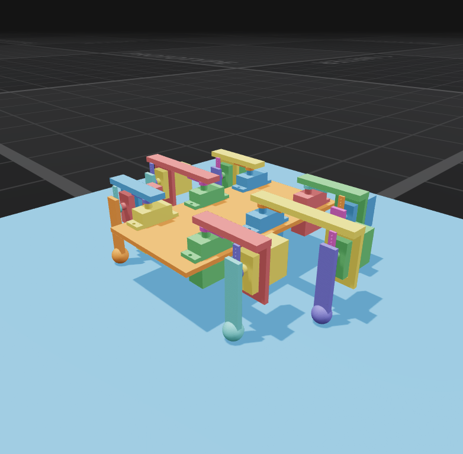

# hex — one unassisted hexapod, end to end (2026-09-25/26)

Verified against source: 2026-09-26. Provenance: `[Cadex-new]`.

The owner's question was whether the product, left alone, can take one
prompt to a robot that walks: "design a hexapod walking robot using MG90S
servos … then declare a training task that teaches it to walk forward".
No Ouroboros, no coaching, one `cadex walk` from `main` @ `4289ef0f`,
training on the local RTX 5090 at 2000 iterations × 2048 environments, and
a `cadex review` dashboard on the project while it ran. Observe only: no code
changed during a run. The gap logs are the timestamped notes taken while
watching; this page is the summary.

| run | change | outcome |
|---|---|---|
| hex1 | none (effort `high`) | **Failed in design.** Four consecutive 32k-token thinking passes, no tool call, then Claude Code gave up (33 min). Nothing designed. [`hex1-GAPS.md`](hex1-GAPS.md) |
| hex2 | `CADEX_EFFORT=medium` | **Designed, trained, did not walk.** 1 h 16 min to an accepted 38-component design (12 × MG90S, sweep pass); 3.7 h training; the seed-0 rollout tumbles 5 m along +X with ±170° yaw swings. Review leg died on the renderer's triangle cap. [`hex2-GAPS.md`](hex2-GAPS.md) |

## What it found, and what was done about it

| gap | fixed by |
|---|---|
| The design agent never saw its work; every signal was a number, and boxes pass numbers | ADR-406 `look` ([agent's view](shots/hex2-look_iso.png), [close-up](shots/hex2-look_focus.png)) |
| No design language: sharp boxes, bars, balls stuck on bars | ADR-406 overlay |
| `cadex render` refused a 110,688-triangle model, which killed hex2's review leg | ADR-406 caps |
| Twelve servos and no controller, driver, IMU or power | ADR-407 catalog rows and overlay |
| The policy read joint angles an MG90S cannot report and a CoM velocity nothing measures | ADR-408 sensors, roles, asymmetric actor-critic, refusal at training |

## Still open (from the logs)

- **Stalls are invisible.** hex1's 33 minutes of thinking looked exactly
  like work on every product surface; only the agent's own transcript
  showed it. A walk that fails leaves no session to resume.
- **The API contract is learned by failing.** `import`, `repr`,
  `getattr`, the horn style names, `/facts/bounding_box`, and three
  assembly-shape rules were all discovered by refusals, each a round trip,
  deterministically on both runs.
- **A rejected candidate cannot be edited**, only rewritten whole: about
  ten minutes per 12 KB resend on hex2.
- **`hip_pitch=48`**, inside its own declared range, fails MJCF export
  verification with "changed body_pos by 1 relative" while 47 passes — a
  suspected engine defect, not yet reproduced in isolation.
- **Each build with a 12-joint sweep costs about 2.7 minutes**, which is
  most of the design phase.
- **The task pays for tumbling.** Forward CoM velocity with only a
  CoM-height termination: no upright or heading term, no tipping
  termination, no servo speed limit (the actuators are torque-limited
  only), and no plausibility check on 0.5 m/s for a 20 cm robot.
- **Reward rose while survival stayed flat** from iteration 40 to 2000,
  and nothing surfaced it; the walk's only behavioural readout is total
  reward, and "3,492, not terminated" reads as success.
- **`fit fail: 1 failing of 703`** is the floor's advisory world-geometry
  row counted as a failure.
- **The persistent dashboard follows Ouroboros runs only**, and
  `cadex review` refuses a project before its first run creates it.
