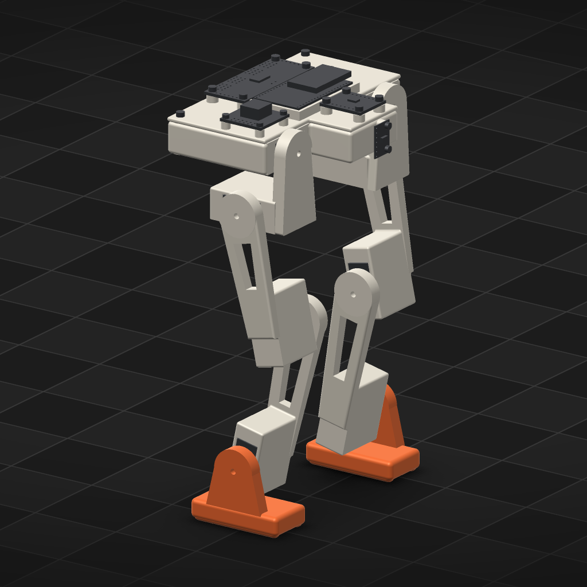

# orun4 — G2's second fresh-session check, on the revised style

Verified against source: 2026-10-06 (repo at `9326cbac`). This checks the
`printed-legged-robot` style as ADR-566 revised it, using the same method
as the first check (`FRESH-SESSION.md`). A fresh agent session got only
Cadex's guidance and the style, and was asked for a printed legged robot.
The questions are the three the first session missed or half-met: is the
foot inside the ¼ and ⅛ bounds, is the inward roll limit set from a
measured `first_contact`, and how did it treat the thigh?

## Setup

- **Project:** `orun4-fresh-legged-2`, a new empty directory. `cadex
  style --project <it> printed-legged-robot` wrote `agent.json`, and
  `cadex guidance --project` printed the base plus the style: 44,387
  characters, with no project named.
- **Session:** `claude -p`, model `claude-opus-5-5`, Claude Code 2.1.290,
  started in the project directory with `--strict-mcp-config`. Its only
  MCP server was `cadex mcp --project <it>`.
  - The permission deny rules were the first check's, plus the first
    fresh project (`orun4-fresh-legged`, `-r6`) and the first check's
    transcript directory.
  - Its first call was `cadex guidance --project`.
- **Prompt, verbatim, the same as the first check, and the only human
  text:**

  > Design a small 3D-printed two-legged walking robot driven by hobby
  > servos, in this Cadex project. Take it as far as one complete, accepted
  > design you are satisfied with, then stop: do not train a policy.

- **Run:** 107 min, 108 turns, exit 0. 21 revisions were accepted.
  - Ordinals 1–5 are probe scripts (servo frames, bays, horns, the joint
    API).
  - **Ordinal 6, `19c0ef2d` (model digest `adfafa22`), is the first
    accepted robot.**
  - Ordinals 7–21 fix the fit (screw counterbores, board clashes), add the
    MJCF, measure the COM, then derive the roll limit and widen the hips
    (below). The last is `867eb81f`.
- **Leakage audit:**
  - Every Bash and Read call in the stream-json transcript was read. The
    session read the guidance, its own project, `cadex` help text, its
    own artifacts and MJCF, and short slices of engine and CLI source
    (`cadex_assembly_worker.py` around the floor rule, `CadexDynamics.py`
    3100–3135, `smoke_geometry.py` 20–70, `smoke_runner.py` grep). None
    of these covers feet, keels, hip spacing or roll limits.
  - **One near-leak.** Early on, one command listed the projects root
    and grepped it: `grep -l printed-legged-robot */agent.json`, and `grep
    -q` for `sts3215|mg90s` in each `script.json`. It printed only
    directory names: the two earlier fresh projects and twelve hex,
    quadruped and swing projects. It opened none of them. The deny rules
    blocked reads, not a `cd` into the root with a glob. A third run should
    deny `Bash(*cadex-projects;*)` too.

*Revision `19c0ef2d` (model digest `adfafa22`), rendered with `cadex
render` from a copy restored to that revision
(`orun4-fresh-legged-2-r6`).*

## The three questions

### 1. The foot against the ¼ and ⅛ bounds: **met, at the first robot**

| | Standing height | Sole L × W | L / height (≤ 0.25) | W / height (≤ 0.125) |
|---|---|---|---|---|
| First check, revision 6 (ADR-565 style) | ~210 mm | 72 × 40 mm | 0.34 | 0.19 |
| **This check, revision 6** (ADR-566 style) | 225.6 mm | **54 × 27 mm** | **0.239** | **0.120** |
| This check, final revision `867eb81f` | 225.6 mm | 54 × 28 mm | 0.239 | 0.124 |

- The heights are measured floor to top. At revision 6 that is the
  regulator, at z = 225.57 mm in the render's `summary.json`. The sole
  sizes are the feet's render bounds.
- At revision 6 the agent already declared `foot_len` with a maximum of
  60 and `foot_w` with a maximum of 30, so the parameter ranges sat at
  the bounds from the start.
- In its own ADR-006 it wrote:

  > Standing height, floor to the top of the deck electronics
  > (regulator), is 225.6 mm. The sole is 54 × 28 mm: length/height =
  > 0.239 (≤ 0.25) and width/height = 0.124 (≤ 0.125).

- It also gave the bound as a reason against an extra joint (ADR-003):
  "an ankle-roll servo […] makes the foot assembly wider than the
  ⅛-height sole allows".
- The foot is still a two-keel hull: a sole box with two Ø6 capsule
  keels, 21 mm apart, with the strip between them raised 1.5 mm. Its
  colliders are exactly those primitives. It is accent-coloured and its
  own part, and the strip sits 3 mm ahead of the ankle, under the
  measured COM x of +0.88 mm.

### 2. The roll limit from a measured `first_contact`: **not at the first robot; yes by the last, and the procedure has a defect**

- **At revision 6 the limit was chosen, not measured:** `LIM roll (-12,
  30)`. The 5° sweep passed it, and the agent moved on to fit and
  dynamics. That repeats the first check's "checked but not derived".
- **Later, unprompted, it followed the style's procedure.** After the
  MJCF and COM work, in revisions after the first robot, it opened the
  inward range to −45° and read the sweep rows. Its working comment:

  > roll inward limit: the sweep opened to -45 met the other leg at -35
  > (ankle housing on shin); two steps short

- **Then it found that the number did not mean what the style says.**
  Its ADR-005:

  > Note that the engine's `first_contact_degrees` is the first sample
  > in sweep order, starting from the range's lower end, not the
  > contact nearest the rest pose. I bracketed it by moving the lower
  > limit.

  Bracketing gave these results:
  - at `hip_half_span` 42, the legs met at about −12°;
  - so it widened the hips to 46;
  - at 46 it is clear at −15° and meets at −20° (`shin_l` ∩ `shin_r`);
  - so the limit is −10°, two 5° steps short. Both angles and the spacing
    are written in DECISIONS.md, as the style asks.
- **The agent is right about the engine.** `cadex_assembly_worker.py`
  sets `first_contact_<unit>` to the first contacting value as the
  samples run from the range's low end upwards (`if row[contact_key] is
  None and d <= 1e-3`). `CadexFitReport.py` then takes the lowest of
  those across pairs.
  - When inward roll is the negative direction, the reported value is
    the deepest contact, not the onset nearest the rest pose.
  - The style tells the agent to open the range wide, read
    `first_contact` and set the limit two steps short. Taken literally,
    that would have given about −25°, a limit **inside** the collision.
  - The style's procedure is wrong whenever the side being measured is
    the low end of the range. This is a defect for the next unit to fix,
    in the engine's semantics or in the style's wording. It is not fixed
    here.

### 3. The thigh: **the revised rule held**

- Revision 6 declares `knee_bend` 12° ("thigh lean in the standing
  pose"). The thigh comes down from the hip to a slightly bent knee. That
  is the upright-leg case ADR-566 wrote, and nothing in the session
  reaches for a level thigh.
- The thigh is 66 mm and the shin 76 mm. The cross-horn cap is about
  23.6 mm across (10.2 mm reach + 1.6 mm wall), so the thigh is 2.8× and
  the shin 3.2× the cap. The shin is the longest segment.

## The rest of the style, at revision 6

| Rule | Met? |
|---|---|
| Twin keel with a flat strip, built from its colliders | yes |
| Foot accent-coloured, its own part | yes (`accent` on `foot_*` only) |
| One round cap per axis over a cross horn | yes (`horn("cross")` on all four joints of each leg) |
| Actuators inside the limb | yes: the thigh wraps the knee servo and the shin wraps the ankle servo |
| Tapered plate with a lightening window | yes (visible in the render) |
| No face; a real sensor on the front | yes (VL53L1X on the nose, facing +X) |

## What this says about the guidance

- **ADR-566's foot bound carried.** The first robot's sole went from
  0.34 × 0.19 of the height to 0.239 × 0.120 under the same prompt. The
  agent measured, recorded and reasoned with the bound unprompted. This
  closes the first check's one outright miss.
- **The thigh scoping carried.** The biped stood on a lean thigh, with no
  deviation to explain.
- **The roll-limit rule carried late.** The agent derived the limit, but
  only after its first robot had been accepted with a chosen one. Along
  the way it found that the style's reading of `first_contact` is wrong
  on the low side of a range. That defect is open: the style's procedure
  gives a limit inside the collision when inward is the negative
  direction.
- **Other findings, the agent's own:**
  - `cadex smoke` refused the design: an exact-geometry pre-check rejected
    a distance mismatch under 1e-5 mm on a pair 70 mm apart, and threaded
    screw engagement counted as overlap.
  - Hip roll is at stall in single support, so the gait must shift weight
    first.
