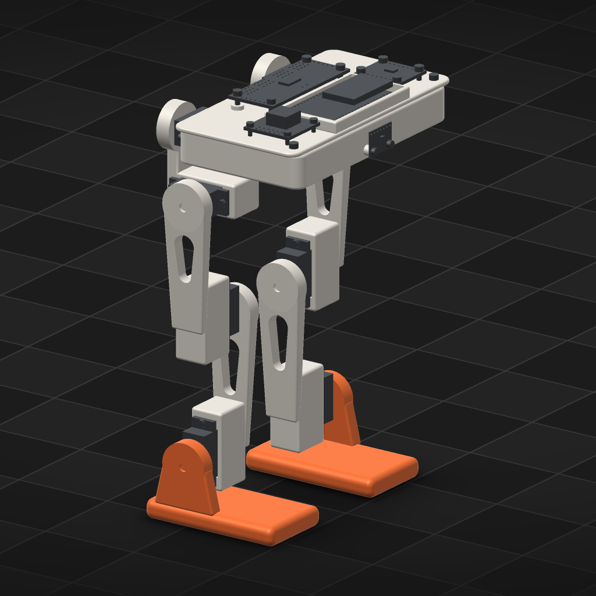

# orun4 — G2's fresh-session check

Verified against source: 2026-10-06 (repo at `399cd95a`). This checks
the guidance, not the agent. A fresh agent session got only Cadex's
guidance and the `printed-legged-robot` style. It was asked for a printed
legged robot. Did its first accepted design follow the style's foot, joint
and clearance rules without being told them?

## Setup

- **Project:** `orun4-fresh-legged`, a new empty directory under the
  projects root. Nothing was copied into it. The style was chosen with
  `cadex style --project <it> printed-legged-robot`, which wrote
  `agent.json` (`"style": "printed-legged-robot"`). `cadex guidance
  --project` then printed the base plus that style: 42,826 characters,
  with no project named.
- **Session:** `claude -p`, model `claude-opus-5-5`, Claude Code 2.1.290.
  It started in the project directory, so no repository `CLAUDE.md` or
  memory was loaded. Its only MCP server was `cadex mcp --project <it>`
  (`--strict-mcp-config`), and it had the same shell any agent has.
  - Permission deny rules blocked reads of the other projects, of
    `docs/probes/`, `.hypergraph/`, `.ouroboros/` and `STATE.md`, and
    blocked web access.
  - The session followed the server's brief and ran `cadex guidance
    --project` as its first call.
- **Prompt, verbatim, and the only human text:**

  > Design a small 3D-printed two-legged walking robot driven by hobby
  > servos, in this Cadex project. Take it as far as one complete, accepted
  > design you are satisfied with, then stop: do not train a policy.

- **Run:** 44 min, 82 turns, exited 0. Eleven revisions were accepted.
  Ordinals 1–5 are probe scripts (servo, horn and bay measurements).
  **Ordinal 6, `29e99e01`, is the first accepted robot.** Ordinals 7–11
  add fit fixes (screw-head contacts, a deeper spline relief), the physics
  block, `foot_fwd` 14 → 15 and `foot_len` 72 → 68.
- **Leakage audit:**
  - The session's shell reads were the guidance, its own project, API
    source (`cadex_library_api.py`, `cadex_assembly_api.py`,
    `cadex_part_api.py`), `examples/lifecycle/hinged-arm/script.py`,
    `docs/MUJOCO.md` lines 120–150, `docs/XSCRIPT.md` lines 937–1015 and
    the head of `docs/HEADLESS-BIPED-REVIEW.md`.
  - None of these says anything about keels, feet, hip spacing or roll
    limits.
  - `DESIGN-LANGUAGE.md` showed up only as a name in a directory listing,
    and was never opened.



*Revision `29e99e01` (model digest `ae557f80`), rendered with `cadex
render` from a copy restored to that revision (`orun4-fresh-legged-r6`).*

## Transcript excerpt

The decision the agent wrote into its own `DECISIONS.md` (ADR-004, excerpt):

> Each knee/ankle servo hangs inside the limb above the joint it drives,
> case running up the limb, screwed by both tabs onto a ledge (bay
> ledge=4). […] Each limb is a plate tapering in width (23.6 -> 17.2 mm)
> and depth (7.1 -> 4.5 mm) with a tapered lightening window […]
> Joint caps: every driven link's hub is a disc of horn reach + 1.6 mm, cut
> with the horn body, skirt stopping 1 mm off the case top, with a
> horn-screw access hole. One cap design for all eight axes.
> Feet: 68 x 40 mm sole, a flat strip between two 4 mm keels, built from
> exactly the box + 2 cylinders that are its MJCF colliders; strip centred
> under the measured COM (foot_fwd = 15 mm vs COM x 15.1 mm).
> Limits (deg): roll in 10 / out 30 […] All eight joints swept at 5 deg:
> no failing pair. Inward roll is the tight side because the feet and
> shins meet there.

Revision 6's foot, as the agent wrote it:

```python
    # foot: compact sole (flat strip between two keels) under an outboard upright
    r = p.keel_r
    hs = 2.0 * r + 2.0
    ...
    sole = wbox((fx0, yk_i - s * r, 0.0), (fx1, yk_o + s * r, hs))
    sole = part.fillet(sole, r, edges={"direction": [1, 0, 0], "expected_count": 4})
```

Its `fit` block at revision 6 reported: the sweep `verdict: pass`, 8 of
8 joints complete at 5°, none failing. The static fit found 40 screw-head
pairs below clearance and no intersections. The agent fixed those pairs
in revision 7.

## Scorecard: revision 6 against the style

| Style rule | Met? | Evidence |
|---|---|---|
| FEET: two keels with a flat strip, not one round keel | **yes** | The sole is a box whose four long edges are filleted to the keel radius: two round contact lines with a flat between. Revision 8's colliders are exactly that box plus two cylinders. |
| FEET: accent colour, its own part | **yes** | `c_foot_*`, role `accent` (#E8642C), the only accent on the robot. |
| FEET: the strip centred under the measured COM | **yes** (revision 9) | `foot_fwd` 15 mm against a measured COM x of 15.1 mm. Revision 6 had 14 mm, an estimate. |
| FEET: **compact, never large or flat; widen with the strip, never by growing the foot** | **no** | The strip *is* the whole foot: a 72 × 40 × 10 mm slab with rounded long edges (68 mm long from revision 11) under a 210 mm robot. In the render it reads as a large flat plate, which is the exact thing the rule names. The rule's wording ("compact", with no proportion) did not stop it. |
| JOINTS: one round cap per axis, sized from the horn, horn hidden | **yes** | `RC = arm_reach_mm + cap_wall` (1.6 mm). The cap is cut with `horn.body`, its skirt stops 1 mm off the case, the horn is `cross`, and one `cap()` serves all eight axes. |
| LIMBS: tapered plate, lightening window, shin tapering in depth | **yes** | `taper()` lofts width *and* depth. `window()` is a tapered slot. |
| ACTUATORS INSIDE THE LIMB | **yes** | The knee and ankle servos hang inside the limb above their joint, with the case running up the limb. |
| HIPS: an inward roll limit much tighter than outward, set with the spacing | **yes, partly** | Roll is limited to 10° inward and 30° outward, with `hip_y` a parameter. The 5° sweep passes. The agent did not report the angle at which the feet actually meet, so the limit was checked by the sweep but not derived from it. |
| LEGS LONG AGAINST THEIR JOINTS | **yes, with a stated deviation** | The thigh is 62 mm and the shin 66 mm (2.6× and 2.8× the 23.6 mm cap), and the shin is longest. The agent declined "thigh runs out level" for a biped, with the reason that the rule is for sprawled legs. That is a fair reading: the style's rule is written for a sprawled leg and is wrong for an upright biped. |
| NO FACE / NOT THE MASCOT BOX | **yes** | The robot has no face. The front carries the VL53L1X range sensor on the centreline, and the finish is an exposed mechanism. |

## What this says about the guidance

- **It carried, unprompted:**
  - the twin-keel-and-strip contact geometry, built from its collision
    primitives;
  - the horn-sized cap joints;
  - the actuators inside the limb;
  - the two-way taper;
  - the asymmetric inward roll limit;
  - centring the strip on the *measured* COM.
- **It did not carry foot compactness.** "Compact, never large or flat"
  without a proportion lost to the agent's own wish for a wide, stable
  sole. That is an honest miss of the rule the charter names first.
- **The leg-angle rule is wrong for a biped.** "At the standing pose the
  thigh runs out level" is a sprawled-leg rule, and an upright biped's
  agent was right to decline it.
