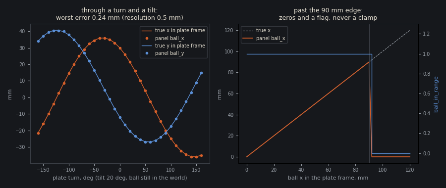
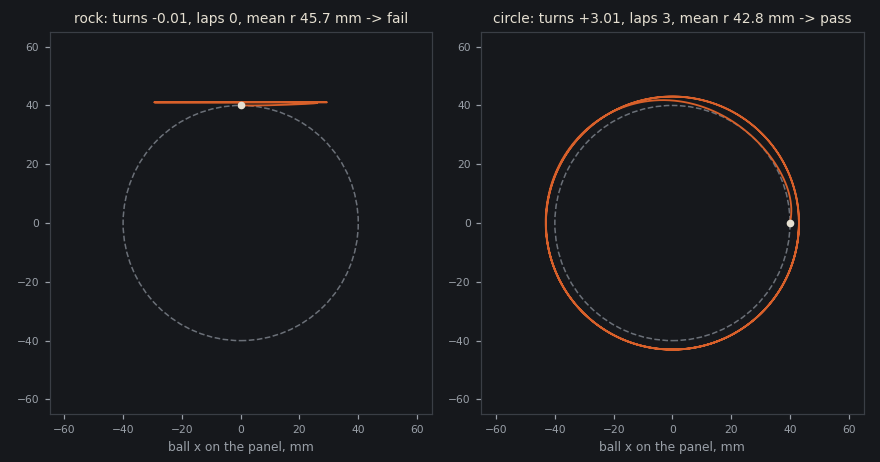
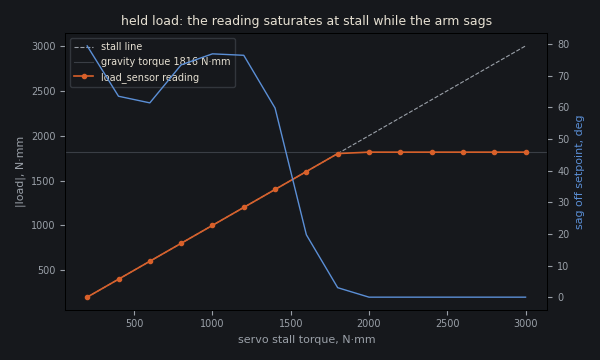
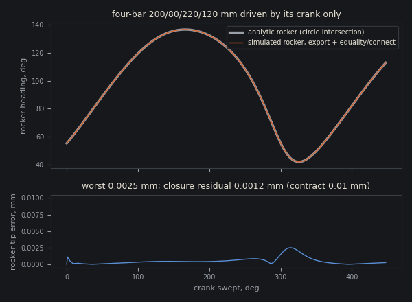
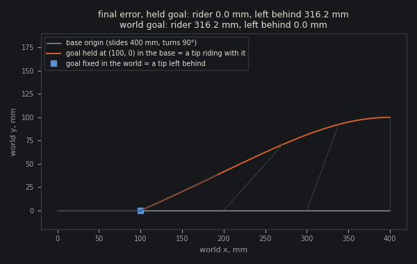
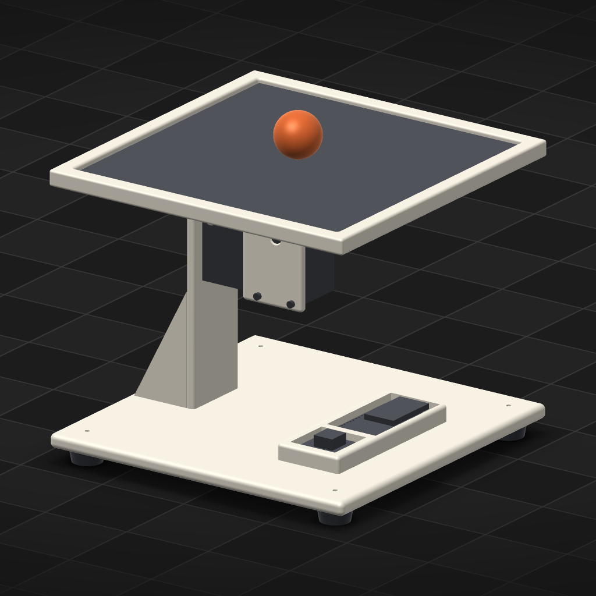

# orun5 — closing report

Verified against source: 2026-10-08, at `7466b0ed` (the orun5 run branch).
Charter: `.ouroboros/goal.md`, "Sense the world, close the loop, judge the
motion". Every number below was measured on sb1x (linux-64, RTX 5090) on
scratch projects named `orun5-*`. The two reference projects were read and
never written. The owner ticks the criteria; this report ticks none of them.

## Where each criterion stands

| criterion | where the evidence stands | evidence | records |
|---|---|---|---|
| S1 a grounded position sensor | evidence recorded | ADR-588, ADR-589, ADR-590; `test_dynamics_position_tracker.py`; §1 | `peaceful-heron-7678`, `long-isle-5502`, `smooth-stream-7287` |
| M1 motion predicates | evidence recorded | ADR-587; §2; the circle probe on the rig's own physics | `dusty-meadow-8719`, `dusty-canyon-3027` |
| S2 a grounded load sensor | evidence recorded | ADR-591; `test_dynamics_load_sensor.py`; §3 | `tiny-lake-4065` |
| L1 a closed linkage, exported and driven | evidence recorded; the fit sweep **refuses** a loop, naming it, rather than solving it (the charter allows either) | ADR-593, ADR-594, ADR-595; `test_dynamics_linkages.py`; a live four-pin four-bar smoked and driven; §4 | `civic-sun-5811`, `spring-river-3041`, `young-aspen-5297` |
| R1 a goal held in a body's frame | evidence recorded | ADR-592; `test_dynamics_goal_frame.py`; first real run in P2; §5 | `long-cabin-6279` |
| P1 the ball-plate, as built | centring **passes 8/8**; circle on the charter's *otherwise* branch (predicate shown failing a rocking trace and passing a circling one, and failing a trained rocking policy, circle-6, on 8 of 8 seeds; circle-7, warm from centring by ADR-597, goes round 3–4 laps on 8 of 8 but at 12–17 mm; circle-9, warm from circle-7 with a heavier unsaturated off-radius cost, at 20.6–24.0 mm; circle-10, led by an ADR-598 phase goal, passes 6 of 8 seeds and loses the other 2 to the start kick; circle-11, warm from circle-10 with a state-gated catch term, passes 7 of 8 and loses seed 9102 to the kick; not a spec pass, and iteration on the circle task has stopped) | §6 | `smooth-stream-7287`, `dusty-canyon-3027` |
| P2 the excavator's floor, measured | the floor **moved**, cause not separated | §7 | `hidden-sand-7542`, `misty-water-8806` |
| C1 this report | this file | §1–§10 | the record that adds this file |

The four capability figures below come from `capability_figures.py` in this
directory, which replays each test's own fixture through Cadex's real build,
MJCF export, observation path and evaluator, sweeping what the test checks
at a few points:

    pixi run python docs/probes/orun5/capability_figures.py docs/probes/orun5

## 1. S1 — a position tracker reads a free body (ADR-588 to ADR-590)

`position_tracker` is declared like a datasheet (range per axis, resolution,
rate, noise) on the component the real reader is fixed to: a touch panel on
a plate, a camera on a mast. Its channels are the tracked body's position
in that component's frame, and an `_in_range` flag.

- **Left:** the plate turns through ±160° at a 20° tilt while the ball stays
  still in the world. The panel's reading follows the ball's true position
  in the plate frame, worst error 0.24 mm against a 0.5 mm resolution.
- **Right:** past the 90 mm edge the reading drops to zeros and the flag to 0.
  It never holds a stale or clamped value, and a task terminates on the flag.
- **Noise and quantisation:** noise is added before rounding. The trainer's
  copy equals the engine's on 200 draws, and its spread is the declared σ
  within 6 %.
- **Training:** a task reading the tracker is grounded, so the "ungrounded"
  refusal does not fire. A tracker slower than the control loop is refused.
- **Velocity:** ADR-590 adds the velocity the panel's firmware would
  difference. Its noise is √2·σ/Δt, declared, not privileged.
- **Normaliser:** ADR-589 fixed the trainer's normaliser for noisy channels.
  It now floors their spread at the declaration.

## 2. M1 — predicates measure the motion (ADR-587)

`assembly.success` takes `body=`, a centre held in a component's frame and an
axis. `CadexEvaluation` measures five metrics from the trace:

- `turns`: net signed turns, each frame's bearing change wrapped to half a turn;
- `laps`: `floor(|turns|)`;
- `final_distance_mm`, `mean_distance_mm` and `max_distance_mm`.

An episode that ends early measures none of them, and `check` fails it
(the ADR-586 rule).

The figure is the circle task's own spec (`laps ≥ 2`, mean distance 30–50 mm)
held against two 10 s scripted motions on the rebuilt rig's exported MJCF
(`circle_predicate.py`):

- **Rocking** ±25 mm across the circle's top reads −0.005 turns and 0 laps
  at a 45.7 mm mean radius. It fails on `laps` alone. The radius bound
  passes it, which is exactly how the reference project passed a rocking
  policy 8/8.
- **Circling** reads +3.005 turns and 3 laps at 42.8 mm, and passes.

## 3. S2 — a load sensor reads an actuator's effort (ADR-591)

`lib.servo(...).load_sensor(actuator)` grounds the actuator's applied force
or torque at the catalog's figures. The bus servos say they report load. A
PWM servo's load sensor is refused, with the reason that it reports nothing.

The figure is the load test's held arm under servos of rising stall torque:

- Below the 1816 N·mm gravity torque the reading sits on the stall line and
  the arm sags.
- Above it the reading is the gravity torque, and the sag is 0.

The test pins that the reading matches gravity within one resolution step,
and that a servo with half that stall reads exactly 908 N·mm while sagging
13.2°. **Not modelled** (named in `docs/MUJOCO.md`): the STS register reads
drive duty, which equals load only near stall.

## 4. L1 — a closed linkage, exported and driven (ADR-593 to ADR-595)

A loop closure exports as an MJCF `equality/connect`, and an actuator on one
joint of the loop drives the chain. The figure is a Grashof crank-rocker
(200/80/220/120 mm) driven only by its crank, through 447° at the 0.5 ms step
the linkage tests use:

- the rocker against its circle-intersection angle: worst tip error
  0.0025 mm;
- closure residual 0.0012 mm, against the 0.01 mm MJCF pose contract
  (ADR-584).

The slider-crank test holds its 160 mm stroke within 0.01 mm of
`r cos θ + √(l² − r² sin² θ)`.

What else holds:

- **Refusals:** a loop whose closing axis would have to tilt
  (`overconstrained_loop`), and a drive on a loop with no freedom left
  (`actuator_locked_by_loop`).
- **One-freedom loops** (ADR-595): the native solver's redundancy on a
  four-pin four-bar is accepted when a screw-rank check proves the loop has
  one freedom. The same four-bar was built live through the real engine,
  smoked to a pass, and driven to the analytic rocker within 0.0032°.
- **Smoke** (ADR-594): `cadex smoke` measures every closure against the pose
  contract.
- **Fit sweep:** it refuses each joint of a loop, naming the loop. It does
  not solve it.

## 5. R1 — a goal held in a body's frame (ADR-592)

`goal(frame=component)` keeps the drawn target in that component's frame.
The policy reads it as the base sees it, and the reach metrics measure the
tip against where the target was at each frame. The figure is the
goal-frame test's base, which slides 400 mm and turns 90° in 2 s:

| goal | tip riding with the base | tip left where it started |
|---|---|---|
| held at (100, 0) in the base | 0.0 mm | 316.2 mm |
| fixed in the world | 316.2 mm | 0.0 mm |

A spec may not judge in the world a goal the task holds in a frame.

## 6. P1 — the ball-plate, rebuilt as built

On `orun5-ball-plate`, the ball is a free sphere rolling on the plate by
contact. A `position_tracker` touch panel on the plate reads it, with its
differenced velocity. There are no sliders, no hidden bead and no point goal.

**Centring passes** (policy `9cb0a64c6ca1`, evaluation
`71e1646bdacd-9cb0a64c6ca1`), 8 of 8 seeds:

| predicate | bound | measured |
|---|---|---|
| `final_distance_mm` | ≤ 8 | 1.20–2.64 |
| `mean_distance_mm` | ≤ 15 | 3.11–6.41 |

All 8 seeds ran the full 300 steps, through the start kick and the
mid-episode shove. `p1-centring-seed-9001.png` is seed 9001's filmstrip.

The training curve (seed 12, 700 iterations, 256 envs, 326 s) peaked at
1.13 reward per step at iteration 535. Without a velocity input it
plateaued at 0.62, and with a privileged true velocity it reached 1.33.

**The circle task is on the charter's *otherwise* branch.** Its spec bounds
`laps ≥ 2` and mean distance 30–50 mm (§2). Five policies were trained:

- every one circulates, 3–11 laps on every seed that ran to the horizon, so
  none rocks;
- none passes, because each holds a circle tighter than the bound: mean
  radius 16–29 mm against a floor of 30;
- the closest, circle-5, reads 28.1–29.2 mm with 6 of 8 seeds completed.

A sixth run, circle-6, tested why. circle-5 trained at 1.42 reward per
step, which needs a ball within a few millimetres of 40 mm. But its
deterministic mean, the policy the evaluation runs, orbits at 26–29 mm.
The guess was that exploration noise (σ 0.24) was doing the circling. So
circle-6 warm-started from circle-5 with σ narrowed to 0.08 and ran 1000
iterations (seed 14, 455 s). The same task digest was used, so no
curriculum step was needed. The narrow-σ reward fell at once, from 1.32 at
iteration 3 to 0.87, and climbed back only to 1.00 by iteration 1000.
Evaluated on the same 8 frozen seeds (`31977766f3c5-f4af2f075192`):

| predicate | bound | measured |
|---|---|---|
| `completed` | ≥ 1 | 1 on 8 of 8 |
| `mean_distance_mm` | 30–50 | 24.2–27.1 |
| `laps` | ≥ 2 | 0 on 8 of 8 (turns −0.39 to +0.80) |

So **circle-6 rocks**. The ball swings on an arc about 25 mm from the
centre and never completes a lap. Two things follow:

- the circulation of circle-1 to circle-5 came from the exploration noise,
  not from the policy's mean. A memoryless policy whose mean only holds an
  arc needs another approach (a reward that pays for phase rather than
  speed, or a recurrent policy). A narrower σ does not supply it.
- the laps bound now fails a **trained** rocking policy on all 8 seeds, not
  only the scripted rocker in §2.

A seventh run, circle-7, asked whether the circling can come from a
competent controller instead of from noise. It warm-started the circle task
from the passing centring policy (centre-vel) through ADR-597's curriculum
step, the first run to use it: the trainer accepted the step with
`disturbance`, `episode`, `label`, `reward` and `success` changed, and kept
centre-vel's own σ, 0.268. 1000 iterations, seed 15, 456 s; reward per step
0.70 at iteration 0, 1.04 by iteration 195, then flat, ending at 1.11 (best
1.15), below circle-5's 1.32. Evaluated on the same 8 frozen seeds
(`32a0a13bbde1-5fc199867250`):

| predicate | bound | measured |
|---|---|---|
| `completed` | ≥ 1 | 1 on 8 of 8 |
| `mean_distance_mm` | 30–50 | 12.0–17.2 |
| `laps` | ≥ 2 | 3–4 on 8 of 8 (turns +3.56 to +4.74) |

So **circle-7's mean goes round**, every seed to the horizon, and passes
the laps bound on all 8, which no earlier circle policy did. It fails only
on radius, and by more than circle-5: the ball circles 12–17 mm out and
ends 1.2–11.8 mm from the centre, as if the centring prior still pulls it
in. A controller that circulates by its mean is reachable from centring; the
radius is not, under this reward.

The direction ranked first after circle-6 — a reward on the ball's phase
tracking a target angle that advances with time — **cannot be written in
xscript today**, because no channel a reward or a policy reads carries time
(defect 12).

The next run, circle-9, tested whether radius is only a reward-shape gap. In
circle-7's reward the off-radius cost is `tanh(|r − 40| / 10)`, which is
already 0.99 at 15 mm and 0.91 at 25 mm. Moving the ball out from 15 mm to
25 mm therefore saved almost nothing. circle-9 changed only the circle
task's reward:

- off-radius scale 10 → 25 mm, so the cost still grows between 12 and
  30 mm;
- off-radius weight −0.8 → −1.6;
- alive 1.6 → 2.4, so a step on the plate still pays.

The unsigned task keeps the shared terms. circle-9 warm-started from
circle-7 by ADR-597, and the trainer named `reward` as the only change.
1000 iterations, seed 15, a checkpoint every 250, 712 s on the CPU,
witness 8.6e-8. Reward per step peaked at 2.04 (iteration 809) and ended
at 1.87.

A first attempt, circle-8, used the same settings with no checkpoints and
ran out of its 570 s budget at iteration 779. It left no policy, so it has
no measurement. Both runs inherited a hidden GPU from the launching shell,
which is why they ran on the CPU.

circle-9 evaluated on the same 8 frozen seeds
(`46230146b3e0-bbd88fc92f43`):

| predicate | bound | measured |
|---|---|---|
| `completed` | ≥ 1 | 1 on 8 of 8 |
| `mean_distance_mm` | 30–50 | 20.6–24.0 |
| `laps` | ≥ 2 | 3–4 on 8 of 8 (turns +3.47 to +4.09) |

It passes on 0 of 8 seeds, and still only on radius. The heavier,
unsaturated cost moved the mean radius out by about 7 mm, from 12–17 mm to
20.6–24.0 mm (max distance 32.8–52.8 mm), and kept circulation on every
seed. That still leaves 6–9 mm to the bound's floor. **Reward reweighting
alone does not hold 40 mm** in one curriculum step. As planned, the next
attempt is the `phase` goal (defect 12): a target angle that advances with
time says where the ball should be, not only how far out.

The phase goal was then built (ADR-598): `assembly.goal("lead",
kind="phase", period_seconds=3.5)`, a clock read as `lead_sin` and
`lead_cos`. circle-10 is a new task, `task_circle_phase`, with the same
model, terminations, randomisation, kick and success spec. Its reward pays
the ball for being where the clock says:

- alive +1.0;
- `exp(-((b_x − 40·lead_cos)² + (b_y − 40·lead_sin)²) / 800)` at +1.5,
  for being near the clock's point on the 40 mm circle;
- the cosine of the ball's bearing lag, `(b_x·lead_cos + b_y·lead_sin) /
  (r + 5)`, at +0.3;
- off radius `tanh(|r − 40| / 25)` at −0.8;
- the tilt cost.

It **started cold**. The phase adds two policy inputs, and ADR-161 refuses
a warm start whose observations change, so circle-9 could not seed it.
1500 iterations × 256 envs, seed 16, on the GPU, 696 s. Reward per step
was 0.72 at iteration 0, best 2.42 at iteration 640, and ended at 1.78.
Both the best checkpoint and the final policy were evaluated on the same 8
frozen seeds:

| predicate | bound | best, it 640 (`35c62c0b23ab-bf6dab62633e`) | final (`35c62c0b23ab-6b815c4671e7`) |
|---|---|---|---|
| `completed` | ≥ 1 | 1 on 5 of 8 | 1 on 6 of 8 |
| `mean_distance_mm` | 30–50 | 34.2–35.6 on those 5 | 33.4–35.3 on those 6 |
| `laps` | ≥ 2 | 2–3 on those 5 (turns +2.27 to +3.28) | 2–3 on those 6 (turns +2.34 to +3.32) |
| seeds passing | all | **5 of 8** | **6 of 8** |

So **a clock in the reward closes the radius gap**. Every seed that runs
to the horizon passes every predicate, at 33–36 mm and 2–3 laps. That is
the first circle policy to pass any seed. Every failure is the same
event: the episode ends 0.30–0.36 s in with "ball reached the rim" (seeds
9101 and 9102 for both policies, 9103 for the best checkpoint). The start
kick (up to 0.6 N for 40 ms on the 25 mm ball) throws the ball outward
before the policy has caught it. circle-9 survived the same kicks on all
8 seeds, so this policy reaches for the circle with the kick rather than
against it. **The circle task is still not trained to a spec pass**, which
needs every seed. The open gap is now the first 0.3 s, not the radius or
the circulation.

circle-11 went after that gap with a reward-only step (ADR-597), warm from
circle-10's final policy into `task_circle_catch`. The task keeps the same
model, goal, kick, terminations and spec, and the curriculum check read
`the task changed in ['label', 'reward']`. No reward can read episode
time, so the catch is gated on the ball's state instead of on the first
0.5 s:

- the near-point term is multiplied by `1 − tanh(max(r − 48, 0) / 4)`, so
  the pull to the clock's point fades out beyond 48 mm;
- a catch term, `−tanh(max(r − 48, 0) / 4) · tanh(v_r / 100)` at +1.0,
  pays for the ball's radial speed back towards the centre beyond 48 mm
  and charges for it going outward.

800 iterations × 256 envs, seed 17, on the GPU, 382 s. Reward per step was
0.84 at iteration 0, best 2.54 at iteration 523, and ended at 2.51.

| predicate | bound | best, it 523 (`8cfdf569c42b-33b73809c148`) | final (`8cfdf569c42b-a6d3d7e85fe2`) |
|---|---|---|---|
| `completed` | ≥ 1 | 1 on 7 of 8 | 1 on 7 of 8 |
| `mean_distance_mm` | 30–50 | 33.8–35.7 on those 7 | 33.8–35.6 on those 7 |
| `laps` | ≥ 2 | 2–3 on those 7 (turns +2.38 to +3.39) | 2–3 on those 7 (turns +2.36 to +3.39) |
| seeds passing | all | **7 of 8** | **7 of 8** |

The catch keeps seed 9101 on, which circle-10 lost. **Seed 9102 still
reaches the rim**, at 0.30 s (best) and 0.28 s (final). In its trace the
ball leaves the centre at about 250 mm/s and has slowed to about 140 mm/s
when the panel reads it past 62.5 mm. So the policy is braking, but not
hard enough within the ±10° command range in that time. **The circle task
is not trained to a spec pass.** As the critic directed, iteration on it
stops here, at 7 of 8, with the kick and the spec unchanged.

The pushrod tilt (optional, needs L1) was not built.

## 7. P2 — the excavator's precision floor, measured

On `orun5-excavator`, the policy reads each bus servo's S2 load channel and
holds its goal in the track frame (R1). One run, `reach-p2-cold`, started
cold with the reference project's reward: 1400 iterations, 256 envs, seed 2.
It was evaluated on the same frozen seeds 101–110 and the same spec.

| policy | final error per seed (mm) | median | pass (≤ 15 mm) |
|---|---|---|---|
| reach-p2-cold (best) | 3.4, 17.2, 21.4, 2.5, 10.6, 5.2, 22.4, 12.5, 6.0, 12.4 | **11.5** | **7/10** |
| reach-05 (reference) | 11.0, 32.6, 25.1, 25.4, 26.7, 13.7, 20.8, 22.1, 39.3, 18.7 | 23.6 | 2/10 |

**The floor moved.** The median error halved, and 9 of 10 seeds improved.
Seeds 102, 103 and 107 still miss, so the spec still fails. Max tilt was
0.06°, and max drift 8.6 mm.

**Servo sag is ruled out directly.** At reach-05's own final commands, held
still:

- load is at most 0.19 of stall;
- the tip shifts 1.5 mm at the median and 4.3 mm at most.

Under rigid kinematics, reach-05's commands already miss the goal by a
median 19.7 mm. The reference floor was in the command, not the servo.

**Attribution caveat: one run cannot say what moved the floor.** It changed
three things at once:

- the goal frame;
- the load channels;
- an uninterrupted 1400-iteration schedule, where the reference ran a
  600 + 400 + 400 warm chain.

There is also a measurement caveat. The new error is measured against the
goal in the track frame, the reference's against a goal fixed in the world.
Drift is at most 8.6 mm, and the reference errors reproduce in the track
frame. Separating the causes needs the same schedule with a world-fixed
goal; that run was not done. The bucket four-bar (optional) was not built,
so the bucket is still driven servo-direct.

## 8. The base guidance added (ADR-596)

Three domain-neutral rules, each with its reason; no rule names a project:

- **Choose a sensor a real part could be.**
  - A free object's position comes from a `position_tracker` on the
    component the real reader is fixed to, terminated on its `_in_range`
    flag.
  - An effort comes from `load_sensor`, and only on an actuator that
    reports it.
  - A target relative to a moving base is held in that base's frame.
  - A channel no part could measure is declared privileged, with the part
    that would ground it recorded.
- **Close a linkage where the built machine would have one.**
  - Close a chain when the actuator should stay on the frame, when the
    output needs a ratio or path one pivot cannot give, or when two outputs
    move together.
  - Stay serial for independent wide-range axes, or for a chain near a dead
    point.
  - A loop is proved by smoke, never by the fit sweep.
- **State the motion as a predicate, not as where it ends.** Bound `turns`
  or `laps` for a motion that goes round, and the distance metrics for how
  far a body stays from a point, with no goal declared for it.

`cli/tests/test_agent_guidance.py` pins each rule.

## 9. The workaround ledger and the ADRs

`LESSONS.md` lists every workaround in the two reference projects (W1–W12),
its evidence and what replaced it:

- **Ten replaced:** W1, W2, W3, W4, W5, W6, W7, W8, W9 and W11, each by this
  run's or orun4's ADRs.
- **One kept as legitimate:** W10, privileged channels used in reward
  terms only.
- **One still open:** W12, the bucket four-bar, which was not built.

ADRs added by this run:

| ADR | decision |
|---|---|
| 587 | motion predicates: `turns`, `laps` and distance of a body about a centre |
| 588 | `position_tracker`, a grounded sensor for a free body's position |
| 589 | the normaliser follows a tracker's noisy readings and floors its channels |
| 590 | a tracker reports the velocity its firmware differences |
| 591 | `load_sensor`, the effort an actuator applies, as a bus servo reports it |
| 592 | a reach goal can be held in a body's frame |
| 593 | a closed linkage is driven from its crank; a loop the export would misstate is refused |
| 594 | `cadex smoke` measures every loop closure; a four-bar built live with rod ends |
| 595 | a redundant loop of one freedom is accepted; the driven gap sits beside its contract |
| 596 | base guidance: choose a real sensor, close a linkage, state a motion as a predicate |
| 597 | a curriculum step may revise the success spec |

## 10. Remaining defects

1. **W7, the warm-start rule, is decided (ADR-597) and used twice.** A
   curriculum step may now revise `success`, because the bar is not
   something the network reads or emits. The rule is test-pinned in
   `training/test_curriculum_warm_start.py`, and circle-7 (§6) warm-started
   the circle task from the centring policy across a changed `success`.
   circle-9 then stepped circle-7 to a revised reward. Two uses are not a
   measure of how often such a step helps.
2. **Measured, and resolved: a checkpoint costs one compile, then one
   iteration.** orun4 fixed the stall (ADR-576: 42.5–45.4 s down to 1.9 s
   per checkpoint on a 4096-env biped). Re-measured on 2026-10-08, holding
   the machine lock: the trainer cold on the ball-plate's circle task
   (256 envs, seed 17, 60 iterations, `--checkpoint-every 10`), each
   stderr line stamped as it arrived. An iteration took 0.431–0.440 s. The
   first checkpoint's gap was 9.54 s, one compile of the witness rollout;
   every later one, and every `best` written beside one, was 0.438–0.440 s,
   one iteration (nine writes in all). The gaps were the same at the
   tenth checkpoint as at the second, so nothing grows with the run. P2's
   69–72 s spacing was 25 iterations of its larger task, not a stall.
   ADR-576 holds; nothing is left to fix.
3. **Measured, and resolved: a fresh project is readable from its agent's
   first tool call.** `fresh_project_probe.py` starts `cadex app` over an
   empty projects directory and `cadex mcp` on a project that does not
   exist, and never writes a script. Until the first tool call nothing is
   on disk, so the index leaves the project out and `/api/project` answers
   404 (0.00–0.05 s, through `initialize` and `tools/list`). After the
   first call (`describe_api`, 0.06 s) the directory holds
   `review/activity.jsonl` and `.cadex-cli.lock`, and at 0.11 s the
   project is listed with a 200 that reads `accepted.available: false`,
   "no script.json". It stays so after the server exits. ADR-575 holds
   end to end; nothing is left to fix.
4. **A failed `cadex script --set` silently reverts the project's
   `script.py`** to the accepted revision. During P1's circle work this
   discarded an edit twice, because a stale policy declaration failed its
   digest check. It is working as designed (only an accepted script
   persists), but nothing tells the agent its edit is gone. It cost one
   training run.
5. **`cadex smoke` misjudges a rig with a free payload.**
   - `support` treats a free ball in a grounded assembly as a robot base
     that needs a floor.
   - The `components` check counts the ball's 7.5 µm contact penetration
     against a 1e-6 mm³ overlap threshold.
6. **P1's evaluation is noise-free.** Engine evaluations draw no tracker
   noise (ADR-588), so centring was judged on clean readings, while
   training saw 70.7 mm/s of velocity noise.
7. **A driven loop at the default 2 ms step sits 0.02–0.70 mm open**, above
   the 0.01 mm pose contract. `assembly.dynamics` reports the residual, but
   smoke holds the loop still, so an agent who keeps the default step is
   not warned.
8. **A loop of two or more freedoms is still refused as redundant**, for
   example a planar five-bar. The fit sweep refuses a loop rather than
   solving it.
9. **A reward against a world `component_position` beside a goal held in a
   frame compares across frames.** This is documented, not detected.
10. **xscript has no `math`** (no sin, cos or atan2). A linkage script
    computes angles with `** 0.5` or a series.
11. **P1's circle task is not trained to a pass** (§6). Narrowing the
    exploration width turned a circling policy into a rocking one (circle-6);
    warming from centring gives a mean that circles, too tight (circle-7); a
    heavier, unsaturated off-radius cost moves it out to 20.6–24.0 mm,
    still short of 30 (circle-9). A phase-led reward (ADR-598, circle-10)
    passes 6 of 8 seeds at 33–36 mm and 2–3 laps. The 2 it fails, it loses
    to the start kick within 0.36 s. A state-gated catch term (circle-11)
    raises that to 7 of 8. Seed 9102 still reaches the rim at 0.28 s, and
    iteration on the circle task has stopped there. P2's spec still
    fails on 3 of 10 seeds, and its improvement is not attributed (§7).
12. **Resolved by ADR-598: the `phase` goal kind.** What follows is the
    defect as it stood. **No channel carries time, so a reward cannot track
    a phase.** A
    policy observes sensor channels and goals, and neither carries a clock
    (the trainer's own words, `training/cadex_train.py`, ADR-136). Only a
    control formula may name `time`. A reward or termination names declared
    channels only. A `value` goal is a uniform draw held for a segment, not
    a ramp. A MuJoCo `clock` sensor row would not do, because the trainer's
    reset does not rewind `data.time`. What adding one needs, without a new
    tool (A5): a goal kind, say `"phase"`, with a declared period. It would
    carry a start phase drawn per episode and channels `name_sin` and
    `name_cos` computed from the episode's step counter. That means
    `_GOAL_KINDS` in `cadex_assembly_api.py`, `GOAL_KINDS` and `goal_values`
    in `CadexDynamics.py`, and `draw_goals` and `goals_at` in the trainer,
    with the pin test that holds the two halves together. It is a command
    from the controller's own timer, like any goal, not a sensor reading, so
    A1 is untouched. A phase reward is then expressible with the existing
    functions: `(b_x*c + b_y*s) / r` is the cosine of the ball's lag behind
    the target.

## Done claim

S1, M1, S2, L1, R1, P1, P2 and this report have evidence recorded. P1's
circle half and P2's attribution are on the terms stated above. The owner's
boxes are not ticked.

The unreconciled tail is the phase goal and circle-10's record, circle-11's,
and the §10.3 measurement. A work iteration may not reconcile, so the next
reconcile pass folds them before the critic judges this claim.
